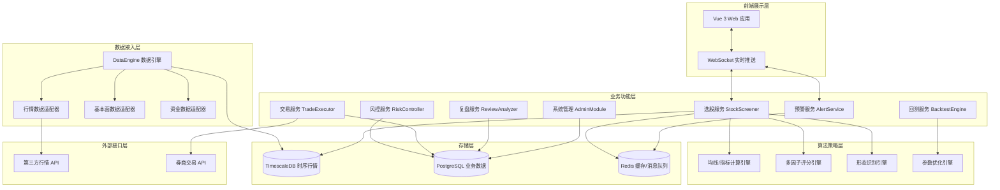
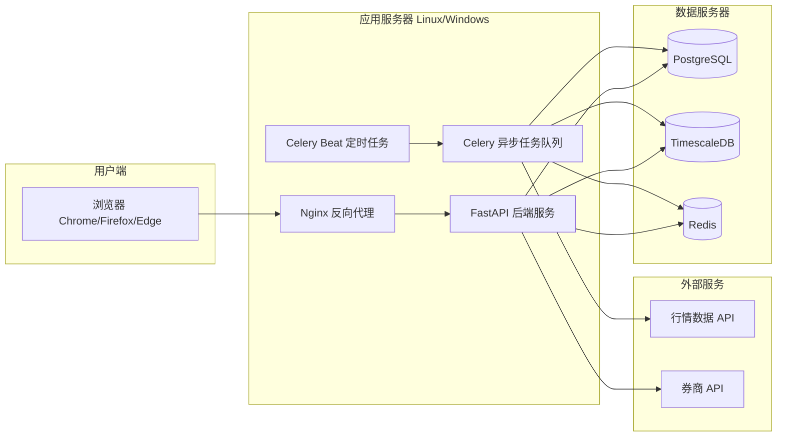

# 技术设计文档：A股右侧股票交易量化选股系统

## 概述

本系统是专为A股市场设计的专业量化右侧交易选股平台，遵循"大盘趋势向好→板块强势共振→个股趋势突破→量价资金配合→风控校验放行"的核心交易逻辑，实现从数据接入、多因子选股、风险控制、策略回测、实盘交易到复盘分析的完整闭环。

系统采用前后端分离架构，后端以 Python 为主语言，前端采用 Vue 3 + TypeScript，数据层结合时序数据库（TimescaleDB/InfluxDB）与关系型数据库（PostgreSQL），通过消息队列（Redis Pub/Sub）实现实时数据推送。

---

## 架构

### 整体分层架构



### 部署架构



---

## 组件与接口

### 1. DataEngine（数据引擎）

负责所有外部数据的接入、清洗、存储。

**核心接口：**

```python
class DataEngine:
    async def fetch_kline(symbol: str, freq: str, start: date, end: date) -> list[KlineBar]
    async def fetch_fundamentals(symbol: str) -> FundamentalsData
    async def fetch_money_flow(symbol: str, date: date) -> MoneyFlowData
    async def fetch_market_overview(date: date) -> MarketOverview
    def clean_and_store(raw_data: RawData) -> CleanResult
    def get_adjusted_price(symbol: str, adj_type: AdjType) -> list[KlineBar]
```

**数据清洗规则执行器：**

```python
class StockFilter:
    def is_excluded(symbol: str) -> tuple[bool, str]  # (是否剔除, 原因)
    def get_permanent_blacklist() -> set[str]
```

### 2. StockScreener（选股引擎）

多因子选股核心，包含均线、指标、形态、量价、资金五个子模块。

**核心接口：**

```python
class StockScreener:
    def screen_eod(strategy: StrategyConfig, date: date) -> ScreenResult
    def screen_realtime(strategy: StrategyConfig) -> ScreenResult
    def score_ma_trend(symbol: str, date: date) -> float  # 0-100
    def detect_breakout(symbol: str, date: date) -> BreakoutSignal | None
    def check_volume_price(symbol: str, date: date) -> VolumePriceSignal
    def check_money_flow(symbol: str, date: date) -> MoneyFlowSignal
```

**策略配置结构：**

```python
class StrategyConfig:
    factors: list[FactorCondition]   # 因子条件列表
    logic: Literal["AND", "OR"]      # 逻辑运算
    weights: dict[str, float]        # 因子权重
    ma_periods: list[int]            # 均线周期
    indicator_params: dict           # 指标参数
```

### 3. RiskController（风控引擎）

事前、事中、事后三层风控。

**核心接口：**

```python
class RiskController:
    def check_market_risk(date: date) -> MarketRiskLevel
    def check_position_limit(symbol: str, amount: float, portfolio: Portfolio) -> RiskCheckResult
    def check_stop_loss(position: Position, current_price: float) -> StopSignal | None
    def monitor_strategy_health(strategy_id: str) -> StrategyHealthReport
    def add_to_blacklist(symbol: str, reason: str) -> None
    def add_to_whitelist(symbol: str) -> None
```

### 4. BacktestEngine（回测引擎）

历史回测、参数优化、过拟合检测。

**核心接口：**

```python
class BacktestEngine:
    def run_backtest(config: BacktestConfig) -> BacktestResult
    def run_segment_backtest(config: BacktestConfig, segments: list[MarketSegment]) -> dict[str, BacktestResult]
    def grid_search(param_grid: dict, base_config: BacktestConfig) -> list[ParamResult]
    def genetic_optimize(param_space: dict, base_config: BacktestConfig) -> ParamResult
    def detect_overfitting(train_result: BacktestResult, test_result: BacktestResult) -> OverfitReport
```

### 5. TradeExecutor（交易执行）

委托下单、持仓管理、券商接口对接。

**核心接口：**

```python
class TradeExecutor:
    async def submit_order(order: OrderRequest) -> OrderResponse
    async def cancel_order(order_id: str) -> CancelResponse
    async def get_positions() -> list[Position]
    async def get_orders(start: datetime, end: datetime) -> list[Order]
    def register_condition_order(condition: ConditionOrder) -> str
    def switch_mode(mode: Literal["live", "paper"]) -> None
```

### 6. AlertService（预警服务）

实时预警推送，基于 WebSocket + Redis Pub/Sub。

**核心接口：**

```python
class AlertService:
    async def push_alert(user_id: str, alert: Alert) -> None
    def register_threshold(user_id: str, config: AlertConfig) -> None
    async def broadcast_screen_result(result: ScreenResult) -> None
```

### 7. ReviewAnalyzer（复盘分析）

**核心接口：**

```python
class ReviewAnalyzer:
    def generate_daily_review(date: date) -> DailyReview
    def generate_strategy_report(strategy_id: str, period: ReportPeriod) -> StrategyReport
    def generate_market_review(date: date) -> MarketReview
```

### 8. AdminModule（系统管理）

**核心接口：**

```python
class AdminModule:
    def create_user(user: UserCreate) -> User
    def assign_role(user_id: str, role: Role) -> None
    def get_system_health() -> SystemHealth
    def backup_data(target: str) -> BackupResult
```

---

## 数据模型

### 行情数据（TimescaleDB）

```sql
-- K线数据（超表，按时间分区）
CREATE TABLE kline (
    time        TIMESTAMPTZ NOT NULL,
    symbol      VARCHAR(10) NOT NULL,
    freq        VARCHAR(5)  NOT NULL,  -- '1m','5m','15m','30m','60m','1d','1w','1M'
    open        NUMERIC(12,4),
    high        NUMERIC(12,4),
    low         NUMERIC(12,4),
    close       NUMERIC(12,4),
    volume      BIGINT,
    amount      NUMERIC(18,2),
    turnover    NUMERIC(8,4),   -- 换手率 %
    vol_ratio   NUMERIC(8,4),   -- 量比
    limit_up    NUMERIC(12,4),  -- 涨停价
    limit_down  NUMERIC(12,4),  -- 跌停价
    adj_type    SMALLINT DEFAULT 0  -- 0=不复权 1=前复权 2=后复权
);
SELECT create_hypertable('kline', 'time');
CREATE INDEX ON kline (symbol, freq, time DESC);
```

### 业务数据（PostgreSQL）

```sql
-- 股票基础信息
CREATE TABLE stock_info (
    symbol          VARCHAR(10) PRIMARY KEY,
    name            VARCHAR(50),
    market          VARCHAR(10),  -- SH/SZ/BJ
    board           VARCHAR(10),  -- 主板/创业板/科创板/北交所
    list_date       DATE,
    is_st           BOOLEAN DEFAULT FALSE,
    is_delisted     BOOLEAN DEFAULT FALSE,
    pledge_ratio    NUMERIC(6,2),
    pe_ttm          NUMERIC(10,2),
    pb              NUMERIC(10,2),
    roe             NUMERIC(8,4),
    market_cap      NUMERIC(20,2),
    updated_at      TIMESTAMPTZ
);

-- 永久剔除名单
CREATE TABLE permanent_exclusion (
    symbol      VARCHAR(10) PRIMARY KEY,
    reason      VARCHAR(50),  -- 'ST','DELISTED','NEW_STOCK'
    created_at  TIMESTAMPTZ DEFAULT NOW()
);

-- 选股策略模板
CREATE TABLE strategy_template (
    id          UUID PRIMARY KEY DEFAULT gen_random_uuid(),
    user_id     UUID NOT NULL,
    name        VARCHAR(100),
    config      JSONB NOT NULL,   -- StrategyConfig 序列化
    is_active   BOOLEAN DEFAULT FALSE,
    created_at  TIMESTAMPTZ DEFAULT NOW(),
    updated_at  TIMESTAMPTZ DEFAULT NOW(),
    CONSTRAINT max_strategies CHECK (
        (SELECT COUNT(*) FROM strategy_template WHERE user_id = strategy_template.user_id) <= 20
    )
);

-- 选股结果
CREATE TABLE screen_result (
    id              UUID PRIMARY KEY DEFAULT gen_random_uuid(),
    strategy_id     UUID REFERENCES strategy_template(id),
    screen_time     TIMESTAMPTZ NOT NULL,
    screen_type     VARCHAR(10),  -- 'EOD' | 'REALTIME'
    symbol          VARCHAR(10),
    ref_buy_price   NUMERIC(12,4),
    trend_score     NUMERIC(5,2),
    risk_level      VARCHAR(10),  -- 'LOW'|'MEDIUM'|'HIGH'
    signals         JSONB,        -- 触发的信号详情
    created_at      TIMESTAMPTZ DEFAULT NOW()
);

-- 黑白名单
CREATE TABLE stock_list (
    symbol      VARCHAR(10) NOT NULL,
    list_type   VARCHAR(10) NOT NULL,  -- 'BLACK'|'WHITE'
    user_id     UUID NOT NULL,
    reason      VARCHAR(200),
    created_at  TIMESTAMPTZ DEFAULT NOW(),
    PRIMARY KEY (symbol, list_type, user_id)
);

-- 回测配置与结果
CREATE TABLE backtest_run (
    id              UUID PRIMARY KEY DEFAULT gen_random_uuid(),
    strategy_id     UUID REFERENCES strategy_template(id),
    user_id         UUID NOT NULL,
    start_date      DATE,
    end_date        DATE,
    initial_capital NUMERIC(18,2),
    commission_buy  NUMERIC(8,6) DEFAULT 0.0003,
    commission_sell NUMERIC(8,6) DEFAULT 0.0013,
    slippage        NUMERIC(8,6) DEFAULT 0.001,
    status          VARCHAR(20),  -- 'PENDING'|'RUNNING'|'DONE'|'FAILED'
    result          JSONB,        -- BacktestResult 序列化
    created_at      TIMESTAMPTZ DEFAULT NOW()
);

-- 委托记录
CREATE TABLE trade_order (
    id              UUID PRIMARY KEY DEFAULT gen_random_uuid(),
    user_id         UUID NOT NULL,
    symbol          VARCHAR(10),
    order_type      VARCHAR(20),  -- 'LIMIT'|'MARKET'|'CONDITION'
    direction       VARCHAR(5),   -- 'BUY'|'SELL'
    price           NUMERIC(12,4),
    quantity        INTEGER,
    status          VARCHAR(20),  -- 'PENDING'|'FILLED'|'CANCELLED'|'REJECTED'
    broker_order_id VARCHAR(50),
    mode            VARCHAR(10),  -- 'LIVE'|'PAPER'
    submitted_at    TIMESTAMPTZ,
    filled_at       TIMESTAMPTZ,
    filled_price    NUMERIC(12,4),
    filled_qty      INTEGER,
    created_at      TIMESTAMPTZ DEFAULT NOW()
);

-- 持仓
CREATE TABLE position (
    id              UUID PRIMARY KEY DEFAULT gen_random_uuid(),
    user_id         UUID NOT NULL,
    symbol          VARCHAR(10),
    quantity        INTEGER,
    cost_price      NUMERIC(12,4),
    mode            VARCHAR(10),
    updated_at      TIMESTAMPTZ DEFAULT NOW(),
    UNIQUE (user_id, symbol, mode)
);

-- 用户
CREATE TABLE app_user (
    id          UUID PRIMARY KEY DEFAULT gen_random_uuid(),
    username    VARCHAR(50) UNIQUE NOT NULL,
    password_hash VARCHAR(128) NOT NULL,
    role        VARCHAR(30),  -- 'TRADER'|'ADMIN'|'READONLY'
    is_active   BOOLEAN DEFAULT TRUE,
    created_at  TIMESTAMPTZ DEFAULT NOW()
);

-- 操作日志
CREATE TABLE audit_log (
    id          BIGSERIAL PRIMARY KEY,
    user_id     UUID,
    action      VARCHAR(100),
    target      VARCHAR(200),
    detail      JSONB,
    ip_addr     INET,
    created_at  TIMESTAMPTZ DEFAULT NOW()
);
```

### 核心 Python 数据类

```python
from dataclasses import dataclass, field
from datetime import date, datetime
from decimal import Decimal
from typing import Literal
from uuid import UUID

@dataclass
class KlineBar:
    time: datetime
    symbol: str
    freq: str
    open: Decimal
    high: Decimal
    low: Decimal
    close: Decimal
    volume: int
    amount: Decimal
    turnover: Decimal
    vol_ratio: Decimal

@dataclass
class ScreenResult:
    strategy_id: UUID
    screen_time: datetime
    screen_type: Literal["EOD", "REALTIME"]
    items: list["ScreenItem"]

@dataclass
class ScreenItem:
    symbol: str
    ref_buy_price: Decimal
    trend_score: float       # 0-100
    risk_level: Literal["LOW", "MEDIUM", "HIGH"]
    signals: dict            # 触发信号详情

@dataclass
class BacktestResult:
    annual_return: float
    total_return: float
    win_rate: float
    profit_loss_ratio: float
    max_drawdown: float
    sharpe_ratio: float
    calmar_ratio: float
    total_trades: int
    avg_holding_days: float
    equity_curve: list[tuple[date, float]]
    trade_records: list[dict]

@dataclass
class RiskCheckResult:
    passed: bool
    reason: str | None = None

@dataclass
class Position:
    symbol: str
    quantity: int
    cost_price: Decimal
    current_price: Decimal
    market_value: Decimal
    pnl: Decimal
    pnl_pct: float
    weight: float            # 仓位占比

@dataclass
class OrderRequest:
    symbol: str
    direction: Literal["BUY", "SELL"]
    order_type: Literal["LIMIT", "MARKET"]
    price: Decimal | None
    quantity: int
    stop_loss: Decimal | None = None
    take_profit: Decimal | None = None
```

---

## 正确性属性

*属性（Property）是在系统所有有效执行中都应成立的特征或行为——本质上是对系统应做什么的形式化陈述。属性是人类可读规范与机器可验证正确性保证之间的桥梁。*

### 属性 1：数据清洗过滤不变量

*对任意*股票集合，经过 DataEngine 清洗过滤后，结果集中不应包含 ST 股、\*ST 股、退市整理股、停牌股、上市未满 20 个交易日的次新股、质押率超过 70% 的个股、净利润同比亏损超过 50% 的个股，以及永久剔除名单中的所有股票。

**验证需求：2.1, 2.6**

---

### 属性 2：复权处理连续性不变量

*对任意*股票的历史 K 线数据，在前复权模式下，除权日前后的价格序列应保持连续（无因除权产生的价格跳空），即除权日前一日的复权收盘价应等于除权日后的复权开盘价乘以相应复权因子。

**验证需求：2.2**

---

### 属性 3：缺失值插值完整性

*对任意*含有缺失值的行情数据序列，经过线性插值处理后，结果序列中不应存在缺失值，且所有插值点的数值应在其相邻两个有效数据点的线性范围内（即 min(left, right) ≤ interpolated ≤ max(left, right)）。

**验证需求：2.3**

---

### 属性 4：归一化范围不变量

*对任意*因子数据集合，经过归一化处理后，所有数值应落在统一量纲范围内（如 [0, 1] 或 [-1, 1]），且归一化操作不改变数据的相对排序关系。

**验证需求：2.5**

---

### 属性 5：均线计算正确性

*对任意*股票价格序列和自定义均线周期 N，系统计算的第 t 日 N 日均线值应等于第 t-N+1 日至第 t 日收盘价的算术平均值，误差不超过 0.01%。

**验证需求：3.1**

---

### 属性 6：趋势打分范围与初选池阈值不变量

*对任意*股票，系统生成的趋势打分应始终在 [0, 100] 范围内；且初选池中的所有股票趋势打分应大于等于当前有效阈值（正常市场为 80 分，大盘跌破 20 日均线时为 90 分）。

**验证需求：3.3, 3.4, 9.1**

---

### 属性 7：技术指标信号生成正确性

*对任意*股票价格序列和指标参数配置，当且仅当数据满足对应指标的信号条件时，系统才应生成该信号：MACD 金叉信号要求 DIF 和 DEA 均在零轴上方且 DIF 上穿 DEA；BOLL 突破信号要求股价站稳中轨并向上触碰上轨且布林带开口向上；RSI 强势信号要求 RSI 值在 [50, 80] 区间内且无超买背离。

**验证需求：4.2, 4.3, 4.4**

---

### 属性 8：多因子逻辑运算正确性

*对任意*因子条件组合和逻辑运算符（AND/OR），选股结果应与布尔逻辑完全一致：AND 模式下，结果中的每只股票应满足所有因子条件；OR 模式下，结果中的每只股票应至少满足一个因子条件。

**验证需求：4.5, 7.1**

---

### 属性 9：突破有效性判定

*对任意*股票数据，有效突破信号的生成应同时满足：收盘价突破压力位，且当日成交量大于等于近 20 日均量的 1.5 倍；若突破后次日收盘价未能站稳突破位，该信号应被撤销并标记为假突破；成交量低于近 20 日均量 1.5 倍的突破不应生成买入信号。

**验证需求：5.2, 5.3, 5.4**

---

### 属性 10：量价资金筛选不变量

*对任意*选股结果集合，其中所有股票应满足：换手率在 [3%, 15%] 区间内；不存在量价背离（价涨量缩或价跌量增异常）或高位放量滞涨形态；近 20 日日均成交额不低于 5000 万元。

**验证需求：6.1, 6.2, 6.6**

---

### 属性 11：资金信号生成正确性

*对任意*股票的资金流向数据，当且仅当主力资金单日净流入大于等于 1000 万且连续 2 日净流入时，系统才应生成资金流入信号；当且仅当大单成交占比大于 30% 时，系统才应标记大单活跃信号。

**验证需求：6.3, 6.4**

---

### 属性 12：选股结果字段完整性

*对任意*选股结果中的每条记录，应包含且不限于以下字段：股票代码、买入参考价、趋势强度评分（0-100）、风险等级（LOW/MEDIUM/HIGH）；且这些字段均不为空。

**验证需求：7.6**

---

### 属性 13：策略模板数量上限与序列化 round-trip

*对任意*用户，其保存的策略模板数量不应超过 20 套；且对任意策略配置对象，将其序列化为 JSON 后再反序列化，应得到与原始配置完全等价的对象（所有字段值相等）。

**验证需求：7.2**

---

### 属性 14：预警触发正确性

*对任意*用户的预警阈值配置，当且仅当股票满足用户配置的阈值条件时，系统才应生成对应预警；不满足阈值的股票不应触发预警。

**验证需求：8.1, 8.2**

---

### 属性 15：大盘风控状态转换

*对任意*大盘指数数据，当上证指数或创业板指跌破 20 日均线时，初选池趋势打分阈值应自动从 80 分提升至 90 分；当跌破 60 日均线时，选股结果中不应包含任何买入信号，直至指数重新站上 60 日均线。

**验证需求：9.1, 9.2**

---

### 属性 16：个股风控过滤正确性

*对任意*选股结果，不应包含当日涨幅超过 9% 的个股，也不应包含连续 3 个交易日累计涨幅超过 20% 的个股。

**验证需求：9.3, 9.4**

---

### 属性 17：黑名单不变量

*对任意*选股结果，黑名单中的股票不应出现在任何选股结果中，无论策略配置如何；白名单中的股票不受弱势板块过滤规则影响。

**验证需求：9.5**

---

### 属性 18：仓位限制不变量

*对任意*持仓状态和新增买入委托，当单只个股持仓仓位将超过总资产 15% 时，系统应拒绝该委托；当单一板块持仓仓位将超过总资产 30% 时，系统应拒绝该板块的新增买入委托。

**验证需求：10.1, 10.2**

---

### 属性 19：止损触发正确性

*对任意*持仓和价格序列：固定比例止损应在持仓亏损达到设定比例（5%/8%/10%）时触发预警；移动止损应在价格从持仓期间最高价回撤达到设定比例（3%/5%）时触发预警；趋势止损应在收盘价跌破用户指定关键均线时触发预警。

**验证需求：11.1, 11.2, 11.3**

---

### 属性 20：回测 T+1 规则不变量

*对任意*回测结果的交易记录，不应存在同一标的在同一交易日既有买入成交又有卖出成交的记录（严格遵守 A 股 T+1 规则）。

**验证需求：12.5**

---

### 属性 21：回测绩效指标完整性

*对任意*完成的回测任务，其结果应包含全部 9 项绩效指标：年化收益率、累计收益率、胜率、盈亏比、最大回撤、夏普比率、卡玛比率、总交易次数、平均持仓天数，且所有指标值应在数学上合理的范围内（如胜率在 [0,1]，最大回撤在 [0,1]）。

**验证需求：12.2**

---

### 属性 22：回测手续费计算正确性

*对任意*回测配置中的手续费率和滑点参数，回测结果中每笔交易的实际成本应等于成交金额乘以对应费率加上滑点成本，误差不超过 0.01%。

**验证需求：12.1**

---

### 属性 23：数据集划分比例

*对任意*历史数据集，按时间顺序划分后，训练集应包含前 70% 的数据，测试集应包含后 30% 的数据，两个数据集不应有时间重叠。

**验证需求：13.3**

---

### 属性 24：过拟合检测正确性

*对任意*训练集和测试集的回测结果，当且仅当测试集收益率与训练集收益率的偏差超过 20% 时，系统才应判定为过拟合并输出警告。

**验证需求：13.4**

---

### 属性 25：条件单触发正确性

*对任意*条件单配置和价格序列，条件单应在且仅在触发条件满足时自动提交委托：突破买入单在价格突破指定价位时触发；止损卖出单在价格跌破止损价时触发；止盈卖出单在价格达到止盈价时触发；移动止盈单在价格从最高点回撤达到设定比例时触发。

**验证需求：14.2**

---

### 属性 26：非交易时段委托拒绝

*对任意*在非交易时段（非 9:25-15:00）提交的实时委托请求，系统应拒绝该请求并返回明确的错误提示，不应将委托提交至券商接口。

**验证需求：14.5**

---

### 属性 27：持仓盈亏计算正确性

*对任意*持仓记录，系统展示的盈亏金额应等于（当前价格 - 成本价）× 持仓股数，盈亏比例应等于盈亏金额 / (成本价 × 持仓股数)，误差不超过 0.01%。

**验证需求：15.1**

---

### 属性 28：交易记录 round-trip

*对任意*提交并成交的委托，该委托记录应能通过交易流水查询接口检索到，且查询结果中的委托信息（股票代码、方向、价格、数量、状态）应与原始提交信息完全一致。

**验证需求：15.3**

---

### 属性 29：角色权限不变量

*对任意*用户请求，只读观察员角色不应能访问交易功能（下单、撤单、持仓修改）；量化交易员角色不应能访问系统管理功能（用户管理、系统配置）；权限控制应对所有 API 端点生效，不仅限于前端界面。

**验证需求：17.1, 19.4**

---

### 属性 30：操作日志 round-trip

*对任意*用户执行的操作（选股、交易、回测、系统管理），该操作应在日志中留有记录，且日志记录应包含操作人、操作时间、操作类型、操作对象四个字段，均不为空。

**验证需求：17.2, 17.5**

---

### 属性 31：数据备份恢复 round-trip

*对任意*系统数据状态，执行备份后再执行恢复操作，恢复后的数据应与备份时的数据完全一致（策略模板、用户配置、交易记录等关键数据无丢失或篡改）。

**验证需求：17.4**

---

## 错误处理

### 数据层错误

| 错误场景 | 处理策略 |
|---|---|
| 行情数据接口超时/断连 | 自动重试（指数退避，最多 3 次），超时后切换备用数据源，推送系统告警 |
| 数据格式异常/字段缺失 | 记录错误日志，跳过该条数据，不影响其他数据处理 |
| 时序数据库写入失败 | 写入 Redis 缓冲队列，异步重试，保证数据最终一致性 |
| 除权数据缺失 | 标记该股票复权数据不可用，选股时跳过该股票并记录警告 |

### 选股层错误

| 错误场景 | 处理策略 |
|---|---|
| 因子计算数值溢出/NaN | 将该因子得分置为 0，不影响其他因子计算，记录警告日志 |
| 选股超时（>3s/1s） | 返回已计算完成的部分结果，标注"结果不完整"，推送性能告警 |
| 策略配置参数非法 | 返回 400 错误，提示具体非法字段，拒绝执行选股 |

### 风控层错误

| 错误场景 | 处理策略 |
|---|---|
| 大盘指数数据获取失败 | 保持上一次风控状态，推送"风控数据异常"告警，不自动放宽风控 |
| 仓位数据同步延迟 | 使用缓存仓位数据进行风控校验，标注"仓位数据可能延迟" |

### 交易层错误

| 错误场景 | 处理策略 |
|---|---|
| 券商 API 连接失败 | 拒绝所有委托提交，推送"交易接口异常"告警，不进入模拟盘 |
| 委托被券商拒绝 | 记录拒绝原因，推送通知给用户，不自动重试 |
| 条件单监控服务异常 | 推送告警，暂停条件单自动触发，要求用户手动确认 |
| 非交易时段委托 | 返回明确错误码（`OUTSIDE_TRADING_HOURS`），不提交至券商 |

### 回测层错误

| 错误场景 | 处理策略 |
|---|---|
| 历史数据不足（<回测周期） | 返回错误提示，说明可用数据范围，拒绝执行回测 |
| 参数优化超时 | 返回已完成的参数组合结果，标注"优化未完成" |
| 遗传算法不收敛 | 设置最大迭代次数（默认 1000 次），超出后返回当前最优结果 |

---

## 测试策略

### 双轨测试方法

本系统采用单元测试与属性测试相结合的双轨方法：
- **单元测试**：验证具体示例、边界条件、错误处理
- **属性测试**：验证普遍性属性，通过随机生成大量输入覆盖边界情况

两者互补，共同保障系统正确性。

### 技术栈

| 测试类型 | 工具 |
|---|---|
| 单元测试 | pytest |
| 属性测试 | Hypothesis（Python PBT 库） |
| API 集成测试 | pytest + httpx |
| 前端测试 | Vitest + Vue Test Utils |
| 性能测试 | Locust |

### 属性测试配置

每个属性测试使用 Hypothesis 框架，最少运行 100 次迭代（`@settings(max_examples=100)`）。每个属性测试必须通过注释标注对应的设计文档属性编号：

```python
# Feature: a-share-quant-trading-system, Property 1: 数据清洗过滤不变量
@settings(max_examples=200)
@given(stocks=st.lists(stock_strategy(), min_size=1, max_size=100))
def test_data_cleaning_invariant(stocks):
    result = DataEngine.clean(stocks)
    for stock in result:
        assert not stock.is_st
        assert not stock.is_delisted
        assert stock.pledge_ratio <= 0.70
        assert stock.symbol not in permanent_blacklist()
```

### 各模块测试重点

**DataEngine（数据引擎）**
- 属性测试：属性 1（清洗过滤）、属性 2（复权连续性）、属性 3（插值完整性）、属性 4（归一化范围）
- 单元测试：各数据适配器的解析逻辑、除权因子计算示例

**StockScreener（选股引擎）**
- 属性测试：属性 5（均线计算）、属性 6（打分范围）、属性 7（指标信号）、属性 8（逻辑运算）、属性 9（突破判定）、属性 10（量价筛选）、属性 11（资金信号）、属性 12（字段完整性）、属性 13（策略序列化）
- 单元测试：箱体突破识别示例、均线支撑形态识别示例、策略切换示例

**RiskController（风控引擎）**
- 属性测试：属性 14（预警触发）、属性 15（大盘风控）、属性 16（个股过滤）、属性 17（黑名单）、属性 18（仓位限制）、属性 19（止损触发）
- 单元测试：大盘跌破均线的边界示例、仓位恰好达到上限的边界示例

**BacktestEngine（回测引擎）**
- 属性测试：属性 20（T+1 规则）、属性 21（指标完整性）、属性 22（手续费计算）、属性 23（数据集划分）、属性 24（过拟合检测）
- 单元测试：已知历史数据的回测结果验证、分段回测示例

**TradeExecutor（交易执行）**
- 属性测试：属性 25（条件单触发）、属性 26（非交易时段拒绝）、属性 27（盈亏计算）、属性 28（交易记录 round-trip）
- 单元测试：一键下单带入参考价示例、二次验证拒绝示例

**AdminModule（系统管理）**
- 属性测试：属性 29（角色权限）、属性 30（操作日志）、属性 31（备份恢复）
- 单元测试：系统异常报警示例、用户权限分配示例

### 性能测试

使用 Locust 模拟 50 并发用户，验证：
- 盘后选股接口响应时间 ≤ 3 秒（P99）
- 实时选股刷新接口响应时间 ≤ 1 秒（P99）
- 普通页面操作响应时间 ≤ 500ms（P99）

### 集成测试

- 数据接入 → 选股 → 风控 → 预警全链路集成测试
- 选股 → 下单 → 持仓同步全链路集成测试
- 回测 → 参数优化 → 过拟合检测全链路集成测试
