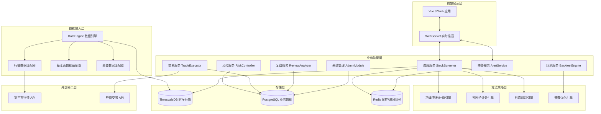
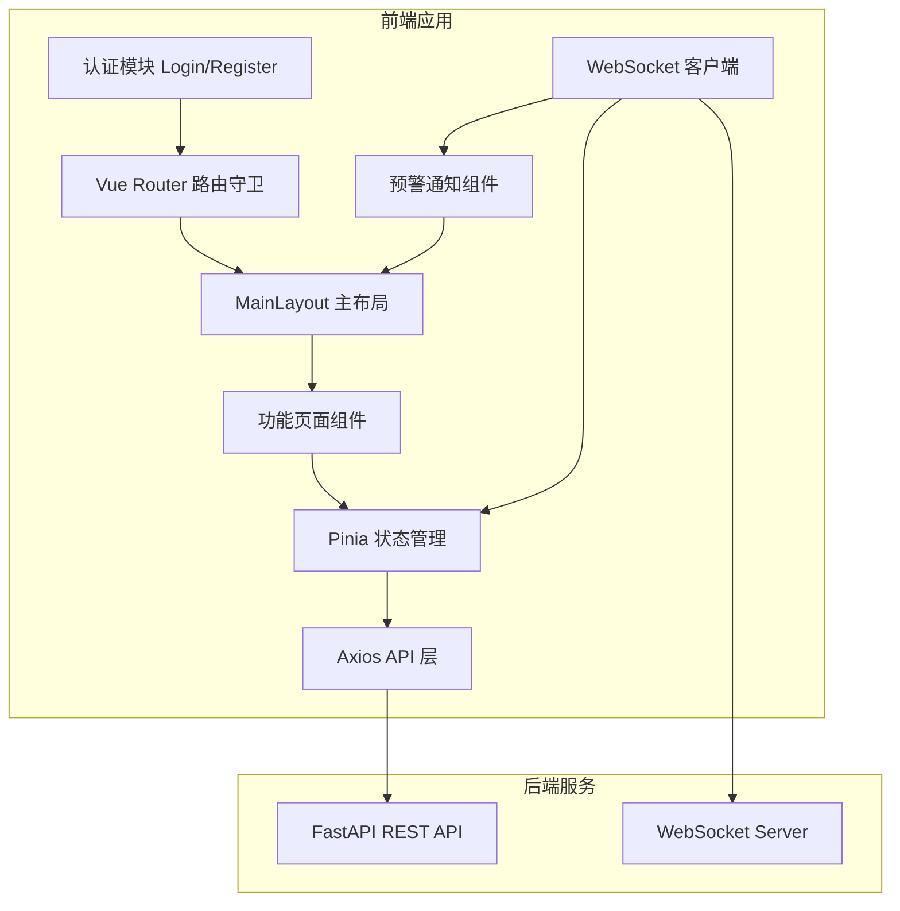

# 技术设计文档：A股右侧股票交易量化选股系统

## 概述

本系统是专为A股市场设计的专业量化右侧交易选股平台，遵循"大盘趋势向好→板块强势共振→个股趋势突破→量价资金配合→风控校验放行"的核心交易逻辑，实现从数据接入、多因子选股、风险控制、策略回测、实盘交易到复盘分析的完整闭环。

系统采用前后端分离架构，后端以 Python 为主语言，前端采用 Vue 3 + TypeScript，数据层结合时序数据库（TimescaleDB/InfluxDB）与关系型数据库（PostgreSQL），通过消息队列（Redis Pub/Sub）实现实时数据推送。

---

## 架构

### 整体分层架构



### 部署架构

```mermaid
graph LR
    subgraph 用户端
        Browser[浏览器 Chrome/Firefox/Edge]
    end

    subgraph 应用服务器 Linux/Windows
        Nginx[Nginx 反向代理]
        FastAPI[FastAPI 后端服务]
        Celery[Celery 异步任务队列]
        Beat[Celery Beat 定时任务]
    end

    subgraph 数据服务器
        PG[(PostgreSQL)]
        TS[(TimescaleDB)]
        Redis[(Redis)]
    end

    subgraph 外部服务
        DataAPI[行情数据 API]
        BrokerAPI[券商 API]
    end

    Browser --> Nginx
    Nginx --> FastAPI
    FastAPI --> PG
    FastAPI --> TS
    FastAPI --> Redis
    Celery --> TS
    Celery --> PG
    Celery --> Redis
    Beat --> Celery
    Celery --> DataAPI
    FastAPI --> BrokerAPI
```



---

## 组件与接口

### 1. DataEngine（数据引擎）

负责所有外部数据的接入、清洗、存储。

**核心接口：**

```python
class DataEngine:
    async def fetch_kline(symbol: str, freq: str, start: date, end: date) -> list[KlineBar]
    async def fetch_fundamentals(symbol: str) -> FundamentalsData
    async def fetch_money_flow(symbol: str, date: date) -> MoneyFlowData
    async def fetch_market_overview(date: date) -> MarketOverview
    def clean_and_store(raw_data: RawData) -> CleanResult
    def get_adjusted_price(symbol: str, adj_type: AdjType) -> list[KlineBar]
```

**数据清洗规则执行器：**

```python
class StockFilter:
    def is_excluded(symbol: str) -> tuple[bool, str]  # (是否剔除, 原因)
    def get_permanent_blacklist() -> set[str]
```

### 2. StockScreener（选股引擎）

多因子选股核心，包含均线、指标、形态、量价、资金五个子模块。

**核心接口：**

```python
class StockScreener:
    def screen_eod(strategy: StrategyConfig, date: date) -> ScreenResult
    def screen_realtime(strategy: StrategyConfig) -> ScreenResult
    def score_ma_trend(symbol: str, date: date) -> float  # 0-100
    def detect_breakout(symbol: str, date: date) -> BreakoutSignal | None
    def check_volume_price(symbol: str, date: date) -> VolumePriceSignal
    def check_money_flow(symbol: str, date: date) -> MoneyFlowSignal
```

**策略配置结构：**

```python
class StrategyConfig:
    factors: list[FactorCondition]   # 因子条件列表
    logic: Literal["AND", "OR"]      # 逻辑运算
    weights: dict[str, float]        # 因子权重
    ma_periods: list[int]            # 均线周期
    indicator_params: dict           # 指标参数
    ma_trend: MaTrendConfig | None   # 均线趋势配置（需求 3）
    breakout: BreakoutConfig | None  # 形态突破配置（需求 5）
    volume_price: VolumePriceConfig | None  # 量价资金筛选配置（需求 6）
```

**均线趋势配置：**

```python
@dataclass
class MaTrendConfig:
    ma_periods: list[int]            # 均线周期组合，默认 [5,10,20,60,120]
    slope_threshold: float           # 多头排列斜率阈值，默认 0
    trend_score_threshold: int       # 趋势打分阈值，默认 80
    support_ma_lines: list[int]      # 均线支撑回调均线，默认 [20,60]
```

**技术指标参数配置：**

```python
@dataclass
class IndicatorParamsConfig:
    macd_fast: int = 12              # MACD 快线周期
    macd_slow: int = 26              # MACD 慢线周期
    macd_signal: int = 9             # MACD 信号线周期
    boll_period: int = 20            # BOLL 周期
    boll_std_dev: float = 2.0        # BOLL 标准差倍数
    rsi_period: int = 14             # RSI 周期
    rsi_lower: int = 50              # RSI 强势区间下限
    rsi_upper: int = 80              # RSI 强势区间上限
    dma_short: int = 10              # DMA 短期周期
    dma_long: int = 50               # DMA 长期周期
```

**形态突破配置：**

```python
@dataclass
class BreakoutConfig:
    box_breakout: bool = True        # 箱体突破
    high_breakout: bool = True       # 前期高点突破
    trendline_breakout: bool = True  # 下降趋势线突破
    volume_ratio_threshold: float = 1.5  # 量比倍数阈值
    confirm_days: int = 1            # 站稳确认天数
```

**量价资金筛选配置：**

```python
@dataclass
class VolumePriceConfig:
    turnover_rate_min: float = 3.0   # 换手率下限 %
    turnover_rate_max: float = 15.0  # 换手率上限 %
    main_flow_threshold: float = 1000.0  # 主力净流入阈值（万元）
    main_flow_days: int = 2          # 连续净流入天数
    large_order_ratio: float = 30.0  # 大单占比阈值 %
    min_daily_amount: float = 5000.0 # 日均成交额下限（万元）
    sector_rank_top: int = 30        # 板块排名范围
```

### 3. RiskController（风控引擎）

事前、事中、事后三层风控。

**核心接口：**

```python
class RiskController:
    def check_market_risk(date: date) -> MarketRiskLevel
    def check_position_limit(symbol: str, amount: float, portfolio: Portfolio) -> RiskCheckResult
    def check_stop_loss(position: Position, current_price: float) -> StopSignal | None
    def monitor_strategy_health(strategy_id: str) -> StrategyHealthReport
    def add_to_blacklist(symbol: str, reason: str) -> None
    def add_to_whitelist(symbol: str) -> None
```

### 4. BacktestEngine（回测引擎）

历史回测、参数优化、过拟合检测。

**核心接口：**

```python
class BacktestEngine:
    def run_backtest(config: BacktestConfig) -> BacktestResult
    def run_segment_backtest(config: BacktestConfig, segments: list[MarketSegment]) -> dict[str, BacktestResult]
    def grid_search(param_grid: dict, base_config: BacktestConfig) -> list[ParamResult]
    def genetic_optimize(param_space: dict, base_config: BacktestConfig) -> ParamResult
    def detect_overfitting(train_result: BacktestResult, test_result: BacktestResult) -> OverfitReport
```

### 5. TradeExecutor（交易执行）

委托下单、持仓管理、券商接口对接。

**核心接口：**

```python
class TradeExecutor:
    async def submit_order(order: OrderRequest) -> OrderResponse
    async def cancel_order(order_id: str) -> CancelResponse
    async def get_positions() -> list[Position]
    async def get_orders(start: datetime, end: datetime) -> list[Order]
    def register_condition_order(condition: ConditionOrder) -> str
    def switch_mode(mode: Literal["live", "paper"]) -> None
```

### 6. AlertService（预警服务）

实时预警推送，基于 WebSocket + Redis Pub/Sub。

**核心接口：**

```python
class AlertService:
    async def push_alert(user_id: str, alert: Alert) -> None
    def register_threshold(user_id: str, config: AlertConfig) -> None
    async def broadcast_screen_result(result: ScreenResult) -> None
```

### 7. ReviewAnalyzer（复盘分析）

**核心接口：**

```python
class ReviewAnalyzer:
    def generate_daily_review(date: date) -> DailyReview
    def generate_strategy_report(strategy_id: str, period: ReportPeriod) -> StrategyReport
    def generate_market_review(date: date) -> MarketReview
```

### 8. AdminModule（系统管理）

**核心接口：**

```python
class AdminModule:
    def create_user(user: UserCreate) -> User
    def assign_role(user_id: str, role: Role) -> None
    def get_system_health() -> SystemHealth
    def backup_data(target: str) -> BackupResult
```

---

## 数据模型

### 行情数据（TimescaleDB）

```sql
-- K线数据（超表，按时间分区）
CREATE TABLE kline (
    time        TIMESTAMPTZ NOT NULL,
    symbol      VARCHAR(10) NOT NULL,
    freq        VARCHAR(5)  NOT NULL,  -- '1m','5m','15m','30m','60m','1d','1w','1M'
    open        NUMERIC(12,4),
    high        NUMERIC(12,4),
    low         NUMERIC(12,4),
    close       NUMERIC(12,4),
    volume      BIGINT,
    amount      NUMERIC(18,2),
    turnover    NUMERIC(8,4),   -- 换手率 %
    vol_ratio   NUMERIC(8,4),   -- 量比
    limit_up    NUMERIC(12,4),  -- 涨停价
    limit_down  NUMERIC(12,4),  -- 跌停价
    adj_type    SMALLINT DEFAULT 0  -- 0=不复权 1=前复权 2=后复权
);
SELECT create_hypertable('kline', 'time');
CREATE INDEX ON kline (symbol, freq, time DESC);
```

### 业务数据（PostgreSQL）

```sql
-- 股票基础信息
CREATE TABLE stock_info (
    symbol          VARCHAR(10) PRIMARY KEY,
    name            VARCHAR(50),
    market          VARCHAR(10),  -- SH/SZ/BJ
    board           VARCHAR(10),  -- 主板/创业板/科创板/北交所
    list_date       DATE,
    is_st           BOOLEAN DEFAULT FALSE,
    is_delisted     BOOLEAN DEFAULT FALSE,
    pledge_ratio    NUMERIC(6,2),
    pe_ttm          NUMERIC(10,2),
    pb              NUMERIC(10,2),
    roe             NUMERIC(8,4),
    market_cap      NUMERIC(20,2),
    updated_at      TIMESTAMPTZ
);

-- 永久剔除名单
CREATE TABLE permanent_exclusion (
    symbol      VARCHAR(10) PRIMARY KEY,
    reason      VARCHAR(50),  -- 'ST','DELISTED','NEW_STOCK'
    created_at  TIMESTAMPTZ DEFAULT NOW()
);

-- 选股策略模板
CREATE TABLE strategy_template (
    id          UUID PRIMARY KEY DEFAULT gen_random_uuid(),
    user_id     UUID NOT NULL,
    name        VARCHAR(100),
    config      JSONB NOT NULL,   -- StrategyConfig 序列化
    is_active   BOOLEAN DEFAULT FALSE,
    created_at  TIMESTAMPTZ DEFAULT NOW(),
    updated_at  TIMESTAMPTZ DEFAULT NOW(),
    CONSTRAINT max_strategies CHECK (
        (SELECT COUNT(*) FROM strategy_template WHERE user_id = strategy_template.user_id) <= 20
    )
);

-- 选股结果
CREATE TABLE screen_result (
    id              UUID PRIMARY KEY DEFAULT gen_random_uuid(),
    strategy_id     UUID REFERENCES strategy_template(id),
    screen_time     TIMESTAMPTZ NOT NULL,
    screen_type     VARCHAR(10),  -- 'EOD' | 'REALTIME'
    symbol          VARCHAR(10),
    ref_buy_price   NUMERIC(12,4),
    trend_score     NUMERIC(5,2),
    risk_level      VARCHAR(10),  -- 'LOW'|'MEDIUM'|'HIGH'
    signals         JSONB,        -- 触发的信号详情
    created_at      TIMESTAMPTZ DEFAULT NOW()
);

-- 黑白名单
CREATE TABLE stock_list (
    symbol      VARCHAR(10) NOT NULL,
    list_type   VARCHAR(10) NOT NULL,  -- 'BLACK'|'WHITE'
    user_id     UUID NOT NULL,
    reason      VARCHAR(200),
    created_at  TIMESTAMPTZ DEFAULT NOW(),
    PRIMARY KEY (symbol, list_type, user_id)
);

-- 回测配置与结果
CREATE TABLE backtest_run (
    id              UUID PRIMARY KEY DEFAULT gen_random_uuid(),
    strategy_id     UUID REFERENCES strategy_template(id),
    user_id         UUID NOT NULL,
    start_date      DATE,
    end_date        DATE,
    initial_capital NUMERIC(18,2),
    commission_buy  NUMERIC(8,6) DEFAULT 0.0003,
    commission_sell NUMERIC(8,6) DEFAULT 0.0013,
    slippage        NUMERIC(8,6) DEFAULT 0.001,
    status          VARCHAR(20),  -- 'PENDING'|'RUNNING'|'DONE'|'FAILED'
    result          JSONB,        -- BacktestResult 序列化
    created_at      TIMESTAMPTZ DEFAULT NOW()
);

-- 委托记录
CREATE TABLE trade_order (
    id              UUID PRIMARY KEY DEFAULT gen_random_uuid(),
    user_id         UUID NOT NULL,
    symbol          VARCHAR(10),
    order_type      VARCHAR(20),  -- 'LIMIT'|'MARKET'|'CONDITION'
    direction       VARCHAR(5),   -- 'BUY'|'SELL'
    price           NUMERIC(12,4),
    quantity        INTEGER,
    status          VARCHAR(20),  -- 'PENDING'|'FILLED'|'CANCELLED'|'REJECTED'
    broker_order_id VARCHAR(50),
    mode            VARCHAR(10),  -- 'LIVE'|'PAPER'
    submitted_at    TIMESTAMPTZ,
    filled_at       TIMESTAMPTZ,
    filled_price    NUMERIC(12,4),
    filled_qty      INTEGER,
    created_at      TIMESTAMPTZ DEFAULT NOW()
);

-- 持仓
CREATE TABLE position (
    id              UUID PRIMARY KEY DEFAULT gen_random_uuid(),
    user_id         UUID NOT NULL,
    symbol          VARCHAR(10),
    quantity        INTEGER,
    cost_price      NUMERIC(12,4),
    mode            VARCHAR(10),
    updated_at      TIMESTAMPTZ DEFAULT NOW(),
    UNIQUE (user_id, symbol, mode)
);

-- 用户
CREATE TABLE app_user (
    id          UUID PRIMARY KEY DEFAULT gen_random_uuid(),
    username    VARCHAR(50) UNIQUE NOT NULL,
    password_hash VARCHAR(128) NOT NULL,
    role        VARCHAR(30),  -- 'TRADER'|'ADMIN'|'READONLY'
    is_active   BOOLEAN DEFAULT TRUE,
    created_at  TIMESTAMPTZ DEFAULT NOW()
);

-- 操作日志
CREATE TABLE audit_log (
    id          BIGSERIAL PRIMARY KEY,
    user_id     UUID,
    action      VARCHAR(100),
    target      VARCHAR(200),
    detail      JSONB,
    ip_addr     INET,
    created_at  TIMESTAMPTZ DEFAULT NOW()
);
```

### 核心 Python 数据类

```python
from dataclasses import dataclass, field
from datetime import date, datetime
from decimal import Decimal
from typing import Literal
from uuid import UUID

@dataclass
class KlineBar:
    time: datetime
    symbol: str
    freq: str
    open: Decimal
    high: Decimal
    low: Decimal
    close: Decimal
    volume: int
    amount: Decimal
    turnover: Decimal
    vol_ratio: Decimal

@dataclass
class ScreenResult:
    strategy_id: UUID
    screen_time: datetime
    screen_type: Literal["EOD", "REALTIME"]
    items: list["ScreenItem"]

@dataclass
class ScreenItem:
    symbol: str
    ref_buy_price: Decimal
    trend_score: float       # 0-100
    risk_level: Literal["LOW", "MEDIUM", "HIGH"]
    signals: list[dict]      # 触发信号详情，每项含 category/label/is_fake_breakout
    has_fake_breakout: bool   # 是否存在假突破标记

@dataclass
class BacktestResult:
    annual_return: float
    total_return: float
    win_rate: float
    profit_loss_ratio: float
    max_drawdown: float
    sharpe_ratio: float
    calmar_ratio: float
    total_trades: int
    avg_holding_days: float
    equity_curve: list[tuple[date, float]]
    trade_records: list[dict]

@dataclass
class RiskCheckResult:
    passed: bool
    reason: str | None = None

@dataclass
class Position:
    symbol: str
    quantity: int
    cost_price: Decimal
    current_price: Decimal
    market_value: Decimal
    pnl: Decimal
    pnl_pct: float
    weight: float            # 仓位占比

@dataclass
class OrderRequest:
    symbol: str
    direction: Literal["BUY", "SELL"]
    order_type: Literal["LIMIT", "MARKET"]
    price: Decimal | None
    quantity: int
    stop_loss: Decimal | None = None
    take_profit: Decimal | None = None
```

---

## 前端交互界面设计（需求 21）

### 概述

WebUI 是系统面向用户的唯一交互入口，基于 Vue 3 + TypeScript + Pinia 构建的单页应用（SPA）。前端通过 RESTful API 与后端通信，通过 WebSocket 接收实时预警推送。所有页面均需登录认证后方可访问，菜单和操作按钮根据用户角色（TRADER / ADMIN / READONLY）动态渲染。

### 前端架构



### 路由结构与页面映射

| 路由路径 | 页面组件 | 对应需求 | 角色限制 |
|---|---|---|---|
| `/login` | LoginView | 21.1 | 无需认证 |
| `/register` | RegisterView | 21.2 | 无需认证 |
| `/` | MainLayout → DashboardView | 21.4 | 全部角色 |
| `/data` | DataManageView | 21.5 | 全部角色 |
| `/screener` | ScreenerView | 21.6, 21.8–21.14 | 全部角色 |
| `/screener/results` | ScreenerResultsView | 21.7, 21.15 | 全部角色 |
| `/risk` | RiskView | 21.16 | 全部角色 |
| `/backtest` | BacktestView | 21.17 | 全部角色 |
| `/trade` | TradeView | 21.18 | TRADER, ADMIN |
| `/positions` | PositionsView | 21.19 | TRADER, ADMIN |
| `/review` | ReviewView | 21.20 | 全部角色 |
| `/admin` | AdminView | 21.21 | ADMIN |

### 前端组件与接口

#### 1. 认证模块（LoginView / RegisterView）

负责用户登录、注册、Token 管理。

```typescript
// 登录接口
interface LoginRequest {
  username: string
  password: string
}
interface LoginResponse {
  access_token: string
  user: { id: string; username: string; role: UserRole }
}

// 注册接口
interface RegisterRequest {
  username: string
  password: string
}
interface RegisterResponse {
  id: string
  username: string
  role: UserRole
}

// 密码强度校验规则
interface PasswordValidation {
  minLength: 8           // 最少 8 位
  hasUppercase: boolean   // 包含大写字母
  hasLowercase: boolean   // 包含小写字母
  hasDigit: boolean       // 包含数字
}
```

LoginView 行为：
- 提交用户名密码调用 `POST /api/v1/auth/login`
- 成功后将 `access_token` 存入 localStorage，跳转至主页面
- 失败时在表单下方显示错误提示（如"用户名或密码错误"）

RegisterView 行为：
- 用户名输入时实时调用 `GET /api/v1/auth/check-username?username=xxx` 校验唯一性
- 密码输入时实时校验强度并显示校验结果（✓/✗ 标记）
- 提交调用 `POST /api/v1/auth/register`，成功后跳转至登录页

#### 2. 主布局框架（MainLayout）

统一的页面骨架，包含顶部导航栏、侧边菜单栏、主内容区域。

```typescript
// 导航菜单项定义
interface NavItem {
  path: string
  label: string
  icon: string
  roles?: UserRole[]  // 为空表示所有角色可见
  group: '数据' | '选股' | '风控' | '交易' | '分析' | '系统'
}

// 菜单分组
const menuGroups: Record<string, NavItem[]> = {
  '数据': [
    { path: '/dashboard', label: '大盘概况', icon: '📊', group: '数据' },
    { path: '/data', label: '数据管理', icon: '💾', group: '数据' },
  ],
  '选股': [
    { path: '/screener', label: '智能选股', icon: '🔍', group: '选股' },
    { path: '/screener/results', label: '选股结果', icon: '📋', group: '选股' },
  ],
  '风控': [
    { path: '/risk', label: '风险控制', icon: '🛡️', group: '风控' },
  ],
  '交易': [
    { path: '/trade', label: '交易执行', icon: '💹', roles: ['TRADER', 'ADMIN'], group: '交易' },
    { path: '/positions', label: '持仓管理', icon: '💰', roles: ['TRADER', 'ADMIN'], group: '交易' },
  ],
  '分析': [
    { path: '/backtest', label: '策略回测', icon: '📈', group: '分析' },
    { path: '/review', label: '复盘分析', icon: '📝', group: '分析' },
  ],
  '系统': [
    { path: '/admin', label: '系统管理', icon: '⚙️', roles: ['ADMIN'], group: '系统' },
  ],
}
```

MainLayout 行为：
- 侧边菜单按 `group` 分组渲染，组内菜单项根据当前用户角色过滤（`roles` 字段）
- 顶部导航栏右侧显示预警通知铃铛（含未读数 badge）和用户信息/退出按钮
- 预警通知铃铛点击展开通知面板，显示最近预警列表
- 主内容区域通过 `<router-view />` 渲染子路由页面

#### 3. 数据管理页面（DataManageView）

```typescript
// 数据同步状态
interface SyncStatus {
  source: string          // 数据源名称
  last_sync_at: string    // 最后同步时间
  status: 'OK' | 'ERROR' | 'SYNCING'
  record_count: number    // 已同步记录数
}

// 剔除名单项
interface ExclusionItem {
  symbol: string
  name: string
  reason: string          // 'ST' | 'DELISTED' | 'NEW_STOCK' | ...
  created_at: string
}
```

页面功能：
- 展示各数据源同步状态表格（行情、基本面、资金流向）
- 手动触发数据同步按钮（调用 `POST /api/v1/data/sync`）
- 查看数据清洗结果统计和永久剔除名单列表

#### 4. 选股策略页面（ScreenerView）

已有基础实现，需补充：
- 策略模板的导入（上传 JSON 文件）和导出（下载 JSON 文件）功能
- 策略删除确认对话框
- 因子条件组合的可视化编辑器（支持 AND/OR 逻辑切换）
- 一键执行选股后自动跳转至选股结果页面
- 策略数量上限校验（20 套），达到上限时禁用新建按钮并显示提示

##### 4a. 均线趋势参数配置面板（需求 21.8 → 需求 3）

```typescript
// 均线趋势配置数据结构
interface MaTrendConfig {
  ma_periods: number[]           // 均线周期组合，默认 [5, 10, 20, 60, 120]
  slope_threshold: number        // 多头排列斜率阈值，默认 0
  trend_score_threshold: number  // 趋势打分纳入初选池阈值，默认 80
  support_ma_lines: number[]     // 均线支撑信号回调均线，默认 [20, 60]
}
```

面板功能：
- 均线周期组合：多选标签输入，支持添加/删除自定义周期值，默认预填 5/10/20/60/120
- 斜率阈值：数值输入框，步长 0.01，默认 0
- 趋势打分阈值：滑块控件 0-100，默认 80，实时显示当前值
- 均线支撑回调均线：复选框组，选项为 20 日 / 60 日，默认全选

##### 4b. 技术指标参数配置面板（需求 21.9 → 需求 4）

```typescript
// 技术指标参数配置数据结构
interface IndicatorParamsConfig {
  macd: {
    fast_period: number    // 快线周期，默认 12
    slow_period: number    // 慢线周期，默认 26
    signal_period: number  // 信号线周期，默认 9
  }
  boll: {
    period: number         // 周期，默认 20
    std_dev: number        // 标准差倍数，默认 2
  }
  rsi: {
    period: number         // 周期，默认 14
    lower_bound: number    // 强势区间下限，默认 50
    upper_bound: number    // 强势区间上限，默认 80
  }
  dma: {
    short_period: number   // 短期周期，默认 10
    long_period: number    // 长期周期，默认 50
  }
}
```

面板功能：
- 按指标分组的折叠面板（Accordion），每个指标独立展开/收起
- MACD 面板：快线周期、慢线周期、信号线周期三个数值输入框
- BOLL 面板：周期和标准差倍数两个数值输入框
- RSI 面板：周期输入框 + 强势区间双端滑块（下限/上限）
- DMA 面板：短期周期和长期周期两个数值输入框
- 每个参数旁显示默认值提示，支持一键恢复默认值

##### 4c. 形态突破配置面板（需求 21.10 → 需求 5）

```typescript
// 形态突破配置数据结构
interface BreakoutConfig {
  patterns: {
    box_breakout: boolean           // 箱体突破，默认 true
    high_breakout: boolean          // 前期高点突破，默认 true
    trendline_breakout: boolean     // 下降趋势线突破，默认 true
  }
  volume_ratio_threshold: number    // 有效突破量比倍数阈值，默认 1.5
  confirm_days: number              // 突破站稳确认天数，默认 1
}
```

面板功能：
- 三种突破形态的开关复选框（箱体突破 / 前期高点突破 / 下降趋势线突破），默认全部启用
- 量比倍数阈值：数值输入框，步长 0.1，默认 1.5，标注"倍近 20 日均量"
- 站稳确认天数：数值输入框，步长 1，最小值 1，默认 1

##### 4d. 量价资金筛选配置面板（需求 21.11 → 需求 6）

```typescript
// 量价资金筛选配置数据结构
interface VolumePriceConfig {
  turnover_rate_min: number         // 换手率下限 %，默认 3
  turnover_rate_max: number         // 换手率上限 %，默认 15
  main_flow_threshold: number       // 主力资金净流入阈值（万元），默认 1000
  main_flow_days: number            // 连续净流入天数，默认 2
  large_order_ratio: number         // 大单成交占比阈值 %，默认 30
  min_daily_amount: number          // 日均成交额下限（万元），默认 5000
  sector_rank_top: number           // 板块涨幅排名筛选范围，默认 30
}
```

面板功能：
- 换手率区间：双端滑块或两个数值输入框（下限/上限），默认 3%-15%
- 主力资金净流入阈值：数值输入框，单位万元，默认 1000
- 连续净流入天数：数值输入框，步长 1，默认 2
- 大单成交占比阈值：数值输入框，单位 %，默认 30
- 日均成交额下限：数值输入框，单位万元，默认 5000
- 板块涨幅排名范围：数值输入框，默认前 30

##### 4e. 策略数量上限校验（需求 21.12 → 需求 7.2）

行为：
- 页面加载策略列表后，检查当前策略数量是否达到 20 套上限
- 达到上限时：新建策略按钮置灰（disabled），按钮旁显示"已达策略上限（20 套）"提示文字
- 未达上限时：正常显示新建按钮，无额外提示

##### 4f. 实时选股开关与状态（需求 21.13 → 需求 7.5）

```typescript
// 实时选股状态
interface RealtimeScreenState {
  enabled: boolean                  // 实时选股开关
  is_trading_hours: boolean         // 当前是否交易时段
  last_refresh_at: string | null    // 最近刷新时间
  next_refresh_countdown: number    // 下次刷新倒计时（秒）
}
```

行为：
- 提供实时选股开关（Toggle Switch），默认关闭
- 开启后判断当前是否在交易时段（9:30-15:00）：
  - 交易时段内：每 10 秒自动调用 `POST /api/v1/screen/run` 并刷新结果，页面显示倒计时和最近刷新时间
  - 非交易时段：开关自动禁用，显示"非交易时段"灰色状态提示
- 关闭开关时停止自动刷新定时器

##### 4g. 盘后自动选股调度状态（需求 21.14 → 需求 7.4）

```typescript
// 盘后选股调度状态
interface EodScheduleStatus {
  next_run_at: string              // 下一次盘后选股预计执行时间
  last_run_at: string | null       // 最近一次执行时间
  last_run_duration_ms: number | null  // 最近一次执行耗时（毫秒）
  last_run_result_count: number | null // 最近一次选出股票数量
}
```

行为：
- 在选股策略页面底部或顶部展示盘后选股调度信息卡片
- 显示下一次盘后选股的预计执行时间（每个交易日 15:30）
- 显示最近一次盘后选股的执行时间、耗时和选出股票数量
- 调用 `GET /api/v1/screen/schedule` 获取调度状态数据

##### 4h. 策略配置数据结构（完整）

```typescript
// 完整的策略配置，包含所有子面板参数
interface FullStrategyConfig {
  // 基础因子配置（已有）
  logic: 'AND' | 'OR'
  factors: FactorCondition[]
  weights: Record<string, number>

  // 均线趋势配置（新增 → 需求 3）
  ma_trend: MaTrendConfig

  // 技术指标配置（新增 → 需求 4）
  indicator_params: IndicatorParamsConfig

  // 形态突破配置（新增 → 需求 5）
  breakout: BreakoutConfig

  // 量价资金筛选配置（新增 → 需求 6）
  volume_price: VolumePriceConfig
}
```

#### 5. 选股结果页面（ScreenerResultsView）

```typescript
// 选股结果表格列定义
interface ScreenResultRow {
  symbol: string           // 股票代码
  name: string             // 股票名称
  ref_buy_price: number    // 买入参考价
  trend_score: number      // 趋势强度评分 0-100
  risk_level: 'LOW' | 'MEDIUM' | 'HIGH'
  signals: SignalDetail[]  // 触发信号列表（分类结构化）
  screen_time: string      // 选股时间
  has_fake_breakout: boolean // 是否存在假突破标记
}

// 信号分类详情（需求 21.15 → 需求 3-6）
type SignalCategory =
  | 'MA_TREND'          // 均线趋势信号
  | 'MACD'              // MACD 技术指标信号
  | 'BOLL'              // BOLL 技术指标信号
  | 'RSI'               // RSI 技术指标信号
  | 'DMA'               // DMA 技术指标信号
  | 'BREAKOUT'          // 形态突破信号
  | 'CAPITAL_INFLOW'    // 资金流入信号
  | 'LARGE_ORDER'       // 大单活跃信号
  | 'MA_SUPPORT'        // 均线支撑信号
  | 'SECTOR_STRONG'     // 板块强势信号

interface SignalDetail {
  category: SignalCategory
  label: string            // 信号显示文本
  is_fake_breakout: boolean // 是否为假突破（仅 BREAKOUT 类型适用）
}
```

页面功能：
- 表格展示选股结果，支持按趋势评分、风险等级排序
- 导出为 Excel 文件按钮（调用 `GET /api/v1/screen/results/export`）
- 点击行可展开信号详情
- 信号详情按类型分类展示，每种信号类型使用不同颜色标签区分：
  - 均线趋势信号（蓝色）、技术指标信号 MACD/BOLL/RSI/DMA（青色）、形态突破信号（绿色）、资金流入信号（橙色）、大单活跃信号（黄色）、均线支撑信号（紫色）、板块强势信号（品红色）
- 假突破标记：当信号中存在 `is_fake_breakout: true` 的突破信号时，在该信号标签旁以红色醒目样式标注"假突破"警告标签
- 主行的触发信号列显示信号数量和类型摘要（如"3 个信号：均线趋势 / MACD / 资金流入"）

#### 6. 风险控制页面（RiskView）

```typescript
// 风控状态概览
interface RiskOverview {
  market_risk_level: 'NORMAL' | 'ELEVATED' | 'SUSPENDED'
  sh_above_ma20: boolean
  sh_above_ma60: boolean
  cyb_above_ma20: boolean
  cyb_above_ma60: boolean
  current_threshold: number  // 当前趋势打分阈值
}

// 止损止盈配置
interface StopConfig {
  fixed_stop_loss: number    // 固定止损比例
  trailing_stop: number      // 移动止损回撤比例
  trend_stop_ma: number      // 趋势止损均线周期
}
```

页面功能：
- 大盘风控状态卡片（显示指数与均线关系、当前阈值）
- 止损止盈参数配置表单
- 黑名单/白名单管理（增删查）
- 仓位风控预警信息列表

#### 7. 回测分析页面（BacktestView）

```typescript
// 回测参数配置
interface BacktestParams {
  strategy_id: string
  start_date: string
  end_date: string
  initial_capital: number
  commission_buy: number     // 默认 0.03%
  commission_sell: number    // 默认 0.13%
  slippage: number           // 默认 0.1%
}

// 回测绩效指标
interface BacktestMetrics {
  annual_return: number
  total_return: number
  win_rate: number
  profit_loss_ratio: number
  max_drawdown: number
  sharpe_ratio: number
  calmar_ratio: number
  total_trades: number
  avg_holding_days: number
}
```

页面功能：
- 回测参数配置表单（起止日期选择器、资金/费率输入）
- 执行回测按钮，运行中显示进度状态
- ECharts 图表展示收益曲线和最大回撤曲线
- 9 项绩效指标卡片展示
- 交易流水明细表格

#### 8. 交易执行页面（TradeView）

```typescript
// 委托请求
interface OrderFormData {
  symbol: string
  direction: 'BUY' | 'SELL'
  order_type: 'LIMIT' | 'MARKET'
  price: number | null
  quantity: number
  stop_loss: number | null
  take_profit: number | null
}

// 条件单配置
interface ConditionOrderForm {
  type: 'BREAKOUT_BUY' | 'STOP_LOSS' | 'TAKE_PROFIT' | 'TRAILING_STOP'
  symbol: string
  trigger_price: number
  order_quantity: number
}
```

页面功能：
- 选股池标的列表，点击可快速填充下单表单（自动带入参考买入价、止损价、止盈价）
- 限价委托/市价委托下单表单
- 条件单配置面板
- 实盘/模拟盘模式切换开关
- 委托记录和成交记录查询表格

#### 9. 持仓管理页面（PositionsView）

```typescript
// 持仓展示行
interface PositionRow {
  symbol: string
  name: string
  quantity: number
  cost_price: number
  current_price: number
  market_value: number
  pnl: number
  pnl_pct: number
  weight: number           // 仓位占比 %
  trend_status: 'HOLD' | 'WARNING'  // 趋势状态
}
```

页面功能：
- 实时持仓表格（通过 WebSocket 更新当前价格和盈亏）
- 持仓破位预警信息高亮显示
- 仓位占比饼图（ECharts）

#### 10. 复盘分析页面（ReviewView）

页面功能：
- 日度/周度/月度报告切换标签
- 策略收益柱状图、折线图（ECharts）
- 风险指标饼图
- 多策略对比分析（选择多个策略并排展示）
- 报表导出按钮

#### 11. 系统管理页面（AdminView）

```typescript
// 用户管理
interface UserManageRow {
  id: string
  username: string
  role: UserRole
  is_active: boolean
  created_at: string
}

// 系统运行状态
interface SystemHealth {
  modules: { name: string; status: 'OK' | 'ERROR'; last_check: string }[]
  data_sources: { name: string; connected: boolean }[]
}
```

页面功能：
- 用户账号管理表格（新增、删除、角色分配）
- 操作日志查询（按时间范围、操作类型筛选）
- 系统运行状态监控面板
- 数据备份与恢复操作按钮

#### 12. 预警通知组件（AlertNotification）

```typescript
// 预警通知卡片
interface AlertNotification {
  id: string
  type: 'SCREEN' | 'RISK' | 'TRADE' | 'SYSTEM'
  symbol: string
  message: string
  level: 'INFO' | 'WARNING' | 'DANGER'
  created_at: string
  link_to: string          // 点击跳转的路由路径
}
```

组件行为：
- WebSocket 收到预警消息后，在页面右上角弹出通知卡片
- 卡片显示预警类型图标、股票代码、触发原因
- 卡片自动 5 秒后消失，支持手动关闭
- 点击卡片跳转至对应详情页面（如风控预警跳转至 `/risk`）
- 通知铃铛显示未读预警数量 badge

#### 13. WebSocket 客户端管理

```typescript
// WebSocket 连接管理
class WsClient {
  connect(userId: string, token: string): void
  disconnect(): void
  onMessage(handler: (msg: WsMessage) => void): void
  reconnect(): void  // 断线自动重连（指数退避）
}

interface WsMessage {
  type: 'alert' | 'market_overview' | 'position_update' | 'connected'
  data: Record<string, unknown>
}
```

连接策略：
- 用户登录成功后自动建立 WebSocket 连接
- 连接断开后自动重连（指数退避：1s → 2s → 4s → 8s → 最大 30s）
- 用户退出登录时主动断开连接
- 收到 `alert` 类型消息时触发 AlertStore 和通知弹窗
- 收到 `position_update` 时更新持仓 Store

#### 14. 加载状态与错误处理

全局约定：
- 所有数据加载过程中显示 Loading Spinner 组件
- API 请求失败时显示错误提示条（Error Banner），包含错误信息和"重试"按钮
- 401 响应自动跳转登录页（已在 Axios 拦截器中实现）
- 网络断开时显示全局离线提示条

```typescript
// 通用页面加载状态
interface PageState<T> {
  loading: boolean
  error: string | null
  data: T | null
}

// 错误提示组件 props
interface ErrorBannerProps {
  message: string
  retryFn: (() => void) | null
}
```

### 前端数据模型（TypeScript 类型）

```typescript
// 用户角色
type UserRole = 'TRADER' | 'ADMIN' | 'READONLY'

// 认证用户
interface AuthUser {
  id: string
  username: string
  role: UserRole
}

// 选股结果项
interface ScreenItem {
  symbol: string
  name: string
  ref_buy_price: number
  trend_score: number
  risk_level: 'LOW' | 'MEDIUM' | 'HIGH'
  signals: SignalDetail[]
  screen_time: string
  has_fake_breakout: boolean
}

// 信号分类详情
interface SignalDetail {
  category: 'MA_TREND' | 'MACD' | 'BOLL' | 'RSI' | 'DMA' | 'BREAKOUT' | 'CAPITAL_INFLOW' | 'LARGE_ORDER' | 'MA_SUPPORT' | 'SECTOR_STRONG'
  label: string
  is_fake_breakout: boolean
}

// 持仓项
interface Position {
  symbol: string
  name: string
  quantity: number
  cost_price: number
  current_price: number
  market_value: number
  pnl: number
  pnl_pct: number
  weight: number
}

// 委托记录
interface TradeOrder {
  id: string
  symbol: string
  direction: 'BUY' | 'SELL'
  order_type: 'LIMIT' | 'MARKET' | 'CONDITION'
  price: number | null
  quantity: number
  status: 'PENDING' | 'FILLED' | 'CANCELLED' | 'REJECTED'
  mode: 'LIVE' | 'PAPER'
  submitted_at: string
  filled_at: string | null
  filled_price: number | null
}

// 预警消息
interface AlertMessage {
  id: string
  type: 'SCREEN' | 'RISK' | 'TRADE' | 'SYSTEM'
  symbol: string
  message: string
  level: 'INFO' | 'WARNING' | 'DANGER'
  created_at: string
  read: boolean
  link_to: string
}

// 回测结果
interface BacktestResult {
  annual_return: number
  total_return: number
  win_rate: number
  profit_loss_ratio: number
  max_drawdown: number
  sharpe_ratio: number
  calmar_ratio: number
  total_trades: number
  avg_holding_days: number
  equity_curve: [string, number][]
  trade_records: TradeOrder[]
}

// 策略模板
interface StrategyTemplate {
  id: string
  name: string
  config: FullStrategyConfig
  is_active: boolean
  created_at: string
  updated_at: string
}
```

### 响应式布局策略

- 最小支持分辨率：1280px 宽度
- 侧边菜单固定宽度 200px，主内容区域自适应剩余宽度
- 数据表格在内容溢出时启用水平滚动
- 卡片网格使用 CSS Grid `repeat(auto-fill, minmax(280px, 1fr))` 自适应列数
- 图表组件监听容器 resize 事件自动调整尺寸

---

## 正确性属性

*属性（Property）是在系统所有有效执行中都应成立的特征或行为——本质上是对系统应做什么的形式化陈述。属性是人类可读规范与机器可验证正确性保证之间的桥梁。*

### 属性 1：数据清洗过滤不变量

*对任意*股票集合，经过 DataEngine 清洗过滤后，结果集中不应包含 ST 股、\*ST 股、退市整理股、停牌股、上市未满 20 个交易日的次新股、质押率超过 70% 的个股、净利润同比亏损超过 50% 的个股，以及永久剔除名单中的所有股票。

**验证需求：2.1, 2.6**

---

### 属性 2：复权处理连续性不变量

*对任意*股票的历史 K 线数据，在前复权模式下，除权日前后的价格序列应保持连续（无因除权产生的价格跳空），即除权日前一日的复权收盘价应等于除权日后的复权开盘价乘以相应复权因子。

**验证需求：2.2**

---

### 属性 3：缺失值插值完整性

*对任意*含有缺失值的行情数据序列，经过线性插值处理后，结果序列中不应存在缺失值，且所有插值点的数值应在其相邻两个有效数据点的线性范围内（即 min(left, right) ≤ interpolated ≤ max(left, right)）。

**验证需求：2.3**

---

### 属性 4：归一化范围不变量

*对任意*因子数据集合，经过归一化处理后，所有数值应落在统一量纲范围内（如 [0, 1] 或 [-1, 1]），且归一化操作不改变数据的相对排序关系。

**验证需求：2.5**

---

### 属性 5：均线计算正确性

*对任意*股票价格序列和自定义均线周期 N，系统计算的第 t 日 N 日均线值应等于第 t-N+1 日至第 t 日收盘价的算术平均值，误差不超过 0.01%。

**验证需求：3.1**

---

### 属性 6：趋势打分范围与初选池阈值不变量

*对任意*股票，系统生成的趋势打分应始终在 [0, 100] 范围内；且初选池中的所有股票趋势打分应大于等于当前有效阈值（正常市场为 80 分，大盘跌破 20 日均线时为 90 分）。

**验证需求：3.3, 3.4, 9.1**

---

### 属性 7：技术指标信号生成正确性

*对任意*股票价格序列和指标参数配置，当且仅当数据满足对应指标的信号条件时，系统才应生成该信号：MACD 金叉信号要求 DIF 和 DEA 均在零轴上方且 DIF 上穿 DEA；BOLL 突破信号要求股价站稳中轨并向上触碰上轨且布林带开口向上；RSI 强势信号要求 RSI 值在 [50, 80] 区间内且无超买背离。

**验证需求：4.2, 4.3, 4.4**

---

### 属性 8：多因子逻辑运算正确性

*对任意*因子条件组合和逻辑运算符（AND/OR），选股结果应与布尔逻辑完全一致：AND 模式下，结果中的每只股票应满足所有因子条件；OR 模式下，结果中的每只股票应至少满足一个因子条件。

**验证需求：4.5, 7.1**

---

### 属性 9：突破有效性判定

*对任意*股票数据，有效突破信号的生成应同时满足：收盘价突破压力位，且当日成交量大于等于近 20 日均量的 1.5 倍；若突破后次日收盘价未能站稳突破位，该信号应被撤销并标记为假突破；成交量低于近 20 日均量 1.5 倍的突破不应生成买入信号。

**验证需求：5.2, 5.3, 5.4**

---

### 属性 10：量价资金筛选不变量

*对任意*选股结果集合，其中所有股票应满足：换手率在 [3%, 15%] 区间内；不存在量价背离（价涨量缩或价跌量增异常）或高位放量滞涨形态；近 20 日日均成交额不低于 5000 万元。

**验证需求：6.1, 6.2, 6.6**

---

### 属性 11：资金信号生成正确性

*对任意*股票的资金流向数据，当且仅当主力资金单日净流入大于等于 1000 万且连续 2 日净流入时，系统才应生成资金流入信号；当且仅当大单成交占比大于 30% 时，系统才应标记大单活跃信号。

**验证需求：6.3, 6.4**

---

### 属性 12：选股结果字段完整性

*对任意*选股结果中的每条记录，应包含且不限于以下字段：股票代码、买入参考价、趋势强度评分（0-100）、风险等级（LOW/MEDIUM/HIGH）；且这些字段均不为空。

**验证需求：7.6**

---

### 属性 13：策略模板数量上限与序列化 round-trip

*对任意*用户，其保存的策略模板数量不应超过 20 套；且对任意策略配置对象，将其序列化为 JSON 后再反序列化，应得到与原始配置完全等价的对象（所有字段值相等）。

**验证需求：7.2**

---

### 属性 14：预警触发正确性

*对任意*用户的预警阈值配置，当且仅当股票满足用户配置的阈值条件时，系统才应生成对应预警；不满足阈值的股票不应触发预警。

**验证需求：8.1, 8.2**

---

### 属性 15：大盘风控状态转换

*对任意*大盘指数数据，当上证指数或创业板指跌破 20 日均线时，初选池趋势打分阈值应自动从 80 分提升至 90 分；当跌破 60 日均线时，选股结果中不应包含任何买入信号，直至指数重新站上 60 日均线。

**验证需求：9.1, 9.2**

---

### 属性 16：个股风控过滤正确性

*对任意*选股结果，不应包含当日涨幅超过 9% 的个股，也不应包含连续 3 个交易日累计涨幅超过 20% 的个股。

**验证需求：9.3, 9.4**

---

### 属性 17：黑名单不变量

*对任意*选股结果，黑名单中的股票不应出现在任何选股结果中，无论策略配置如何；白名单中的股票不受弱势板块过滤规则影响。

**验证需求：9.5**

---

### 属性 18：仓位限制不变量

*对任意*持仓状态和新增买入委托，当单只个股持仓仓位将超过总资产 15% 时，系统应拒绝该委托；当单一板块持仓仓位将超过总资产 30% 时，系统应拒绝该板块的新增买入委托。

**验证需求：10.1, 10.2**

---

### 属性 19：止损触发正确性

*对任意*持仓和价格序列：固定比例止损应在持仓亏损达到设定比例（5%/8%/10%）时触发预警；移动止损应在价格从持仓期间最高价回撤达到设定比例（3%/5%）时触发预警；趋势止损应在收盘价跌破用户指定关键均线时触发预警。

**验证需求：11.1, 11.2, 11.3**

---

### 属性 20：回测 T+1 规则不变量

*对任意*回测结果的交易记录，不应存在同一标的在同一交易日既有买入成交又有卖出成交的记录（严格遵守 A 股 T+1 规则）。

**验证需求：12.5**

---

### 属性 21：回测绩效指标完整性

*对任意*完成的回测任务，其结果应包含全部 9 项绩效指标：年化收益率、累计收益率、胜率、盈亏比、最大回撤、夏普比率、卡玛比率、总交易次数、平均持仓天数，且所有指标值应在数学上合理的范围内（如胜率在 [0,1]，最大回撤在 [0,1]）。

**验证需求：12.2**

---

### 属性 22：回测手续费计算正确性

*对任意*回测配置中的手续费率和滑点参数，回测结果中每笔交易的实际成本应等于成交金额乘以对应费率加上滑点成本，误差不超过 0.01%。

**验证需求：12.1**

---

### 属性 23：数据集划分比例

*对任意*历史数据集，按时间顺序划分后，训练集应包含前 70% 的数据，测试集应包含后 30% 的数据，两个数据集不应有时间重叠。

**验证需求：13.3**

---

### 属性 24：过拟合检测正确性

*对任意*训练集和测试集的回测结果，当且仅当测试集收益率与训练集收益率的偏差超过 20% 时，系统才应判定为过拟合并输出警告。

**验证需求：13.4**

---

### 属性 25：条件单触发正确性

*对任意*条件单配置和价格序列，条件单应在且仅在触发条件满足时自动提交委托：突破买入单在价格突破指定价位时触发；止损卖出单在价格跌破止损价时触发；止盈卖出单在价格达到止盈价时触发；移动止盈单在价格从最高点回撤达到设定比例时触发。

**验证需求：14.2**

---

### 属性 26：非交易时段委托拒绝

*对任意*在非交易时段（非 9:25-15:00）提交的实时委托请求，系统应拒绝该请求并返回明确的错误提示，不应将委托提交至券商接口。

**验证需求：14.5**

---

### 属性 27：持仓盈亏计算正确性

*对任意*持仓记录，系统展示的盈亏金额应等于（当前价格 - 成本价）× 持仓股数，盈亏比例应等于盈亏金额 / (成本价 × 持仓股数)，误差不超过 0.01%。

**验证需求：15.1**

---

### 属性 28：交易记录 round-trip

*对任意*提交并成交的委托，该委托记录应能通过交易流水查询接口检索到，且查询结果中的委托信息（股票代码、方向、价格、数量、状态）应与原始提交信息完全一致。

**验证需求：15.3**

---

### 属性 29：角色权限不变量

*对任意*用户请求，只读观察员角色不应能访问交易功能（下单、撤单、持仓修改）；量化交易员角色不应能访问系统管理功能（用户管理、系统配置）；权限控制应对所有 API 端点生效，不仅限于前端界面。

**验证需求：17.1, 19.4**

---

### 属性 30：操作日志 round-trip

*对任意*用户执行的操作（选股、交易、回测、系统管理），该操作应在日志中留有记录，且日志记录应包含操作人、操作时间、操作类型、操作对象四个字段，均不为空。

**验证需求：17.2, 17.5**

---

### 属性 31：数据备份恢复 round-trip

*对任意*系统数据状态，执行备份后再执行恢复操作，恢复后的数据应与备份时的数据完全一致（策略模板、用户配置、交易记录等关键数据无丢失或篡改）。

**验证需求：17.4**

---

### 属性 32：登录响应正确性

*对任意*用户名和密码组合，当凭证有效时，登录接口应返回有效的 access_token 和包含 id、username、role 的用户对象；当凭证无效时，登录接口应返回错误状态码且不返回 token。

**验证需求：21.1**

---

### 属性 33：注册校验正确性

*对任意*注册请求，当用户名已被占用时，注册应被拒绝并返回用户名重复错误；当密码不满足强度要求（长度 < 8 位、缺少大写字母、缺少小写字母、缺少数字中的任一条件）时，注册应被拒绝并返回密码强度不足错误；仅当用户名唯一且密码满足全部强度要求时，注册才应成功。

**验证需求：21.2**

---

### 属性 34：路由守卫认证拦截

*对任意*需要认证的路由路径，当用户未持有有效 token 或 token 已过期时，路由守卫应将用户重定向至登录页面，不渲染目标页面内容。

**验证需求：21.3**

---

### 属性 35：前端数据渲染字段完整性

*对任意*选股结果项，渲染后应包含股票代码、名称、买入参考价、趋势强度评分、风险等级、触发信号全部字段且均不为空；*对任意*持仓项，渲染后应包含持仓股数、成本价、当前市值、盈亏金额、盈亏比例、仓位占比全部字段且均不为空。

**验证需求：21.7, 21.19**

---

### 属性 36：角色菜单动态渲染正确性

*对任意*用户角色，侧边菜单渲染结果应仅包含该角色有权访问的菜单项：READONLY 角色的菜单中不应包含交易执行和持仓管理入口；TRADER 角色的菜单中不应包含系统管理入口；ADMIN 角色应能看到全部菜单项。

**验证需求：21.22**

---

### 属性 37：预警通知渲染完整性

*对任意*通过 WebSocket 接收的预警消息，通知卡片应包含预警类型、股票代码、触发原因三个字段且均不为空，且卡片应携带正确的跳转链接路径。

**验证需求：21.24**

---

### 属性 38：API 错误状态管理正确性

*对任意*失败的 API 请求，页面状态应从 loading 转为 error，error 状态应包含非空的错误提示信息，且应提供可调用的重试函数；重试函数调用后页面状态应重新进入 loading。

**验证需求：21.25**

---

### 属性 39：均线趋势参数配置面板完整性

*对任意*均线趋势参数配置，面板应支持配置均线周期组合（默认 5/10/20/60/120）、多头排列斜率阈值、趋势打分阈值（默认 80）、均线支撑回调均线选择（20 日/60 日）；配置保存后再加载，所有参数值应与保存时完全一致。

**验证需求：21.8**

---

### 属性 40：技术指标参数配置面板完整性

*对任意*技术指标参数配置，面板应为 MACD 提供快线/慢线/信号线周期配置，为 BOLL 提供周期和标准差倍数配置，为 RSI 提供周期和强势区间上下限配置，为 DMA 提供短期和长期周期配置；所有参数应有默认值，配置保存后再加载应与保存时完全一致。

**验证需求：21.9**

---

### 属性 41：形态突破配置面板完整性

*对任意*形态突破配置，面板应支持三种突破形态（箱体/前高/趋势线）的独立启用/禁用，支持量比倍数阈值配置（默认 1.5），支持站稳确认天数配置（默认 1）；配置保存后再加载应与保存时完全一致。

**验证需求：21.10**

---

### 属性 42：量价资金筛选配置面板完整性

*对任意*量价资金筛选配置，面板应支持换手率区间（默认 3%-15%）、主力资金净流入阈值（默认 1000 万）、连续净流入天数（默认 2）、大单占比阈值（默认 30%）、日均成交额下限（默认 5000 万）、板块排名范围（默认前 30）的配置；配置保存后再加载应与保存时完全一致。

**验证需求：21.11**

---

### 属性 43：策略数量上限前端校验

*对任意*用户，当其已保存策略数量达到 20 套时，新建策略按钮应处于禁用状态且页面应显示"已达策略上限（20 套）"提示；当策略数量小于 20 时，新建按钮应处于可用状态且无上限提示。

**验证需求：21.12**

---

### 属性 44：实时选股开关交易时段联动

*对任意*时间点，当实时选股开关开启时：若当前处于交易时段（9:30-15:00），页面应每 10 秒自动刷新选股结果并显示倒计时和最近刷新时间；若当前处于非交易时段，开关应自动禁用并显示"非交易时段"状态提示。

**验证需求：21.13**

---

### 属性 45：选股结果信号分类展示正确性

*对任意*选股结果项，其触发信号应按类型分类展示，区分均线趋势信号、技术指标信号（MACD/BOLL/RSI/DMA）、形态突破信号、资金流入信号、大单活跃信号、均线支撑信号、板块强势信号；当存在假突破标记时，应以醒目红色样式标注"假突破"警告标签。

**验证需求：21.15**

---

## 错误处理

### 数据层错误

| 错误场景 | 处理策略 |
|---|---|
| 行情数据接口超时/断连 | 自动重试（指数退避，最多 3 次），超时后切换备用数据源，推送系统告警 |
| 数据格式异常/字段缺失 | 记录错误日志，跳过该条数据，不影响其他数据处理 |
| 时序数据库写入失败 | 写入 Redis 缓冲队列，异步重试，保证数据最终一致性 |
| 除权数据缺失 | 标记该股票复权数据不可用，选股时跳过该股票并记录警告 |

### 选股层错误

| 错误场景 | 处理策略 |
|---|---|
| 因子计算数值溢出/NaN | 将该因子得分置为 0，不影响其他因子计算，记录警告日志 |
| 选股超时（>3s/1s） | 返回已计算完成的部分结果，标注"结果不完整"，推送性能告警 |
| 策略配置参数非法 | 返回 400 错误，提示具体非法字段，拒绝执行选股 |

### 风控层错误

| 错误场景 | 处理策略 |
|---|---|
| 大盘指数数据获取失败 | 保持上一次风控状态，推送"风控数据异常"告警，不自动放宽风控 |
| 仓位数据同步延迟 | 使用缓存仓位数据进行风控校验，标注"仓位数据可能延迟" |

### 交易层错误

| 错误场景 | 处理策略 |
|---|---|
| 券商 API 连接失败 | 拒绝所有委托提交，推送"交易接口异常"告警，不进入模拟盘 |
| 委托被券商拒绝 | 记录拒绝原因，推送通知给用户，不自动重试 |
| 条件单监控服务异常 | 推送告警，暂停条件单自动触发，要求用户手动确认 |
| 非交易时段委托 | 返回明确错误码（`OUTSIDE_TRADING_HOURS`），不提交至券商 |

### 回测层错误

| 错误场景 | 处理策略 |
|---|---|
| 历史数据不足（<回测周期） | 返回错误提示，说明可用数据范围，拒绝执行回测 |
| 参数优化超时 | 返回已完成的参数组合结果，标注"优化未完成" |
| 遗传算法不收敛 | 设置最大迭代次数（默认 1000 次），超出后返回当前最优结果 |

### 前端层错误

| 错误场景 | 处理策略 |
|---|---|
| 登录失败（401） | 表单下方显示"用户名或密码错误"提示，清空密码输入框 |
| 注册用户名重复（409/422） | 用户名输入框下方实时显示"用户名已被占用"红色提示 |
| 密码强度不足 | 密码输入框下方实时显示未满足的强度条件（✗ 标记） |
| Token 过期（401） | Axios 拦截器自动清除 localStorage token，跳转至登录页 |
| 权限不足（403） | 显示"权限不足"提示，不执行操作 |
| API 请求超时/网络断开 | 显示"网络连接失败"错误条，提供重试按钮 |
| WebSocket 连接断开 | 自动重连（指数退避 1s→2s→4s→8s→30s），重连期间显示"连接中"状态 |
| WebSocket 认证失败 | 关闭连接，跳转至登录页重新获取 token |
| 数据加载失败 | 显示 Error Banner 组件，包含错误信息和重试按钮 |
| Excel 导出失败 | 显示"导出失败"提示，建议用户稍后重试 |

---

## 测试策略

### 双轨测试方法

本系统采用单元测试与属性测试相结合的双轨方法：
- **单元测试**：验证具体示例、边界条件、错误处理
- **属性测试**：验证普遍性属性，通过随机生成大量输入覆盖边界情况

两者互补，共同保障系统正确性。

### 技术栈

| 测试类型 | 工具 |
|---|---|
| 单元测试 | pytest |
| 属性测试（后端） | Hypothesis（Python PBT 库） |
| 属性测试（前端） | fast-check（TypeScript PBT 库） |
| API 集成测试 | pytest + httpx |
| 前端测试 | Vitest + Vue Test Utils |
| 性能测试 | Locust |

### 属性测试配置

每个属性测试使用 Hypothesis 框架，最少运行 100 次迭代（`@settings(max_examples=100)`）。每个属性测试必须通过注释标注对应的设计文档属性编号：

```python
# Feature: a-share-quant-trading-system, Property 1: 数据清洗过滤不变量
@settings(max_examples=200)
@given(stocks=st.lists(stock_strategy(), min_size=1, max_size=100))
def test_data_cleaning_invariant(stocks):
    result = DataEngine.clean(stocks)
    for stock in result:
        assert not stock.is_st
        assert not stock.is_delisted
        assert stock.pledge_ratio <= 0.70
        assert stock.symbol not in permanent_blacklist()
```

### 各模块测试重点

**DataEngine（数据引擎）**
- 属性测试：属性 1（清洗过滤）、属性 2（复权连续性）、属性 3（插值完整性）、属性 4（归一化范围）
- 单元测试：各数据适配器的解析逻辑、除权因子计算示例

**StockScreener（选股引擎）**
- 属性测试：属性 5（均线计算）、属性 6（打分范围）、属性 7（指标信号）、属性 8（逻辑运算）、属性 9（突破判定）、属性 10（量价筛选）、属性 11（资金信号）、属性 12（字段完整性）、属性 13（策略序列化）
- 单元测试：箱体突破识别示例、均线支撑形态识别示例、策略切换示例

**RiskController（风控引擎）**
- 属性测试：属性 14（预警触发）、属性 15（大盘风控）、属性 16（个股过滤）、属性 17（黑名单）、属性 18（仓位限制）、属性 19（止损触发）
- 单元测试：大盘跌破均线的边界示例、仓位恰好达到上限的边界示例

**BacktestEngine（回测引擎）**
- 属性测试：属性 20（T+1 规则）、属性 21（指标完整性）、属性 22（手续费计算）、属性 23（数据集划分）、属性 24（过拟合检测）
- 单元测试：已知历史数据的回测结果验证、分段回测示例

**TradeExecutor（交易执行）**
- 属性测试：属性 25（条件单触发）、属性 26（非交易时段拒绝）、属性 27（盈亏计算）、属性 28（交易记录 round-trip）
- 单元测试：一键下单带入参考价示例、二次验证拒绝示例

**AdminModule（系统管理）**
- 属性测试：属性 29（角色权限）、属性 30（操作日志）、属性 31（备份恢复）
- 单元测试：系统异常报警示例、用户权限分配示例

**WebUI（前端交互界面）**
- 属性测试（Vitest + fast-check）：属性 32（登录响应）、属性 33（注册校验）、属性 34（路由守卫）、属性 35（数据渲染完整性）、属性 36（角色菜单渲染）、属性 37（预警通知渲染）、属性 38（错误状态管理）、属性 39（均线趋势参数配置）、属性 40（技术指标参数配置）、属性 41（形态突破配置）、属性 42（量价资金筛选配置）、属性 43（策略数量上限校验）、属性 44（实时选股开关联动）、属性 45（信号分类展示）
- 单元测试（Vitest + Vue Test Utils）：LoginView 登录成功/失败交互示例、RegisterView 表单校验示例、MainLayout 菜单分组渲染示例、AlertNotification 弹窗显示/关闭/跳转示例、WebSocket 断线重连示例、各功能页面基础渲染示例、ScreenerView 各参数面板默认值渲染示例、ScreenerView 策略上限禁用按钮示例、ScreenerView 实时选股开关交互示例、ScreenerResultsView 信号分类标签渲染示例、ScreenerResultsView 假突破警告标签渲染示例

前端属性测试使用 fast-check 库（TypeScript PBT 库），每个属性测试最少运行 100 次迭代。每个属性测试必须通过注释标注对应的设计文档属性编号：

```typescript
// Feature: a-share-quant-trading-system, Property 36: 角色菜单动态渲染正确性
import fc from 'fast-check'

test('角色菜单动态渲染正确性', () => {
  fc.assert(
    fc.property(
      fc.constantFrom('TRADER', 'ADMIN', 'READONLY'),
      (role) => {
        const visibleItems = filterMenuByRole(menuGroups, role)
        if (role === 'READONLY') {
          expect(visibleItems.every(i => !i.roles?.length || i.roles.includes('READONLY'))).toBe(true)
          expect(visibleItems.some(i => i.path === '/trade')).toBe(false)
        }
        if (role === 'TRADER') {
          expect(visibleItems.some(i => i.path === '/admin')).toBe(false)
        }
        if (role === 'ADMIN') {
          expect(visibleItems.some(i => i.path === '/admin')).toBe(true)
        }
      }
    ),
    { numRuns: 100 }
  )
})
```

### 性能测试

使用 Locust 模拟 50 并发用户，验证：
- 盘后选股接口响应时间 ≤ 3 秒（P99）
- 实时选股刷新接口响应时间 ≤ 1 秒（P99）
- 普通页面操作响应时间 ≤ 500ms（P99）

### 集成测试

- 数据接入 → 选股 → 风控 → 预警全链路集成测试
- 选股 → 下单 → 持仓同步全链路集成测试
- 回测 → 参数优化 → 过拟合检测全链路集成测试
- 登录 → 路由守卫 → 角色菜单渲染 → 页面访问全链路集成测试
- WebSocket 连接 → 预警推送 → 通知弹窗 → 跳转详情全链路集成测试
- 选股策略配置（均线/指标/突破/量价面板）→ 保存策略 → 执行选股 → 结果信号分类展示全链路集成测试
- 实时选股开关开启 → 交易时段自动刷新 → 非交易时段自动禁用全链路集成测试
