# 技术设计文档：A股右侧股票交易量化选股系统

## 概述

本系统是专为A股市场设计的专业量化右侧交易选股平台，遵循"大盘趋势向好→板块强势共振→个股趋势突破→量价资金配合→风控校验放行"的核心交易逻辑，实现从数据接入、多因子选股、风险控制、策略回测、实盘交易到复盘分析的完整闭环。

系统采用前后端分离架构，后端以 Python 为主语言，前端采用 Vue 3 + TypeScript，数据层结合时序数据库（TimescaleDB/InfluxDB）与关系型数据库（PostgreSQL），通过消息队列（Redis Pub/Sub）实现实时数据推送。

---

## 架构

### 整体分层架构

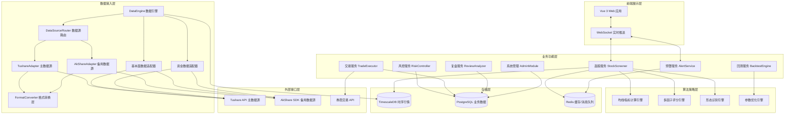

### 部署架构

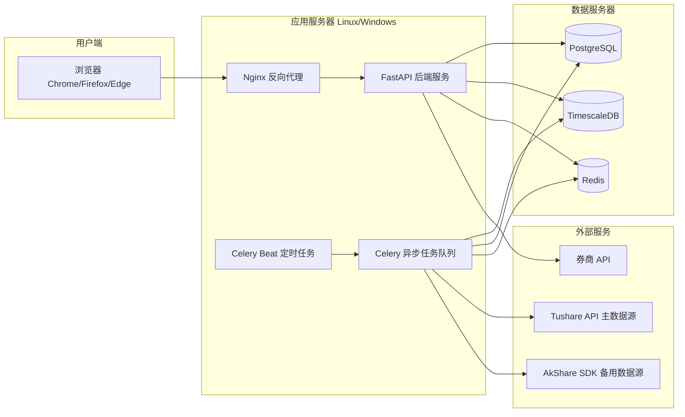

---

## 组件与接口

### 1. DataEngine（数据引擎）

负责所有外部数据的接入、清洗、存储。采用 Tushare 为主数据源、AkShare 为备用数据源的双源架构，通过统一的数据源管理器（DataSourceRouter）实现自动故障转移和格式归一化。

#### 1a. 数据源配置（需求 1.7, 1.8）

数据源相关配置通过 pydantic-settings 从 `.env` 文件读取，代码中不得硬编码任何 API 凭证或地址。

```python
# app/core/config.py 新增字段
class Settings(BaseSettings):
    # ... 已有字段 ...

    # Tushare 数据源配置（需求 1.7）
    tushare_api_token: str = ""                          # Tushare API Token
    tushare_api_url: str = "http://api.tushare.pro"      # Tushare API 地址

    # AkShare 数据源配置（需求 1.8）
    akshare_request_timeout: float = 30.0                # AkShare 请求超时时间（秒）
    akshare_max_retries: int = 3                         # AkShare 最大重试次数
```

#### 1b. 数据源适配器抽象层

所有数据源适配器实现统一的抽象接口，便于故障转移时无缝切换：

```python
from abc import ABC, abstractmethod

class BaseDataSourceAdapter(ABC):
    """数据源适配器抽象基类"""

    @abstractmethod
    async def fetch_kline(self, symbol: str, freq: str, start: date, end: date) -> list[KlineBar]: ...

    @abstractmethod
    async def fetch_fundamentals(self, symbol: str) -> FundamentalsData: ...

    @abstractmethod
    async def fetch_money_flow(self, symbol: str, trade_date: date) -> MoneyFlowData: ...

    @abstractmethod
    async def fetch_market_overview(self, trade_date: date) -> MarketOverview: ...

    @abstractmethod
    async def health_check(self) -> bool: ...
```

#### 1c. TushareAdapter（主数据源适配器）

通过 HTTP API + Token 认证方式访问 Tushare 平台，负责 K 线行情、财务报表、资金流向数据获取。

```python
class TushareAdapter(BaseDataSourceAdapter):
    """
    Tushare 数据源适配器（主数据源）

    - 通过 settings.tushare_api_token 和 settings.tushare_api_url 访问
    - 提供 K 线、财务报表、资金流向、市场概览数据
    - 返回数据经 TushareFormatConverter 转换为统一 KlineBar 结构
    """

    def __init__(self, api_token: str | None = None, api_url: str | None = None) -> None:
        self._api_token = api_token or settings.tushare_api_token
        self._api_url = api_url or settings.tushare_api_url
        self._converter = TushareFormatConverter()

    async def fetch_kline(self, symbol: str, freq: str, start: date, end: date) -> list[KlineBar]:
        raw = await self._call_api("daily", ts_code=symbol, start_date=start, end_date=end)
        return self._converter.to_kline_bars(raw, symbol, freq)

    async def fetch_fundamentals(self, symbol: str) -> FundamentalsData:
        raw = await self._call_api("fina_indicator", ts_code=symbol)
        return self._converter.to_fundamentals(raw, symbol)

    async def fetch_money_flow(self, symbol: str, trade_date: date) -> MoneyFlowData:
        raw = await self._call_api("moneyflow", ts_code=symbol, trade_date=trade_date)
        return self._converter.to_money_flow(raw, symbol, trade_date)

    async def fetch_market_overview(self, trade_date: date) -> MarketOverview:
        raw = await self._call_api("index_daily", trade_date=trade_date)
        return self._converter.to_market_overview(raw, trade_date)

    async def health_check(self) -> bool:
        try:
            await self._call_api("trade_cal", exchange="SSE", is_open=1)
            return True
        except Exception:
            return False

    async def _call_api(self, api_name: str, **params) -> dict:
        """调用 Tushare HTTP API"""
        ...
```

#### 1d. AkShareAdapter（备用数据源适配器）

通过 Python SDK 方式调用 AkShare 开源库，作为 Tushare 不可用时的备用数据源。

```python
class AkShareAdapter(BaseDataSourceAdapter):
    """
    AkShare 数据源适配器（备用数据源）

    - 通过 akshare Python SDK 调用，超时时间从 settings.akshare_request_timeout 读取
    - 提供 K 线行情、资金流向、板块数据、市场情绪数据
    - 返回数据经 AkShareFormatConverter 转换为统一 KlineBar 结构
    """

    def __init__(self, timeout: float | None = None) -> None:
        self._timeout = timeout or settings.akshare_request_timeout
        self._converter = AkShareFormatConverter()

    async def fetch_kline(self, symbol: str, freq: str, start: date, end: date) -> list[KlineBar]:
        # 在线程池中执行同步 akshare 调用
        raw_df = await asyncio.to_thread(
            ak.stock_zh_a_hist, symbol=symbol, period="daily",
            start_date=start.strftime("%Y%m%d"), end_date=end.strftime("%Y%m%d"),
            timeout=self._timeout,
        )
        return self._converter.to_kline_bars(raw_df, symbol, freq)

    async def fetch_fundamentals(self, symbol: str) -> FundamentalsData:
        raw_df = await asyncio.to_thread(
            ak.stock_financial_analysis_indicator, symbol=symbol,
            timeout=self._timeout,
        )
        return self._converter.to_fundamentals(raw_df, symbol)

    async def fetch_money_flow(self, symbol: str, trade_date: date) -> MoneyFlowData:
        raw_df = await asyncio.to_thread(
            ak.stock_individual_fund_flow, stock=symbol, market="sh",
            timeout=self._timeout,
        )
        return self._converter.to_money_flow(raw_df, symbol, trade_date)

    async def fetch_market_overview(self, trade_date: date) -> MarketOverview:
        raw_df = await asyncio.to_thread(
            ak.stock_zh_index_daily, symbol="sh000001",
            timeout=self._timeout,
        )
        return self._converter.to_market_overview(raw_df, trade_date)

    async def health_check(self) -> bool:
        try:
            await asyncio.to_thread(ak.stock_zh_a_spot_em, timeout=self._timeout)
            return True
        except Exception:
            return False
```

#### 1e. DataSourceRouter（数据源路由与故障转移管理器）

统一管理 Tushare 和 AkShare 两个数据源，实现优先使用 Tushare、失败自动切换 AkShare 的故障转移逻辑（需求 1.9, 1.10）。

```python
class DataSourceRouter:
    """
    数据源路由器

    - 所有数据请求优先通过 Tushare 获取（需求 1.1）
    - Tushare 调用失败时自动切换至 AkShare（需求 1.9）
    - 两个数据源均不可用时记录错误日志并推送告警，停止同步（需求 1.10）
    """

    def __init__(
        self,
        tushare: TushareAdapter | None = None,
        akshare: AkShareAdapter | None = None,
        alert_service: AlertService | None = None,
    ) -> None:
        self._primary = tushare or TushareAdapter()
        self._fallback = akshare or AkShareAdapter()
        self._alert_service = alert_service

    async def fetch_with_fallback(
        self,
        method_name: str,
        *args,
        **kwargs,
    ) -> Any:
        """
        带故障转移的数据获取。

        1. 优先调用 Tushare（主数据源）
        2. Tushare 失败 → 自动切换 AkShare（备用数据源）
        3. 两者均失败 → 记录错误日志 + 推送告警 + 抛出 DataSourceUnavailableError
        """
        # 尝试主数据源（Tushare）
        try:
            primary_method = getattr(self._primary, method_name)
            return await primary_method(*args, **kwargs)
        except Exception as primary_err:
            logger.warning(
                "Tushare 数据源调用失败 method=%s: %s，切换至 AkShare",
                method_name, primary_err,
            )

        # 尝试备用数据源（AkShare）
        try:
            fallback_method = getattr(self._fallback, method_name)
            return await fallback_method(*args, **kwargs)
        except Exception as fallback_err:
            logger.error(
                "Tushare 和 AkShare 均不可用 method=%s: primary=%s fallback=%s",
                method_name, primary_err, fallback_err,
            )
            # 推送数据源异常告警（需求 1.10）
            if self._alert_service:
                await self._alert_service.push_alert(
                    user_id="system",
                    alert=Alert(
                        type="SYSTEM",
                        level="DANGER",
                        message=f"数据源异常：Tushare 和 AkShare 均不可用（{method_name}）",
                    ),
                )
            raise DataSourceUnavailableError(
                f"所有数据源不可用: {method_name}"
            ) from fallback_err

    async def fetch_kline(self, symbol: str, freq: str, start: date, end: date) -> list[KlineBar]:
        return await self.fetch_with_fallback("fetch_kline", symbol, freq, start, end)

    async def fetch_fundamentals(self, symbol: str) -> FundamentalsData:
        return await self.fetch_with_fallback("fetch_fundamentals", symbol)

    async def fetch_money_flow(self, symbol: str, trade_date: date) -> MoneyFlowData:
        return await self.fetch_with_fallback("fetch_money_flow", symbol, trade_date)

    async def fetch_market_overview(self, trade_date: date) -> MarketOverview:
        return await self.fetch_with_fallback("fetch_market_overview", trade_date)


class DataSourceUnavailableError(Exception):
    """所有数据源均不可用时抛出"""
    pass
```

#### 1f. 统一格式转换层（需求 1.11）

Tushare 和 AkShare 返回的数据字段名称和数据类型不同，通过各自的 FormatConverter 统一映射为系统内部 KlineBar 数据结构。

```python
class TushareFormatConverter:
    """
    Tushare 数据格式转换器

    将 Tushare API 返回的 DataFrame/dict 字段映射为系统内部统一结构。
    Tushare 字段示例：ts_code, trade_date, open, high, low, close, vol, amount
    """

    def to_kline_bars(self, raw: dict, symbol: str, freq: str) -> list[KlineBar]:
        items = raw.get("items", [])
        fields = raw.get("fields", [])
        bars = []
        for row in items:
            row_dict = dict(zip(fields, row))
            bars.append(KlineBar(
                time=datetime.strptime(str(row_dict["trade_date"]), "%Y%m%d"),
                symbol=symbol,
                freq=freq,
                open=Decimal(str(row_dict.get("open", 0))),
                high=Decimal(str(row_dict.get("high", 0))),
                low=Decimal(str(row_dict.get("low", 0))),
                close=Decimal(str(row_dict.get("close", 0))),
                volume=int(row_dict.get("vol", 0)),
                amount=Decimal(str(row_dict.get("amount", 0))) * 1000,  # Tushare 单位为千元
                turnover=Decimal(str(row_dict.get("turnover_rate", 0))),
                vol_ratio=Decimal(str(row_dict.get("volume_ratio", 0))),
                limit_up=None,
                limit_down=None,
                adj_type=0,
            ))
        return bars

    def to_fundamentals(self, raw: dict, symbol: str) -> FundamentalsData: ...
    def to_money_flow(self, raw: dict, symbol: str, trade_date: date) -> MoneyFlowData: ...
    def to_market_overview(self, raw: dict, trade_date: date) -> MarketOverview: ...


class AkShareFormatConverter:
    """
    AkShare 数据格式转换器

    将 AkShare SDK 返回的 pandas DataFrame 字段映射为系统内部统一结构。
    AkShare 字段示例：日期, 开盘, 最高, 最低, 收盘, 成交量, 成交额, 换手率
    """

    def to_kline_bars(self, df: "pd.DataFrame", symbol: str, freq: str) -> list[KlineBar]:
        bars = []
        for _, row in df.iterrows():
            bars.append(KlineBar(
                time=datetime.strptime(str(row["日期"]), "%Y-%m-%d"),
                symbol=symbol,
                freq=freq,
                open=Decimal(str(row.get("开盘", 0))),
                high=Decimal(str(row.get("最高", 0))),
                low=Decimal(str(row.get("最低", 0))),
                close=Decimal(str(row.get("收盘", 0))),
                volume=int(row.get("成交量", 0)),
                amount=Decimal(str(row.get("成交额", 0))),
                turnover=Decimal(str(row.get("换手率", 0))),
                vol_ratio=Decimal("0"),  # AkShare 不直接提供量比
                limit_up=None,
                limit_down=None,
                adj_type=0,
            ))
        return bars

    def to_fundamentals(self, df: "pd.DataFrame", symbol: str) -> FundamentalsData: ...
    def to_money_flow(self, df: "pd.DataFrame", symbol: str, trade_date: date) -> MoneyFlowData: ...
    def to_market_overview(self, df: "pd.DataFrame", trade_date: date) -> MarketOverview: ...
```

#### 1g. DataEngine 核心接口（更新）

**核心接口：**

```python
class DataEngine:
    def __init__(self, router: DataSourceRouter | None = None) -> None:
        self._router = router or DataSourceRouter()

    async def fetch_kline(self, symbol: str, freq: str, start: date, end: date) -> list[KlineBar]:
        return await self._router.fetch_kline(symbol, freq, start, end)

    async def fetch_fundamentals(self, symbol: str) -> FundamentalsData:
        return await self._router.fetch_fundamentals(symbol)

    async def fetch_money_flow(self, symbol: str, date: date) -> MoneyFlowData:
        return await self._router.fetch_money_flow(symbol, date)

    async def fetch_market_overview(self, date: date) -> MarketOverview:
        return await self._router.fetch_market_overview(date)

    def clean_and_store(self, raw_data: RawData) -> CleanResult: ...
    def get_adjusted_price(self, symbol: str, adj_type: AdjType) -> list[KlineBar]: ...
```

**数据清洗规则执行器：**

```python
class StockFilter:
    def is_excluded(symbol: str) -> tuple[bool, str]  # (是否剔除, 原因)
    def get_permanent_blacklist() -> set[str]
```

### 2. StockScreener（选股引擎）

多因子选股核心，包含均线、指标、形态、量价、资金五个子模块。

**核心接口：**

```python
class StockScreener:
    def screen_eod(strategy: StrategyConfig, date: date) -> ScreenResult
    def screen_realtime(strategy: StrategyConfig) -> ScreenResult
    def score_ma_trend(symbol: str, date: date) -> float  # 0-100
    def detect_breakout(symbol: str, date: date) -> BreakoutSignal | None
    def check_volume_price(symbol: str, date: date) -> VolumePriceSignal
    def check_money_flow(symbol: str, date: date) -> MoneyFlowSignal
```

**策略配置结构：**

```python
class StrategyConfig:
    factors: list[FactorCondition]   # 因子条件列表
    logic: Literal["AND", "OR"]      # 逻辑运算
    weights: dict[str, float]        # 因子权重
    ma_periods: list[int]            # 均线周期
    indicator_params: dict           # 指标参数
    ma_trend: MaTrendConfig | None   # 均线趋势配置（需求 3）
    breakout: BreakoutConfig | None  # 形态突破配置（需求 5）
    volume_price: VolumePriceConfig | None  # 量价资金筛选配置（需求 6）
```

**均线趋势配置：**

```python
@dataclass
class MaTrendConfig:
    ma_periods: list[int]            # 均线周期组合，默认 [5,10,20,60,120]
    slope_threshold: float           # 多头排列斜率阈值，默认 0
    trend_score_threshold: int       # 趋势打分阈值，默认 80
    support_ma_lines: list[int]      # 均线支撑回调均线，默认 [20,60]
```

**技术指标参数配置：**

```python
@dataclass
class IndicatorParamsConfig:
    macd_fast: int = 12              # MACD 快线周期
    macd_slow: int = 26              # MACD 慢线周期
    macd_signal: int = 9             # MACD 信号线周期
    boll_period: int = 20            # BOLL 周期
    boll_std_dev: float = 2.0        # BOLL 标准差倍数
    rsi_period: int = 14             # RSI 周期
    rsi_lower: int = 50              # RSI 强势区间下限
    rsi_upper: int = 80              # RSI 强势区间上限
    dma_short: int = 10              # DMA 短期周期
    dma_long: int = 50               # DMA 长期周期
```

**形态突破配置：**

```python
@dataclass
class BreakoutConfig:
    box_breakout: bool = True        # 箱体突破
    high_breakout: bool = True       # 前期高点突破
    trendline_breakout: bool = True  # 下降趋势线突破
    volume_ratio_threshold: float = 1.5  # 量比倍数阈值
    confirm_days: int = 1            # 站稳确认天数
```

**量价资金筛选配置：**

```python
@dataclass
class VolumePriceConfig:
    turnover_rate_min: float = 3.0   # 换手率下限 %
    turnover_rate_max: float = 15.0  # 换手率上限 %
    main_flow_threshold: float = 1000.0  # 主力净流入阈值（万元）
    main_flow_days: int = 2          # 连续净流入天数
    large_order_ratio: float = 30.0  # 大单占比阈值 %
    min_daily_amount: float = 5000.0 # 日均成交额下限（万元）
    sector_rank_top: int = 30        # 板块排名范围
```

### 3. RiskController（风控引擎）

事前、事中、事后三层风控。

**核心接口：**

```python
class RiskController:
    def check_market_risk(date: date) -> MarketRiskLevel
    def check_position_limit(symbol: str, amount: float, portfolio: Portfolio) -> RiskCheckResult
    def check_stop_loss(position: Position, current_price: float) -> StopSignal | None
    def monitor_strategy_health(strategy_id: str) -> StrategyHealthReport
    def add_to_blacklist(symbol: str, reason: str) -> None
    def add_to_whitelist(symbol: str) -> None
```

### 4. BacktestEngine（回测引擎）

历史回测、参数优化、过拟合检测。

**核心接口：**

```python
class BacktestEngine:
    def run_backtest(config: BacktestConfig) -> BacktestResult
    def run_segment_backtest(config: BacktestConfig, segments: list[MarketSegment]) -> dict[str, BacktestResult]
    def grid_search(param_grid: dict, base_config: BacktestConfig) -> list[ParamResult]
    def genetic_optimize(param_space: dict, base_config: BacktestConfig) -> ParamResult
    def detect_overfitting(train_result: BacktestResult, test_result: BacktestResult) -> OverfitReport
```

### 5. TradeExecutor（交易执行）

委托下单、持仓管理、券商接口对接。

**核心接口：**

```python
class TradeExecutor:
    async def submit_order(order: OrderRequest) -> OrderResponse
    async def cancel_order(order_id: str) -> CancelResponse
    async def get_positions() -> list[Position]
    async def get_orders(start: datetime, end: datetime) -> list[Order]
    def register_condition_order(condition: ConditionOrder) -> str
    def switch_mode(mode: Literal["live", "paper"]) -> None
```

### 6. AlertService（预警服务）

实时预警推送，基于 WebSocket + Redis Pub/Sub。

**核心接口：**

```python
class AlertService:
    async def push_alert(user_id: str, alert: Alert) -> None
    def register_threshold(user_id: str, config: AlertConfig) -> None
    async def broadcast_screen_result(result: ScreenResult) -> None
```

### 7. ReviewAnalyzer（复盘分析）

**核心接口：**

```python
class ReviewAnalyzer:
    def generate_daily_review(date: date) -> DailyReview
    def generate_strategy_report(strategy_id: str, period: ReportPeriod) -> StrategyReport
    def generate_market_review(date: date) -> MarketReview
```

### 8. AdminModule（系统管理）

**核心接口：**

```python
class AdminModule:
    def create_user(user: UserCreate) -> User
    def assign_role(user_id: str, role: Role) -> None
    def get_system_health() -> SystemHealth
    def backup_data(target: str) -> BackupResult
```

---

## 数据模型

### 行情数据（TimescaleDB）

```sql
-- K线数据（超表，按时间分区）
CREATE TABLE kline (
    time        TIMESTAMPTZ NOT NULL,
    symbol      VARCHAR(10) NOT NULL,
    freq        VARCHAR(5)  NOT NULL,  -- '1m','5m','15m','30m','60m','1d','1w','1M'
    open        NUMERIC(12,4),
    high        NUMERIC(12,4),
    low         NUMERIC(12,4),
    close       NUMERIC(12,4),
    volume      BIGINT,
    amount      NUMERIC(18,2),
    turnover    NUMERIC(8,4),   -- 换手率 %
    vol_ratio   NUMERIC(8,4),   -- 量比
    limit_up    NUMERIC(12,4),  -- 涨停价
    limit_down  NUMERIC(12,4),  -- 跌停价
    adj_type    SMALLINT DEFAULT 0  -- 0=不复权 1=前复权 2=后复权
);
SELECT create_hypertable('kline', 'time');
CREATE INDEX ON kline (symbol, freq, time DESC);
```

### 业务数据（PostgreSQL）

```sql
-- 股票基础信息
CREATE TABLE stock_info (
    symbol          VARCHAR(10) PRIMARY KEY,
    name            VARCHAR(50),
    market          VARCHAR(10),  -- SH/SZ/BJ
    board           VARCHAR(10),  -- 主板/创业板/科创板/北交所
    list_date       DATE,
    is_st           BOOLEAN DEFAULT FALSE,
    is_delisted     BOOLEAN DEFAULT FALSE,
    pledge_ratio    NUMERIC(6,2),
    pe_ttm          NUMERIC(10,2),
    pb              NUMERIC(10,2),
    roe             NUMERIC(8,4),
    market_cap      NUMERIC(20,2),
    updated_at      TIMESTAMPTZ
);

-- 永久剔除名单
CREATE TABLE permanent_exclusion (
    symbol      VARCHAR(10) PRIMARY KEY,
    reason      VARCHAR(50),  -- 'ST','DELISTED','NEW_STOCK'
    created_at  TIMESTAMPTZ DEFAULT NOW()
);

-- 选股策略模板
CREATE TABLE strategy_template (
    id          UUID PRIMARY KEY DEFAULT gen_random_uuid(),
    user_id     UUID NOT NULL,
    name        VARCHAR(100),
    config      JSONB NOT NULL,   -- StrategyConfig 序列化
    is_active   BOOLEAN DEFAULT FALSE,
    created_at  TIMESTAMPTZ DEFAULT NOW(),
    updated_at  TIMESTAMPTZ DEFAULT NOW(),
    CONSTRAINT max_strategies CHECK (
        (SELECT COUNT(*) FROM strategy_template WHERE user_id = strategy_template.user_id) <= 20
    )
);

-- 选股结果
CREATE TABLE screen_result (
    id              UUID PRIMARY KEY DEFAULT gen_random_uuid(),
    strategy_id     UUID REFERENCES strategy_template(id),
    screen_time     TIMESTAMPTZ NOT NULL,
    screen_type     VARCHAR(10),  -- 'EOD' | 'REALTIME'
    symbol          VARCHAR(10),
    ref_buy_price   NUMERIC(12,4),
    trend_score     NUMERIC(5,2),
    risk_level      VARCHAR(10),  -- 'LOW'|'MEDIUM'|'HIGH'
    signals         JSONB,        -- 触发的信号详情
    created_at      TIMESTAMPTZ DEFAULT NOW()
);

-- 黑白名单
CREATE TABLE stock_list (
    symbol      VARCHAR(10) NOT NULL,
    list_type   VARCHAR(10) NOT NULL,  -- 'BLACK'|'WHITE'
    user_id     UUID NOT NULL,
    reason      VARCHAR(200),
    created_at  TIMESTAMPTZ DEFAULT NOW(),
    PRIMARY KEY (symbol, list_type, user_id)
);

-- 回测配置与结果
CREATE TABLE backtest_run (
    id              UUID PRIMARY KEY DEFAULT gen_random_uuid(),
    strategy_id     UUID REFERENCES strategy_template(id),
    user_id         UUID NOT NULL,
    start_date      DATE,
    end_date        DATE,
    initial_capital NUMERIC(18,2),
    commission_buy  NUMERIC(8,6) DEFAULT 0.0003,
    commission_sell NUMERIC(8,6) DEFAULT 0.0013,
    slippage        NUMERIC(8,6) DEFAULT 0.001,
    status          VARCHAR(20),  -- 'PENDING'|'RUNNING'|'DONE'|'FAILED'
    result          JSONB,        -- BacktestResult 序列化
    created_at      TIMESTAMPTZ DEFAULT NOW()
);

-- 委托记录
CREATE TABLE trade_order (
    id              UUID PRIMARY KEY DEFAULT gen_random_uuid(),
    user_id         UUID NOT NULL,
    symbol          VARCHAR(10),
    order_type      VARCHAR(20),  -- 'LIMIT'|'MARKET'|'CONDITION'
    direction       VARCHAR(5),   -- 'BUY'|'SELL'
    price           NUMERIC(12,4),
    quantity        INTEGER,
    status          VARCHAR(20),  -- 'PENDING'|'FILLED'|'CANCELLED'|'REJECTED'
    broker_order_id VARCHAR(50),
    mode            VARCHAR(10),  -- 'LIVE'|'PAPER'
    submitted_at    TIMESTAMPTZ,
    filled_at       TIMESTAMPTZ,
    filled_price    NUMERIC(12,4),
    filled_qty      INTEGER,
    created_at      TIMESTAMPTZ DEFAULT NOW()
);

-- 持仓
CREATE TABLE position (
    id              UUID PRIMARY KEY DEFAULT gen_random_uuid(),
    user_id         UUID NOT NULL,
    symbol          VARCHAR(10),
    quantity        INTEGER,
    cost_price      NUMERIC(12,4),
    mode            VARCHAR(10),
    updated_at      TIMESTAMPTZ DEFAULT NOW(),
    UNIQUE (user_id, symbol, mode)
);

-- 用户
CREATE TABLE app_user (
    id          UUID PRIMARY KEY DEFAULT gen_random_uuid(),
    username    VARCHAR(50) UNIQUE NOT NULL,
    password_hash VARCHAR(128) NOT NULL,
    role        VARCHAR(30),  -- 'TRADER'|'ADMIN'|'READONLY'
    is_active   BOOLEAN DEFAULT TRUE,
    created_at  TIMESTAMPTZ DEFAULT NOW()
);

-- 操作日志
CREATE TABLE audit_log (
    id          BIGSERIAL PRIMARY KEY,
    user_id     UUID,
    action      VARCHAR(100),
    target      VARCHAR(200),
    detail      JSONB,
    ip_addr     INET,
    created_at  TIMESTAMPTZ DEFAULT NOW()
);
```

### 核心 Python 数据类

```python
from dataclasses import dataclass, field
from datetime import date, datetime
from decimal import Decimal
from typing import Literal
from uuid import UUID

@dataclass
class KlineBar:
    time: datetime
    symbol: str
    freq: str
    open: Decimal
    high: Decimal
    low: Decimal
    close: Decimal
    volume: int
    amount: Decimal
    turnover: Decimal
    vol_ratio: Decimal

@dataclass
class ScreenResult:
    strategy_id: UUID
    screen_time: datetime
    screen_type: Literal["EOD", "REALTIME"]
    items: list["ScreenItem"]

@dataclass
class ScreenItem:
    symbol: str
    ref_buy_price: Decimal
    trend_score: float       # 0-100
    risk_level: Literal["LOW", "MEDIUM", "HIGH"]
    signals: list[dict]      # 触发信号详情，每项含 category/label/is_fake_breakout
    has_fake_breakout: bool   # 是否存在假突破标记

@dataclass
class BacktestResult:
    annual_return: float
    total_return: float
    win_rate: float
    profit_loss_ratio: float
    max_drawdown: float
    sharpe_ratio: float
    calmar_ratio: float
    total_trades: int
    avg_holding_days: float
    equity_curve: list[tuple[date, float]]
    trade_records: list[dict]

@dataclass
class RiskCheckResult:
    passed: bool
    reason: str | None = None

@dataclass
class Position:
    symbol: str
    quantity: int
    cost_price: Decimal
    current_price: Decimal
    market_value: Decimal
    pnl: Decimal
    pnl_pct: float
    weight: float            # 仓位占比

@dataclass
class OrderRequest:
    symbol: str
    direction: Literal["BUY", "SELL"]
    order_type: Literal["LIMIT", "MARKET"]
    price: Decimal | None
    quantity: int
    stop_loss: Decimal | None = None
    take_profit: Decimal | None = None
```

---

## 前端交互界面设计（需求 21）

### 概述

WebUI 是系统面向用户的唯一交互入口，基于 Vue 3 + TypeScript + Pinia 构建的单页应用（SPA）。前端通过 RESTful API 与后端通信，通过 WebSocket 接收实时预警推送。所有页面均需登录认证后方可访问，菜单和操作按钮根据用户角色（TRADER / ADMIN / READONLY）动态渲染。

### 前端架构

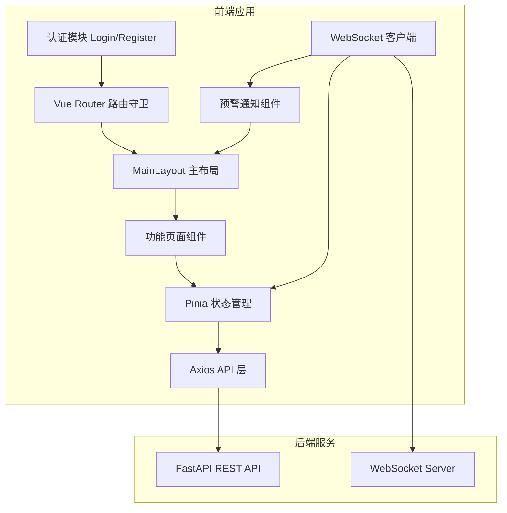

### 路由结构与页面映射

| 路由路径 | 页面组件 | 对应需求 | 角色限制 |
|---|---|---|---|
| `/login` | LoginView | 21.1 | 无需认证 |
| `/register` | RegisterView | 21.2 | 无需认证 |
| `/` | MainLayout → DashboardView | 21.4 | 全部角色 |
| `/data` | DataManageView | 21.5 | 全部角色 |
| `/screener` | ScreenerView | 21.6, 21.8–21.14 | 全部角色 |
| `/screener/results` | ScreenerResultsView | 21.7, 21.15 | 全部角色 |
| `/risk` | RiskView | 21.16 | 全部角色 |
| `/backtest` | BacktestView | 21.17 | 全部角色 |
| `/trade` | TradeView | 21.18 | TRADER, ADMIN |
| `/positions` | PositionsView | 21.19 | TRADER, ADMIN |
| `/review` | ReviewView | 21.20 | 全部角色 |
| `/admin` | AdminView | 21.21 | ADMIN |

### 前端组件与接口

#### 1. 认证模块（LoginView / RegisterView）

负责用户登录、注册、Token 管理。

```typescript
// 登录接口
interface LoginRequest {
  username: string
  password: string
}
interface LoginResponse {
  access_token: string
  user: { id: string; username: string; role: UserRole }
}

// 注册接口
interface RegisterRequest {
  username: string
  password: string
}
interface RegisterResponse {
  id: string
  username: string
  role: UserRole
}

// 密码强度校验规则
interface PasswordValidation {
  minLength: 8           // 最少 8 位
  hasUppercase: boolean   // 包含大写字母
  hasLowercase: boolean   // 包含小写字母
  hasDigit: boolean       // 包含数字
}
```

LoginView 行为：
- 提交用户名密码调用 `POST /api/v1/auth/login`
- 成功后将 `access_token` 存入 localStorage，跳转至主页面
- 失败时在表单下方显示错误提示（如"用户名或密码错误"）

RegisterView 行为：
- 用户名输入时实时调用 `GET /api/v1/auth/check-username?username=xxx` 校验唯一性
- 密码输入时实时校验强度并显示校验结果（✓/✗ 标记）
- 提交调用 `POST /api/v1/auth/register`，成功后跳转至登录页

#### 2. 主布局框架（MainLayout）

统一的页面骨架，包含顶部导航栏、侧边菜单栏、主内容区域。

```typescript
// 导航菜单项定义
interface NavItem {
  path: string
  label: string
  icon: string
  roles?: UserRole[]  // 为空表示所有角色可见
  group: '数据' | '选股' | '风控' | '交易' | '分析' | '系统'
}

// 菜单分组
const menuGroups: Record<string, NavItem[]> = {
  '数据': [
    { path: '/dashboard', label: '大盘概况', icon: '📊', group: '数据' },
    { path: '/data', label: '数据管理', icon: '💾', group: '数据' },
  ],
  '选股': [
    { path: '/screener', label: '智能选股', icon: '🔍', group: '选股' },
    { path: '/screener/results', label: '选股结果', icon: '📋', group: '选股' },
  ],
  '风控': [
    { path: '/risk', label: '风险控制', icon: '🛡️', group: '风控' },
  ],
  '交易': [
    { path: '/trade', label: '交易执行', icon: '💹', roles: ['TRADER', 'ADMIN'], group: '交易' },
    { path: '/positions', label: '持仓管理', icon: '💰', roles: ['TRADER', 'ADMIN'], group: '交易' },
  ],
  '分析': [
    { path: '/backtest', label: '策略回测', icon: '📈', group: '分析' },
    { path: '/review', label: '复盘分析', icon: '📝', group: '分析' },
  ],
  '系统': [
    { path: '/admin', label: '系统管理', icon: '⚙️', roles: ['ADMIN'], group: '系统' },
  ],
}
```

MainLayout 行为：
- 侧边菜单按 `group` 分组渲染，组内菜单项根据当前用户角色过滤（`roles` 字段）
- 顶部导航栏右侧显示预警通知铃铛（含未读数 badge）和用户信息/退出按钮
- 预警通知铃铛点击展开通知面板，显示最近预警列表
- 主内容区域通过 `<router-view />` 渲染子路由页面

#### 3. 数据管理页面（DataManageView）

```typescript
// 数据同步状态
interface SyncStatus {
  source: string          // 数据源名称（Tushare / AkShare）
  data_type: string       // 数据类型（行情 / 基本面 / 资金流向 / 市场概览）
  last_sync_at: string    // 最后同步时间
  status: 'OK' | 'ERROR' | 'SYNCING' | 'FALLBACK'  // FALLBACK 表示正在使用备用源
  active_source: 'tushare' | 'akshare'  // 当前活跃数据源
  record_count: number    // 已同步记录数
}

// 剔除名单项
interface ExclusionItem {
  symbol: string
  name: string
  reason: string          // 'ST' | 'DELISTED' | 'NEW_STOCK' | ...
  created_at: string
}
```

页面功能：
- 展示各数据源同步状态表格（行情、基本面、资金流向），每行标注当前活跃数据源（Tushare 主 / AkShare 备）
- 当数据源处于 FALLBACK 状态时，以黄色警告样式标注"已切换至备用源"
- 手动触发数据同步按钮（调用 `POST /api/v1/data/sync`）
- 查看数据清洗结果统计和永久剔除名单列表

#### 4. 选股策略页面（ScreenerView）

已有基础实现，需补充：
- 策略模板的导入（上传 JSON 文件）和导出（下载 JSON 文件）功能
- 策略删除确认对话框
- 因子条件组合的可视化编辑器（支持 AND/OR 逻辑切换）
- 一键执行选股后自动跳转至选股结果页面
- 策略数量上限校验（20 套），达到上限时禁用新建按钮并显示提示

##### 4a. 均线趋势参数配置面板（需求 21.8 → 需求 3）

```typescript
// 均线趋势配置数据结构
interface MaTrendConfig {
  ma_periods: number[]           // 均线周期组合，默认 [5, 10, 20, 60, 120]
  slope_threshold: number        // 多头排列斜率阈值，默认 0
  trend_score_threshold: number  // 趋势打分纳入初选池阈值，默认 80
  support_ma_lines: number[]     // 均线支撑信号回调均线，默认 [20, 60]
}
```

面板功能：
- 均线周期组合：多选标签输入，支持添加/删除自定义周期值，默认预填 5/10/20/60/120
- 斜率阈值：数值输入框，步长 0.01，默认 0
- 趋势打分阈值：滑块控件 0-100，默认 80，实时显示当前值
- 均线支撑回调均线：复选框组，选项为 20 日 / 60 日，默认全选

##### 4b. 技术指标参数配置面板（需求 21.9 → 需求 4）

```typescript
// 技术指标参数配置数据结构
interface IndicatorParamsConfig {
  macd: {
    fast_period: number    // 快线周期，默认 12
    slow_period: number    // 慢线周期，默认 26
    signal_period: number  // 信号线周期，默认 9
  }
  boll: {
    period: number         // 周期，默认 20
    std_dev: number        // 标准差倍数，默认 2
  }
  rsi: {
    period: number         // 周期，默认 14
    lower_bound: number    // 强势区间下限，默认 50
    upper_bound: number    // 强势区间上限，默认 80
  }
  dma: {
    short_period: number   // 短期周期，默认 10
    long_period: number    // 长期周期，默认 50
  }
}
```

面板功能：
- 按指标分组的折叠面板（Accordion），每个指标独立展开/收起
- MACD 面板：快线周期、慢线周期、信号线周期三个数值输入框
- BOLL 面板：周期和标准差倍数两个数值输入框
- RSI 面板：周期输入框 + 强势区间双端滑块（下限/上限）
- DMA 面板：短期周期和长期周期两个数值输入框
- 每个参数旁显示默认值提示，支持一键恢复默认值

##### 4c. 形态突破配置面板（需求 21.10 → 需求 5）

```typescript
// 形态突破配置数据结构
interface BreakoutConfig {
  patterns: {
    box_breakout: boolean           // 箱体突破，默认 true
    high_breakout: boolean          // 前期高点突破，默认 true
    trendline_breakout: boolean     // 下降趋势线突破，默认 true
  }
  volume_ratio_threshold: number    // 有效突破量比倍数阈值，默认 1.5
  confirm_days: number              // 突破站稳确认天数，默认 1
}
```

面板功能：
- 三种突破形态的开关复选框（箱体突破 / 前期高点突破 / 下降趋势线突破），默认全部启用
- 量比倍数阈值：数值输入框，步长 0.1，默认 1.5，标注"倍近 20 日均量"
- 站稳确认天数：数值输入框，步长 1，最小值 1，默认 1

##### 4d. 量价资金筛选配置面板（需求 21.11 → 需求 6）

```typescript
// 量价资金筛选配置数据结构
interface VolumePriceConfig {
  turnover_rate_min: number         // 换手率下限 %，默认 3
  turnover_rate_max: number         // 换手率上限 %，默认 15
  main_flow_threshold: number       // 主力资金净流入阈值（万元），默认 1000
  main_flow_days: number            // 连续净流入天数，默认 2
  large_order_ratio: number         // 大单成交占比阈值 %，默认 30
  min_daily_amount: number          // 日均成交额下限（万元），默认 5000
  sector_rank_top: number           // 板块涨幅排名筛选范围，默认 30
}
```

面板功能：
- 换手率区间：双端滑块或两个数值输入框（下限/上限），默认 3%-15%
- 主力资金净流入阈值：数值输入框，单位万元，默认 1000
- 连续净流入天数：数值输入框，步长 1，默认 2
- 大单成交占比阈值：数值输入框，单位 %，默认 30
- 日均成交额下限：数值输入框，单位万元，默认 5000
- 板块涨幅排名范围：数值输入框，默认前 30

##### 4e. 策略数量上限校验（需求 21.12 → 需求 7.2）

行为：
- 页面加载策略列表后，检查当前策略数量是否达到 20 套上限
- 达到上限时：新建策略按钮置灰（disabled），按钮旁显示"已达策略上限（20 套）"提示文字
- 未达上限时：正常显示新建按钮，无额外提示

##### 4f. 实时选股开关与状态（需求 21.13 → 需求 7.5）

```typescript
// 实时选股状态
interface RealtimeScreenState {
  enabled: boolean                  // 实时选股开关
  is_trading_hours: boolean         // 当前是否交易时段
  last_refresh_at: string | null    // 最近刷新时间
  next_refresh_countdown: number    // 下次刷新倒计时（秒）
}
```

行为：
- 提供实时选股开关（Toggle Switch），默认关闭
- 开启后判断当前是否在交易时段（9:30-15:00）：
  - 交易时段内：每 10 秒自动调用 `POST /api/v1/screen/run` 并刷新结果，页面显示倒计时和最近刷新时间
  - 非交易时段：开关自动禁用，显示"非交易时段"灰色状态提示
- 关闭开关时停止自动刷新定时器

##### 4g. 盘后自动选股调度状态（需求 21.14 → 需求 7.4）

```typescript
// 盘后选股调度状态
interface EodScheduleStatus {
  next_run_at: string              // 下一次盘后选股预计执行时间
  last_run_at: string | null       // 最近一次执行时间
  last_run_duration_ms: number | null  // 最近一次执行耗时（毫秒）
  last_run_result_count: number | null // 最近一次选出股票数量
}
```

行为：
- 在选股策略页面底部或顶部展示盘后选股调度信息卡片
- 显示下一次盘后选股的预计执行时间（每个交易日 15:30）
- 显示最近一次盘后选股的执行时间、耗时和选出股票数量
- 调用 `GET /api/v1/screen/schedule` 获取调度状态数据

##### 4h. 策略配置数据结构（完整）

```typescript
// 完整的策略配置，包含所有子面板参数
interface FullStrategyConfig {
  // 基础因子配置（已有）
  logic: 'AND' | 'OR'
  factors: FactorCondition[]
  weights: Record<string, number>

  // 均线趋势配置（新增 → 需求 3）
  ma_trend: MaTrendConfig

  // 技术指标配置（新增 → 需求 4）
  indicator_params: IndicatorParamsConfig

  // 形态突破配置（新增 → 需求 5）
  breakout: BreakoutConfig

  // 量价资金筛选配置（新增 → 需求 6）
  volume_price: VolumePriceConfig
}
```

##### 4i. 策略模板编辑与激活交互（需求 22 → 需求 7.2, 7.3）

选股策略页面当前缺少策略编辑回显、保存修改、服务端激活切换功能，需补充以下交互逻辑：

**策略选中与配置回显：**

```typescript
// 选中策略后加载配置并回填到各面板
async function selectStrategy(id: string) {
  if (activeStrategyId.value === id) {
    activeStrategyId.value = ''
    resetToDefaults()  // 取消选中时恢复默认配置
    return
  }
  activeStrategyId.value = id
  try {
    const res = await apiClient.get<StrategyTemplate>(`/strategies/${id}`)
    const cfg = res.data.config as FullStrategyConfig
    // 回填因子条件编辑器
    config.logic = cfg.logic ?? 'AND'
    config.factors = (cfg.factors ?? []).map(f => ({
      type: f.type ?? 'technical',
      factor_name: f.factor_name,
      operator: f.operator,
      threshold: f.threshold,
      weight: (cfg.weights?.[f.factor_name] ?? 0.5) * 100,
    }))
    // 回填均线趋势配置
    Object.assign(maTrend, cfg.ma_trend ?? {})
    // 回填技术指标配置
    if (cfg.indicator_params) {
      Object.assign(indicatorParams.macd, cfg.indicator_params.macd ?? {})
      Object.assign(indicatorParams.boll, cfg.indicator_params.boll ?? {})
      Object.assign(indicatorParams.rsi, cfg.indicator_params.rsi ?? {})
      Object.assign(indicatorParams.dma, cfg.indicator_params.dma ?? {})
    }
    // 回填形态突破配置
    Object.assign(breakoutConfig, cfg.breakout ?? {})
    // 回填量价资金筛选配置
    Object.assign(volumePriceConfig, cfg.volume_price ?? {})
    // 调用激活接口
    await apiClient.post(`/strategies/${id}/activate`)
    await loadStrategies()  // 刷新列表以更新 is_active 状态
  } catch (e) {
    pageError.value = '加载策略配置失败'
  }
}
```

**保存修改功能：**

```typescript
// 保存当前编辑面板配置到已选中策略
async function saveStrategy() {
  if (!activeStrategyId.value) return
  try {
    await apiClient.put(`/strategies/${activeStrategyId.value}`, {
      config: buildStrategyConfig(),
    })
    await loadStrategies()
    // 显示保存成功提示
  } catch (e) {
    pageError.value = '保存策略失败'
  }
}
```

**策略名称修改功能：**

```typescript
// 修改策略名称
async function renameStrategy(id: string, newName: string) {
  try {
    await apiClient.put(`/strategies/${id}`, { name: newName })
    await loadStrategies()
  } catch (e) {
    pageError.value = '修改策略名称失败'
  }
}
```

**导入策略前端上限校验：**

```typescript
// 导入前校验策略数量上限
async function onImportFile(event: Event) {
  // ... 文件读取逻辑 ...
  if (strategies.value.length >= MAX_STRATEGIES) {
    pageError.value = '已达策略上限（20 套），请删除旧策略后再导入'
    return
  }
  // ... 调用 POST /strategies ...
}
```

UI 变更：
- 策略模板列表中选中策略后，各配置面板自动回填该策略的参数
- 在因子编辑器区块底部新增"💾 保存修改"按钮（仅当有策略选中时显示）
- 策略列表项增加"✏️ 重命名"按钮，点击弹出重命名对话框
- 选中策略时调用 `POST /strategies/{id}/activate` 同步服务端激活状态
```

#### 5. 选股结果页面（ScreenerResultsView）

```typescript
// 选股结果表格列定义
interface ScreenResultRow {
  symbol: string           // 股票代码
  name: string             // 股票名称
  ref_buy_price: number    // 买入参考价
  trend_score: number      // 趋势强度评分 0-100
  risk_level: 'LOW' | 'MEDIUM' | 'HIGH'
  signals: SignalDetail[]  // 触发信号列表（分类结构化）
  screen_time: string      // 选股时间
  has_fake_breakout: boolean // 是否存在假突破标记
}

// 信号分类详情（需求 21.15 → 需求 3-6）
type SignalCategory =
  | 'MA_TREND'          // 均线趋势信号
  | 'MACD'              // MACD 技术指标信号
  | 'BOLL'              // BOLL 技术指标信号
  | 'RSI'               // RSI 技术指标信号
  | 'DMA'               // DMA 技术指标信号
  | 'BREAKOUT'          // 形态突破信号
  | 'CAPITAL_INFLOW'    // 资金流入信号
  | 'LARGE_ORDER'       // 大单活跃信号
  | 'MA_SUPPORT'        // 均线支撑信号
  | 'SECTOR_STRONG'     // 板块强势信号

interface SignalDetail {
  category: SignalCategory
  label: string            // 信号显示文本
  is_fake_breakout: boolean // 是否为假突破（仅 BREAKOUT 类型适用）
}
```

页面功能：
- 表格展示选股结果，支持按趋势评分、风险等级排序
- 导出为 Excel 文件按钮（调用 `GET /api/v1/screen/results/export`）
- 点击行可展开信号详情
- 信号详情按类型分类展示，每种信号类型使用不同颜色标签区分：
  - 均线趋势信号（蓝色）、技术指标信号 MACD/BOLL/RSI/DMA（青色）、形态突破信号（绿色）、资金流入信号（橙色）、大单活跃信号（黄色）、均线支撑信号（紫色）、板块强势信号（品红色）
- 假突破标记：当信号中存在 `is_fake_breakout: true` 的突破信号时，在该信号标签旁以红色醒目样式标注"假突破"警告标签
- 主行的触发信号列显示信号数量和类型摘要（如"3 个信号：均线趋势 / MACD / 资金流入"）

#### 6. 风险控制页面（RiskView）

```typescript
// 风控状态概览
interface RiskOverview {
  market_risk_level: 'NORMAL' | 'ELEVATED' | 'SUSPENDED'
  sh_above_ma20: boolean
  sh_above_ma60: boolean
  cyb_above_ma20: boolean
  cyb_above_ma60: boolean
  current_threshold: number  // 当前趋势打分阈值
}

// 止损止盈配置
interface StopConfig {
  fixed_stop_loss: number    // 固定止损比例
  trailing_stop: number      // 移动止损回撤比例
  trend_stop_ma: number      // 趋势止损均线周期
}
```

页面功能：
- 大盘风控状态卡片（显示指数与均线关系、当前阈值）
- 止损止盈参数配置表单
- 黑名单/白名单管理（增删查）
- 仓位风控预警信息列表

#### 7. 回测分析页面（BacktestView）

```typescript
// 回测参数配置
interface BacktestParams {
  strategy_id: string
  start_date: string
  end_date: string
  initial_capital: number
  commission_buy: number     // 默认 0.03%
  commission_sell: number    // 默认 0.13%
  slippage: number           // 默认 0.1%
}

// 回测绩效指标
interface BacktestMetrics {
  annual_return: number
  total_return: number
  win_rate: number
  profit_loss_ratio: number
  max_drawdown: number
  sharpe_ratio: number
  calmar_ratio: number
  total_trades: number
  avg_holding_days: number
}
```

页面功能：
- 回测参数配置表单（起止日期选择器、资金/费率输入）
- 执行回测按钮，运行中显示进度状态
- ECharts 图表展示收益曲线和最大回撤曲线
- 9 项绩效指标卡片展示
- 交易流水明细表格

#### 8. 交易执行页面（TradeView）

```typescript
// 委托请求
interface OrderFormData {
  symbol: string
  direction: 'BUY' | 'SELL'
  order_type: 'LIMIT' | 'MARKET'
  price: number | null
  quantity: number
  stop_loss: number | null
  take_profit: number | null
}

// 条件单配置
interface ConditionOrderForm {
  type: 'BREAKOUT_BUY' | 'STOP_LOSS' | 'TAKE_PROFIT' | 'TRAILING_STOP'
  symbol: string
  trigger_price: number
  order_quantity: number
}
```

页面功能：
- 选股池标的列表，点击可快速填充下单表单（自动带入参考买入价、止损价、止盈价）
- 限价委托/市价委托下单表单
- 条件单配置面板
- 实盘/模拟盘模式切换开关
- 委托记录和成交记录查询表格

#### 9. 持仓管理页面（PositionsView）

```typescript
// 持仓展示行
interface PositionRow {
  symbol: string
  name: string
  quantity: number
  cost_price: number
  current_price: number
  market_value: number
  pnl: number
  pnl_pct: number
  weight: number           // 仓位占比 %
  trend_status: 'HOLD' | 'WARNING'  // 趋势状态
}
```

页面功能：
- 实时持仓表格（通过 WebSocket 更新当前价格和盈亏）
- 持仓破位预警信息高亮显示
- 仓位占比饼图（ECharts）

#### 10. 复盘分析页面（ReviewView）

页面功能：
- 日度/周度/月度报告切换标签
- 策略收益柱状图、折线图（ECharts）
- 风险指标饼图
- 多策略对比分析（选择多个策略并排展示）
- 报表导出按钮

#### 11. 系统管理页面（AdminView）

```typescript
// 用户管理
interface UserManageRow {
  id: string
  username: string
  role: UserRole
  is_active: boolean
  created_at: string
}

// 系统运行状态
interface SystemHealth {
  modules: { name: string; status: 'OK' | 'ERROR'; last_check: string }[]
  data_sources: { name: string; connected: boolean }[]
}
```

页面功能：
- 用户账号管理表格（新增、删除、角色分配）
- 操作日志查询（按时间范围、操作类型筛选）
- 系统运行状态监控面板
- 数据备份与恢复操作按钮

#### 12. 预警通知组件（AlertNotification）

```typescript
// 预警通知卡片
interface AlertNotification {
  id: string
  type: 'SCREEN' | 'RISK' | 'TRADE' | 'SYSTEM'
  symbol: string
  message: string
  level: 'INFO' | 'WARNING' | 'DANGER'
  created_at: string
  link_to: string          // 点击跳转的路由路径
}
```

组件行为：
- WebSocket 收到预警消息后，在页面右上角弹出通知卡片
- 卡片显示预警类型图标、股票代码、触发原因
- 卡片自动 5 秒后消失，支持手动关闭
- 点击卡片跳转至对应详情页面（如风控预警跳转至 `/risk`）
- 通知铃铛显示未读预警数量 badge

#### 13. WebSocket 客户端管理

```typescript
// WebSocket 连接管理
class WsClient {
  connect(userId: string, token: string): void
  disconnect(): void
  onMessage(handler: (msg: WsMessage) => void): void
  reconnect(): void  // 断线自动重连（指数退避）
}

interface WsMessage {
  type: 'alert' | 'market_overview' | 'position_update' | 'connected'
  data: Record<string, unknown>
}
```

连接策略：
- 用户登录成功后自动建立 WebSocket 连接
- 连接断开后自动重连（指数退避：1s → 2s → 4s → 8s → 最大 30s）
- 用户退出登录时主动断开连接
- 收到 `alert` 类型消息时触发 AlertStore 和通知弹窗
- 收到 `position_update` 时更新持仓 Store

#### 14. 加载状态与错误处理

全局约定：
- 所有数据加载过程中显示 Loading Spinner 组件
- API 请求失败时显示错误提示条（Error Banner），包含错误信息和"重试"按钮
- 401 响应自动跳转登录页（已在 Axios 拦截器中实现）
- 网络断开时显示全局离线提示条

```typescript
// 通用页面加载状态
interface PageState<T> {
  loading: boolean
  error: string | null
  data: T | null
}

// 错误提示组件 props
interface ErrorBannerProps {
  message: string
  retryFn: (() => void) | null
}
```

### 前端数据模型（TypeScript 类型）

```typescript
// 用户角色
type UserRole = 'TRADER' | 'ADMIN' | 'READONLY'

// 认证用户
interface AuthUser {
  id: string
  username: string
  role: UserRole
}

// 选股结果项
interface ScreenItem {
  symbol: string
  name: string
  ref_buy_price: number
  trend_score: number
  risk_level: 'LOW' | 'MEDIUM' | 'HIGH'
  signals: SignalDetail[]
  screen_time: string
  has_fake_breakout: boolean
}

// 信号分类详情
interface SignalDetail {
  category: 'MA_TREND' | 'MACD' | 'BOLL' | 'RSI' | 'DMA' | 'BREAKOUT' | 'CAPITAL_INFLOW' | 'LARGE_ORDER' | 'MA_SUPPORT' | 'SECTOR_STRONG'
  label: string
  is_fake_breakout: boolean
}

// 持仓项
interface Position {
  symbol: string
  name: string
  quantity: number
  cost_price: number
  current_price: number
  market_value: number
  pnl: number
  pnl_pct: number
  weight: number
}

// 委托记录
interface TradeOrder {
  id: string
  symbol: string
  direction: 'BUY' | 'SELL'
  order_type: 'LIMIT' | 'MARKET' | 'CONDITION'
  price: number | null
  quantity: number
  status: 'PENDING' | 'FILLED' | 'CANCELLED' | 'REJECTED'
  mode: 'LIVE' | 'PAPER'
  submitted_at: string
  filled_at: string | null
  filled_price: number | null
}

// 预警消息
interface AlertMessage {
  id: string
  type: 'SCREEN' | 'RISK' | 'TRADE' | 'SYSTEM'
  symbol: string
  message: string
  level: 'INFO' | 'WARNING' | 'DANGER'
  created_at: string
  read: boolean
  link_to: string
}

// 回测结果
interface BacktestResult {
  annual_return: number
  total_return: number
  win_rate: number
  profit_loss_ratio: number
  max_drawdown: number
  sharpe_ratio: number
  calmar_ratio: number
  total_trades: number
  avg_holding_days: number
  equity_curve: [string, number][]
  trade_records: TradeOrder[]
}

// 策略模板
interface StrategyTemplate {
  id: string
  name: string
  config: FullStrategyConfig
  is_active: boolean
  created_at: string
  updated_at: string
}
```

### 响应式布局策略

- 最小支持分辨率：1280px 宽度
- 侧边菜单固定宽度 200px，主内容区域自适应剩余宽度
- 数据表格在内容溢出时启用水平滚动
- 卡片网格使用 CSS Grid `repeat(auto-fill, minmax(280px, 1fr))` 自适应列数
- 图表组件监听容器 resize 事件自动调整尺寸

---

## 正确性属性

*属性（Property）是在系统所有有效执行中都应成立的特征或行为——本质上是对系统应做什么的形式化陈述。属性是人类可读规范与机器可验证正确性保证之间的桥梁。*

### 属性 1：数据清洗过滤不变量

*对任意*股票集合，经过 DataEngine 清洗过滤后，结果集中不应包含 ST 股、\*ST 股、退市整理股、停牌股、上市未满 20 个交易日的次新股、质押率超过 70% 的个股、净利润同比亏损超过 50% 的个股，以及永久剔除名单中的所有股票。

**验证需求：2.1, 2.6**

---

### 属性 2：复权处理连续性不变量

*对任意*股票的历史 K 线数据，在前复权模式下，除权日前后的价格序列应保持连续（无因除权产生的价格跳空），即除权日前一日的复权收盘价应等于除权日后的复权开盘价乘以相应复权因子。

**验证需求：2.2**

---

### 属性 3：缺失值插值完整性

*对任意*含有缺失值的行情数据序列，经过线性插值处理后，结果序列中不应存在缺失值，且所有插值点的数值应在其相邻两个有效数据点的线性范围内（即 min(left, right) ≤ interpolated ≤ max(left, right)）。

**验证需求：2.3**

---

### 属性 4：归一化范围不变量

*对任意*因子数据集合，经过归一化处理后，所有数值应落在统一量纲范围内（如 [0, 1] 或 [-1, 1]），且归一化操作不改变数据的相对排序关系。

**验证需求：2.5**

---

### 属性 5：均线计算正确性

*对任意*股票价格序列和自定义均线周期 N，系统计算的第 t 日 N 日均线值应等于第 t-N+1 日至第 t 日收盘价的算术平均值，误差不超过 0.01%。

**验证需求：3.1**

---

### 属性 6：趋势打分范围与初选池阈值不变量

*对任意*股票，系统生成的趋势打分应始终在 [0, 100] 范围内；且初选池中的所有股票趋势打分应大于等于当前有效阈值（正常市场为 80 分，大盘跌破 20 日均线时为 90 分）。

**验证需求：3.3, 3.4, 9.1**

---

### 属性 7：技术指标信号生成正确性

*对任意*股票价格序列和指标参数配置，当且仅当数据满足对应指标的信号条件时，系统才应生成该信号：MACD 金叉信号要求 DIF 和 DEA 均在零轴上方且 DIF 上穿 DEA；BOLL 突破信号要求股价站稳中轨并向上触碰上轨且布林带开口向上；RSI 强势信号要求 RSI 值在 [50, 80] 区间内且无超买背离。

**验证需求：4.2, 4.3, 4.4**

---

### 属性 8：多因子逻辑运算正确性

*对任意*因子条件组合和逻辑运算符（AND/OR），选股结果应与布尔逻辑完全一致：AND 模式下，结果中的每只股票应满足所有因子条件；OR 模式下，结果中的每只股票应至少满足一个因子条件。

**验证需求：4.5, 7.1**

---

### 属性 9：突破有效性判定

*对任意*股票数据，有效突破信号的生成应同时满足：收盘价突破压力位，且当日成交量大于等于近 20 日均量的 1.5 倍；若突破后次日收盘价未能站稳突破位，该信号应被撤销并标记为假突破；成交量低于近 20 日均量 1.5 倍的突破不应生成买入信号。

**验证需求：5.2, 5.3, 5.4**

---

### 属性 10：量价资金筛选不变量

*对任意*选股结果集合，其中所有股票应满足：换手率在 [3%, 15%] 区间内；不存在量价背离（价涨量缩或价跌量增异常）或高位放量滞涨形态；近 20 日日均成交额不低于 5000 万元。

**验证需求：6.1, 6.2, 6.6**

---

### 属性 11：资金信号生成正确性

*对任意*股票的资金流向数据，当且仅当主力资金单日净流入大于等于 1000 万且连续 2 日净流入时，系统才应生成资金流入信号；当且仅当大单成交占比大于 30% 时，系统才应标记大单活跃信号。

**验证需求：6.3, 6.4**

---

### 属性 12：选股结果字段完整性

*对任意*选股结果中的每条记录，应包含且不限于以下字段：股票代码、买入参考价、趋势强度评分（0-100）、风险等级（LOW/MEDIUM/HIGH）；且这些字段均不为空。

**验证需求：7.6**

---

### 属性 13：策略模板数量上限与序列化 round-trip

*对任意*用户，其保存的策略模板数量不应超过 20 套；且对任意策略配置对象，将其序列化为 JSON 后再反序列化，应得到与原始配置完全等价的对象（所有字段值相等）。

**验证需求：7.2**

---

### 属性 14：预警触发正确性

*对任意*用户的预警阈值配置，当且仅当股票满足用户配置的阈值条件时，系统才应生成对应预警；不满足阈值的股票不应触发预警。

**验证需求：8.1, 8.2**

---

### 属性 15：大盘风控状态转换

*对任意*大盘指数数据，当上证指数或创业板指跌破 20 日均线时，初选池趋势打分阈值应自动从 80 分提升至 90 分；当跌破 60 日均线时，选股结果中不应包含任何买入信号，直至指数重新站上 60 日均线。

**验证需求：9.1, 9.2**

---

### 属性 16：个股风控过滤正确性

*对任意*选股结果，不应包含当日涨幅超过 9% 的个股，也不应包含连续 3 个交易日累计涨幅超过 20% 的个股。

**验证需求：9.3, 9.4**

---

### 属性 17：黑名单不变量

*对任意*选股结果，黑名单中的股票不应出现在任何选股结果中，无论策略配置如何；白名单中的股票不受弱势板块过滤规则影响。

**验证需求：9.5**

---

### 属性 18：仓位限制不变量

*对任意*持仓状态和新增买入委托，当单只个股持仓仓位将超过总资产 15% 时，系统应拒绝该委托；当单一板块持仓仓位将超过总资产 30% 时，系统应拒绝该板块的新增买入委托。

**验证需求：10.1, 10.2**

---

### 属性 19：止损触发正确性

*对任意*持仓和价格序列：固定比例止损应在持仓亏损达到设定比例（5%/8%/10%）时触发预警；移动止损应在价格从持仓期间最高价回撤达到设定比例（3%/5%）时触发预警；趋势止损应在收盘价跌破用户指定关键均线时触发预警。

**验证需求：11.1, 11.2, 11.3**

---

### 属性 20：回测 T+1 规则不变量

*对任意*回测结果的交易记录，不应存在同一标的在同一交易日既有买入成交又有卖出成交的记录（严格遵守 A 股 T+1 规则）。

**验证需求：12.5**

---

### 属性 21：回测绩效指标完整性

*对任意*完成的回测任务，其结果应包含全部 9 项绩效指标：年化收益率、累计收益率、胜率、盈亏比、最大回撤、夏普比率、卡玛比率、总交易次数、平均持仓天数，且所有指标值应在数学上合理的范围内（如胜率在 [0,1]，最大回撤在 [0,1]）。

**验证需求：12.2**

---

### 属性 22：回测手续费计算正确性

*对任意*回测配置中的手续费率和滑点参数，回测结果中每笔交易的实际成本应等于成交金额乘以对应费率加上滑点成本，误差不超过 0.01%。

**验证需求：12.1**

---

### 属性 23：数据集划分比例

*对任意*历史数据集，按时间顺序划分后，训练集应包含前 70% 的数据，测试集应包含后 30% 的数据，两个数据集不应有时间重叠。

**验证需求：13.3**

---

### 属性 24：过拟合检测正确性

*对任意*训练集和测试集的回测结果，当且仅当测试集收益率与训练集收益率的偏差超过 20% 时，系统才应判定为过拟合并输出警告。

**验证需求：13.4**

---

### 属性 25：条件单触发正确性

*对任意*条件单配置和价格序列，条件单应在且仅在触发条件满足时自动提交委托：突破买入单在价格突破指定价位时触发；止损卖出单在价格跌破止损价时触发；止盈卖出单在价格达到止盈价时触发；移动止盈单在价格从最高点回撤达到设定比例时触发。

**验证需求：14.2**

---

### 属性 26：非交易时段委托拒绝

*对任意*在非交易时段（非 9:25-15:00）提交的实时委托请求，系统应拒绝该请求并返回明确的错误提示，不应将委托提交至券商接口。

**验证需求：14.5**

---

### 属性 27：持仓盈亏计算正确性

*对任意*持仓记录，系统展示的盈亏金额应等于（当前价格 - 成本价）× 持仓股数，盈亏比例应等于盈亏金额 / (成本价 × 持仓股数)，误差不超过 0.01%。

**验证需求：15.1**

---

### 属性 28：交易记录 round-trip

*对任意*提交并成交的委托，该委托记录应能通过交易流水查询接口检索到，且查询结果中的委托信息（股票代码、方向、价格、数量、状态）应与原始提交信息完全一致。

**验证需求：15.3**

---

### 属性 29：角色权限不变量

*对任意*用户请求，只读观察员角色不应能访问交易功能（下单、撤单、持仓修改）；量化交易员角色不应能访问系统管理功能（用户管理、系统配置）；权限控制应对所有 API 端点生效，不仅限于前端界面。

**验证需求：17.1, 19.4**

---

### 属性 30：操作日志 round-trip

*对任意*用户执行的操作（选股、交易、回测、系统管理），该操作应在日志中留有记录，且日志记录应包含操作人、操作时间、操作类型、操作对象四个字段，均不为空。

**验证需求：17.2, 17.5**

---

### 属性 31：数据备份恢复 round-trip

*对任意*系统数据状态，执行备份后再执行恢复操作，恢复后的数据应与备份时的数据完全一致（策略模板、用户配置、交易记录等关键数据无丢失或篡改）。

**验证需求：17.4**

---

### 属性 32：登录响应正确性

*对任意*用户名和密码组合，当凭证有效时，登录接口应返回有效的 access_token 和包含 id、username、role 的用户对象；当凭证无效时，登录接口应返回错误状态码且不返回 token。

**验证需求：21.1**

---

### 属性 33：注册校验正确性

*对任意*注册请求，当用户名已被占用时，注册应被拒绝并返回用户名重复错误；当密码不满足强度要求（长度 < 8 位、缺少大写字母、缺少小写字母、缺少数字中的任一条件）时，注册应被拒绝并返回密码强度不足错误；仅当用户名唯一且密码满足全部强度要求时，注册才应成功。

**验证需求：21.2**

---

### 属性 34：路由守卫认证拦截

*对任意*需要认证的路由路径，当用户未持有有效 token 或 token 已过期时，路由守卫应将用户重定向至登录页面，不渲染目标页面内容。

**验证需求：21.3**

---

### 属性 35：前端数据渲染字段完整性

*对任意*选股结果项，渲染后应包含股票代码、名称、买入参考价、趋势强度评分、风险等级、触发信号全部字段且均不为空；*对任意*持仓项，渲染后应包含持仓股数、成本价、当前市值、盈亏金额、盈亏比例、仓位占比全部字段且均不为空。

**验证需求：21.7, 21.19**

---

### 属性 36：角色菜单动态渲染正确性

*对任意*用户角色，侧边菜单渲染结果应仅包含该角色有权访问的菜单项：READONLY 角色的菜单中不应包含交易执行和持仓管理入口；TRADER 角色的菜单中不应包含系统管理入口；ADMIN 角色应能看到全部菜单项。

**验证需求：21.22**

---

### 属性 37：预警通知渲染完整性

*对任意*通过 WebSocket 接收的预警消息，通知卡片应包含预警类型、股票代码、触发原因三个字段且均不为空，且卡片应携带正确的跳转链接路径。

**验证需求：21.24**

---

### 属性 38：API 错误状态管理正确性

*对任意*失败的 API 请求，页面状态应从 loading 转为 error，error 状态应包含非空的错误提示信息，且应提供可调用的重试函数；重试函数调用后页面状态应重新进入 loading。

**验证需求：21.25**

---

### 属性 39：均线趋势参数配置面板完整性

*对任意*均线趋势参数配置，面板应支持配置均线周期组合（默认 5/10/20/60/120）、多头排列斜率阈值、趋势打分阈值（默认 80）、均线支撑回调均线选择（20 日/60 日）；配置保存后再加载，所有参数值应与保存时完全一致。

**验证需求：21.8**

---

### 属性 40：技术指标参数配置面板完整性

*对任意*技术指标参数配置，面板应为 MACD 提供快线/慢线/信号线周期配置，为 BOLL 提供周期和标准差倍数配置，为 RSI 提供周期和强势区间上下限配置，为 DMA 提供短期和长期周期配置；所有参数应有默认值，配置保存后再加载应与保存时完全一致。

**验证需求：21.9**

---

### 属性 41：形态突破配置面板完整性

*对任意*形态突破配置，面板应支持三种突破形态（箱体/前高/趋势线）的独立启用/禁用，支持量比倍数阈值配置（默认 1.5），支持站稳确认天数配置（默认 1）；配置保存后再加载应与保存时完全一致。

**验证需求：21.10**

---

### 属性 42：量价资金筛选配置面板完整性

*对任意*量价资金筛选配置，面板应支持换手率区间（默认 3%-15%）、主力资金净流入阈值（默认 1000 万）、连续净流入天数（默认 2）、大单占比阈值（默认 30%）、日均成交额下限（默认 5000 万）、板块排名范围（默认前 30）的配置；配置保存后再加载应与保存时完全一致。

**验证需求：21.11**

---

### 属性 43：策略数量上限前端校验

*对任意*用户，当其已保存策略数量达到 20 套时，新建策略按钮应处于禁用状态且页面应显示"已达策略上限（20 套）"提示；当策略数量小于 20 时，新建按钮应处于可用状态且无上限提示。

**验证需求：21.12**

---

### 属性 44：实时选股开关交易时段联动

*对任意*时间点，当实时选股开关开启时：若当前处于交易时段（9:30-15:00），页面应每 10 秒自动刷新选股结果并显示倒计时和最近刷新时间；若当前处于非交易时段，开关应自动禁用并显示"非交易时段"状态提示。

**验证需求：21.13**

---

### 属性 45：选股结果信号分类展示正确性

*对任意*选股结果项，其触发信号应按类型分类展示，区分均线趋势信号、技术指标信号（MACD/BOLL/RSI/DMA）、形态突破信号、资金流入信号、大单活跃信号、均线支撑信号、板块强势信号；当存在假突破标记时，应以醒目红色样式标注"假突破"警告标签。

**验证需求：21.15**

---

### 属性 46：策略配置回显 round-trip 正确性

*对任意*已保存的策略模板，选中该策略后，前端各配置面板（因子条件、均线趋势、技术指标、形态突破、量价资金）回显的参数值应与后端存储的策略配置完全一致；修改参数后保存，再次选中该策略，回显的参数值应与最近一次保存的值完全一致。

**验证需求：22.1, 22.2**

---

### 属性 47：策略激活状态服务端同步正确性

*对任意*用户，在选股策略页面选中一个策略后，服务端应将该策略标记为活跃（is_active=true），其余策略标记为非活跃（is_active=false）；刷新页面后，活跃策略的选中状态应与服务端一致。

**验证需求：22.3**

---

### 属性 48：导入策略前端上限校验正确性

*对任意*用户，当其已保存策略数量达到 20 套时，通过导入功能上传策略 JSON 文件应被前端拦截并显示上限提示，不应发起后端创建请求。

**验证需求：22.4**

---

### 属性 49：数据源配置驱动初始化

*对任意*有效的 Tushare API Token、Tushare API 地址、AkShare 请求超时时间配置值，TushareAdapter 应使用 Settings 中配置的 `tushare_api_token` 和 `tushare_api_url` 进行初始化，AkShareAdapter 应使用 Settings 中配置的 `akshare_request_timeout` 进行初始化，两个适配器均不应包含硬编码的 API 凭证或地址。

**验证需求：1.7, 1.8**

---

### 属性 50：Tushare 失败自动切换 AkShare

*对任意*数据请求类型（K 线、基本面、资金流向、市场概览）和任意请求参数，当 Tushare 主数据源调用失败时，DataSourceRouter 应自动切换至 AkShare 备用数据源获取同类数据；若 AkShare 返回有效数据，则整体请求应成功返回，不向调用方暴露 Tushare 的失败。

**验证需求：1.9**

---

### 属性 51：双数据源均不可用时的错误处理

*对任意*数据请求，当 Tushare 和 AkShare 两个数据源均不可用时，DataSourceRouter 应抛出 DataSourceUnavailableError 异常，且在抛出前应记录包含两个数据源错误信息的错误日志，并推送 DANGER 级别的数据源异常告警通知。

**验证需求：1.10**

---

### 属性 52：统一格式转换不变量

*对任意*有效的 Tushare 原始数据或 AkShare 原始数据，经过各自的 FormatConverter 转换后，输出的 KlineBar 对象应满足：所有必填字段（time、symbol、freq、open、high、low、close、volume、amount）均不为 None，且 high ≥ low，且 open/high/low/close 均为正数。无论数据来自哪个数据源，转换后的 KlineBar 结构应完全一致。

**验证需求：1.11**

---

## 错误处理

### 数据层错误

| 错误场景 | 处理策略 |
|---|---|
| Tushare API 调用失败/超时 | 记录警告日志，自动切换至 AkShare 备用数据源获取同类数据（需求 1.9） |
| AkShare SDK 调用失败/超时 | 记录错误日志，若 Tushare 也不可用则推送数据源异常告警并停止同步（需求 1.10） |
| Tushare 和 AkShare 均不可用 | 记录错误日志，推送 DANGER 级别告警通知，停止对应数据类型的同步任务直至数据源恢复（需求 1.10） |
| Tushare API Token 无效/过期 | 返回认证错误，记录日志，自动切换至 AkShare，推送配置异常告警 |
| 数据格式异常/字段缺失 | 记录错误日志，跳过该条数据，不影响其他数据处理 |
| 格式转换失败（Tushare/AkShare → KlineBar） | 记录转换错误详情，跳过该条数据，不影响批量处理 |
| 时序数据库写入失败 | 写入 Redis 缓冲队列，异步重试，保证数据最终一致性 |
| 除权数据缺失 | 标记该股票复权数据不可用，选股时跳过该股票并记录警告 |

### 选股层错误

| 错误场景 | 处理策略 |
|---|---|
| 因子计算数值溢出/NaN | 将该因子得分置为 0，不影响其他因子计算，记录警告日志 |
| 选股超时（>3s/1s） | 返回已计算完成的部分结果，标注"结果不完整"，推送性能告警 |
| 策略配置参数非法 | 返回 400 错误，提示具体非法字段，拒绝执行选股 |

### 风控层错误

| 错误场景 | 处理策略 |
|---|---|
| 大盘指数数据获取失败 | 保持上一次风控状态，推送"风控数据异常"告警，不自动放宽风控 |
| 仓位数据同步延迟 | 使用缓存仓位数据进行风控校验，标注"仓位数据可能延迟" |

### 交易层错误

| 错误场景 | 处理策略 |
|---|---|
| 券商 API 连接失败 | 拒绝所有委托提交，推送"交易接口异常"告警，不进入模拟盘 |
| 委托被券商拒绝 | 记录拒绝原因，推送通知给用户，不自动重试 |
| 条件单监控服务异常 | 推送告警，暂停条件单自动触发，要求用户手动确认 |
| 非交易时段委托 | 返回明确错误码（`OUTSIDE_TRADING_HOURS`），不提交至券商 |

### 回测层错误

| 错误场景 | 处理策略 |
|---|---|
| 历史数据不足（<回测周期） | 返回错误提示，说明可用数据范围，拒绝执行回测 |
| 参数优化超时 | 返回已完成的参数组合结果，标注"优化未完成" |
| 遗传算法不收敛 | 设置最大迭代次数（默认 1000 次），超出后返回当前最优结果 |

### 前端层错误

| 错误场景 | 处理策略 |
|---|---|
| 登录失败（401） | 表单下方显示"用户名或密码错误"提示，清空密码输入框 |
| 注册用户名重复（409/422） | 用户名输入框下方实时显示"用户名已被占用"红色提示 |
| 密码强度不足 | 密码输入框下方实时显示未满足的强度条件（✗ 标记） |
| Token 过期（401） | Axios 拦截器自动清除 localStorage token，跳转至登录页 |
| 权限不足（403） | 显示"权限不足"提示，不执行操作 |
| API 请求超时/网络断开 | 显示"网络连接失败"错误条，提供重试按钮 |
| WebSocket 连接断开 | 自动重连（指数退避 1s→2s→4s→8s→30s），重连期间显示"连接中"状态 |
| WebSocket 认证失败 | 关闭连接，跳转至登录页重新获取 token |
| 数据加载失败 | 显示 Error Banner 组件，包含错误信息和重试按钮 |
| Excel 导出失败 | 显示"导出失败"提示，建议用户稍后重试 |

---

## 测试策略

### 双轨测试方法

本系统采用单元测试与属性测试相结合的双轨方法：
- **单元测试**：验证具体示例、边界条件、错误处理
- **属性测试**：验证普遍性属性，通过随机生成大量输入覆盖边界情况

两者互补，共同保障系统正确性。

### 技术栈

| 测试类型 | 工具 |
|---|---|
| 单元测试 | pytest |
| 属性测试（后端） | Hypothesis（Python PBT 库） |
| 属性测试（前端） | fast-check（TypeScript PBT 库） |
| API 集成测试 | pytest + httpx |
| 前端测试 | Vitest + Vue Test Utils |
| 性能测试 | Locust |

### 属性测试配置

每个属性测试使用 Hypothesis 框架，最少运行 100 次迭代（`@settings(max_examples=100)`）。每个属性测试必须通过注释标注对应的设计文档属性编号：

```python
# Feature: a-share-quant-trading-system, Property 1: 数据清洗过滤不变量
@settings(max_examples=200)
@given(stocks=st.lists(stock_strategy(), min_size=1, max_size=100))
def test_data_cleaning_invariant(stocks):
    result = DataEngine.clean(stocks)
    for stock in result:
        assert not stock.is_st
        assert not stock.is_delisted
        assert stock.pledge_ratio <= 0.70
        assert stock.symbol not in permanent_blacklist()
```

### 各模块测试重点

**DataEngine（数据引擎）**
- 属性测试：属性 1（清洗过滤）、属性 2（复权连续性）、属性 3（插值完整性）、属性 4（归一化范围）、属性 49（配置驱动初始化）、属性 50（Tushare→AkShare 故障转移）、属性 51（双源不可用错误处理）、属性 52（统一格式转换不变量）
- 单元测试：TushareAdapter 各接口调用示例、AkShareAdapter 各接口调用示例、DataSourceRouter 故障转移链路示例、TushareFormatConverter 字段映射示例、AkShareFormatConverter 字段映射示例、除权因子计算示例

**StockScreener（选股引擎）**
- 属性测试：属性 5（均线计算）、属性 6（打分范围）、属性 7（指标信号）、属性 8（逻辑运算）、属性 9（突破判定）、属性 10（量价筛选）、属性 11（资金信号）、属性 12（字段完整性）、属性 13（策略序列化）
- 单元测试：箱体突破识别示例、均线支撑形态识别示例、策略切换示例

**RiskController（风控引擎）**
- 属性测试：属性 14（预警触发）、属性 15（大盘风控）、属性 16（个股过滤）、属性 17（黑名单）、属性 18（仓位限制）、属性 19（止损触发）
- 单元测试：大盘跌破均线的边界示例、仓位恰好达到上限的边界示例

**BacktestEngine（回测引擎）**
- 属性测试：属性 20（T+1 规则）、属性 21（指标完整性）、属性 22（手续费计算）、属性 23（数据集划分）、属性 24（过拟合检测）
- 单元测试：已知历史数据的回测结果验证、分段回测示例

**TradeExecutor（交易执行）**
- 属性测试：属性 25（条件单触发）、属性 26（非交易时段拒绝）、属性 27（盈亏计算）、属性 28（交易记录 round-trip）
- 单元测试：一键下单带入参考价示例、二次验证拒绝示例

**AdminModule（系统管理）**
- 属性测试：属性 29（角色权限）、属性 30（操作日志）、属性 31（备份恢复）
- 单元测试：系统异常报警示例、用户权限分配示例

**WebUI（前端交互界面）**
- 属性测试（Vitest + fast-check）：属性 32（登录响应）、属性 33（注册校验）、属性 34（路由守卫）、属性 35（数据渲染完整性）、属性 36（角色菜单渲染）、属性 37（预警通知渲染）、属性 38（错误状态管理）、属性 39（均线趋势参数配置）、属性 40（技术指标参数配置）、属性 41（形态突破配置）、属性 42（量价资金筛选配置）、属性 43（策略数量上限校验）、属性 44（实时选股开关联动）、属性 45（信号分类展示）
- 单元测试（Vitest + Vue Test Utils）：LoginView 登录成功/失败交互示例、RegisterView 表单校验示例、MainLayout 菜单分组渲染示例、AlertNotification 弹窗显示/关闭/跳转示例、WebSocket 断线重连示例、各功能页面基础渲染示例、ScreenerView 各参数面板默认值渲染示例、ScreenerView 策略上限禁用按钮示例、ScreenerView 实时选股开关交互示例、ScreenerResultsView 信号分类标签渲染示例、ScreenerResultsView 假突破警告标签渲染示例

前端属性测试使用 fast-check 库（TypeScript PBT 库），每个属性测试最少运行 100 次迭代。每个属性测试必须通过注释标注对应的设计文档属性编号：

```typescript
// Feature: a-share-quant-trading-system, Property 36: 角色菜单动态渲染正确性
import fc from 'fast-check'

test('角色菜单动态渲染正确性', () => {
  fc.assert(
    fc.property(
      fc.constantFrom('TRADER', 'ADMIN', 'READONLY'),
      (role) => {
        const visibleItems = filterMenuByRole(menuGroups, role)
        if (role === 'READONLY') {
          expect(visibleItems.every(i => !i.roles?.length || i.roles.includes('READONLY'))).toBe(true)
          expect(visibleItems.some(i => i.path === '/trade')).toBe(false)
        }
        if (role === 'TRADER') {
          expect(visibleItems.some(i => i.path === '/admin')).toBe(false)
        }
        if (role === 'ADMIN') {
          expect(visibleItems.some(i => i.path === '/admin')).toBe(true)
        }
      }
    ),
    { numRuns: 100 }
  )
})
```

### 性能测试

使用 Locust 模拟 50 并发用户，验证：
- 盘后选股接口响应时间 ≤ 3 秒（P99）
- 实时选股刷新接口响应时间 ≤ 1 秒（P99）
- 普通页面操作响应时间 ≤ 500ms（P99）

### 集成测试

- 数据接入 → 选股 → 风控 → 预警全链路集成测试
- Tushare 主数据源 → 故障切换 AkShare → 格式转换 → 入库全链路集成测试
- Tushare + AkShare 双源不可用 → 告警推送 → 同步任务停止全链路集成测试
- 选股 → 下单 → 持仓同步全链路集成测试
- 回测 → 参数优化 → 过拟合检测全链路集成测试
- 登录 → 路由守卫 → 角色菜单渲染 → 页面访问全链路集成测试
- WebSocket 连接 → 预警推送 → 通知弹窗 → 跳转详情全链路集成测试
- 选股策略配置（均线/指标/突破/量价面板）→ 保存策略 → 执行选股 → 结果信号分类展示全链路集成测试
- 实时选股开关开启 → 交易时段自动刷新 → 非交易时段自动禁用全链路集成测试

---

## 因子条件编辑器交互优化与配置数据源统一（需求 23）

### 概述

因子条件编辑器原有设计中，因子名称为自由文本输入，且存在多个配置参数的双数据源问题（因子编辑器区块和专项配置面板各自维护独立的 reactive 变量）。本次优化将因子名称改为按类型分组的枚举下拉选择，并统一配置参数的数据源。

### 因子名称枚举定义

```typescript
/** 每个因子类型下可选的因子名称枚举 */
const factorNameOptions: Record<FactorType, { value: string; label: string }[]> = {
  technical: [
    { value: 'ma_trend', label: '均线趋势评分' },
    { value: 'macd_signal', label: 'MACD 多头信号' },
    { value: 'boll_breakout', label: 'BOLL 突破信号' },
    { value: 'rsi_strength', label: 'RSI 强势信号' },
    { value: 'dma_signal', label: 'DMA 信号' },
    { value: 'ma_support', label: '均线支撑信号' },
    { value: 'box_breakout', label: '箱体突破' },
    { value: 'high_breakout', label: '前高突破' },
    { value: 'trendline_breakout', label: '趋势线突破' },
    { value: 'breakout_score', label: '突破综合评分' },
  ],
  capital: [
    { value: 'capital_inflow', label: '主力资金净流入' },
    { value: 'large_order_ratio', label: '大单成交占比' },
    { value: 'north_inflow', label: '北向资金流入' },
    { value: 'volume_surge', label: '成交量放大倍数' },
    { value: 'turnover_rate', label: '换手率' },
  ],
  fundamental: [
    { value: 'pe_ttm', label: 'PE（TTM）' },
    { value: 'pb', label: 'PB' },
    { value: 'roe', label: 'ROE' },
    { value: 'net_profit_growth', label: '净利润同比增长率' },
    { value: 'revenue_growth', label: '营收同比增长率' },
    { value: 'market_cap', label: '总市值' },
  ],
  sector: [
    { value: 'sector_rank', label: '板块涨幅排名' },
    { value: 'sector_trend', label: '板块趋势强度' },
    { value: 'sector_inflow', label: '板块资金流入' },
    { value: 'sector_count', label: '板块涨停家数' },
  ],
}
```

### 因子名称选择交互

- 因子名称输入控件从 `<input>` 改为 `<select>`，选项根据当前因子类型动态过滤
- 切换因子类型时自动重置因子名称为该类型的第一个选项
- 添加因子时默认选中对应类型的第一个因子名称

### 因子类型持久化与向后兼容

- `buildStrategyConfig()` 保存时保留因子的 `type` 字段（不再剥离）
- 加载旧配置时，若 `type` 字段缺失，通过 `inferFactorType(factor_name)` 从因子名称反查所属类型
- `inferFactorType` 遍历 `factorNameOptions` 查找匹配的因子名称，未找到时默认返回 `'technical'`

### 配置数据源统一

消除以下双数据源问题：

| 原有双数据源 | 统一后的单一数据源 |
|---|---|
| `config.maPeriods`（逗号分隔字符串输入框）+ `maTrend.ma_periods`（标签输入组件） | 仅保留 `maTrend.ma_periods`，`buildStrategyConfig()` 的 `ma_periods` 直接读取 `maTrend.ma_periods` |
| `config.trendThreshold`（数值输入框）+ `maTrend.trend_score_threshold`（滑块） | 仅保留 `maTrend.trend_score_threshold`，移除因子编辑器区块中的独立输入框 |

### 后端 API 兼容性调整

后端 `IndicatorParamsConfigIn` Pydantic 模型从扁平结构改为嵌套结构，匹配前端发送的 JSON 格式：

```python
class IndicatorParamsConfigIn(BaseModel):
    macd: MacdParamsIn = Field(default_factory=MacdParamsIn)
    boll: BollParamsIn = Field(default_factory=BollParamsIn)
    rsi: RsiParamsIn = Field(default_factory=RsiParamsIn)
    dma: DmaParamsIn = Field(default_factory=DmaParamsIn)
```

策略 CRUD 端点改为内存存储（开发阶段），使创建的策略能被列表和详情接口正确返回。


---

## 数据管理页面与双数据源服务适配完善（需求 24）

### 概述

当前数据管理页面（DataManageView）存在以下不足：
1. 无法查看 Tushare / AkShare 两个数据源的实时连通状态
2. 同步状态表格不显示实际使用的数据源和故障转移信息
3. 手动同步只能触发全部任务，不支持按数据类型单独同步
4. 数据清洗统计区域使用硬编码静态数值，未从数据库查询真实数据

本次设计新增 2 个 API 端点（`GET /data/sources/health`、`GET /data/cleaning/stats`），更新 2 个现有端点（`GET /data/sync/status`、`POST /data/sync`），并在前端 DataManageView 中新增健康状态卡片、同步类型选择器、API 驱动的清洗统计。

### 架构

#### 数据流概览

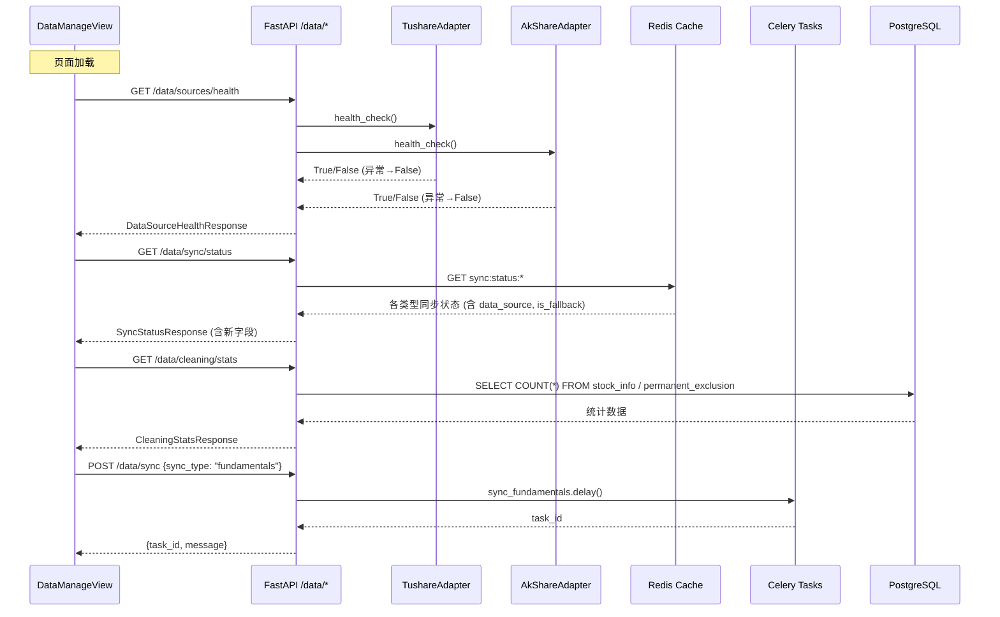

#### 手动同步触发流程

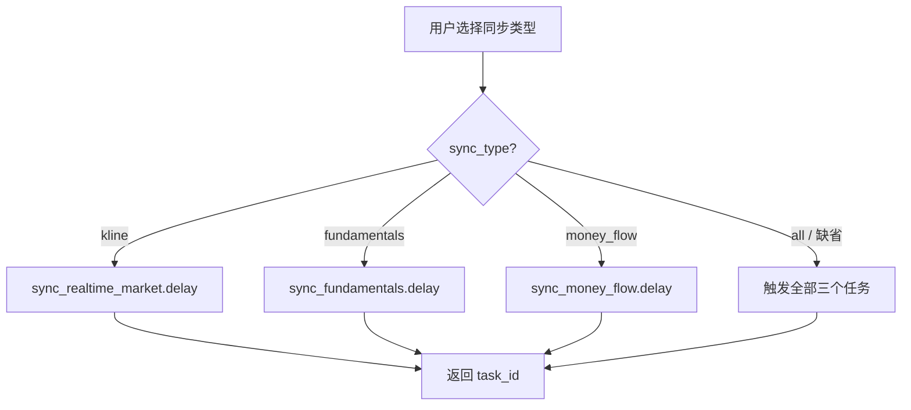

### 组件与接口

#### 1. 新增 API：`GET /api/v1/data/sources/health`（需求 24.1, 24.9）

分别调用 TushareAdapter 和 AkShareAdapter 的 `health_check()` 方法，异常时捕获并标记为 disconnected。

```python
# app/api/v1/data.py 新增

from datetime import datetime
from pydantic import BaseModel

class DataSourceStatus(BaseModel):
    name: str                          # "Tushare" | "AkShare"
    status: str                        # "connected" | "disconnected"
    checked_at: str                    # ISO 8601 时间戳

class DataSourceHealthResponse(BaseModel):
    sources: list[DataSourceStatus]

@router.get("/sources/health")
async def get_sources_health() -> DataSourceHealthResponse:
    """检查 Tushare 和 AkShare 数据源连通性。"""
    tushare = TushareAdapter()
    akshare = AkShareAdapter()
    now = datetime.now().isoformat()

    results = []
    for name, adapter in [("Tushare", tushare), ("AkShare", akshare)]:
        try:
            ok = await adapter.health_check()
            results.append(DataSourceStatus(
                name=name,
                status="connected" if ok else "disconnected",
                checked_at=now,
            ))
        except Exception:
            results.append(DataSourceStatus(
                name=name,
                status="disconnected",
                checked_at=now,
            ))

    return DataSourceHealthResponse(sources=results)
```

关键设计决策：
- `health_check()` 本身已有 try/except 返回 bool，但外层再包一层 try/except 防御未预期异常（需求 24.9）
- 两个 adapter 的 health_check 可并发执行（`asyncio.gather`），但为简化先串行调用，后续可优化

#### 2. 更新 API：`GET /api/v1/data/sync/status`（需求 24.3）

在每条同步状态记录中新增 `data_source` 和 `is_fallback` 字段。同步状态通过 Redis 缓存存储，由 Celery 任务在执行时写入。

```python
# Redis 缓存键设计
# sync:status:{data_type} → JSON string
# 示例: sync:status:fundamentals → {
#   "source": "基本面数据",
#   "last_sync_at": "2024-01-02T18:00:00",
#   "status": "OK",
#   "record_count": 48000,
#   "data_source": "Tushare",
#   "is_fallback": false
# }

class SyncStatusItem(BaseModel):
    source: str                        # 数据类型名称
    last_sync_at: str | None           # 最后同步时间
    status: str                        # "OK" | "ERROR" | "SYNCING"
    record_count: int                  # 已同步记录数
    data_source: str                   # "Tushare" | "AkShare"
    is_fallback: bool                  # 是否触发了故障转移

class SyncStatusResponse(BaseModel):
    items: list[SyncStatusItem]

@router.get("/sync/status")
async def get_sync_status() -> SyncStatusResponse:
    """查询各数据类型同步状态（含数据源和故障转移信息）。"""
    from app.core.redis_client import get_redis_client
    import json

    client = get_redis_client()
    try:
        data_types = ["kline", "fundamentals", "money_flow"]
        type_labels = {
            "kline": "行情数据",
            "fundamentals": "基本面数据",
            "money_flow": "资金流向",
        }
        items = []
        for dt in data_types:
            raw = await client.get(f"sync:status:{dt}")
            if raw:
                info = json.loads(raw)
                items.append(SyncStatusItem(**info))
            else:
                items.append(SyncStatusItem(
                    source=type_labels.get(dt, dt),
                    last_sync_at=None,
                    status="UNKNOWN",
                    record_count=0,
                    data_source="N/A",
                    is_fallback=False,
                ))
        return SyncStatusResponse(items=items)
    finally:
        await client.aclose()
```

Celery 任务侧写入同步状态的逻辑（在 `data_sync.py` 中更新）：

```python
# app/tasks/data_sync.py 中，每个同步任务完成后写入 Redis
import json
from app.core.redis_client import cache_set

async def _update_sync_status(
    data_type: str,
    source_label: str,
    status: str,
    record_count: int,
    data_source: str,
    is_fallback: bool,
) -> None:
    """将同步状态写入 Redis 缓存。"""
    await cache_set(
        f"sync:status:{data_type}",
        json.dumps({
            "source": source_label,
            "last_sync_at": datetime.now().isoformat(),
            "status": status,
            "record_count": record_count,
            "data_source": data_source,
            "is_fallback": is_fallback,
        }),
        ex=86400,  # 24 小时过期
    )
```

在 `DataSourceRouter.fetch_with_fallback()` 中，通过返回值或上下文标记实际使用的数据源：

```python
# DataSourceRouter 扩展：返回数据源标识
async def fetch_with_fallback(self, method_name: str, *args, **kwargs) -> tuple[Any, str, bool]:
    """返回 (data, data_source_name, is_fallback)"""
    try:
        primary_method = getattr(self._primary, method_name)
        result = await primary_method(*args, **kwargs)
        return result, "Tushare", False
    except Exception:
        ...
    try:
        fallback_method = getattr(self._fallback, method_name)
        result = await fallback_method(*args, **kwargs)
        return result, "AkShare", True
    except Exception:
        ...
        raise DataSourceUnavailableError(...)
```

> 注意：为保持向后兼容，可新增 `fetch_with_fallback_info()` 方法返回三元组，原 `fetch_with_fallback()` 保持不变仅返回数据。

#### 3. 更新 API：`POST /api/v1/data/sync`（需求 24.5）

接受可选 `sync_type` 参数，按类型分发 Celery 任务。

```python
from pydantic import BaseModel

class SyncRequest(BaseModel):
    sync_type: str | None = None       # "kline" | "fundamentals" | "money_flow" | "all" | None

class SyncResponse(BaseModel):
    message: str
    task_ids: list[str]

@router.post("/sync")
async def trigger_sync(body: SyncRequest | None = None) -> SyncResponse:
    """手动触发数据同步任务，支持按类型选择。"""
    from app.tasks.data_sync import (
        sync_realtime_market,
        sync_fundamentals,
        sync_money_flow,
    )

    sync_type = (body.sync_type if body else None) or "all"
    task_ids = []

    task_map = {
        "kline": (sync_realtime_market, "行情数据"),
        "fundamentals": (sync_fundamentals, "基本面数据"),
        "money_flow": (sync_money_flow, "资金流向"),
    }

    if sync_type == "all":
        for task_fn, _ in task_map.values():
            result = task_fn.delay()
            task_ids.append(result.id)
    elif sync_type in task_map:
        task_fn, _ = task_map[sync_type]
        result = task_fn.delay()
        task_ids.append(result.id)
    else:
        return SyncResponse(
            message=f"未知的同步类型: {sync_type}",
            task_ids=[],
        )

    type_label = "全部" if sync_type == "all" else task_map.get(sync_type, ("", sync_type))[1]
    return SyncResponse(
        message=f"{type_label}同步任务已触发，请稍后查看同步状态",
        task_ids=task_ids,
    )
```

#### 4. 新增 API：`GET /api/v1/data/cleaning/stats`（需求 24.7）

从 `stock_info` 和 `permanent_exclusion` 表查询实时清洗统计。

```python
from sqlalchemy import select, func

class CleaningStatsResponse(BaseModel):
    total_stocks: int                  # 总股票数
    valid_stocks: int                  # 有效标的数
    st_delisted_count: int             # ST/退市剔除数
    new_stock_count: int               # 新股剔除数
    suspended_count: int               # 停牌剔除数（permanent_exclusion reason='SUSPENDED'）
    high_pledge_count: int             # 高质押剔除数

@router.get("/cleaning/stats")
async def get_cleaning_stats() -> CleaningStatsResponse:
    """查询实时数据清洗统计信息。"""
    from app.core.database import AsyncSessionPG
    from app.models.stock import StockInfo, PermanentExclusion

    async with AsyncSessionPG() as session:
        # 总股票数
        total = (await session.execute(
            select(func.count()).select_from(StockInfo)
        )).scalar_one()

        # ST/退市数（stock_info 表中 is_st=True 或 is_delisted=True）
        st_delisted = (await session.execute(
            select(func.count()).select_from(StockInfo).where(
                (StockInfo.is_st == True) | (StockInfo.is_delisted == True)
            )
        )).scalar_one()

        # 新股剔除数（permanent_exclusion 表 reason='NEW_STOCK'）
        new_stock = (await session.execute(
            select(func.count()).select_from(PermanentExclusion).where(
                PermanentExclusion.reason == "NEW_STOCK"
            )
        )).scalar_one()

        # 停牌剔除数
        suspended = (await session.execute(
            select(func.count()).select_from(PermanentExclusion).where(
                PermanentExclusion.reason == "SUSPENDED"
            )
        )).scalar_one()

        # 高质押剔除数（pledge_ratio > 70）
        high_pledge = (await session.execute(
            select(func.count()).select_from(StockInfo).where(
                StockInfo.pledge_ratio > 70
            )
        )).scalar_one()

        valid = total - st_delisted - new_stock - suspended - high_pledge

    return CleaningStatsResponse(
        total_stocks=total,
        valid_stocks=max(valid, 0),
        st_delisted_count=st_delisted,
        new_stock_count=new_stock,
        suspended_count=suspended,
        high_pledge_count=high_pledge,
    )
```

#### 5. 前端变更：DataManageView.vue（需求 24.2, 24.4, 24.6, 24.8, 24.10）

##### 5a. 新增 TypeScript 接口

```typescript
// 数据源健康状态
interface DataSourceStatus {
  name: string                         // "Tushare" | "AkShare"
  status: 'connected' | 'disconnected'
  checked_at: string
}

interface DataSourceHealthResponse {
  sources: DataSourceStatus[]
}

// 更新后的同步状态（新增 data_source, is_fallback）
interface SyncStatus {
  source: string
  last_sync_at: string | null
  status: 'OK' | 'ERROR' | 'SYNCING' | 'UNKNOWN'
  record_count: number
  data_source: string                  // "Tushare" | "AkShare" | "N/A"
  is_fallback: boolean
}

// 同步请求
interface SyncRequest {
  sync_type?: 'kline' | 'fundamentals' | 'money_flow' | 'all'
}

// 数据清洗统计
interface CleaningStatsResponse {
  total_stocks: number
  valid_stocks: number
  st_delisted_count: number
  new_stock_count: number
  suspended_count: number
  high_pledge_count: number
}
```

##### 5b. 健康状态卡片区域（需求 24.2）

在页面顶部（同步状态表格之前）新增数据源健康状态卡片区域：

```html
<!-- 数据源健康状态 -->
<section class="card" aria-label="数据源健康状态">
  <h2 class="section-title">数据源健康状态</h2>
  <LoadingSpinner v-if="healthState.loading" text="检测数据源..." />
  <ErrorBanner v-else-if="healthState.error" :message="healthState.error" :retryFn="fetchHealth" />
  <div v-else class="health-grid">
    <div
      v-for="src in healthState.data?.sources ?? []"
      :key="src.name"
      class="health-card"
      :class="src.status === 'connected' ? 'health-ok' : 'health-err'"
    >
      <div class="health-name">{{ src.name }}</div>
      <div class="health-status">
        {{ src.status === 'connected' ? '✅ 已连接' : '❌ 已断开' }}
      </div>
      <div class="health-time">{{ formatTime(src.checked_at) }}</div>
    </div>
  </div>
</section>
```

样式：
- 连通（connected）：绿色背景 `#1a3a1a`，绿色文字 `#3fb950`
- 断开（disconnected）：红色背景 `#3a1a1a`，红色文字 `#f85149`

##### 5c. 同步类型选择器（需求 24.6）

在手动同步按钮前新增下拉选择框：

```html
<div class="section-header">
  <h2 class="section-title">数据源同步状态</h2>
  <div class="sync-controls">
    <select v-model="syncType" class="sync-select" aria-label="选择同步类型">
      <option value="all">全部同步</option>
      <option value="kline">行情数据</option>
      <option value="fundamentals">基本面数据</option>
      <option value="money_flow">资金流向</option>
    </select>
    <button class="btn btn-primary" :disabled="syncLoading" @click="triggerSync">
      {{ syncLoading ? '同步中...' : '手动同步' }}
    </button>
  </div>
</div>
```

`triggerSync()` 更新为传递 `sync_type` 参数：

```typescript
const syncType = ref<string>('all')

async function triggerSync() {
  syncLoading.value = true
  syncMsg.value = ''
  try {
    await apiClient.post('/data/sync', { sync_type: syncType.value })
    syncMsg.value = '同步任务已触发，请稍后刷新查看状态'
    syncMsgType.value = 'success'
    setTimeout(fetchSyncStatus, 2000)
  } catch (e: unknown) {
    syncMsg.value = e instanceof Error ? e.message : '触发同步失败，请重试'
    syncMsgType.value = 'error'
  } finally {
    syncLoading.value = false
    setTimeout(() => { syncMsg.value = '' }, 5000)
  }
}
```

##### 5d. 同步状态表格新增"数据源"列（需求 24.4）

```html
<thead>
  <tr>
    <th scope="col">数据源</th>
    <th scope="col">数据源</th>  <!-- 新增列：实际使用的数据源 -->
    <th scope="col">最后同步时间</th>
    <th scope="col">状态</th>
    <th scope="col">已同步记录数</th>
  </tr>
</thead>
<tbody>
  <tr v-for="item in syncStatusState.data?.items ?? []" :key="item.source">
    <td>{{ item.source }}</td>
    <td>
      {{ item.data_source }}
      <span v-if="item.is_fallback" class="fallback-badge">（故障转移）</span>
    </td>
    <td>{{ formatTime(item.last_sync_at) }}</td>
    <td>
      <span class="status-badge" :class="statusClass(item.status)">
        {{ statusLabel(item.status) }}
      </span>
    </td>
    <td>{{ item.record_count.toLocaleString() }}</td>
  </tr>
</tbody>
```

故障转移标注样式：黄色文字 `#d29922`，提示用户该次同步使用了备用数据源。

##### 5e. API 驱动的清洗统计（需求 24.8, 24.10）

替换硬编码的静态数值，改为从 API 获取：

```typescript
const { state: cleaningState, execute: execCleaning } = usePageState<CleaningStatsResponse>()

async function fetchCleaningStats() {
  await execCleaning(() =>
    apiClient.get<CleaningStatsResponse>('/data/cleaning/stats').then(r => r.data),
  )
}

onMounted(() => {
  fetchHealth()
  fetchSyncStatus()
  fetchExclusions()
  fetchCleaningStats()  // 新增
})
```

模板中替换硬编码区域：

```html
<section class="card" aria-label="数据清洗统计">
  <h2 class="section-title">数据清洗统计</h2>
  <LoadingSpinner v-if="cleaningState.loading" text="加载清洗统计..." />
  <ErrorBanner
    v-else-if="cleaningState.error"
    :message="cleaningState.error"
    :retryFn="fetchCleaningStats"
  />
  <div v-else class="stats-grid">
    <div class="stat-card">
      <div class="stat-label">总股票数</div>
      <div class="stat-value">{{ cleaningState.data?.total_stocks?.toLocaleString() ?? '—' }}</div>
    </div>
    <div class="stat-card">
      <div class="stat-label">有效标的</div>
      <div class="stat-value highlight">{{ cleaningState.data?.valid_stocks?.toLocaleString() ?? '—' }}</div>
    </div>
    <div class="stat-card">
      <div class="stat-label">ST / 退市剔除</div>
      <div class="stat-value warn">{{ cleaningState.data?.st_delisted_count?.toLocaleString() ?? '—' }}</div>
    </div>
    <div class="stat-card">
      <div class="stat-label">新股剔除</div>
      <div class="stat-value warn">{{ cleaningState.data?.new_stock_count?.toLocaleString() ?? '—' }}</div>
    </div>
    <div class="stat-card">
      <div class="stat-label">停牌剔除</div>
      <div class="stat-value warn">{{ cleaningState.data?.suspended_count?.toLocaleString() ?? '—' }}</div>
    </div>
    <div class="stat-card">
      <div class="stat-label">高质押剔除</div>
      <div class="stat-value warn">{{ cleaningState.data?.high_pledge_count?.toLocaleString() ?? '—' }}</div>
    </div>
  </div>
</section>
```

### 数据模型

#### 后端 Pydantic 响应模型

```python
# 可放在 app/api/v1/data.py 中或单独的 schemas 文件

from pydantic import BaseModel

class DataSourceStatus(BaseModel):
    name: str                          # "Tushare" | "AkShare"
    status: str                        # "connected" | "disconnected"
    checked_at: str                    # ISO 8601

class DataSourceHealthResponse(BaseModel):
    sources: list[DataSourceStatus]

class SyncStatusItem(BaseModel):
    source: str                        # 数据类型名称
    last_sync_at: str | None
    status: str                        # "OK" | "ERROR" | "SYNCING" | "UNKNOWN"
    record_count: int
    data_source: str                   # "Tushare" | "AkShare" | "N/A"
    is_fallback: bool

class SyncStatusResponse(BaseModel):
    items: list[SyncStatusItem]

class SyncRequest(BaseModel):
    sync_type: str | None = None       # "kline" | "fundamentals" | "money_flow" | "all"

class SyncResponse(BaseModel):
    message: str
    task_ids: list[str]

class CleaningStatsResponse(BaseModel):
    total_stocks: int
    valid_stocks: int
    st_delisted_count: int
    new_stock_count: int
    suspended_count: int
    high_pledge_count: int
```

#### Redis 缓存键

| 键 | 值格式 | 过期时间 | 写入方 |
|---|---|---|---|
| `sync:status:kline` | JSON（SyncStatusItem 字段） | 24h | `sync_realtime_market` 任务 |
| `sync:status:fundamentals` | JSON（SyncStatusItem 字段） | 24h | `sync_fundamentals` 任务 |
| `sync:status:money_flow` | JSON（SyncStatusItem 字段） | 24h | `sync_money_flow` 任务 |

#### 数据库查询（清洗统计）

清洗统计不引入新表，直接查询现有 `stock_info` 和 `permanent_exclusion` 表：

| 统计项 | 查询逻辑 |
|---|---|
| 总股票数 | `SELECT COUNT(*) FROM stock_info` |
| ST/退市剔除数 | `SELECT COUNT(*) FROM stock_info WHERE is_st = TRUE OR is_delisted = TRUE` |
| 新股剔除数 | `SELECT COUNT(*) FROM permanent_exclusion WHERE reason = 'NEW_STOCK'` |
| 停牌剔除数 | `SELECT COUNT(*) FROM permanent_exclusion WHERE reason = 'SUSPENDED'` |
| 高质押剔除数 | `SELECT COUNT(*) FROM stock_info WHERE pledge_ratio > 70` |
| 有效标的数 | `总股票数 - ST/退市 - 新股 - 停牌 - 高质押` |


### 正确性属性（需求 24）

*属性（Property）是在系统所有有效执行中都应成立的特征或行为——本质上是对系统应做什么的形式化陈述。属性是人类可读规范与机器可验证正确性保证之间的桥梁。*

#### 属性 53：健康检查端点返回正确状态

*对任意* TushareAdapter 和 AkShareAdapter 的 `health_check()` 结果组合（True/False/抛出异常），`GET /data/sources/health` 接口应始终返回包含恰好 2 个数据源的响应，每个数据源的 `status` 字段应为 "connected"（当 `health_check()` 返回 True 时）或 "disconnected"（当返回 False 或抛出任何异常时），且 `checked_at` 字段不为空。

**验证需求：24.1, 24.9**

---

#### 属性 54：同步状态响应包含数据源和故障转移字段

*对任意*同步状态记录，`GET /data/sync/status` 接口返回的每条 `SyncStatusItem` 应包含 `data_source` 字段（取值为 "Tushare"、"AkShare" 或 "N/A"）和 `is_fallback` 布尔字段；当 `data_source` 为 "AkShare" 且该次同步是因 Tushare 失败而触发时，`is_fallback` 应为 true。

**验证需求：24.3**

---

#### 属性 55：手动同步按类型分发正确的 Celery 任务

*对任意*有效的 `sync_type` 参数值，`POST /data/sync` 接口应分发正确的 Celery 任务：`sync_type="kline"` 仅触发 `sync_realtime_market`，`sync_type="fundamentals"` 仅触发 `sync_fundamentals`，`sync_type="money_flow"` 仅触发 `sync_money_flow`，`sync_type="all"` 或缺省时触发全部三个任务；返回的 `task_ids` 数量应与触发的任务数量一致。

**验证需求：24.5**

---

#### 属性 56：清洗统计数据库查询正确性

*对任意* `stock_info` 和 `permanent_exclusion` 表的数据状态，`GET /data/cleaning/stats` 接口返回的 `total_stocks` 应等于 `stock_info` 表总行数，`st_delisted_count` 应等于 `is_st=True` 或 `is_delisted=True` 的行数，`new_stock_count` 应等于 `permanent_exclusion` 中 `reason='NEW_STOCK'` 的行数，且 `valid_stocks` 应等于 `total_stocks - st_delisted_count - new_stock_count - suspended_count - high_pledge_count`（下限为 0）。

**验证需求：24.7**

---

#### 属性 57：数据源状态 UI 渲染正确性

*对任意*健康检查响应和同步状态响应的组合，DataManageView 页面应满足：健康状态卡片中，`status="connected"` 的数据源显示绿色"已连接"标识，`status="disconnected"` 的数据源显示红色"已断开"标识；同步状态表格中，每行应显示 `data_source` 列，当 `is_fallback=true` 时该列应包含"（故障转移）"标注文本。

**验证需求：24.2, 24.4**

---

#### 属性 58：清洗统计 UI 展示 API 数据正确性

*对任意*有效的 `CleaningStatsResponse` 数据，DataManageView 页面的数据清洗统计区域应展示与 API 返回值一致的数值（总股票数、有效标的数、ST/退市剔除数、新股剔除数、停牌剔除数、高质押剔除数），不应包含任何硬编码的静态数值。

**验证需求：24.8**

---

### 错误处理（需求 24）

| 错误场景 | 处理策略 |
|---|---|
| TushareAdapter.health_check() 抛出异常 | 捕获异常，将该数据源状态标记为 "disconnected"，接口正常返回（需求 24.9） |
| AkShareAdapter.health_check() 抛出异常 | 同上，捕获异常标记为 "disconnected"（需求 24.9） |
| Redis 中无同步状态缓存 | 返回 status="UNKNOWN"、data_source="N/A"、is_fallback=false 的默认值 |
| POST /data/sync 传入无效 sync_type | 返回错误提示信息，不触发任何 Celery 任务 |
| GET /data/cleaning/stats 数据库查询失败 | 后端返回 500 错误，前端显示 ErrorBanner 组件并提供重试按钮（需求 24.10） |
| Celery 任务分发失败（Redis 不可用） | POST /data/sync 返回 500 错误，前端显示错误提示 |

### 测试策略（需求 24）

#### 属性测试

**后端（Hypothesis）：**

| 属性 | 测试文件 | 最少迭代 |
|---|---|---|
| 属性 53：健康检查端点返回正确状态 | `tests/properties/test_data_health_properties.py` | 100 |
| 属性 54：同步状态响应包含数据源字段 | `tests/properties/test_data_sync_status_properties.py` | 100 |
| 属性 55：手动同步按类型分发任务 | `tests/properties/test_data_sync_dispatch_properties.py` | 100 |
| 属性 56：清洗统计数据库查询正确性 | `tests/properties/test_cleaning_stats_properties.py` | 100 |

**前端（fast-check + Vitest）：**

| 属性 | 测试文件 | 最少迭代 |
|---|---|---|
| 属性 57：数据源状态 UI 渲染正确性 | `frontend/src/views/__tests__/data-source-status.property.test.ts` | 100 |
| 属性 58：清洗统计 UI 展示 API 数据 | `frontend/src/views/__tests__/cleaning-stats.property.test.ts` | 100 |

每个属性测试必须通过注释标注对应的设计文档属性编号，格式：
- 后端：`# Feature: data-manage-dual-source-integration, Property 53: 健康检查端点返回正确状态`
- 前端：`// Feature: data-manage-dual-source-integration, Property 57: 数据源状态 UI 渲染正确性`

#### 单元测试

**后端：**
- `GET /data/sources/health` 两个数据源均连通的示例
- `GET /data/sources/health` 一个连通一个断开的示例
- `GET /data/sources/health` health_check 抛出异常的边界示例
- `GET /data/sync/status` Redis 有缓存数据的示例
- `GET /data/sync/status` Redis 无缓存数据的默认值示例
- `POST /data/sync` sync_type="fundamentals" 仅触发基本面任务的示例
- `POST /data/sync` sync_type 缺省触发全部任务的示例
- `GET /data/cleaning/stats` 正常查询返回正确统计的示例
- `GET /data/cleaning/stats` 数据库连接失败返回 500 的示例

**前端：**
- DataManageView 页面加载时调用 4 个 API 的集成示例
- 健康状态卡片绿色/红色渲染示例
- 同步类型下拉选择器选项完整性示例
- 同步状态表格故障转移标注渲染示例
- 清洗统计区域 API 数据替换硬编码的示例
- 清洗统计 API 失败时 ErrorBanner 显示和重试的示例

#### 集成测试

- 健康检查 → 数据源状态卡片渲染 → 手动同步（指定类型）→ 同步状态刷新（含数据源列）全链路测试
- 数据库写入测试数据 → 清洗统计 API 查询 → 前端展示验证全链路测试


---

## 需求 25：历史数据批量回填（行情、基本面、资金流向）

### 概述

本节设计历史数据批量回填子系统，支持 K 线行情、基本面、资金流向三种数据类型的批量回填与每日增量同步。系统复用已有的 DataSourceRouter（Tushare 主 / AkShare 备故障转移）、KlineRepository（TimescaleDB 幂等写入）、Redis 缓存辅助和 Celery 异步任务队列，新增 BackfillService 编排层、三个历史回填 Celery 任务、两个 REST API 端点、一个 Celery Beat 定时任务，以及前端 DataManageView 的回填操作区域。

### 架构

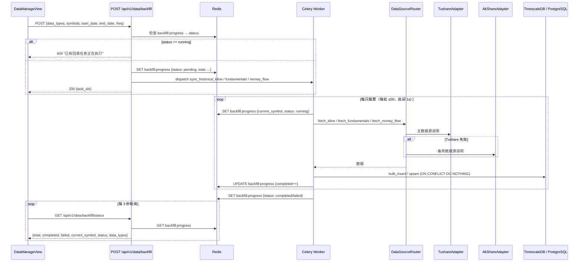

### 组件与接口

#### 1. BackfillService（回填编排服务）

位于 `app/services/data_engine/backfill_service.py`，负责参数校验、默认值填充、并发保护和任务分发。

```python
class BackfillService:
    """历史数据批量回填编排服务"""

    BATCH_SIZE = 50          # 每批最大股票数
    BATCH_DELAY = 1.0        # 批次间延迟（秒）
    REDIS_KEY = "backfill:progress"
    PROGRESS_TTL = 86400     # 进度信息 24h 过期

    async def start_backfill(
        self,
        data_types: list[str] | None = None,
        symbols: list[str] | None = None,
        start_date: date | None = None,
        end_date: date | None = None,
        freq: str = "1d",
    ) -> dict:
        """
        启动回填任务。

        1. 检查是否有正在运行的回填任务（并发保护）
        2. 填充默认参数（symbols → 全市场，start_date → 10年前）
        3. 初始化 Redis 进度
        4. 分发 Celery 任务
        """
        ...

    async def get_progress(self) -> dict:
        """从 Redis 读取回填进度"""
        ...

    def _resolve_symbols(self, symbols: list[str] | None) -> list[str]:
        """空列表时查询 StockInfo 全市场有效股票"""
        ...

    def _resolve_start_date(self, start_date: date | None) -> date:
        """未传入时使用 settings.kline_history_years 计算默认值"""
        ...
```

#### 2. API 端点

新增于 `app/api/v1/data.py`：

```python
# ── 请求/响应模型 ──

class BackfillRequest(BaseModel):
    data_types: list[str] | None = None   # ["kline", "fundamentals", "money_flow"]，默认全部
    symbols: list[str] | None = None      # 留空 = 全市场
    start_date: date | None = None        # 默认 = today - kline_history_years
    end_date: date | None = None          # 默认 = today
    freq: str = "1d"                      # 仅 kline 有效："1d" | "1w" | "1M"

class BackfillResponse(BaseModel):
    message: str
    task_ids: list[str]

class BackfillStatusResponse(BaseModel):
    total: int
    completed: int
    failed: int
    current_symbol: str
    status: str                           # "pending" | "running" | "completed" | "failed"
    data_types: list[str]


# ── 端点 ──

@router.post("/backfill")
async def start_backfill(body: BackfillRequest) -> BackfillResponse:
    """
    触发历史数据批量回填。
    - 已有任务运行中 → 返回 409
    - 否则初始化进度、分发 Celery 任务、返回 task_ids
    """
    ...

@router.get("/backfill/status")
async def get_backfill_status() -> BackfillStatusResponse:
    """
    查询回填进度（从 Redis 读取）。
    - Redis 无数据 → 返回 status="idle"
    """
    ...
```

#### 3. Celery 异步任务

新增于 `app/tasks/data_sync.py`：

```python
@celery_app.task(name="app.tasks.data_sync.sync_historical_kline", bind=True, queue="data_sync")
def sync_historical_kline(self, symbols: list[str], start_date: str, end_date: str, freq: str = "1d") -> dict:
    """
    历史 K 线回填任务。

    - 按 BATCH_SIZE=50 分批，批间 sleep(1)
    - 通过 DataSourceRouter.fetch_kline() 获取数据
    - 通过 KlineRepository.bulk_insert() 写入（ON CONFLICT DO NOTHING 幂等）
    - 每完成一只股票更新 Redis 进度
    - 单只股票失败 → failed++，继续下一只
    """
    ...

@celery_app.task(name="app.tasks.data_sync.sync_historical_fundamentals", bind=True, queue="data_sync")
def sync_historical_fundamentals(self, symbols: list[str], start_date: str, end_date: str) -> dict:
    """
    历史基本面回填任务。

    - 同样分批处理、进度追踪、容错继续
    - 通过 DataSourceRouter.fetch_fundamentals() 获取
    - 写入 PostgreSQL（唯一约束去重）
    """
    ...

@celery_app.task(name="app.tasks.data_sync.sync_historical_money_flow", bind=True, queue="data_sync")
def sync_historical_money_flow(self, symbols: list[str], start_date: str, end_date: str) -> dict:
    """
    历史资金流向回填任务。

    - 同样分批处理、进度追踪、容错继续
    - 通过 DataSourceRouter.fetch_money_flow() 获取
    - 写入 PostgreSQL（唯一约束去重）
    """
    ...

@celery_app.task(name="app.tasks.data_sync.sync_daily_kline", bind=True, queue="data_sync")
def sync_daily_kline(self) -> dict:
    """
    每日增量 K 线同步（Celery Beat 16:00 调度）。

    - 查询全市场有效股票
    - 回填前一个交易日的日 K 线数据
    - 复用 sync_historical_kline 的核心逻辑
    """
    ...
```

#### 4. Celery Beat 调度

在 `app/core/celery_app.py` 的 `beat_schedule` 中新增：

```python
"daily-kline-sync-1600": {
    "task": "app.tasks.data_sync.sync_daily_kline",
    "schedule": crontab(hour=16, minute=0, day_of_week="1-5"),
    "options": {"queue": "data_sync"},
},
```

#### 5. Redis 进度键设计

| 键名 | 类型 | 说明 | TTL |
|---|---|---|---|
| `backfill:progress` | Hash (JSON string) | 回填进度信息 | 86400s (24h) |

进度 JSON 结构：

```json
{
  "total": 5000,
  "completed": 1234,
  "failed": 5,
  "current_symbol": "600519.SH",
  "status": "running",
  "data_types": ["kline", "fundamentals", "money_flow"],
  "started_at": "2024-01-15T10:30:00",
  "errors": [
    {"symbol": "000001.SZ", "error": "DataSourceUnavailableError: ..."}
  ]
}
```

状态机：

```
idle → pending → running → completed
                        ↘ failed
```

- `idle`：无进度数据（Redis 键不存在或已过期）
- `pending`：API 已接受请求，Celery 任务尚未开始执行
- `running`：任务正在处理中
- `completed`：所有股票处理完毕（failed 可能 > 0）
- `failed`：任务本身异常中断（非单只股票失败）

### 数据模型

本需求不新增数据库表。K 线数据写入已有的 `kline` 超表（TimescaleDB），基本面数据写入 `stock_info` 表，资金流向数据写入已有的资金流向相关表。所有写入均通过已有的 ON CONFLICT DO NOTHING 或唯一约束实现幂等。

回填进度信息存储于 Redis（非持久化），24 小时自动过期。

### 前端组件设计（DataManageView 回填区域）

在 DataManageView.vue 的"数据清洗统计"区域之后、"永久剔除名单"区域之前，新增"历史数据回填"section：

```typescript
// ── 回填相关类型 ──

interface BackfillRequest {
  data_types: string[]        // ["kline", "fundamentals", "money_flow"]
  symbols: string[]           // 留空 = 全市场
  start_date: string | null   // ISO date
  end_date: string | null
  freq: string                // "1d" | "1w" | "1M"
}

interface BackfillProgress {
  total: number
  completed: number
  failed: number
  current_symbol: string
  status: 'idle' | 'pending' | 'running' | 'completed' | 'failed'
  data_types: string[]
}
```

UI 控件：
- 数据类型多选复选框：行情数据 / 基本面数据 / 资金流向（默认全选）
- 股票代码输入框：支持逗号分隔多个代码，placeholder="留空表示全市场"
- 起止日期选择器：`<input type="date">`
- K 线频率选择：日线 / 周线 / 月线（仅当"行情数据"被选中时显示）
- "开始回填"按钮：点击调用 `POST /api/v1/data/backfill`
- 进度展示区域：
  - 进度条：`completed / total`（百分比）
  - 当前处理：`current_symbol`
  - 数据类型：`data_types` 标签
  - 失败数：`failed`
  - 状态徽章：`status`
- 轮询逻辑：任务 running/pending 时每 3 秒调用 `GET /api/v1/data/backfill/status`，completed/failed 后停止

### 正确性属性（需求 25）

*正确性属性是在系统所有合法执行路径上都应成立的特征或行为——本质上是对系统应做什么的形式化陈述。属性是人类可读规格说明与机器可验证正确性保证之间的桥梁。*

#### Property 59: 回填 API 按数据类型分发对应 Celery 任务

*For any* 合法的 `data_types` 子集（从 `{"kline", "fundamentals", "money_flow"}` 中任意组合），调用 `POST /api/v1/data/backfill` 后，系统分发的 Celery 任务集合应与请求的 `data_types` 一一对应；`data_types` 为空或未传入时应分发全部三种任务。

**Validates: Requirements 25.1**

#### Property 60: 回填参数默认值填充正确性

*For any* 缺省 `symbols` 和/或缺省 `start_date` 的回填请求，BackfillService 应将 `symbols` 填充为 StockInfo 表中全部 `is_st=False AND is_delisted=False` 的有效股票列表，将 `start_date` 填充为 `today - settings.kline_history_years` 年。

**Validates: Requirements 25.2, 25.3**

#### Property 61: 回填任务通过 DataSourceRouter 获取数据并写入正确存储

*For any* 数据类型（kline / fundamentals / money_flow）和任意非空股票列表，对应的回填任务应对每只股票调用 DataSourceRouter 的相应方法获取数据，并将结果写入对应存储（kline → TimescaleDB via KlineRepository，fundamentals / money_flow → PostgreSQL），且 K 线任务应支持 `"1d"` / `"1w"` / `"1M"` 三种频率。

**Validates: Requirements 25.4, 25.5, 25.6**

#### Property 62: 批次大小不超过 50 且批间延迟 ≥ 1 秒

*For any* 长度为 N 的股票列表，回填任务应将其分为 `⌈N/50⌉` 个批次，每批不超过 50 只股票，且相邻批次的处理开始时间间隔不小于 1 秒。

**Validates: Requirements 25.7**

#### Property 63: 回填操作幂等性

*For any* 股票列表和日期范围，对同一数据执行两次回填后的数据库状态应与执行一次完全相同（K 线通过 ON CONFLICT DO NOTHING，基本面和资金流向通过唯一约束去重）。

**Validates: Requirements 25.8**

#### Property 64: 进度追踪 Redis 读写一致性

*For any* 回填进度状态（total, completed, failed, current_symbol, status, data_types），任务写入 Redis 的进度信息通过 `GET /api/v1/data/backfill/status` 读取后，返回的各字段值应与写入值一致。

**Validates: Requirements 25.9, 25.10**

#### Property 65: 单只股票失败不中断任务且 failed 计数正确

*For any* 长度为 N 的股票列表，其中 K 只股票的 DataSourceRouter 调用失败（0 ≤ K ≤ N），任务完成后 `completed + failed` 应等于 N，且 `failed` 应等于 K。

**Validates: Requirements 25.11**

#### Property 66: 并发保护——运行中拒绝新请求

*For any* Redis 中 `backfill:progress` 的 `status` 为 `"running"` 的状态，调用 `POST /api/v1/data/backfill` 应返回 HTTP 409 并包含拒绝提示信息，不分发任何新的 Celery 任务。

**Validates: Requirements 25.12**

#### Property 67: 前端回填控件根据数据类型选择动态显示频率选择器

*For any* 数据类型复选框选择状态，K 线频率选择控件应仅在"行情数据"被勾选时可见；未勾选"行情数据"时频率选择器应隐藏。

**Validates: Requirements 25.14**

#### Property 68: 前端进度展示包含所有必要字段

*For any* 合法的 BackfillProgress 状态对象（total ≥ 0, 0 ≤ completed ≤ total, 0 ≤ failed ≤ total），渲染后的进度区域应包含进度条（百分比）、当前处理股票代码、正在回填的数据类型标签、失败数量和任务状态徽章。

**Validates: Requirements 25.15**

### 错误处理（需求 25）

| 场景 | 处理方式 |
|---|---|
| 已有回填任务运行中 | `POST /backfill` 返回 HTTP 409，消息"已有回填任务正在执行，请等待完成后再试" |
| 单只股票 DataSourceRouter 双源均失败 | 记录错误日志，`failed++`，继续处理下一只股票 |
| Redis 连接失败（读取进度） | `GET /backfill/status` 返回 `status="idle"` 默认值 |
| Redis 连接失败（写入进度） | 任务继续执行，进度信息丢失但数据写入不受影响 |
| `symbols` 包含无效股票代码 | DataSourceRouter 调用失败，按单只股票失败处理 |
| `freq` 参数非法（非 1d/1w/1M） | API 层 Pydantic 校验拒绝，返回 HTTP 422 |
| `start_date > end_date` | API 层校验拒绝，返回 HTTP 422 |
| Celery 任务超时 | 依赖 Celery 的 `task_time_limit` 配置（默认 600s），超时后任务标记为 failed |
| 前端轮询 API 失败 | 显示 ErrorBanner，保留上次成功的进度数据，下次轮询自动重试 |

### 测试策略（需求 25）

#### 属性测试

**后端（Hypothesis + pytest）：**

| 属性 | 测试文件 | 最少迭代 |
|---|---|---|
| 属性 59：回填 API 按数据类型分发任务 | `tests/properties/test_backfill_dispatch_properties.py` | 100 |
| 属性 60：参数默认值填充正确性 | `tests/properties/test_backfill_defaults_properties.py` | 100 |
| 属性 61：回填任务数据流正确性 | `tests/properties/test_backfill_task_properties.py` | 100 |
| 属性 62：批次大小与延迟 | `tests/properties/test_backfill_batching_properties.py` | 100 |
| 属性 63：回填幂等性 | `tests/properties/test_backfill_idempotent_properties.py` | 100 |
| 属性 64：进度 Redis 读写一致性 | `tests/properties/test_backfill_progress_properties.py` | 100 |
| 属性 65：单只失败不中断且计数正确 | `tests/properties/test_backfill_fault_tolerance_properties.py` | 100 |
| 属性 66：并发保护拒绝新请求 | `tests/properties/test_backfill_concurrency_properties.py` | 100 |

**前端（fast-check + Vitest）：**

| 属性 | 测试文件 | 最少迭代 |
|---|---|---|
| 属性 67：频率选择器动态显隐 | `frontend/src/views/__tests__/backfill-freq-toggle.property.test.ts` | 100 |
| 属性 68：进度展示字段完整性 | `frontend/src/views/__tests__/backfill-progress-display.property.test.ts` | 100 |

每个属性测试必须通过注释标注对应的设计文档属性编号，格式：
- 后端：`# Feature: a-share-quant-trading-system, Property 59: 回填 API 按数据类型分发任务`
- 前端：`// Feature: a-share-quant-trading-system, Property 67: 频率选择器动态显隐`

#### 单元测试

**后端：**
- `POST /data/backfill` data_types=["kline"] 仅分发 kline 任务的示例
- `POST /data/backfill` data_types 缺省分发全部三种任务的示例
- `POST /data/backfill` symbols 为空时查询 StockInfo 全市场的示例
- `POST /data/backfill` 已有 running 任务时返回 409 的示例
- `GET /data/backfill/status` Redis 有进度数据的示例
- `GET /data/backfill/status` Redis 无数据返回 idle 默认值的示例
- `sync_historical_kline` 正常处理 3 只股票的示例
- `sync_historical_kline` 其中 1 只失败继续处理的示例
- `sync_historical_fundamentals` 正常处理的示例
- `sync_historical_money_flow` 正常处理的示例
- `sync_daily_kline` Celery Beat 调度配置验证的示例
- BackfillService 批次划分逻辑（100 只股票 → 2 批）的示例

**前端：**
- DataManageView 回填区域渲染所有控件的示例
- 数据类型复选框默认全选的示例
- 取消勾选"行情数据"后频率选择器隐藏的示例
- 点击"开始回填"调用 POST API 的示例
- 回填进行中进度条和状态正确渲染的示例
- 回填完成后轮询停止的示例
- 已有任务运行中时显示拒绝提示的示例

#### 集成测试

- 触发回填 → Celery 任务执行 → Redis 进度更新 → 状态 API 查询 → 前端进度展示全链路测试
- 重复回填同一数据 → 验证数据库无重复记录（幂等性）全链路测试

---

## 需求 25.16–25.17：回填任务停止功能

### 概述

新增回填任务提前终止能力。通过 Redis 信号量机制实现协作式停止：前端调用停止 API → Redis 状态置为 `stopping` → Celery 任务在每只股票处理前检测状态 → 检测到 `stopping` 后停止处理并将状态更新为 `stopped`。已写入数据库的数据保留不回滚。

### 架构

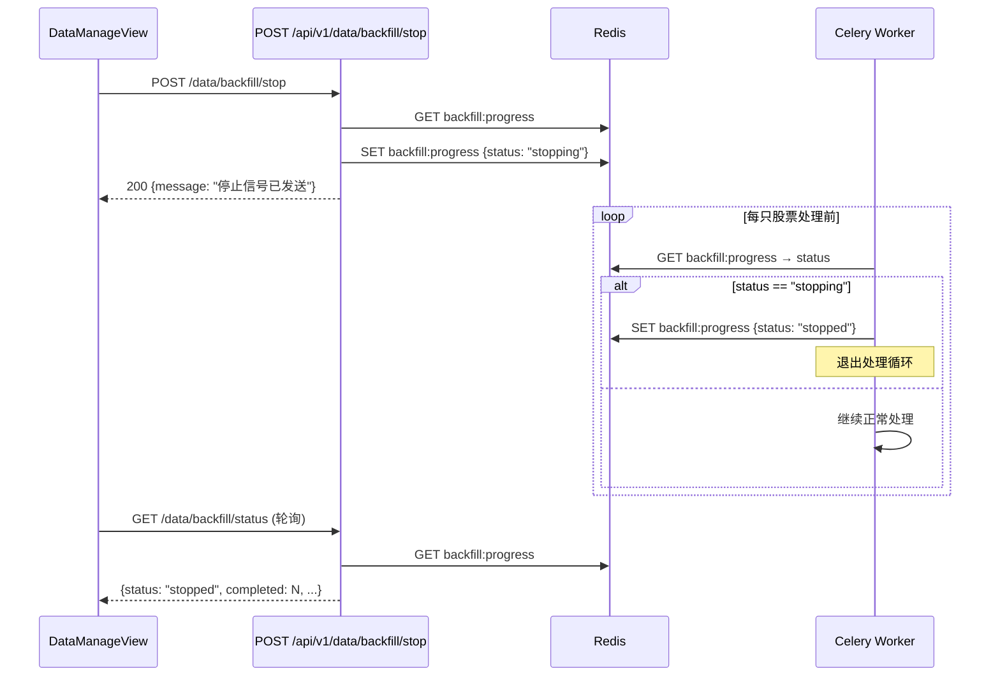

### 组件与接口

#### 1. BackfillService 新增 `stop_backfill()` 方法

```python
async def stop_backfill(self) -> dict:
    """
    发送停止信号。

    将 Redis 中 backfill:progress 的 status 设为 "stopping"。
    仅当当前状态为 running 或 pending 时有效，否则返回提示。
    """
    ...
```

#### 2. REST API 端点

```python
@router.post("/backfill/stop")
async def stop_backfill() -> dict:
    """
    停止正在执行的回填任务。
    - 当前无运行中任务 → 返回提示"当前没有正在执行的回填任务"
    - 否则发送停止信号 → 返回 {message: "停止信号已发送"}
    """
    ...
```

#### 3. Celery 任务停止检测

三个历史回填任务（`sync_historical_kline`、`sync_historical_fundamentals`、`sync_historical_money_flow`）在每只股票处理前检查 Redis 中 `backfill:progress` 的 `status` 字段：

```python
# 在每只股票处理循环的开头
progress_raw = await cache_get(REDIS_KEY)
if progress_raw:
    progress = json.loads(progress_raw)
    if progress.get("status") == "stopping":
        progress["status"] = "stopped"
        await cache_set(REDIS_KEY, json.dumps(progress), ex=PROGRESS_TTL)
        logger.info("收到停止信号，回填任务提前终止")
        return {...}  # 返回当前进度
```

#### 4. 前端 DataManageView 停止按钮

- 在"开始回填"按钮旁新增"停止回填"按钮
- 仅当 `backfillProgress.status` 为 `running` 或 `pending` 时显示
- 点击后调用 `POST /api/v1/data/backfill/stop`
- 请求期间按钮显示"停止中..."并禁用
- 任务状态变为 `stopped`/`completed`/`failed` 后按钮隐藏

### Redis 数据结构变更

`backfill:progress` 的 `status` 字段新增两个取值：

| status 值 | 含义 |
|---|---|
| `stopping` | 已收到停止信号，等待任务响应 |
| `stopped` | 任务已响应停止信号并终止 |

### 测试策略

- 属性测试：停止信号发送后 Redis status 正确变更为 stopping
- 属性测试：任务检测到 stopping 后立即停止并将 status 更新为 stopped
- 集成测试：启动回填 → 发送停止 → 验证任务提前终止且已写入数据保留


---

## 需求 26：大盘概况页面股票K线图扩展基本面数据与资金流向展示

### 概述

在大盘概况页面（DashboardView）现有的股票 K 线图查询区域，新增"基本面"和"资金流向"两个标签页，与现有"K线图"标签页并列。用户查询股票后可在三个视图间切换，分别查看技术走势、基本面核心指标和主力资金动向。

后端新增两个 REST API 端点，通过 DataSourceRouter 获取数据并返回结构化响应；前端通过 ECharts 柱状图和数据卡片组合展示资金流向趋势，通过颜色编码的数据卡片展示基本面指标。

### 架构

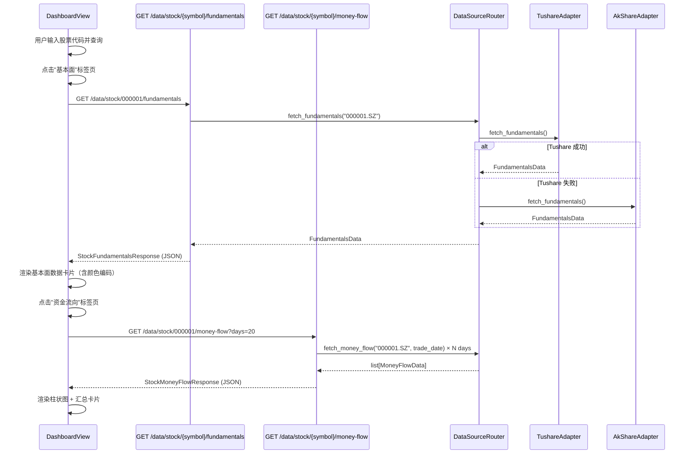

### 组件与接口

#### 1. 后端 API 端点

新增于 `app/api/v1/data.py`：

```python
@router.get("/stock/{symbol}/fundamentals")
async def get_stock_fundamentals(symbol: str) -> StockFundamentalsResponse:
    """
    获取指定股票的最新基本面数据。

    - 通过 DataSourceRouter.fetch_fundamentals() 获取
    - 将 FundamentalsData 映射为 API 响应模型
    - 股票不存在或无数据 → 返回 HTTP 404
    """
    ...


@router.get("/stock/{symbol}/money-flow")
async def get_stock_money_flow(
    symbol: str,
    days: int = Query(20, ge=1, le=60, description="查询天数，默认20"),
) -> StockMoneyFlowResponse:
    """
    获取指定股票近 N 个交易日的资金流向数据。

    - 计算最近 days 个交易日的日期列表
    - 对每个交易日调用 DataSourceRouter.fetch_money_flow()
    - 聚合为响应列表返回
    - 股票不存在或无数据 → 返回 HTTP 404
    """
    ...
```

#### 2. Pydantic 响应模型

新增于 `app/api/v1/data.py`：

```python
class StockFundamentalsResponse(BaseModel):
    """个股基本面数据响应"""
    symbol: str
    name: str | None = None
    pe_ttm: float | None = None           # 市盈率（TTM）
    pb: float | None = None               # 市净率
    roe: float | None = None              # 净资产收益率（%）
    market_cap: float | None = None       # 总市值（亿元）
    revenue_growth: float | None = None   # 营收同比增长率（%）
    net_profit_growth: float | None = None # 净利润同比增长率（%）
    report_period: str | None = None      # 报告期，如 "2024Q3"
    updated_at: str | None = None         # 数据更新时间（ISO 8601）


class MoneyFlowDailyRecord(BaseModel):
    """单日资金流向记录"""
    trade_date: str                        # 交易日期（ISO date）
    main_net_inflow: float                 # 主力资金净流入（万元）
    north_net_inflow: float | None = None  # 北向资金净流入（万元）
    large_order_ratio: float | None = None # 大单成交占比（%）
    super_large_inflow: float | None = None # 超大单净流入（万元）
    large_inflow: float | None = None      # 大单净流入（万元）


class StockMoneyFlowResponse(BaseModel):
    """个股资金流向数据响应"""
    symbol: str
    name: str | None = None
    days: int                              # 实际返回天数
    records: list[MoneyFlowDailyRecord]    # 每日记录列表（按日期升序）
```

#### 3. DataSourceRouter 代理方法

`DataSourceRouter` 已有 `fetch_fundamentals()` 和 `fetch_money_flow()` 代理方法，无需新增。API 端点直接调用即可。

#### 4. 前端 DashboardView 标签页组件结构

在 `DashboardView.vue` 的 `chart-section` 区域，将现有 K 线图包裹在标签页容器中：

```html
<!-- 标签页导航 -->
<div class="chart-tabs" role="tablist" aria-label="数据视图切换">
  <button
    v-for="tab in tabs"
    :key="tab.key"
    role="tab"
    :aria-selected="activeTab === tab.key"
    :class="['tab-btn', { active: activeTab === tab.key }]"
    @click="switchTab(tab.key)"
  >
    {{ tab.label }}
  </button>
</div>

<!-- K线图面板 -->
<div v-show="activeTab === 'kline'" role="tabpanel" aria-label="K线图">
  <!-- 现有 K 线图内容不变 -->
</div>

<!-- 基本面面板 -->
<div v-show="activeTab === 'fundamentals'" role="tabpanel" aria-label="基本面数据">
  <div v-if="fundamentalsLoading" class="loading-indicator">加载中...</div>
  <div v-else-if="fundamentalsError" class="error-banner">
    {{ fundamentalsError }}
    <button @click="loadFundamentals">重试</button>
  </div>
  <div v-else-if="fundamentals" class="fundamentals-cards">
    <div class="fund-card" v-for="item in fundamentalCards" :key="item.label">
      <span class="fund-label">{{ item.label }}</span>
      <span class="fund-value" :class="item.colorClass">{{ item.display }}</span>
    </div>
    <div class="fund-meta">
      报告期：{{ fundamentals.report_period }} | 更新时间：{{ fundamentals.updated_at }}
    </div>
  </div>
</div>

<!-- 资金流向面板 -->
<div v-show="activeTab === 'moneyFlow'" role="tabpanel" aria-label="资金流向数据">
  <div v-if="moneyFlowLoading" class="loading-indicator">加载中...</div>
  <div v-else-if="moneyFlowError" class="error-banner">
    {{ moneyFlowError }}
    <button @click="loadMoneyFlow">重试</button>
  </div>
  <div v-else-if="moneyFlow">
    <div class="money-flow-summary">
      <!-- 汇总卡片 -->
    </div>
    <div ref="moneyFlowChartRef" class="money-flow-chart"></div>
  </div>
</div>
```

#### 5. 前端 TypeScript 接口

```typescript
interface StockFundamentalsResponse {
  symbol: string
  name: string | null
  pe_ttm: number | null
  pb: number | null
  roe: number | null
  market_cap: number | null       // 亿元
  revenue_growth: number | null   // %
  net_profit_growth: number | null // %
  report_period: string | null
  updated_at: string | null
}

interface MoneyFlowDailyRecord {
  trade_date: string
  main_net_inflow: number         // 万元
  north_net_inflow: number | null // 万元
  large_order_ratio: number | null // %
  super_large_inflow: number | null // 万元
  large_inflow: number | null     // 万元
}

interface StockMoneyFlowResponse {
  symbol: string
  name: string | null
  days: number
  records: MoneyFlowDailyRecord[]
}

type ChartTab = 'kline' | 'fundamentals' | 'moneyFlow'
```

#### 6. 基本面颜色编码逻辑

```typescript
/**
 * 根据指标值返回 CSS 颜色类名。
 * 提取为纯函数以便属性测试。
 */
function getFundamentalColorClass(
  indicator: 'pe' | 'roe' | 'growth',
  value: number | null,
  industryAvgPe?: number
): string {
  if (value === null) return ''
  switch (indicator) {
    case 'pe':
      if (industryAvgPe == null) return ''
      return value < industryAvgPe ? 'color-green' : 'color-red'
    case 'roe':
      if (value > 15) return 'color-green'
      if (value < 8) return 'color-red'
      return ''
    case 'growth':
      return value > 0 ? 'color-red' : value < 0 ? 'color-green' : ''
    default:
      return ''
  }
}
```

#### 7. 资金流向柱状图 ECharts 配置

```typescript
function renderMoneyFlowChart(records: MoneyFlowDailyRecord[]) {
  if (!moneyFlowChartInstance || !records.length) return

  const dates = records.map(r => r.trade_date)
  const values = records.map(r => r.main_net_inflow)
  const colors = values.map(v => (v >= 0 ? '#f85149' : '#3fb950'))

  moneyFlowChartInstance.setOption({
    backgroundColor: 'transparent',
    tooltip: {
      trigger: 'axis',
      formatter: (params: any) => {
        const p = params[0]
        return `${p.name}<br/>主力净流入：${p.value.toFixed(2)} 万元`
      },
    },
    xAxis: {
      type: 'category',
      data: dates,
      axisLabel: { color: '#8b949e', rotate: 45 },
    },
    yAxis: {
      type: 'value',
      name: '万元',
      splitLine: { lineStyle: { color: '#21262d' } },
      axisLabel: { color: '#8b949e' },
    },
    series: [{
      type: 'bar',
      data: values.map((v, i) => ({
        value: v,
        itemStyle: { color: colors[i] },
      })),
    }],
  })
}
```

#### 8. 股票切换时数据重置

```typescript
// 在 loadKline() 成功后或 symbol 变更时调用
function resetTabData() {
  fundamentals.value = null
  fundamentalsError.value = ''
  fundamentalsLoading.value = false
  moneyFlow.value = null
  moneyFlowError.value = ''
  moneyFlowLoading.value = false
  // 如果当前在非 K 线标签页，自动加载对应数据
  if (activeTab.value === 'fundamentals') loadFundamentals()
  if (activeTab.value === 'moneyFlow') loadMoneyFlow()
}
```

### 数据模型

本需求不新增数据库表。后端 API 通过 DataSourceRouter 实时获取数据，不涉及持久化存储变更。

已有数据结构复用：
- `FundamentalsData`（`app/services/data_engine/fundamental_adapter.py`）：包含 `pe_ttm`、`pb`、`roe`、`market_cap`、`revenue_yoy`、`net_profit_yoy` 等字段，API 端点将 `revenue_yoy` 映射为 `revenue_growth`，`net_profit_yoy` 映射为 `net_profit_growth`
- `MoneyFlowData`（`app/services/data_engine/money_flow_adapter.py`）：包含 `main_net_inflow`、`north_net_inflow`、`large_order_ratio` 等字段

### 正确性属性（需求 26）

*正确性属性是在系统所有合法执行路径上都应成立的特征或行为——本质上是对系统应做什么的形式化陈述。属性是人类可读规格说明与机器可验证正确性保证之间的桥梁。*

#### Property 69: 基本面 API 响应包含全部必需字段

*For any* 合法的 `FundamentalsData` 对象（由 DataSourceRouter 返回），`GET /api/v1/data/stock/{symbol}/fundamentals` 的响应 JSON 应包含全部 8 个必需字段：`pe_ttm`、`pb`、`roe`、`market_cap`、`revenue_growth`、`net_profit_growth`、`report_period`、`updated_at`。

**Validates: Requirements 26.6**

#### Property 70: 资金流向 API 返回记录数不超过 days 参数

*For any* 合法的 `days` 参数值（1 ≤ days ≤ 60）和任意非空的 `MoneyFlowData` 列表，`GET /api/v1/data/stock/{symbol}/money-flow?days={days}` 返回的 `records` 列表长度应 ≤ `days`，且每条记录应包含 `trade_date`、`main_net_inflow`、`north_net_inflow`、`large_order_ratio`、`super_large_inflow`、`large_inflow` 全部 6 个字段。

**Validates: Requirements 26.7**

#### Property 71: 标签页切换仅显示当前激活面板

*For any* 标签页状态（`'kline'` | `'fundamentals'` | `'moneyFlow'`），DashboardView 应渲染三个标签按钮，且仅当前激活标签页对应的面板内容可见，其余两个面板隐藏。

**Validates: Requirements 26.1**

#### Property 72: 基本面数据卡片渲染全部指标及元数据

*For any* 合法的 `StockFundamentalsResponse`（所有数值字段非 null），渲染后的基本面标签页应包含 PE TTM、PB、ROE、总市值、营收同比增长率、净利润同比增长率六个指标值，以及报告期和更新时间。

**Validates: Requirements 26.2, 26.11**

#### Property 73: 基本面指标颜色编码正确性

*For any* PE TTM 值和行业均值、ROE 值、营收/净利润增长率值，颜色编码函数 `getFundamentalColorClass` 应满足：
- PE < 行业均值 → 绿色，PE ≥ 行业均值 → 红色
- ROE > 15% → 绿色，ROE < 8% → 红色，8% ≤ ROE ≤ 15% → 无色
- 增长率 > 0 → 红色，增长率 < 0 → 绿色，增长率 = 0 → 无色

**Validates: Requirements 26.5**

#### Property 74: 资金流向柱状图颜色映射

*For any* 资金流向每日记录列表，柱状图中每根柱体的颜色应满足：`main_net_inflow ≥ 0` 时为红色（`#f85149`），`main_net_inflow < 0` 时为绿色（`#3fb950`）。

**Validates: Requirements 26.4**

#### Property 75: 资金流向汇总卡片计算正确性

*For any* 长度 ≥ 5 的资金流向每日记录列表，"近5日主力资金净流入累计金额"应等于最近 5 条记录的 `main_net_inflow` 之和；"当日主力资金净流入"应等于最新一条记录的 `main_net_inflow`。

**Validates: Requirements 26.3**

#### Property 76: 加载与错误状态渲染

*For any* 加载状态（loading=true/false）和错误状态（error=null/非空字符串），基本面和资金流向标签页应满足：loading=true 时显示加载指示器；error 非空时显示错误信息和重试按钮；两者均为 false/null 时显示数据内容。

**Validates: Requirements 26.10**

#### Property 77: 切换股票查询时数据状态重置

*For any* 两个不同的股票代码，当从第一个股票切换到第二个股票查询时，基本面和资金流向的数据、加载状态、错误状态应全部重置为初始值。

**Validates: Requirements 26.12**

### 错误处理（需求 26）

| 场景 | 处理方式 |
|---|---|
| 股票代码不存在或无基本面数据 | `GET /stock/{symbol}/fundamentals` 返回 HTTP 404，消息"未找到该股票的基本面数据" |
| 股票代码不存在或无资金流向数据 | `GET /stock/{symbol}/money-flow` 返回 HTTP 404，消息"未找到该股票的资金流向数据" |
| DataSourceRouter 双源均不可用 | 捕获 `DataSourceUnavailableError`，返回 HTTP 503，消息"数据源暂时不可用，请稍后重试" |
| `days` 参数超出范围 | Pydantic/FastAPI 校验拒绝，返回 HTTP 422 |
| 前端 API 请求失败 | 显示错误提示信息，提供"重试"按钮，点击后重新调用对应接口 |
| 前端数据加载中 | 显示 loading spinner，禁用标签页切换操作 |
| 切换股票时旧请求未完成 | 使用 AbortController 取消旧请求，避免数据错乱 |

### 测试策略（需求 26）

#### 属性测试

**后端（Hypothesis + pytest）：**

| 属性 | 测试文件 | 最少迭代 |
|---|---|---|
| 属性 69：基本面 API 响应字段完整性 | `tests/properties/test_stock_fundamentals_api_properties.py` | 100 |
| 属性 70：资金流向 API 记录数与字段完整性 | `tests/properties/test_stock_money_flow_api_properties.py` | 100 |
| 属性 75：资金流向汇总计算正确性 | `tests/properties/test_money_flow_summary_properties.py` | 100 |

**前端（fast-check + Vitest）：**

| 属性 | 测试文件 | 最少迭代 |
|---|---|---|
| 属性 71：标签页切换显隐 | `frontend/src/views/__tests__/dashboard-tabs.property.test.ts` | 100 |
| 属性 72：基本面数据卡片渲染完整性 | `frontend/src/views/__tests__/dashboard-fundamentals-cards.property.test.ts` | 100 |
| 属性 73：基本面颜色编码正确性 | `frontend/src/views/__tests__/dashboard-fundamentals-color.property.test.ts` | 100 |
| 属性 74：资金流向柱状图颜色映射 | `frontend/src/views/__tests__/dashboard-money-flow-color.property.test.ts` | 100 |
| 属性 76：加载与错误状态渲染 | `frontend/src/views/__tests__/dashboard-loading-error.property.test.ts` | 100 |
| 属性 77：切换股票数据状态重置 | `frontend/src/views/__tests__/dashboard-stock-switch-reset.property.test.ts` | 100 |

每个属性测试必须通过注释标注对应的设计文档属性编号，格式：
- 后端：`# Feature: a-share-quant-trading-system, Property 69: 基本面 API 响应字段完整性`
- 前端：`// Feature: a-share-quant-trading-system, Property 71: 标签页切换显隐`

#### 单元测试

**后端：**
- `GET /data/stock/000001/fundamentals` 正常返回基本面数据的示例
- `GET /data/stock/INVALID/fundamentals` 返回 404 的示例
- `GET /data/stock/000001/money-flow` 默认 days=20 正常返回的示例
- `GET /data/stock/000001/money-flow?days=5` 指定天数返回的示例
- `GET /data/stock/INVALID/money-flow` 返回 404 的示例
- `FundamentalsData` → `StockFundamentalsResponse` 字段映射正确性（`revenue_yoy` → `revenue_growth`）的示例
- `MoneyFlowData` → `MoneyFlowDailyRecord` 单位转换（元 → 万元）的示例

**前端：**
- DashboardView 渲染三个标签页按钮的示例
- 点击"基本面"标签页触发 API 调用的示例
- 点击"资金流向"标签页触发 API 调用的示例
- 基本面数据卡片正确渲染各指标值的示例
- 资金流向柱状图正确渲染 20 根柱体的示例
- 资金流向汇总卡片显示当日和近5日累计金额的示例
- 接口请求失败时显示错误提示和重试按钮的示例
- 切换股票代码后旧数据被清除的示例

#### 集成测试

- 查询股票 → 切换基本面标签页 → 验证 API 调用 → 验证数据卡片渲染全链路测试
- 查询股票 → 切换资金流向标签页 → 验证 API 调用 → 验证柱状图和汇总卡片渲染全链路测试
- 查询股票 A → 切换到股票 B → 验证数据重置和重新加载全链路测试

---

## 需求 27：策略模板新建时可选配置模块多选

### 概述

当前系统新建策略模板时，所有五个配置模块（因子条件编辑器、均线趋势配置、技术指标配置、形态突破配置、量价资金筛选）默认全部展示，用户无法按需选择。本次设计新增 `enabled_modules` 字段，支持用户在新建策略时以复选框多选方式自由选择需要启用的模块（均为可选，可创建空策略），并在前端根据该字段动态显示/隐藏对应配置面板。后端 StockScreener 在执行选股时仅应用已启用模块的筛选逻辑，`enabled_modules` 为空时跳过所有筛选返回空结果。

### 架构

#### 数据流概览

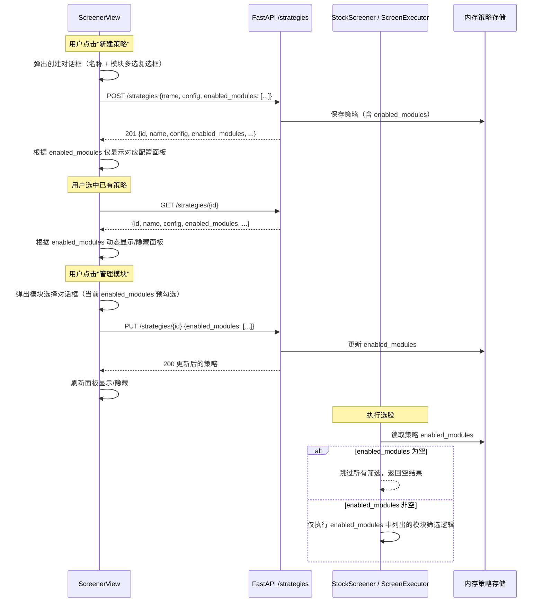

#### 模块标识符映射

| 模块中文名 | 模块标识符 | 对应配置面板 | 对应后端筛选逻辑 |
|---|---|---|---|
| 因子条件编辑器 | `factor_editor` | 因子条件编辑器区块 | StrategyEngine 多因子评估 |
| 均线趋势配置 | `ma_trend` | 均线趋势参数配置面板 | MaTrend 均线趋势筛选 |
| 技术指标配置 | `indicator_params` | 技术指标参数配置面板 | Indicators 技术指标筛选 |
| 形态突破配置 | `breakout` | 形态突破配置面板 | Breakout 形态突破筛选 |
| 量价资金筛选 | `volume_price` | 量价资金筛选配置面板 | VolumePrice 量价资金筛选 |

### 组件与接口

#### 1. 后端 API 变更

##### 1a. Pydantic 请求模型更新（`app/api/v1/screen.py`）

`StrategyTemplateIn` 和 `StrategyTemplateUpdate` 新增 `enabled_modules` 字段：

```python
# 合法的模块标识符集合
VALID_MODULES = {"factor_editor", "ma_trend", "indicator_params", "breakout", "volume_price"}

class StrategyTemplateIn(BaseModel):
    name: str
    config: StrategyConfigIn
    is_active: bool = False
    enabled_modules: list[str] = Field(default_factory=list)  # 新增

class StrategyTemplateUpdate(BaseModel):
    name: str | None = None
    config: StrategyConfigIn | None = None
    is_active: bool | None = None
    enabled_modules: list[str] | None = None  # 新增
```

##### 1b. 策略 CRUD 端点更新

`POST /strategies` 创建时将 `enabled_modules` 存入策略字典：

```python
@router.post("/strategies", status_code=201)
async def create_strategy(body: StrategyTemplateIn) -> dict:
    sid = str(uuid4())
    strategy = {
        "id": sid,
        "name": body.name,
        "config": body.config.model_dump(),
        "is_active": body.is_active,
        "enabled_modules": body.enabled_modules,  # 新增
        "created_at": datetime.now().isoformat(),
    }
    _strategies[sid] = strategy
    return strategy
```

`PUT /strategies/{id}` 更新时支持修改 `enabled_modules`：

```python
@router.put("/strategies/{strategy_id}")
async def update_strategy(strategy_id: UUID, body: StrategyTemplateUpdate) -> dict:
    # ... 已有逻辑 ...
    if body.enabled_modules is not None:
        s["enabled_modules"] = body.enabled_modules
    return s
```

`GET /strategies/{id}` 和 `GET /strategies` 返回的策略字典已包含 `enabled_modules` 字段，无需额外修改。

##### 1c. ScreenExecutor 选股逻辑更新（`app/services/screener/screen_executor.py`）

`ScreenExecutor` 构造函数新增 `enabled_modules` 参数，`_execute()` 方法根据该参数决定执行哪些筛选模块：

```python
class ScreenExecutor:
    def __init__(
        self,
        strategy_config: StrategyConfig,
        strategy_id: str | None = None,
        enabled_modules: list[str] | None = None,  # 新增
    ):
        self._config = strategy_config
        self._strategy_id = strategy_id or str(uuid.uuid4())
        self._enabled_modules = set(enabled_modules) if enabled_modules else set()

    def _execute(
        self,
        stocks_data: dict[str, dict[str, Any]],
        screen_type: ScreenType,
    ) -> ScreenResult:
        # enabled_modules 为空 → 跳过所有筛选，返回空结果
        if not self._enabled_modules:
            return ScreenResult(
                strategy_id=uuid.UUID(self._strategy_id),
                screen_time=datetime.now(),
                screen_type=screen_type,
                items=[],
                is_complete=True,
            )

        # 仅当 factor_editor 启用时执行多因子评估
        if "factor_editor" in self._enabled_modules:
            passed = StrategyEngine.screen_stocks(self._config, stocks_data)
        else:
            # 不使用因子筛选时，所有股票初始通过
            passed = [(sym, StrategyEngine.evaluate(self._config, data))
                      for sym, data in stocks_data.items()]

        # 后续各模块筛选仅在 enabled_modules 包含对应标识符时执行
        # ma_trend → 均线趋势筛选
        # indicator_params → 技术指标筛选
        # breakout → 形态突破筛选
        # volume_price → 量价资金筛选
        # ... 具体筛选逻辑按模块条件执行 ...
```

#### 2. 前端变更

##### 2a. 新增 TypeScript 类型

```typescript
/** 可选配置模块标识符 */
type StrategyModule = 'factor_editor' | 'ma_trend' | 'indicator_params' | 'breakout' | 'volume_price'

/** 模块定义（用于渲染复选框） */
interface ModuleOption {
  key: StrategyModule
  label: string
}

const ALL_MODULES: ModuleOption[] = [
  { key: 'factor_editor', label: '因子条件编辑器' },
  { key: 'ma_trend', label: '均线趋势配置' },
  { key: 'indicator_params', label: '技术指标配置' },
  { key: 'breakout', label: '形态突破配置' },
  { key: 'volume_price', label: '量价资金筛选' },
]

/** 更新后的策略模板接口 */
interface StrategyTemplate {
  id: string
  name: string
  config: FullStrategyConfig
  is_active: boolean
  enabled_modules: StrategyModule[]  // 新增
  created_at: string
  updated_at: string
}
```

##### 2b. 策略创建对话框（新增模块多选区域）

在现有的"新建策略"对话框中，策略名称输入框下方新增配置模块多选区域：

```html
<!-- 新建策略对话框 -->
<dialog ref="createDialogRef" class="create-dialog" aria-label="新建策略模板">
  <h3>新建策略模板</h3>
  <form @submit.prevent="handleCreate">
    <div class="form-group">
      <label for="strategy-name">策略名称</label>
      <input
        id="strategy-name"
        v-model="newStrategyName"
        type="text"
        class="input"
        required
        placeholder="输入策略名称"
      />
    </div>

    <!-- 配置模块多选区域（需求 27.1） -->
    <fieldset class="form-group module-select-fieldset">
      <legend>选择配置模块（可选）</legend>
      <div class="module-checkboxes">
        <label
          v-for="mod in ALL_MODULES"
          :key="mod.key"
          class="module-checkbox-label"
        >
          <input
            type="checkbox"
            :value="mod.key"
            v-model="newStrategyModules"
          />
          {{ mod.label }}
        </label>
      </div>
      <p class="hint-text">所有模块均为可选，可不勾选任何模块直接创建空策略</p>
    </fieldset>

    <div class="dialog-actions">
      <button type="button" class="btn btn-outline" @click="showCreateDialog = false">取消</button>
      <button type="submit" class="btn btn-primary">创建</button>
    </div>
  </form>
</dialog>
```

```typescript
// 创建对话框状态
const newStrategyName = ref('')
const newStrategyModules = ref<StrategyModule[]>([])  // 默认空数组，所有模块未勾选

async function handleCreate() {
  try {
    await apiClient.post('/strategies', {
      name: newStrategyName.value,
      config: buildDefaultConfig(),
      enabled_modules: newStrategyModules.value,  // 传递模块选择
    })
    showCreateDialog.value = false
    newStrategyName.value = ''
    newStrategyModules.value = []  // 重置
    await loadStrategies()
  } catch (e) {
    pageError.value = '创建策略失败'
  }
}
```

##### 2c. 配置面板条件渲染（需求 27.3, 27.5）

根据当前选中策略的 `enabled_modules` 动态显示/隐藏各配置面板：

```typescript
// 当前选中策略的 enabled_modules
const currentEnabledModules = ref<StrategyModule[]>([])

// 判断模块是否启用
function isModuleEnabled(moduleKey: StrategyModule): boolean {
  return currentEnabledModules.value.includes(moduleKey)
}

// 选中策略时更新 enabled_modules
async function selectStrategy(id: string) {
  // ... 已有逻辑 ...
  const res = await apiClient.get<StrategyTemplate>(`/strategies/${id}`)
  currentEnabledModules.value = res.data.enabled_modules ?? []
  // ... 回填配置 ...
}
```

```html
<!-- 因子条件编辑器：仅当 factor_editor 启用时显示 -->
<section v-if="isModuleEnabled('factor_editor')" class="card" aria-label="因子条件编辑器">
  <!-- 现有因子编辑器内容 -->
</section>

<!-- 均线趋势配置面板：仅当 ma_trend 启用时显示 -->
<section v-if="isModuleEnabled('ma_trend')" class="card" aria-label="均线趋势配置">
  <!-- 现有均线趋势面板内容 -->
</section>

<!-- 技术指标配置面板：仅当 indicator_params 启用时显示 -->
<section v-if="isModuleEnabled('indicator_params')" class="card" aria-label="技术指标配置">
  <!-- 现有技术指标面板内容 -->
</section>

<!-- 形态突破配置面板：仅当 breakout 启用时显示 -->
<section v-if="isModuleEnabled('breakout')" class="card" aria-label="形态突破配置">
  <!-- 现有形态突破面板内容 -->
</section>

<!-- 量价资金筛选配置面板：仅当 volume_price 启用时显示 -->
<section v-if="isModuleEnabled('volume_price')" class="card" aria-label="量价资金筛选配置">
  <!-- 现有量价资金面板内容 -->
</section>
```

##### 2d. "管理模块"按钮与对话框（需求 27.6）

在已选中策略的配置区域顶部新增"管理模块"按钮：

```html
<!-- 管理模块按钮（仅当有策略选中时显示） -->
<div v-if="activeStrategyId" class="module-manage-bar">
  <button class="btn btn-outline" @click="showModuleDialog = true">
    ⚙️ 管理模块
  </button>
  <span class="module-summary">
    已启用 {{ currentEnabledModules.length }} 个模块
  </span>
</div>

<!-- 管理模块对话框 -->
<dialog ref="moduleDialogRef" class="module-dialog" aria-label="管理配置模块">
  <h3>管理配置模块</h3>
  <fieldset class="module-checkboxes">
    <legend class="sr-only">选择要启用的配置模块</legend>
    <label
      v-for="mod in ALL_MODULES"
      :key="mod.key"
      class="module-checkbox-label"
    >
      <input
        type="checkbox"
        :value="mod.key"
        v-model="editingModules"
      />
      {{ mod.label }}
    </label>
  </fieldset>
  <div class="dialog-actions">
    <button class="btn btn-outline" @click="showModuleDialog = false">取消</button>
    <button class="btn btn-primary" @click="saveModules">确认</button>
  </div>
</dialog>
```

```typescript
const showModuleDialog = ref(false)
const editingModules = ref<StrategyModule[]>([])

// 打开管理模块对话框时，预填当前 enabled_modules
watch(showModuleDialog, (val) => {
  if (val) {
    editingModules.value = [...currentEnabledModules.value]
  }
})

async function saveModules() {
  if (!activeStrategyId.value) return
  try {
    await apiClient.put(`/strategies/${activeStrategyId.value}`, {
      enabled_modules: editingModules.value,
    })
    currentEnabledModules.value = [...editingModules.value]
    showModuleDialog.value = false
    await loadStrategies()
  } catch (e) {
    pageError.value = '更新模块配置失败'
  }
}
```

### 数据模型

#### 后端数据模型变更

`strategy_template` 表的 `config` JSONB 字段中新增 `enabled_modules` 键（开发阶段使用内存存储，后续迁移至数据库时在 JSONB 中存储）。

当前内存存储结构变更：

```python
# _strategies 字典中每个策略新增 enabled_modules 字段
strategy = {
    "id": sid,
    "name": body.name,
    "config": body.config.model_dump(),
    "is_active": body.is_active,
    "enabled_modules": body.enabled_modules,  # list[str]，如 ["factor_editor", "ma_trend"]
    "created_at": datetime.now().isoformat(),
}
```

后续迁移至数据库时，`enabled_modules` 可作为 `strategy_template` 表的独立 `JSONB` 列或存储在 `config` JSONB 内部：

```sql
-- 方案 A：独立列（推荐，便于查询）
ALTER TABLE strategy_template ADD COLUMN enabled_modules JSONB DEFAULT '[]'::jsonb;

-- 方案 B：存储在 config JSONB 内部
-- config->>'enabled_modules' 即可读取
```

#### 前端数据模型变更

`StrategyTemplate` 接口新增 `enabled_modules` 字段（已在 2a 节定义）。

`FullStrategyConfig` 接口无需变更，`enabled_modules` 是策略模板级别的字段，不属于策略配置本身。

### 正确性属性（需求 27）

*属性（Property）是在系统所有有效执行中都应成立的特征或行为——本质上是对系统应做什么的形式化陈述。属性是人类可读规范与机器可验证正确性保证之间的桥梁。*

#### 属性 78：创建对话框默认展示五个未勾选的模块复选框

*对任意*创建对话框的渲染状态，模块多选区域应包含恰好 5 个复选框（factor_editor、ma_trend、indicator_params、breakout、volume_price），且所有复选框的初始状态均为未勾选。

**验证需求：27.1**

---

#### 属性 79：任意模块子集均可创建策略

*对任意*五个模块标识符的子集（包括空集），当策略名称非空时，策略创建请求应被接受且返回的策略对象中 `enabled_modules` 字段应与请求中传入的子集完全一致。

**验证需求：27.2, 27.4**

---

#### 属性 80：配置面板可见性由 enabled_modules 驱动

*对任意* `enabled_modules` 值（五个模块标识符的任意子集），选股策略页面应仅显示 `enabled_modules` 中列出的模块对应的配置面板，未列出的模块面板应隐藏不显示；`enabled_modules` 为空时所有五个配置面板均应隐藏。

**验证需求：27.3, 27.5**

---

#### 属性 81：enabled_modules 持久化 round-trip

*对任意*合法的 `enabled_modules` 值，通过 `POST /strategies` 创建策略后，再通过 `GET /strategies/{id}` 查询该策略，返回的 `enabled_modules` 应与创建时传入的值完全一致；通过 `PUT /strategies/{id}` 更新 `enabled_modules` 后再查询，返回值应与更新时传入的值完全一致。

**验证需求：27.4, 27.6**

---

#### 属性 82：选股仅应用已启用模块的筛选逻辑

*对任意*策略配置和任意 `enabled_modules` 子集，ScreenExecutor 执行选股时应仅应用 `enabled_modules` 中列出的模块对应的筛选逻辑；当 `enabled_modules` 为空列表时，应跳过所有模块筛选逻辑并返回空的选股结果集。

**验证需求：27.7, 27.8**

---

### 错误处理（需求 27）

| 错误场景 | 处理策略 |
|---|---|
| `enabled_modules` 包含无效的模块标识符 | 后端忽略无效标识符，仅保留合法值（`VALID_MODULES` 集合内的值） |
| `enabled_modules` 字段缺失（旧策略兼容） | 后端返回空列表 `[]`，前端将其视为所有模块未启用（向后兼容） |
| 管理模块对话框保存失败 | 前端显示错误提示"更新模块配置失败"，不修改当前面板显示状态 |
| 创建策略时 `enabled_modules` 为 null | 后端将其视为空列表 `[]` |
| 选股执行时策略无 `enabled_modules` 字段 | ScreenExecutor 将 `enabled_modules` 视为空集，返回空结果 |

### 测试策略（需求 27）

#### 属性测试

**后端（Hypothesis + pytest）：**

| 属性 | 测试文件 | 最少迭代 |
|---|---|---|
| 属性 79：任意模块子集均可创建策略 | `tests/properties/test_strategy_modules_create_properties.py` | 100 |
| 属性 81：enabled_modules 持久化 round-trip | `tests/properties/test_strategy_modules_roundtrip_properties.py` | 100 |
| 属性 82：选股仅应用已启用模块 | `tests/properties/test_screen_enabled_modules_properties.py` | 100 |

**前端（fast-check + Vitest）：**

| 属性 | 测试文件 | 最少迭代 |
|---|---|---|
| 属性 78：创建对话框默认展示五个未勾选复选框 | `frontend/src/views/__tests__/strategy-create-modules.property.test.ts` | 100 |
| 属性 80：配置面板可见性由 enabled_modules 驱动 | `frontend/src/views/__tests__/strategy-panel-visibility.property.test.ts` | 100 |

每个属性测试必须通过注释标注对应的设计文档属性编号，格式：
- 后端：`# Feature: a-share-quant-trading-system, Property 79: 任意模块子集均可创建策略`
- 前端：`// Feature: a-share-quant-trading-system, Property 78: 创建对话框默认展示五个未勾选复选框`

#### 单元测试

**后端：**
- `POST /strategies` 传入 `enabled_modules: ["factor_editor", "ma_trend"]` 创建成功的示例
- `POST /strategies` 传入 `enabled_modules: []` 创建空策略成功的示例
- `POST /strategies` 未传入 `enabled_modules` 字段时默认为空列表的示例
- `PUT /strategies/{id}` 更新 `enabled_modules` 字段的示例
- `GET /strategies/{id}` 返回包含 `enabled_modules` 字段的示例
- ScreenExecutor `enabled_modules=[]` 时返回空结果的示例
- ScreenExecutor `enabled_modules=["factor_editor"]` 时仅执行因子筛选的示例
- ScreenExecutor `enabled_modules=["ma_trend", "volume_price"]` 时仅执行对应模块筛选的示例

**前端：**
- 新建策略对话框渲染 5 个未勾选复选框的示例
- 勾选 2 个模块后创建策略，POST 请求体包含正确 `enabled_modules` 的示例
- 不勾选任何模块直接创建空策略的示例
- 选中策略后仅显示 `enabled_modules` 中的面板的示例
- 选中 `enabled_modules: []` 的策略后所有面板隐藏的示例
- "管理模块"按钮点击弹出对话框并预勾选当前模块的示例
- 管理模块对话框修改后保存，面板立即刷新的示例
- 旧策略无 `enabled_modules` 字段时所有面板隐藏的向后兼容示例

#### 集成测试

- 新建策略（选择 2 个模块）→ 选中策略 → 验证仅显示 2 个面板 → 管理模块添加 1 个 → 验证显示 3 个面板全链路测试
- 新建空策略（0 个模块）→ 执行选股 → 验证返回空结果全链路测试
- 新建策略（选择 factor_editor + ma_trend）→ 执行选股 → 验证仅应用因子和均线筛选逻辑全链路测试


---

## 选股执行端点实装：本地数据库驱动的选股流程（需求 27.9–27.12）

### 概述

当前 `POST /api/v1/screen/run` 端点为 stub 实现，直接返回空结果。本次设计将其实装为完整的选股执行流程：从策略存储加载配置 → 从本地数据库查询股票数据 → 转换为 ScreenExecutor 所需的因子字典格式 → 执行选股 → 返回真实结果。

核心设计原则：
- 选股数据全部来自本地数据库（TimescaleDB kline 表 + PostgreSQL stock_info 表），不直接调用外部数据源 API
- 新增 `ScreenDataProvider` 服务层，封装本地数据库查询和因子字典转换逻辑
- `run_screen()` 端点作为编排层，串联策略加载、数据查询、选股执行三个步骤

### 架构

#### 选股执行数据流

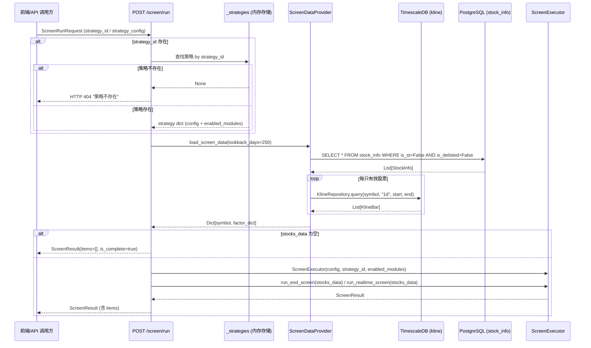

#### 组件关系

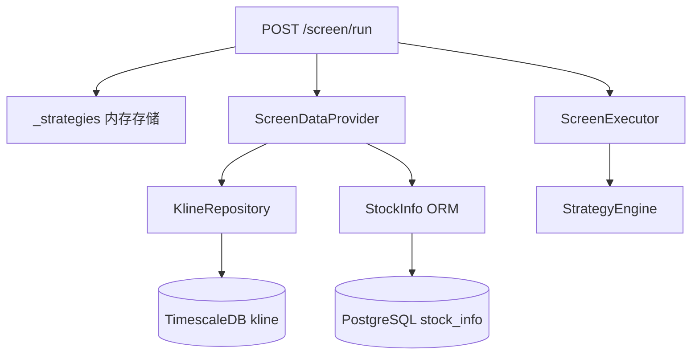

### 组件与接口

#### 1. ScreenDataProvider（选股数据提供服务）

新增 `app/services/screener/screen_data_provider.py`，负责从本地数据库查询股票数据并转换为 ScreenExecutor 所需的因子字典格式。

```python
"""
选股数据提供服务

从本地数据库（TimescaleDB + PostgreSQL）查询股票数据，
转换为 ScreenExecutor 所需的 {symbol: factor_dict} 格式。

数据来源：
- TimescaleDB kline 表：K 线行情数据（用于均线计算、形态识别、量价分析）
- PostgreSQL stock_info 表：基本面数据（PE/PB/ROE/市值）
"""

from __future__ import annotations

import logging
from datetime import date, datetime, timedelta
from decimal import Decimal
from typing import Any

from sqlalchemy import select
from sqlalchemy.ext.asyncio import AsyncSession

from app.core.database import AsyncSessionPG, AsyncSessionTS
from app.models.kline import KlineBar
from app.models.stock import StockInfo
from app.services.data_engine.kline_repository import KlineRepository

logger = logging.getLogger(__name__)

# 默认回溯天数（覆盖 MA250 所需的最少交易日）
DEFAULT_LOOKBACK_DAYS = 365


class ScreenDataProvider:
    """
    选股数据提供服务。

    从本地数据库查询全市场有效股票的行情和基本面数据，
    转换为 ScreenExecutor 所需的因子字典格式。
    """

    def __init__(
        self,
        pg_session: AsyncSession | None = None,
        ts_session: AsyncSession | None = None,
    ) -> None:
        self._pg_session = pg_session
        self._ts_session = ts_session

    async def load_screen_data(
        self,
        lookback_days: int = DEFAULT_LOOKBACK_DAYS,
        screen_date: date | None = None,
    ) -> dict[str, dict[str, Any]]:
        """
        加载选股所需的全市场股票数据。

        1. 从 PostgreSQL stock_info 查询全市场有效股票（排除 ST、退市）
        2. 从 TimescaleDB kline 查询每只股票最近 lookback_days 天的日 K 线
        3. 将 K 线数据和基本面数据转换为因子字典

        Args:
            lookback_days: K 线回溯天数，默认 365（覆盖 MA250）
            screen_date: 选股基准日期，默认今天

        Returns:
            {symbol: factor_dict} 字典，factor_dict 包含 ScreenExecutor 所需的全部因子数据
        """
        if screen_date is None:
            screen_date = date.today()

        start_date = screen_date - timedelta(days=lookback_days)

        # 1. 查询有效股票列表
        stocks = await self._load_valid_stocks()
        if not stocks:
            return {}

        # 2. 查询 K 线数据并转换为因子字典
        kline_repo = KlineRepository(self._ts_session)
        result: dict[str, dict[str, Any]] = {}

        for stock in stocks:
            try:
                bars = await kline_repo.query(
                    symbol=stock.symbol,
                    freq="1d",
                    start=start_date,
                    end=screen_date,
                )
                if not bars:
                    continue  # 无行情数据的股票跳过

                factor_dict = self._build_factor_dict(stock, bars)
                result[stock.symbol] = factor_dict
            except Exception:
                logger.warning(
                    "加载股票 %s 数据失败，跳过", stock.symbol, exc_info=True
                )
                continue

        logger.info(
            "选股数据加载完成：有效股票 %d 只，成功加载 %d 只",
            len(stocks), len(result),
        )
        return result

    async def _load_valid_stocks(self) -> list[StockInfo]:
        """查询全市场有效股票（排除 ST 和退市）。"""
        stmt = select(StockInfo).where(
            StockInfo.is_st == False,  # noqa: E712
            StockInfo.is_delisted == False,  # noqa: E712
        )
        if self._pg_session is not None:
            res = await self._pg_session.execute(stmt)
            return list(res.scalars().all())

        async with AsyncSessionPG() as session:
            res = await session.execute(stmt)
            return list(res.scalars().all())

    @staticmethod
    def _build_factor_dict(
        stock: StockInfo,
        bars: list[KlineBar],
    ) -> dict[str, Any]:
        """
        将 StockInfo + KlineBar 列表转换为 ScreenExecutor 所需的因子字典。

        因子字典结构：
        {
            "close": Decimal,           # 最新收盘价
            "open": Decimal,            # 最新开盘价
            "high": Decimal,            # 最新最高价
            "low": Decimal,             # 最新最低价
            "volume": int,              # 最新成交量
            "amount": Decimal,          # 最新成交额
            "turnover": Decimal,        # 最新换手率
            "vol_ratio": Decimal,       # 最新量比
            "closes": list[Decimal],    # 收盘价序列（时间升序）
            "highs": list[Decimal],     # 最高价序列
            "lows": list[Decimal],      # 最低价序列
            "volumes": list[int],       # 成交量序列
            "amounts": list[Decimal],   # 成交额序列
            "turnovers": list[Decimal], # 换手率序列
            # 基本面因子
            "pe_ttm": float | None,
            "pb": float | None,
            "roe": float | None,
            "market_cap": float | None,
        }
        """
        latest = bars[-1]  # bars 按时间升序，最后一条为最新

        return {
            # 最新行情
            "close": latest.close,
            "open": latest.open,
            "high": latest.high,
            "low": latest.low,
            "volume": latest.volume,
            "amount": latest.amount,
            "turnover": latest.turnover,
            "vol_ratio": latest.vol_ratio,
            # 历史序列（时间升序）
            "closes": [b.close for b in bars],
            "highs": [b.high for b in bars],
            "lows": [b.low for b in bars],
            "volumes": [b.volume for b in bars],
            "amounts": [b.amount for b in bars],
            "turnovers": [b.turnover for b in bars],
            # 基本面因子（来自 stock_info 表）
            "pe_ttm": float(stock.pe_ttm) if stock.pe_ttm is not None else None,
            "pb": float(stock.pb) if stock.pb is not None else None,
            "roe": float(stock.roe) if stock.roe is not None else None,
            "market_cap": float(stock.market_cap) if stock.market_cap is not None else None,
        }
```

关键设计决策：
- `ScreenDataProvider` 通过依赖注入接受 session，便于测试时 mock 数据库
- `_build_factor_dict` 为纯静态方法，输入 StockInfo + KlineBar 列表，输出因子字典，便于单独测试
- K 线回溯 365 天（日历日），覆盖 MA250 所需的约 250 个交易日
- 单只股票数据加载失败时跳过（不中断整体选股），记录 warning 日志

#### 2. 更新 `run_screen()` 端点（需求 27.9, 27.11, 27.12）

重写 `app/api/v1/screen.py` 中的 `run_screen()` 端点，从 stub 改为完整的选股执行流程。

```python
from fastapi import HTTPException
from app.core.database import AsyncSessionPG, AsyncSessionTS
from app.core.schemas import StrategyConfig, ScreenType
from app.services.screener.screen_executor import ScreenExecutor
from app.services.screener.screen_data_provider import ScreenDataProvider


@router.post("/screen/run")
async def run_screen(body: ScreenRunRequest) -> dict:
    """
    执行选股（盘后/实时）。

    流程：
    1. 加载策略配置（从 strategy_id 或 strategy_config）
    2. 从本地数据库查询全市场股票数据
    3. 实例化 ScreenExecutor 执行选股
    4. 返回选股结果

    错误处理：
    - strategy_id 不存在 → HTTP 404
    - 本地数据库无行情数据 → 返回空结果（items=[], is_complete=true）
    """
    # 1. 加载策略配置
    strategy_id_str: str | None = None
    config_dict: dict | None = None
    enabled_modules: list[str] | None = None

    if body.strategy_id is not None:
        sid = str(body.strategy_id)
        if sid not in _strategies:
            raise HTTPException(status_code=404, detail="策略不存在")
        strategy = _strategies[sid]
        strategy_id_str = sid
        config_dict = strategy.get("config", {})
        enabled_modules = strategy.get("enabled_modules", [])
    elif body.strategy_config is not None:
        strategy_id_str = str(uuid4())
        config_dict = body.strategy_config.model_dump()
        enabled_modules = None  # 无 strategy_id 时视为全部启用
    else:
        # 既无 strategy_id 也无 strategy_config，返回空结果
        return {
            "strategy_id": str(uuid4()),
            "screen_type": body.screen_type,
            "screen_time": datetime.now().isoformat(),
            "items": [],
            "is_complete": True,
        }

    # 解析策略配置
    strategy_config = StrategyConfig.from_dict(config_dict)

    # 2. 从本地数据库查询股票数据
    async with AsyncSessionPG() as pg_session, AsyncSessionTS() as ts_session:
        provider = ScreenDataProvider(
            pg_session=pg_session,
            ts_session=ts_session,
        )
        stocks_data = await provider.load_screen_data()

    # 3. 无行情数据时返回空结果（需求 27.12）
    if not stocks_data:
        return {
            "strategy_id": strategy_id_str,
            "screen_type": body.screen_type,
            "screen_time": datetime.now().isoformat(),
            "items": [],
            "is_complete": True,
        }

    # 4. 执行选股
    executor = ScreenExecutor(
        strategy_config=strategy_config,
        strategy_id=strategy_id_str,
        enabled_modules=enabled_modules,
    )

    screen_type = ScreenType(body.screen_type)
    if screen_type == ScreenType.EOD:
        result = executor.run_eod_screen(stocks_data)
    else:
        result = executor.run_realtime_screen(stocks_data)

    # 5. 序列化返回
    return {
        "strategy_id": str(result.strategy_id),
        "screen_type": result.screen_type.value,
        "screen_time": result.screen_time.isoformat(),
        "items": [
            {
                "symbol": item.symbol,
                "ref_buy_price": str(item.ref_buy_price),
                "trend_score": item.trend_score,
                "risk_level": item.risk_level.value,
                "signals": [
                    {
                        "category": s.category.value,
                        "label": s.label,
                        "is_fake_breakout": s.is_fake_breakout,
                    }
                    for s in item.signals
                ],
                "has_fake_breakout": item.has_fake_breakout,
            }
            for item in result.items
        ],
        "is_complete": result.is_complete,
    }
```

关键设计决策：
- `strategy_id` 存在但不在 `_strategies` 中 → HTTP 404（需求 27.11）
- 本地数据库无行情数据（`stocks_data` 为空）→ 返回空结果，不抛异常（需求 27.12）
- `strategy_config` 直接传入时 `enabled_modules=None`，ScreenExecutor 视为全部启用（向后兼容）
- 使用 `async with` 管理数据库 session 生命周期，确保连接释放

#### 3. K 线数据到因子字典的转换逻辑

`ScreenDataProvider._build_factor_dict()` 将 ORM 数据转换为 ScreenExecutor 期望的因子字典。ScreenExecutor 内部通过 `StrategyEngine` → `FactorEvaluator` 评估因子，`FactorEvaluator.evaluate()` 从 `stock_data` 字典中读取对应因子名称的值。

因子字典中的关键字段映射：

| 因子字典键 | 数据来源 | 用途 |
|---|---|---|
| `close` | kline 最新一条 close | 买入参考价、突破判定 |
| `closes` | kline 全部 close 序列 | MA 计算、趋势打分 |
| `volumes` | kline 全部 volume 序列 | 量价分析、突破量比 |
| `amounts` | kline 全部 amount 序列 | 日均成交额过滤 |
| `turnovers` | kline 全部 turnover 序列 | 换手率区间筛选 |
| `pe_ttm` / `pb` / `roe` / `market_cap` | stock_info 表 | 基本面因子评估 |

### 数据模型

本次设计不引入新的数据模型，复用现有：
- `app/models/kline.py` → `Kline` ORM + `KlineBar` dataclass
- `app/models/stock.py` → `StockInfo` ORM
- `app/core/schemas.py` → `StrategyConfig`、`ScreenResult`、`ScreenItem`、`SignalDetail`
- `app/api/v1/screen.py` → `ScreenRunRequest`（已有 `strategy_id`、`strategy_config`、`screen_type` 字段）


### 正确性属性（需求 27.9–27.12）

*属性（Property）是在系统所有有效执行中都应成立的特征或行为——本质上是对系统应做什么的形式化陈述。属性是人类可读规范与机器可验证正确性保证之间的桥梁。*

#### 属性 83：选股执行端点完整流程正确性（本地数据库驱动）

需求 27.9 要求端点完成策略加载→数据查询→选股执行→返回结果的完整流程，需求 27.10 要求数据全部来自本地数据库。这两个需求共同约束了选股执行的数据流正确性，合并为一个综合属性。

*对任意*合法的策略配置（含 `config` 和 `enabled_modules`）和本地数据库中的任意非空股票数据集，`POST /api/v1/screen/run` 端点应：当提供 `strategy_id` 时从策略存储加载对应的 `config` 和 `enabled_modules`；当仅提供 `strategy_config` 时使用请求中的配置；从本地数据库（TimescaleDB kline 表和 PostgreSQL stock_info 表）查询股票数据，不调用任何外部数据源适配器（TushareAdapter / AkShareAdapter）；使用加载的配置实例化 ScreenExecutor 执行选股；返回的 `ScreenResult` 中每条 `ScreenItem` 应包含 `symbol`、`ref_buy_price`、`trend_score`、`risk_level`、`signals` 全部字段且均不为空。

**验证需求：27.9, 27.10**

---

#### 属性 84：不存在的 strategy_id 返回 404

*对任意*不在策略存储中的 `strategy_id`（UUID），`POST /api/v1/screen/run` 端点应返回 HTTP 404 状态码，响应体应包含"策略不存在"错误提示信息。

**验证需求：27.11**

---

#### 属性 85：本地数据库无行情数据时返回空结果

*对任意*合法的策略配置，当本地数据库中无可用的 K 线行情数据时（stock_info 表为空或所有股票在 kline 表中无记录），`POST /api/v1/screen/run` 端点应返回 `items` 为空列表且 `is_complete` 为 `true` 的选股结果，不抛出异常。

**验证需求：27.12**

---

### 错误处理（需求 27.9–27.12）

| 错误场景 | 处理策略 |
|---|---|
| `strategy_id` 不在策略存储中 | 返回 HTTP 404，detail="策略不存在"（需求 27.11） |
| 本地数据库无行情数据 | 返回空结果 `items=[]`，`is_complete=true`，不抛异常（需求 27.12） |
| 单只股票 K 线查询失败 | 记录 warning 日志，跳过该股票，继续处理其他股票 |
| PostgreSQL stock_info 查询失败 | 返回空结果（无有效股票可选） |
| TimescaleDB 连接失败 | 返回空结果（无法查询 K 线数据） |
| ScreenExecutor 执行异常 | 返回 HTTP 500，记录错误日志 |

### 测试策略（需求 27.9–27.12）

#### 属性测试（Hypothesis）

| 属性 | 测试文件 | 最少迭代 |
|---|---|---|
| 属性 83：选股执行端点完整流程正确性 | `tests/properties/test_screen_run_flow_properties.py` | 100 |
| 属性 84：不存在的 strategy_id 返回 404 | `tests/properties/test_screen_run_flow_properties.py` | 100 |
| 属性 85：本地数据库无行情数据时返回空结果 | `tests/properties/test_screen_run_flow_properties.py` | 100 |

#### 单元测试

- `ScreenDataProvider._build_factor_dict()` 因子字典转换正确性示例
- `ScreenDataProvider.load_screen_data()` 空数据库返回空字典示例
- `run_screen()` 端点 strategy_id 加载配置示例
- `run_screen()` 端点 strategy_config 直接传入示例

#### 集成测试

- 创建策略 → 写入测试 K 线数据 → 执行选股 → 验证返回真实结果全链路测试
- 创建策略（enabled_modules=["ma_trend"]）→ 执行选股 → 验证仅应用均线模块筛选全链路测试
