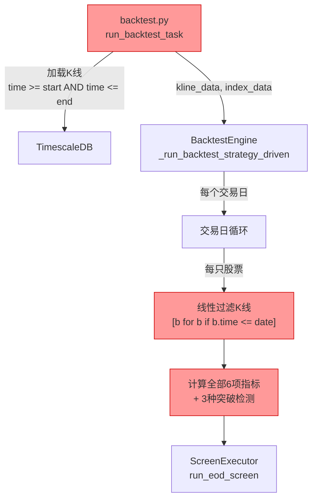
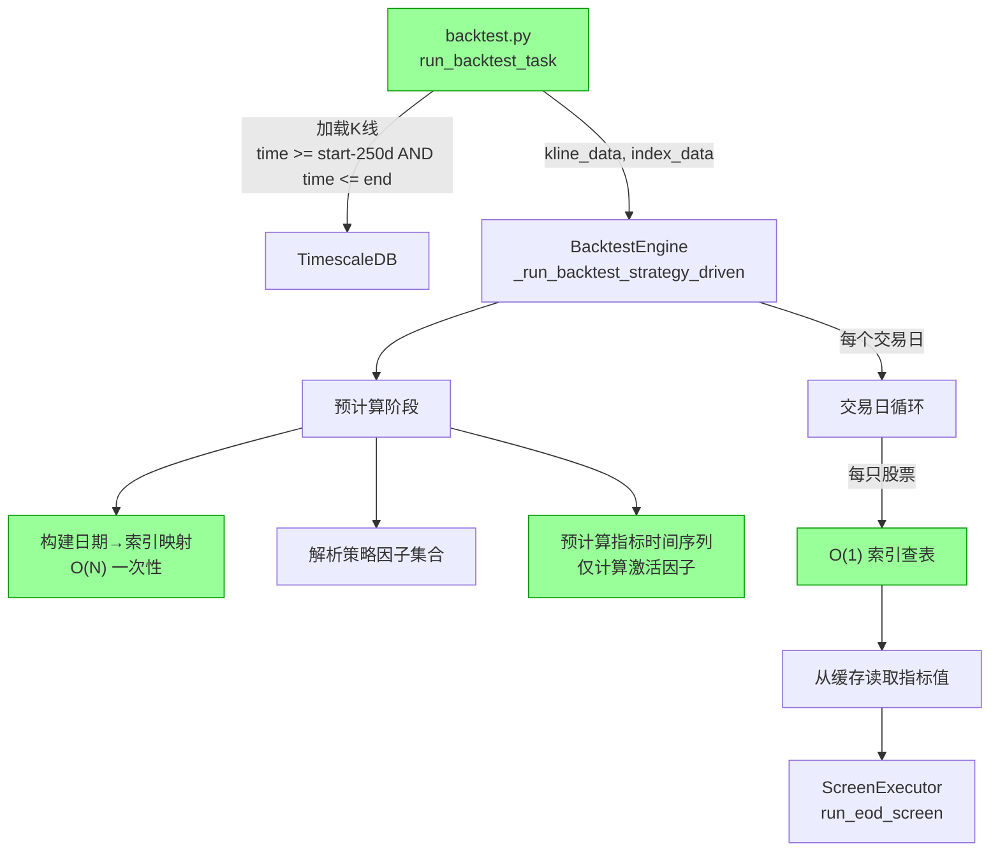

# 设计文档：回测引擎性能与正确性优化

## 概述

当前回测引擎 (`BacktestEngine`) 在策略驱动回测路径中存在严重的性能瓶颈和正确性缺陷。性能方面，`_generate_buy_signals` 方法在每个交易日对全市场数千只股票从头计算全部技术指标（MA趋势/MACD/BOLL/RSI/DMA/突破），且不区分策略实际配置了哪些因子；K线数据每日通过线性扫描过滤。正确性方面，`app/tasks/backtest.py` 中 K 线查询仅加载回测区间内的数据，导致 MA120、EMA26 等需要长预热期的指标在回测初期产生 NaN 值，选股结果不可靠。

本优化方案按 4 个优先级分层实施：P1 修复预热期数据加载（正确性）、P2 按策略因子按需计算指标（性能）、P3 预计算指标缓存（性能）、P4 K线数据预索引（性能）。优化后，回测主循环中每个交易日的信号生成从 O(S × I × N) 降至 O(S × I_active)（S=股票数, I=指标数, N=K线长度, I_active=激活因子数），且所有指标值从回测首日起即准确可靠。

## 架构

### 当前架构（优化前）



### 目标架构（优化后）



## 主要工作流

### 回测执行时序（优化后）

```mermaid
sequenceDiagram
    participant Task as backtest.py
    participant DB as TimescaleDB
    participant Engine as BacktestEngine
    participant Precomp as 预计算模块
    participant Loop as 交易日循环

    Task->>DB: 查询K线 (start - 250交易日 ~ end)
    DB-->>Task: kline_data (含预热期数据)
    Task->>Engine: run_backtest(config, kline_data, index_data)
    
    Engine->>Precomp: 解析 config.strategy_config.factors
    Precomp-->>Engine: required_factors: set[str]
    
    Engine->>Precomp: 构建日期索引 (每只股票)
    Precomp-->>Engine: date_index: dict[symbol, dict[date, int]]
    
    Engine->>Precomp: 预计算指标缓存 (仅required_factors)
    Precomp-->>Engine: indicator_cache: dict[symbol, IndicatorCache]
    
    loop 每个交易日
        Engine->>Loop: 解冻资金 → 处理待卖 → 检查卖出
        Loop->>Loop: _check_sell_conditions (用date_index O(1)查表)
        Loop->>Loop: _generate_buy_signals (从cache读取, 跳过非激活因子)
        Loop->>Loop: _execute_buys / _execute_sells
        Loop-->>Engine: 净值快照
    end
    
    Engine-->>Task: BacktestResult
```

## 组件与接口

### 组件 1：预热期数据加载 (P1 - 正确性)

**目的**：确保技术指标在回测起始日就有足够的历史数据进行准确计算。

**修改位置**：`app/tasks/backtest.py` → `run_backtest_task`

**接口变更**：

```python
def calculate_warmup_start_date(
    start_date: date,
    strategy_config: StrategyConfig,
    buffer_days: int = 250,
) -> date:
    """
    根据策略配置中的指标参数，计算所需的预热起始日期。
    
    取 max(ma_periods) 和各指标预热需求中的最大值，
    再乘以 1.5 倍安全系数（考虑非交易日），至少 250 个自然日。
    """
    ...
```

**职责**：
- 分析策略配置中所有指标的最大回看窗口
- 计算安全的预热起始日期（考虑节假日、停牌等非交易日）
- 修改 SQL 查询的 `time >= :start` 条件为预热起始日期

### 组件 2：因子按需计算 (P2 - 性能)

**目的**：根据策略配置的因子列表，只计算实际需要的指标，跳过未配置的。

**修改位置**：`app/services/backtest_engine.py` → `_generate_buy_signals`

**接口**：

```python
def _extract_required_factors(config: BacktestConfig) -> set[str]:
    """
    从 BacktestConfig.strategy_config.factors 中提取需要计算的因子名称集合。
    
    映射关系：
    - "ma_trend", "ma_support" → 需要 MA 计算
    - "macd" → 需要 MACD 计算
    - "boll" → 需要 BOLL 计算
    - "rsi" → 需要 RSI 计算
    - "dma" → 需要 DMA 计算
    - "breakout" → 需要突破检测
    
    若 factors 为空列表，返回全部因子（向后兼容）。
    """
    ...
```

**职责**：
- 解析 `config.strategy_config.factors` 列表
- 返回需要计算的因子名称集合
- 空因子列表时保持向后兼容（计算全部）

### 组件 3：预计算指标缓存 (P3 - 性能)

**目的**：在回测主循环开始前，一次性为所有股票预计算完整的指标时间序列，每个交易日只做查表。

**修改位置**：`app/services/backtest_engine.py`（新增数据结构和预计算方法）

**接口**：

```python
@dataclass
class IndicatorCache:
    """单只股票的预计算指标缓存"""
    closes: list[float]                          # 收盘价序列 (float)
    highs: list[float]                           # 最高价序列 (float)
    lows: list[float]                            # 最低价序列 (float)
    volumes: list[int]                           # 成交量序列
    ma_trend_scores: list[float] | None = None   # 每日 MA 趋势评分
    ma_support_flags: list[bool] | None = None   # 每日均线支撑标记
    macd_signals: list[bool] | None = None       # 每日 MACD 信号
    boll_signals: list[bool] | None = None       # 每日 BOLL 信号
    rsi_signals: list[bool] | None = None        # 每日 RSI 信号
    dma_values: list[dict | None] | None = None  # 每日 DMA 值
    breakout_results: list[dict | None] | None = None  # 每日突破结果


def _precompute_indicators(
    kline_data: dict[str, list[KlineBar]],
    config: BacktestConfig,
    required_factors: set[str],
) -> dict[str, IndicatorCache]:
    """
    一次性预计算所有股票的指标时间序列。
    
    对每只股票，使用完整K线序列（含预热期）计算各项指标，
    结果存储为与K线等长的时间序列，回测时按索引直接查表。
    仅计算 required_factors 中包含的指标。
    """
    ...
```

**职责**：
- 遍历所有股票，一次性计算完整指标序列
- 仅计算 `required_factors` 中指定的指标
- 返回 `{symbol: IndicatorCache}` 字典供主循环查表

### 组件 4：K线数据预索引 (P4 - 性能)

**目的**：预建日期→索引映射，替代每天每只股票的线性扫描 `[b for b in bars if b.time.date() <= trade_date]`。

**修改位置**：`app/services/backtest_engine.py`（新增索引构建和查询方法）

**接口**：

```python
@dataclass
class KlineDateIndex:
    """单只股票的日期→K线索引映射"""
    date_to_idx: dict[date, int]   # 日期 → bars列表中的索引
    sorted_dates: list[date]       # 排序后的日期列表（用于二分查找）


def _build_date_index(
    kline_data: dict[str, list[KlineBar]],
) -> dict[str, KlineDateIndex]:
    """
    为所有股票构建日期→索引映射。
    
    bars[date_to_idx[d]] 即为日期 d 的K线数据。
    对于 "截至某日的所有K线"，使用 bisect_right(sorted_dates, d) 
    获取截止索引，替代线性扫描。
    """
    ...


def _get_bars_up_to(
    bars: list[KlineBar],
    index: KlineDateIndex,
    trade_date: date,
) -> int:
    """
    返回 bars 中 <= trade_date 的最后一个索引位置。
    使用 bisect 二分查找，O(log N) 替代 O(N) 线性扫描。
    """
    ...
```

**职责**：
- 一次性构建所有股票的日期索引
- 提供 O(1) 精确日期查找和 O(log N) 范围查找
- 替代 `_generate_buy_signals`、`_check_sell_conditions`、`_execute_buys`、`_execute_sells`、净值快照计算中的所有线性扫描

## 数据模型

### IndicatorCache

```python
@dataclass
class IndicatorCache:
    """单只股票的预计算指标缓存。
    
    所有列表与该股票的 KlineBar 列表等长，索引一一对应。
    None 表示该指标未被策略要求，不需要计算。
    """
    closes: list[float]
    highs: list[float]
    lows: list[float]
    volumes: list[int]
    amounts: list[Decimal]
    turnovers: list[Decimal]
    
    # 以下字段仅在对应因子被激活时填充
    ma_trend_scores: list[float] | None = None
    ma_support_flags: list[bool] | None = None
    macd_signals: list[bool] | None = None
    boll_signals: list[bool] | None = None
    rsi_signals: list[bool] | None = None
    dma_values: list[tuple[float, float] | None] | None = None
    breakout_results: list[dict | None] | None = None
```

**验证规则**：
- `closes`、`highs`、`lows`、`volumes` 长度必须相等
- 非 None 的指标列表长度必须等于 `closes` 长度
- `ma_trend_scores` 中的值范围为 [0, 100]
- `macd_signals`、`boll_signals`、`rsi_signals` 为布尔值列表

### KlineDateIndex

```python
@dataclass
class KlineDateIndex:
    """日期→K线索引映射。
    
    date_to_idx 提供 O(1) 精确查找。
    sorted_dates 配合 bisect 提供 O(log N) 范围查找。
    """
    date_to_idx: dict[date, int]
    sorted_dates: list[date]
```

**验证规则**：
- `sorted_dates` 严格递增
- `date_to_idx` 的所有值在 `[0, len(bars)-1]` 范围内
- `len(date_to_idx) == len(sorted_dates)`

## 关键函数的形式化规约

### 函数 1：calculate_warmup_start_date

```python
def calculate_warmup_start_date(
    start_date: date,
    strategy_config: StrategyConfig,
    buffer_days: int = 250,
) -> date:
    """计算预热起始日期"""
    ...
```

**前置条件**：
- `start_date` 是有效日期
- `strategy_config` 非 None
- `buffer_days >= 0`

**后置条件**：
- 返回值 `warmup_date < start_date`
- `(start_date - warmup_date).days >= max(strategy_config.ma_periods)`
- `(start_date - warmup_date).days >= buffer_days`
- 返回值足以覆盖 MACD EMA26 + Signal9 = 35 天预热
- 返回值足以覆盖 MA250 = 250 天预热（若配置了 250 日均线）

**循环不变量**：不适用（无循环）

### 函数 2：_extract_required_factors

```python
def _extract_required_factors(config: BacktestConfig) -> set[str]:
    """从策略配置中提取需要计算的因子集合"""
    ...
```

**前置条件**：
- `config` 非 None
- `config.strategy_config` 非 None

**后置条件**：
- 返回值是 `{"ma_trend", "ma_support", "macd", "boll", "rsi", "dma", "breakout"}` 的子集
- 若 `config.strategy_config.factors` 为空列表，返回全部因子（向后兼容）
- 若 `config.strategy_config.factors` 非空，返回值仅包含 factors 中出现的因子名称对应的计算模块
- `len(返回值) <= 7`

**循环不变量**：不适用

### 函数 3：_precompute_indicators

```python
def _precompute_indicators(
    kline_data: dict[str, list[KlineBar]],
    config: BacktestConfig,
    required_factors: set[str],
) -> dict[str, IndicatorCache]:
    """一次性预计算所有股票的指标时间序列"""
    ...
```

**前置条件**：
- `kline_data` 中每只股票的 K 线列表按时间升序排列
- `required_factors` 是有效因子名称集合
- K 线数据包含足够的预热期数据

**后置条件**：
- 返回字典的键集合 == `kline_data` 的键集合
- 对每个 symbol，`cache.closes` 长度 == `len(kline_data[symbol])`
- 若 `"ma_trend" in required_factors`，则 `cache.ma_trend_scores is not None`
- 若 `"ma_trend" not in required_factors`，则 `cache.ma_trend_scores is None`
- 同理适用于其他指标字段
- 预计算结果与逐日重算的结果数值一致（正确性不变量）

**循环不变量**：
- 对于外层循环（遍历股票）：已处理的股票都有完整的 IndicatorCache
- 对于内层循环（遍历K线）：指标计算使用完整历史数据，不存在截断

### 函数 4：_build_date_index

```python
def _build_date_index(
    kline_data: dict[str, list[KlineBar]],
) -> dict[str, KlineDateIndex]:
    """为所有股票构建日期→索引映射"""
    ...
```

**前置条件**：
- `kline_data` 中每只股票的 K 线列表按时间升序排列
- 同一股票不存在重复日期的 K 线

**后置条件**：
- 返回字典的键集合 == `kline_data` 的键集合
- 对每个 symbol，`index.sorted_dates` 严格递增
- `len(index.date_to_idx) == len(kline_data[symbol])`
- 对任意 `d in index.date_to_idx`：`kline_data[symbol][index.date_to_idx[d]].time.date() == d`

**循环不变量**：
- 遍历 bars 时，`date_to_idx` 中已有的所有映射都是正确的

### 函数 5：_get_bars_up_to

```python
def _get_bars_up_to(
    bars: list[KlineBar],
    index: KlineDateIndex,
    trade_date: date,
) -> int:
    """返回 bars 中 <= trade_date 的最后一个索引"""
    ...
```

**前置条件**：
- `bars` 按时间升序排列
- `index` 与 `bars` 对应
- `trade_date` 是有效日期

**后置条件**：
- 返回值 `idx` 满足：`bars[idx].time.date() <= trade_date`
- 若 `idx + 1 < len(bars)`，则 `bars[idx + 1].time.date() > trade_date`
- 若所有 bars 的日期都 > trade_date，返回 -1
- 时间复杂度 O(log N)

**循环不变量**：不适用（使用 bisect 二分查找）

## 算法伪代码

### 预热期计算算法

```python
def calculate_warmup_start_date(
    start_date: date,
    strategy_config: StrategyConfig,
    buffer_days: int = 250,
) -> date:
    # 步骤 1：收集所有指标的最大回看窗口
    max_lookback = max(strategy_config.ma_periods)  # 通常 120 或 250
    
    ind = strategy_config.indicator_params
    if hasattr(ind, 'macd_slow'):
        # MACD: EMA(slow) 需要 slow_period 天, 再加 signal_period
        macd_warmup = ind.macd_slow + ind.macd_signal
        max_lookback = max(max_lookback, macd_warmup)
        
        # BOLL: 需要 boll_period 天
        max_lookback = max(max_lookback, ind.boll_period)
        
        # RSI: 需要 rsi_period + 1 天
        max_lookback = max(max_lookback, ind.rsi_period + 1)
        
        # DMA: 需要 max(dma_short, dma_long) 天
        max_lookback = max(max_lookback, ind.dma_long)
    
    # 步骤 2：取 buffer_days 和 max_lookback 的较大值
    required_days = max(buffer_days, max_lookback)
    
    # 步骤 3：乘以 1.5 安全系数（覆盖节假日、停牌）
    calendar_days = int(required_days * 1.5)
    
    # 步骤 4：计算预热起始日期
    from datetime import timedelta
    warmup_date = start_date - timedelta(days=calendar_days)
    
    return warmup_date
```

### 因子按需计算算法

```python
# 因子名称到计算模块的映射
FACTOR_TO_COMPUTE: dict[str, set[str]] = {
    "ma_trend": {"ma_trend"},
    "ma_support": {"ma_trend", "ma_support"},
    "macd": {"macd"},
    "boll": {"boll"},
    "rsi": {"rsi"},
    "dma": {"dma"},
    "breakout": {"breakout"},
}

def _extract_required_factors(config: BacktestConfig) -> set[str]:
    factors = config.strategy_config.factors
    
    # 向后兼容：空因子列表 → 计算全部
    if not factors:
        return {"ma_trend", "ma_support", "macd", "boll", "rsi", "dma", "breakout"}
    
    required: set[str] = set()
    for fc in factors:
        compute_set = FACTOR_TO_COMPUTE.get(fc.factor_name)
        if compute_set:
            required.update(compute_set)
    
    return required
```

### 预计算指标缓存算法

```python
def _precompute_indicators(
    kline_data: dict[str, list[KlineBar]],
    config: BacktestConfig,
    required_factors: set[str],
) -> dict[str, IndicatorCache]:
    from app.services.screener.ma_trend import score_ma_trend, detect_ma_support
    from app.services.screener.indicators import (
        detect_macd_signal, detect_boll_signal, detect_rsi_signal, calculate_dma,
    )
    from app.services.screener.breakout import (
        detect_box_breakout, detect_previous_high_breakout,
        detect_descending_trendline_breakout,
    )
    
    ma_periods = config.strategy_config.ma_periods or [5, 10, 20, 60, 120]
    ind = config.strategy_config.indicator_params
    cache: dict[str, IndicatorCache] = {}
    
    for symbol, bars in kline_data.items():
        n = len(bars)
        closes = [float(b.close) for b in bars]
        highs = [float(b.high) for b in bars]
        lows = [float(b.low) for b in bars]
        volumes = [b.volume for b in bars]
        
        ic = IndicatorCache(
            closes=closes, highs=highs, lows=lows,
            volumes=volumes,
            amounts=[b.amount for b in bars],
            turnovers=[b.turnover for b in bars],
        )
        
        # 滑动窗口预计算 MA 趋势评分
        if "ma_trend" in required_factors:
            scores = []
            for i in range(n):
                sub_closes = closes[:i+1]
                result = score_ma_trend(sub_closes, ma_periods)
                scores.append(result.score)
            ic.ma_trend_scores = scores
        
        # 滑动窗口预计算均线支撑
        if "ma_support" in required_factors:
            flags = []
            for i in range(n):
                sub_closes = closes[:i+1]
                sig = detect_ma_support(sub_closes, ma_periods)
                flags.append(sig.detected)
            ic.ma_support_flags = flags
        
        # 滑动窗口预计算 MACD 信号
        if "macd" in required_factors:
            signals = []
            for i in range(n):
                sub_closes = closes[:i+1]
                res = detect_macd_signal(
                    sub_closes,
                    fast_period=ind.macd_fast,
                    slow_period=ind.macd_slow,
                    signal_period=ind.macd_signal,
                )
                signals.append(res.signal)
            ic.macd_signals = signals
        
        # 类似地预计算 BOLL、RSI、DMA、突破...
        # (省略重复结构，实现模式相同)
        
        cache[symbol] = ic
    
    return cache
```

### 日期索引构建与查找算法

```python
from bisect import bisect_right

def _build_date_index(
    kline_data: dict[str, list[KlineBar]],
) -> dict[str, KlineDateIndex]:
    result: dict[str, KlineDateIndex] = {}
    
    for symbol, bars in kline_data.items():
        date_to_idx: dict[date, int] = {}
        sorted_dates: list[date] = []
        
        for i, bar in enumerate(bars):
            d = bar.time.date()
            date_to_idx[d] = i
            sorted_dates.append(d)
        
        result[symbol] = KlineDateIndex(
            date_to_idx=date_to_idx,
            sorted_dates=sorted_dates,
        )
    
    return result


def _get_bars_up_to(
    index: KlineDateIndex,
    trade_date: date,
) -> int:
    """返回 <= trade_date 的最后一个索引，无匹配返回 -1"""
    pos = bisect_right(index.sorted_dates, trade_date)
    if pos == 0:
        return -1
    return pos - 1  # sorted_dates[pos-1] <= trade_date
```

### 优化后的 _generate_buy_signals 核心逻辑

```python
def _generate_buy_signals_optimized(
    self,
    trade_date: date,
    config: BacktestConfig,
    market_risk_state: str,
    indicator_cache: dict[str, IndicatorCache],
    date_index: dict[str, KlineDateIndex],
    required_factors: set[str],
) -> list[ScreenItem]:
    """优化后的买入信号生成：从缓存查表，不再逐日重算"""
    if market_risk_state == "DANGER":
        return []
    
    stocks_data: dict[str, dict] = {}
    
    for symbol, ic in indicator_cache.items():
        idx_info = date_index.get(symbol)
        if not idx_info:
            continue
        
        # O(log N) 查找截止索引
        end_idx = _get_bars_up_to(idx_info, trade_date)
        if end_idx < 0:
            continue
        
        # 直接从缓存读取预计算的指标值
        stock_entry = {
            "name": symbol,
            "close": Decimal(str(ic.closes[end_idx])),
            "ma_trend": ic.ma_trend_scores[end_idx] if ic.ma_trend_scores else 0.0,
            "ma_support": ic.ma_support_flags[end_idx] if ic.ma_support_flags else False,
            "macd": ic.macd_signals[end_idx] if ic.macd_signals else False,
            "boll": ic.boll_signals[end_idx] if ic.boll_signals else False,
            "rsi": ic.rsi_signals[end_idx] if ic.rsi_signals else False,
            "dma": ic.dma_values[end_idx] if ic.dma_values else None,
            "breakout": ic.breakout_results[end_idx] if ic.breakout_results else None,
            # 其他必要字段...
        }
        stocks_data[symbol] = stock_entry
    
    # 执行选股（ScreenExecutor 逻辑不变）
    executor = ScreenExecutor(config.strategy_config)
    result = executor.run_eod_screen(stocks_data)
    return list(result.items)
```

## 示例用法

```python
# 优化前：task 层加载数据
rows = session.execute(text("""
    SELECT ... FROM kline
    WHERE freq = '1d' AND time >= :start AND time <= :end
"""), {"start": sd.isoformat(), "end": ed.isoformat()})

# 优化后：task 层加载数据（含预热期）
warmup_date = calculate_warmup_start_date(sd, strategy_config)
rows = session.execute(text("""
    SELECT ... FROM kline
    WHERE freq = '1d' AND time >= :warmup_start AND time <= :end
"""), {"warmup_start": warmup_date.isoformat(), "end": ed.isoformat()})

# 优化后：引擎预计算阶段
required_factors = _extract_required_factors(config)
date_idx = _build_date_index(kline_data)
indicator_cache = _precompute_indicators(kline_data, config, required_factors)

# 优化后：交易日循环中
for trade_date in trade_dates:
    # 买入信号：从缓存查表，O(S) 而非 O(S × I × N)
    candidates = engine._generate_buy_signals_optimized(
        trade_date, config, market_risk,
        indicator_cache, date_idx, required_factors,
    )
    
    # 卖出检查：用 date_index 替代线性扫描
    for symbol, pos in state.positions.items():
        idx_info = date_idx.get(symbol)
        end_idx = _get_bars_up_to(idx_info, trade_date)
        # O(1) 获取当日K线，不再线性扫描
```

## 正确性属性

*属性是一种在系统所有有效执行中都应成立的特征或行为——本质上是关于系统应做什么的形式化陈述。属性是人类可读规格说明与机器可验证正确性保证之间的桥梁。*

### Property 1: 预热期充分性

*For any* 有效的 start_date、strategy_config 和 buffer_days，`calculate_warmup_start_date(start_date, strategy_config, buffer_days)` 返回的日期 warmup_date 应满足：warmup_date < start_date，且 (start_date - warmup_date).days >= max(strategy_config.ma_periods)，且 (start_date - warmup_date).days >= buffer_days。

**Validates: Requirements 1.2, 1.3, 1.5**

### Property 2: 因子提取完备性

*For any* BacktestConfig 其中 strategy_config.factors 非空，`_extract_required_factors(config)` 返回的集合应是 {"ma_trend", "ma_support", "macd", "boll", "rsi", "dma", "breakout"} 的子集，且包含 factors 列表中每个 factor_name 对应的计算模块。

**Validates: Requirements 2.1, 2.3**

### Property 3: 因子提取向后兼容

*For any* BacktestConfig 其中 strategy_config.factors 为空列表，`_extract_required_factors(config)` 应返回全部 7 个因子的集合。

**Validates: Requirement 2.2**

### Property 4: 指标缓存结构不变量

*For any* kline_data 和 required_factors，`_precompute_indicators(kline_data, config, required_factors)` 返回的字典键集合应等于 kline_data 的键集合，且对每只股票，IndicatorCache 中的 closes、highs、lows、volumes 列表长度应等于该股票的 KlineBar 列表长度。

**Validates: Requirements 3.1, 3.2**

### Property 5: 条件因子计算

*For any* kline_data、config 和 required_factors，预计算结果中：若某因子名称在 required_factors 中，则 IndicatorCache 中对应字段为非 None 且长度等于 bars 长度；若某因子名称不在 required_factors 中，则对应字段为 None。

**Validates: Requirements 3.3, 3.4**

### Property 6: 预计算一致性

*For any* 股票和任意索引位置 idx，从 indicator_cache[symbol] 在索引 idx 处读取的指标值应等于对 bars[:idx+1] 从头调用对应指标计算函数得到的值。

**Validates: Requirement 3.5**

### Property 7: 日期索引结构不变量

*For any* kline_data，`_build_date_index(kline_data)` 返回的字典键集合应等于 kline_data 的键集合，且对每只股票：sorted_dates 严格递增，len(date_to_idx) == len(kline_data[symbol])。

**Validates: Requirements 4.1, 4.2, 4.3**

### Property 8: 日期索引查找正确性

*For any* 股票的 bars 和对应的 KlineDateIndex，对任意日期 d 存在于 date_to_idx 中，bars[date_to_idx[d]].time.date() 应等于 d。

**Validates: Requirement 4.4**

### Property 9: 二分查找等价性

*For any* bars、对应的 KlineDateIndex 和 trade_date，`_get_bars_up_to(index, trade_date)` 返回的索引应等价于朴素线性扫描 `max(i for i, b in enumerate(bars) if b.time.date() <= trade_date)` 的结果（若无匹配则均返回 -1）。

**Validates: Requirements 4.5, 4.6**

### Property 10: 优化前后信号生成等价性

*For any* config、kline_data 和 trade_date，优化后的 `_generate_buy_signals_optimized` 产生的 ScreenItem 列表（按 symbol 排序后）应与优化前 `_generate_buy_signals` 的结果相同。

**Validates: Requirement 5.1**

## 错误处理

### 场景 1：预热期数据不足

**条件**：TimescaleDB 中某只股票在预热起始日期之前没有足够的 K 线数据（如新上市股票）
**响应**：正常处理，指标计算函数已内置 NaN 填充逻辑；该股票在数据不足的交易日不会产生有效信号
**恢复**：无需特殊处理，与当前行为一致

### 场景 2：策略配置中包含未知因子名称

**条件**：`factors` 列表中的 `factor_name` 不在 `FACTOR_TO_COMPUTE` 映射中
**响应**：忽略未知因子，仅计算已知因子；记录 WARNING 日志
**恢复**：不影响其他因子的计算

### 场景 3：K线数据中存在重复日期

**条件**：同一股票在同一日期有多条 K 线记录
**响应**：`_build_date_index` 中后出现的记录覆盖先出现的（dict 赋值语义）
**恢复**：数据层应保证唯一性，此处做防御性处理

### 场景 4：预计算阶段内存压力

**条件**：全市场数千只股票 × 数百交易日的指标缓存占用大量内存
**响应**：IndicatorCache 仅存储必要的指标（按需计算），未激活的指标字段为 None
**恢复**：若内存仍不足，可考虑分批处理或使用 numpy 数组替代 Python list

## 测试策略

### 单元测试

- `calculate_warmup_start_date`：验证不同策略配置下的预热日期计算
- `_extract_required_factors`：验证因子提取逻辑，包括空列表向后兼容
- `_build_date_index`：验证索引构建的正确性
- `_get_bars_up_to`：验证边界条件（空列表、日期在范围外、精确匹配）
- `_precompute_indicators`：验证缓存与逐日计算的一致性

### Property-Based 测试

**测试库**：Hypothesis

- 预热期充分性属性（属性 1）
- 因子提取完备性和向后兼容性（属性 2, 3）
- 日期索引正确性和单调性（属性 4, 5）
- 二分查找等价性（属性 6）
- 预计算一致性（属性 7）

### 集成测试

- 端到端回测：使用固定的测试 K 线数据，验证优化前后的回测结果（BacktestResult 的 9 项指标）一致
- 预热期验证：构造需要 MA120 的策略，验证回测首日的 MA120 值非 NaN
- 性能基准：对比优化前后的执行时间（使用 pytest-benchmark）

## 性能考量

| 操作 | 优化前复杂度 | 优化后复杂度 | 说明 |
|------|-------------|-------------|------|
| K线日期过滤 | O(D × S × N) | O(D × S × log N) | D=交易日数, S=股票数, N=K线长度 |
| 指标计算 | O(D × S × I × N) | O(S × I_active × N) | 预计算一次，I_active ≤ I |
| 信号查表 | N/A | O(D × S) | 从缓存 O(1) 读取 |
| 内存开销 | O(S × N) | O(S × N × I_active) | 缓存增加内存，但 I_active 通常 ≤ 3 |

预期加速比：对于 3000 只股票 × 250 个交易日的典型回测场景，预计从 ~10 分钟降至 ~30 秒（约 20x 加速）。

## 安全考量

本优化不涉及安全相关变更。所有修改限于内部计算逻辑，不影响 API 接口、认证、授权或数据访问控制。

## 依赖

- 无新增外部依赖
- 使用 Python 标准库 `bisect` 模块（已内置）
- 依赖现有的 `app.services.screener` 子模块（ma_trend, indicators, breakout）
- 依赖现有的 `app.core.schemas` 数据类
