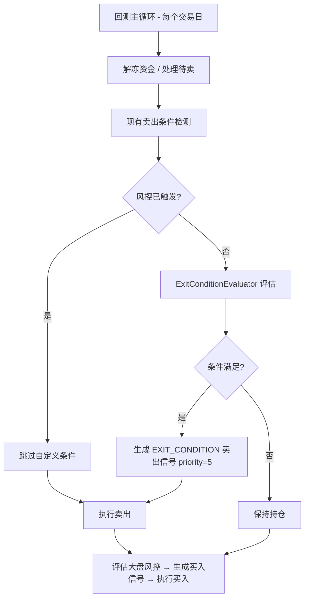
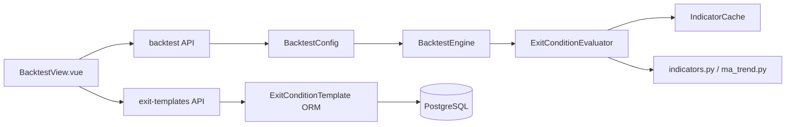
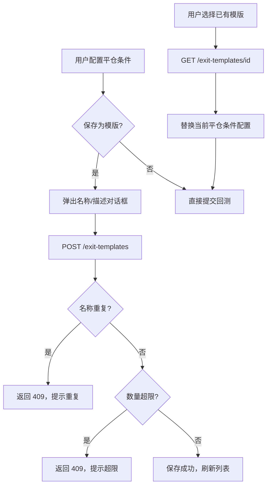

# 技术设计文档：回测自定义平仓条件

## 概述

本功能在现有回测引擎中新增自定义平仓条件支持。用户可配置基于技术指标（MA、MACD、BOLL、RSI、DMA、量价等）的平仓规则，支持日K线和多种分钟K线（1分钟、5分钟、15分钟、30分钟、60分钟）数据源，这些规则与现有风控止损止盈条件并行生效。此外，用户可将配置好的平仓条件保存为命名模版，在后续回测中直接加载复用。

核心变更范围：
- 新增 `ExitCondition` / `ExitConditionConfig` 数据模型（`app/core/schemas.py`）
- 新增 `VALID_FREQS` 常量定义合法频率集合：`{"daily", "1min", "5min", "15min", "30min", "60min"}`
- 新增 `ExitConditionEvaluator` 评估引擎（`app/services/exit_condition_evaluator.py`），按频率分别加载对应K线数据
- 扩展 `BacktestEngine._check_sell_conditions` 集成自定义平仓条件
- 扩展 `IndicatorCache` 支持按频率分组的自定义参数指标缓存
- 扩展回测 API 和前端配置面板（频率下拉框支持6种选项）
- 向后兼容：旧版 `"minute"` 频率值自动映射为 `"1min"`
- 新增 `ExitConditionTemplate` ORM 模型（`app/models/backtest.py`），支持平仓条件模版持久化
- 新增模版 CRUD REST API 端点（`app/api/v1/backtest.py`），含名称唯一性校验和数量上限
- 扩展前端 Pinia store 和 `BacktestView.vue`，支持模版保存、加载、管理

设计原则：
1. 最小侵入：不修改现有风控逻辑，仅在卖出条件检测链末尾追加
2. 复用优先：复用现有 `IndicatorCache` 和指标计算函数；模版 ORM 遵循 `StrategyTemplate` 设计模式
3. 向后兼容：未配置自定义条件时行为与现有完全一致；旧版 `"minute"` 配置自动迁移

## 架构

### 整体流程



### 模块依赖



### 模版管理流程



## 组件与接口

### 1. ExitConditionEvaluator（新增）

文件：`app/services/exit_condition_evaluator.py`

职责：
- 接收 `ExitConditionConfig` 和指标缓存，对单只持仓评估所有自定义平仓条件
- 根据每条条件的 `freq` 字段选择对应频率的K线指标缓存进行评估
- 支持数值比较（`>`, `<`, `>=`, `<=`）和交叉检测（`cross_up`, `cross_down`）
- 支持 AND / OR 逻辑组合
- 向后兼容：`freq="minute"` 自动视为 `"1min"`

```python
# 合法频率常量
VALID_FREQS = {"daily", "1min", "5min", "15min", "30min", "60min"}

# 旧版频率映射
_FREQ_MIGRATION = {"minute": "1min"}

class ExitConditionEvaluator:
    """自定义平仓条件评估器"""

    def evaluate(
        self,
        config: ExitConditionConfig,
        symbol: str,
        bar_index: int,
        indicator_cache: IndicatorCache,
        exit_indicator_cache: dict[str, dict[str, list[float]]] | None = None,
    ) -> tuple[bool, str | None]:
        """
        评估单只持仓的自定义平仓条件。

        Args:
            config: 平仓条件配置
            symbol: 股票代码
            bar_index: 当前交易日在 K 线序列中的索引
            indicator_cache: 日K线预计算指标缓存
            exit_indicator_cache: 按频率分组的补充缓存
                格式: {freq: {cache_key: values}}
                例: {"daily": {"ma_10": [...]}, "5min": {"rsi_14": [...]}}

        Returns:
            (triggered, reason) - triggered 为 True 时 reason 包含触发条件描述
        """

    def _resolve_freq(self, freq: str) -> str:
        """将旧版频率值映射为新版，如 'minute' → '1min'"""

    def _evaluate_single(
        self,
        condition: ExitCondition,
        bar_index: int,
        indicator_cache: IndicatorCache,
        freq_indicator_cache: dict[str, list[float]] | None,
    ) -> bool:
        """评估单条平仓条件，使用对应频率的指标缓存"""

    def _get_indicator_value(
        self,
        indicator_name: str,
        bar_index: int,
        indicator_cache: IndicatorCache,
        freq_indicator_cache: dict[str, list[float]] | None,
        params: dict | None = None,
    ) -> float | None:
        """从缓存获取指标值，支持自定义参数"""

    def _check_cross(
        self,
        indicator_name: str,
        cross_target: str,
        bar_index: int,
        indicator_cache: IndicatorCache,
        freq_indicator_cache: dict[str, list[float]] | None,
        direction: str,  # "up" or "down"
        params: dict | None = None,
    ) -> bool:
        """检测交叉信号"""
```

评估流程中的频率处理：
1. 对每条条件，先调用 `_resolve_freq()` 将 `freq` 标准化（处理 `"minute"` → `"1min"` 映射）
2. 根据标准化后的 `freq` 从 `exit_indicator_cache[freq]` 获取对应频率的指标缓存
3. 若对应频率的分钟K线缓存不可用，回退到 `"daily"` 频率的缓存，记录 INFO 日志

### 2. BacktestEngine 扩展

在 `_check_sell_conditions` 方法末尾追加自定义条件评估：

```python
# 现有 _check_sell_conditions 末尾追加：
# 5. 自定义平仓条件（优先级 5，最低）
if config.exit_conditions is not None:
    evaluator = ExitConditionEvaluator()
    triggered, reason = evaluator.evaluate(
        config.exit_conditions, position.symbol, bar_index,
        indicator_cache, exit_indicator_cache,
    )
    if triggered:
        return _SellSignal(
            symbol=position.symbol,
            reason="EXIT_CONDITION",
            trigger_date=trade_date,
            priority=5,
        )
```

交易记录序列化扩展 — 在 `_TradeRecord` 中新增 `sell_reason` 字段：

```python
@dataclass
class _TradeRecord:
    date: date
    symbol: str
    action: str
    price: Decimal
    quantity: int
    cost: Decimal
    amount: Decimal
    sell_reason: str = ""  # 新增：卖出原因
```

### 3. IndicatorCache 扩展

在预计算阶段，检查 `ExitConditionConfig` 中引用的指标参数组合和频率类型，按频率分组补充计算：

```python
def _precompute_exit_indicators(
    kline_data: dict[str, dict[str, list[KlineBar]]],
    exit_config: ExitConditionConfig | None,
    existing_cache: dict[str, IndicatorCache],
) -> dict[str, dict[str, dict[str, list[float]]]]:
    """
    为自定义平仓条件补充计算非默认参数的指标，按频率分组。

    Args:
        kline_data: 按频率和股票代码组织的K线数据
            格式: {freq: {symbol: [KlineBar, ...]}}
            例: {"daily": {"600519.SH": [...]}, "5min": {"600519.SH": [...]}}
        exit_config: 平仓条件配置
        existing_cache: 现有日K线指标缓存

    Returns:
        {symbol: {freq: {cache_key: values}}} 格式的按频率分组补充缓存。
        cache_key 格式如 "ma_10", "rsi_7", "macd_dif_8_21_5" 等。
    """
```

预计算流程：
1. 遍历 `exit_config.conditions`，收集所有引用的 `(freq, indicator, params)` 组合
2. 将 `freq="minute"` 映射为 `"1min"`（向后兼容）
3. 对每个频率，加载对应的K线数据并计算所需指标
4. 日K线频率（`"daily"`）的指标优先从 `existing_cache` 复用
5. 分钟K线频率的指标需独立计算，每种分钟类型使用各自的K线数据

指标值获取的映射关系：

| 指标名称 | IndicatorCache 字段 | 备注 |
|---------|-------------------|------|
| `close` | `closes[i]` | 直接读取 |
| `volume` | `volumes[i]` | 直接读取 |
| `turnover` | `turnovers[i]` | 直接读取 |
| `ma` | 需按周期从 `exit_indicator_cache` 查找 | 支持自定义周期 |
| `macd_dif` | 从 MACD 计算结果的 `dif[i]` | 支持自定义参数 |
| `macd_dea` | 从 MACD 计算结果的 `dea[i]` | 支持自定义参数 |
| `macd_histogram` | 从 MACD 计算结果的 `macd[i]` | 支持自定义参数 |
| `boll_upper` | 从 BOLL 计算结果的 `upper[i]` | 支持自定义参数 |
| `boll_middle` | 从 BOLL 计算结果的 `middle[i]` | 支持自定义参数 |
| `boll_lower` | 从 BOLL 计算结果的 `lower[i]` | 支持自定义参数 |
| `rsi` | 从 RSI 计算结果的 `values[i]` | 支持自定义周期 |
| `dma` | 从 DMA 计算结果的 `dma[i]` | 支持自定义参数 |
| `ama` | 从 DMA 计算结果的 `ama[i]` | 支持自定义参数 |

## 数据模型

### ExitConditionTemplate（新增，`app/models/backtest.py`）

遵循现有 `StrategyTemplate`（`app/models/strategy.py`）的设计模式：UUID 主键、JSONB 配置字段、时间戳字段、`PGBase` 基类。

```python
class ExitConditionTemplate(PGBase):
    """平仓条件模版"""

    __tablename__ = "exit_condition_template"

    id: Mapped[UUID] = mapped_column(
        PG_UUID(as_uuid=True),
        primary_key=True,
        server_default=sa_text("gen_random_uuid()"),
    )
    user_id: Mapped[UUID] = mapped_column(PG_UUID(as_uuid=True), nullable=False)
    name: Mapped[str] = mapped_column(String(100), nullable=False)
    description: Mapped[str | None] = mapped_column(String(500), nullable=True)
    exit_conditions: Mapped[dict] = mapped_column(JSONB, nullable=False)  # ExitConditionConfig.to_dict()
    created_at: Mapped[datetime] = mapped_column(
        TIMESTAMPTZ, server_default=sa_text("NOW()"), nullable=False
    )
    updated_at: Mapped[datetime] = mapped_column(
        TIMESTAMPTZ, server_default=sa_text("NOW()"), nullable=False
    )
```

`exit_conditions` 字段存储 `ExitConditionConfig.to_dict()` 的序列化结果，加载时通过 `ExitConditionConfig.from_dict()` 反序列化。与 `StrategyTemplate.config` 存储 `StrategyConfig` 的模式一致。

### 数据库迁移（Alembic）

新增迁移文件 `alembic/versions/004_create_exit_condition_template.py`：

```sql
CREATE TABLE IF NOT EXISTS exit_condition_template (
    id              UUID PRIMARY KEY DEFAULT gen_random_uuid(),
    user_id         UUID NOT NULL,
    name            VARCHAR(100) NOT NULL,
    description     VARCHAR(500),
    exit_conditions JSONB NOT NULL,
    created_at      TIMESTAMPTZ NOT NULL DEFAULT NOW(),
    updated_at      TIMESTAMPTZ NOT NULL DEFAULT NOW()
);

CREATE INDEX idx_exit_condition_template_user_id
    ON exit_condition_template (user_id);

CREATE UNIQUE INDEX idx_exit_condition_template_user_name
    ON exit_condition_template (user_id, name);
```

- `idx_exit_condition_template_user_id`：按用户查询模版列表
- `idx_exit_condition_template_user_name`：保证同一用户下模版名称唯一（数据库层面约束）

### ExitCondition（新增，`app/core/schemas.py`）

```python
VALID_FREQS = {"daily", "1min", "5min", "15min", "30min", "60min"}

@dataclass
class ExitCondition:
    """单条自定义平仓条件"""
    freq: str                          # 数据源频率："daily" | "1min" | "5min" | "15min" | "30min" | "60min"
    indicator: str                     # 指标名称
    operator: str                      # 比较运算符
    threshold: float | None = None     # 数值阈值（数值比较时使用）
    cross_target: str | None = None    # 交叉目标指标（cross_up/cross_down 时使用）
    params: dict = field(default_factory=dict)  # 指标参数（如 {"period": 10}）

    def to_dict(self) -> dict:
        return {
            "freq": self.freq,
            "indicator": self.indicator,
            "operator": self.operator,
            "threshold": self.threshold,
            "cross_target": self.cross_target,
            "params": self.params,
        }

    @classmethod
    def from_dict(cls, data: dict) -> "ExitCondition":
        freq = data["freq"]
        # 向后兼容：旧版 "minute" 映射为 "1min"
        if freq == "minute":
            freq = "1min"
        return cls(
            freq=freq,
            indicator=data["indicator"],
            operator=data["operator"],
            threshold=data.get("threshold"),
            cross_target=data.get("cross_target"),
            params=data.get("params", {}),
        )
```

支持的指标名称（`VALID_INDICATORS`）：
`"ma"`, `"macd_dif"`, `"macd_dea"`, `"macd_histogram"`, `"boll_upper"`, `"boll_middle"`, `"boll_lower"`, `"rsi"`, `"dma"`, `"ama"`, `"close"`, `"volume"`, `"turnover"`

支持的运算符（`VALID_OPERATORS`）：
`">"`, `"<"`, `">="`, `"<="`, `"cross_up"`, `"cross_down"`

### ExitConditionConfig（新增，`app/core/schemas.py`）

```python
@dataclass
class ExitConditionConfig:
    """自定义平仓条件配置"""
    conditions: list[ExitCondition] = field(default_factory=list)
    logic: str = "AND"  # "AND" | "OR"

    def to_dict(self) -> dict:
        return {
            "conditions": [c.to_dict() for c in self.conditions],
            "logic": self.logic,
        }

    @classmethod
    def from_dict(cls, data: dict) -> "ExitConditionConfig":
        conditions = [
            ExitCondition.from_dict(c)
            for c in data.get("conditions", [])
        ]
        return cls(
            conditions=conditions,
            logic=data.get("logic", "AND"),
        )
```

### BacktestConfig 扩展

```python
@dataclass
class BacktestConfig:
    # ... 现有字段 ...
    exit_conditions: ExitConditionConfig | None = None  # 新增
```

### _TradeRecord 扩展

```python
@dataclass
class _TradeRecord:
    # ... 现有字段 ...
    sell_reason: str = ""  # 新增：卖出原因标识
```

### _SellSignal 扩展

新增优先级 5 用于自定义平仓条件：

| 优先级 | 原因 | 描述 |
|-------|------|------|
| 1 | STOP_LOSS | 固定止损 |
| 2 | TREND_BREAK | 趋势破位 |
| 3 | TRAILING_STOP | 移动止盈 |
| 4 | MAX_HOLDING_DAYS | 持仓超期 |
| 5 | EXIT_CONDITION | 自定义平仓条件（新增） |


## 正确性属性

*正确性属性是在系统所有有效执行中都应成立的特征或行为——本质上是关于系统应该做什么的形式化陈述。属性是人类可读规范与机器可验证正确性保证之间的桥梁。*

### Property 1: ExitConditionConfig 序列化往返一致性

*对于任意*有效的 `ExitConditionConfig` 对象（包含任意数量的条件、任意合法频率值（`"daily"`, `"1min"`, `"5min"`, `"15min"`, `"30min"`, `"60min"`）、任意合法指标名称、任意合法运算符、任意阈值或交叉目标），调用 `to_dict()` 序列化为字典后再调用 `from_dict()` 反序列化，所得对象应与原对象在所有字段上等价。

**Validates: Requirements 1.1, 1.6, 1.7**

### Property 2: 逻辑运算符评估正确性

*对于任意*逻辑运算符（AND 或 OR）和任意非空布尔值列表（代表各条件的评估结果），`ExitConditionEvaluator` 的逻辑组合结果应满足：当 logic="AND" 时结果等于 `all(results)`，当 logic="OR" 时结果等于 `any(results)`。

**Validates: Requirements 2.2, 2.3**

### Property 3: 数值比较运算符正确性

*对于任意*浮点数 `indicator_value`、任意合法数值比较运算符（`>`, `<`, `>=`, `<=`）和任意浮点数 `threshold`，`ExitConditionEvaluator` 的单条件评估结果应与 Python 原生比较运算的结果一致。

**Validates: Requirements 2.4**

### Property 4: 交叉检测正确性

*对于任意*两组连续两日的浮点数值对 `(prev_indicator, curr_indicator)` 和 `(prev_target, curr_target)`：
- `cross_up` 应在且仅在 `prev_indicator <= prev_target` 且 `curr_indicator > curr_target` 时返回 True
- `cross_down` 应在且仅在 `prev_indicator >= prev_target` 且 `curr_indicator < curr_target` 时返回 True

**Validates: Requirements 2.5, 2.6**

### Property 5: 无自定义条件时向后兼容

*对于任意*有效的 `BacktestConfig`（其中 `exit_conditions` 为 None），回测引擎的卖出条件检测结果应与未引入自定义平仓条件功能前的行为完全一致——即不会产生任何 `EXIT_CONDITION` 类型的卖出信号。

**Validates: Requirements 3.5**

### Property 6: 所有卖出记录包含平仓原因

*对于任意*回测执行产生的交易记录列表，其中所有 `action="SELL"` 的记录都应包含非空的 `sell_reason` 字段，且 `sell_reason` 的值必须属于合法集合 `{"STOP_LOSS", "TREND_BREAK", "TRAILING_STOP", "MAX_HOLDING_DAYS", "EXIT_CONDITION"}`。

**Validates: Requirements 7.1, 7.4**

### Property 7: 旧版 "minute" 频率向后兼容映射

*对于任意*有效的 `ExitCondition` 字典（其中 `freq` 字段值为 `"minute"`），调用 `ExitCondition.from_dict()` 反序列化后所得对象的 `freq` 字段应等于 `"1min"`。进一步地，*对于任意*包含 `freq="minute"` 条件的 `ExitConditionConfig` 字典，`from_dict()` 后再 `to_dict()` 所得字典中对应条件的 `freq` 应为 `"1min"`（即迁移后不可逆）。

**Validates: Requirements 8.1, 8.3**

### Property 8: 模版 exit_conditions 往返一致性

*对于任意*有效的 `ExitConditionConfig` 对象，将其通过 `to_dict()` 序列化后存入 `ExitConditionTemplate` 的 `exit_conditions` JSONB 字段，再从数据库读取该字段并通过 `ExitConditionConfig.from_dict()` 反序列化，所得对象应与原对象在所有字段上等价。

**Validates: Requirements 9.4, 9.9, 9.10**

### Property 9: 同一用户下模版名称唯一性

*对于任意*有效的模版名称字符串（非空，长度 ≤ 100），同一用户创建两个同名模版时，第二次创建请求应返回 HTTP 409 冲突错误，且数据库中该用户下该名称的模版数量始终为 1。

**Validates: Requirements 9.5**

## 错误处理

### 评估器错误处理

| 场景 | 处理方式 |
|------|---------|
| 指标数据不足（K线数量 < 指标最小周期） | 跳过该条件，记录 WARNING 日志，该条件视为"未满足" |
| 指标值为 NaN | 跳过该条件，视为"未满足" |
| 无效指标名称（运行时） | 跳过该条件，记录 ERROR 日志 |
| 交叉检测缺少前一日数据（bar_index=0） | 跳过该条件，视为"未满足" |
| 分钟K线数据不可用 | 回退到日K线数据，记录 INFO 日志（适用于所有5种分钟K线类型） |

### API 验证错误

| 场景 | HTTP 状态码 | 错误信息 |
|------|-----------|---------|
| 无效指标名称 | 422 | `"无效的指标名称: {name}，支持: ma, macd_dif, ..."` |
| 无效运算符 | 422 | `"无效的比较运算符: {op}，支持: >, <, >=, <=, cross_up, cross_down"` |
| 无效数据源频率 | 422 | `"无效的数据源频率: {freq}，支持: daily, 1min, 5min, 15min, 30min, 60min"` |
| cross_up/cross_down 缺少 cross_target | 422 | `"交叉运算符需要指定 cross_target"` |
| 数值运算符缺少 threshold | 422 | `"数值比较运算符需要指定 threshold"` |
| 无效逻辑运算符 | 422 | `"无效的逻辑运算符: {logic}，支持: AND, OR"` |

### 回测引擎错误处理

- `ExitConditionEvaluator` 内部异常不应中断回测主循环
- 捕获异常后记录 ERROR 日志，跳过该持仓的自定义条件评估
- 确保回测结果的完整性不受单条件评估失败影响

### 模版 API 错误处理

| 场景 | HTTP 状态码 | 错误信息 |
|------|-----------|---------|
| 模版名称与该用户已有模版重复 | 409 | `"模版名称已存在: {name}"` |
| 用户模版数量已达上限（50 个） | 409 | `"模版数量已达上限（50个），请删除不需要的模版后重试"` |
| 更新/删除非本人模版 | 403 | `"无权操作该模版"` |
| 请求的模版 ID 不存在 | 404 | `"模版不存在"` |
| exit_conditions 字段包含无效数据 | 422 | 复用 `ExitConditionsSchema` 的验证错误信息 |
| 模版名称为空或超过 100 字符 | 422 | `"模版名称不能为空且长度不超过100字符"` |

## 测试策略

### 单元测试

1. `ExitCondition` / `ExitConditionConfig` 数据模型
   - 构造、字段验证、默认值
   - 各种指标和运算符组合的实例化

2. `ExitConditionEvaluator`
   - 各运算符的具体评估场景（RSI > 80、MACD_DIF cross_down MACD_DEA 等）
   - AND/OR 逻辑组合的具体场景
   - 边界条件：空条件列表、单条件、数据不足
   - 错误处理：无效指标、NaN 值

3. `BacktestEngine` 集成
   - 自定义条件在风控之后执行
   - 风控已触发时跳过自定义条件
   - 卖出记录包含正确的 sell_reason
   - 无自定义条件时行为不变

4. API 层
   - 请求验证（有效/无效的 exit_conditions）
   - 参数传递到 BacktestConfig

5. 模版 CRUD API
   - 创建模版：有效数据、名称重复（409）、数量超限（409）、无效 exit_conditions（422）
   - 列出模版：返回当前用户所有模版
   - 获取模版：存在的 ID、不存在的 ID（404）
   - 更新模版：本人模版、非本人模版（403）、不存在的 ID（404）
   - 删除模版：本人模版、非本人模版（403）

6. 前端组件
   - 条件面板的展开/折叠
   - 添加/删除条件行
   - 运算符切换时输入框变化
   - 表单序列化

7. 前端模版管理
   - "保存为模版"按钮状态（有条件时启用，无条件时禁用）
   - 保存对话框弹出与提交
   - 模版选择下拉框加载与选择
   - 模版加载后替换当前配置
   - 模版重命名和删除

### 属性测试（Hypothesis）

后端使用 Hypothesis 库，每个属性测试最少运行 100 次迭代。

- Property 1: `ExitConditionConfig` 序列化往返（freq 从 VALID_FREQS 6种值中生成）
  - Tag: `Feature: backtest-exit-conditions, Property 1: ExitConditionConfig round-trip serialization`
- Property 2: 逻辑运算符正确性
  - Tag: `Feature: backtest-exit-conditions, Property 2: Logic operator evaluation correctness`
- Property 3: 数值比较运算符正确性
  - Tag: `Feature: backtest-exit-conditions, Property 3: Numeric comparison operator correctness`
- Property 4: 交叉检测正确性
  - Tag: `Feature: backtest-exit-conditions, Property 4: Cross detection correctness`
- Property 5: 无自定义条件时向后兼容
  - Tag: `Feature: backtest-exit-conditions, Property 5: Backward compatibility without exit conditions`
- Property 6: 所有卖出记录包含平仓原因
  - Tag: `Feature: backtest-exit-conditions, Property 6: All sell records contain sell_reason`
- Property 7: 旧版 "minute" 频率向后兼容映射
  - Tag: `Feature: backtest-exit-conditions, Property 7: Legacy minute freq backward compatibility mapping`
- Property 8: 模版 exit_conditions 往返一致性
  - Tag: `Feature: backtest-exit-conditions, Property 8: Template exit_conditions round-trip consistency`
- Property 9: 同一用户下模版名称唯一性
  - Tag: `Feature: backtest-exit-conditions, Property 9: Template name uniqueness per user`

### 前端属性测试（fast-check）

- `ExitConditionConfig` JSON 序列化往返（与后端 Property 1 对应）
- 条件表单状态管理的一致性

### API 变更

#### `BacktestRunRequest` 扩展

```python
class ExitConditionSchema(BaseModel):
    freq: str = "daily"
    indicator: str
    operator: str
    threshold: float | None = None
    cross_target: str | None = None
    params: dict = Field(default_factory=dict)

    @model_validator(mode="after")
    def validate_condition(self) -> "ExitConditionSchema":
        # 向后兼容：接受 "minute" 并映射为 "1min"
        if self.freq == "minute":
            self.freq = "1min"
        if self.freq not in VALID_FREQS:
            raise ValueError(
                f"无效的数据源频率: {self.freq}，支持: daily, 1min, 5min, 15min, 30min, 60min"
            )
        if self.indicator not in VALID_INDICATORS:
            raise ValueError(f"无效的指标名称: {self.indicator}")
        if self.operator not in VALID_OPERATORS:
            raise ValueError(f"无效的比较运算符: {self.operator}")
        if self.operator in ("cross_up", "cross_down") and not self.cross_target:
            raise ValueError("交叉运算符需要指定 cross_target")
        if self.operator not in ("cross_up", "cross_down") and self.threshold is None:
            raise ValueError("数值比较运算符需要指定 threshold")
        return self

class ExitConditionsSchema(BaseModel):
    conditions: list[ExitConditionSchema] = Field(default_factory=list)
    logic: str = "AND"

class BacktestRunRequest(BaseModel):
    # ... 现有字段 ...
    exit_conditions: ExitConditionsSchema | None = None  # 新增
```

#### 回测结果交易记录扩展

交易记录 JSON 新增 `sell_reason` 字段：

```json
{
  "date": "2024-01-15",
  "symbol": "600519.SH",
  "action": "SELL",
  "price": 1850.0,
  "quantity": 100,
  "cost": 24.05,
  "amount": 185000.0,
  "sell_reason": "EXIT_CONDITION: RSI > 80"
}
```

### 前端组件设计

#### ExitConditionPanel 组件

在 `BacktestView.vue` 的回测参数区域新增可折叠面板：

```
┌─ 自定义平仓条件 ──────────────────────── [▼ 展开/收起] ─┐
│                                                          │
│  条件逻辑: [AND ▼]                                       │
│                                                          │
│  ┌──────────────────────────────────────────────────┐    │
│  │ [日K   ▼] [RSI ▼] [> ▼] [80        ] [✕ 删除]  │    │
│  │ [5分钟 ▼] [MA  ▼] [< ▼] [close     ] [✕ 删除]  │    │
│  │            周期: [20  ]                           │    │
│  └──────────────────────────────────────────────────┘    │
│                                                          │
│  [+ 添加条件]                                            │
└──────────────────────────────────────────────────────────┘
```

频率下拉框选项与中文标签映射：

| 值 | 中文标签 |
|----|---------|
| `daily` | 日K |
| `1min` | 1分钟 |
| `5min` | 5分钟 |
| `15min` | 15分钟 |
| `30min` | 30分钟 |
| `60min` | 60分钟 |

状态管理：在 `useBacktestStore` 的 `form` 中新增 `exitConditions` 字段：

```typescript
interface ExitConditionForm {
  freq: 'daily' | '1min' | '5min' | '15min' | '30min' | '60min'
  indicator: string
  operator: string
  threshold: number | null
  crossTarget: string | null
  params: Record<string, number>
}

// 频率选项常量
const FREQ_OPTIONS = [
  { value: 'daily', label: '日K' },
  { value: '1min', label: '1分钟' },
  { value: '5min', label: '5分钟' },
  { value: '15min', label: '15分钟' },
  { value: '30min', label: '30分钟' },
  { value: '60min', label: '60分钟' },
] as const

// form 扩展
const form = ref({
  // ... 现有字段 ...
  exitConditions: {
    conditions: [] as ExitConditionForm[],
    logic: 'AND' as 'AND' | 'OR',
  },
})
```

交易流水表格新增"平仓原因"列，展示 `sell_reason` 字段值。

---

## 模版功能设计（需求 9、10）

### 4. ExitConditionTemplate CRUD API（新增）

文件：`app/api/v1/backtest.py`

在现有回测 API 路由中新增模版管理端点，复用 `ExitConditionsSchema` 进行 exit_conditions 字段验证。

#### Pydantic 请求/响应模型

```python
class ExitTemplateCreateRequest(BaseModel):
    name: str = Field(..., min_length=1, max_length=100)
    description: str | None = Field(None, max_length=500)
    exit_conditions: ExitConditionsSchema

class ExitTemplateUpdateRequest(BaseModel):
    name: str | None = Field(None, min_length=1, max_length=100)
    description: str | None = Field(None, max_length=500)
    exit_conditions: ExitConditionsSchema | None = None

class ExitTemplateResponse(BaseModel):
    id: str
    name: str
    description: str | None
    exit_conditions: dict
    created_at: str
    updated_at: str
```

#### REST 端点

| 方法 | 路径 | 描述 | 认证 |
|------|------|------|------|
| POST | `/api/v1/backtest/exit-templates` | 创建模版 | 需要 JWT |
| GET | `/api/v1/backtest/exit-templates` | 列出当前用户所有模版 | 需要 JWT |
| GET | `/api/v1/backtest/exit-templates/{id}` | 获取指定模版 | 需要 JWT |
| PUT | `/api/v1/backtest/exit-templates/{id}` | 更新指定模版 | 需要 JWT + 所有权校验 |
| DELETE | `/api/v1/backtest/exit-templates/{id}` | 删除指定模版 | 需要 JWT + 所有权校验 |

#### 端点实现要点

```python
# POST /exit-templates
@router.post("/exit-templates", status_code=201)
async def create_exit_template(
    body: ExitTemplateCreateRequest,
    current_user: AppUser = Depends(get_current_user),
    pg_session: AsyncSession = Depends(get_pg_session),
) -> dict:
    # 1. 检查同名模版
    existing = await pg_session.execute(
        select(ExitConditionTemplate).where(
            ExitConditionTemplate.user_id == current_user.id,
            ExitConditionTemplate.name == body.name,
        )
    )
    if existing.scalar_one_or_none():
        raise HTTPException(status_code=409, detail=f"模版名称已存在: {body.name}")

    # 2. 检查数量上限（50 个）
    count_result = await pg_session.execute(
        select(func.count()).where(
            ExitConditionTemplate.user_id == current_user.id
        )
    )
    if count_result.scalar() >= 50:
        raise HTTPException(status_code=409, detail="模版数量已达上限（50个），请删除不需要的模版后重试")

    # 3. 创建模版
    template = ExitConditionTemplate(
        user_id=current_user.id,
        name=body.name,
        description=body.description,
        exit_conditions=body.exit_conditions.model_dump(),
    )
    pg_session.add(template)
    await pg_session.flush()
    return _exit_template_to_dict(template)


# GET /exit-templates
@router.get("/exit-templates")
async def list_exit_templates(
    current_user: AppUser = Depends(get_current_user),
    pg_session: AsyncSession = Depends(get_pg_session),
) -> list:
    stmt = (
        select(ExitConditionTemplate)
        .where(ExitConditionTemplate.user_id == current_user.id)
        .order_by(ExitConditionTemplate.updated_at.desc())
    )
    result = await pg_session.execute(stmt)
    return [_exit_template_to_dict(t) for t in result.scalars().all()]


# PUT /exit-templates/{id} — 含所有权校验
@router.put("/exit-templates/{template_id}")
async def update_exit_template(
    template_id: UUID,
    body: ExitTemplateUpdateRequest,
    current_user: AppUser = Depends(get_current_user),
    pg_session: AsyncSession = Depends(get_pg_session),
) -> dict:
    template = await _get_template_or_404(template_id, pg_session)
    if template.user_id != current_user.id:
        raise HTTPException(status_code=403, detail="无权操作该模版")
    # 更新字段...


# DELETE /exit-templates/{id} — 含所有权校验
@router.delete("/exit-templates/{template_id}")
async def delete_exit_template(
    template_id: UUID,
    current_user: AppUser = Depends(get_current_user),
    pg_session: AsyncSession = Depends(get_pg_session),
) -> dict:
    template = await _get_template_or_404(template_id, pg_session)
    if template.user_id != current_user.id:
        raise HTTPException(status_code=403, detail="无权操作该模版")
    await pg_session.delete(template)
    await pg_session.flush()
    return {"id": str(template_id), "deleted": True}
```

辅助函数：

```python
def _exit_template_to_dict(t: ExitConditionTemplate) -> dict:
    """将 ORM 对象转为 API 响应 dict。"""
    return {
        "id": str(t.id),
        "name": t.name,
        "description": t.description,
        "exit_conditions": t.exit_conditions or {},
        "created_at": t.created_at.isoformat() if t.created_at else "",
        "updated_at": t.updated_at.isoformat() if t.updated_at else "",
    }

async def _get_template_or_404(
    template_id: UUID, session: AsyncSession
) -> ExitConditionTemplate:
    result = await session.execute(
        select(ExitConditionTemplate).where(ExitConditionTemplate.id == template_id)
    )
    template = result.scalar_one_or_none()
    if template is None:
        raise HTTPException(status_code=404, detail="模版不存在")
    return template
```

### 5. 前端模版管理设计

#### Pinia Store 扩展（`frontend/src/stores/backtest.ts`）

在 `useBacktestStore` 中新增模版相关状态和方法：

```typescript
// 模版类型定义
export interface ExitTemplate {
  id: string
  name: string
  description: string | null
  exit_conditions: {
    conditions: Array<{
      freq: string
      indicator: string
      operator: string
      threshold: number | null
      cross_target: string | null
      params: Record<string, number>
    }>
    logic: 'AND' | 'OR'
  }
  created_at: string
  updated_at: string
}

// store 中新增状态
const exitTemplates = ref<ExitTemplate[]>([])
const selectedTemplateId = ref<string | null>(null)
const templateLoading = ref(false)

// 模版 CRUD 方法
async function fetchExitTemplates() { ... }
async function createExitTemplate(name: string, description?: string) { ... }
async function loadExitTemplate(templateId: string) { ... }
async function updateExitTemplate(templateId: string, data: Partial<ExitTemplate>) { ... }
async function deleteExitTemplate(templateId: string) { ... }
```

#### BacktestView.vue 模版 UI 组件

在现有平仓条件面板中扩展模版管理功能：

```
┌─ 自定义平仓条件 ──────────────────────── [▼ 展开/收起] ─┐
│                                                          │
│  模版: [选择模版 ▼] [⚙ 管理]    [💾 保存为模版]          │
│                                                          │
│  条件逻辑: [AND ▼]                                       │
│                                                          │
│  ┌──────────────────────────────────────────────────┐    │
│  │ [日K   ▼] [RSI ▼] [> ▼] [80        ] [✕ 删除]  │    │
│  │ [5分钟 ▼] [MA  ▼] [< ▼] [close     ] [✕ 删除]  │    │
│  │            周期: [20  ]                           │    │
│  └──────────────────────────────────────────────────┘    │
│                                                          │
│  [+ 添加条件]                                            │
└──────────────────────────────────────────────────────────┘
```

交互逻辑：

1. "保存为模版"按钮：当 `exitConditions.conditions` 为空时禁用；点击后弹出对话框，包含名称（必填）和描述（可选）输入框
2. 模版选择下拉框：列出当前用户所有模版（按 `updated_at` 降序）；选择后调用 `loadExitTemplate()` 加载模版配置，替换当前 `exitConditions`
3. 管理按钮：展开模版管理面板，支持重命名（调用 PUT API）和删除（弹出确认对话框后调用 DELETE API）
4. 保存成功后自动刷新模版列表，保存失败时显示错误提示（名称重复 → "模版名称已存在"，数量超限 → "模版数量已达上限"）

#### 保存模版对话框

```
┌─ 保存为模版 ─────────────────────────────┐
│                                           │
│  模版名称: [________________] *必填       │
│  描述:     [________________] 可选        │
│                                           │
│              [取消]  [确认保存]            │
└───────────────────────────────────────────┘
```
