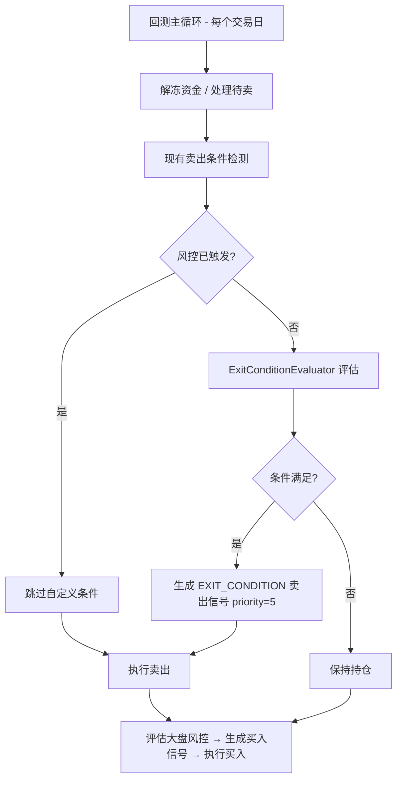
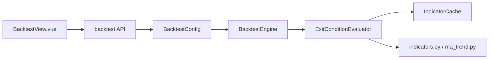

# 技术设计文档：回测自定义平仓条件

## 概述

本功能在现有回测引擎中新增自定义平仓条件支持。用户可配置基于技术指标（MA、MACD、BOLL、RSI、DMA、量价等）的平仓规则，这些规则与现有风控止损止盈条件并行生效。

核心变更范围：
- 新增 `ExitCondition` / `ExitConditionConfig` 数据模型（`app/core/schemas.py`）
- 新增 `ExitConditionEvaluator` 评估引擎（`app/services/exit_condition_evaluator.py`）
- 扩展 `BacktestEngine._check_sell_conditions` 集成自定义平仓条件
- 扩展 `IndicatorCache` 支持自定义参数指标缓存
- 扩展回测 API 和前端配置面板

设计原则：
1. 最小侵入：不修改现有风控逻辑，仅在卖出条件检测链末尾追加
2. 复用优先：复用现有 `IndicatorCache` 和指标计算函数
3. 向后兼容：未配置自定义条件时行为与现有完全一致

## 架构

### 整体流程



### 模块依赖



## 组件与接口

### 1. ExitConditionEvaluator（新增）

文件：`app/services/exit_condition_evaluator.py`

职责：
- 接收 `ExitConditionConfig` 和指标缓存，对单只持仓评估所有自定义平仓条件
- 支持数值比较（`>`, `<`, `>=`, `<=`）和交叉检测（`cross_up`, `cross_down`）
- 支持 AND / OR 逻辑组合

```python
class ExitConditionEvaluator:
    """自定义平仓条件评估器"""

    def evaluate(
        self,
        config: ExitConditionConfig,
        symbol: str,
        bar_index: int,
        indicator_cache: IndicatorCache,
        exit_indicator_cache: dict[str, list[float]] | None = None,
    ) -> tuple[bool, str | None]:
        """
        评估单只持仓的自定义平仓条件。

        Args:
            config: 平仓条件配置
            symbol: 股票代码
            bar_index: 当前交易日在 K 线序列中的索引
            indicator_cache: 预计算指标缓存
            exit_indicator_cache: 自定义参数指标的补充缓存

        Returns:
            (triggered, reason) - triggered 为 True 时 reason 包含触发条件描述
        """

    def _evaluate_single(
        self,
        condition: ExitCondition,
        bar_index: int,
        indicator_cache: IndicatorCache,
        exit_indicator_cache: dict[str, list[float]] | None,
    ) -> bool:
        """评估单条平仓条件"""

    def _get_indicator_value(
        self,
        indicator_name: str,
        bar_index: int,
        indicator_cache: IndicatorCache,
        exit_indicator_cache: dict[str, list[float]] | None,
        params: dict | None = None,
    ) -> float | None:
        """从缓存获取指标值，支持自定义参数"""

    def _check_cross(
        self,
        indicator_name: str,
        cross_target: str,
        bar_index: int,
        indicator_cache: IndicatorCache,
        exit_indicator_cache: dict[str, list[float]] | None,
        direction: str,  # "up" or "down"
        params: dict | None = None,
    ) -> bool:
        """检测交叉信号"""
```

### 2. BacktestEngine 扩展

在 `_check_sell_conditions` 方法末尾追加自定义条件评估：

```python
# 现有 _check_sell_conditions 末尾追加：
# 5. 自定义平仓条件（优先级 5，最低）
if config.exit_conditions is not None:
    evaluator = ExitConditionEvaluator()
    triggered, reason = evaluator.evaluate(
        config.exit_conditions, position.symbol, bar_index,
        indicator_cache, exit_indicator_cache,
    )
    if triggered:
        return _SellSignal(
            symbol=position.symbol,
            reason="EXIT_CONDITION",
            trigger_date=trade_date,
            priority=5,
        )
```

交易记录序列化扩展 — 在 `_TradeRecord` 中新增 `sell_reason` 字段：

```python
@dataclass
class _TradeRecord:
    date: date
    symbol: str
    action: str
    price: Decimal
    quantity: int
    cost: Decimal
    amount: Decimal
    sell_reason: str = ""  # 新增：卖出原因
```

### 3. IndicatorCache 扩展

在预计算阶段，检查 `ExitConditionConfig` 中引用的指标参数组合，如果与默认参数不同则补充计算：

```python
def _precompute_exit_indicators(
    kline_data: dict[str, list[KlineBar]],
    exit_config: ExitConditionConfig | None,
    existing_cache: dict[str, IndicatorCache],
) -> dict[str, dict[str, list[float]]]:
    """
    为自定义平仓条件补充计算非默认参数的指标。

    返回 {symbol: {cache_key: values}} 格式的补充缓存。
    cache_key 格式如 "ma_10", "rsi_7", "macd_dif_8_21_5" 等。
    """
```

指标值获取的映射关系：

| 指标名称 | IndicatorCache 字段 | 备注 |
|---------|-------------------|------|
| `close` | `closes[i]` | 直接读取 |
| `volume` | `volumes[i]` | 直接读取 |
| `turnover` | `turnovers[i]` | 直接读取 |
| `ma` | 需按周期从 `exit_indicator_cache` 查找 | 支持自定义周期 |
| `macd_dif` | 从 MACD 计算结果的 `dif[i]` | 支持自定义参数 |
| `macd_dea` | 从 MACD 计算结果的 `dea[i]` | 支持自定义参数 |
| `macd_histogram` | 从 MACD 计算结果的 `macd[i]` | 支持自定义参数 |
| `boll_upper` | 从 BOLL 计算结果的 `upper[i]` | 支持自定义参数 |
| `boll_middle` | 从 BOLL 计算结果的 `middle[i]` | 支持自定义参数 |
| `boll_lower` | 从 BOLL 计算结果的 `lower[i]` | 支持自定义参数 |
| `rsi` | 从 RSI 计算结果的 `values[i]` | 支持自定义周期 |
| `dma` | 从 DMA 计算结果的 `dma[i]` | 支持自定义参数 |
| `ama` | 从 DMA 计算结果的 `ama[i]` | 支持自定义参数 |

## 数据模型

### ExitCondition（新增，`app/core/schemas.py`）

```python
@dataclass
class ExitCondition:
    """单条自定义平仓条件"""
    freq: str                          # 数据源频率："daily" | "minute"
    indicator: str                     # 指标名称
    operator: str                      # 比较运算符
    threshold: float | None = None     # 数值阈值（数值比较时使用）
    cross_target: str | None = None    # 交叉目标指标（cross_up/cross_down 时使用）
    params: dict = field(default_factory=dict)  # 指标参数（如 {"period": 10}）

    def to_dict(self) -> dict:
        return {
            "freq": self.freq,
            "indicator": self.indicator,
            "operator": self.operator,
            "threshold": self.threshold,
            "cross_target": self.cross_target,
            "params": self.params,
        }

    @classmethod
    def from_dict(cls, data: dict) -> "ExitCondition":
        return cls(
            freq=data["freq"],
            indicator=data["indicator"],
            operator=data["operator"],
            threshold=data.get("threshold"),
            cross_target=data.get("cross_target"),
            params=data.get("params", {}),
        )
```

支持的指标名称（`VALID_INDICATORS`）：
`"ma"`, `"macd_dif"`, `"macd_dea"`, `"macd_histogram"`, `"boll_upper"`, `"boll_middle"`, `"boll_lower"`, `"rsi"`, `"dma"`, `"ama"`, `"close"`, `"volume"`, `"turnover"`

支持的运算符（`VALID_OPERATORS`）：
`">"`, `"<"`, `">="`, `"<="`, `"cross_up"`, `"cross_down"`

### ExitConditionConfig（新增，`app/core/schemas.py`）

```python
@dataclass
class ExitConditionConfig:
    """自定义平仓条件配置"""
    conditions: list[ExitCondition] = field(default_factory=list)
    logic: str = "AND"  # "AND" | "OR"

    def to_dict(self) -> dict:
        return {
            "conditions": [c.to_dict() for c in self.conditions],
            "logic": self.logic,
        }

    @classmethod
    def from_dict(cls, data: dict) -> "ExitConditionConfig":
        conditions = [
            ExitCondition.from_dict(c)
            for c in data.get("conditions", [])
        ]
        return cls(
            conditions=conditions,
            logic=data.get("logic", "AND"),
        )
```

### BacktestConfig 扩展

```python
@dataclass
class BacktestConfig:
    # ... 现有字段 ...
    exit_conditions: ExitConditionConfig | None = None  # 新增
```

### _TradeRecord 扩展

```python
@dataclass
class _TradeRecord:
    # ... 现有字段 ...
    sell_reason: str = ""  # 新增：卖出原因标识
```

### _SellSignal 扩展

新增优先级 5 用于自定义平仓条件：

| 优先级 | 原因 | 描述 |
|-------|------|------|
| 1 | STOP_LOSS | 固定止损 |
| 2 | TREND_BREAK | 趋势破位 |
| 3 | TRAILING_STOP | 移动止盈 |
| 4 | MAX_HOLDING_DAYS | 持仓超期 |
| 5 | EXIT_CONDITION | 自定义平仓条件（新增） |


## 正确性属性

*正确性属性是在系统所有有效执行中都应成立的特征或行为——本质上是关于系统应该做什么的形式化陈述。属性是人类可读规范与机器可验证正确性保证之间的桥梁。*

### Property 1: ExitConditionConfig 序列化往返一致性

*对于任意*有效的 `ExitConditionConfig` 对象（包含任意数量的条件、任意合法指标名称、任意合法运算符、任意阈值或交叉目标），调用 `to_dict()` 序列化为字典后再调用 `from_dict()` 反序列化，所得对象应与原对象在所有字段上等价。

**Validates: Requirements 1.6, 1.7**

### Property 2: 逻辑运算符评估正确性

*对于任意*逻辑运算符（AND 或 OR）和任意非空布尔值列表（代表各条件的评估结果），`ExitConditionEvaluator` 的逻辑组合结果应满足：当 logic="AND" 时结果等于 `all(results)`，当 logic="OR" 时结果等于 `any(results)`。

**Validates: Requirements 2.2, 2.3**

### Property 3: 数值比较运算符正确性

*对于任意*浮点数 `indicator_value`、任意合法数值比较运算符（`>`, `<`, `>=`, `<=`）和任意浮点数 `threshold`，`ExitConditionEvaluator` 的单条件评估结果应与 Python 原生比较运算的结果一致。

**Validates: Requirements 2.4**

### Property 4: 交叉检测正确性

*对于任意*两组连续两日的浮点数值对 `(prev_indicator, curr_indicator)` 和 `(prev_target, curr_target)`：
- `cross_up` 应在且仅在 `prev_indicator <= prev_target` 且 `curr_indicator > curr_target` 时返回 True
- `cross_down` 应在且仅在 `prev_indicator >= prev_target` 且 `curr_indicator < curr_target` 时返回 True

**Validates: Requirements 2.5, 2.6**

### Property 5: 无自定义条件时向后兼容

*对于任意*有效的 `BacktestConfig`（其中 `exit_conditions` 为 None），回测引擎的卖出条件检测结果应与未引入自定义平仓条件功能前的行为完全一致——即不会产生任何 `EXIT_CONDITION` 类型的卖出信号。

**Validates: Requirements 3.5**

### Property 6: 所有卖出记录包含平仓原因

*对于任意*回测执行产生的交易记录列表，其中所有 `action="SELL"` 的记录都应包含非空的 `sell_reason` 字段，且 `sell_reason` 的值必须属于合法集合 `{"STOP_LOSS", "TREND_BREAK", "TRAILING_STOP", "MAX_HOLDING_DAYS", "EXIT_CONDITION"}`。

**Validates: Requirements 7.1, 7.4**

## 错误处理

### 评估器错误处理

| 场景 | 处理方式 |
|------|---------|
| 指标数据不足（K线数量 < 指标最小周期） | 跳过该条件，记录 WARNING 日志，该条件视为"未满足" |
| 指标值为 NaN | 跳过该条件，视为"未满足" |
| 无效指标名称（运行时） | 跳过该条件，记录 ERROR 日志 |
| 交叉检测缺少前一日数据（bar_index=0） | 跳过该条件，视为"未满足" |
| 分钟K线数据不可用 | 回退到日K线数据，记录 INFO 日志 |

### API 验证错误

| 场景 | HTTP 状态码 | 错误信息 |
|------|-----------|---------|
| 无效指标名称 | 422 | `"无效的指标名称: {name}，支持: ma, macd_dif, ..."` |
| 无效运算符 | 422 | `"无效的比较运算符: {op}，支持: >, <, >=, <=, cross_up, cross_down"` |
| cross_up/cross_down 缺少 cross_target | 422 | `"交叉运算符需要指定 cross_target"` |
| 数值运算符缺少 threshold | 422 | `"数值比较运算符需要指定 threshold"` |
| 无效逻辑运算符 | 422 | `"无效的逻辑运算符: {logic}，支持: AND, OR"` |

### 回测引擎错误处理

- `ExitConditionEvaluator` 内部异常不应中断回测主循环
- 捕获异常后记录 ERROR 日志，跳过该持仓的自定义条件评估
- 确保回测结果的完整性不受单条件评估失败影响

## 测试策略

### 单元测试

1. `ExitCondition` / `ExitConditionConfig` 数据模型
   - 构造、字段验证、默认值
   - 各种指标和运算符组合的实例化

2. `ExitConditionEvaluator`
   - 各运算符的具体评估场景（RSI > 80、MACD_DIF cross_down MACD_DEA 等）
   - AND/OR 逻辑组合的具体场景
   - 边界条件：空条件列表、单条件、数据不足
   - 错误处理：无效指标、NaN 值

3. `BacktestEngine` 集成
   - 自定义条件在风控之后执行
   - 风控已触发时跳过自定义条件
   - 卖出记录包含正确的 sell_reason
   - 无自定义条件时行为不变

4. API 层
   - 请求验证（有效/无效的 exit_conditions）
   - 参数传递到 BacktestConfig

5. 前端组件
   - 条件面板的展开/折叠
   - 添加/删除条件行
   - 运算符切换时输入框变化
   - 表单序列化

### 属性测试（Hypothesis）

后端使用 Hypothesis 库，每个属性测试最少运行 100 次迭代。

- Property 1: `ExitConditionConfig` 序列化往返
  - Tag: `Feature: backtest-exit-conditions, Property 1: ExitConditionConfig round-trip serialization`
- Property 2: 逻辑运算符正确性
  - Tag: `Feature: backtest-exit-conditions, Property 2: Logic operator evaluation correctness`
- Property 3: 数值比较运算符正确性
  - Tag: `Feature: backtest-exit-conditions, Property 3: Numeric comparison operator correctness`
- Property 4: 交叉检测正确性
  - Tag: `Feature: backtest-exit-conditions, Property 4: Cross detection correctness`
- Property 5: 无自定义条件时向后兼容
  - Tag: `Feature: backtest-exit-conditions, Property 5: Backward compatibility without exit conditions`
- Property 6: 所有卖出记录包含平仓原因
  - Tag: `Feature: backtest-exit-conditions, Property 6: All sell records contain sell_reason`

### 前端属性测试（fast-check）

- `ExitConditionConfig` JSON 序列化往返（与后端 Property 1 对应）
- 条件表单状态管理的一致性

### API 变更

#### `BacktestRunRequest` 扩展

```python
class ExitConditionSchema(BaseModel):
    freq: str = "daily"
    indicator: str
    operator: str
    threshold: float | None = None
    cross_target: str | None = None
    params: dict = Field(default_factory=dict)

    @model_validator(mode="after")
    def validate_condition(self) -> "ExitConditionSchema":
        if self.indicator not in VALID_INDICATORS:
            raise ValueError(f"无效的指标名称: {self.indicator}")
        if self.operator not in VALID_OPERATORS:
            raise ValueError(f"无效的比较运算符: {self.operator}")
        if self.operator in ("cross_up", "cross_down") and not self.cross_target:
            raise ValueError("交叉运算符需要指定 cross_target")
        if self.operator not in ("cross_up", "cross_down") and self.threshold is None:
            raise ValueError("数值比较运算符需要指定 threshold")
        return self

class ExitConditionsSchema(BaseModel):
    conditions: list[ExitConditionSchema] = Field(default_factory=list)
    logic: str = "AND"

class BacktestRunRequest(BaseModel):
    # ... 现有字段 ...
    exit_conditions: ExitConditionsSchema | None = None  # 新增
```

#### 回测结果交易记录扩展

交易记录 JSON 新增 `sell_reason` 字段：

```json
{
  "date": "2024-01-15",
  "symbol": "600519.SH",
  "action": "SELL",
  "price": 1850.0,
  "quantity": 100,
  "cost": 24.05,
  "amount": 185000.0,
  "sell_reason": "EXIT_CONDITION: RSI > 80"
}
```

### 前端组件设计

#### ExitConditionPanel 组件

在 `BacktestView.vue` 的回测参数区域新增可折叠面板：

```
┌─ 自定义平仓条件 ──────────────────────── [▼ 展开/收起] ─┐
│                                                          │
│  条件逻辑: [AND ▼]                                       │
│                                                          │
│  ┌──────────────────────────────────────────────────┐    │
│  │ [daily ▼] [RSI ▼] [> ▼] [80        ] [✕ 删除]  │    │
│  │ [daily ▼] [MA  ▼] [< ▼] [close     ] [✕ 删除]  │    │
│  │           周期: [20  ]                            │    │
│  └──────────────────────────────────────────────────┘    │
│                                                          │
│  [+ 添加条件]                                            │
└──────────────────────────────────────────────────────────┘
```

状态管理：在 `useBacktestStore` 的 `form` 中新增 `exitConditions` 字段：

```typescript
interface ExitConditionForm {
  freq: 'daily' | 'minute'
  indicator: string
  operator: string
  threshold: number | null
  crossTarget: string | null
  params: Record<string, number>
}

// form 扩展
const form = ref({
  // ... 现有字段 ...
  exitConditions: {
    conditions: [] as ExitConditionForm[],
    logic: 'AND' as 'AND' | 'OR',
  },
})
```

交易流水表格新增"平仓原因"列，展示 `sell_reason` 字段值。
