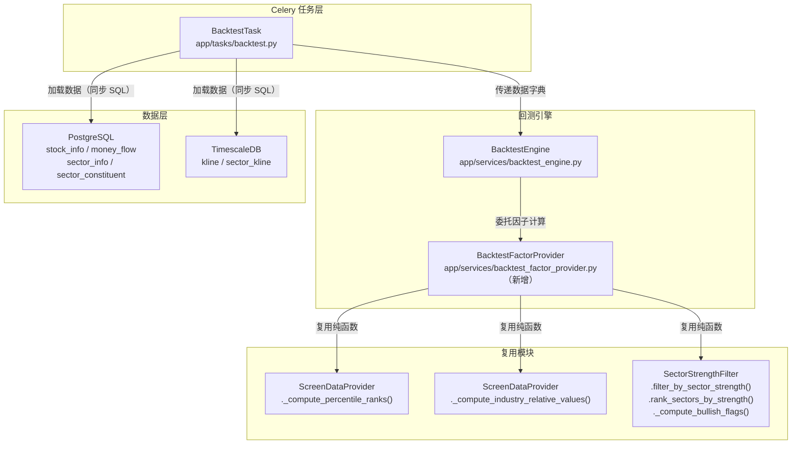
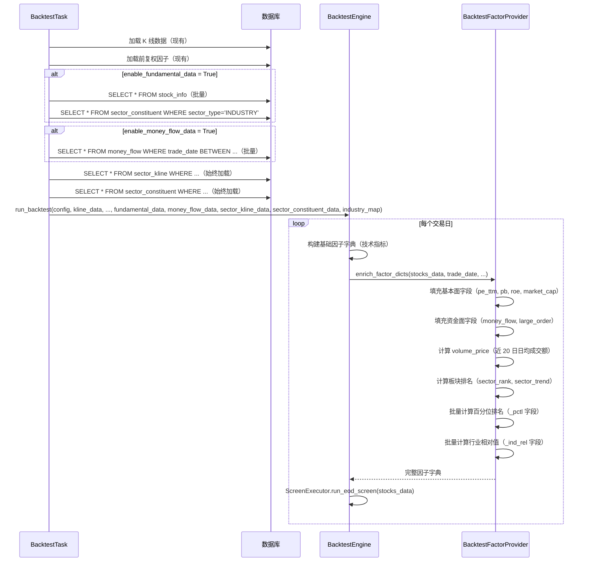

# 设计文档：回测引擎因子对齐优化

## 概述

本设计文档描述回测引擎（`BacktestEngine`）因子数据对齐优化的技术实现方案。当前回测引擎在构建因子字典时，基本面字段硬编码为 `None`、资金面字段硬编码为 `False`，且缺少百分位排名（`_pctl`）、行业相对值（`_ind_rel`）和板块强势（`sector_rank`/`sector_trend`）字段。这导致 `factor-editor-optimization` 功能中定义的策略在回测时无法正确执行。

本功能通过以下核心改动实现因子对齐：

1. **BacktestConfig 扩展**：新增 `enable_fundamental_data`、`enable_money_flow_data` 和 `enable_tushare_factors` 三个可选布尔开关
2. **BacktestTask 数据加载扩展**：根据开关批量加载基本面、资金流向、Tushare 因子数据；始终加载板块行情和成分股数据
3. **BacktestFactorProvider 新模块**：封装回测环境中的因子数据加载、百分位排名、行业相对值、板块强势和 Tushare 因子计算逻辑
4. **BacktestEngine 因子字典对齐**：两条路径（`_generate_buy_signals` 和 `_generate_buy_signals_optimized`）同时更新，补全信号增强字段，复用 `ScreenDataProvider` 的纯函数逻辑
5. **涨跌停价格修正**：`_calc_limit_prices()` 按股票代码前缀区分涨跌停幅度（主板 10%、创业板/科创板 20%、北交所 30%）
6. **持仓天数修正**：`buy_trade_day_index` 改为记录实际买入执行日
7. **DANGER 风控对齐**：移除回测中的 DANGER 完全阻断逻辑，改为传递 `index_closes` 给 ScreenExecutor 统一处理

### 设计原则

- **可选加载**：基本面和资金面数据通过开关控制，默认不加载，避免强制依赖
- **复用纯函数**：百分位排名和行业相对值计算直接调用 `ScreenDataProvider` 的静态方法，确保回测与实时选股一致
- **批量预加载**：所有新增数据在回测初始化阶段一次性加载到内存，避免逐日查询
- **向后兼容**：所有新增参数使用默认值 `None`/`False`，现有调用方无需修改

## 架构

### 系统架构概览



### 数据流



## 组件与接口

### 1. BacktestConfig 扩展（`app/core/schemas.py`）

在现有 `BacktestConfig` 数据类中新增两个布尔字段：

```python
@dataclass
class BacktestConfig:
    # ... 现有字段 ...
    enable_fundamental_data: bool = False   # 是否加载基本面数据（PE/PB/ROE/市值）
    enable_money_flow_data: bool = False    # 是否加载资金流向数据（主力资金/大单）
    enable_tushare_factors: bool = False    # 是否加载 Tushare 导入的因子数据（KDJ/CCI/WR/筹码/两融/增强资金流/打板/指数）
```

### 2. BacktestFactorProvider（新增模块 `app/services/backtest_factor_provider.py`）

新建纯函数模块，封装回测环境中的因子数据填充和计算逻辑。所有方法为静态方法或模块级函数，不依赖数据库会话，便于单元测试和属性测试。

```python
"""
回测因子数据提供器

负责在回测环境中加载和计算完整的因子数据，对齐 ScreenDataProvider 的因子字典结构。
复用 ScreenDataProvider 的纯函数逻辑（百分位排名、行业相对值）和
SectorStrengthFilter 的纯函数逻辑（板块排名、多头趋势）。

需求：1, 2, 3, 4, 5, 6
"""

from datetime import date
from typing import Any

from app.services.screener.screen_data_provider import ScreenDataProvider
from app.services.screener.sector_strength import (
    SectorStrengthFilter, SectorRankResult,
)


def enrich_factor_dicts(
    stocks_data: dict[str, dict[str, Any]],
    trade_date: date,
    config: "BacktestConfig",
    fundamental_data: dict[str, dict[str, Any]] | None = None,
    money_flow_data: dict[str, dict[str, dict[str, Any]]] | None = None,
    sector_kline_data: list[dict] | None = None,
    stock_sector_map: dict[str, list[str]] | None = None,
    industry_map: dict[str, str] | None = None,
    sector_info_map: dict[str, str] | None = None,
) -> None:
    """
    就地丰富因子字典，添加基本面、资金面、百分位排名、行业相对值和板块强势数据。

    Args:
        stocks_data: {symbol: factor_dict}，由 BacktestEngine 构建的基础因子字典
        trade_date: 当前交易日
        config: 回测配置
        fundamental_data: {symbol: {pe_ttm, pb, roe, market_cap, ...}} 基本面映射
        money_flow_data: {symbol: {date_str: {main_net_inflow, large_order_ratio}}} 资金流向映射
        sector_kline_data: 板块行情数据列表（含 sector_code, change_pct, close, time 等字段）
        stock_sector_map: {symbol: [sector_code, ...]} 股票→板块映射
        industry_map: {symbol: industry_code} 股票→行业映射
        sector_info_map: {sector_code: sector_name} 板块代码→名称映射
    """
    ...


def _fill_fundamental_fields(
    stocks_data: dict[str, dict[str, Any]],
    fundamental_data: dict[str, dict[str, Any]] | None,
    enabled: bool,
) -> None:
    """填充基本面因子字段（pe_ttm, pb, roe, market_cap, profit_growth, revenue_growth）。"""
    ...


def _fill_money_flow_fields(
    stocks_data: dict[str, dict[str, Any]],
    money_flow_data: dict[str, dict[str, dict[str, Any]]] | None,
    trade_date: date,
    enabled: bool,
) -> None:
    """填充资金面因子字段（money_flow, large_order）。"""
    ...


def _compute_volume_price(
    stocks_data: dict[str, dict[str, Any]],
    window: int = 20,
) -> None:
    """就地计算近 N 日日均成交额，写入 volume_price 字段。"""
    ...


def _compute_sector_strength(
    stocks_data: dict[str, dict[str, Any]],
    trade_date: date,
    sector_kline_data: list[dict] | None,
    stock_sector_map: dict[str, list[str]] | None,
    sector_info_map: dict[str, str] | None,
    sector_config: "SectorScreenConfig",
) -> None:
    """计算板块排名和趋势，写入 sector_rank / sector_trend / sector_name 字段。"""
    ...


def _compute_conditional_percentile_ranks(
    stocks_data: dict[str, dict[str, Any]],
    enable_fundamental: bool,
    enable_money_flow: bool,
) -> None:
    """根据开关条件计算百分位排名。"""
    ...


def _compute_conditional_industry_relative(
    stocks_data: dict[str, dict[str, Any]],
    industry_map: dict[str, str] | None,
    enable_fundamental: bool,
) -> None:
    """根据开关条件计算行业相对值。"""
    ...
```

**接口说明**：
- `enrich_factor_dicts()` 是主入口，由 `BacktestEngine` 在每个交易日构建完基础因子字典后调用
- 所有内部函数以 `_` 前缀标记为模块私有，但均为纯函数，可直接导入测试
- 复用 `ScreenDataProvider._compute_percentile_ranks` 和 `._compute_industry_relative_values` 静态方法
- 复用 `SectorStrengthFilter.rank_sectors_by_strength`、`._compute_bullish_flags`、`.filter_by_sector_strength` 纯函数

### 3. BacktestEngine 修改（`app/services/backtest_engine.py`）

#### 3.1 `run_backtest` 方法签名扩展

```python
def run_backtest(
    self,
    config: BacktestConfig,
    signals: list[dict] | None = None,
    kline_data: dict[str, list[KlineBar]] | None = None,
    index_data: dict[str, list[KlineBar]] | None = None,
    minute_kline_data: dict[str, dict[str, list[KlineBar]]] | None = None,
    # ── 新增参数（全部默认 None，向后兼容）──
    fundamental_data: dict[str, dict[str, Any]] | None = None,
    money_flow_data: dict[str, dict[str, dict[str, Any]]] | None = None,
    sector_kline_data: list[dict] | None = None,
    stock_sector_map: dict[str, list[str]] | None = None,
    industry_map: dict[str, str] | None = None,
    sector_info_map: dict[str, str] | None = None,
) -> BacktestResult:
```

#### 3.2 `_run_backtest_strategy_driven` 修改

将新增数据参数透传到内部，并在每个交易日的买入信号生成后、ScreenExecutor 调用前，调用 `BacktestFactorProvider.enrich_factor_dicts()` 丰富因子字典。

#### 3.3 `_generate_buy_signals` 和 `_generate_buy_signals_optimized` 修改

两个方法的修改逻辑一致：

1. **移除硬编码**：删除 `"pe_ttm": None, "pb": None, "roe": None, "market_cap": None, "money_flow": False, "large_order": False`
2. **初始化占位字段**：所有新增字段初始化为 `None`（基本面、资金面、百分位、行业相对值、板块）
3. **调用 enrich_factor_dicts**：在构建完所有股票的基础因子字典后、调用 ScreenExecutor 之前，调用 `enrich_factor_dicts()` 批量填充

```python
# 在 stocks_data 构建循环中，替换硬编码为占位 None
stocks_data[symbol] = {
    # ... 现有技术指标字段 ...
    # 基本面（由 enrich_factor_dicts 填充）
    "pe_ttm": None,
    "pb": None,
    "roe": None,
    "market_cap": None,
    "profit_growth": None,
    "revenue_growth": None,
    # 资金面（由 enrich_factor_dicts 填充）
    "money_flow": None,
    "large_order": None,
    "volume_price": None,
    # 百分位排名（由 enrich_factor_dicts 填充）
    "money_flow_pctl": None,
    "volume_price_pctl": None,
    "roe_pctl": None,
    "profit_growth_pctl": None,
    "market_cap_pctl": None,
    "revenue_growth_pctl": None,
    # 行业相对值（由 enrich_factor_dicts 填充）
    "pe_ind_rel": None,
    "pb_ind_rel": None,
    # 板块强势（由 enrich_factor_dicts 填充）
    "sector_rank": None,
    "sector_trend": False,
    "sector_name": None,
    # 保留
    "turnover_check": True,
}

# 构建完所有股票后，批量丰富因子字典
if stocks_data:
    from app.services.backtest_factor_provider import enrich_factor_dicts
    enrich_factor_dicts(
        stocks_data=stocks_data,
        trade_date=trade_date,
        config=config,
        fundamental_data=self._fundamental_data,
        money_flow_data=self._money_flow_data,
        sector_kline_data=self._sector_kline_data,
        stock_sector_map=self._stock_sector_map,
        industry_map=self._industry_map,
        sector_info_map=self._sector_info_map,
    )
```

新增数据参数在 `_run_backtest_strategy_driven` 中存储为实例属性，供两个信号生成方法访问：

```python
# _run_backtest_strategy_driven 初始化阶段
self._fundamental_data = fundamental_data
self._money_flow_data = money_flow_data
self._sector_kline_data = sector_kline_data
self._stock_sector_map = stock_sector_map
self._industry_map = industry_map
self._sector_info_map = sector_info_map
```

### 4. BacktestTask 数据加载扩展（`app/tasks/backtest.py`）

#### 4.1 `run_backtest_task` 函数签名扩展

```python
def run_backtest_task(
    self,
    run_id: str,
    # ... 现有参数 ...
    enable_fundamental_data: bool = False,    # 新增
    enable_money_flow_data: bool = False,     # 新增
) -> dict:
```

#### 4.2 新增数据加载步骤

在现有 K 线数据加载（步骤 2）之后、回测执行（步骤 3）之前，新增步骤 2.7：

```python
# ── 2.7 加载新增因子数据源 ──
fundamental_data: dict[str, dict[str, Any]] | None = None
money_flow_data: dict[str, dict[str, dict[str, Any]]] | None = None
sector_kline_data: list[dict] | None = None
stock_sector_map: dict[str, list[str]] | None = None
industry_map: dict[str, str] | None = None
sector_info_map: dict[str, str] | None = None

# 2.7.1 基本面数据（可选）
if enable_fundamental_data:
    try:
        pg_engine = create_engine(_get_sync_pg_url())
        with Session(pg_engine) as session:
            rows = session.execute(text(
                "SELECT symbol, pe_ttm, pb, roe, market_cap FROM stock_info"
            )).fetchall()
            fundamental_data = {
                row[0]: {
                    "pe_ttm": float(row[1]) if row[1] is not None else None,
                    "pb": float(row[2]) if row[2] is not None else None,
                    "roe": float(row[3]) if row[3] is not None else None,
                    "market_cap": float(row[4]) if row[4] is not None else None,
                }
                for row in rows
            }
        pg_engine.dispose()
        logger.info("基本面数据加载完成: %d 只股票", len(fundamental_data))
    except Exception as exc:
        logger.warning("基本面数据加载失败: %s", exc)

# 2.7.2 资金流向数据（可选）
if enable_money_flow_data:
    try:
        pg_engine = create_engine(_get_sync_pg_url())
        with Session(pg_engine) as session:
            rows = session.execute(text("""
                SELECT symbol, trade_date, main_net_inflow, large_order_ratio
                FROM money_flow
                WHERE trade_date >= :start AND trade_date <= :end
            """), {"start": warmup_date.isoformat(), "end": ed.isoformat()}).fetchall()
            money_flow_data = {}
            for row in rows:
                sym, td, inflow, ratio = row[0], row[1], row[2], row[3]
                if sym not in money_flow_data:
                    money_flow_data[sym] = {}
                money_flow_data[sym][td.isoformat()] = {
                    "main_net_inflow": float(inflow) if inflow is not None else None,
                    "large_order_ratio": float(ratio) if ratio is not None else None,
                }
        pg_engine.dispose()
        logger.info("资金流向数据加载完成: %d 只股票", len(money_flow_data))
    except Exception as exc:
        logger.warning("资金流向数据加载失败: %s", exc)

# 2.7.3 板块行情数据（始终加载）
try:
    sector_cfg = config.strategy_config.sector_config if hasattr(
        config.strategy_config, 'sector_config'
    ) else SectorScreenConfig()

    ts_engine = create_engine(_get_sync_ts_url())
    pg_engine = create_engine(_get_sync_pg_url())

    with Session(ts_engine) as session:
        rows = session.execute(text("""
            SELECT sk.sector_code, sk.time, sk.close, sk.change_pct, sk.data_source
            FROM sector_kline sk
            JOIN sector_info si ON sk.sector_code = si.sector_code
                AND sk.data_source = si.data_source
            WHERE sk.data_source = :ds AND si.sector_type = :st
                AND sk.freq = '1d'
                AND sk.time >= :start AND sk.time <= :end
            ORDER BY sk.sector_code, sk.time
        """), {
            "ds": sector_cfg.sector_data_source,
            "st": sector_cfg.sector_type,
            "start": warmup_date.isoformat(),
            "end": ed.isoformat(),
        }).fetchall()
        sector_kline_data = [
            {
                "sector_code": r[0],
                "time": r[1],
                "close": float(r[2]) if r[2] is not None else None,
                "change_pct": float(r[3]) if r[3] is not None else None,
                "data_source": r[4],
            }
            for r in rows
        ]
    ts_engine.dispose()

    with Session(pg_engine) as session:
        # 板块成分股映射
        rows = session.execute(text("""
            SELECT symbol, sector_code FROM sector_constituent
            WHERE data_source = :ds
            ORDER BY symbol
        """), {"ds": sector_cfg.sector_data_source}).fetchall()
        stock_sector_map = {}
        for row in rows:
            stock_sector_map.setdefault(row[0], []).append(row[1])

        # 板块名称映射
        rows = session.execute(text("""
            SELECT sector_code, name FROM sector_info
            WHERE data_source = :ds
        """), {"ds": sector_cfg.sector_data_source}).fetchall()
        sector_info_map = {row[0]: row[1] for row in rows}

        # 行业映射（仅当 enable_fundamental_data 时需要）
        if enable_fundamental_data:
            rows = session.execute(text("""
                SELECT DISTINCT ON (symbol) symbol, sector_code
                FROM sector_constituent
                WHERE data_source = :ds
                    AND sector_code IN (
                        SELECT sector_code FROM sector_info
                        WHERE data_source = :ds AND sector_type = 'INDUSTRY'
                    )
                ORDER BY symbol, trade_date DESC
            """), {"ds": sector_cfg.sector_data_source}).fetchall()
            industry_map = {row[0]: row[1] for row in rows}

    pg_engine.dispose()
    logger.info(
        "板块数据加载完成: %d 条行情, %d 只股票映射, %d 个板块",
        len(sector_kline_data or []),
        len(stock_sector_map or {}),
        len(sector_info_map or {}),
    )
except Exception as exc:
    logger.warning("板块数据加载失败: %s", exc)
```

#### 4.3 传递数据给 BacktestEngine

```python
result = engine.run_backtest(
    config=config,
    kline_data=kline_data,
    index_data=index_data if enable_market_risk else None,
    minute_kline_data=minute_kline_data if minute_kline_data else None,
    # 新增参数
    fundamental_data=fundamental_data,
    money_flow_data=money_flow_data,
    sector_kline_data=sector_kline_data,
    stock_sector_map=stock_sector_map,
    industry_map=industry_map,
    sector_info_map=sector_info_map,
)
```

## 数据模型

### BacktestConfig 扩展字段

| 字段 | 类型 | 默认值 | 说明 |
|------|------|--------|------|
| `enable_fundamental_data` | `bool` | `False` | 是否加载基本面数据（PE/PB/ROE/市值） |
| `enable_money_flow_data` | `bool` | `False` | 是否加载资金流向数据（主力资金/大单） |

### BacktestEngine.run_backtest 新增参数

| 参数 | 类型 | 默认值 | 说明 |
|------|------|--------|------|
| `fundamental_data` | `dict[str, dict] \| None` | `None` | `{symbol: {pe_ttm, pb, roe, market_cap}}` |
| `money_flow_data` | `dict[str, dict[str, dict]] \| None` | `None` | `{symbol: {date_str: {main_net_inflow, large_order_ratio}}}` |
| `sector_kline_data` | `list[dict] \| None` | `None` | 板块行情数据列表 |
| `stock_sector_map` | `dict[str, list[str]] \| None` | `None` | `{symbol: [sector_code, ...]}` |
| `industry_map` | `dict[str, str] \| None` | `None` | `{symbol: industry_code}` |
| `sector_info_map` | `dict[str, str] \| None` | `None` | `{sector_code: sector_name}` |

### 因子字典完整字段列表

回测引擎构建的因子字典与 `ScreenDataProvider._build_factor_dict` 对齐后的完整结构：

| 字段 | 类型 | 数据来源 | 条件 |
|------|------|----------|------|
| `pe_ttm` | `float \| None` | stock_info | `enable_fundamental_data=True` |
| `pb` | `float \| None` | stock_info | `enable_fundamental_data=True` |
| `roe` | `float \| None` | stock_info | `enable_fundamental_data=True` |
| `market_cap` | `float \| None` | stock_info | `enable_fundamental_data=True` |
| `profit_growth` | `float \| None` | stock_info | `enable_fundamental_data=True` |
| `revenue_growth` | `float \| None` | stock_info | `enable_fundamental_data=True` |
| `money_flow` | `float \| None` | money_flow | `enable_money_flow_data=True` |
| `large_order` | `float \| None` | money_flow | `enable_money_flow_data=True` |
| `volume_price` | `float \| None` | K 线 amounts | 始终计算 |
| `money_flow_pctl` | `float \| None` | 计算 | `enable_money_flow_data=True` |
| `volume_price_pctl` | `float \| None` | 计算 | 始终计算 |
| `roe_pctl` | `float \| None` | 计算 | `enable_fundamental_data=True` |
| `profit_growth_pctl` | `float \| None` | 计算 | `enable_fundamental_data=True` |
| `market_cap_pctl` | `float \| None` | 计算 | `enable_fundamental_data=True` |
| `revenue_growth_pctl` | `float \| None` | 计算 | `enable_fundamental_data=True` |
| `pe_ind_rel` | `float \| None` | 计算 | `enable_fundamental_data=True` |
| `pb_ind_rel` | `float \| None` | 计算 | `enable_fundamental_data=True` |
| `sector_rank` | `int \| None` | 计算 | 始终计算 |
| `sector_trend` | `bool` | 计算 | 始终计算 |
| `sector_name` | `str \| None` | sector_info | 始终计算 |
| `kdj_k` | `float \| None` | stk_factor | `enable_tushare_factors=True` |
| `kdj_d` | `float \| None` | stk_factor | `enable_tushare_factors=True` |
| `kdj_j` | `float \| None` | stk_factor | `enable_tushare_factors=True` |
| `cci` | `float \| None` | stk_factor | `enable_tushare_factors=True` |
| `wr` | `float \| None` | stk_factor | `enable_tushare_factors=True` |
| `trix` | `bool \| None` | stk_factor | `enable_tushare_factors=True` |
| `bias` | `float \| None` | stk_factor | `enable_tushare_factors=True` |
| `psy` | `float \| None` | K 线计算 | 始终计算 |
| `obv_signal` | `bool \| None` | K 线计算 | 始终计算 |
| `chip_winner_rate` | `float \| None` | cyq_perf | `enable_tushare_factors=True` |
| `chip_concentration` | `float \| None` | 计算 | `enable_tushare_factors=True` |
| `rzye_change` | `float \| None` | margin_detail | `enable_tushare_factors=True` |
| `margin_net_buy` | `float \| None` | margin_detail | `enable_tushare_factors=True` |
| `super_large_net_inflow` | `float \| None` | moneyflow_ths/dc | `enable_tushare_factors=True` |
| `large_net_inflow` | `float \| None` | moneyflow_ths/dc | `enable_tushare_factors=True` |
| `money_flow_strength` | `float \| None` | 计算 | `enable_tushare_factors=True` |
| `limit_up_count` | `int` | limit_list | `enable_tushare_factors=True` |
| `limit_up_streak` | `int` | limit_step | `enable_tushare_factors=True` |
| `dragon_tiger_net_buy` | `bool` | top_list | `enable_tushare_factors=True` |
| `index_pe` | `float \| None` | index_dailybasic | `enable_tushare_factors=True` |
| `index_ma_trend` | `bool \| None` | index_tech | `enable_tushare_factors=True` |
| `macd_strength` | `SignalStrength \| None` | K 线计算 | 始终计算 |
| `macd_signal_type` | `str` | K 线计算 | 始终计算 |
| `boll_near_upper_band` | `bool` | K 线计算 | 始终计算 |
| `boll_hold_days` | `int` | K 线计算 | 始终计算 |
| `rsi_current` | `float` | K 线计算 | 始终计算 |
| `rsi_consecutive_rising` | `int` | K 线计算 | 始终计算 |
| `daily_change_pct` | `float` | K 线计算 | 始终计算 |
| `change_pct_3d` | `float` | K 线计算 | 始终计算 |
| `breakout_list` | `list[dict]` | K 线计算 | 始终计算 |

### 数据库表（已有，无需新增迁移）

| 表 | 数据库 | 用途 |
|------|--------|------|
| `stock_info` | PostgreSQL | 基本面数据（pe_ttm, pb, roe, market_cap） |
| `money_flow` | PostgreSQL | 资金流向数据（main_net_inflow, large_order_ratio） |
| `sector_kline` | TimescaleDB | 板块指数日K线行情 |
| `sector_constituent` | PostgreSQL | 板块成分股快照 |
| `sector_info` | PostgreSQL | 板块元数据（名称、类型） |
| `stk_factor` | PostgreSQL | Tushare 技术面因子（KDJ/CCI/WR/TRIX/BIAS） |
| `cyq_perf` | PostgreSQL | 筹码及胜率数据 |
| `margin_detail` | PostgreSQL | 融资融券交易明细 |
| `moneyflow_ths` | PostgreSQL | 同花顺个股资金流向 |
| `moneyflow_dc` | PostgreSQL | 东方财富个股资金流向 |
| `limit_list` | PostgreSQL | 涨跌停和炸板数据 |
| `limit_step` | PostgreSQL | 涨停股连板天梯 |
| `top_list` | PostgreSQL | 龙虎榜每日统计 |
| `index_dailybasic` | PostgreSQL | 大盘指数每日指标 |
| `index_tech` | PostgreSQL | 指数技术面因子 |
| `index_weight` | PostgreSQL | 指数成分权重 |

### 5. 涨跌停价格修正（`app/services/backtest_engine.py`，需求 13）

```python
@staticmethod
def _calc_limit_prices(prev_close: Decimal, symbol: str = "") -> tuple[Decimal, Decimal]:
    """根据股票代码前缀计算涨跌停价格。"""
    if symbol.startswith("300") or symbol.startswith("688"):
        pct = Decimal("0.20")  # 创业板/科创板 ±20%
    elif symbol.startswith("8") or symbol.startswith("4"):
        pct = Decimal("0.30")  # 北交所 ±30%
    else:
        pct = Decimal("0.10")  # 主板 ±10%
    limit_up = (prev_close * (1 + pct)).quantize(Decimal("0.01"))
    limit_down = (prev_close * (1 - pct)).quantize(Decimal("0.01"))
    return limit_up, limit_down
```

所有调用 `_calc_limit_prices` 的位置需同步传入 `symbol` 参数。

### 6. 持仓天数修正（`app/services/backtest_engine.py`，需求 14）

```python
# 修改前（信号日序号）
state.positions[symbol] = _BacktestPosition(
    buy_trade_day_index=state.trade_day_index,  # 信号日
    ...
)

# 修改后（实际买入执行日序号 = 信号日 + 1）
state.positions[symbol] = _BacktestPosition(
    buy_trade_day_index=state.trade_day_index + 1,  # 实际买入执行日
    ...
)
```

### 7. DANGER 风控对齐（`app/services/backtest_engine.py`，需求 15）

```python
# 修改前
if market_risk_state == "DANGER":
    return []  # 完全阻断

# 修改后：移除此逻辑，改为将 index_closes 传递给 ScreenExecutor
result = self._screen_executor.run_eod_screen(
    stocks_data,
    index_closes=index_closes,  # 新增：传递指数数据
)
# ScreenExecutor 内部按 trend_score >= 95 过滤 DANGER 状态
```

### 8. 优化路径趋势评分算法修正（`app/services/backtest_engine.py`，需求 16）

#### 问题分析

当前 `_precompute_indicators` 中的趋势评分存在两处系统性偏差：

**距离评分偏差**：
```python
# 当前实现（线性公式）
ds = max(0.0, min(100.0, 50.0 + pct_above * 10.0))
# pct_above=0% → 50分, pct_above=3% → 80分, pct_above=5% → 100分

# 标准实现（_bell_curve_distance_score）
# pct_above=0% → 100分, pct_above=3% → 100分, pct_above=5% → 60分
```

**斜率评分偏差**：
```python
# 当前实现（等权平均，无 slope_threshold）
filtered = [max(sv, 0.0) for sv in slope_values]
avg_slope = sum(filtered) / len(filtered)

# 标准实现（短期 2 倍权重，支持 slope_threshold）
w = _SHORT_TERM_SLOPE_WEIGHT if p in _SHORT_TERM_PERIODS else _LONG_TERM_SLOPE_WEIGHT
filtered_slope = max(raw_slope - slope_threshold, 0.0) if raw_slope > slope_threshold else 0.0
```

#### 解决方案

**方案 A（推荐）：优化路径直接调用 `score_ma_trend` 函数**

将 `_precompute_indicators` 中的内联趋势评分逻辑替换为对 `score_ma_trend` 的逐日调用。预计算 MA 序列后，对每个 bar 位置切片调用 `score_ma_trend(closes[:i+1], periods, slope_threshold=slope_threshold)`。

优点：从根本上消除算法偏差，未来 `score_ma_trend` 的任何改进自动同步到回测。
缺点：逐日调用有一定性能开销，但 `score_ma_trend` 本身是纯函数且计算量不大。

```python
# 替换 _precompute_indicators 中的趋势评分逻辑
from app.services.screener.ma_trend import score_ma_trend

slope_threshold = float(strategy_config.get("ma_trend", {}).get("slope_threshold", 0.0))

for i in range(n):
    if i < max(sorted_ma_periods) - 1:
        scores.append(0.0)
        continue
    result = score_ma_trend(
        closes[:i+1],
        periods=sorted_ma_periods,
        slope_threshold=slope_threshold,
    )
    scores.append(result.score)
ic.ma_trend_scores = scores
```

**方案 B：修复内联实现使其与 `score_ma_trend` 一致**

逐一修复距离评分（改用 `_bell_curve_distance_score`）、斜率评分（改用加权平均 + `slope_threshold`）。
缺点：维护两份实现，未来容易再次偏差。

选择方案 A。

### 9. 实时选股指标参数一致性修复（`app/services/screener/screen_data_provider.py`，需求 17）

#### 详细设计

修改 `_build_factor_dict()` 方法，从 `strategy_config` 中提取 `indicator_params` 并传递给各检测函数：

```python
# 从策略配置中提取指标参数
_cfg = strategy_config or {}
ip_cfg = _cfg.get("indicator_params", {})
if isinstance(ip_cfg, dict):
    # 支持 IndicatorParamsConfig 对象和 dict 两种格式
    macd_fast = ip_cfg.get("macd_fast", 12) if isinstance(ip_cfg, dict) else getattr(ip_cfg, "macd_fast", 12)
    # ... 其他参数类似

# 调用时传递自定义参数
macd_result = detect_macd_signal(
    closes_float,
    fast_period=macd_fast,
    slow_period=macd_slow,
    signal_period=macd_signal,
)
```

同时修复非优化路径 `_generate_buy_signals` 中 `score_ma_trend` 的 `slope_threshold` 传递：

```python
# 修改前
ma_result = score_ma_trend(closes_f, ma_periods)

# 修改后
slope_threshold = float(config.strategy_config.ma_trend.slope_threshold)
ma_result = score_ma_trend(closes_f, ma_periods, slope_threshold=slope_threshold)
```

### 10. 回测 API 层扩展（`app/api/v1/backtest.py` + `frontend/src/views/BacktestView.vue`，需求 18）

#### 后端

在 `BacktestRunRequest` 中新增字段：

```python
class BacktestRunRequest(BaseModel):
    # ... 现有字段 ...
    enable_fundamental_data: bool = False
    enable_money_flow_data: bool = False
    enable_tushare_factors: bool = False
```

在 `run_backtest` 端点中传递给 Celery 任务：

```python
task = run_backtest_task.delay(
    run_id=run_id,
    # ... 现有参数 ...
    enable_fundamental_data=body.enable_fundamental_data,
    enable_money_flow_data=body.enable_money_flow_data,
    enable_tushare_factors=body.enable_tushare_factors,
)
```

#### 前端

在 BacktestView.vue 的参数配置区域新增折叠面板：

```html
<details class="data-source-options">
  <summary>数据源选项（可选）</summary>
  <label><input type="checkbox" v-model="enableFundamental"> 加载基本面数据（PE/PB/ROE/市值）</label>
  <label><input type="checkbox" v-model="enableMoneyFlow"> 加载资金流向数据（主力资金/大单）</label>
  <label><input type="checkbox" v-model="enableTushareFactors"> 加载 Tushare 因子数据（KDJ/筹码/两融/打板等）</label>
  <p class="hint">启用更多数据源可提高回测精度，但会增加回测耗时</p>
</details>
```


## 正确性属性

*属性（Property）是指在系统所有有效执行中都应成立的特征或行为——本质上是对系统应做什么的形式化陈述。属性是人类可读规格说明与机器可验证正确性保证之间的桥梁。*

### Property 1: 禁用开关时因子字段全部为 None

*For any* 因子数据映射（基本面、资金面），当 `enable_fundamental_data=False` 时，因子字典中的 `pe_ttm`、`pb`、`roe`、`market_cap`、`profit_growth`、`revenue_growth`、`roe_pctl`、`profit_growth_pctl`、`market_cap_pctl`、`revenue_growth_pctl`、`pe_ind_rel`、`pb_ind_rel` 字段 SHALL 全部为 None；当 `enable_money_flow_data=False` 时，`money_flow`、`large_order`、`money_flow_pctl` 字段 SHALL 全部为 None。

**Validates: Requirements 1.4, 2.4, 3.1, 4.3**

### Property 2: 启用开关时因子字段从数据映射正确填充

*For any* 有效的基本面数据映射 `{symbol: {pe_ttm, pb, roe, market_cap}}` 和资金流向数据映射 `{symbol: {date_str: {main_net_inflow, large_order_ratio}}}`，当对应开关启用时，因子字典中的字段值 SHALL 与映射中的值一致；当映射中不存在该股票或字段为 None 时，因子字典中的对应字段 SHALL 为 None。

**Validates: Requirements 1.3, 1.5, 2.3, 2.5**

### Property 3: volume_price 计算正确性

*For any* 非空的成交额序列 `amounts`，`volume_price` 字段 SHALL 等于序列最后 min(20, len(amounts)) 个元素的算术平均值。当 `amounts` 为空时，`volume_price` SHALL 为 None。

**Validates: Requirements 2.6**

### Property 4: 百分位排名条件计算

*For any* 因子字典集合，当 `enable_money_flow_data=True` 且存在有效的 `money_flow` 值时，`money_flow_pctl` SHALL 在 [0, 100] 闭区间内且不为 None；`volume_price_pctl` SHALL 始终被计算（当存在有效 `volume_price` 值时）；当 `enable_fundamental_data=False` 时，所有基本面相关的 `_pctl` 字段 SHALL 为 None。

**Validates: Requirements 3.1, 3.4**

### Property 5: 因子字典结构完整性

*For any* 有效的回测输入（K 线数据、配置），`_generate_buy_signals` 和 `_generate_buy_signals_optimized` 两条路径生成的因子字典 SHALL 包含完全相同的字段集合，且该字段集合 SHALL 包含所有需求 6.1 中定义的字段。

**Validates: Requirements 6.1, 6.2**

### Property 6: 向后兼容性

*For any* 不包含 percentile、industry_relative 或 sector 类型因子的策略配置，当 `run_backtest` 方法未收到新增数据参数（全部为 None）时，因子字典中的技术指标字段（ma_trend, ma_support, macd, boll, rsi, dma, breakout, turnover_check）SHALL 与优化前的值完全一致，基本面字段 SHALL 为 None，资金面字段 SHALL 为 None。

**Validates: Requirements 9.1, 9.2, 9.3**

## 错误处理

### 数据加载失败

| 场景 | 处理方式 |
|------|----------|
| stock_info 查询失败 | 记录 WARNING 日志，`fundamental_data` 保持 None，回测继续 |
| money_flow 查询失败 | 记录 WARNING 日志，`money_flow_data` 保持 None，回测继续 |
| sector_kline 查询失败 | 记录 WARNING 日志，`sector_kline_data` 保持 None，回测继续 |
| sector_constituent 查询失败 | 记录 WARNING 日志，`stock_sector_map` 保持 None，回测继续 |
| 数据库连接异常 | 捕获 SQLAlchemy 异常，记录 ERROR 日志，使用空数据继续 |

### 因子填充容错

| 场景 | 处理方式 |
|------|----------|
| 股票不在 fundamental_data 映射中 | 基本面字段保持 None |
| 股票在某交易日无资金流向数据 | money_flow 和 large_order 保持 None |
| amounts 序列为空 | volume_price 设为 None |
| 板块行情数据为空 | sector_rank 设为 None，sector_trend 设为 False |
| 股票不属于任何板块 | sector_rank 设为 None，sector_trend 设为 False，sector_name 设为 None |

### 百分位排名计算容错

| 场景 | 处理方式 |
|------|----------|
| 某因子全市场所有股票值均为 None | 跳过该因子的百分位计算，_pctl 字段设为 None |
| 仅有 1 只有效股票 | 该股票百分位设为 100 |
| 因子值包含负数 | 正常参与排名，负值排名靠后 |

### 行业相对值计算容错

| 场景 | 处理方式 |
|------|----------|
| 股票未找到所属行业板块 | _ind_rel 字段设为 None |
| 行业中位数为零 | _ind_rel 字段设为 None（行业内仅 1 只有效股票时为 1.0） |
| industry_map 为 None | 跳过行业相对值计算，所有 _ind_rel 字段设为 None |

## 测试策略

### 双重测试方法

本功能采用单元测试 + 属性测试的双重测试策略：

- **属性测试（Property-Based Testing）**：使用 Hypothesis 库验证上述 6 个正确性属性，每个属性至少运行 100 次迭代
- **单元测试（Example-Based Testing）**：验证具体的数据加载逻辑、边界条件和错误处理

### 属性测试（Hypothesis）

测试文件：`tests/properties/test_backtest_factor_alignment_properties.py`

| 属性 | 测试描述 | 生成器 |
|------|----------|--------|
| Property 1 | 禁用开关时因子字段全部为 None | 生成随机 stocks_data + fundamental_data + money_flow_data，设置 enable=False |
| Property 2 | 启用开关时因子字段从数据映射正确填充 | 生成随机 symbol→fundamental 映射和 symbol→{date→record} 映射 |
| Property 3 | volume_price 计算正确性 | `st.lists(st.decimals(min_value=0, max_value=1e12), min_size=0, max_size=100)` |
| Property 4 | 百分位排名条件计算 | 生成随机 stocks_data 集合，随机设置 enable 标志 |
| Property 5 | 因子字典结构完整性 | 生成随机 stocks_data，验证字段集合 |
| Property 6 | 向后兼容性 | 生成仅含技术指标因子的策略配置，验证因子字典一致性 |

每个属性测试标注格式：
```python
# Feature: backtest-factor-alignment, Property 1: 禁用开关时因子字段全部为 None
@given(...)
@settings(max_examples=100)
def test_disabled_flags_produce_none(...)：
    ...
```

### 单元测试

测试文件：`tests/services/test_backtest_factor_provider.py`

| 测试 | 描述 |
|------|------|
| `test_fill_fundamental_enabled_with_data` | 启用基本面时正确填充 |
| `test_fill_fundamental_enabled_missing_stock` | 启用基本面但股票不存在时为 None |
| `test_fill_money_flow_enabled_with_data` | 启用资金面时正确填充 |
| `test_fill_money_flow_enabled_missing_date` | 启用资金面但当日无数据时为 None |
| `test_volume_price_less_than_20_bars` | 不足 20 条 K 线时使用全部 |
| `test_volume_price_empty_amounts` | 空成交额序列时为 None |
| `test_sector_strength_empty_data` | 板块数据为空时降级处理 |
| `test_sector_strength_stock_not_in_sector` | 股票不属于任何板块 |
| `test_percentile_conditional_fundamental_disabled` | 基本面禁用时 _pctl 为 None |
| `test_percentile_conditional_money_flow_disabled` | 资金面禁用时 money_flow_pctl 为 None |
| `test_industry_relative_fundamental_disabled` | 基本面禁用时 _ind_rel 为 None |
| `test_enrich_full_pipeline` | 完整流水线端到端测试 |

测试文件：`tests/services/test_backtest_engine_factor_alignment.py`

| 测试 | 描述 |
|------|------|
| `test_run_backtest_no_new_params` | 不传新参数时向后兼容 |
| `test_run_backtest_with_fundamental_data` | 传入基本面数据时因子字典正确 |
| `test_run_backtest_with_money_flow_data` | 传入资金面数据时因子字典正确 |
| `test_both_paths_same_fields` | 两条路径产生相同字段集合 |

测试文件：`tests/tasks/test_backtest_task_data_loading.py`

| 测试 | 描述 |
|------|------|
| `test_task_loads_fundamental_when_enabled` | 启用时加载基本面数据 |
| `test_task_skips_fundamental_when_disabled` | 禁用时跳过基本面数据 |
| `test_task_loads_sector_always` | 板块数据始终加载 |
| `test_task_handles_db_failure_gracefully` | 数据库失败时优雅降级 |

### 测试配置

- 属性测试库：Hypothesis
- 每个属性最少 100 次迭代
- 属性测试标注格式：`Feature: backtest-factor-alignment, Property {number}: {property_text}`
- `BacktestFactorProvider` 的所有函数为纯函数，可直接导入测试，无需 mock 数据库
