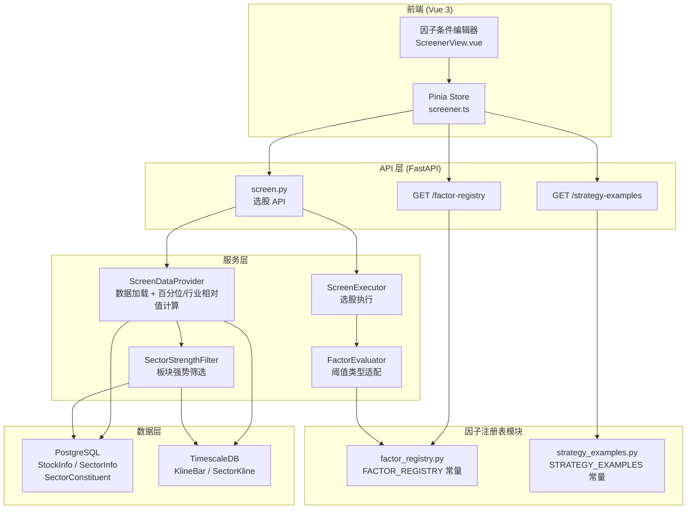
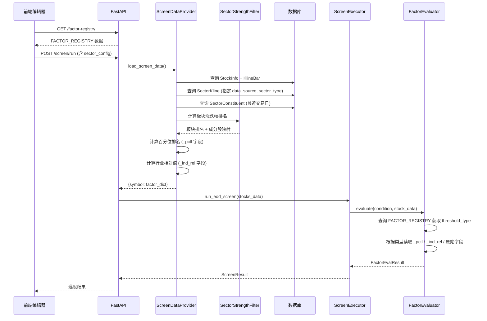

# 设计文档：智能选股因子条件编辑器优化

## 概述

本设计文档描述智能选股因子条件编辑器优化功能的技术实现方案。该功能涵盖三个核心改进方向：

1. **因子元数据注册表与阈值类型优化**：建立结构化的因子元数据注册表（FACTOR_REGISTRY），为每个因子定义合理的阈值类型（absolute / percentile / industry_relative / boolean / range），替代当前一刀切的绝对值阈值方式。
2. **百分位排名与行业相对值计算**：在 ScreenDataProvider 中新增百分位排名和行业相对值计算逻辑，使 FactorEvaluator 能够基于相对值进行跨市值、跨行业的公平比较。
3. **板块面指标多数据源接入**：重构 SectorStrengthFilter，使用已导入数据库的 SectorKline / SectorConstituent / SectorInfo 表数据，支持按数据来源（DC/TI/TDX）和板块类型（INDUSTRY/CONCEPT/REGION/STYLE）灵活筛选。

此外，新增实战策略示例库（STRATEGY_EXAMPLES）和对应的 API 端点，以及前端因子编辑器的 UI 增强。

### 设计原则

- **向后兼容**：旧版 StrategyConfig 和 FactorCondition 无需迁移即可正常运行，新字段均有合理默认值
- **最小侵入**：在现有模块上扩展，不改变已有 API 的请求/响应结构
- **数据驱动**：因子元数据集中定义为常量字典，前后端通过 API 同步，避免硬编码散落

## 架构

### 系统架构概览



### 数据流



## 组件与接口

### 1. 因子注册表模块 (`app/services/screener/factor_registry.py`)

新建模块，定义因子元数据的数据结构和注册表常量。

```python
# 新增文件: app/services/screener/factor_registry.py

from dataclasses import dataclass, field
from enum import Enum


class ThresholdType(str, Enum):
    """因子阈值类型"""
    ABSOLUTE = "absolute"                # 绝对值
    PERCENTILE = "percentile"            # 百分位排名 (0-100)
    INDUSTRY_RELATIVE = "industry_relative"  # 行业相对值
    Z_SCORE = "z_score"                  # 标准化分数
    BOOLEAN = "boolean"                  # 布尔型
    RANGE = "range"                      # 区间型


class FactorCategory(str, Enum):
    """因子类别"""
    TECHNICAL = "technical"
    MONEY_FLOW = "money_flow"
    FUNDAMENTAL = "fundamental"
    SECTOR = "sector"


@dataclass(frozen=True)
class FactorMeta:
    """因子元数据"""
    factor_name: str
    label: str                           # 中文标签
    category: FactorCategory
    threshold_type: ThresholdType
    default_threshold: float | None = None
    value_min: float | None = None
    value_max: float | None = None
    unit: str = ""
    description: str = ""
    examples: list[dict] = field(default_factory=list)
    # range 类型专用
    default_range: tuple[float, float] | None = None


FACTOR_REGISTRY: dict[str, FactorMeta] = { ... }  # 完整定义见下文
```

**接口说明**：
- `ThresholdType` 枚举：供 FactorEvaluator 和前端使用，决定比较逻辑
- `FactorMeta` 数据类：不可变（frozen），作为常量使用
- `FACTOR_REGISTRY` 字典：key 为 factor_name，value 为 FactorMeta 实例
- `get_factor_meta(factor_name) -> FactorMeta | None`：便捷查询函数
- `get_factors_by_category(category) -> list[FactorMeta]`：按类别筛选

### 2. 策略示例库模块 (`app/services/screener/strategy_examples.py`)

新建模块，定义实战策略示例常量。

```python
# 新增文件: app/services/screener/strategy_examples.py

@dataclass
class StrategyExample:
    """策略示例"""
    name: str
    description: str
    factors: list[dict]
    logic: str
    weights: dict[str, float]
    enabled_modules: list[str]
    sector_config: dict | None = None  # 板块筛选配置

STRATEGY_EXAMPLES: list[StrategyExample] = [ ... ]  # 12 个示例
```

### 3. ScreenDataProvider 增强

在现有 `app/services/screener/screen_data_provider.py` 中扩展：

**新增方法**：
- `_compute_percentile_ranks(stocks_data, factor_names) -> None`：就地计算百分位排名，写入 `{factor}_pctl` 字段
- `_compute_industry_relative_values(stocks_data, factor_names, industry_map) -> None`：就地计算行业相对值，写入 `{factor}_ind_rel` 字段
- `_load_sector_strength_data(sector_config) -> dict`：从 SectorKline + SectorConstituent 加载板块强势数据
- `_build_industry_map() -> dict[str, str]`：从 SectorConstituent 构建 symbol → 行业板块代码 映射

**修改方法**：
- `load_screen_data()`：在构建因子字典后，调用百分位排名和行业相对值计算；加载板块强势数据并写入 sector_rank / sector_trend 字段

### 4. SectorStrengthFilter (`app/services/screener/sector_strength.py`)

新建模块，封装板块强势筛选逻辑。

```python
# 新增文件: app/services/screener/sector_strength.py

@dataclass
class SectorRankResult:
    """板块排名结果"""
    sector_code: str
    sector_name: str
    rank: int
    change_pct: float
    is_bullish: bool

class SectorStrengthFilter:
    """板块强势筛选器"""

    async def compute_sector_ranks(
        self,
        ts_session: AsyncSession,
        pg_session: AsyncSession,
        data_source: str,
        sector_type: str,
        period: int = 5,
    ) -> list[SectorRankResult]:
        """计算板块涨跌幅排名"""
        ...

    async def map_stocks_to_sectors(
        self,
        pg_session: AsyncSession,
        data_source: str,
        sector_type: str,
        trade_date: date | None = None,
    ) -> dict[str, list[str]]:
        """构建 symbol → [sector_code] 映射"""
        ...

    def filter_by_sector_strength(
        self,
        stocks_data: dict[str, dict],
        sector_ranks: list[SectorRankResult],
        stock_sector_map: dict[str, list[str]],
        top_n: int = 30,
    ) -> None:
        """将板块排名和趋势信息写入 stock_data"""
        ...
```

### 5. FactorEvaluator 阈值类型适配

修改现有 `app/services/screener/strategy_engine.py` 中的 `FactorEvaluator.evaluate()` 方法：

```python
# 修改: FactorEvaluator.evaluate()

@classmethod
def evaluate(cls, condition, stock_data, weight=1.0):
    # 1. 查询 FACTOR_REGISTRY 获取 threshold_type
    meta = get_factor_meta(condition.factor_name)
    threshold_type = meta.threshold_type if meta else ThresholdType.ABSOLUTE

    # 2. 根据 threshold_type 确定读取字段
    if threshold_type == ThresholdType.PERCENTILE:
        field_name = f"{condition.factor_name}_pctl"
    elif threshold_type == ThresholdType.INDUSTRY_RELATIVE:
        field_name = f"{condition.factor_name}_ind_rel"
    else:
        field_name = condition.factor_name

    # 3. 支持 params 中的 threshold_type 覆盖（向后兼容）
    override_type = condition.params.get("threshold_type")
    if override_type:
        # 允许用户在 FactorCondition.params 中显式指定阈值类型
        ...

    # 4. range 类型特殊处理
    if threshold_type == ThresholdType.RANGE:
        low = condition.params.get("threshold_low")
        high = condition.params.get("threshold_high")
        passed = low <= value <= high
        ...

    # 5. boolean 类型保持现有逻辑
    # 6. absolute / percentile / industry_relative 使用标准比较运算符
```

### 6. StrategyConfig 扩展

修改现有 `app/core/schemas.py`：

```python
# 新增数据类
@dataclass
class SectorScreenConfig:
    """板块筛选配置"""
    sector_data_source: str = "DC"       # DC / TI / TDX
    sector_type: str = "CONCEPT"         # INDUSTRY / CONCEPT / REGION / STYLE
    sector_period: int = 5               # 涨幅计算周期（天）
    sector_top_n: int = 30               # 排名阈值

# 修改 StrategyConfig
@dataclass
class StrategyConfig:
    # ... 现有字段 ...
    sector_config: SectorScreenConfig = field(default_factory=SectorScreenConfig)
```

### 7. API 端点

在现有 `app/api/v1/screen.py` 中新增：

```python
@router.get("/screen/factor-registry")
async def get_factor_registry(category: str | None = None) -> dict:
    """返回因子元数据注册表"""
    ...

@router.get("/screen/strategy-examples")
async def get_strategy_examples() -> list[dict]:
    """返回策略示例库"""
    ...
```

### 8. 前端组件增强

修改 `frontend/src/views/ScreenerView.vue` 和 `frontend/src/stores/screener.ts`：

- **screener.ts**：新增 `factorRegistry`、`strategyExamples` 状态和对应的 fetch 方法
- **ScreenerView.vue**：
  - 因子行显示阈值类型标签（badge）
  - boolean 因子使用 toggle 控件
  - range 因子使用双输入框
  - 因子名称 hover 显示 tooltip（说明 + 示例）
  - 每个因子行增加"恢复默认"按钮
  - 板块面因子显示数据来源 / 板块类型 / 涨幅周期选择器
  - 新增"加载示例策略"按钮和策略示例选择对话框

## 数据模型

### 新增枚举类型

```python
# app/services/screener/factor_registry.py

class ThresholdType(str, Enum):
    ABSOLUTE = "absolute"
    PERCENTILE = "percentile"
    INDUSTRY_RELATIVE = "industry_relative"
    Z_SCORE = "z_score"
    BOOLEAN = "boolean"
    RANGE = "range"

class FactorCategory(str, Enum):
    TECHNICAL = "technical"
    MONEY_FLOW = "money_flow"
    FUNDAMENTAL = "fundamental"
    SECTOR = "sector"
```

### 新增数据类

```python
# app/services/screener/factor_registry.py

@dataclass(frozen=True)
class FactorMeta:
    factor_name: str           # 因子标识符，如 "ma_trend"
    label: str                 # 中文标签，如 "MA趋势打分"
    category: FactorCategory   # 所属类别
    threshold_type: ThresholdType  # 阈值类型
    default_threshold: float | None = None  # 默认阈值
    value_min: float | None = None          # 取值范围下限
    value_max: float | None = None          # 取值范围上限
    unit: str = ""                          # 单位
    description: str = ""                   # 说明文本
    examples: list[dict] = field(default_factory=list)  # 配置示例
    default_range: tuple[float, float] | None = None    # range 类型默认区间
```

```python
# app/core/schemas.py

@dataclass
class SectorScreenConfig:
    sector_data_source: str = "DC"
    sector_type: str = "CONCEPT"
    sector_period: int = 5
    sector_top_n: int = 30

    def to_dict(self) -> dict: ...
    @classmethod
    def from_dict(cls, data: dict) -> "SectorScreenConfig": ...
```

### StrategyConfig 扩展

```python
# app/core/schemas.py — StrategyConfig 新增字段

@dataclass
class StrategyConfig:
    factors: list[FactorCondition] = ...
    logic: Literal["AND", "OR"] = "AND"
    weights: dict[str, float] = ...
    ma_periods: list[int] = ...
    indicator_params: IndicatorParamsConfig = ...
    ma_trend: MaTrendConfig = ...
    breakout: BreakoutConfig = ...
    volume_price: VolumePriceConfig = ...
    sector_config: SectorScreenConfig = field(default_factory=SectorScreenConfig)  # 新增
```

### FactorCondition.params 扩展

`FactorCondition.params` 字典新增可选字段：

| 字段 | 类型 | 说明 |
|------|------|------|
| `threshold_type` | `str` | 覆盖 FACTOR_REGISTRY 中的阈值类型（向后兼容） |
| `threshold_low` | `float` | range 类型的下限值 |
| `threshold_high` | `float` | range 类型的上限值 |
| `sector_data_source` | `str` | 板块因子专用：数据来源覆盖 |
| `sector_type` | `str` | 板块因子专用：板块类型覆盖 |
| `sector_period` | `int` | 板块因子专用：涨幅计算周期覆盖 |

### 因子字典扩展字段

ScreenDataProvider 构建的 `factor_dict` 新增以下字段：

| 字段 | 类型 | 说明 |
|------|------|------|
| `money_flow_pctl` | `float \| None` | 主力资金净流入百分位排名 (0-100) |
| `volume_price_pctl` | `float \| None` | 日均成交额百分位排名 (0-100) |
| `pe_ind_rel` | `float \| None` | 市盈率行业相对值 |
| `pb_ind_rel` | `float \| None` | 市净率行业相对值 |
| `roe_pctl` | `float \| None` | ROE 百分位排名 (0-100) |
| `profit_growth_pctl` | `float \| None` | 利润增长率百分位排名 (0-100) |
| `market_cap_pctl` | `float \| None` | 总市值百分位排名 (0-100) |
| `revenue_growth_pctl` | `float \| None` | 营收增长率百分位排名 (0-100) |
| `sector_rank` | `int \| None` | 所属板块涨幅排名 |
| `sector_trend` | `bool` | 所属板块是否多头趋势 |
| `sector_name` | `str \| None` | 所属板块名称 |

### FACTOR_REGISTRY 完整定义

```python
FACTOR_REGISTRY: dict[str, FactorMeta] = {
    # ── 技术面 ──
    "ma_trend": FactorMeta(
        factor_name="ma_trend", label="MA趋势打分", category=FactorCategory.TECHNICAL,
        threshold_type=ThresholdType.ABSOLUTE, default_threshold=80,
        value_min=0, value_max=100, unit="分",
        description="基于均线排列程度、斜率和价格距离的综合打分，≥80 表示强势多头趋势",
        examples=[{"operator": ">=", "threshold": 80, "说明": "筛选趋势强度 ≥ 80 的强势股"}],
    ),
    "ma_support": FactorMeta(
        factor_name="ma_support", label="均线支撑信号", category=FactorCategory.TECHNICAL,
        threshold_type=ThresholdType.BOOLEAN, default_threshold=None,
        description="价格回调至 20/60 日均线附近后企稳反弹的信号",
    ),
    "macd": FactorMeta(
        factor_name="macd", label="MACD金叉信号", category=FactorCategory.TECHNICAL,
        threshold_type=ThresholdType.BOOLEAN, default_threshold=None,
        description="DIF/DEA 零轴上方金叉 + 红柱放大 + DEA 向上的多头信号",
    ),
    "boll": FactorMeta(
        factor_name="boll", label="布林带突破信号", category=FactorCategory.TECHNICAL,
        threshold_type=ThresholdType.BOOLEAN, default_threshold=None,
        description="股价站稳中轨、触碰上轨且布林带开口向上的突破信号",
    ),
    "rsi": FactorMeta(
        factor_name="rsi", label="RSI强势信号", category=FactorCategory.TECHNICAL,
        threshold_type=ThresholdType.RANGE, default_range=(50, 80),
        value_min=0, value_max=100,
        description="RSI 处于强势区间且无超买背离，50-80 为适中强势区间",
    ),
    "dma": FactorMeta(
        factor_name="dma", label="DMA平行线差", category=FactorCategory.TECHNICAL,
        threshold_type=ThresholdType.BOOLEAN, default_threshold=None,
        description="DMA 线在 AMA 线上方，表示短期均线强于长期均线",
    ),
    "breakout": FactorMeta(
        factor_name="breakout", label="形态突破", category=FactorCategory.TECHNICAL,
        threshold_type=ThresholdType.BOOLEAN, default_threshold=None,
        description="箱体突破/前期高点突破/下降趋势线突破，需量价确认（量比 ≥ 1.5 倍）",
    ),

    # ── 资金面 ──
    "turnover": FactorMeta(
        factor_name="turnover", label="换手率", category=FactorCategory.MONEY_FLOW,
        threshold_type=ThresholdType.RANGE, default_range=(3.0, 15.0),
        value_min=0, value_max=100, unit="%",
        description="换手率反映交易活跃度，3%-15% 为适中活跃区间",
    ),
    "money_flow": FactorMeta(
        factor_name="money_flow", label="主力资金净流入", category=FactorCategory.MONEY_FLOW,
        threshold_type=ThresholdType.PERCENTILE, default_threshold=80,
        value_min=0, value_max=100,
        description="主力资金净流入的全市场百分位排名。百分位排名可跨市值公平比较",
    ),
    "large_order": FactorMeta(
        factor_name="large_order", label="大单成交占比", category=FactorCategory.MONEY_FLOW,
        threshold_type=ThresholdType.ABSOLUTE, default_threshold=30,
        value_min=0, value_max=100, unit="%",
        description="大单成交额占总成交额的比例，>30% 表示主力资金活跃",
    ),
    "volume_price": FactorMeta(
        factor_name="volume_price", label="日均成交额", category=FactorCategory.MONEY_FLOW,
        threshold_type=ThresholdType.PERCENTILE, default_threshold=70,
        value_min=0, value_max=100,
        description="近 20 日日均成交额的全市场百分位排名",
    ),

    # ── 基本面 ──
    "pe": FactorMeta(
        factor_name="pe", label="市盈率 TTM", category=FactorCategory.FUNDAMENTAL,
        threshold_type=ThresholdType.INDUSTRY_RELATIVE, default_threshold=1.0,
        value_min=0, value_max=5.0,
        description="市盈率的行业相对值（当前 PE / 行业中位数 PE）",
    ),
    "pb": FactorMeta(
        factor_name="pb", label="市净率", category=FactorCategory.FUNDAMENTAL,
        threshold_type=ThresholdType.INDUSTRY_RELATIVE, default_threshold=1.0,
        value_min=0, value_max=5.0,
        description="市净率的行业相对值（当前 PB / 行业中位数 PB）",
    ),
    "roe": FactorMeta(
        factor_name="roe", label="净资产收益率", category=FactorCategory.FUNDAMENTAL,
        threshold_type=ThresholdType.PERCENTILE, default_threshold=70,
        value_min=0, value_max=100,
        description="ROE 的全市场百分位排名",
    ),
    "profit_growth": FactorMeta(
        factor_name="profit_growth", label="利润增长率", category=FactorCategory.FUNDAMENTAL,
        threshold_type=ThresholdType.PERCENTILE, default_threshold=70,
        value_min=0, value_max=100,
        description="净利润同比增长率的全市场百分位排名",
    ),
    "market_cap": FactorMeta(
        factor_name="market_cap", label="总市值", category=FactorCategory.FUNDAMENTAL,
        threshold_type=ThresholdType.PERCENTILE, default_threshold=30,
        value_min=0, value_max=100,
        description="总市值的全市场百分位排名",
    ),
    "revenue_growth": FactorMeta(
        factor_name="revenue_growth", label="营收增长率", category=FactorCategory.FUNDAMENTAL,
        threshold_type=ThresholdType.PERCENTILE, default_threshold=70,
        value_min=0, value_max=100,
        description="营业收入同比增长率的全市场百分位排名",
    ),

    # ── 板块面 ──
    "sector_rank": FactorMeta(
        factor_name="sector_rank", label="板块涨幅排名", category=FactorCategory.SECTOR,
        threshold_type=ThresholdType.ABSOLUTE, default_threshold=30,
        value_min=1, value_max=300,
        description="股票所属板块在全市场板块涨幅排名中的位次，≤30 表示处于强势板块前 30 名",
        examples=[{"operator": "<=", "threshold": 30, "说明": "筛选板块涨幅排名前 30 的个股",
                   "数据来源": "DC/TI/TDX 可选", "板块类型": "INDUSTRY/CONCEPT/REGION/STYLE 可选"}],
    ),
    "sector_trend": FactorMeta(
        factor_name="sector_trend", label="板块趋势", category=FactorCategory.SECTOR,
        threshold_type=ThresholdType.BOOLEAN, default_threshold=None,
        description="股票所属板块是否处于多头趋势（板块指数短期均线在长期均线上方）",
        examples=[{"说明": "筛选处于多头趋势板块中的个股",
                   "数据来源": "DC/TI/TDX 可选", "板块类型": "INDUSTRY/CONCEPT/REGION/STYLE 可选"}],
    ),
}
```

### 已有数据库模型（无需新增表）

本功能使用已有的数据库表，不需要新增数据库迁移：

| 模型 | 数据库 | 用途 |
|------|--------|------|
| `SectorKline` | TimescaleDB | 板块指数日K线，用于计算板块涨跌幅排名 |
| `SectorConstituent` | PostgreSQL | 板块成分股快照，用于 symbol → 板块映射 |
| `SectorInfo` | PostgreSQL | 板块元数据，用于获取板块名称和类型 |
| `StockInfo` | PostgreSQL | 股票基本面数据（PE/PB/ROE/市值） |

### 9. SectorStrengthFilter change_pct 缺失 fallback（需求 15）

#### 背景

`SectorStrengthFilter._aggregate_change_pct()` 当前通过累加 `SectorKline.change_pct` 计算板块累计涨跌幅。但 TDX 数据源的 change_pct 字段 91.5%-100% 为 NULL，导致所有板块累计涨跌幅为 0.0，排名失去意义。

#### 设计方案

修改 `_aggregate_change_pct()` 静态方法，增加收盘价 fallback 逻辑：

```python
# 修改: app/services/screener/sector_strength.py

@staticmethod
def _aggregate_change_pct(
    kline_data: dict[str, list[SectorKline]],
) -> dict[str, float]:
    """
    计算每个板块的累计涨跌幅。

    优先使用 change_pct 字段累加。当某板块所有 K 线的 change_pct 均为 NULL 时，
    使用收盘价序列 fallback：(最新收盘价 - 最早收盘价) / 最早收盘价 × 100。

    对应需求：
    - 需求 15.1：change_pct 全 NULL 时使用收盘价 fallback
    - 需求 15.2：有效收盘价 < 2 时设为 0.0
    - 需求 15.3：优先使用 change_pct（有效记录 > 0 时）
    - 需求 15.4：返回 float 类型
    """
    result: dict[str, float] = {}
    for code, klines in kline_data.items():
        # 收集有效的 change_pct 值
        valid_pcts = [
            float(k.change_pct)
            for k in klines
            if k.change_pct is not None
        ]

        if valid_pcts:
            # 优先路径：有有效 change_pct，直接累加
            result[code] = sum(valid_pcts)
        else:
            # Fallback 路径：所有 change_pct 为 NULL，使用收盘价计算
            valid_closes = [
                float(k.close)
                for k in klines
                if k.close is not None
            ]
            if len(valid_closes) >= 2:
                earliest = valid_closes[0]   # klines 按时间升序
                latest = valid_closes[-1]
                if earliest != 0.0:
                    result[code] = (latest - earliest) / earliest * 100
                else:
                    result[code] = 0.0
            else:
                result[code] = 0.0

    return result
```

#### 关键设计决策

1. **优先级**：当有效 change_pct 记录数 > 0 时使用 change_pct 累加，仅在全部为 NULL 时才 fallback。这确保 DC/TI 等数据源行为不变。
2. **收盘价顺序**：klines 列表已按时间升序排列（由 `_load_sector_klines` 保证），因此 `valid_closes[0]` 为最早收盘价，`valid_closes[-1]` 为最新收盘价。
3. **除零保护**：当最早收盘价为 0.0 时，设涨跌幅为 0.0。
4. **最少数据要求**：有效收盘价少于 2 个时无法计算涨跌幅，设为 0.0。
5. **返回类型一致**：两条路径均返回 `float`，后续排名逻辑无需修改。

### 10. 板块数据源覆盖率 API 与前端提示（需求 16）

#### 后端：GET /api/v1/sector/coverage 端点

在 `app/api/v1/sector.py` 中新增端点，查询每个数据源的板块数量和成分股覆盖统计。

```python
# 新增: app/api/v1/sector.py

class CoverageSourceStats(BaseModel):
    """单个数据源的覆盖率统计"""
    data_source: str                    # "DC" / "TI" / "TDX"
    total_sectors: int                  # 该数据源的板块总数
    sectors_with_constituents: int      # 有成分股数据的板块数
    total_stocks: int                   # 成分股覆盖的不同股票数
    coverage_ratio: float               # sectors_with_constituents / total_sectors

class CoverageResponse(BaseModel):
    """覆盖率响应"""
    sources: list[CoverageSourceStats]

@router.get("/sector/coverage", response_model=CoverageResponse)
async def get_sector_coverage(
    pg_session: AsyncSession = Depends(get_pg_session),
) -> CoverageResponse:
    """
    返回每个数据源的板块数量和成分股覆盖数量统计。

    对应需求 16.2。
    """
    sources = []
    for ds in ["DC", "TI", "TDX"]:
        # 查询该数据源的板块总数
        total_stmt = (
            select(func.count())
            .select_from(SectorInfo)
            .where(SectorInfo.data_source == ds)
        )
        total_sectors = (await pg_session.execute(total_stmt)).scalar() or 0

        # 查询有成分股数据的板块数（最新交易日）
        latest_date_stmt = (
            select(func.max(SectorConstituent.trade_date))
            .where(SectorConstituent.data_source == ds)
        )
        latest_date = (await pg_session.execute(latest_date_stmt)).scalar()

        if latest_date:
            sectors_with_stmt = (
                select(func.count(func.distinct(SectorConstituent.sector_code)))
                .where(
                    SectorConstituent.data_source == ds,
                    SectorConstituent.trade_date == latest_date,
                )
            )
            sectors_with = (await pg_session.execute(sectors_with_stmt)).scalar() or 0

            stocks_stmt = (
                select(func.count(func.distinct(SectorConstituent.symbol)))
                .where(
                    SectorConstituent.data_source == ds,
                    SectorConstituent.trade_date == latest_date,
                )
            )
            total_stocks = (await pg_session.execute(stocks_stmt)).scalar() or 0
        else:
            sectors_with = 0
            total_stocks = 0

        coverage_ratio = (
            sectors_with / total_sectors if total_sectors > 0 else 0.0
        )

        sources.append(CoverageSourceStats(
            data_source=ds,
            total_sectors=total_sectors,
            sectors_with_constituents=sectors_with,
            total_stocks=total_stocks,
            coverage_ratio=round(coverage_ratio, 4),
        ))

    return CoverageResponse(sources=sources)
```

#### 前端：数据源选择器覆盖率提示

修改 `frontend/src/stores/screener.ts` 和 `frontend/src/views/ScreenerView.vue`：

**screener.ts 新增**：

```typescript
// 新增接口
export interface CoverageSourceStats {
  data_source: string
  total_sectors: number
  sectors_with_constituents: number
  total_stocks: number
  coverage_ratio: number
}

// store 中新增
const sectorCoverage = ref<CoverageSourceStats[]>([])

async function fetchSectorCoverage() {
  const res = await apiClient.get<{ sources: CoverageSourceStats[] }>(
    '/sector/coverage'
  )
  sectorCoverage.value = res.data.sources
}
```

**ScreenerView.vue 修改**：

1. 数据源下拉选择器中，每个选项显示覆盖率摘要：
   - `东方财富 DC（1030 板块 / 5882 股票）`
   - `通达信 TDX（615 板块 / 7122 股票）`
   - `同花顺 TI（90 板块 / 5755 股票）⚠️`

2. 当用户选择 coverage_ratio < 0.5 的数据源时，显示警告：
   ```
   ⚠️ 该数据源成分股数据不完整（仅 90/1724 板块有成分股数据），
   可能影响板块筛选效果，建议使用东方财富（DC）或通达信（TDX）
   ```

3. 组件挂载时调用 `fetchSectorCoverage()` 获取最新覆盖率数据。


## 正确性属性

*属性（Property）是指在系统所有有效执行中都应成立的特征或行为——本质上是对系统应做什么的形式化陈述。属性是人类可读规格说明与机器可验证正确性保证之间的桥梁。*

### Property 1: FACTOR_REGISTRY 结构完整性

*For any* factor entry in FACTOR_REGISTRY, the entry SHALL have all required metadata fields (factor_name, label, category, threshold_type, description) with valid types, and threshold_type SHALL be a valid ThresholdType enum member.

**Validates: Requirements 1.2, 1.3**

### Property 2: 百分位排名不变量

*For any* non-empty set of stock factor values (with None values excluded), the computed percentile ranks SHALL satisfy:
1. All rank values are in the closed interval [0, 100]
2. None-valued stocks receive no percentile rank
3. The stock with the maximum raw value receives the highest percentile rank
4. The stock with the minimum raw value receives the lowest percentile rank
5. Monotonicity: if stock A's raw value > stock B's raw value, then A's percentile ≥ B's percentile

**Validates: Requirements 3.3, 3.6, 9.1, 9.2, 9.3, 9.6**

### Property 3: 行业相对值计算正确性

*For any* set of stocks grouped by industry with positive factor values, the industry relative value SHALL equal (stock_value / industry_median), and a stock whose factor value equals the industry median SHALL have an industry relative value of 1.0.

**Validates: Requirements 4.7, 10.1, 10.3**

### Property 4: FactorEvaluator 阈值类型字段解析

*For any* FactorCondition and stock_data dictionary, the FactorEvaluator SHALL read the comparison value from:
- `{factor_name}_pctl` when threshold_type is PERCENTILE
- `{factor_name}_ind_rel` when threshold_type is INDUSTRY_RELATIVE
- `{factor_name}` when threshold_type is ABSOLUTE or BOOLEAN

and the evaluation result SHALL be consistent with the comparison operator applied to the resolved field value and the threshold.

**Validates: Requirements 9.5, 10.5, 12.1, 12.2, 12.3, 12.4**

### Property 5: Range 类型区间评估

*For any* numeric value and range bounds [low, high], the FactorEvaluator SHALL evaluate a RANGE-type factor condition as passed if and only if low ≤ value ≤ high.

**Validates: Requirements 12.5**

### Property 6: 板块涨跌幅排名有序性

*For any* set of sector kline data with cumulative change percentages, the computed sector ranks SHALL be in descending order of cumulative change (rank 1 = highest change), and for any stock appearing in a sector's constituent list, the stock-to-sector mapping SHALL include that sector.

**Validates: Requirements 5.4, 5.5**

### Property 7: StrategyConfig 序列化往返

*For any* valid StrategyConfig instance (including the new sector_config field), calling `to_dict()` then `from_dict()` SHALL produce a StrategyConfig with equivalent field values.

**Validates: Requirements 5.1, 13.3, 13.4**

### Property 8: 向后兼容默认值

*For any* legacy config dictionary that does not contain threshold_type in FactorCondition.params or sector_config in StrategyConfig, deserialization SHALL produce a valid object with threshold_type defaulting to ABSOLUTE and sector_config defaulting to SectorScreenConfig(sector_data_source="DC", sector_type="CONCEPT", sector_period=5, sector_top_n=30).

**Validates: Requirements 13.1, 13.2**

### Property 9: 策略示例一致性

*For any* strategy example in STRATEGY_EXAMPLES, the example SHALL contain all required fields (name, description, factors, logic, weights, enabled_modules), and every factor_name referenced in the example's factors list SHALL exist in FACTOR_REGISTRY with a compatible threshold value within the factor's defined value range.

**Validates: Requirements 14.5, 14.8**

### Property 10: change_pct fallback 正确性

*For any* sector kline dataset where each sector has a list of kline records (each with optional change_pct and optional close price):
1. If a sector has at least one non-NULL change_pct, the aggregated result SHALL equal the sum of all non-NULL change_pct values (fallback NOT used)
2. If a sector has ALL change_pct as NULL and at least 2 valid close prices, the aggregated result SHALL equal `(latest_close - earliest_close) / earliest_close × 100`
3. If a sector has ALL change_pct as NULL and fewer than 2 valid close prices, the aggregated result SHALL be 0.0
4. The return type SHALL always be float

**Validates: Requirements 15.1, 15.2, 15.3, 15.4**

## 错误处理

### 板块数据不可用

| 场景 | 处理方式 |
|------|----------|
| 指定数据来源的 SectorKline 数据为空 | 记录 WARNING 日志，跳过板块强势筛选，sector_rank 和 sector_trend 设为 None |
| SectorConstituent 查询失败 | 记录 WARNING 日志，跳过板块成分映射，不阻塞其他因子评估 |
| 数据库连接异常 | 捕获 SQLAlchemy 异常，记录 ERROR 日志，返回空板块数据 |

### 百分位排名计算

| 场景 | 处理方式 |
|------|----------|
| 某因子全市场所有股票值均为 None | 跳过该因子的百分位计算，_pctl 字段设为 None |
| 仅有 1 只有效股票 | 该股票百分位设为 100（唯一有效值即为最高排名） |
| 因子值包含负数（如利润增长率为负） | 正常参与排名，负值排名靠后 |

### 行业相对值计算

| 场景 | 处理方式 |
|------|----------|
| 股票未找到所属行业板块 | _ind_rel 字段设为 None，FactorEvaluator 将该因子视为不通过 |
| 行业中位数为零 | _ind_rel 字段设为 None，避免除零错误 |
| 行业内仅有 1 只有效股票 | 该股票的行业相对值为 1.0（自身即为中位数） |

### FactorEvaluator 容错

| 场景 | 处理方式 |
|------|----------|
| factor_name 不在 FACTOR_REGISTRY 中 | 回退到 ABSOLUTE 阈值类型（向后兼容） |
| _pctl 或 _ind_rel 字段在 stock_data 中不存在 | 因子评估结果设为不通过（passed=False） |
| range 类型缺少 threshold_low 或 threshold_high | 因子评估结果设为不通过 |

### API 端点

| 场景 | 处理方式 |
|------|----------|
| GET /factor-registry 的 category 参数无效 | 返回空列表（不报错，宽容处理） |
| GET /strategy-examples 无数据 | 返回空列表 |

### change_pct fallback（需求 15）

| 场景 | 处理方式 |
|------|----------|
| 板块所有 change_pct 为 NULL，有 ≥2 个有效收盘价 | 使用收盘价 fallback 计算涨跌幅 |
| 板块所有 change_pct 为 NULL，有效收盘价 < 2 | 涨跌幅设为 0.0 |
| 板块所有 change_pct 为 NULL，最早收盘价为 0.0 | 涨跌幅设为 0.0（除零保护） |
| 板块有部分 change_pct 非 NULL | 使用 change_pct 累加（不触发 fallback） |

### 板块覆盖率 API（需求 16）

| 场景 | 处理方式 |
|------|----------|
| 某数据源无 SectorInfo 记录 | total_sectors = 0，coverage_ratio = 0.0 |
| 某数据源无 SectorConstituent 记录 | sectors_with_constituents = 0，total_stocks = 0 |
| 数据库查询异常 | 捕获异常，记录 ERROR 日志，返回空 sources 列表 |

## 测试策略

### 双重测试方法

本功能采用单元测试 + 属性测试的双重测试策略：

- **属性测试（Property-Based Testing）**：使用 Hypothesis 库验证上述 10 个正确性属性，每个属性至少运行 100 次迭代
- **单元测试（Example-Based Testing）**：验证具体的因子元数据定义、API 响应格式、边界条件和错误处理

### 后端属性测试（Hypothesis）

测试文件：`tests/properties/test_factor_editor_properties.py`

| 属性 | 测试描述 | 生成器 |
|------|----------|--------|
| Property 1 | FACTOR_REGISTRY 结构完整性 | 遍历 FACTOR_REGISTRY 所有条目 |
| Property 2 | 百分位排名不变量 | `st.lists(st.floats(min_value=-1e6, max_value=1e6) \| st.none())` |
| Property 3 | 行业相对值计算 | `st.dictionaries(st.text(), st.lists(st.floats(min_value=0.01, max_value=1e6)))` |
| Property 4 | FactorEvaluator 字段解析 | `st.sampled_from(ThresholdType)` + `st.floats()` |
| Property 5 | Range 区间评估 | `st.floats()` + `st.tuples(st.floats(), st.floats())` |
| Property 6 | 板块排名有序性 | `st.lists(st.tuples(st.text(), st.floats()))` |
| Property 7 | StrategyConfig 往返 | 自定义 StrategyConfig 生成器 |
| Property 8 | 向后兼容默认值 | `st.dictionaries()` 生成旧格式配置 |
| Property 9 | 策略示例一致性 | 遍历 STRATEGY_EXAMPLES |
| Property 10 | change_pct fallback 正确性 | `st.lists(st.tuples(st.floats() \| st.none(), st.floats() \| st.none()))` 生成 kline 数据 |

每个属性测试标注格式：
```python
# Feature: factor-editor-optimization, Property 2: 百分位排名不变量
@given(values=st.lists(st.floats(...) | st.none(), min_size=1, max_size=500))
@settings(max_examples=100)
def test_percentile_ranking_invariants(values):
    ...
```

### 后端单元测试

测试文件：`tests/services/test_factor_registry.py`

| 测试 | 描述 |
|------|------|
| `test_ma_trend_metadata` | 验证 ma_trend 因子元数据定义（需求 2.1） |
| `test_boolean_factors_metadata` | 验证所有 boolean 类型因子（需求 2.2-2.4, 2.6-2.7） |
| `test_rsi_range_metadata` | 验证 rsi range 类型定义（需求 2.5） |
| `test_money_flow_percentile_metadata` | 验证 money_flow percentile 定义（需求 3.2） |
| `test_pe_industry_relative_metadata` | 验证 pe industry_relative 定义（需求 4.1） |
| `test_sector_rank_metadata` | 验证 sector_rank 定义（需求 6.1） |
| `test_strategy_examples_count` | 验证至少 12 个策略示例（需求 14.1） |
| `test_strategy_examples_structure` | 验证每个示例的字段完整性（需求 14.5） |

测试文件：`tests/services/test_screen_data_provider_enhanced.py`

| 测试 | 描述 |
|------|------|
| `test_percentile_with_all_none` | 全 None 值时百分位计算（边界） |
| `test_percentile_single_stock` | 仅 1 只有效股票时百分位（边界） |
| `test_industry_relative_missing_industry` | 股票无行业归属时（边界） |
| `test_industry_relative_zero_median` | 行业中位数为零时（边界） |
| `test_sector_data_unavailable` | 板块数据不可用时的降级处理（需求 5.6） |

测试文件：`tests/services/test_sector_strength_fallback.py`

| 测试 | 描述 |
|------|------|
| `test_aggregate_change_pct_all_null_uses_close_fallback` | 所有 change_pct 为 NULL 时使用收盘价 fallback（需求 15.1） |
| `test_aggregate_change_pct_partial_null_uses_pct` | 部分 change_pct 非 NULL 时使用 change_pct 累加（需求 15.3） |
| `test_aggregate_change_pct_fallback_less_than_2_closes` | 有效收盘价 < 2 时设为 0.0（需求 15.2） |
| `test_aggregate_change_pct_fallback_zero_earliest_close` | 最早收盘价为 0.0 时设为 0.0（除零保护） |
| `test_aggregate_change_pct_fallback_all_close_null` | 所有 close 也为 NULL 时设为 0.0 |
| `test_aggregate_change_pct_returns_float` | 返回类型始终为 float（需求 15.4） |

测试文件：`tests/api/test_sector_coverage.py`

| 测试 | 描述 |
|------|------|
| `test_sector_coverage_endpoint_returns_all_sources` | 验证返回 DC/TI/TDX 三个数据源的统计（需求 16.2） |
| `test_sector_coverage_response_structure` | 验证响应包含 total_sectors、sectors_with_constituents、total_stocks、coverage_ratio 字段 |
| `test_sector_coverage_empty_source` | 某数据源无数据时返回零值 |

测试文件：`tests/services/test_factor_evaluator_enhanced.py`

| 测试 | 描述 |
|------|------|
| `test_evaluate_percentile_factor` | percentile 类型因子评估 |
| `test_evaluate_industry_relative_factor` | industry_relative 类型因子评估 |
| `test_evaluate_range_factor` | range 类型因子评估 |
| `test_evaluate_boolean_factor` | boolean 类型因子评估 |
| `test_evaluate_missing_pctl_field` | _pctl 字段缺失时的处理 |
| `test_evaluate_legacy_factor_condition` | 旧版因子条件向后兼容 |

### 前端属性测试（fast-check）

测试文件：`frontend/src/views/__tests__/ScreenerView.property.test.ts`

| 属性 | 测试描述 |
|------|----------|
| Property 7 (前端) | StrategyConfig JSON 序列化/反序列化往返 |
| Property 9 (前端) | 策略示例加载后 config 字段完整性 |

### 前端单元测试

测试文件：`frontend/src/views/__tests__/ScreenerView.test.ts`

| 测试 | 描述 |
|------|------|
| `test_factor_registry_api_integration` | 验证 factor-registry API 调用和数据绑定 |
| `test_boolean_factor_toggle_rendering` | boolean 因子显示 toggle 控件 |
| `test_range_factor_dual_input` | range 因子显示双输入框 |
| `test_factor_tooltip_display` | 因子名称 hover 显示 tooltip |
| `test_reset_default_button` | 恢复默认按钮功能 |
| `test_sector_selector_rendering` | 板块数据来源/类型选择器渲染 |
| `test_strategy_example_loader` | 策略示例加载功能 |
| `test_sector_coverage_display` | 数据源下拉显示覆盖率信息（需求 16.1） |
| `test_sector_low_coverage_warning` | 选择低覆盖率数据源时显示警告（需求 16.3） |

### 测试配置

- 后端属性测试：Hypothesis，每个属性最少 100 次迭代
- 前端属性测试：fast-check，每个属性最少 100 次迭代
- 属性测试标注格式：`Feature: factor-editor-optimization, Property {number}: {property_text}`
- Property 10 测试标注：`Feature: factor-editor-optimization, Property 10: change_pct fallback 正确性`
