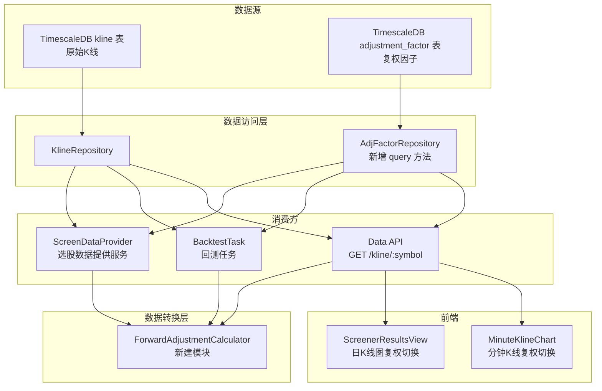
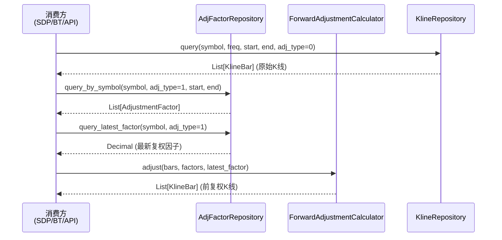

# 设计文档：前复权K线数据

## 概述

本功能在数据加载层引入前复权因子实时计算能力，核心目标是让选股引擎、回测引擎和前端K线图都能使用价格连续的前复权K线数据。

设计遵循以下原则：
- **单一职责**：新增独立的 `ForwardAdjustmentCalculator` 模块，作为纯数据转换层，不依赖数据库或网络
- **复用优先**：ScreenDataProvider 和 BacktestTask 共享同一个计算器，保证前复权结果一致
- **向后兼容**：API 默认返回原始K线（adj_type=0），前端默认展示原始K线
- **精度保证**：所有价格计算使用 `Decimal` 类型，避免浮点误差

### 变更范围

| 层级 | 模块 | 变更类型 |
|------|------|----------|
| 数据访问层 | `AdjFactorRepository` | 新增查询方法 |
| 数据转换层 | `ForwardAdjustmentCalculator`（新建） | 新建模块 |
| 选股服务层 | `ScreenDataProvider` | 集成前复权 |
| API 层 | `data.py` GET /kline/{symbol} | 支持 adj_type 参数 |
| 前端组件 | `MinuteKlineChart.vue` + `minuteKlineUtils.ts` | 复权切换 UI |
| 前端页面 | `ScreenerResultsView.vue` | 日K线图复权切换 |
| 回测任务层 | `backtest.py` | 集成前复权 |

## 架构

### 数据流



### 前复权计算流程



## 组件与接口

### 1. AdjFactorRepository 查询方法扩展

在现有 `app/services/data_engine/adj_factor_repository.py` 中新增三个异步查询方法：

```python
class AdjFactorRepository:
    # 现有 bulk_insert 方法保持不变

    async def query_by_symbol(
        self,
        symbol: str,
        adj_type: int = 1,
        start: date | None = None,
        end: date | None = None,
    ) -> list[AdjustmentFactor]:
        """查询指定股票在日期范围内的复权因子，按 trade_date 升序。"""

    async def query_latest_factor(
        self,
        symbol: str,
        adj_type: int = 1,
    ) -> Decimal | None:
        """查询指定股票最新交易日的复权因子值。返回 None 表示无数据。"""

    async def query_batch(
        self,
        symbols: list[str],
        adj_type: int = 1,
        start: date | None = None,
        end: date | None = None,
    ) -> dict[str, list[AdjustmentFactor]]:
        """批量查询多只股票的复权因子，返回 {symbol: [factors]} 字典。
        单次 SQL 查询，减少数据库往返。"""
```

### 2. ForwardAdjustmentCalculator（新建模块）

新建 `app/services/data_engine/forward_adjustment.py`，纯函数式设计，不依赖数据库：

```python
from decimal import Decimal
from datetime import date
from app.models.kline import KlineBar
from app.models.adjustment_factor import AdjustmentFactor

def adjust_kline_bars(
    bars: list[KlineBar],
    factors: list[AdjustmentFactor],
    latest_factor: Decimal,
) -> list[KlineBar]:
    """
    将原始K线数据转换为前复权K线数据。

    算法：
    1. 构建 {trade_date: adj_factor} 查找表
    2. 对每根K线，查找对应日期的复权因子（找不到则用最近前一日的因子）
    3. 计算 ratio = daily_factor / latest_factor
    4. adjusted_price = raw_price * ratio，四舍五入保留两位小数
    5. 仅调整 OHLC，volume/amount 保持不变

    边界处理：
    - factors 为空或 latest_factor 为 0 → 返回原始 bars 不做调整
    - 某日期无对应因子 → 使用该日期之前最近的因子

    Args:
        bars: 原始K线列表（按时间升序）
        factors: 复权因子列表（按 trade_date 升序）
        latest_factor: 最新复权因子值

    Returns:
        前复权K线列表（新对象，不修改原始数据）
    """

def _find_factor_for_date(
    target_date: date,
    factor_map: dict[date, Decimal],
    sorted_dates: list[date],
) -> Decimal | None:
    """
    查找目标日期对应的复权因子。
    精确匹配优先，找不到则使用 bisect 定位最近的前一个交易日因子。
    """
```

**设计决策**：
- 使用纯函数而非类，因为计算过程无状态
- 返回新的 `KlineBar` 对象而非原地修改，避免副作用
- 使用 `Decimal` 进行所有价格运算，保证精度
- `bisect` 查找最近前一日因子，时间复杂度 O(log n)

### 3. ScreenDataProvider 集成

在 `load_screen_data` 方法中，K线查询后、因子计算前插入前复权步骤：

```python
class ScreenDataProvider:
    async def load_screen_data(self, lookback_days, screen_date):
        # ... 现有逻辑 ...

        # 新增：批量查询所有股票的前复权因子
        adj_repo = AdjFactorRepository(self._ts_session)
        all_symbols = [s.symbol for s in stocks]
        batch_factors = await adj_repo.query_batch(
            symbols=all_symbols, adj_type=1,
            start=start_date, end=screen_date,
        )

        for stock in stocks:
            bars = await kline_repo.query(...)
            if not bars:
                continue

            # 新增：前复权处理
            factors = batch_factors.get(stock.symbol, [])
            if factors:
                latest = factors[-1].adj_factor  # 因子按日期升序，最后一个即最新
                bars = adjust_kline_bars(bars, factors, latest)

            factor_dict = self._build_factor_dict(stock, bars, self._strategy_config)
            # 新增：保留原始收盘价
            if factors:
                raw_bars = await kline_repo.query(...)  # 已有的原始 bars
                factor_dict["raw_close"] = raw_bars[-1].close
            else:
                factor_dict["raw_close"] = bars[-1].close
            result[stock.symbol] = factor_dict
```

**优化点**：使用 `query_batch` 一次查询所有股票的复权因子，避免 N+1 查询问题。

### 4. Data API 前复权支持

修改 `app/api/v1/data.py` 中的 `get_kline` 端点：

```python
@router.get("/kline/{symbol}")
async def get_kline(
    symbol: str,
    freq: str = Query("1d"),
    start: date | None = Query(None),
    end: date | None = Query(None),
    adj_type: int = Query(0, description="复权类型: 0=不复权 1=前复权"),
) -> dict:
    # 1. 查询原始K线（现有逻辑不变）
    bars = ...

    # 2. 如果 adj_type=1，执行前复权计算
    if adj_type == 1 and bars:
        adj_repo = AdjFactorRepository()
        factors = await adj_repo.query_by_symbol(clean_symbol, adj_type=1, start=start_date, end=end_date)
        latest = await adj_repo.query_latest_factor(clean_symbol, adj_type=1)
        if factors and latest:
            bars = adjust_kline_bars(bars, factors, latest)

    # 3. 返回结果（包含 adj_type 字段）
    return {
        "symbol": symbol,
        "name": stock_name,
        "freq": freq,
        "adj_type": adj_type,
        "bars": [...]
    }
```

### 5. 前端 MinuteKlineChart 复权切换

在 `MinuteKlineChart.vue` 中新增复权类型选择器：

```typescript
// minuteKlineUtils.ts 扩展
export type AdjType = 0 | 1

export function buildCacheKey(symbol: string, date: string, freq: string, adjType: AdjType = 0): string {
  return `${symbol}-${date}-${freq}-${adjType}`
}

export function buildRequestParams(freq: string, date: string, adjType: AdjType = 0) {
  return { freq, start: date, end: date, adj_type: adjType }
}
```

```vue
<!-- MinuteKlineChart.vue 新增 -->
<div class="adj-selector" role="group" aria-label="复权类型选择">
  <button
    v-for="opt in ADJ_OPTIONS"
    :key="opt.value"
    :class="['adj-btn', adjType === opt.value && 'active']"
    :disabled="loading"
    @click="adjType = opt.value"
  >
    {{ opt.label }}
  </button>
</div>

<script setup>
const ADJ_OPTIONS = [
  { value: 0, label: '原始' },
  { value: 1, label: '前复权' },
] as const

const adjType = ref<AdjType>(0)  // 默认原始

// 监听 adjType 变化重新加载
watch([displayDate, freq, adjType], () => { loadMinuteKline() }, { immediate: true })
</script>
```

### 6. BacktestTask 集成前复权

修改 `app/tasks/backtest.py` 中的 `run_backtest_task`：

```python
@celery_app.task(...)
def run_backtest_task(self, run_id, ...):
    # ... 现有 K 线加载逻辑 ...

    # 新增：加载前复权因子并应用
    from app.services.data_engine.forward_adjustment import adjust_kline_bars

    adj_factors: dict[str, list] = {}
    latest_factors: dict[str, Decimal] = {}

    with Session(ts_engine) as session:
        # 批量查询所有股票的前复权因子
        adj_rows = session.execute(
            text("""
                SELECT symbol, trade_date, adj_factor
                FROM adjustment_factor
                WHERE adj_type = 1
                  AND trade_date >= :start AND trade_date <= :end
                ORDER BY symbol, trade_date
            """),
            {"start": warmup_date.isoformat(), "end": ed.isoformat()},
        ).fetchall()

        for row in adj_rows:
            sym = row[0]
            adj_factors.setdefault(sym, []).append(
                AdjustmentFactor(symbol=sym, trade_date=row[1], adj_type=1, adj_factor=Decimal(str(row[2])))
            )

        # 查询每只股票的最新复权因子
        latest_rows = session.execute(
            text("""
                SELECT DISTINCT ON (symbol) symbol, adj_factor
                FROM adjustment_factor
                WHERE adj_type = 1
                ORDER BY symbol, trade_date DESC
            """),
        ).fetchall()
        for row in latest_rows:
            latest_factors[row[0]] = Decimal(str(row[1]))

    # 对每只股票的K线应用前复权
    for sym, bars in kline_data.items():
        factors = adj_factors.get(sym, [])
        latest = latest_factors.get(sym)
        if factors and latest:
            kline_data[sym] = adjust_kline_bars(bars, factors, latest)
        else:
            logger.warning("股票 %s 无前复权因子数据，使用原始K线", sym)

    # 后续回测逻辑不变，BacktestEngine 接收的已是前复权数据
    engine = BacktestEngine()
    result = engine.run_backtest(config=config, kline_data=kline_data, ...)
```

### 7. ScreenerResultsView 日K线图复权切换

在 `ScreenerResultsView.vue` 中为内嵌的日K线图增加复权类型切换功能，与 MinuteKlineChart 的交互风格保持一致，但状态完全独立。

#### 7.1 新增响应式状态

```typescript
import { type AdjType } from '@/components/minuteKlineUtils'

// 每只股票的日K线复权类型（独立于分钟K线的 adjType）
const dailyAdjType = reactive<Record<string, AdjType>>({})

// 日K线数据缓存：key 为 `daily-${symbol}-${adjType}`，避免切换时重复请求
const dailyKlineCache = new Map<string, any[]>()
```

**设计决策**：
- `dailyAdjType` 按 symbol 独立存储，不同股票可以有不同的复权选择
- 默认值为 `0`（原始K线），通过 `dailyAdjType[symbol] ?? 0` 访问
- 日K线缓存与分钟K线缓存（`minuteKlineCache`）完全独立，互不影响

#### 7.2 缓存键构造

```typescript
/** 构造日K线缓存键 */
function buildDailyKlineCacheKey(symbol: string, adjType: AdjType): string {
  return `daily-${symbol}-${adjType}`
}
```

缓存键包含 `adjType`，确保 `adj_type=0` 和 `adj_type=1` 的数据独立存储。切换复权类型时，若目标类型的数据已缓存则直接使用，无需重新请求。

#### 7.3 修改 fetchKline 函数

```typescript
async function fetchKline(symbol: string, adjType: AdjType = 0) {
  const cacheKey = buildDailyKlineCacheKey(symbol, adjType)

  // 缓存命中：直接从缓存构建图表选项
  if (dailyKlineCache.has(cacheKey)) {
    const bars = dailyKlineCache.get(cacheKey)!
    rebuildKlineOptions(symbol, bars, adjType)
    return
  }

  klineLoading[symbol] = true
  klineError[symbol] = ''
  try {
    const today = new Date()
    const oneYearAgo = new Date(today)
    oneYearAgo.setFullYear(today.getFullYear() - 1)
    const fmt = (d: Date) => d.toISOString().slice(0, 10)
    const res = await apiClient.get(`/data/kline/${symbol}`, {
      params: { freq: '1d', start: fmt(oneYearAgo), end: fmt(today), adj_type: adjType },
    })
    const bars = res.data?.bars ?? []
    if (!bars.length) {
      klineError[symbol] = '暂无K线数据'
      return
    }
    // 写入缓存
    dailyKlineCache.set(cacheKey, bars)
    rebuildKlineOptions(symbol, bars, adjType)
  } catch {
    klineError[symbol] = '加载K线失败'
  } finally {
    klineLoading[symbol] = false
  }
}
```

#### 7.4 图表选项重建（保留 dataZoom 和 markLine）

切换复权类型时，需要保留当前的 dataZoom 缩放范围和 markLine 选中日期高亮：

```typescript
function rebuildKlineOptions(symbol: string, bars: any[], adjType: AdjType) {
  // 保存当前 dataZoom 范围和 markLine（如果已有图表）
  const prevOpt = klineOptions[symbol]
  const prevDataZoom = prevOpt?.dataZoom?.[0]
    ? { start: prevOpt.dataZoom[0].start, end: prevOpt.dataZoom[0].end }
    : null
  const prevMarkLine = prevOpt?.series?.[0]?.markLine ?? null

  // 记录最近交易日
  const lastBar = bars[bars.length - 1]
  latestTradeDates[symbol] = lastBar.time.slice(0, 10)
  const dates = bars.map((b: any) => b.time.slice(0, 10))
  klineDateArrays[symbol] = dates
  const ohlc = bars.map((b: any) => [+b.open, +b.close, +b.low, +b.high])
  const vols = bars.map((b: any) => b.volume)

  klineOptions[symbol] = {
    // ... tooltip, grid, xAxis, yAxis 配置与现有逻辑相同 ...
    dataZoom: [{
      type: 'inside',
      xAxisIndex: [0, 1],
      start: prevDataZoom?.start ?? 60,
      end: prevDataZoom?.end ?? 100,
    }],
    series: [
      {
        type: 'candlestick', data: ohlc, xAxisIndex: 0, yAxisIndex: 0,
        itemStyle: { color: '#f85149', color0: '#3fb950', borderColor: '#f85149', borderColor0: '#3fb950' },
        // 恢复 markLine
        ...(prevMarkLine ? { markLine: prevMarkLine } : {}),
      },
      {
        type: 'bar', data: vols, xAxisIndex: 1, yAxisIndex: 1,
        itemStyle: { color: '#30363d' },
      },
    ],
  }
}
```

#### 7.5 切换控件模板

在展开详情行的日K线图区域上方添加复权切换按钮：

```vue
<div class="detail-chart">
  <!-- 日K线复权切换 -->
  <div class="adj-selector" role="group" aria-label="日K线复权类型选择">
    <button
      v-for="opt in DAILY_ADJ_OPTIONS"
      :key="opt.value"
      :class="['adj-btn', (dailyAdjType[row.symbol] ?? 0) === opt.value && 'active']"
      :disabled="klineLoading[row.symbol]"
      @click="onDailyAdjTypeChange(row.symbol, opt.value)"
    >
      {{ opt.label }}
    </button>
  </div>
  <!-- 图表 -->
  <div v-if="klineLoading[row.symbol]" class="chart-loading">加载K线中...</div>
  <div v-else-if="klineError[row.symbol]" class="chart-error">{{ klineError[row.symbol] }}</div>
  <v-chart v-else-if="klineOptions[row.symbol]" ... />
</div>
```

```typescript
const DAILY_ADJ_OPTIONS = [
  { value: 0 as AdjType, label: '原始' },
  { value: 1 as AdjType, label: '前复权' },
] as const

function onDailyAdjTypeChange(symbol: string, adjType: AdjType) {
  dailyAdjType[symbol] = adjType
  fetchKline(symbol, adjType)
}
```

#### 7.6 日K线点击交互保持不变

`onDailyKlineClick` 逻辑不变——点击日K线选择日期后，`selectedDates[symbol]` 传递给 MinuteKlineChart，分钟K线的 `adjType` 由 MinuteKlineChart 自身管理，不受日K线复权类型影响。

#### 7.7 样式复用

日K线复权切换按钮复用 MinuteKlineChart 中已有的 `.adj-selector` 和 `.adj-btn` 样式类，保持一致的交互风格。在 ScreenerResultsView 的 `<style scoped>` 中添加相同的样式定义。

## 数据模型

### 现有模型（无需修改）

**AdjustmentFactor ORM**（`app/models/adjustment_factor.py`）：
- `symbol: str` — 股票代码（PK）
- `trade_date: date` — 交易日期（PK）
- `adj_type: int` — 复权类型，1=前复权（PK）
- `adj_factor: Decimal(18,8)` — 复权因子值

**KlineBar dataclass**（`app/models/kline.py`）：
- `time, symbol, freq, open, high, low, close, volume, amount, turnover, vol_ratio, limit_up, limit_down, adj_type`

### 新增字段

**ScreenDataProvider 因子字典**新增：
- `raw_close: Decimal` — 原始收盘价（未经前复权处理），供需要原始价格的场景使用

### 前复权计算公式

```
ratio = daily_factor / latest_factor
adjusted_open  = round(raw_open  × ratio, 2)
adjusted_high  = round(raw_high  × ratio, 2)
adjusted_low   = round(raw_low   × ratio, 2)
adjusted_close = round(raw_close × ratio, 2)
```

其中：
- `daily_factor`：该K线对应交易日的复权因子（adj_type=1）
- `latest_factor`：查询日期范围内最新交易日的复权因子
- 当 `daily_factor == latest_factor` 时（无除权除息），`ratio = 1`，价格不变

### 因子查找策略

对于某根K线的交易日期 `d`：
1. 精确匹配：在复权因子表中查找 `trade_date == d` 的记录
2. 回退查找：若精确匹配失败，使用 `trade_date < d` 中最大的那条记录
3. 无因子：若连回退也找不到，该K线保持原始价格不变


## 正确性属性（Correctness Properties）

*属性（Property）是系统在所有有效执行中都应保持为真的特征或行为——本质上是对系统应做什么的形式化陈述。属性是人类可读规格说明与机器可验证正确性保证之间的桥梁。*

本功能的核心计算逻辑（`adjust_kline_bars`）是纯函数，输入为原始K线列表、复权因子列表和最新复权因子值，输出为前复权K线列表。输入空间大（价格、因子值、日期组合），非常适合基于属性的测试（Property-Based Testing）。

### Property 1: 前复权公式正确性

*For any* 有效的原始K线数据和复权因子组合，对每根K线的 OHLC 四个价格字段，调整后的值应等于 `round(原始价格 × (当日复权因子 / 最新复权因子), 2)`。

**Validates: Requirements 2.1, 2.3**

### Property 2: 成交量和成交额不变性

*For any* 原始K线数据和复权因子组合，经过前复权计算后，每根K线的 `volume`（成交量）和 `amount`（成交额）应与原始值完全相同。

**Validates: Requirements 2.2**

### Property 3: 因子回退查找正确性

*For any* K线日期序列和复权因子日期序列（因子日期可能不覆盖所有K线日期），当某根K线的交易日期在因子记录中不存在时，应使用该日期之前最近一个交易日的复权因子进行计算。

**Validates: Requirements 2.4**

### Property 4: 前复权价格保序性

*For any* 满足 `low ≤ open`、`low ≤ close`、`high ≥ open`、`high ≥ close` 的有效原始K线数据，经过前复权计算后，调整后的K线仍然满足相同的价格顺序关系。

**Validates: Requirements 2.6, 6.1, 7.8**

### Property 5: 同因子价格变动方向一致性

*For any* 使用相同复权因子的两根连续K线，若原始收盘价 `close[i+1] > close[i]`，则前复权后的收盘价也满足 `adjusted_close[i+1] > adjusted_close[i]`（反之亦然）。

**Validates: Requirements 6.2**

### Property 6: 恒定因子恒等性

*For any* K线序列，当所有K线对应的复权因子值均等于最新复权因子值时（即无除权除息事件），前复权后的 OHLC 价格应与原始价格完全相同。

**Validates: Requirements 6.3**

### Property 7: 缓存键复权类型区分性

*For any* 股票代码、日期、周期和复权类型的组合，不同复权类型（adj_type=0 vs adj_type=1）生成的缓存键应不同；相同参数生成的缓存键应相同。

**Validates: Requirements 5.6**

### Property 8: 日K线图切换复权类型时 dataZoom 和 markLine 保持不变

*For any* dataZoom 起止百分比（0–100 范围）和任意已选中的 markLine 日期，当用户切换日K线复权类型时，重建后的图表选项应保留相同的 dataZoom start/end 值和 markLine 数据。

**Validates: Requirements 8.5**

### Property 9: 日K线缓存键复权类型区分性

*For any* 股票代码和复权类型的组合，`buildDailyKlineCacheKey(symbol, 0)` 和 `buildDailyKlineCacheKey(symbol, 1)` 生成的缓存键应不同；相同 symbol 和 adjType 生成的缓存键应相同。

**Validates: Requirements 8.8**

## 错误处理

| 场景 | 处理方式 | 日志级别 |
|------|----------|----------|
| 复权因子序列为空 | 返回原始K线不做调整 | WARNING |
| 最新复权因子为零 | 返回原始K线不做调整 | WARNING |
| 某K线日期无对应因子且无更早因子 | 该K线保持原始价格 | DEBUG |
| ScreenDataProvider 查询因子失败 | 使用原始K线继续计算 | WARNING |
| BacktestTask 查询因子失败 | 使用原始K线继续回测 | WARNING |
| API 查询因子失败 | 返回原始K线数据（adj_type 仍标记为请求值） | WARNING |
| 前端切换复权类型时网络错误 | 显示错误提示，保留上次数据 | — |
| 日K线切换复权类型时网络错误 | 显示错误提示，保留上次图表数据 | — |
| 日K线切换时目标数据已缓存 | 直接使用缓存数据，不发起请求 | — |

**设计原则**：所有错误场景都降级为使用原始K线数据，不中断业务流程。前复权是增强功能，不应成为系统的单点故障。

## 测试策略

### 属性测试（Property-Based Testing）

使用 **Hypothesis** 库对 `adjust_kline_bars` 纯函数进行属性测试。

- 测试文件：`tests/properties/test_forward_adjustment_properties.py`
- 每个属性测试最少运行 **100 次迭代**
- 每个测试用注释标注对应的设计属性编号
- 标签格式：`# Feature: forward-adjusted-kline, Property {N}: {description}`

**生成器策略**：
- `KlineBar` 生成器：随机生成满足 `low ≤ open ≤ high` 且 `low ≤ close ≤ high` 的价格数据，价格范围 `[0.01, 10000.00]`，使用 `Decimal`
- `AdjustmentFactor` 生成器：随机生成正数因子值，范围 `[0.001, 100.0]`，精度 8 位小数
- 日期生成器：生成合理的交易日期序列（工作日）

**覆盖的属性**：
| 属性 | 测试内容 |
|------|----------|
| Property 1 | 公式正确性 + 两位小数精度 |
| Property 2 | volume/amount 不变性 |
| Property 3 | 因子回退查找 |
| Property 4 | OHLC 保序性 |
| Property 5 | 同因子价格变动方向一致 |
| Property 6 | 恒定因子恒等性 |
| Property 7 | 缓存键区分性（前端 fast-check） |
| Property 8 | 日K线 dataZoom/markLine 保持不变（前端 fast-check） |
| Property 9 | 日K线缓存键区分性（前端 fast-check） |

### 单元测试

- `tests/services/test_forward_adjustment.py` — `adjust_kline_bars` 的具体示例测试
  - 空因子列表 → 返回原始数据
  - latest_factor = 0 → 返回原始数据
  - 单根K线 + 单个因子 → 验证具体数值
  - 多根K线 + 部分日期缺失因子 → 验证回退逻辑
- `tests/services/test_adj_factor_repository.py` — Repository 查询方法集成测试
- `tests/api/test_kline_adj.py` — API 端点 adj_type 参数测试

### 前端测试

- `frontend/src/components/__tests__/minuteKlineUtils.property.test.ts` — 缓存键属性测试（fast-check）
  - Property 7: 分钟K线缓存键复权类型区分性
  - Property 9: 日K线缓存键复权类型区分性
- `frontend/src/components/__tests__/MinuteKlineChart.test.ts` — 分钟K线复权切换 UI 交互测试
  - 默认 adjType=0
  - 切换到前复权后 API 请求包含 adj_type=1
  - 加载中禁用切换按钮
  - 切换不影响日期和周期选择
- `frontend/src/views/__tests__/ScreenerResultsView.dailyAdj.test.ts` — 日K线复权切换 UI 交互测试
  - 默认 dailyAdjType=0（原始K线）
  - 切换到前复权后 API 请求包含 adj_type=1
  - 加载中禁用日K线复权切换按钮
  - 切换复权类型后 dataZoom 范围和 markLine 保持不变
  - 日K线复权类型与分钟K线复权类型互不影响
  - 不同复权类型的日K线数据独立缓存
- `frontend/src/views/__tests__/ScreenerResultsView.dailyAdj.property.test.ts` — 日K线复权属性测试（fast-check）
  - Property 8: dataZoom/markLine 保持不变
  - Property 9: 日K线缓存键区分性

### 集成测试

- `tests/integration/test_screen_with_adjustment.py` — ScreenDataProvider 前复权集成流程
- `tests/integration/test_backtest_with_adjustment.py` — BacktestTask 前复权集成流程
