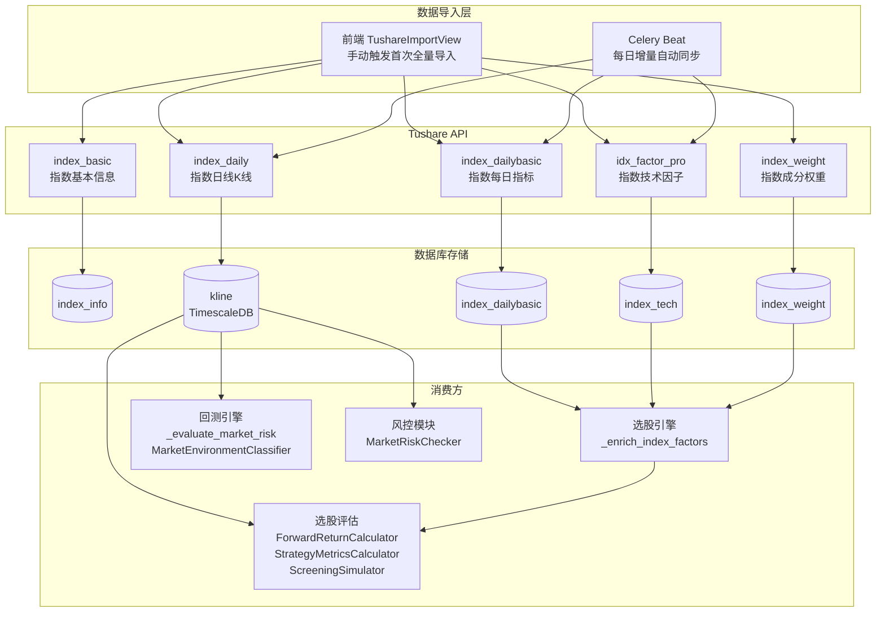

# 设计文档：指数数据缺口评估与补全

## 概述

本设计文档描述指数数据补全的技术实现方案。核心原则：

1. **复用现有基础设施**：Tushare 注册表、导入服务、Celery 任务链路已完备，不新建导入通道
2. **最小改动**：数据导入通过现有前端/API 手动触发 + 新增 Celery Beat 自动化，代码改动集中在评估模块适配和 `index_vol_ratio` 修复
3. **导入顺序约束**：`index_basic` → `index_daily` → `index_dailybasic` / `idx_factor_pro` / `index_weight`（`index_daily` 的 `batch_by_code=True` 依赖 `index_info` 表有数据）

## 架构图



## 详细技术实现方案

### 1. 导入顺序与依赖关系

```
第一步: index_basic → index_info 表
  ↓ (index_daily 等指数 API 的 by_index 策略依赖 index_info)
第二步: index_daily → kline 表 (TimescaleDB)
  ↓ (可并行)
第三步: index_dailybasic → index_dailybasic 表
第三步: idx_factor_pro → index_tech 表
第三步: index_weight → index_weight 表
```

**关键修复：** `index_daily` 注册表当前配置 `batch_by_code=True`，导致 `determine_batch_strategy()` 路由到 `_process_batched()`，该方法从 `stock_info` 表读取股票代码——而非指数代码。这是一个 bug。修复方案：将 `index_daily` 的 `batch_by_code` 改为 `False`，使其走 `by_index` 策略（从 `index_info` 表读取指数代码列表）。具体修改：

```python
# tushare_registry.py 中 index_daily 注册条目
# 修改前: batch_by_code=True
# 修改后: batch_by_code=False  (删除该行，使用默认值 False)
# 这样 determine_batch_strategy() 会因 optional_params 含 INDEX_CODE 而路由到 "by_index"
```

### 2. 核心指数集定义

在 `app/services/data_engine/tushare_import_service.py` 或独立常量模块中定义：

```python
CORE_INDEX_CODES = [
    "000001.SH",  # 上证指数
    "000300.SH",  # 沪深300
    "000905.SH",  # 中证500
    "399001.SZ",  # 深证成指
    "399006.SZ",  # 创业板指
]
```

### 3. Celery Beat 新增指数同步任务

**文件：** `app/core/celery_app.py`

在 `_beat_schedule` 中新增：

```python
"index-data-sync-1600": {
    "task": "app.tasks.data_sync.sync_index_data",
    "schedule": crontab(hour=16, minute=0, day_of_week="1-5"),
    "options": {"queue": "data_sync"},
},
"index-weight-sync-monthly": {
    "task": "app.tasks.data_sync.sync_index_weight",
    "schedule": crontab(hour=8, minute=0, day_of_month="1", day_of_week="1-5"),
    "options": {"queue": "data_sync"},
},
```

**文件：** `app/tasks/data_sync.py`

新增任务函数：

```python
@celery_app.task(base=DataSyncTask, name="app.tasks.data_sync.sync_index_data",
                 bind=True, queue="data_sync")
def sync_index_data(self):
    """每日指数数据增量同步（需求 7）"""
    # 注意：不能使用 TushareImportService.start_import()，因为它是异步分发（fire-and-forget），
    # 无法保证执行顺序。此处直接调用底层 _process_import 逻辑同步执行。
    # 按顺序执行：
    # 1. index_daily (增量: 从 kline 表最新日期到今天)
    # 2. index_dailybasic (增量)
    # 3. idx_factor_pro (增量)
    # 每步失败记录 ERROR 日志，继续下一步
    # 使用 _run_async(_process_import(...)) 直接在当前 Celery worker 中同步执行

@celery_app.task(base=DataSyncTask, name="app.tasks.data_sync.sync_index_weight",
                 queue="data_sync")
def sync_index_weight():
    """每月指数成分权重同步（需求 7 AC 5）"""
    # 导入 index_weight，参数为核心指数集
```

### 4. `index_vol_ratio` 修复

**文件：** `app/services/screener/screen_data_provider.py`

当前 `_enrich_index_factors` 中 `index_vol_ratio` 硬编码为 None。修复方案：从 kline 表查询指数最近 6 日成交量，计算量比：

```python
# 在 _enrich_index_factors 中，查询指数 K 线最近 6 日
# vol_ratio = 当日成交量 / 近 5 日平均成交量
index_vol_ratio = today_volume / avg_5d_volume if avg_5d_volume > 0 else None
```

### 5. 评估模块适配

**文件：** `app/services/screener/evaluation/historical_data_preparer.py`

`load_index_data()` 方法修改：
- 默认使用 `000300.SH`（沪深300）作为基准
- 查询失败时回退到 `000001.SH`（上证指数）
- 两者都无数据时返回空字典并记录 ERROR
- 注意：kline 表中指数 symbol 使用标准代码格式（如 `000300.SH`），因为 `index_daily` 的 `code_format=INDEX_CODE` 保留完整 ts_code

```python
_DEFAULT_BENCHMARK = "000300.SH"
_FALLBACK_BENCHMARK = "000001.SH"

async def load_index_data(
    self,
    start_date: date,
    end_date: date,
    index_code: str = _DEFAULT_BENCHMARK,
    fallback_code: str = _FALLBACK_BENCHMARK,
) -> dict[date, dict[str, Any]]:
    result = await self._load_index_kline(index_code, start_date, end_date)
    if not result:
        logger.warning("基准指数 %s 无数据，回退到 %s", index_code, fallback_code)
        result = await self._load_index_kline(fallback_code, start_date, end_date)
    if not result:
        logger.error("所有基准指数均无数据，超额收益和市场环境分类将不可用")
    return result
```

**文件：** `scripts/evaluate_screener.py`

评估脚本修改：
- 调用改为 `preparer.load_index_data(start_date, end_date)`（使用默认基准，不再传 `"000001"`）
- 数据准备阶段增加指数数据完整性检查
- 检查结果写入 `evaluation_data["summary"]["index_data_status"]`

### 6. 评估脚本数据完整性检查

**文件：** `scripts/evaluate_screener.py`

在数据准备阶段新增检查逻辑：

```python
async def _check_index_data_completeness(preparer, trading_dates, index_data):
    """检查指数数据完整性（需求 12）"""
    # 1. 基准指数 K 线覆盖率
    covered = sum(1 for d in trading_dates if d in index_data)
    coverage = covered / len(trading_dates) * 100
    if coverage < 80:
        logger.error("基准指数数据不足（覆盖率 %.0f%%），请先导入指数数据", coverage)
    # 2. index_dailybasic 覆盖率
    # 3. index_tech 覆盖率
    # 4. index_weight 最新日期
    return {"index_kline_coverage": coverage, ...}
```

### 7. 涉及文件清单

| 文件 | 改动类型 | 说明 |
|------|---------|------|
| `app/services/data_engine/tushare_registry.py` | 修改 | `index_daily` 删除 `batch_by_code=True`，改走 `by_index` 策略 |
| `app/core/celery_app.py` | 修改 | 新增 `index-data-sync-1600` 和 `index-weight-sync-monthly` Beat 调度 |
| `app/tasks/data_sync.py` | 修改 | 新增 `sync_index_data` 和 `sync_index_weight` 任务函数 |
| `app/services/screener/screen_data_provider.py` | 修改 | 修复 `index_vol_ratio` 计算逻辑 |
| `app/services/screener/evaluation/historical_data_preparer.py` | 修改 | `load_index_data` 增加回退逻辑和默认基准 |
| `scripts/evaluate_screener.py` | 修改 | 使用沪深300基准 + 数据完整性检查 + `index_data_status` |

### 8. 向后兼容性说明

- 指数 K 线写入现有 kline 表，不新增表结构
- `index_vol_ratio` 修复为计算值，但当指数 K 线不可用时仍降级为 None，不影响现有选股流程
- Celery Beat 新增任务不影响现有调度
- 评估脚本的数据完整性检查仅输出警告/错误日志，不阻断评估流程
- 首次全量导入通过现有前端 Tushare 导入页面手动触发，无需新增 API
