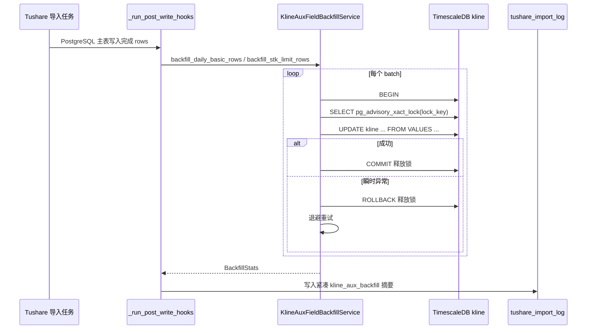

# K 线辅助字段回填可靠性修复设计

## 概览

本设计修复 `daily_basic` 与 `stk_limit` 导入后置 hook 并发更新 TimescaleDB `kline` 时出现死锁、导致辅助字段部分缺失的问题。

核心策略：

- 使用 TimescaleDB/PostgreSQL advisory transaction lock 串行化 `kline` 辅助字段回填写入。
- 在单批次回填 SQL 外层增加有限退避重试，覆盖死锁、序列化失败、连接中断等瞬时异常。
- 将写入导入日志的回填信息压缩为摘要，避免完整 SQL 和异常堆栈进入 `extra_info` 后被截断。
- 保持现有幂等 UPDATE 语义，不改变源表设计，不新增 `daily_basic` 历史表。

## 架构图



## 现状问题

### 并发死锁来源

`daily_basic` 和 `stk_limit` 分别通过 Celery worker 并发处理，每个交易日导入后都触发 `KlineAuxFieldBackfillService`：

- `daily_basic` 更新 `kline.turnover`、`kline.vol_ratio`
- `stk_limit` 更新 `kline.limit_up`、`kline.limit_down`

二者更新同一张 hypertable、相同日期和大量相同 symbol 的 `1d/adj_type=0` 行。两个事务获取行锁顺序不完全一致时会触发 PostgreSQL 死锁。

### 日志可观测性问题

当前 `_run_post_write_hooks` 捕获异常后把 `str(exc)[:500]` 写入 hook info。SQLAlchemy 异常字符串通常包含完整 SQL 和大量参数，容易让 `tushare_import_log.extra_info` 被截断，反而看不到失败日期汇总。

### 数据范围误判

`kline` 中存在指数、板块或其他非个股行。`daily_basic/stk_limit` 只覆盖个股，指数行辅助字段为空是正常情况。回填逻辑应继续以源数据的个股 `ts_code/symbol` 为准，不为指数行补值。

## 技术设计

### 1. 数据库级串行锁

文件：`app/services/data_engine/kline_aux_field_backfill.py`

新增模块常量：

```python
_KLINE_AUX_BACKFILL_LOCK_KEY = 2026043001
```

新增方法：

```python
async def _acquire_backfill_lock(self, session: AsyncSession) -> None:
    await session.execute(
        text("SELECT pg_advisory_xact_lock(:lock_key)"),
        {"lock_key": _KLINE_AUX_BACKFILL_LOCK_KEY},
    )
```

选择 transaction-level advisory lock 的原因：

- 锁与当前事务绑定，`commit/rollback/连接断开` 时自动释放。
- 不需要新增表或迁移。
- 对其他业务 SQL 无影响，只约束显式获取同一 lock key 的回填逻辑。
- 适合跨 Celery worker、跨进程串行化。

锁粒度采用全局 `kline_aux_backfill` 级别，而不是按日期或字段分锁。原因是当前冲突发生在同一 hypertable 的大批量 UPDATE，按字段拆锁仍可能更新同一批行而死锁；全局锁更保守但可靠。

### 2. 回填批次重试

新增常量：

```python
_BACKFILL_MAX_RETRIES = 3
_BACKFILL_RETRY_BASE_DELAY = 0.5
```

新增方法：

```python
async def _execute_stats_sql_with_retry(self, sql, params: dict[str, Any]) -> tuple[int, int, int]:
    for attempt in range(_BACKFILL_MAX_RETRIES):
        try:
            return await self._execute_stats_sql_once(sql, params)
        except Exception as exc:
            if not self._is_transient_db_error(exc) or attempt >= _BACKFILL_MAX_RETRIES - 1:
                raise
            await asyncio.sleep(_BACKFILL_RETRY_BASE_DELAY * (attempt + 1))
```

`_execute_stats_sql_once` 负责：

1. 开启或使用传入的 TS session。
2. 获取 advisory transaction lock。
3. 执行 UPDATE SQL。
4. commit。
5. 异常时 rollback。

瞬时异常识别：

```python
def _is_transient_db_error(exc: Exception) -> bool:
    raw = str(exc).lower()
    return any(marker in raw for marker in (
        "deadlock detected",
        "serialization failure",
        "could not serialize access",
        "connection was closed",
        "connectiondoesnotexisterror",
        "lock timeout",
    ))
```

说明：

- 当前项目中 PostgreSQL 主表写入已有基于字符串的 deadlock retry，沿用本地风格。
- 重试只包裹单个 batch，不重跑整个 API 日期。
- 失败最终仍抛给 `_run_post_write_hooks` 捕获，主导入任务不因此失败。

### 3. 回填统计扩展

更新 `BackfillStats`：

```python
@dataclass
class BackfillStats:
    source_table: str
    start_date: str | None
    end_date: str | None
    source_rows: int = 0
    matched_rows: int = 0
    updated_rows: int = 0
    skipped_rows: int = 0
    retry_count: int = 0
    failed_batches: int = 0
```

`retry_count` 从 `_execute_stats_sql_with_retry` 累加返回，或通过 service 内部计数累加到 stats。

为保持实现简单，推荐让 `_execute_stats_sql_with_retry` 返回三元组：

```python
tuple[int, int, int]  # matched_rows, updated_rows, retry_count
```

然后在 `backfill_daily_basic_rows` / `backfill_stk_limit_rows` 中累加。

### 4. 紧凑错误摘要

文件：`app/tasks/tushare_import.py`

新增 helper：

```python
def _compact_backfill_error(exc: Exception) -> str:
    raw = str(exc)
    lowered = raw.lower()
    if "deadlock detected" in lowered:
        return "DeadlockDetectedError: deadlock detected"
    if "connection was closed" in lowered:
        return "ConnectionDoesNotExistError: connection was closed"
    return raw.splitlines()[0][:180]
```

更新 `_run_post_write_hooks`：

- Celery logger 继续 `exc_info=True`，保留完整排障上下文。
- `_record_backfill_hook_info` 只写紧凑字段：

```python
{
    "source_table": entry.api_name,
    "start_date": inferred_start_date,
    "end_date": inferred_end_date,
    "source_rows": len(rows),
    "backfill_error": compact_error,
}
```

成功时继续记录 `asdict(stats)`，新增的 `retry_count/failed_batches` 会随统计进入 `extra_info`。

### 5. hook info 汇总策略

当前 `_merge_backfill_hook_info` 直接把每个日期的 hook info 放入 `extra_info`。这在 76 个交易日下仍可接受，但异常字符串过长时会导致截断。本次先压缩单条错误，不改变整体结构。

本次同时新增汇总字段。

```python
"kline_aux_backfill_summary": {
    "items": 76,
    "errors": 2,
    "matched_rows": 410000,
    "updated_rows": 390000,
    "retry_count": 3,
    "failed_batches": 0,
}
```

为了保持兼容，设计保留原 `kline_aux_backfill` 列表，同时新增 summary。前端或历史排查仍可读旧字段。

### 6. 个股范围处理

当前回填来源是 `daily_basic` / `stk_limit` rows，本身来自 Tushare 个股接口。SQL 使用 `JOIN v ON k.symbol = v.symbol`，指数行不会被更新。无需新增复杂市场代码判断，避免误伤北交所或未来新增股票前缀。

为了降低误判，统计解释保持如下口径：

- `matched_rows`：源 rows 中能匹配 `kline.freq='1d' AND adj_type=0` 的行数。
- `skipped_rows`：源 rows 中未匹配到日 K 的数量，包括未导入 K 线、停牌、退市、或其他无本地 K 线场景。

## 文件变更

### 后端服务

- `app/services/data_engine/kline_aux_field_backfill.py`
  - 增加 advisory transaction lock。
  - 增加 transient DB error 识别。
  - 增加 batch 级 retry/backoff。
  - 扩展 `BackfillStats` 统计字段。
  - 保持现有 UPDATE SQL 的幂等条件。

- `app/tasks/tushare_import.py`
  - 增加 `_compact_backfill_error`。
  - 调整 `_run_post_write_hooks` 的失败摘要。
  - 增强 `_merge_backfill_hook_info` 汇总信息。

### 测试

- `tests/services/test_kline_aux_field_backfill.py`
  - 更新已有断言：一次回填会先执行 lock SQL，再执行 update SQL。
  - 新增死锁第一次失败、第二次成功的重试测试。
  - 新增不可重试异常直接抛出的测试。
  - 新增 retry_count 统计断言。

- `tests/tasks/test_tushare_import_kline_aux_backfill.py`
  - 更新 `_Stats` dataclass，包含 `retry_count/failed_batches`。
  - 新增错误摘要不包含 SQL 大段文本的测试。
  - 新增 summary 字段测试。

## 兼容性

- 不改变 Tushare API 注册表。
- 不改变 `daily_basic` 当前写入 `stock_info` 的策略。
- 不改变 `stk_limit` 与 `stk_factor` 表结构。
- 不需要 Alembic 迁移。
- `kline_aux_backfill` 旧字段仍保留；新增字段只做增强。
- 主导入任务仍保持“hook 失败不导致导入失败”的行为。

## 风险与缓解

### 风险：串行锁降低并发吞吐

影响范围仅限 `daily_basic/stk_limit` 的 K 线辅助字段 UPDATE。Tushare API 调用和 PostgreSQL 主表写入仍可并发。相比死锁后整日回填失败，串行化更符合数据完整性优先级。

### 风险：锁等待时间变长

`pg_advisory_xact_lock` 默认等待。由于每个 batch 当前 500 行，事务较短。若后续发现等待明显，可再引入 `pg_try_advisory_xact_lock` 和等待日志，本次不先复杂化。

### 风险：异常识别依赖字符串

项目现有导入写入已使用字符串识别 deadlock。本次沿用风格，测试覆盖关键错误文本。未来可进一步识别 SQLSTATE。

### 风险：`extra_info` 仍可能很长

本次压缩异常文本并新增 summary，显著降低截断风险。完整 per-date 列表仍保留，若未来日期范围很长，再单独设计分页或独立回填日志表。

## 验证计划

1. 运行单元测试：

```bash
/Users/poper/ContestTrade/yes/bin/pytest \
  tests/services/test_kline_aux_field_backfill.py \
  tests/tasks/test_tushare_import_kline_aux_backfill.py
```

2. 运行相关导入测试：

```bash
/Users/poper/ContestTrade/yes/bin/pytest \
  tests/tasks/test_tushare_import_by_trade_date.py \
  tests/integration/test_tushare_truncation_retry.py
```

3. 人工验证：

- 并发触发 `daily_basic` 和 `stk_limit` 小日期范围导入。
- 查看 `logs/celery-worker.log` 不再出现 `deadlock detected` 未恢复失败。
- 查询 `tushare_import_log.extra_info`，确认 `kline_aux_backfill_summary` 有 matched/updated/retry/error 统计。
- 查询 `kline` 指定个股日期，确认 `turnover/vol_ratio/limit_up/limit_down` 非空覆盖率提升。

## 需求映射

| 需求 | 设计点 |
|------|--------|
| 1. 回填写入避免并发死锁 | advisory transaction lock |
| 2. 回填批次可重试 | `_execute_stats_sql_with_retry` |
| 3. 回填统计可观测 | compact error + summary |
| 4. 回填逻辑幂等 | 保留 `IS DISTINCT FROM` 与 `COALESCE` |
| 5. 只针对个股日 K | 源 rows 来自个股接口并 JOIN `kline`，不为指数行补值 |
| 6. 测试覆盖 | service/task 两组测试 |
