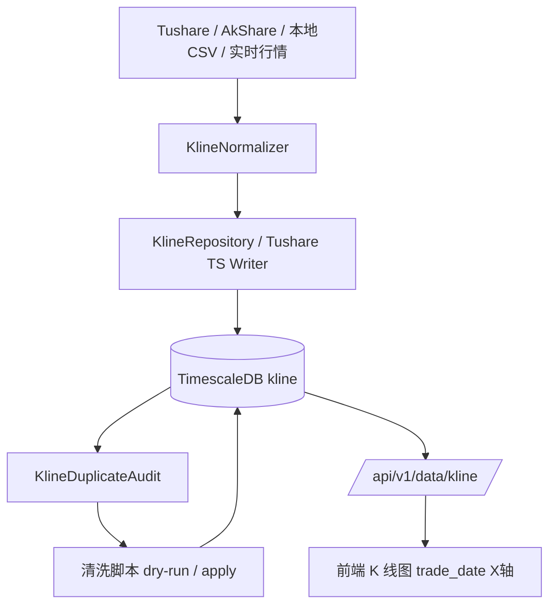

# K 线重复数据归一化修复设计

## 总览

本修复分为四层：

1. 写入前归一化：所有入口在生成或写入 `KlineBar` 时统一日/周/月 K 的时间和股票代码。
2. 查询侧防线：API 按 `adj_type` 和交易日去重，前端使用 `trade_date` 渲染。
3. 历史数据清洗：将已经存在的时区偏移重复压缩为单条规范记录。
4. 重复巡检与全库清理：覆盖 `kline`、`sector_kline`、`adjustment_factor`、Tushare 注册表管理的 PostgreSQL 表，以及所有存在主键/唯一约束或明确业务唯一键的业务表。



## 关键设计

### 0. 责任服务归因与防复发边界

本次重复不是前端渲染制造，也不是 TimescaleDB 主键失效；责任写入入口是 Tushare 在线批量导入服务：

- 触发入口：`app/services/data_engine/tushare_import_service.py`
- Celery 任务：`app/tasks/tushare_import.py::run_import`
- 写入函数：`app/tasks/tushare_import.py::_write_to_kline`
- 注册表来源：`app/services/data_engine/tushare_registry.py` 中 `api_name="daily"`，`target_table="kline"`，`storage_engine=StorageEngine.TS`

证据链：

- 真实重复样例为同一上海交易日的 `前一日 16:00 UTC` 与 `当日 00:00 UTC`，例如 `000001.SZ` 在 `2026-02-27` 同时有 `2026-02-26 16:00:00+00` 和 `2026-02-27 00:00:00+00`。
- 当前库中 `2026-02-27` 附近 `1d` 数据分布为 `2026-02-26 16:00 UTC` 5471 只股票、`2026-02-27 00:00 UTC` 6665 只股票。
- `tushare_import_log` 中 `daily` 多次完成覆盖这些日期范围的大批量导入；`sector_kline` 与 `adjustment_factor` 样本未出现同键或同交易日重复，说明主问题集中在 `kline` 的 Tushare 股票日线导入。
- `.kiro/specs/tushare-timeseries-timezone-repair/` 已对 2026-04 执行过 `time + interval '8 hours'` 方向的修复，当前 2026-04 样本 `prev_16_rows=0`；但 2025-04-28、2025-12-31、2026-02-27 仍有残留，说明此前修复不是全量历史清理。

防复发边界：

- 当前 `app/tasks/tushare_import.py` 工作区版本已经引入 `_normalize_tushare_timeseries_time()`，这是正确方向，但本 spec 仍要求将其与通用 `kline_normalizer.py` 对齐，避免 Tushare 写入与仓储写入各自维护一套规则。
- 清理脚本必须使用 `target_time = stored_time + interval '8 hours'` 归并旧 `16:00 UTC` 残留；旧 `cleanup_duplicate_kline.py` 的 `time - interval '16 hours'` 只适合同 UTC 日误匹配，不能作为本问题的最终清理工具。
- `kline` 表当前没有 `created_at/import_log_id/source_api` 字段，无法把每一行精确回溯到某个 `tushare_import_log.id`。后续若要做到审计级归因，应新增导入来源元数据或单独审计表。

### 1. 新增 K 线归一化工具

新增 `app/services/data_engine/kline_normalizer.py`：

- `derive_trade_date(value: date | datetime | str, freq: str, *, source_trade_date: date | str | None = None) -> date`
  - 优先使用显式交易日：Tushare `trade_date`、AkShare `日期`、CSV 日期列、周/月线周期日期。
  - 对 aware `datetime`：先 `astimezone(ZoneInfo("Asia/Shanghai"))`，再取 `.date()`。因此 `2026-02-26 16:00:00 UTC` 和 `2026-02-27 00:00:00 UTC` 都归入交易日 `2026-02-27`。
  - 对 naive 日线/周线/月线 `datetime`：直接取 `.date()`，把它视为“交易日标签”，不当成服务器本地时区 instant。
  - 对 `YYYYMMDD`、`YYYY-MM-DD`、`YYYY/MM/DD` 字符串：解析为日期后直接作为交易日。
  - 给 API 响应和重复巡检使用。
- `normalize_kline_time(dt: datetime | date | str, freq: str, *, source_trade_date: date | str | None = None) -> datetime`
  - `1d/1w/1M`：先调用 `derive_trade_date()` 得到交易日，再返回 `datetime(trade_day.year, trade_day.month, trade_day.day, tzinfo=timezone.utc)`。
  - 分钟级：保留真实分钟时间；aware 值转换为 UTC，naive 值按 `Asia/Shanghai` 本地时间理解后转换为 UTC。
- `normalize_kline_symbol(symbol: str) -> str | None`
  - 统一调用 `symbol_utils.to_standard()`。
- `choose_canonical_kline(rows) -> row`
  - 清洗重复组时选择保留行。优先保留规范 UTC 零点；字段完整度更高者优先；字段完全一致时保留规范 UTC 零点行，若仍并列则保留较小物理行标识。

归一化示例：

| 输入 | freq | 显式交易日 | 推导交易日 | 规范写入 time |
|------|------|------------|------------|----------------|
| `trade_date=20260227` | `1d` | `2026-02-27` | `2026-02-27` | `2026-02-27 00:00:00+00` |
| `2026-02-26 16:00:00+00` | `1d` | 无 | `2026-02-27` | `2026-02-27 00:00:00+00` |
| `2026-02-27 00:00:00+00` | `1d` | 无 | `2026-02-27` | `2026-02-27 00:00:00+00` |
| `2026-02-27 00:00:00` naive | `1d` | 无 | `2026-02-27` | `2026-02-27 00:00:00+00` |
| `2026-02-27 09:35:00` naive | `5m` | 不适用 | 不压缩 | `2026-02-27 01:35:00+00` |

### 2. 写入链路修改

修改以下位置：

- `app/services/data_engine/kline_repository.py`
  - `bulk_insert()` 不再 `split(".")[0]`，改为 `normalize_kline_symbol()`。
  - 写入前调用 `normalize_kline_time()`。
  - 对同批次相同业务键做内存去重，避免 `ON CONFLICT DO UPDATE` 在同一 SQL 中遇到重复键。

- `app/tasks/tushare_import.py`
  - `_normalize_tushare_timeseries_time()` 保持解析职责。
  - `_write_to_kline()` 在入参阶段调用 `normalize_kline_time(source_trade_date=row.get("trade_date"))` 和 `normalize_kline_symbol()`。
  - 对 `daily/weekly/monthly/rt_k` 使用业务归一化键。
  - 修复 `_write_to_adjustment_factor()` 的 `adj_type`，默认使用前复权 `1`，或从接口/参数明确传入。

- `app/services/data_engine/akshare_adapter.py`
  - 无时区日线日期只表达交易日，不直接作为本地时区 instant 使用。

- `app/services/data_engine/local_kline_import.py`
  - `_parse_datetime()` 可继续解析，但入库前由 repository 统一归一化，避免入口各自维护规则。

- `app/services/data_engine/forward_adjustment.py`
  - `adjust_kline_bars()` 不再直接使用 `bar.time.date()`。
  - 日线使用 `derive_trade_date(bar.time, bar.freq)` 查找 `AdjustmentFactor.trade_date`，避免 `2026-02-26 16:00 UTC` 被错配到前一交易日因子。

- 回测和选股评估中直接从 `KlineBar.time` 推导日期的位置
  - `app/services/backtest_engine.py`
  - `app/tasks/backtest.py`
  - `app/services/screener/evaluation/forward_return_calculator.py`
  - `app/services/screener/evaluation/historical_data_preparer.py`
  - 日线日期索引、T+1 日期判断、历史收益计算统一使用 `derive_trade_date()`；分钟级按真实时间处理。

### 3. 查询 API 和前端修改

修改 `app/api/v1/data.py`：

- 本地查询对 `adj_type=0` 和 `adj_type=1` 都先读取 `Kline.adj_type == 0` 原始 K 线基底。
- `adj_type=0` 直接返回原始 K 线；`adj_type=1` 在原始 K 线基底上使用 `AdjustmentFactor.adj_type == 1` 动态计算前复权后返回。
- `adj_type=0` 过滤的目的：防止未来或历史数据中存在实体化前复权/后复权行时，原始图和动态前复权计算混入非原始行。它不影响前端展示“前复权”按钮。
- 查询结果按 `derive_trade_date()` 做防御性去重。
- 响应每根 bar 增加 `trade_date` 字段。
- 分钟级响应每根 bar 增加本地展示时间字段，例如 `trade_time` 或 `display_time`，值为 `Asia/Shanghai` 交易时间 `HH:mm` 或完整本地时间，避免前端从 UTC ISO 切片。
- 修复 `clean_symbol` 未定义风险，统一使用 `to_bare(std_symbol)` 查询复权因子。

修改 `app/api/v1/risk.py`：

- `/risk/index-kline` 和内部 `_fetch_closes()` 同样从 `kline` 日线读取，应按交易日去重并返回 `trade_date`。
- MA20/MA60 基于去重后的交易日序列计算，避免重复日 K 放大样本数量。

修改前端：

- `frontend/src/views/ScreenerResultsView.vue`
- `frontend/src/views/StockPoolView.vue`
- `frontend/src/views/DashboardView.vue`
- `frontend/src/views/RiskView.vue`
- `frontend/src/components/MinuteKlineChart.vue`
- 其他使用 K 线 bars 的组件

前端保留“原始 / 前复权”两个切换项：

- 原始：请求 `adj_type=0`，展示原始 K 线基底。
- 前复权：请求 `adj_type=1`，展示后端动态计算后的前复权 K 线。
- 两个口径分别缓存，缓存键继续包含 `adj_type`。
- X 轴优先使用 `bar.trade_date`，缺失时才回退 `bar.time.slice(0, 10)`。构建图表前按日期去重，后端修复前也不再展示双 K。
- 风控页指数 K 线也优先使用 `/risk/index-kline` 返回的 `trade_date`。
- 分钟图 X 轴优先使用 `bar.trade_time` / `bar.display_time`，缺失时才回退旧的 `time.slice(11, 16)`。

### 4. 历史清洗脚本

新增 `scripts/audit_kline_duplicates.py`：

- 默认 `--dry-run`。
- 参数：`--start`、`--end`、`--freq`、`--symbol`、`--apply`、`--batch-size`。
- 输出：
  - 重复组数
  - 重复行数
  - 影响股票数
  - 冲突字段样本
  - 建议清洗动作

新增 `scripts/repair_kline_duplicates.py`：

- 复用审计逻辑。
- 建立备份表，例如 `kline_duplicate_backup_YYYYMMDDHHMMSS`。
- 按月份或股票批次处理。
- 对重复组保留 canonical 行，删除非 canonical 行。
- 清洗后执行复查 SQL。

清洗口径使用交易日键：

```sql
symbol,
freq,
(time AT TIME ZONE 'Asia/Shanghai')::date AS trade_day,
adj_type
```

清洗策略：

- 先将重复组中的每一行按同一算法归一化到 `canonical_time = trade_day 00:00:00 UTC`。
- 若重复组字段完全一致，仅保留一行并将保留行时间更新为 `canonical_time`。
- 若字段有冲突，优先保留已在 `canonical_time` 的行；若非规范时间行字段更完整，则保留字段更完整行但把时间更新为 `canonical_time`。
- 字段冲突组默认记录样本和数量，首轮 apply 只自动处理字段一致或可信度明确的组。
- 清洗前需要额外识别 `16:00 UTC + 00:00 UTC` 的字段一致组。字段完全一致的组可自动处理；字段冲突组先输出报告，默认不自动删除，除非策略确认。

### 5. 其他数据重复巡检

新增 `scripts/audit_duplicate_data.py`：

- TimescaleDB：
  - `kline`: `(symbol, freq, trade_day, adj_type)`
  - `sector_kline`: `(sector_code, data_source, freq, trade_day)`
  - `adjustment_factor`: `(symbol, trade_date, adj_type)`，并报告 `adj_type=0`
- PostgreSQL：
  - 读取 `TUSHARE_API_REGISTRY` 中的 `target_table + conflict_columns`。
  - 同表多接口合并检查，跳过无唯一口径的接口并在报告中列明。
  - 对有唯一约束的表优先报告约束状态，对缺少唯一索引的表给出迁移建议。

### 6. 全库重复数据清理

新增或扩展 `scripts/audit_duplicate_data.py` 与 `scripts/repair_duplicate_data.py`，将 K 线专项清理提升为全库重复治理能力。

#### 6.1 表分类

全库表按清理策略分为四类：

| 类型 | 示例 | 默认动作 |
|------|------|----------|
| 时序行情表 | `kline`、`sector_kline`、`adjustment_factor` | 审计 + 可自动清理 |
| Tushare 业务表 | 注册表中有 `target_table/conflict_columns` 的表 | 审计 + 可自动清理 |
| 系统业务表 | 股票池、策略、黑白名单、用户配置等有唯一约束的表 | 审计 + 谨慎清理 |
| 事件/日志表 | `tushare_import_log`、审计日志、任务进度、交易流水 | 默认只审计，不自动删除 |

#### 6.2 审计口径来源

重复口径优先级：

1. 数据库主键和唯一约束。
2. ORM 模型中的 `UniqueConstraint` / `Index(unique=True)`。
3. Tushare 注册表 `conflict_columns`。
4. 本 spec 明确的业务唯一键，例如 `kline` 的 `(symbol, freq, trade_day, adj_type)`。
5. 无法自动推导唯一键的表进入“人工确认”清单，不参与自动删除。

#### 6.3 全库审计输出

审计报告输出为结构化 JSON 和 Markdown 两份：

- 表名、数据库、schema。
- 重复口径与口径来源。
- 重复组数、重复行数、可自动清理行数、需人工确认行数。
- 样本记录和字段差异摘要。
- 推荐动作：`auto_delete`、`merge_then_delete`、`manual_review`、`no_action`。
- 约束补强建议：新增唯一索引、补 `trade_date` 列、补导入来源字段等。

#### 6.4 全库清理策略

新增 `scripts/repair_duplicate_data.py`：

- 默认 dry-run；只有显式 `--execute` 才写库。
- 支持 `--database ts|pg|all`、`--table`、`--exclude-table`、`--start-date`、`--end-date`、`--batch-size`。
- 每张表清理前创建备份表或候选快照，命名如 `duplicate_backup_{table}_{YYYYMMDDHHMMSS}`。
- 完全相同重复行：保留一条 canonical 行，删除其余重复行。
- 字段不一致重复行：按表级策略合并；无策略时输出人工确认清单，不自动删除。
- 清理完成后对同一表立即复查重复组数，失败则回滚当前批次。

K 线类表继续使用专项策略：

- `kline`：按 `(symbol, freq, trade_day, adj_type)`，将 `16:00 UTC` 残留归并到 `trade_day 00:00 UTC`。
- `sector_kline`：按 `(sector_code, data_source, freq, trade_day)`。
- `adjustment_factor`：按 `(symbol, trade_date, adj_type)`；额外报告 `adj_type=0` 异常。

#### 6.5 运行顺序

1. 停止或暂停会写入目标表的导入任务。
2. 执行全库 dry-run 审计。
3. 先清理 `kline` 等会影响策略计算的核心时序表。
4. 再清理 Tushare 业务表与系统业务表。
5. 对所有清理表重跑审计，确认可自动清理项重复组数为 0。
6. 对剩余人工确认项输出单独清单，不把全库清理误报为完成。

## 数据库策略

短期不直接改 `kline` 主键，避免 TimescaleDB 超表大规模迁移风险。先用写入归一化和清洗脚本解决业务重复。

中期新增表达式唯一索引或冗余 `trade_date` 列：

- 方案 A：新增 `trade_date DATE` 列，写入时填充，唯一索引 `(symbol, freq, trade_date, adj_type)`。
- 方案 B：保留 `time`，增加表达式唯一索引。

推荐方案 A。它查询更直观，也能避免前端和指标层反复从 `time` 推导交易日。

## 兼容性

- 分钟级 K 线不按交易日压缩，不受本修复影响。
- 当前前复权仍走动态计算，不要求立即存储 `adj_type=1` 的 K 线。
- 前端兼容旧响应：`trade_date` 缺失时回退 `time`。
- 清洗脚本默认 dry-run，不会自动删除数据。

## 测试计划

- 单元测试：`normalize_kline_time()` 覆盖 UTC 零点、北京时间零点、naive datetime、分钟级时间。
- 仓储测试：同一交易日两种时区 timestamp 写入后只保留 1 条。
- API 测试：`adj_type=0/1` 查询不混复权类型，响应包含 `trade_date`。
- 前端测试：重复日期 bars 输入时 X 轴只保留唯一日期。
- 脚本测试：dry-run 报告重复组；apply 模式在临时表中可清洗并复查为 0。
- 巡检测试：`sector_kline` 无重复、`adjustment_factor adj_type=0` 被报告为异常。
