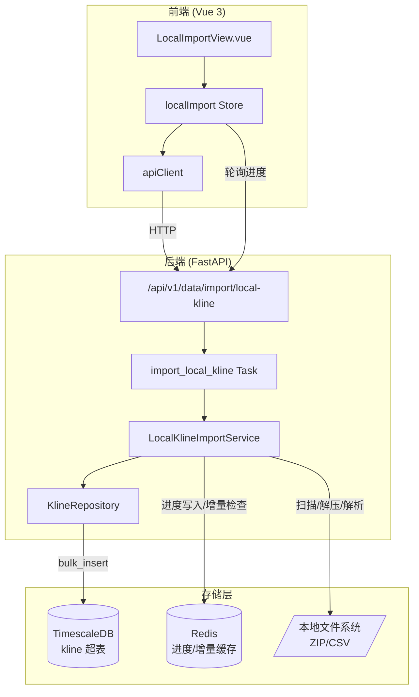
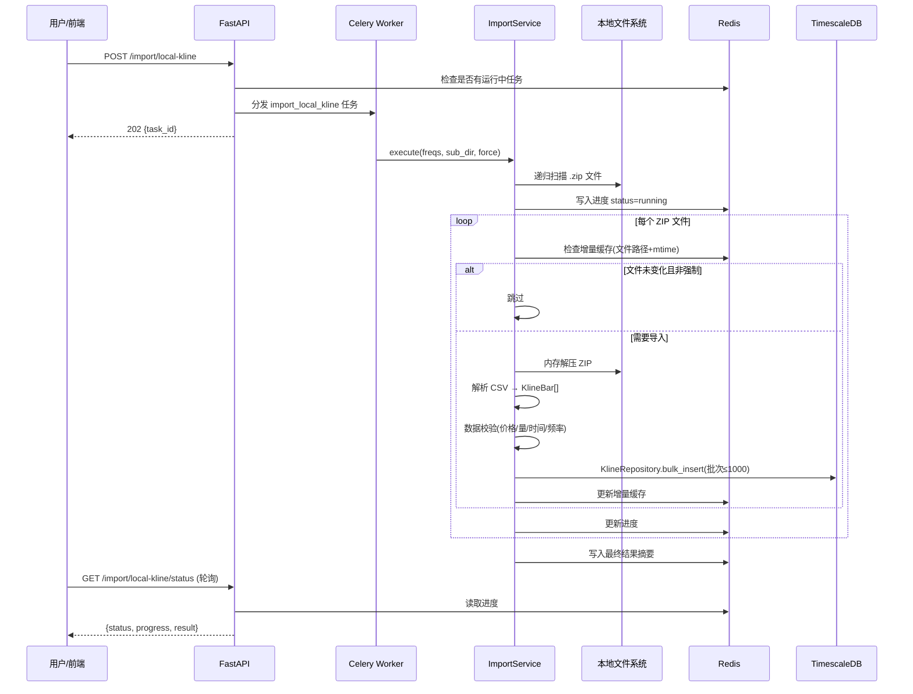

# 技术设计文档：本地分钟级K线数据导入

## 概述

本功能为系统新增本地分钟级K线数据的批量导入能力。后端新增 `LocalKlineImportService` 服务模块，负责扫描本地数据目录、解压ZIP文件、解析CSV、校验数据质量，并通过已有的 `KlineRepository.bulk_insert` 批量写入 TimescaleDB。导入任务通过 Celery 异步执行，进度写入 Redis，前端通过轮询 API 展示实时进度。

前端新增 `LocalImportView.vue` 页面组件和 `localImport` Pinia store，提供频率选择、子目录指定、强制导入开关、定时任务配置、进度条和结果摘要展示。

### 关键设计决策

1. **复用 KlineRepository**：不新建写入层，直接调用已有的 `bulk_insert`（ON CONFLICT DO NOTHING），保证幂等性
2. **内存解压**：ZIP 文件在内存中解压（`zipfile.ZipFile` + `io.BytesIO`），避免临时文件 I/O
3. **增量导入基于文件修改时间**：Redis 哈希表记录已导入文件的 mtime，跳过未变化的文件
4. **进度追踪复用 backfill 模式**：Redis 键值存储进度 JSON，前端 3 秒轮询，与现有回填进度展示模式一致
5. **并发保护**：Redis 锁机制防止同时运行多个导入任务

## 架构

### 系统架构图



### 数据流



## 组件与接口

### 1. 配置扩展 (`app/core/config.py`)

在 `Settings` 类中新增配置项：

```python
# 本地K线数据目录
local_kline_data_dir: str = "/Users/poper/AData"
```

对应环境变量 `LOCAL_KLINE_DATA_DIR`。

### 2. LocalKlineImportService (`app/services/data_engine/local_kline_import.py`)

核心服务类，职责：目录扫描、ZIP 解压、CSV 解析、数据校验、批量写入、进度追踪、增量管理。

```python
class LocalKlineImportService:
    """本地分钟级K线数据导入服务"""
    
    VALID_FREQS: set[str] = {"1m", "5m", "15m", "30m", "60m"}
    BATCH_SIZE: int = 1000
    REDIS_PROGRESS_KEY: str = "import:local_kline:progress"
    REDIS_RESULT_KEY: str = "import:local_kline:result"
    REDIS_INCREMENTAL_KEY: str = "import:local_kline:files"
    PROGRESS_TTL: int = 86400  # 24h

    async def execute(
        self,
        freqs: list[str] | None = None,
        sub_dir: str | None = None,
        force: bool = False,
    ) -> dict:
        """执行导入流程，返回结果摘要字典"""

    def scan_zip_files(self, base_dir: str, sub_dir: str | None = None) -> list[Path]:
        """递归扫描目录下所有 .zip 文件"""

    def extract_and_parse_zip(self, zip_path: Path, freq_filter: set[str] | None) -> tuple[list[KlineBar], int, int]:
        """解压 ZIP 并解析 CSV，返回 (bars, parsed_count, skipped_count)"""

    def parse_csv_content(self, csv_text: str, symbol: str, freq: str) -> tuple[list[KlineBar], int]:
        """解析 CSV 文本为 KlineBar 列表，返回 (bars, skipped_count)"""

    def infer_symbol_and_freq(self, zip_path: Path) -> tuple[str, str]:
        """从文件路径/文件名推断股票代码和频率"""

    def validate_bar(self, bar: KlineBar) -> bool:
        """校验单条 KlineBar 数据质量"""

    async def check_incremental(self, zip_path: Path) -> bool:
        """检查文件是否需要重新导入（基于 mtime）"""

    async def mark_imported(self, zip_path: Path) -> None:
        """标记文件为已导入"""

    async def update_progress(self, **kwargs) -> None:
        """更新 Redis 中的导入进度"""

    async def is_running(self) -> bool:
        """检查是否有导入任务正在运行"""
```

### 3. Celery 任务 (`app/tasks/data_sync.py`)

新增导入任务，注册到 `data_sync` 队列：

```python
@celery_app.task(
    name="app.tasks.data_sync.import_local_kline",
    queue="data_sync",
    soft_time_limit=7200,
    time_limit=10800,
)
def import_local_kline(
    freqs: list[str] | None = None,
    sub_dir: str | None = None,
    force: bool = False,
) -> dict:
    """本地K线数据导入 Celery 任务"""
```

### 4. API 端点 (`app/api/v1/data.py`)

新增两个端点：

```python
# 触发导入
@router.post("/import/local-kline", status_code=202)
async def start_local_kline_import(body: LocalKlineImportRequest) -> LocalKlineImportResponse:
    """触发本地K线导入任务"""

# 查询状态
@router.get("/import/local-kline/status")
async def get_local_kline_import_status() -> LocalKlineImportStatusResponse:
    """查询导入进度和最近结果"""
```

请求/响应模型：

```python
class LocalKlineImportRequest(BaseModel):
    freqs: list[str] | None = None       # 频率过滤列表
    sub_dir: str | None = None           # 子目录路径
    force: bool = False                  # 强制全量导入

class LocalKlineImportResponse(BaseModel):
    task_id: str
    message: str

class LocalKlineImportStatusResponse(BaseModel):
    status: str                          # idle/running/completed/failed
    total_files: int = 0
    processed_files: int = 0
    success_files: int = 0
    failed_files: int = 0
    total_parsed: int = 0
    total_inserted: int = 0
    total_skipped: int = 0
    elapsed_seconds: float = 0
    failed_details: list[dict] = []      # [{path, error}]
```

### 5. 前端 Pinia Store (`frontend/src/stores/localImport.ts`)

```typescript
export const useLocalImportStore = defineStore('localImport', () => {
  // 状态
  const taskId = ref<string | null>(null)
  const progress = reactive<ImportProgress>({...})
  const result = reactive<ImportResult>({...})
  const loading = ref(false)
  const polling = ref(false)

  // 动作
  async function startImport(params: ImportParams): Promise<void>
  async function fetchStatus(): Promise<void>
  function startPolling(): void
  function stopPolling(): void

  return { taskId, progress, result, loading, polling, startImport, fetchStatus, startPolling, stopPolling }
})
```

### 6. 前端页面 (`frontend/src/views/LocalImportView.vue`)

Vue 3 Composition API 页面组件，包含：
- 频率多选控件（checkbox group，默认全选）
- 子目录路径输入框
- 强制全量导入开关（toggle）
- 定时任务配置区域（小时/分钟选择器 + 保存按钮）
- "开始导入"按钮
- 进度条（已处理文件数 / 总文件数）
- 结果摘要卡片
- 失败文件列表

### 7. 路由注册 (`frontend/src/router/index.ts`)

在 MainLayout children 中新增：

```typescript
{
  path: 'data/local-import',
  name: 'LocalImport',
  component: () => import('@/views/LocalImportView.vue'),
  meta: { title: '本地数据导入' },
}
```

## 数据模型

### 已有模型（无需修改）

**Kline 超表** (`app/models/kline.py`)：
- 主键：`(time, symbol, freq)`
- 唯一约束：`(time, symbol, freq, adj_type)`
- 已有 `KlineBar` 数据传输对象和 `KlineRepository.bulk_insert`（ON CONFLICT DO NOTHING）

### Redis 数据结构

**导入进度** (`import:local_kline:progress`，TTL 24h)：
```json
{
  "status": "running",
  "total_files": 120,
  "processed_files": 45,
  "success_files": 43,
  "failed_files": 2,
  "total_parsed": 150000,
  "total_inserted": 148500,
  "total_skipped": 1500,
  "elapsed_seconds": 123.4,
  "started_at": "2024-01-15T10:00:00",
  "current_file": "000001/1m.zip",
  "failed_details": [
    {"path": "bad_file.zip", "error": "ZIP文件损坏"}
  ]
}
```

**导入结果** (`import:local_kline:result`，TTL 24h)：
与进度结构相同，任务完成时写入最终快照。

**增量缓存** (`import:local_kline:files`，Redis Hash，无过期)：
```
field: "/Users/poper/AData/000001/1m.zip"
value: "1705286400.0"  (文件 mtime 的 float 字符串)
```

### 配置模型扩展

`Settings` 新增字段：
| 字段 | 类型 | 默认值 | 环境变量 |
|------|------|--------|----------|
| `local_kline_data_dir` | `str` | `/Users/poper/AData` | `LOCAL_KLINE_DATA_DIR` |


## 正确性属性 (Correctness Properties)

*正确性属性是在系统所有有效执行中都应成立的特征或行为——本质上是对系统应做什么的形式化陈述。属性是人类可读规格说明与机器可验证正确性保证之间的桥梁。*

### Property 1: 目录扫描仅返回 ZIP 文件

*For any* 目录结构（包含 `.zip`、`.csv`、`.txt`、`.py` 等各种扩展名的文件），`scan_zip_files` 返回的文件路径列表中，每个路径的扩展名都应为 `.zip`，且目录中所有 `.zip` 文件都应被包含在结果中。

**Validates: Requirements 1.1**

### Property 2: CSV 解析往返一致性

*For any* 有效的 KlineBar 对象，将其序列化为 CSV 行格式后，再通过 `parse_csv_content` 解析回 KlineBar，得到的对象应与原始对象在所有数值字段上等价（time、symbol、freq、open、high、low、close、volume、amount）。

**Validates: Requirements 2.1, 2.2**

### Property 3: 文件路径推断股票代码和频率

*For any* 符合约定命名规则的文件路径（如 `{data_dir}/{symbol}/{freq}.zip`），`infer_symbol_and_freq` 应正确提取出股票代码和频率，且提取的频率属于 `{1m, 5m, 15m, 30m, 60m}` 集合。

**Validates: Requirements 2.3**

### Property 4: KlineBar 数据校验完备性

*For any* 随机生成的 KlineBar 对象，`validate_bar` 返回 True 当且仅当以下条件全部满足：open > 0、high > 0、low > 0、close > 0、low ≤ open ≤ high、low ≤ close ≤ high、volume ≥ 0、time 为有效日期时间、freq ∈ {1m, 5m, 15m, 30m, 60m}。

**Validates: Requirements 3.1, 3.2, 3.3, 3.4, 3.5**

### Property 5: 批量写入分批不超过上限

*For any* 长度为 N 的 KlineBar 列表，批量写入时每批调用 `bulk_insert` 的记录数不超过 1000 条，且所有批次的记录总数等于 N。

**Validates: Requirements 4.2**

### Property 6: 重复数据写入幂等性

*For any* KlineBar 列表，对同一批数据执行两次 `bulk_insert`，第二次的实际插入行数应为 0，且数据库中的总记录数不变。

**Validates: Requirements 4.3**

### Property 7: 频率过滤正确性

*For any* ZIP 文件集合和频率过滤列表，导入后写入数据库的所有 KlineBar 的 freq 字段都应属于过滤列表指定的频率集合。未指定过滤列表时，所有五种频率的数据都应被导入。

**Validates: Requirements 5.2, 5.3**

### Property 8: 增量导入跳过未变化文件

*For any* 已成功导入的 ZIP 文件，若文件修改时间（mtime）未发生变化，再次执行导入时该文件应被跳过（不重新解析和写入）。若 mtime 发生变化，该文件应被重新导入。

**Validates: Requirements 9.1, 9.2, 9.3, 9.4**

### Property 9: 强制导入忽略增量缓存

*For any* 已成功导入的 ZIP 文件集合，当 `force=True` 时，所有文件都应被重新处理，无论其 mtime 是否变化。

**Validates: Requirements 9.5**

### Property 10: 结果摘要字段完整性

*For any* 导入执行（无论成功或失败），返回的结果摘要字典必须包含以下字段：total_files、success_files、failed_files、total_parsed、total_inserted、total_skipped、elapsed_seconds，且 success_files + failed_files ≤ total_files，total_inserted + total_skipped ≤ total_parsed。

**Validates: Requirements 8.1, 6.3**

## 错误处理

### 后端错误处理

| 错误场景 | 处理方式 | 对应需求 |
|----------|----------|----------|
| 数据目录不存在/不可读 | 记录 ERROR 日志，返回 `{status: "failed", error: "目录不存在或不可读"}` | 1.3 |
| ZIP 文件损坏/无法解压 | 记录 ERROR 日志（含文件路径），跳过该文件，`failed_files += 1`，继续处理下一个 | 2.4 |
| CSV 行格式不合法/字段缺失 | 记录 WARNING 日志，跳过该行，`total_skipped += 1`，继续解析后续行 | 2.5 |
| KlineBar 校验失败 | 记录 WARNING 日志（含 symbol、time、失败原因），跳过该条，`total_skipped += 1` | 3.6 |
| 数据库写入异常 | 记录 ERROR 日志，该文件标记为失败，继续处理下一个文件 | 4.1 |
| 已有导入任务运行中 | API 返回 HTTP 409，body: `{"detail": "已有导入任务正在运行"}` | 6.4, 10.4 |
| 文件路径无法推断 symbol/freq | 记录 WARNING 日志，跳过该 ZIP 文件 | 2.3 |

### 前端错误处理

| 错误场景 | 处理方式 | 对应需求 |
|----------|----------|----------|
| API 返回 409 | 显示"已有导入任务正在运行"提示，不重复触发 | 11.7 |
| API 请求失败（网络/500） | 显示错误提示信息，按钮恢复可用状态 | 11.5 |
| 轮询请求失败 | 静默忽略，下次轮询继续尝试 | 11.9 |
| 导入结果含失败文件 | 在结果摘要中展示失败文件列表及错误原因 | 11.12 |

## 测试策略

### 测试方法

采用单元测试 + 属性测试（Property-Based Testing）双轨策略：

- **单元测试**：验证具体示例、边界情况和错误条件
- **属性测试**：验证跨所有输入的通用属性，使用随机生成的输入覆盖更广泛的场景

两者互补：单元测试捕获具体 bug，属性测试验证通用正确性。

### 后端测试

**属性测试库**：Hypothesis（已在项目中使用）

**属性测试配置**：
- 每个属性测试最少运行 100 次迭代
- 每个测试用注释标注对应的设计文档属性
- 标注格式：`Feature: local-kline-import, Property {number}: {property_text}`

**属性测试文件**：`tests/properties/test_local_kline_import_properties.py`

每个正确性属性对应一个属性测试：

| 属性 | 测试描述 | 生成器 |
|------|----------|--------|
| Property 1 | 扫描目录仅返回 .zip 文件 | 随机目录结构（含各种扩展名文件） |
| Property 2 | CSV 解析往返一致性 | 随机有效 KlineBar 对象 |
| Property 3 | 文件路径推断 symbol/freq | 随机合法文件路径 |
| Property 4 | 数据校验完备性 | 随机 KlineBar（含合法和非法值） |
| Property 5 | 批量写入分批不超过 1000 | 随机长度的 KlineBar 列表 |
| Property 6 | 重复写入幂等性 | 随机 KlineBar 列表（需数据库） |
| Property 7 | 频率过滤正确性 | 随机频率集合 + 随机文件集合 |
| Property 8 | 增量导入跳过未变化文件 | 随机文件路径 + mtime |
| Property 9 | 强制导入忽略增量缓存 | 随机文件路径集合 |
| Property 10 | 结果摘要字段完整性 | 随机导入执行结果 |

**单元测试文件**：`tests/services/test_local_kline_import.py`

单元测试覆盖：
- 配置项读取和默认值（需求 7）
- 目录不存在时的错误处理（需求 1.3）
- ZIP 文件损坏时的跳过行为（需求 2.4）
- CSV 行格式不合法时的跳过行为（需求 2.5）
- API 端点 202/409 响应（需求 10.3, 10.4）
- 并发任务保护（需求 6.4）
- 结果摘要写入 Redis（需求 8.2）

### 前端测试

**属性测试库**：fast-check（已在项目中使用）

**测试文件**：`frontend/src/views/__tests__/LocalImportView.property.test.ts`

前端属性测试主要覆盖进度计算逻辑：
- 进度百分比计算：`processed_files / total_files * 100` 始终在 [0, 100] 范围内

**单元测试文件**：`frontend/src/views/__tests__/LocalImportView.test.ts`

单元测试覆盖：
- 组件挂载和渲染
- 频率多选控件交互
- 开始导入按钮禁用/启用状态
- 409 错误提示展示
- 进度轮询启动/停止
