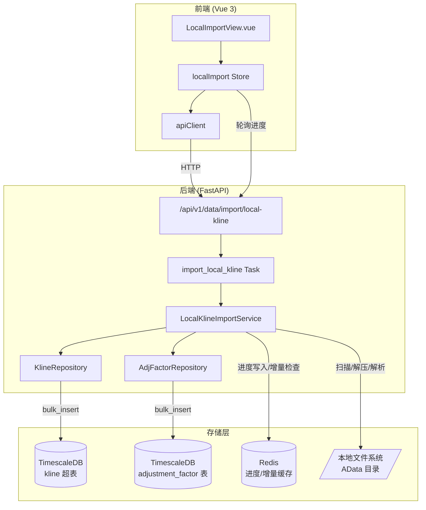
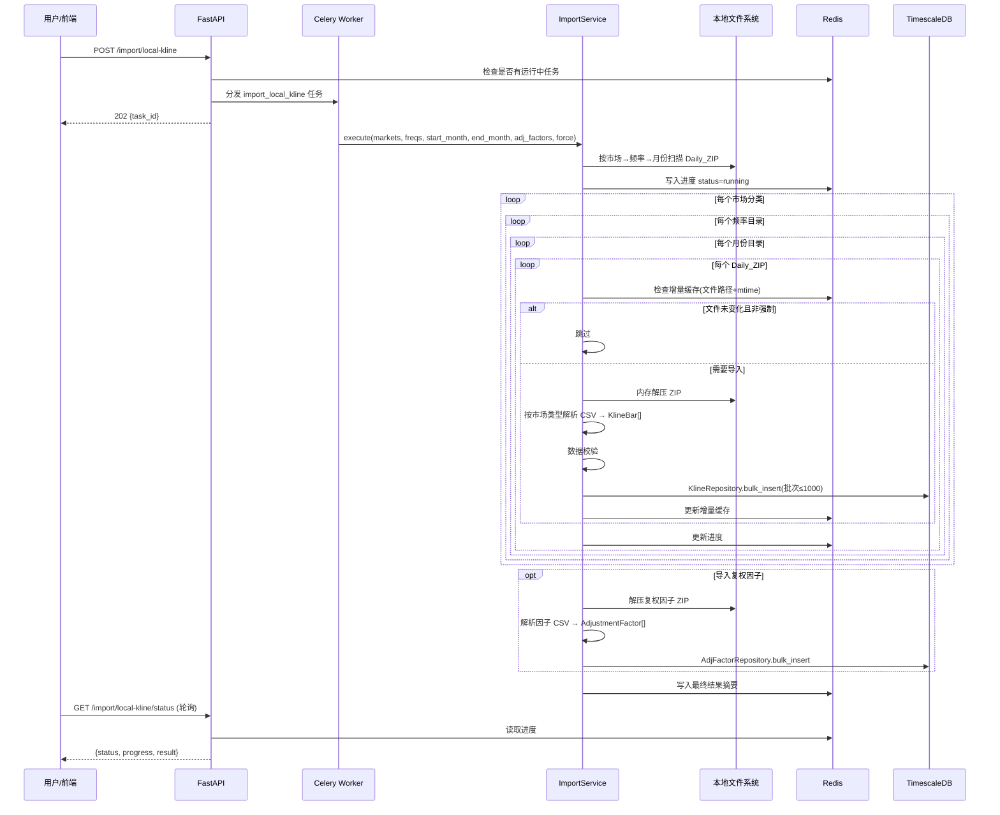

# 技术设计文档：本地A股分时数据与复权因子导入

## 概述

本功能为系统新增本地A股分时数据和复权因子的批量导入能力。后端扩展 `LocalKlineImportService` 服务模块，支持扫描 AData 目录下三大市场分类（沪深、京市、指数）的四级目录结构，解压日期ZIP文件，解析市场特定的CSV格式，校验数据质量，并通过已有的 `KlineRepository.bulk_insert` 批量写入 TimescaleDB。新增复权因子导入能力，解析前复权/后复权因子ZIP并存储到数据库。导入任务通过 Celery 异步执行，进度写入 Redis，前端通过轮询 API 展示实时进度。

前端扩展 `LocalImportView.vue` 页面组件和 `localImport` Pinia store，新增市场分类选择、月份范围过滤、复权因子导入选项。

### 关键设计决策

1. **复用 KlineRepository**：不新建写入层，直接调用已有的 `bulk_insert`（ON CONFLICT DO NOTHING），保证幂等性
2. **内存解压**：ZIP 文件在内存中解压（`zipfile.ZipFile` + `io.BytesIO`），避免临时文件 I/O
3. **增量导入基于文件修改时间**：Redis 哈希表记录已导入文件的 mtime，跳过未变化的文件
4. **市场感知的CSV解析**：根据市场分类自动选择解析策略，指数数据特殊处理缺失的成交量列
5. **目录结构驱动**：从四级目录路径（市场→频率→月份→日期ZIP）自动推断市场类型、频率和日期，无需额外配置
6. **复权因子独立存储**：复权因子存入独立表 `adjustment_factor`，与K线数据解耦，便于按需应用复权
7. **并发保护**：Redis 锁机制防止同时运行多个导入任务

## 架构

### 系统架构图



### 数据目录结构

```
/Users/poper/AData/
├── A股_分时数据_沪深/          → market="hushen"
│   ├── 1分钟_按月归档/         → freq="1m"
│   │   ├── 2026-03/            → month filter
│   │   │   ├── 20260302_1min.zip  → Daily ZIP
│   │   │   └── ...
│   │   └── 2026-04/
│   ├── 5分钟_按月归档/         → freq="5m"
│   └── ...
├── A股_分时数据_京市/          → market="jingshi"
│   └── (同上结构)
├── A股_分时数据_指数/          → market="zhishu"
│   └── (同上结构)
└── 复权因子/
    ├── 复权因子_前复权.zip     → adj_type=1
    └── 复权因子_后复权.zip     → adj_type=2
```

### 数据流



## 组件与接口

### 1. 配置扩展 (`app/core/config.py`)

已有配置项，无需修改：

```python
local_kline_data_dir: str = "/Users/poper/AData"
```

### 2. 市场分类与目录映射常量

```python
# 市场分类 → 目录名映射
MARKET_DIR_MAP: dict[str, str] = {
    "hushen": "A股_分时数据_沪深",
    "jingshi": "A股_分时数据_京市",
    "zhishu": "A股_分时数据_指数",
}

# 频率 → 目录名映射
FREQ_DIR_MAP: dict[str, str] = {
    "1m": "1分钟_按月归档",
    "5m": "5分钟_按月归档",
    "15m": "15分钟_按月归档",
    "30m": "30分钟_按月归档",
    "60m": "60分钟_按月归档",
}

# 反向映射：目录名 → 标准频率
DIR_FREQ_MAP: dict[str, str] = {v: k for k, v in FREQ_DIR_MAP.items()}

# ZIP文件名频率后缀 → 标准频率
FILE_FREQ_MAP: dict[str, str] = {
    "1min": "1m", "5min": "5m", "15min": "15m",
    "30min": "30m", "60min": "60m",
}
```

### 3. LocalKlineImportService (`app/services/data_engine/local_kline_import.py`)

核心服务类扩展，新增市场感知扫描、指数特殊解析、复权因子导入。

```python
class LocalKlineImportService:
    """本地A股分时数据与复权因子导入服务"""

    VALID_FREQS: set[str] = {"1m", "5m", "15m", "30m", "60m"}
    VALID_MARKETS: set[str] = {"hushen", "jingshi", "zhishu"}
    BATCH_SIZE: int = 1000

    async def execute(
        self,
        markets: list[str] | None = None,
        freqs: list[str] | None = None,
        start_month: str | None = None,
        end_month: str | None = None,
        adj_factors: list[str] | None = None,
        force: bool = False,
    ) -> dict:
        """执行导入流程，返回结果摘要字典"""

    def scan_market_zip_files(
        self,
        base_dir: str,
        markets: list[str] | None = None,
        freqs: list[str] | None = None,
        start_month: str | None = None,
        end_month: str | None = None,
    ) -> list[tuple[Path, str, str]]:
        """
        按四级目录结构扫描ZIP文件。

        Returns:
            [(zip_path, market, freq), ...] 元组列表
        """

    def infer_freq_from_path(self, zip_path: Path) -> str | None:
        """从ZIP文件路径推断频率（支持新旧两种目录结构）"""

    def infer_market_from_path(self, zip_path: Path) -> str | None:
        """从ZIP文件路径推断市场分类"""

    def infer_symbol_from_csv_name(self, csv_name: str, market: str) -> str | None:
        """
        从CSV文件名推断股票代码（市场感知）。

        - hushen: sz000001.csv → 000001, sh600000.csv → 600000
        - jingshi: bj920000.csv → 920000
        - zhishu: 000001.csv → 000001（无前缀）
        """

    def parse_csv_content(
        self, csv_text: str, symbol: str, freq: str, market: str,
    ) -> tuple[list[KlineBar], int]:
        """
        解析CSV文本为KlineBar列表（市场感知）。

        指数数据无成交量列，volume设为0。
        """

    def validate_bar(self, bar: KlineBar) -> bool:
        """校验单条KlineBar数据质量"""

    # ── 复权因子相关 ──

    def parse_adj_factor_zip(
        self, zip_path: Path, adj_type: int,
    ) -> tuple[list[dict], int, int]:
        """
        解压并解析复权因子ZIP文件。

        Args:
            zip_path: 复权因子ZIP路径
            adj_type: 1=前复权, 2=后复权

        Returns:
            (factors, parsed_count, skipped_count)
            factors: [{"symbol": str, "trade_date": date, "adj_factor": Decimal, "adj_type": int}, ...]
        """

    def infer_symbol_from_adj_csv_name(self, csv_name: str) -> str | None:
        """
        从复权因子CSV文件名推断股票代码。

        000001.SZ.csv → 000001, 600000.SH.csv → 600000
        """

    # ── 增量/进度（已有，无需修改） ──

    async def check_incremental(self, zip_path: Path) -> bool: ...
    async def mark_imported(self, zip_path: Path) -> None: ...
    async def update_progress(self, **kwargs) -> None: ...
    async def is_running(self) -> bool: ...
```

### 4. 复权因子数据模型 (`app/models/adjustment_factor.py`)

新增复权因子 ORM 模型：

```python
class AdjustmentFactor(TSBase):
    """复权因子 ORM 模型"""
    __tablename__ = "adjustment_factor"

    symbol: Mapped[str] = mapped_column(String(10), primary_key=True)
    trade_date: Mapped[date] = mapped_column(primary_key=True)
    adj_type: Mapped[int] = mapped_column(SmallInteger, primary_key=True)  # 1=前复权, 2=后复权
    adj_factor: Mapped[Decimal] = mapped_column(nullable=False)

    __table_args__ = (
        Index("ix_adj_factor_symbol_type", "symbol", "adj_type"),
    )
```

### 5. 复权因子仓储 (`app/services/data_engine/adj_factor_repository.py`)

```python
class AdjFactorRepository:
    """复权因子数据访问层"""

    async def bulk_insert(self, factors: list[dict]) -> int:
        """批量写入复权因子，ON CONFLICT DO NOTHING，返回实际插入行数"""
```

### 6. Celery 任务 (`app/tasks/data_sync.py`)

扩展导入任务参数：

```python
@celery_app.task(
    name="app.tasks.data_sync.import_local_kline",
    queue="data_sync",
    soft_time_limit=7200,
    time_limit=10800,
)
def import_local_kline(
    markets: list[str] | None = None,
    freqs: list[str] | None = None,
    start_month: str | None = None,
    end_month: str | None = None,
    adj_factors: list[str] | None = None,
    force: bool = False,
) -> dict:
    """本地数据导入 Celery 任务"""
```

### 7. API 端点 (`app/api/v1/data.py`)

扩展请求模型：

```python
class LocalKlineImportRequest(BaseModel):
    markets: list[str] | None = None      # 市场分类: hushen/jingshi/zhishu
    freqs: list[str] | None = None        # 频率过滤列表
    start_month: str | None = None        # 起始月份 YYYY-MM
    end_month: str | None = None          # 结束月份 YYYY-MM
    adj_factors: list[str] | None = None  # 复权因子类型: qfq/hfq
    force: bool = False                   # 强制全量导入
```

### 8. 前端 Pinia Store (`frontend/src/stores/localImport.ts`)

扩展参数接口：

```typescript
export interface ImportParams {
  markets: string[] | null
  freqs: string[] | null
  start_month: string | null
  end_month: string | null
  adj_factors: string[] | null
  force: boolean
}
```

### 9. 前端页面 (`frontend/src/views/LocalImportView.vue`)

扩展UI控件：
- 市场分类多选控件（checkbox group：沪深、京市、指数，默认全选）
- 月份范围选择器（起始月份、结束月份，`YYYY-MM` 格式 input[type=month]）
- 复权因子选择（checkbox group：前复权、后复权，默认不选）
- 保留已有的频率选择、强制导入开关、进度条、结果摘要

## 数据模型

### 已有模型（无需修改）

**Kline 超表** (`app/models/kline.py`)：
- 唯一约束：`(time, symbol, freq, adj_type)`
- 已有 `KlineBar` 数据传输对象和 `KlineRepository.bulk_insert`（ON CONFLICT DO NOTHING）

### 新增模型

**AdjustmentFactor 表** (`app/models/adjustment_factor.py`)：
- 主键：`(symbol, trade_date, adj_type)`
- 字段：`symbol`（股票代码）、`trade_date`（交易日期）、`adj_type`（1=前复权, 2=后复权）、`adj_factor`（复权因子值）

### Redis 数据结构

**导入进度** (`import:local_kline:progress`，TTL 24h)：
```json
{
  "status": "running",
  "total_files": 120,
  "processed_files": 45,
  "success_files": 43,
  "failed_files": 2,
  "skipped_files": 10,
  "total_parsed": 150000,
  "total_inserted": 148500,
  "total_skipped": 1500,
  "elapsed_seconds": 123.4,
  "started_at": "2024-01-15T10:00:00",
  "current_file": "A股_分时数据_沪深/1分钟_按月归档/2026-03/20260302_1min.zip",
  "market_stats": {
    "hushen": {"files": 30, "inserted": 100000},
    "jingshi": {"files": 10, "inserted": 20000},
    "zhishu": {"files": 5, "inserted": 28500}
  },
  "failed_details": [
    {"path": "bad_file.zip", "error": "ZIP文件损坏"}
  ]
}
```

**增量缓存** (`import:local_kline:files`，Redis Hash，无过期)：
```
field: "/Users/poper/AData/A股_分时数据_沪深/1分钟_按月归档/2026-03/20260302_1min.zip"
value: "1705286400.0"  (文件 mtime)
```

## 正确性属性 (Correctness Properties)

### Property 1: 目录扫描仅返回 ZIP 文件

*For any* 目录结构（包含 `.zip`、`.csv`、`.txt`、`.py` 等各种扩展名的文件），`scan_market_zip_files` 返回的文件路径列表中，每个路径的扩展名都应为 `.zip`，且目录中所有 `.zip` 文件都应被包含在结果中。

**Validates: Requirements 1.1**

### Property 2: CSV 解析往返一致性

*For any* 有效的 KlineBar 对象，将其序列化为沪深市场 CSV 行格式（含成交量列）后，再通过 `parse_csv_content` 解析回 KlineBar，得到的对象应与原始对象在所有数值字段上等价（time、symbol、freq、open、high、low、close、volume、amount）。

**Validates: Requirements 2.3, 3.2**

### Property 3: 频率目录名推断正确性

*For any* 符合 `{N}分钟_按月归档` 命名规则的目录路径，`infer_freq_from_path` 应正确提取出标准频率，且提取的频率属于 `{1m, 5m, 15m, 30m, 60m}` 集合。

**Validates: Requirements 1.4**

### Property 4: KlineBar 数据校验完备性

*For any* 随机生成的 KlineBar 对象，`validate_bar` 返回 True 当且仅当以下条件全部满足：open > 0、high > 0、low > 0、close > 0、low ≤ open ≤ high、low ≤ close ≤ high、volume ≥ 0、time 为有效日期时间、freq ∈ {1m, 5m, 15m, 30m, 60m}。

**Validates: Requirements 5.1, 5.2, 5.3, 5.4, 5.5**

### Property 5: 批量写入分批不超过上限

*For any* 长度为 N 的 KlineBar 列表，批量写入时每批调用 `bulk_insert` 的记录数不超过 1000 条，且所有批次的记录总数等于 N。

**Validates: Requirements 6.2**

### Property 6: 重复数据写入幂等性

*For any* KlineBar 列表，对同一批数据执行两次 `bulk_insert`，第二次的实际插入行数应为 0，且数据库中的总记录数不变。

**Validates: Requirements 6.3**

### Property 7: 频率过滤正确性

*For any* ZIP 文件集合和频率过滤列表，导入后写入数据库的所有 KlineBar 的 freq 字段都应属于过滤列表指定的频率集合。未指定过滤列表时，所有五种频率的数据都应被导入。

**Validates: Requirements 8.2, 8.3**

### Property 8: 市场分类过滤正确性

*For any* 市场分类过滤列表，`scan_market_zip_files` 返回的文件路径都应位于对应市场分类的目录下。未指定过滤列表时，所有三种市场分类的文件都应被包含。

**Validates: Requirements 7.1, 7.2, 7.3**

### Property 9: 月份范围过滤正确性

*For any* 起始月份和结束月份参数，`scan_market_zip_files` 返回的文件路径所在的月份目录名称都应在指定范围内（字符串比较 `start_month <= dir_name <= end_month`）。

**Validates: Requirements 9.1, 9.2, 9.3**

### Property 10: 增量导入跳过未变化文件

*For any* 已成功导入的 ZIP 文件，若文件修改时间（mtime）未发生变化，再次执行导入时该文件应被跳过。若 mtime 发生变化，该文件应被重新导入。

**Validates: Requirements 12.1, 12.2, 12.3, 12.4**

### Property 11: 强制导入忽略增量缓存

*For any* 已成功导入的 ZIP 文件集合，当 `force=True` 时，所有文件都应被重新处理，无论其 mtime 是否变化。

**Validates: Requirements 12.5**

### Property 12: 指数数据 volume 为零

*For any* 指数市场（zhishu）的 CSV 数据解析结果，所有 KlineBar 的 volume 字段应为 0。

**Validates: Requirements 4.3**

### Property 13: 复权因子 CSV 文件名推断正确性

*For any* 符合 `{code}.{suffix}.csv` 格式的文件名（如 `000001.SZ.csv`），`infer_symbol_from_adj_csv_name` 应正确提取出纯数字股票代码。

**Validates: Requirements 10.4**

### Property 14: 结果摘要字段完整性

*For any* 导入执行（无论成功或失败），返回的结果摘要字典必须包含以下字段：total_files、success_files、failed_files、total_parsed、total_inserted、total_skipped、elapsed_seconds，且 success_files + failed_files ≤ total_files，total_inserted + total_skipped ≤ total_parsed。

**Validates: Requirements 14.1, 11.3**

## 错误处理

### 后端错误处理

| 错误场景 | 处理方式 | 对应需求 |
|----------|----------|----------|
| 数据目录不存在/不可读 | 记录 ERROR 日志，返回 `{status: "failed", error: "目录不存在或不可读"}` | 1.6 |
| 市场分类目录不存在 | 记录 WARNING 日志，跳过该市场分类，继续处理其他市场 | 1.2 |
| ZIP 文件损坏/无法解压 | 记录 ERROR 日志（含文件路径），跳过该文件，`failed_files += 1` | 2.5 |
| CSV 行格式不合法/字段缺失 | 记录 WARNING 日志，跳过该行，`total_skipped += 1` | 2.6 |
| KlineBar 校验失败 | 记录 WARNING 日志，跳过该条，`total_skipped += 1` | 5.6 |
| 数据库写入异常 | 记录 ERROR 日志，该文件标记为失败，继续处理下一个文件 | 6.1 |
| 已有导入任务运行中 | API 返回 HTTP 409 | 11.4, 15.4 |
| 复权因子 ZIP 不存在/损坏 | 记录 ERROR 日志，跳过该文件 | 10.7 |
| 指数 CSV 缺少成交量列 | 自动将 volume 设为 0，正常处理 | 4.3 |

### 前端错误处理

| 错误场景 | 处理方式 | 对应需求 |
|----------|----------|----------|
| API 返回 409 | 显示"已有导入任务正在运行"提示 | 16.8 |
| API 请求失败（网络/500） | 显示错误提示信息，按钮恢复可用状态 | 16.7 |
| 轮询请求失败 | 静默忽略，下次轮询继续尝试 | 16.9 |
| 导入结果含失败文件 | 在结果摘要中展示失败文件列表及错误原因 | 16.12 |

## 测试策略

### 后端测试

**属性测试库**：Hypothesis

**属性测试文件**：`tests/properties/test_local_kline_import_properties.py`

| 属性 | 测试描述 | 生成器 |
|------|----------|--------|
| Property 1 | 扫描目录仅返回 .zip 文件 | 随机目录结构 |
| Property 2 | CSV 解析往返一致性 | 随机有效 KlineBar |
| Property 3 | 频率目录名推断正确性 | 随机合法频率目录路径 |
| Property 4 | 数据校验完备性 | 随机 KlineBar |
| Property 5 | 批量写入分批不超过 1000 | 随机长度 KlineBar 列表 |
| Property 7 | 频率过滤正确性 | 随机频率集合 |
| Property 8 | 市场分类过滤正确性 | 随机市场分类集合 |
| Property 9 | 月份范围过滤正确性 | 随机月份范围 |
| Property 10 | 增量导入跳过未变化文件 | 随机文件路径 + mtime |
| Property 11 | 强制导入忽略增量缓存 | 随机文件路径集合 |
| Property 12 | 指数数据 volume 为零 | 随机指数 CSV 数据 |
| Property 13 | 复权因子文件名推断 | 随机 `{code}.{suffix}.csv` 文件名 |
| Property 14 | 结果摘要字段完整性 | 随机导入执行结果 |

**单元测试文件**：`tests/services/test_local_kline_import.py`

### 前端测试

**属性测试库**：fast-check

**测试文件**：`frontend/src/views/__tests__/LocalImportView.property.test.ts`

前端属性测试覆盖进度计算逻辑。

**单元测试文件**：`frontend/src/views/__tests__/LocalImportView.test.ts`
