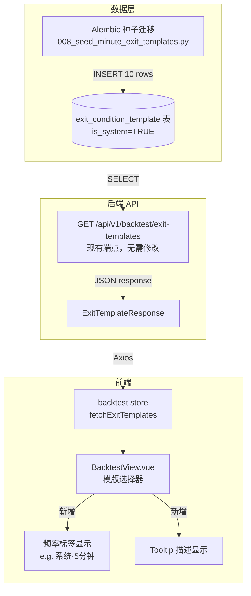

# 设计文档：分钟级平仓条件模版

## 概述

本设计为策略回测系统新增 10 个分钟级（minute-frequency）系统内置平仓条件模版。这些模版以 `ExitConditionConfig` 数据结构存储在 `exit_condition_template` 表中（`is_system=TRUE`），通过 Alembic 种子迁移部署，并与现有模版 API 和前端模版选择器无缝集成。

设计目标：
- **零代码变更**：现有 API 端点、ORM 模型、前端 store 逻辑无需修改，仅新增数据和前端展示增强
- **幂等部署**：种子迁移使用 `ON CONFLICT DO NOTHING`，支持重复执行
- **数据完整性**：所有模版数据严格遵循 `ExitConditionConfig` 序列化规范，支持 round-trip 验证

## 架构



变更范围：

| 层级 | 文件 | 变更类型 |
|------|------|----------|
| 数据迁移 | `alembic/versions/008_seed_minute_exit_templates.py` | 新增 |
| 前端视图 | `frontend/src/views/BacktestView.vue` | 修改（频率标签） |
| 前端 store | `frontend/src/stores/backtest.ts` | 修改（辅助函数） |
| 后端测试 | `tests/properties/test_exit_condition_templates.py` | 新增 |
| 前端测试 | `frontend/src/views/__tests__/BacktestView.test.ts` | 修改 |

## 组件与接口

### 1. 种子迁移脚本

**文件**: `alembic/versions/008_seed_minute_exit_templates.py`

沿用 `007_seed_system_exit_templates.py` 的模式：

```python
revision = "008"
down_revision = "007"

SYSTEM_USER_ID = "00000000-0000-0000-0000-000000000000"

MINUTE_TEMPLATES = [
    {
        "name": "5分钟RSI超买平仓",
        "description": "...",
        "exit_conditions": { "conditions": [...], "logic": "AND" },
    },
    # ... 共 10 个模版
]

def upgrade() -> None:
    for tpl in MINUTE_TEMPLATES:
        # json.dumps + ON CONFLICT DO NOTHING
        op.execute(f"""
            INSERT INTO exit_condition_template
                (user_id, name, description, exit_conditions, is_system, created_at, updated_at)
            VALUES ('{SYSTEM_USER_ID}', ..., TRUE, NOW(), NOW())
            ON CONFLICT DO NOTHING
        """)

def downgrade() -> None:
    # 仅删除本次新增的 10 个分钟级模版，按名称精确匹配
    names = [tpl["name"] for tpl in MINUTE_TEMPLATES]
    name_list = ", ".join(f"'{n}'" for n in names)
    op.execute(f"""
        DELETE FROM exit_condition_template
        WHERE is_system = TRUE AND name IN ({name_list})
    """)
```

关键设计决策：
- **`downgrade()` 按名称删除**而非 `DELETE WHERE is_system = TRUE`，避免误删已有的 5 个日K线系统模版（需求 2.4, 2.5）
- 使用 `ON CONFLICT DO NOTHING` 配合 `idx_exit_condition_template_system_name` 部分唯一索引实现幂等（需求 2.3）

### 2. 10 个分钟级模版定义

以下模版覆盖 RSI、MACD、布林带、均线、DMA 等指标在 1min/5min/15min/30min/60min 频率下的典型平仓策略：

| # | 名称 | 频率 | 指标 | 运算符 | 逻辑 | 策略说明 |
|---|------|------|------|--------|------|----------|
| 1 | 5分钟RSI超买平仓 | 5min | rsi > 80 | > | AND | 5分钟RSI超过80时触发，捕捉短线超买回调 |
| 2 | 15分钟MACD死叉平仓 | 15min | macd_dif cross_down macd_dea | cross_down | AND | 15分钟MACD快线下穿慢线，中短线趋势转弱 |
| 3 | 1分钟价格跌破布林中轨 | 1min | close cross_down boll_middle | cross_down | AND | 1分钟收盘价跌破布林中轨，超短线支撑失守 |
| 4 | 30分钟均线空头排列 | 30min | ma(5) cross_down ma(10) AND ma(10) cross_down ma(20) | cross_down | AND | 30分钟级别短中期均线转空，中线趋势破位 |
| 5 | 60分钟DMA死叉平仓 | 60min | dma cross_down ama | cross_down | AND | 60分钟DMA下穿AMA，小时级别趋势反转 |
| 6 | 5分钟布林上轨突破回落 | 5min | close cross_down boll_upper | cross_down | AND | 5分钟价格从上方跌破布林上轨，短线冲高回落 |
| 7 | 15分钟RSI超卖反弹失败 | 15min | rsi < 30 AND close cross_down ma(10) | <, cross_down | AND | 15分钟RSI低于30且价格跌破MA10，弱势反弹失败 |
| 8 | 1分钟放量下跌 | 1min | close < boll_lower AND volume > threshold | <, > | OR | 1分钟价格跌破布林下轨或成交量异常放大，任一触发 |
| 9 | 30分钟MACD柱状体缩短 | 30min | macd_histogram < 0 AND rsi > 70 | <, > | AND | 30分钟MACD柱状体转负且RSI仍在高位，顶背离信号 |
| 10 | 60分钟价格跌破MA20 | 60min | close cross_down ma(20) | cross_down | AND | 60分钟收盘价跌破20周期均线，小时级别支撑失守 |

指标覆盖统计：
- **指标类型**（≥5）：rsi, macd_dif, macd_dea, macd_histogram, close, boll_middle, boll_upper, boll_lower, ma, dma, ama, volume — 共 12 种 ✓
- **频率**（≥3）：1min, 5min, 15min, 30min, 60min — 共 5 种 ✓
- **运算符**（≥3）：>, <, cross_down — 共 3 种 ✓

### 3. 前端频率标签显示

**文件**: `frontend/src/stores/backtest.ts`

新增辅助函数，从模版的 `exit_conditions` 中提取主要频率：

```typescript
/** 从模版条件中提取主要频率标签 */
export function getTemplateFreqLabel(template: ExitTemplate): string | null {
  const conditions = template.exit_conditions?.conditions ?? []
  if (!conditions.length) return null

  // 收集所有非 daily 频率
  const minuteFreqs = new Set(
    conditions
      .map(c => c.freq)
      .filter(f => f !== 'daily')
  )

  const FREQ_LABEL_MAP: Record<string, string> = {
    '1min': '1分钟',
    '5min': '5分钟',
    '15min': '15分钟',
    '30min': '30分钟',
    '60min': '60分钟',
  }

  if (minuteFreqs.size === 1) {
    const freq = [...minuteFreqs][0]
    return FREQ_LABEL_MAP[freq] ?? null
  }
  if (minuteFreqs.size > 1) {
    return '多频率'
  }
  return null
}
```

**文件**: `frontend/src/views/BacktestView.vue`

模版选择器 `<option>` 渲染逻辑变更：

```html
<!-- 现有 -->
<option ...>[系统] {{ tpl.name }}</option>

<!-- 变更为 -->
<option ...>
  [系统{{ freqLabel(tpl) ? '·' + freqLabel(tpl) : '' }}] {{ tpl.name }}
</option>
```

同时为系统模版选项添加 `title` 属性显示描述 tooltip（需求 5.3）：

```html
<option
  v-for="tpl in systemTemplates"
  :key="tpl.id"
  :value="tpl.id"
  :title="tpl.description || ''"
  class="system-template-option"
>
  [系统{{ freqLabel(tpl) ? '·' + freqLabel(tpl) : '' }}] {{ tpl.name }}
</option>
```

显示效果示例：
- `[系统·5分钟] 5分钟RSI超买平仓`
- `[系统·15分钟] 15分钟MACD死叉平仓`
- `[系统] RSI 超买平仓`（日K线模版无频率标签）

### 4. 现有 API 集成（无需修改）

现有 `GET /api/v1/backtest/exit-templates` 端点已实现：
- 查询 `is_system=TRUE` 的系统模版 + 当前用户模版
- 按 `is_system DESC, updated_at DESC` 排序
- PUT/DELETE 端点已有 `is_system` 保护（返回 403）

新增的 10 个分钟级模版作为 `is_system=TRUE` 的数据行，自动被现有 API 返回，无需任何后端代码变更。

## 数据模型

### ExitConditionConfig 结构（已有，无需修改）

```python
@dataclass
class ExitCondition:
    freq: str           # "1min" | "5min" | "15min" | "30min" | "60min"
    indicator: str      # VALID_INDICATORS 成员
    operator: str       # VALID_OPERATORS 成员
    threshold: float | None = None
    cross_target: str | None = None
    params: dict = field(default_factory=dict)

@dataclass
class ExitConditionConfig:
    conditions: list[ExitCondition] = field(default_factory=list)
    logic: str = "AND"  # "AND" | "OR"
```

### 模版数据示例（模版 #4：30分钟均线空头排列）

```json
{
  "conditions": [
    {
      "freq": "30min",
      "indicator": "ma",
      "operator": "cross_down",
      "threshold": null,
      "cross_target": "ma",
      "params": {"period": 5, "cross_period": 10}
    },
    {
      "freq": "30min",
      "indicator": "ma",
      "operator": "cross_down",
      "threshold": null,
      "cross_target": "ma",
      "params": {"period": 10, "cross_period": 20}
    }
  ],
  "logic": "AND"
}
```

### 数据库表结构（已有，无需修改）

```sql
-- exit_condition_template 表（已存在）
CREATE TABLE exit_condition_template (
    id              UUID PRIMARY KEY DEFAULT gen_random_uuid(),
    user_id         UUID NOT NULL,
    name            VARCHAR(100) NOT NULL,
    description     VARCHAR(500),
    exit_conditions JSONB NOT NULL,
    is_system       BOOLEAN NOT NULL DEFAULT FALSE,
    created_at      TIMESTAMPTZ NOT NULL DEFAULT NOW(),
    updated_at      TIMESTAMPTZ NOT NULL DEFAULT NOW()
);

-- 已有索引
-- idx_exit_condition_template_system_name: UNIQUE(name) WHERE is_system = TRUE
-- idx_exit_condition_template_user_name: UNIQUE(user_id, name) WHERE is_system = FALSE
```

## 正确性属性

*正确性属性是在系统所有有效执行中都应成立的特征或行为——本质上是对系统应做什么的形式化陈述。属性是人类可读规范与机器可验证正确性保证之间的桥梁。*

### Property 1: ExitConditionConfig 序列化 round-trip

*For any* valid `ExitConditionConfig` containing minute-frequency conditions, serializing via `to_dict()` then deserializing via `ExitConditionConfig.from_dict()` SHALL produce an equivalent object — i.e., `ExitConditionConfig.from_dict(config.to_dict()).to_dict() == config.to_dict()`.

**Validates: Requirements 4.1**

### Property 2: ExitCondition 结构有效性

*For any* `ExitCondition` with a minute frequency (`freq` in `{1min, 5min, 15min, 30min, 60min}`):
- `indicator` SHALL be a member of `VALID_INDICATORS`
- `operator` SHALL be a member of `VALID_OPERATORS`
- If `operator` is `cross_up` or `cross_down`, then `cross_target` SHALL be non-null and a member of `VALID_INDICATORS`
- If `indicator` is `ma`, then `params` SHALL contain a `period` key with a positive integer value
- `logic` SHALL be either `"AND"` or `"OR"`

**Validates: Requirements 1.2, 1.6, 4.2, 4.3, 4.4, 4.5**

### Property 3: 模版元数据有效性

*For any* system exit condition template in the registry:
- `name` SHALL be non-empty and ≤ 100 characters
- `description` SHALL be ≤ 500 characters
- All system template names SHALL be unique

**Validates: Requirements 1.7**

## 错误处理

| 场景 | 处理方式 |
|------|----------|
| 迁移执行时模版名称已存在 | `ON CONFLICT DO NOTHING` 静默跳过，保证幂等 |
| `downgrade()` 执行时模版不存在 | `DELETE WHERE name IN (...)` 不报错，0 行受影响 |
| 前端模版加载失败 | 现有 store 错误处理机制，显示加载失败提示 |
| 模版 JSON 解析失败 | `ExitConditionConfig.from_dict()` 抛出 `KeyError`，API 层返回 500 |
| 用户尝试修改/删除系统模版 | 现有 API 返回 HTTP 403 |

## 测试策略

### 属性测试（Property-Based Testing）

使用 **Hypothesis** 库（Python 后端）和 **fast-check** 库（TypeScript 前端）进行属性测试。

**后端属性测试** (`tests/properties/test_exit_condition_templates.py`)：

| 属性 | 测试内容 | 最小迭代次数 |
|------|----------|-------------|
| Property 1 | 生成随机 `ExitConditionConfig`（含分钟频率条件），验证 `from_dict(to_dict(config))` round-trip | 100 |
| Property 2 | 生成随机 `ExitCondition`（分钟频率），验证所有字段约束 | 100 |
| Property 3 | 对 10 个种子模版数据验证元数据约束 | N/A（example-based） |

每个属性测试标注格式：
```python
# Feature: minute-exit-condition-templates, Property 1: ExitConditionConfig round-trip
```

**前端属性测试** (`frontend/src/views/__tests__/BacktestView.property.test.ts`)：

| 属性 | 测试内容 | 最小迭代次数 |
|------|----------|-------------|
| 频率标签提取 | 生成随机 `ExitTemplate`，验证 `getTemplateFreqLabel()` 返回正确标签 | 100 |

### 单元测试（Example-Based）

**后端** (`tests/services/test_minute_exit_templates.py`)：

- 验证 10 个模版数据定义的完整性（需求 1.1）
- 验证指标覆盖 ≥ 5 种（需求 1.3）
- 验证频率覆盖 ≥ 3 种（需求 1.4）
- 验证运算符覆盖 ≥ 3 种（需求 1.5）
- 验证每个模版可被 `ExitConditionConfig.from_dict()` 正确解析

**前端** (`frontend/src/views/__tests__/BacktestView.test.ts`)：

- 验证频率标签在系统模版选项中正确显示（需求 5.1）
- 验证 tooltip 显示模版描述（需求 5.3）
- 验证日K线模版无频率标签

### 集成测试

- 迁移 upgrade/downgrade 幂等性验证（需求 2.3, 2.4, 2.5）
- API 端点返回完整模版列表（需求 3.1, 3.2）
