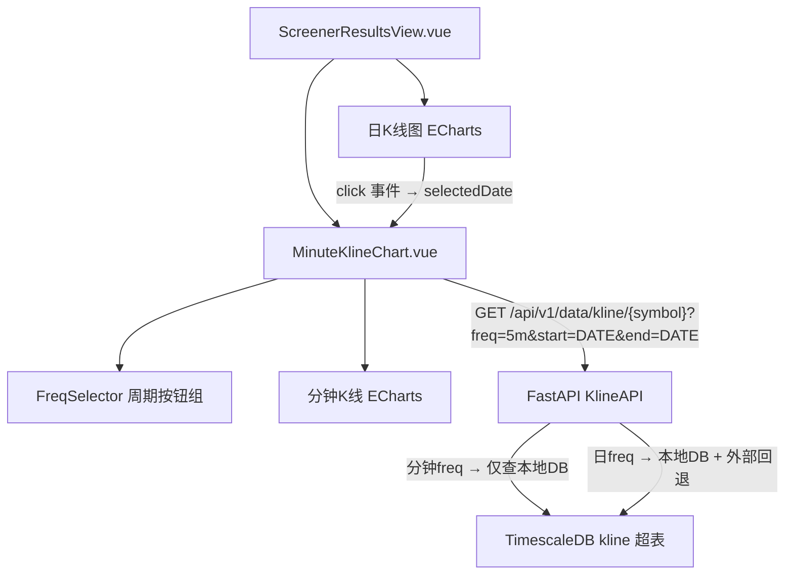

# 技术设计文档：分钟K线图

## 概述

在选股结果页面（`ScreenerResultsView.vue`）的展开详情区域，新增分钟级K线图面板，与现有日K线图左右并排展示。用户可切换 1m/5m/15m/30m/60m 五种分钟周期，并通过点击日K线图上的某根K线联动分钟K线图展示该交易日的日内行情。

分钟K线数据完全从本地 TimescaleDB 获取，复用现有 `GET /api/v1/data/kline/{symbol}` 端点（已支持 freq 参数）。后端需修改该端点，使分钟级查询跳过外部数据源回退逻辑，仅查本地数据库。

前端新增 `MinuteKlineChart.vue` 组件，复用日K线图的 ECharts 配置风格，并在 `ScreenerResultsView.vue` 中集成日K线点击事件联动。

## 架构



数据流：
1. 用户展开股票详情 → 日K线图加载（已有逻辑）+ 分钟K线图加载最近交易日数据
2. 用户点击日K线某根K线 → `selectedDate` 更新 → 分钟K线图重新请求该日数据
3. 用户切换分钟周期 → 分钟K线图以当前 `selectedDate` + 新 `freq` 重新请求数据
4. 前端缓存 `Map<string, bars[]>`，key 为 `${symbol}-${date}-${freq}`，避免重复请求

## 组件与接口

### 前端组件

#### MinuteKlineChart.vue

新增独立组件，接收 props 驱动数据加载和渲染。

```typescript
// Props
interface MinuteKlineChartProps {
  symbol: string              // 股票代码
  selectedDate: string | null // 选中日期 YYYY-MM-DD，null 时使用最近交易日
  latestTradeDate: string     // 日K线数据中最近的交易日期
}

// Emits
interface MinuteKlineChartEmits {
  (e: 'loading', value: boolean): void
}
```

组件内部状态：
- `freq: Ref<string>` — 当前选中周期，默认 `'5m'`
- `bars: Ref<KlineBar[]>` — 当前分钟K线数据
- `loading: Ref<boolean>` — 加载状态
- `error: Ref<string>` — 错误信息
- `cache: Map<string, KlineBar[]>` — 前端缓存

#### ScreenerResultsView.vue 修改

- 新增 `selectedDates: Record<string, string>` — 每只股票的选中日期
- 日K线图 ECharts 实例注册 `click` 事件，更新 `selectedDates[symbol]`
- 日K线图添加 `markLine` 配置，在选中日期位置绘制垂直高亮线
- 详情面板布局从单图改为左右双图（flex 布局，各 50%）
- 响应式：`@media (max-width: 768px)` 切换为上下堆叠

### 后端接口

#### GET /api/v1/data/kline/{symbol}（已有，需修改）

现有端点已支持 `freq` 参数，但分钟级查询时仍会回退到外部数据源。需修改为：

```python
# 分钟级频率集合
MINUTE_FREQS = {"1m", "5m", "15m", "30m", "60m"}

# 在 get_kline 函数中：
# 1. 本地 DB 查询（不变）
# 2. 回退逻辑增加条件判断：
if not bars and freq not in MINUTE_FREQS:
    # 仅非分钟级才回退到外部数据源
    router_svc = DataSourceRouter()
    bars = await router_svc.fetch_kline(...)
```

响应格式不变，与日K线完全一致：

```json
{
  "symbol": "600000",
  "name": "浦发银行",
  "freq": "5m",
  "adj_type": 0,
  "bars": [
    {
      "time": "2024-01-15T09:35:00",
      "open": "10.50",
      "high": "10.55",
      "low": "10.48",
      "close": "10.52",
      "volume": 123456,
      "amount": "1298000.00",
      "turnover": "0.15",
      "vol_ratio": "1.20"
    }
  ]
}
```

## 数据模型

### 现有模型（无需修改）

**Kline ORM 模型**（`app/models/kline.py`）：
- 主键：`(time, symbol, freq)` — 已支持分钟级 freq 值（`1m`, `5m`, `15m`, `30m`, `60m`）
- 索引：`ix_kline_symbol_freq_time` — 按 `(symbol, freq, time)` 索引，分钟级查询可直接命中

**KlineBar 数据传输对象**（`app/models/kline.py`）：
- `from_orm()` / `to_orm()` 方法已通用，无需修改

**KlineRepository**（`app/services/data_engine/kline_repository.py`）：
- `query(symbol, freq, start, end, adj_type)` 方法已通用，传入分钟级 freq 即可正常查询

### 前端数据类型

```typescript
// 复用现有 bar 结构
interface KlineBar {
  time: string
  open: string
  high: string
  low: string
  close: string
  volume: number
  amount: string
  turnover: string
  vol_ratio: string
}

// 缓存 key 格式
type CacheKey = `${string}-${string}-${string}` // symbol-date-freq
```


## 正确性属性

*属性（Property）是在系统所有有效执行中都应成立的特征或行为——本质上是对系统应做什么的形式化陈述。属性是人类可读规格说明与机器可验证正确性保证之间的桥梁。*

### Property 1: 日K线点击提取正确日期

*For any* 有效的日K线 bars 数组和任意有效索引 i，模拟点击 bars[i] 后，selectedDate 应等于 `bars[i].time` 的日期部分（YYYY-MM-DD）。

**Validates: Requirements 3.1**

### Property 2: 分钟K线日期标签格式化

*For any* 有效的日期字符串（YYYY-MM-DD 格式），格式化后的标签应严格匹配 `"YYYY-MM-DD 分钟K线"` 模式。

**Validates: Requirements 3.3**

### Property 3: 分钟K线 API 请求参数构造

*For any* 有效的 symbol、分钟周期 freq（1m/5m/15m/30m/60m）和日期 date，构造的 API 请求 URL 应包含正确的 symbol 路径参数，query 参数中 freq 等于传入的周期，start 和 end 均等于传入的日期。

**Validates: Requirements 5.1**

### Property 4: 前端缓存命中避免重复请求

*For any* 有效的 symbol、freq、date 组合，首次请求后使用相同参数再次请求时，应命中缓存而不发起新的 API 调用。

**Validates: Requirements 5.6**

### Property 5: KlineBar JSON 序列化往返一致性

*For any* 有效的 KlineBar 对象（包含 time、open、high、low、close、volume、amount、turnover、vol_ratio 字段），将其序列化为 JSON 再反序列化后，应产生与原始数据等价的对象。

**Validates: Requirements 6.2, 6.3**

## 错误处理

| 场景 | 处理方式 |
|------|---------|
| 分钟K线 API 请求网络错误/超时 | 分钟K线图区域显示"加载分钟K线失败"错误提示，不影响日K线图 |
| API 返回空 bars 数组 | 分钟K线图区域显示"该交易日暂无分钟K线数据"提示 |
| 分钟级查询本地 DB 无数据 | 后端直接返回空 bars，不回退外部数据源 |
| 日K线图点击事件解析日期失败 | 忽略该次点击，保持当前 selectedDate 不变 |
| ECharts 渲染异常 | 捕获异常，显示错误提示文字 |

## 测试策略

### 单元测试（Example-based）

**前端（Vitest + @vue/test-utils）：**
- `MinuteKlineChart.vue`：验证组件渲染、周期按钮数量和默认选中状态、加载状态显示、空数据提示、错误提示
- `ScreenerResultsView.vue`：验证展开详情后分钟K线面板存在、日K线点击后 markLine 配置更新、响应式布局断点
- 周期切换：点击各周期按钮后验证 API 请求 freq 参数正确
- 联动：修改 selectedDate 后验证分钟K线图重新加载

**后端（pytest）：**
- `get_kline` 端点：验证分钟级 freq 查询不调用 DataSourceRouter
- `get_kline` 端点：验证分钟级 freq 本地无数据时返回空 bars

### 属性测试（Property-based）

**前端（Vitest + fast-check）：**
- Property 1: 日K线点击提取正确日期 — 生成随机 bars 和索引，验证日期提取
- Property 2: 日期标签格式化 — 生成随机日期，验证格式化输出
- Property 3: API 请求参数构造 — 生成随机 symbol/freq/date，验证请求参数
- Property 4: 缓存命中 — 生成随机 key，验证二次请求不发起 API 调用

**后端（pytest + Hypothesis）：**
- Property 5: KlineBar JSON 往返一致性 — 生成随机 KlineBar，验证序列化/反序列化往返

**配置：**
- 每个 property test 最少运行 100 次迭代
- 每个 test 注释标注对应的 design property 编号
- 标签格式：`Feature: minute-kline-chart, Property {N}: {描述}`
