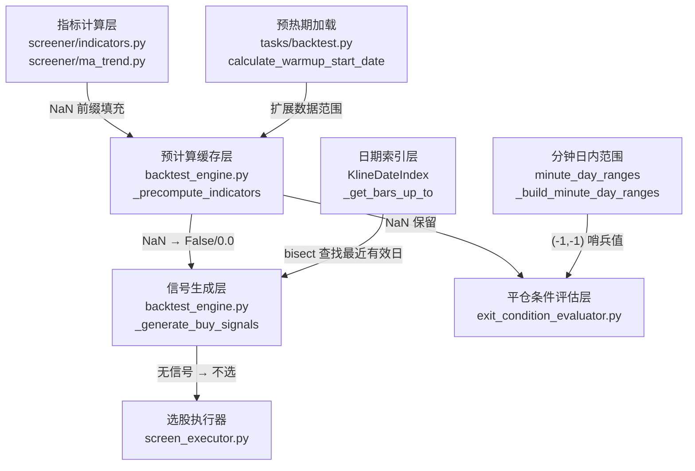
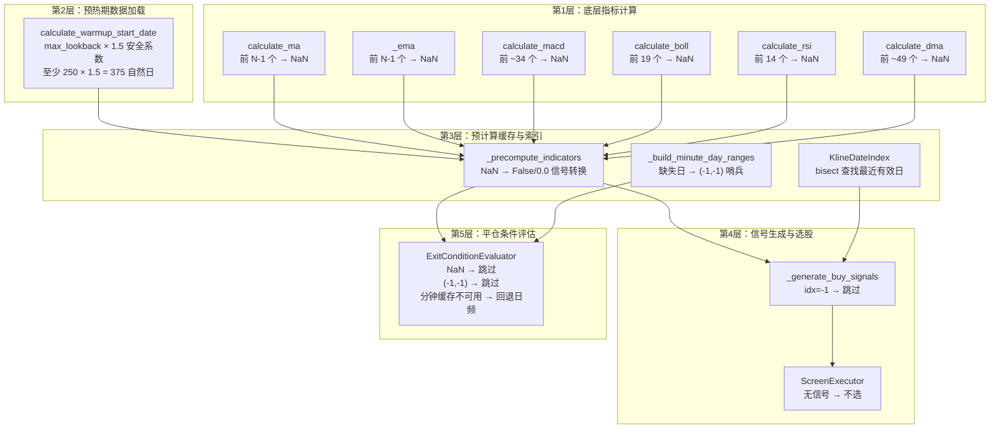
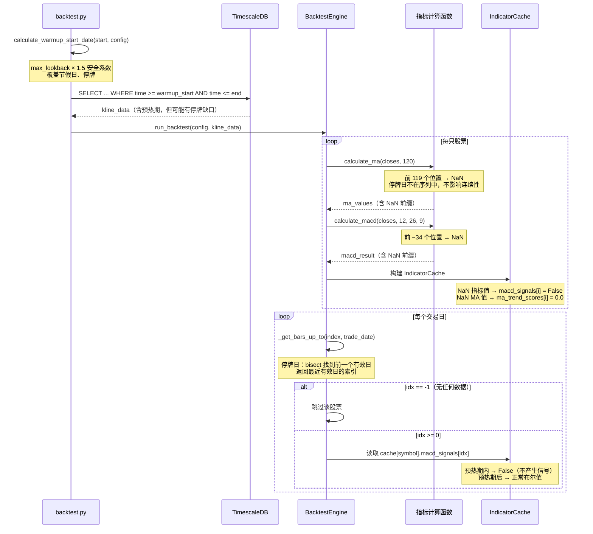
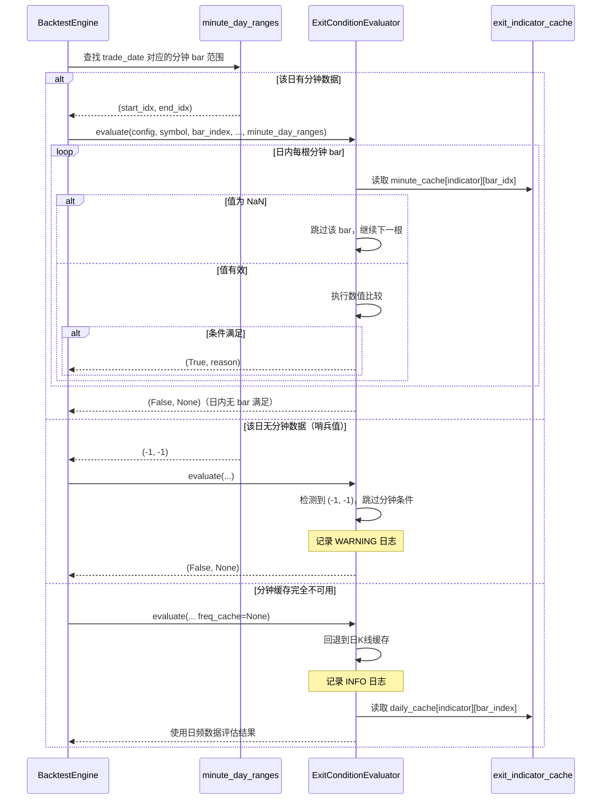
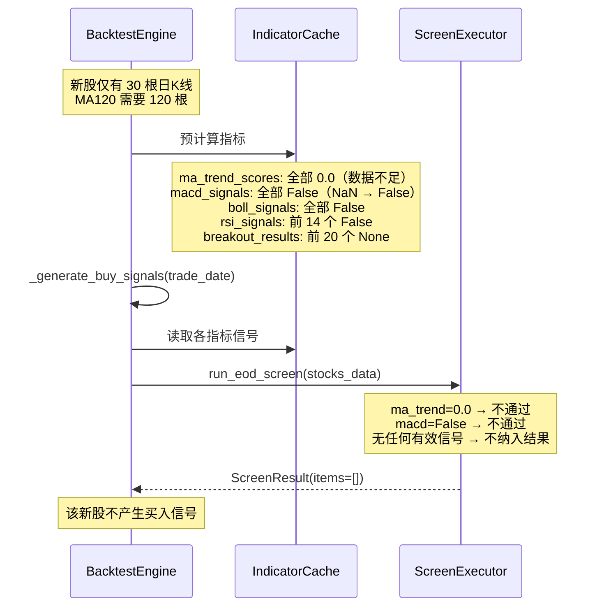

# 设计文档：K线缺失时的指标计算处理机制

## 概述

本文档描述系统在智能选股和策略回测过程中，遇到日K线或分钟K线缺失时如何计算指标数据的完整处理机制。系统采用"NaN 填充 + 跳过无效值"的核心策略，贯穿底层指标计算、预热期数据加载、回测引擎预计算缓存、选股执行器、平仓条件评估器五个层面。

### 核心设计原则

**不插值、不猜测，数据不足就输出 NaN，NaN 等价于"无信号"，宁可漏选也不误选。**

### 变更范围

本 spec 主要是对现有处理逻辑的形式化验证和边界补强，涉及以下文件：



**影响的文件：**
- `app/services/screener/indicators.py` — 底层指标计算函数（MA、EMA、MACD、BOLL、RSI、DMA）
- `app/services/screener/ma_trend.py` — MA 趋势评分和均线支撑检测
- `app/services/screener/breakout.py` — 突破检测
- `app/tasks/backtest.py` — 预热期计算和K线数据加载
- `app/services/backtest_engine.py` — 预计算缓存、日期索引、信号生成、卖出检查
- `app/services/exit_condition_evaluator.py` — 平仓条件评估（日频和分钟频）
- `app/services/screener/screen_executor.py` — 选股执行器

## 架构

### 数据缺失处理的五层架构



## 主要工作流

### 工作流 1：日K线缺失时的回测指标计算



### 工作流 2：分钟K线缺失时的平仓条件评估



### 工作流 3：新股数据不足时的选股处理



## 组件与接口

### 组件 1：底层指标计算函数

**位置**：`app/services/screener/indicators.py`、`app/services/screener/ma_trend.py`

**NaN 填充规则汇总**：

| 函数 | 最小数据量 | NaN 区间 | 空输入行为 | 无效周期行为 |
|------|-----------|----------|-----------|-------------|
| `calculate_ma(closes, N)` | N 根 | `[0, N-2]` | 返回 `[]` | 返回全 NaN |
| `_ema(data, N)` | N 根 | `[0, N-2]` | 返回 `[]` | 返回全 NaN |
| `calculate_macd(closes, fast, slow, signal)` | slow 根 | `[0, slow+signal-2]` | 返回空 MACDResult | — |
| `calculate_boll(closes, period, std_dev)` | period 根 | `[0, period-2]` | 返回空 BOLLResult | — |
| `calculate_rsi(closes, period)` | period+1 根 | `[0, period-1]` | 返回空 RSIResult | — |
| `calculate_dma(closes, short, long)` | long 根 | `[0, long-1]` 及更多 | 返回空 DMAResult | — |

**接口不变**：所有函数签名和返回类型保持不变，本 spec 仅验证和补强边界行为。

### 组件 2：预热期计算

**位置**：`app/tasks/backtest.py`

```python
def calculate_warmup_start_date(
    start_date: date,
    strategy_config: StrategyConfig,
    buffer_days: int = 250,
) -> date:
    """
    根据策略配置中的指标参数，计算所需的预热起始日期。

    算法：
    1. 收集所有指标的最大回看窗口 max_lookback
    2. required_days = max(buffer_days, max_lookback)
    3. calendar_days = int(required_days × 1.5)  # 安全系数
    4. warmup_date = start_date - timedelta(days=calendar_days)

    安全系数 1.5 的依据：
    - A股每年约 250 个交易日 / 365 个自然日 ≈ 0.685
    - 1 / 0.685 ≈ 1.46，取 1.5 留有余量
    - 覆盖春节、国庆等长假期和个股停牌
    """
```

**前置条件**：
- `start_date` 是有效日期
- `strategy_config` 非 None
- `buffer_days >= 0`

**后置条件**：
- `warmup_date < start_date`
- `(start_date - warmup_date).days >= max(strategy_config.ma_periods)`
- `(start_date - warmup_date).days >= buffer_days`
- `(start_date - warmup_date).days >= int(max(buffer_days, max_lookback) * 1.5)`

### 组件 3：日期索引与停牌处理

**位置**：`app/services/backtest_engine.py`

```python
@dataclass
class KlineDateIndex:
    """单只股票的日期→K线索引映射"""
    date_to_idx: dict[date, int]   # 日期 → bars 列表中的索引
    sorted_dates: list[date]       # 排序后的日期列表（用于二分查找）


def _get_bars_up_to(index: KlineDateIndex, trade_date: date) -> int:
    """
    返回 <= trade_date 的最后一个K线索引，无匹配返回 -1。

    使用 bisect_right 在 sorted_dates 上做 O(log N) 二分查找。
    停牌日不在 sorted_dates 中，bisect 自动找到前一个有效日期。
    """
```

**停牌处理语义**：
- K线序列中不包含停牌日的数据（停牌日无K线记录）
- `sorted_dates` 仅包含有实际K线数据的日期
- `bisect_right(sorted_dates, trade_date)` 在停牌日返回前一个有效日期的位置
- 指标基于连续的K线序列计算，停牌期间无新指标值产生
- 回测引擎在停牌日读取的是停牌前最后一个交易日的指标值

### 组件 4：分钟K线日内范围映射

**位置**：`app/services/backtest_engine.py`

```python
def _build_minute_day_ranges(
    kline_data: dict[str, dict[str, list[KlineBar]]],
    existing_cache: dict[str, IndicatorCache],
) -> dict[str, dict[str, list[tuple[int, int]]]]:
    """
    为分钟频率K线数据构建"交易日 → 分钟 bar 索引范围"映射。

    Returns:
        {symbol: {freq: [(start_idx, end_idx), ...]}}
        列表长度等于该股票日K线的交易日数量。
        若某个交易日在分钟数据中无对应 bar，则该位置为 (-1, -1)。
    """
```

**缺失数据处理**：
- 分钟 bar 按 `time.date()` 分组，与日K线日期顺序对齐
- 日K线有但分钟K线无的交易日 → `(-1, -1)` 哨兵值
- 分钟K线有但日K线无的交易日 → 被忽略（不出现在映射中）

### 组件 5：平仓条件评估器的降级策略

**位置**：`app/services/exit_condition_evaluator.py`

**三级降级策略**：

```
分钟频率条件评估
    │
    ├─ 有 minute_day_ranges 且 day_range != (-1, -1)
    │   └─ 日内逐 bar 扫描，NaN 跳过
    │
    ├─ day_range == (-1, -1)
    │   └─ 跳过条件，视为未满足，WARNING 日志
    │
    ├─ minute_day_ranges 不可用
    │   └─ 回退到日频缓存评估，INFO 日志
    │
    └─ 分钟频率缓存完全不可用
        └─ 回退到日频缓存评估，INFO 日志
```

## 数据模型

### NaN 在各数据结构中的表现

| 数据结构 | 字段 | NaN 表现 | 下游处理 |
|----------|------|---------|---------|
| `calculate_ma` 返回值 | `list[float]` | 前 N-1 个为 `float('nan')` | 信号检测函数返回 False |
| `calculate_macd` 返回值 | `MACDResult.dif/dea/macd` | 前 ~34 个为 NaN | 信号检测函数返回 False |
| `IndicatorCache.ma_trend_scores` | `list[float]` | 数据不足时为 0.0（非 NaN） | 选股阈值检查不通过 |
| `IndicatorCache.macd_signals` | `list[bool]` | 数据不足时为 False | 不产生买入信号 |
| `IndicatorCache.boll_signals` | `list[bool]` | 数据不足时为 False | 不产生买入信号 |
| `IndicatorCache.rsi_signals` | `list[bool]` | 数据不足时为 False | 不产生买入信号 |
| `IndicatorCache.dma_values` | `list[tuple\|None]` | 数据不足时为 None | 不产生买入信号 |
| `IndicatorCache.breakout_results` | `list[dict\|None]` | 数据不足时为 None | 不产生买入信号 |
| `exit_indicator_cache` | `dict[str, list[float]]` | NaN 保留在缓存中 | 评估器跳过 NaN |
| `minute_day_ranges` | `list[tuple[int,int]]` | 缺失日为 `(-1, -1)` | 评估器跳过该日 |

## 正确性属性

### Property 1: MA NaN 前缀长度

*For any* 非空收盘价序列 `closes` 和正整数周期 `N`，`calculate_ma(closes, N)` 返回的列表中，前 `min(N-1, len(closes))` 个值应为 NaN。若 `len(closes) >= N`，则从索引 `N-1` 开始的值应为有效浮点数（非 NaN）。

**Validates: Requirements 1.1, 1.2**

### Property 2: EMA NaN 前缀长度

*For any* 非空数值序列 `data` 和正整数周期 `N`，`_ema(data, N)` 返回的列表中，前 `min(N-1, len(data))` 个值应为 NaN。若 `len(data) >= N`，则索引 `N-1` 处的值应为有效浮点数。

**Validates: Requirements 1.3, 1.4**

### Property 3: MACD NaN 传播

*For any* 非空收盘价序列 `closes` 和合法的 MACD 参数 `(fast, slow, signal)`，`calculate_macd(closes, fast, slow, signal)` 返回的 DIF 序列中，前 `slow-1` 个值应为 NaN。若 `len(closes) < slow`，则 DIF 全部为 NaN。

**Validates: Requirement 1.5**

### Property 4: RSI NaN 前缀长度

*For any* 非空收盘价序列 `closes` 和正整数周期 `period`，`calculate_rsi(closes, period)` 返回的值列表中，前 `min(period, len(closes))` 个值应为 NaN。若 `len(closes) < period + 1`，则全部为 NaN。

**Validates: Requirement 1.6**

### Property 5: 空输入安全性

*For any* 指标计算函数（`calculate_ma`、`_ema`、`calculate_macd`、`calculate_boll`、`calculate_rsi`、`calculate_dma`），当输入为空列表时，应返回空结果（空列表或空 Result 对象），不抛出异常。

**Validates: Requirement 1.9**

### Property 6: 预热期充分性

*For any* 有效的 `start_date`、`strategy_config` 和 `buffer_days`，`calculate_warmup_start_date(start_date, strategy_config, buffer_days)` 返回的 `warmup_date` 应满足：
- `warmup_date < start_date`
- `(start_date - warmup_date).days >= max(strategy_config.ma_periods)`
- `(start_date - warmup_date).days >= buffer_days`
- `(start_date - warmup_date).days >= int(max(buffer_days, max(strategy_config.ma_periods)) * 1.5)`

**Validates: Requirements 2.1, 2.2, 2.3**

### Property 7: bisect 查找等价性

*For any* 股票的 K 线序列 `bars` 和对应的 `KlineDateIndex`，对任意日期 `trade_date`，`_get_bars_up_to(index, trade_date)` 返回的索引应等价于朴素线性扫描 `max(i for i, b in enumerate(bars) if b.time.date() <= trade_date)` 的结果（若无匹配则均返回 -1）。

**Validates: Requirements 3.1, 3.2**

### Property 8: 预计算缓存信号安全性

*For any* 股票的 K 线序列和对应的 `IndicatorCache`，对任意索引 `idx`：
- 若 `macd_signals` 非 None，则 `macd_signals[idx]` 为 `bool` 类型（不为 NaN）
- 若 `boll_signals` 非 None，则 `boll_signals[idx]` 为 `bool` 类型
- 若 `rsi_signals` 非 None，则 `rsi_signals[idx]` 为 `bool` 类型
- 若 `ma_trend_scores` 非 None，则 `ma_trend_scores[idx]` 为 `float` 类型且 `0.0 <= value <= 100.0`

**Validates: Requirements 3.5, 3.6, 3.7, 3.8**

### Property 9: 分钟日内范围哨兵值

*For any* 日K线有但分钟K线无的交易日，`_build_minute_day_ranges()` 返回的映射中该交易日的范围应为 `(-1, -1)`。

**Validates: Requirement 4.1**

### Property 10: 分钟 NaN 跳过安全性

*For any* 分钟频率平仓条件的日内扫描，当某根 bar 的指标值为 NaN 时，该 bar 不应触发条件满足。即 NaN 值不会被任何数值比较运算符（`>`、`<`、`>=`、`<=`）视为满足条件。

**Validates: Requirement 4.4**

### Property 11: 选股无信号过滤

*For any* 股票数据中所有指标信号均为 False/0.0/None 的股票，`ScreenExecutor._execute()` 不应将该股票纳入 `ScreenResult.items` 列表。

**Validates: Requirements 5.1, 5.2, 5.3, 5.4**

### Property 12: 指标计算函数共享一致性

*For any* 相同的收盘价序列和相同的指标参数，`_precompute_exit_indicators()` 中使用的指标计算函数（`calculate_ma`、`calculate_macd`、`calculate_rsi`、`calculate_boll`、`calculate_dma`）应与选股引擎中使用的同名函数产生完全相同的结果。

**Validates: Requirement 6.5**

## 错误处理

### 场景 1：新股数据不足

**条件**：某只新股上市不久，K线数据少于最大指标周期（如 MA120 需要 120 根，但仅有 30 根）
**响应**：指标计算函数返回 NaN 前缀，预计算缓存将 NaN 转换为 False/0.0 信号，该股票在数据不足期间不产生买入信号
**恢复**：随着交易日增加，数据积累到足够量后自动产生有效信号

### 场景 2：停牌导致日K线中断

**条件**：某只股票停牌数日或数周，K线序列中无停牌日的数据
**响应**：`_get_bars_up_to` 通过 bisect 找到停牌前最后一个有效日期的索引；指标基于连续K线序列计算，停牌不影响指标连续性；回测引擎在停牌日读取停牌前最后一个交易日的指标值
**恢复**：复牌后新K线数据加入序列，指标自动更新

### 场景 3：分钟K线某日完全缺失

**条件**：某个交易日的分钟K线数据完全缺失（数据源问题或盘中停牌全天）
**响应**：`_build_minute_day_ranges` 为该日生成 `(-1, -1)` 哨兵值；`ExitConditionEvaluator` 检测到哨兵值后跳过分钟频率条件评估，视为条件未满足；记录 WARNING 日志
**恢复**：不影响其他交易日的评估

### 场景 4：分钟K线部分缺失

**条件**：某个交易日的分钟K线数据部分缺失（如仅有上午数据）
**响应**：`_build_minute_day_ranges` 正常生成该日的 `(start_idx, end_idx)` 范围（仅覆盖可用的 bar）；日内扫描遍历可用的分钟 bar，NaN 值跳过，有效值正常评估
**恢复**：不影响评估逻辑，仅基于可用数据评估

### 场景 5：分钟频率缓存完全不可用

**条件**：用户配置了分钟频率平仓条件，但分钟K线数据未加载或不存在
**响应**：`ExitConditionEvaluator` 检测到 `freq_cache` 为 None，回退到日K线频率缓存进行评估；记录 INFO 日志
**恢复**：使用日频数据作为降级方案，保证条件评估不中断

### 场景 6：预热期内数据全部为 NaN

**条件**：某只股票在预热期内的数据量仍不足以计算任何指标
**响应**：所有指标值为 NaN/False/0.0，该股票在整个回测期间不产生买入信号
**恢复**：这是预期行为，不记录额外日志

## 测试策略

### 属性测试（Property-Based Testing）

使用 Hypothesis 进行属性测试，每个属性测试最少 100 次迭代。

**属性测试文件**：`tests/properties/test_missing_kline_properties.py`

| 属性 | 测试内容 | 标签 |
|------|---------|------|
| Property 1 | MA NaN 前缀长度 | `Feature: missing-kline-data-handling, Property 1: MA NaN prefix` |
| Property 2 | EMA NaN 前缀长度 | `Feature: missing-kline-data-handling, Property 2: EMA NaN prefix` |
| Property 3 | MACD NaN 传播 | `Feature: missing-kline-data-handling, Property 3: MACD NaN propagation` |
| Property 4 | RSI NaN 前缀长度 | `Feature: missing-kline-data-handling, Property 4: RSI NaN prefix` |
| Property 5 | 空输入安全性 | `Feature: missing-kline-data-handling, Property 5: empty input safety` |
| Property 6 | 预热期充分性 | `Feature: missing-kline-data-handling, Property 6: warmup sufficiency` |
| Property 7 | bisect 查找等价性 | `Feature: missing-kline-data-handling, Property 7: bisect equivalence` |
| Property 8 | 预计算缓存信号安全性 | `Feature: missing-kline-data-handling, Property 8: cache signal safety` |
| Property 9 | 分钟日内范围哨兵值 | `Feature: missing-kline-data-handling, Property 9: minute sentinel` |
| Property 10 | 分钟 NaN 跳过安全性 | `Feature: missing-kline-data-handling, Property 10: minute NaN skip` |
| Property 11 | 选股无信号过滤 | `Feature: missing-kline-data-handling, Property 11: screen no-signal filter` |
| Property 12 | 指标计算函数共享一致性 | `Feature: missing-kline-data-handling, Property 12: indicator function sharing` |

### 单元测试

**测试文件**：`tests/services/test_missing_kline_handling.py`

- 各指标函数的边界条件：空输入、单元素输入、恰好等于周期的输入、周期为 0 或负数
- `_get_bars_up_to` 的停牌场景：连续停牌、首日停牌、末日停牌
- `_build_minute_day_ranges` 的缺失场景：全天缺失、部分缺失、多日连续缺失
- `ExitConditionEvaluator` 的降级场景：哨兵值跳过、NaN 跳过、回退日频

### 集成测试

**测试文件**：`tests/integration/test_missing_kline_integration.py`

- 端到端回测：构造含停牌股票的K线数据，验证回测不中断且停牌股票不产生错误信号
- 新股场景：构造仅有 30 根K线的新股，验证不产生买入信号
- 分钟缺失场景：构造部分交易日无分钟数据的K线，验证平仓条件正确降级

## 性能考量

本 spec 不引入新的性能开销。所有处理逻辑（NaN 填充、bisect 查找、哨兵值检查）已在现有代码中实现，本 spec 仅进行形式化验证和边界补强。

| 操作 | 复杂度 | 说明 |
|------|--------|------|
| NaN 前缀填充 | O(1) per element | 指标函数内部已实现 |
| bisect 查找 | O(log N) | 已在 `_get_bars_up_to` 中实现 |
| 哨兵值检查 | O(1) | 元组比较 |
| NaN 跳过 | O(1) per bar | `math.isnan()` 检查 |
| 分钟缓存回退 | O(1) | 字典查找 |

## 安全考量

本 spec 不涉及安全相关变更。所有修改限于内部计算逻辑的验证和测试补强，不影响 API 接口、认证、授权或数据访问控制。

## 依赖

- 无新增外部依赖
- 使用 Python 标准库 `math.isnan()`、`bisect.bisect_right`
- 依赖现有的 `app.services.screener` 子模块（indicators, ma_trend, breakout）
- 依赖现有的 `app.core.schemas` 数据类
- 测试依赖 Hypothesis 库（已在项目中使用）
