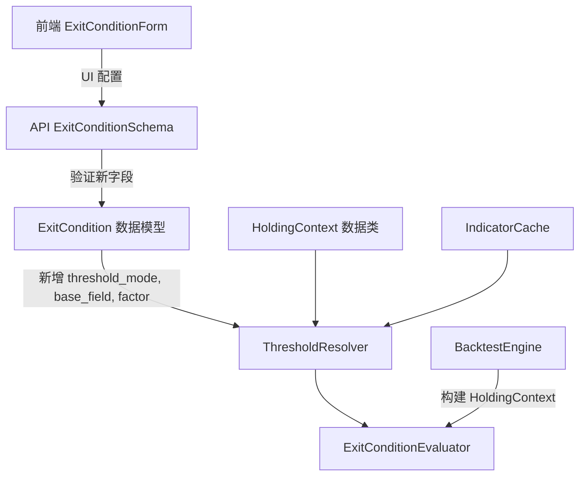
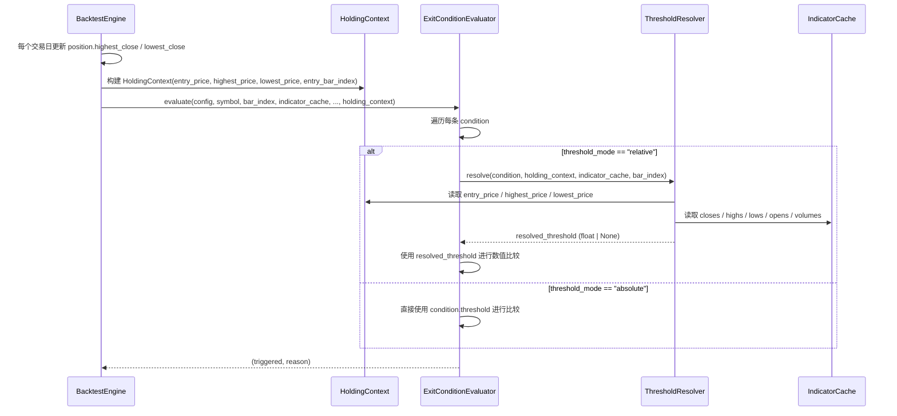

# 设计文档：平仓条件相对值阈值支持

## 概述

本功能在现有自定义平仓条件系统（backtest-exit-conditions spec，任务 1-29 已完成）基础上，引入"相对值阈值"机制。核心变更是让 `ExitCondition` 的阈值不再局限于固定浮点数，而是可以在回测运行时根据持仓上下文（买入价、最高价、均量等）动态计算。

### 变更范围



**影响的文件：**
- `app/core/schemas.py` — ExitCondition 扩展 + HoldingContext 新增
- `app/services/threshold_resolver.py` — 新增模块
- `app/services/exit_condition_evaluator.py` — 集成 ThresholdResolver
- `app/services/backtest_engine.py` — 构建 HoldingContext、扩展 IndicatorCache
- `app/api/v1/backtest.py` — API 验证扩展
- `frontend/src/stores/backtest.ts` — 状态扩展
- `frontend/src/views/BacktestView.vue` — UI 扩展

### 设计原则

1. **向后兼容**：所有现有 `threshold_mode="absolute"` 的条件行为不变，缺失 `threshold_mode` 字段时默认为 `"absolute"`
2. **最小侵入**：ThresholdResolver 作为独立纯函数模块，ExitConditionEvaluator 仅在数值比较时调用它
3. **与现有架构一致**：HoldingContext 定义在 `app/core/schemas.py`（纯 dataclass），遵循项目约定

## 架构

### 组件交互流程



### 数据流

1. **配置时**：用户在前端选择 `threshold_mode="relative"`，配置 `base_field` 和 `factor`
2. **API 层**：`ExitConditionSchema` 验证新字段合法性
3. **序列化**：`ExitCondition.from_dict()` 还原相对值字段
4. **回测时**：BacktestEngine 为每个持仓构建 `HoldingContext`，传递给 ExitConditionEvaluator
5. **解析时**：ThresholdResolver 根据 `base_field` 从 HoldingContext 或 IndicatorCache 读取基准值，乘以 `factor` 得到实际阈值
6. **评估时**：ExitConditionEvaluator 使用解析后的阈值进行数值比较

## 组件与接口

### 1. HoldingContext 数据类

定义在 `app/core/schemas.py` 中，作为纯 dataclass：

```python
@dataclass
class HoldingContext:
    """持仓上下文，用于相对值阈值的动态解析。"""
    entry_price: float          # 买入价
    highest_price: float        # 买入后至当前交易日的最高收盘价
    lowest_price: float         # 买入后至当前交易日的最低收盘价
    entry_bar_index: int        # 买入时的 bar 索引
```

### 2. ExitCondition 扩展

在现有 `ExitCondition` dataclass 中新增三个字段：

```python
@dataclass
class ExitCondition:
    freq: str
    indicator: str
    operator: str
    threshold: float | None = None
    cross_target: str | None = None
    params: dict = field(default_factory=dict)
    # --- 新增字段 ---
    threshold_mode: str = "absolute"    # "absolute" | "relative"
    base_field: str | None = None       # 相对值基准字段
    factor: float | None = None         # 乘数因子
```

`to_dict()` 和 `from_dict()` 方法扩展以包含新字段，`from_dict()` 在 `threshold_mode` 缺失时默认为 `"absolute"`。

### 3. ThresholdResolver 模块

新建 `app/services/threshold_resolver.py`，实现为纯函数：

```python
VALID_BASE_FIELDS = {
    "entry_price", "highest_price", "lowest_price",
    "prev_close", "prev_high", "prev_low",
    "today_open",
    "prev_bar_open", "prev_bar_high", "prev_bar_low", "prev_bar_close",
    "ma_volume",
}

def resolve_threshold(
    condition: ExitCondition,
    holding_context: HoldingContext | None,
    indicator_cache: IndicatorCache,
    bar_index: int,
) -> float | None:
    """
    解析平仓条件的阈值。

    - absolute 模式：直接返回 condition.threshold
    - relative 模式：根据 base_field 获取基准值，乘以 factor 返回

    Returns:
        解析后的浮点数阈值，或 None（解析失败时）
    """
```

**base_field 解析逻辑：**

| base_field | 数据来源 | 计算公式 |
|---|---|---|
| `entry_price` | HoldingContext.entry_price | entry_price × factor |
| `highest_price` | HoldingContext.highest_price | highest_price × factor |
| `lowest_price` | HoldingContext.lowest_price | lowest_price × factor |
| `prev_close` | IndicatorCache.closes[bar_index - 1] | prev_close × factor |
| `prev_high` | IndicatorCache.highs[bar_index - 1] | prev_high × factor |
| `prev_low` | IndicatorCache.lows[bar_index - 1] | prev_low × factor |
| `today_open` | IndicatorCache.opens[bar_index] | today_open × factor |
| `prev_bar_open` | IndicatorCache.opens[bar_index - 1] | prev_bar_open × factor |
| `prev_bar_high` | IndicatorCache.highs[bar_index - 1] | prev_bar_high × factor |
| `prev_bar_low` | IndicatorCache.lows[bar_index - 1] | prev_bar_low × factor |
| `prev_bar_close` | IndicatorCache.closes[bar_index - 1] | prev_bar_close × factor |
| `ma_volume` | IndicatorCache.volumes[bar_index-N+1:bar_index+1] | mean(volumes) × factor |

> 注意：`prev_high` 与 `prev_bar_high` 在日K线频率下语义相同（前一日最高价 = 上一根K线最高价），但在分钟K线频率下语义不同。当前实现统一使用 IndicatorCache 的 `highs[bar_index - 1]`，因为 IndicatorCache 的索引与 K 线 bar 一一对应。

### 4. IndicatorCache 扩展

在 `IndicatorCache` 中新增 `opens` 字段，用于支持 `today_open` 和 `prev_bar_open` 基准字段：

```python
@dataclass
class IndicatorCache:
    closes: list[float]
    highs: list[float]
    lows: list[float]
    opens: list[float]          # 新增：开盘价序列
    volumes: list[int]
    amounts: list[Decimal]
    turnovers: list[Decimal]
    # ... 其余字段不变
```

`_precompute_indicators()` 函数在构建 IndicatorCache 时同步填充 `opens`：

```python
opens = [float(b.open) for b in bars]
ic = IndicatorCache(closes=closes, highs=highs, lows=lows, opens=opens, ...)
```

### 5. ExitConditionEvaluator 集成

修改 `evaluate()` 方法签名，新增可选 `holding_context` 参数：

```python
def evaluate(
    self,
    config: ExitConditionConfig,
    symbol: str,
    bar_index: int,
    indicator_cache: IndicatorCache,
    exit_indicator_cache: dict[str, dict[str, list[float]]] | None = None,
    minute_day_ranges: dict[str, list[tuple[int, int]]] | None = None,
    holding_context: HoldingContext | None = None,  # 新增
) -> tuple[bool, str | None]:
```

在 `_evaluate_single()` 中，数值比较前调用 ThresholdResolver：

```python
def _evaluate_single(self, condition, bar_index, indicator_cache, exit_indicator_cache, holding_context=None):
    # ...
    if condition.operator in _NUMERIC_OPS:
        from app.services.threshold_resolver import resolve_threshold
        resolved = resolve_threshold(condition, holding_context, indicator_cache, bar_index)
        if resolved is None:
            logger.warning("Threshold resolution failed for %s, skipping", condition.indicator)
            return False, ""
        # 使用 resolved 替代 condition.threshold 进行比较
        triggered = op_fn(value, resolved)
        # 构建 reason 字符串
        if condition.threshold_mode == "relative":
            reason = f"{condition.indicator.upper()} {operator} {resolved:.4f}（{condition.base_field}×{condition.factor}）"
        else:
            reason = f"{condition.indicator.upper()} {operator} {resolved}"
        return triggered, reason
```

分钟频率扫描方法 `_evaluate_single_minute_scanning()` 同样需要集成 ThresholdResolver。

### 6. BacktestEngine 持仓上下文传递

#### 6.1 _BacktestPosition 扩展

在 `_BacktestPosition` 中新增 `lowest_close` 字段：

```python
@dataclass
class _BacktestPosition:
    symbol: str
    quantity: int
    cost_price: Decimal
    buy_date: date
    buy_trade_day_index: int
    highest_close: Decimal
    lowest_close: Decimal = Decimal("999999999")  # 新增：持仓期间最低收盘价
    sector: str = ""
    pending_sell: _SellSignal | None = None
```

#### 6.2 _check_sell_conditions 中构建 HoldingContext

在 `_check_sell_conditions()` 方法中，更新 `lowest_close` 并构建 `HoldingContext`：

```python
# 更新最低收盘价（与 highest_close 更新逻辑对称）
if close < position.lowest_close:
    position.lowest_close = close

# 构建 HoldingContext
holding_context = HoldingContext(
    entry_price=float(position.cost_price),
    highest_price=float(position.highest_close),
    lowest_price=float(position.lowest_close),
    entry_bar_index=position.buy_trade_day_index,
)

# 传递给 evaluator
triggered, reason = evaluator.evaluate(
    config.exit_conditions,
    position.symbol,
    bar_index,
    sym_ic,
    sym_exit_cache,
    minute_day_ranges=sym_minute_day_ranges,
    holding_context=holding_context,  # 新增
)
```

#### 6.3 买入时初始化 lowest_close

在创建 `_BacktestPosition` 时，`lowest_close` 初始化为买入价（与 `highest_close` 对称）：

```python
_BacktestPosition(
    symbol=...,
    cost_price=open_price,
    highest_close=open_price,
    lowest_close=open_price,  # 新增
    ...
)
```

### 7. API 验证扩展

在 `app/api/v1/backtest.py` 的 `ExitConditionSchema` 中新增字段和验证：

```python
class ExitConditionSchema(BaseModel):
    freq: str = "daily"
    indicator: str
    operator: str
    threshold: float | None = None
    cross_target: str | None = None
    params: dict = Field(default_factory=dict)
    # --- 新增字段 ---
    threshold_mode: str = "absolute"
    base_field: str | None = None
    factor: float | None = None

    @model_validator(mode="after")
    def validate_condition(self) -> "ExitConditionSchema":
        # ... 现有验证逻辑 ...

        # 相对值模式验证
        if self.threshold_mode == "relative":
            if not self.base_field or self.base_field not in VALID_BASE_FIELDS:
                raise ValueError(f"相对值模式需要有效的 base_field，支持: {', '.join(sorted(VALID_BASE_FIELDS))}")
            if self.factor is None or self.factor <= 0:
                raise ValueError("相对值模式需要正数 factor")
        elif self.threshold_mode == "absolute":
            # 保持现有验证：数值比较运算符需要 threshold
            if self.operator not in ("cross_up", "cross_down") and self.threshold is None:
                raise ValueError("数值比较运算符需要指定 threshold")
        elif self.threshold_mode not in ("absolute", "relative"):
            raise ValueError(f"无效的 threshold_mode: {self.threshold_mode}，支持: absolute, relative")

        return self
```

`VALID_BASE_FIELDS` 从 `threshold_resolver.py` 导入或在 `schemas.py` 中定义为常量。

### 8. 前端组件扩展

#### 8.1 ExitConditionForm 接口扩展

```typescript
export interface ExitConditionForm {
  freq: 'daily' | '1min' | '5min' | '15min' | '30min' | '60min'
  indicator: string
  operator: string
  threshold: number | null
  crossTarget: string | null
  params: Record<string, number>
  // --- 新增字段 ---
  thresholdMode: 'absolute' | 'relative'
  baseField: string | null
  factor: number | null
}
```

#### 8.2 基准字段选项定义

```typescript
export const BASE_FIELD_OPTIONS = [
  { group: '持仓相关', options: [
    { value: 'entry_price', label: '买入价' },
    { value: 'highest_price', label: '持仓最高价' },
    { value: 'lowest_price', label: '持仓最低价' },
  ]},
  { group: '前一日行情', options: [
    { value: 'prev_close', label: '前一日收盘价' },
    { value: 'prev_high', label: '前一日最高价' },
    { value: 'prev_low', label: '前一日最低价' },
  ]},
  { group: '当日行情', options: [
    { value: 'today_open', label: '今日开盘价' },
  ]},
  { group: '上一根K线', options: [
    { value: 'prev_bar_open', label: '上一根K线开盘价' },
    { value: 'prev_bar_high', label: '上一根K线最高价' },
    { value: 'prev_bar_low', label: '上一根K线最低价' },
    { value: 'prev_bar_close', label: '上一根K线收盘价' },
  ]},
  { group: '成交量', options: [
    { value: 'ma_volume', label: 'N日均量' },
  ]},
] as const
```

#### 8.3 序列化/反序列化

`startBacktest()` 中序列化时 camelCase → snake_case：

```typescript
conditions: exitConds.conditions.map((c) => ({
  freq: c.freq,
  indicator: c.indicator,
  operator: c.operator,
  threshold: c.threshold,
  cross_target: c.crossTarget,
  params: c.params,
  threshold_mode: c.thresholdMode,
  base_field: c.baseField,
  factor: c.factor,
}))
```

`loadExitTemplate()` 中反序列化时 snake_case → camelCase：

```typescript
conditions: (tpl.exit_conditions.conditions ?? []).map((c) => ({
  // ... 现有字段 ...
  thresholdMode: (c.threshold_mode ?? 'absolute') as 'absolute' | 'relative',
  baseField: c.base_field ?? null,
  factor: c.factor ?? null,
}))
```

#### 8.4 UI 条件行扩展

在每个条件行中，当运算符为数值比较（非 cross）时，显示阈值模式切换：

- **绝对值模式**：显示现有阈值输入框
- **相对值模式**：显示基准字段下拉框 + 乘数因子输入框
- 选择 `ma_volume` 时额外显示均量周期输入框
- 切换模式时清空另一模式的字段值

## 数据模型

### ExitCondition 字段变更

| 字段 | 类型 | 默认值 | 说明 |
|---|---|---|---|
| `threshold_mode` | `str` | `"absolute"` | 阈值模式：`"absolute"` 或 `"relative"` |
| `base_field` | `str \| None` | `None` | 相对值基准字段（12 种合法取值） |
| `factor` | `float \| None` | `None` | 乘数因子（正浮点数） |

### HoldingContext 字段

| 字段 | 类型 | 说明 |
|---|---|---|
| `entry_price` | `float` | 买入价 |
| `highest_price` | `float` | 买入后至当前交易日的最高收盘价 |
| `lowest_price` | `float` | 买入后至当前交易日的最低收盘价 |
| `entry_bar_index` | `int` | 买入时的 bar 索引 |

### IndicatorCache 字段变更

| 字段 | 类型 | 说明 |
|---|---|---|
| `opens` | `list[float]` | 新增：开盘价序列，与 K 线 bar 等长 |

### _BacktestPosition 字段变更

| 字段 | 类型 | 默认值 | 说明 |
|---|---|---|---|
| `lowest_close` | `Decimal` | `Decimal("999999999")` | 新增：持仓期间最低收盘价 |

### 合法 base_field 取值

```python
VALID_BASE_FIELDS = {
    "entry_price", "highest_price", "lowest_price",
    "prev_close", "prev_high", "prev_low",
    "today_open",
    "prev_bar_open", "prev_bar_high", "prev_bar_low", "prev_bar_close",
    "ma_volume",
}
```


## 正确性属性

*正确性属性是一种在系统所有合法执行中都应成立的特征或行为——本质上是对系统应做什么的形式化陈述。属性是人类可读规格说明与机器可验证正确性保证之间的桥梁。*

### Property 1: ExitCondition 序列化往返一致性

*对任意*合法的 ExitCondition 对象（包含 `threshold_mode="absolute"` 和 `threshold_mode="relative"` 两种模式），`ExitCondition.from_dict(condition.to_dict())` 应产生与原对象等价的结果。新增的 `threshold_mode`、`base_field`、`factor` 字段在往返后应完全保留。

**Validates: Requirements 1.6, 1.7, 1.9**

### Property 2: 缺失 threshold_mode 的向后兼容

*对任意*不包含 `threshold_mode` 字段的合法旧版 ExitCondition 字典，`ExitCondition.from_dict()` 应将 `threshold_mode` 默认设为 `"absolute"`，且 `base_field` 为 `None`，`factor` 为 `None`。同样，前端 `loadExitTemplate()` 在加载不包含 `threshold_mode` 的旧版模版时，应默认设置 `thresholdMode` 为 `'absolute'`。

**Validates: Requirements 1.8, 7.4, 8.3**

### Property 3: 绝对值模式向后兼容

*对任意*合法的 `threshold_mode="absolute"` 的 ExitCondition、任意指标值和任意 `holding_context`（包括 `None`），ThresholdResolver 应直接返回 `condition.threshold` 的值，ExitConditionEvaluator 的比较结果应与直接使用 `condition.threshold` 进行 Python 原生比较一致。

**Validates: Requirements 1.2, 3.2, 4.4**

### Property 4: HoldingContext 基准字段解析

*对任意*合法的 HoldingContext 和正数 factor，当 `base_field` 为 `entry_price`、`highest_price` 或 `lowest_price` 时，ThresholdResolver 应返回对应 HoldingContext 字段值乘以 factor 的结果。即 `resolve(condition, ctx, ...) == getattr(ctx, base_field) * factor`。

**Validates: Requirements 3.3, 3.4, 3.5**

### Property 5: IndicatorCache 基准字段解析

*对任意*合法的 IndicatorCache（closes、highs、lows、opens 序列长度 ≥ 2）、合法的 bar_index（≥ 1）和正数 factor，当 `base_field` 为 `prev_close`、`prev_high`、`prev_low`、`today_open`、`prev_bar_open`、`prev_bar_high`、`prev_bar_low` 或 `prev_bar_close` 时，ThresholdResolver 应返回对应 IndicatorCache 序列在正确索引处的值乘以 factor 的结果。

**Validates: Requirements 3.6, 3.7, 3.8, 3.9, 3.10, 3.11, 3.12, 3.13**

### Property 6: ma_volume 基准字段解析

*对任意*合法的 IndicatorCache（volumes 序列长度 ≥ N）、合法的 bar_index（≥ N-1）、正整数 N（ma_volume_period）和正数 factor，当 `base_field` 为 `ma_volume` 时，ThresholdResolver 应返回 `mean(volumes[bar_index-N+1 : bar_index+1]) × factor`。

**Validates: Requirements 3.14**

### Property 7: 评估器使用解析后阈值

*对任意*合法的 `threshold_mode="relative"` 的 ExitCondition（数值比较运算符）、合法的 HoldingContext 和 IndicatorCache，ExitConditionEvaluator 的比较结果应等价于使用 ThresholdResolver 解析后的阈值进行 Python 原生比较。即评估器不直接使用 `condition.threshold`，而是使用解析后的值。

**Validates: Requirements 4.2**

### Property 8: 交叉条件不受相对值阈值影响

*对任意*合法的 `cross_up` 或 `cross_down` 条件，无论 `threshold_mode` 设为 `"absolute"` 还是 `"relative"`，ExitConditionEvaluator 的评估结果应完全相同。交叉条件仅依赖 `cross_target`，不使用阈值。

**Validates: Requirements 4.6**

### Property 9: 触发原因格式包含解析信息

*对任意*被触发的 `threshold_mode="relative"` 的平仓条件，触发原因字符串应包含解析后的实际阈值数值和基准信息，格式为 `"{INDICATOR} {operator} {resolved_value}（{base_field}×{factor}）"`。

**Validates: Requirements 4.5, 9.1**

### Property 10: 持仓上下文极值跟踪不变量

*对任意*持仓和任意收盘价序列，在 BacktestEngine 的每个交易日更新后，`position.highest_close` 应始终等于买入后至当前交易日所有收盘价的最大值，`position.lowest_close` 应始终等于买入后至当前交易日所有收盘价的最小值。

**Validates: Requirements 2.2**

### Property 11: 前端 ExitConditionForm 序列化往返一致性

*对任意*合法的 ExitConditionForm 对象（包含 `thresholdMode`、`baseField`、`factor` 字段），序列化为 snake_case JSON 后再反序列化回 camelCase 应产生与原对象等价的结果。缺失 `threshold_mode` 的旧版数据应默认为 `'absolute'`。

**Validates: Requirements 7.2, 7.3, 7.4, 7.5**

### Property 12: 前端模式切换清空对立字段

*对任意*前端 ExitConditionForm 状态，当 `thresholdMode` 从 `'absolute'` 切换为 `'relative'` 时，`threshold` 应被清空为 `null`；当从 `'relative'` 切换为 `'absolute'` 时，`baseField` 和 `factor` 应被清空为 `null`。

**Validates: Requirements 6.7**

## 错误处理

### ThresholdResolver 错误处理

| 场景 | 行为 | 日志级别 |
|---|---|---|
| `base_field` 不在合法取值范围内 | 返回 `None` | ERROR |
| 基准值为 `None` 或 `NaN`（如 bar_index=0 时无 prev_close） | 返回 `None` | WARNING |
| `factor` 为 `None` 或非正数 | 返回 `None` | WARNING |
| `holding_context` 为 `None` 且 `threshold_mode="relative"` 且 `base_field` 需要 HoldingContext | 返回 `None` | WARNING |
| `ma_volume` 的 volumes 数据不足 N 日 | 返回 `None` | WARNING |

### ExitConditionEvaluator 错误处理

| 场景 | 行为 | 日志级别 |
|---|---|---|
| ThresholdResolver 返回 `None` | 跳过该条件（视为未满足） | WARNING |
| `holding_context` 未提供且存在 `relative` 条件 | 跳过所有 `relative` 条件 | WARNING |
| 评估过程中抛出异常 | 捕获异常，跳过该条件（现有行为） | EXCEPTION |

### API 验证错误

| 场景 | HTTP 状态码 | 错误信息 |
|---|---|---|
| `threshold_mode` 不是 `"absolute"` 或 `"relative"` | 422 | `"无效的 threshold_mode"` |
| `relative` 模式缺少 `base_field` | 422 | `"相对值模式需要有效的 base_field"` |
| `relative` 模式 `base_field` 不在合法集合中 | 422 | `"相对值模式需要有效的 base_field"` |
| `relative` 模式缺少 `factor` 或 `factor ≤ 0` | 422 | `"相对值模式需要正数 factor"` |

### 向后兼容保证

- 所有现有 API 请求（不含 `threshold_mode` 字段）行为不变
- 所有现有模版（不含 `threshold_mode` 字段）加载后默认为 `"absolute"` 模式
- 所有现有 `ExitCondition` 序列化数据反序列化后行为不变
- `_check_sell_conditions()` 在 `exit_conditions=None` 时行为不变

## 测试策略

### 属性测试（Property-Based Testing）

使用 Hypothesis（后端）和 fast-check（前端）进行属性测试，每个属性测试最少 100 次迭代。

**后端属性测试**（`tests/properties/test_relative_threshold_properties.py`）：

| 属性 | 测试内容 | 标签 |
|---|---|---|
| Property 1 | ExitCondition 序列化往返 | `Feature: relative-exit-thresholds, Property 1: ExitCondition round-trip` |
| Property 2 | 缺失 threshold_mode 向后兼容 | `Feature: relative-exit-thresholds, Property 2: backward compat` |
| Property 3 | 绝对值模式向后兼容 | `Feature: relative-exit-thresholds, Property 3: absolute mode compat` |
| Property 4 | HoldingContext 基准字段解析 | `Feature: relative-exit-thresholds, Property 4: HoldingContext resolution` |
| Property 5 | IndicatorCache 基准字段解析 | `Feature: relative-exit-thresholds, Property 5: IndicatorCache resolution` |
| Property 6 | ma_volume 基准字段解析 | `Feature: relative-exit-thresholds, Property 6: ma_volume resolution` |
| Property 7 | 评估器使用解析后阈值 | `Feature: relative-exit-thresholds, Property 7: evaluator uses resolved threshold` |
| Property 8 | 交叉条件不受影响 | `Feature: relative-exit-thresholds, Property 8: cross unaffected` |
| Property 9 | 触发原因格式 | `Feature: relative-exit-thresholds, Property 9: reason format` |
| Property 10 | 极值跟踪不变量 | `Feature: relative-exit-thresholds, Property 10: extrema tracking` |

**前端属性测试**（`frontend/src/stores/__tests__/backtest.property.test.ts`）：

| 属性 | 测试内容 | 标签 |
|---|---|---|
| Property 11 | ExitConditionForm 序列化往返 | `Feature: relative-exit-thresholds, Property 11: frontend round-trip` |
| Property 12 | 模式切换清空对立字段 | `Feature: relative-exit-thresholds, Property 12: mode switch clears fields` |

### 单元测试

**后端单元测试：**

- `tests/services/test_threshold_resolver.py`：ThresholdResolver 各 base_field 的具体计算、边界条件（bar_index=0、NaN、None）、无效 base_field、无效 factor
- `tests/services/test_exit_condition_evaluator.py`（扩展）：relative 条件评估、holding_context 传递、reason 格式
- `tests/services/test_exit_condition_integration.py`（扩展）：BacktestEngine 构建 HoldingContext、lowest_close 跟踪
- `tests/api/test_backtest_api.py`（扩展）：API 验证新字段

**前端单元测试：**

- `frontend/src/views/__tests__/BacktestView.test.ts`（扩展）：阈值模式切换 UI、基准字段下拉框、乘数因子输入框
- `frontend/src/stores/__tests__/backtest.test.ts`（扩展）：序列化/反序列化新字段

### 集成测试

- 端到端回测流程：配置相对值条件 → API 提交 → 回测执行 → 交易流水包含正确的 sell_reason
- 模版保存/加载：包含相对值条件的模版正确持久化和还原
- 系统内置模版：新增的相对值模版可正常加载和使用
