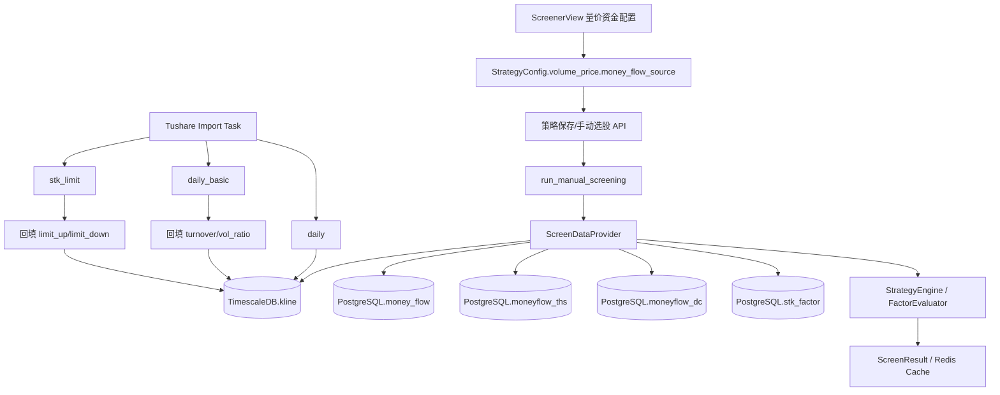
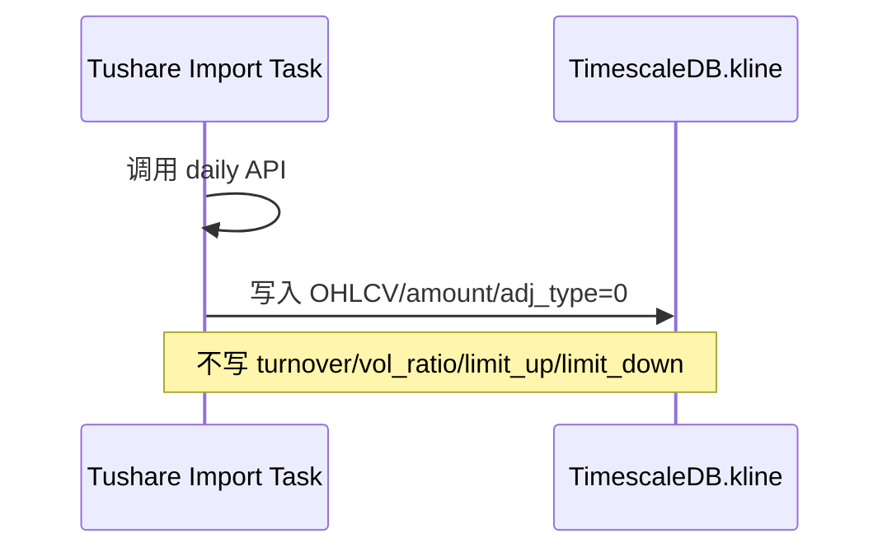
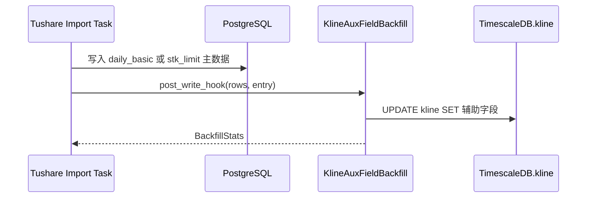
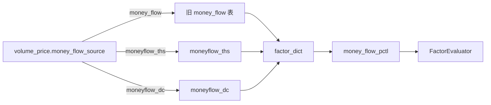

# 设计文档：右侧趋势突破选股数据消缺

## 概览

本设计修复右侧趋势突破综合策略“全市场筛选 0 入选”的系统性缺口。修复分为四条主线：

1. **因子口径修正**：`rsi` RANGE 条件读取 `rsi_current`，布尔 `rsi` 继续用于信号/共振展示。
2. **K 线辅助字段补齐**：将 Tushare `daily_basic` 的 `turnover_rate` / `volume_ratio` 和 `stk_limit` 的 `up_limit` / `down_limit` 回填到 TimescaleDB `kline`。
3. **资金流数据源可选**：在策略配置中新增 `volume_price.money_flow_source`，前端下拉三选一：`money_flow`、`moneyflow_ths`、`moneyflow_dc`。
4. **专业因子日期容错和可观测性**：`stk_factor` 支持最近可用日期回退；0 入选时输出因子通过/缺失统计。

设计原则：

- 不伪造数据：辅助字段无源数据时保持 `NULL`。
- 不改变复权存储策略：`adj_type=0` 继续表示原始不复权 K 线。
- 保持旧策略兼容：缺失 `money_flow_source` 时默认 `money_flow`。
- 读写职责分离：Tushare 导入负责回填可持久化行情字段；选股数据层负责派生因子与策略评估所需字段。

## 当前问题定位

### RSI 口径错配

`factor_registry.py` 定义 `rsi` 为 RANGE 因子，但 `screen_data_provider.py` 写入：

- `stock_data["rsi"] = rsi_result.signal`，布尔值
- `stock_data["rsi_current"] = rsi_result.current_rsi`，数值

`FactorEvaluator` 对 RANGE 因子默认读取 `stock_data[factor_name]`，因此 `rsi BETWEEN 55 AND 80` 实际比较的是 `False/True` → `0/1`，必然不通过。

### Kline 辅助字段缺失

Tushare `daily` 写入 `kline` 的 SQL 只包含：

- `time`
- `symbol`
- `freq`
- `open/high/low/close`
- `volume`
- `amount`
- `adj_type`

Tushare `daily` 本身也不提供 `turnover`、`vol_ratio`、`limit_up`、`limit_down`。这些字段应分别来自 `daily_basic` 和 `stk_limit`。

### money_flow 数据源不匹配

旧 `money_flow` 表近期无数据，而库中 `moneyflow_ths` / `moneyflow_dc` 有较多数据。需求已明确改为用户选择数据源，后端不自动回退。

### stk_factor 日期精确匹配过严

`_enrich_stk_factor_factors()` 只查询 `screen_date` 当天。当天未导入时会记录 `stk_factor 匹配 0/N 只股票`，专业因子整体降级。

## 架构图



## 数据模型与配置设计

### VolumePriceConfig 扩展

文件：

- `app/core/schemas.py`
- `app/api/v1/screen.py`

新增字段：

```python
money_flow_source: str = "money_flow"
```

合法值：

- `money_flow`
- `moneyflow_ths`
- `moneyflow_dc`

序列化：

- `to_dict()` 输出 `money_flow_source`
- `from_dict()` 缺失时默认 `"money_flow"`
- 非法值在 `from_dict()` 中归一化为 `"money_flow"`，并可记录 warning 或保守静默兼容

说明：

- 保留现有 `money_flow_mode`、`relative_threshold_pct` 字段，不改变旧测试语义。
- 本字段属于策略配置，不属于全局设置。
- API 入参模型 `VolumePriceConfigIn` 也必须新增同名字段，避免前端传入后在 `model_dump()` 阶段被丢弃。

### 前端配置扩展

文件：`frontend/src/views/ScreenerView.vue`

在量价资金筛选面板新增下拉框：

```ts
type MoneyFlowSource = 'money_flow' | 'moneyflow_ths' | 'moneyflow_dc'

interface VolumePriceConfig {
  ...
  money_flow_source: MoneyFlowSource
}
```

默认值：

```ts
money_flow_source: 'money_flow'
```

下拉选项：

| value | 展示文案 |
| --- | --- |
| `money_flow` | 旧资金流表 |
| `moneyflow_ths` | 同花顺资金流 |
| `moneyflow_dc` | 东方财富资金流 |

策略加载时：

- 若后端配置存在 `volume_price.money_flow_source`，回填到表单
- 若缺失，使用默认 `money_flow`

策略保存/运行时：

- `buildStrategyConfig()` 将 `money_flow_source` 包含在 `volume_price`

## 后端模块设计

### 1. RSI RANGE 字段映射

文件：`app/services/screener/strategy_engine.py`

新增一个字段选择函数，避免把特殊逻辑散落在 evaluate 中：

```python
@staticmethod
def _resolve_field_name(factor_name: str, threshold_type: ThresholdType) -> str:
    if factor_name == "rsi" and threshold_type == ThresholdType.RANGE:
        return "rsi_current"
    if threshold_type == ThresholdType.PERCENTILE:
        return f"{factor_name}_pctl"
    if threshold_type == ThresholdType.INDUSTRY_RELATIVE:
        return f"{factor_name}_ind_rel"
    return factor_name
```

影响：

- `rsi` RANGE 条件使用 `rsi_current`
- `rsi` 布尔信号仍保留在 `stock_data["rsi"]`
- 其他 RANGE 因子，例如 `turnover`，继续读取自身字段

### 2. Kline 辅助字段回填服务

新增文件建议：`app/services/data_engine/kline_aux_field_backfill.py`

职责：

- 从导入 rows 或 PostgreSQL 辅助表读取数据
- 批量更新 TimescaleDB `kline`
- 提供导入任务自动调用和可用历史来源的手动补跑入口

核心接口：

```python
class KlineAuxFieldBackfillService:
    async def backfill_daily_basic_rows(
        self,
        rows: list[dict],
    ) -> BackfillStats: ...

    async def backfill_stk_limit_rows(
        self,
        rows: list[dict],
    ) -> BackfillStats: ...

    async def backfill_stk_limit_table(
        self,
        start_date: str | None = None,
        end_date: str | None = None,
    ) -> BackfillStats: ...
```

说明：

- `daily_basic` 当前没有完整历史明细表，因此本次实现只承诺 rows-based 回填；历史补跑通过重新导入 `daily_basic` 或未来可用明细来源完成。
- `stk_limit` 已有历史表，因此提供 `backfill_stk_limit_table()` 按日期范围补跑。
- 若后续新增 `daily_basic` 历史明细表，可在同一服务中追加 `backfill_daily_basic_table()`，但不作为本 spec 的必要实现。

`BackfillStats`：

```python
@dataclass
class BackfillStats:
    source_table: str
    start_date: str | None
    end_date: str | None
    source_rows: int
    matched_rows: int
    updated_rows: int
    skipped_rows: int
```

#### daily_basic 回填 SQL

`daily_basic` 当前注册为写入 `stock_info`，但库里没有完整历史 daily_basic 表。设计采用两阶段：

1. **短期可落地**：在 Tushare `daily_basic` 导入任务内，直接从 API 返回 rows 回填 `kline.turnover/vol_ratio`
2. **历史可补跑**：若后续引入或已有 daily_basic 历史表，则 `KlineAuxFieldBackfillService` 支持从该表补跑

任务内回填使用 rows 直接构造临时 VALUES：

```sql
UPDATE kline AS k
SET
  turnover = COALESCE(v.turnover, k.turnover),
  vol_ratio = COALESCE(v.vol_ratio, k.vol_ratio)
FROM (VALUES ...) AS v(symbol, trade_date, turnover, vol_ratio)
WHERE k.symbol = v.symbol
  AND k.time >= v.trade_date::date
  AND k.time < (v.trade_date::date + INTERVAL '1 day')
  AND k.freq = '1d'
  AND k.adj_type = 0
```

字段映射：

- `turnover = row["turnover_rate"]`
- `vol_ratio = row["volume_ratio"]`

注意：

- 不使用 `0` 代替缺失值
- 如果 `daily_basic` 返回字段不存在或为 None，不覆盖已有值

#### stk_limit 回填 SQL

`stk_limit` 有历史表，支持从表补跑，也支持导入 rows 后立即回填。

```sql
UPDATE kline AS k
SET
  limit_up = COALESCE(v.limit_up, k.limit_up),
  limit_down = COALESCE(v.limit_down, k.limit_down)
FROM (VALUES ...) AS v(symbol, trade_date, limit_up, limit_down)
WHERE k.symbol = v.symbol
  AND k.time >= v.trade_date::date
  AND k.time < (v.trade_date::date + INTERVAL '1 day')
  AND k.freq = '1d'
  AND k.adj_type = 0
```

字段映射：

- `limit_up = row["up_limit"]`
- `limit_down = row["down_limit"]`

### 3. Tushare 导入任务集成

文件：`app/tasks/tushare_import.py`

在通用写入后新增 hook：

```python
async def _post_write_hooks(rows: list[dict], entry: ApiEntry) -> None:
    if entry.api_name == "daily_basic":
        await _backfill_kline_from_daily_basic_rows(rows)
    elif entry.api_name == "stk_limit":
        await _backfill_kline_from_stk_limit_rows(rows)
```

调用位置：

- PG 写入成功后
- TS 写入成功后无需触发
- hook 失败时应让任务失败还是 warning？

设计选择：

- 对于导入主表成功但回填失败，记录 WARNING 并在任务 `extra_info` 中附加 `backfill_error`
- 不回滚主表导入，因为主表数据仍可用于后续手动补跑

### 4. 资金流数据源选择

文件：`app/services/screener/screen_data_provider.py`

现状：

- `_enrich_money_flow_factors()` 针对单只股票查询旧 `money_flow`
- `_enrich_enhanced_money_flow_factors()` 批量查询 THS，若无 THS 自动回退 DC

设计调整：

1. 从策略配置读取：

```python
source = strategy_config.get("volume_price", {}).get("money_flow_source", "money_flow")
```

2. 将旧单只股票查询改为受 source 控制：

```python
if source == "money_flow":
    await self._enrich_legacy_money_flow_factors(factor_dict, symbol, screen_date)
else:
    defer batch enrichment
```

3. 对 THS/DC 新增批量选择式方法：

```python
async def _enrich_selected_money_flow_factors(
    self,
    stocks_data: dict[str, dict],
    screen_date: date,
    source: Literal["moneyflow_ths", "moneyflow_dc"],
) -> None:
```

行为：

- `moneyflow_ths`：只查 THS，不查 DC
- `moneyflow_dc`：只查 DC，不查 THS
- 无数据时降级，不自动回退

计算字段：

```python
super_large_net_inflow = buy_elg_amount - sell_elg_amount
large_net_inflow = buy_lg_amount - sell_lg_amount
mid_net_inflow = buy_md_amount - sell_md_amount
small_net_outflow = sell_sm_amount - buy_sm_amount > 0
money_flow_strength = compute_money_flow_strength(...)
money_flow_raw = super_large_net_inflow + large_net_inflow + mid_net_inflow
money_flow = money_flow_raw > 0
main_net_inflow = money_flow_raw
large_order_ratio = derived_large_order_ratio_or_None
```

百分位：

- `money_flow` 注册为 PERCENTILE，评估读取 `money_flow_pctl`
- `_compute_percentile_ranks(result, ["money_flow", ...])` 目前会对 `bool` 做百分位，语义不好
- 设计不再直接对布尔 `money_flow` 做百分位；改用 `money_flow_value` 作为排序源

兼容处理：

- 由于现有代码和信号展示使用 `stock_data.get("money_flow")` 作为布尔，不能直接把 `money_flow` 改成数值。
- 设计采用更小改动：新增 `money_flow_value`，`_compute_percentile_ranks()` 对资金流使用该原始值计算，并将结果写入/别名为 `money_flow_pctl`，保证旧 `FactorEvaluator` 继续按 `money_flow_pctl` 读取。

字段约定：

| 字段 | 类型 | 说明 |
| --- | --- | --- |
| `money_flow` | bool | 是否有正向资金流信号，用于模块评分和展示 |
| `money_flow_value` | float \| None | 用于百分位排序的原始资金流值 |
| `money_flow_pctl` | float \| None | 百分位，用于 `money_flow >= threshold` |
| `large_order` | bool | 大单活跃信号 |
| `large_order_ratio` | float \| None | 大单占比，百分比口径 |

旧 `money_flow` 表：

- 保持 `money_flow` 为 bool
- 额外写入 `money_flow_value = latest/main_net_inflow 或连续净流入合计`
- 计算百分位后写入 `money_flow_pctl`

### 5. stk_factor 日期回退

文件：`app/services/screener/screen_data_provider.py`

新增查询：

```python
async def _resolve_latest_stk_factor_date(
    self,
    session: AsyncSession,
    target: date,
    max_days: int = 10,
) -> str | None:
```

SQL：

```sql
SELECT trade_date
FROM stk_factor
WHERE trade_date <= :target_yyyymmdd
  AND trade_date >= :min_yyyymmdd
GROUP BY trade_date
ORDER BY trade_date DESC
LIMIT 1
```

流程：

1. 查询目标日期 rows
2. 若 rows 非空，使用目标日期
3. 若 rows 为空，resolve 最近日期
4. 若找到最近日期，查询该日期 rows
5. 记录日志：

```text
stk_factor 使用最近可用日期 target=20260429 actual=20260421 fallback_days=8 matched=176/5331
```

默认窗口：

- 10 个自然日

### 6. 0 入选因子统计

文件：`app/services/screener/strategy_engine.py` 或 `app/tasks/screening.py`

新增纯函数：

```python
def summarize_factor_failures(
    config: StrategyConfig,
    stocks_data: dict[str, dict[str, Any]],
) -> dict[str, dict[str, int]]:
```

输出：

```python
{
  "rsi": {"passed": 1200, "missing": 0, "failed": 4131},
  "turnover": {"passed": 2500, "missing": 20, "failed": 2811},
}
```

实现：

- 复用 `FactorEvaluator.evaluate()`
- 如果评估读取字段值为 None，计入 missing
- 否则不通过计入 failed
- 通过计入 passed

调用位置：

- `run_manual_screening` 中 `len(result.items) == 0` 时输出 INFO/WARNING 日志
- 不改变 API 响应结构

为区分缺失字段，需要 `FactorEvaluator` 暴露字段解析：

```python
FactorEvaluator.resolve_field_name(condition) -> str
```

## 数据流细节

### Tushare daily 导入



### daily_basic / stk_limit 回填



### 选股资金流



## 兼容性

### 策略配置兼容

旧配置没有 `volume_price.money_flow_source`：

- 后端反序列化默认 `money_flow`
- 前端加载默认 `money_flow`

### 选股结果兼容

API 响应不新增必需字段。新增内部字段：

- `money_flow_value`
- 可选 `money_flow_source`

前端结果展示不依赖这些字段。

### 数据库兼容

本设计不新增表，不改已有表结构。只更新已有 `kline` 辅助列。

如果需要持久化 daily_basic 历史表，应另开迁移；本 spec 的短期实现不依赖该表。

## 错误处理

### 回填失败

- 导入主数据成功但回填失败：记录 WARNING，返回导入任务成功但 extra_info 中包含回填失败摘要
- 手动回填失败：抛出异常，由调用方显示失败

### 所选资金流源缺失

- 不自动回退
- `money_flow=False`
- `money_flow_value=None`
- `money_flow_pctl=None`
- 日志记录所选源、日期、缺失数量

### stk_factor 过旧

- 超出 10 自然日窗口则不使用
- 相关字段置 None

## 测试策略

### 单元测试

1. `tests/services/test_factor_evaluator_enhanced.py`
   - `rsi` RANGE 读取 `rsi_current`
   - 缺失 `rsi_current` 不通过

2. 新增 `tests/services/test_kline_aux_field_backfill.py`
   - daily_basic rows 回填 turnover/vol_ratio
   - stk_limit rows 回填 limit_up/limit_down
   - None 不覆盖已有值
   - 无 kline 匹配时跳过

3. `tests/services/test_screen_data_provider_money_flow.py`
   - `money_flow_source=money_flow` 使用旧表
   - `money_flow_source=moneyflow_ths` 只使用 THS
   - `money_flow_source=moneyflow_dc` 只使用 DC
   - 所选源缺失不自动回退
   - `money_flow_pctl` 基于 `money_flow_value` 生成

4. 新增或扩展 `tests/services/test_screen_data_provider_stk_factor.py`
   - 目标日期有数据时使用目标日期
   - 目标日期无数据时使用 10 天内最近日期
   - 超窗时降级 None

5. 新增 `tests/services/test_screening_factor_summary.py`
   - 0 入选时统计 passed/missing/failed

### 集成测试

1. `tests/tasks/test_tushare_import_kline_aux_backfill.py`
   - 模拟 `daily_basic` 导入后触发回填 hook
   - 模拟 `stk_limit` 导入后触发回填 hook

2. 可选数据库验证脚本：

```sql
SELECT
  time::date AS d,
  count(*) AS rows,
  count(turnover) AS turnover_nonnull,
  count(vol_ratio) AS vol_ratio_nonnull,
  count(limit_up) AS limit_up_nonnull,
  count(limit_down) AS limit_down_nonnull
FROM kline
WHERE freq='1d'
  AND time >= CURRENT_DATE - INTERVAL '10 days'
GROUP BY 1
ORDER BY 1 DESC;
```

## 性能考虑

- 回填按批次执行，单批建议 1000-5000 rows。
- 使用 `UPDATE ... FROM (VALUES ...)` 避免逐行提交。
- `stk_factor` 最近日期查询使用 `trade_date` 字符串字段，现有唯一/普通索引不足时可后续补索引；本次先控制窗口避免大范围扫描。
- 资金流 THS/DC 批量查询一次构建 `row_map`，避免逐股票查询。

## 迁移与回填计划

1. 发布代码后，新增导入的 `daily_basic` / `stk_limit` 自动回填 `kline`。
2. 对已有 `stk_limit` 历史表执行一次 `backfill_stk_limit_table`。
3. 对 `turnover/vol_ratio`：
   - 如果当前没有 daily_basic 历史明细表，只能从后续 `daily_basic` 导入开始补齐
   - 若确认存在可用历史来源或重新导入 `daily_basic`，导入过程中会自动补齐
4. 重新运行右侧趋势突破综合策略，观察因子统计日志。

## 实现约定

1. 本 spec 不新增 `daily_basic` 历史明细表；`turnover/vol_ratio` 通过 `daily_basic` 导入 rows 或后续可用明细来源回填。
2. 资金流 THS/DC 用于 `money_flow_value` 的原始值口径采用：`超大单净流入 + 大单净流入 + 中单净流入`。
