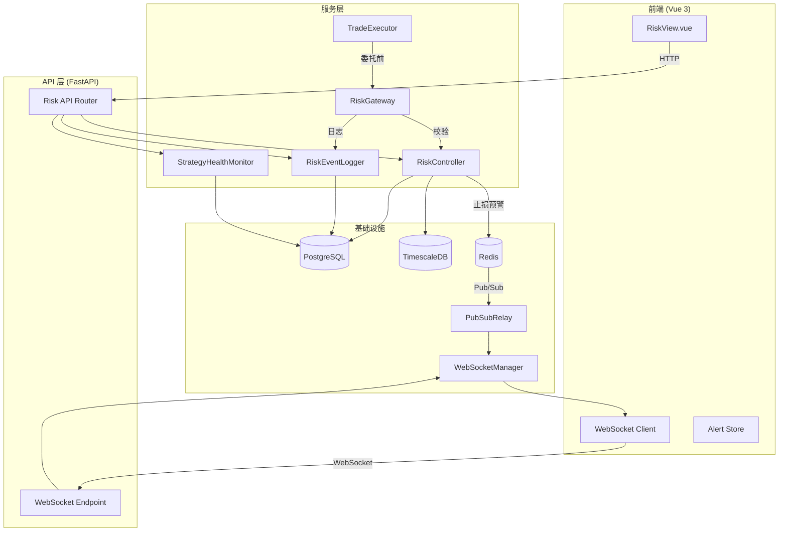
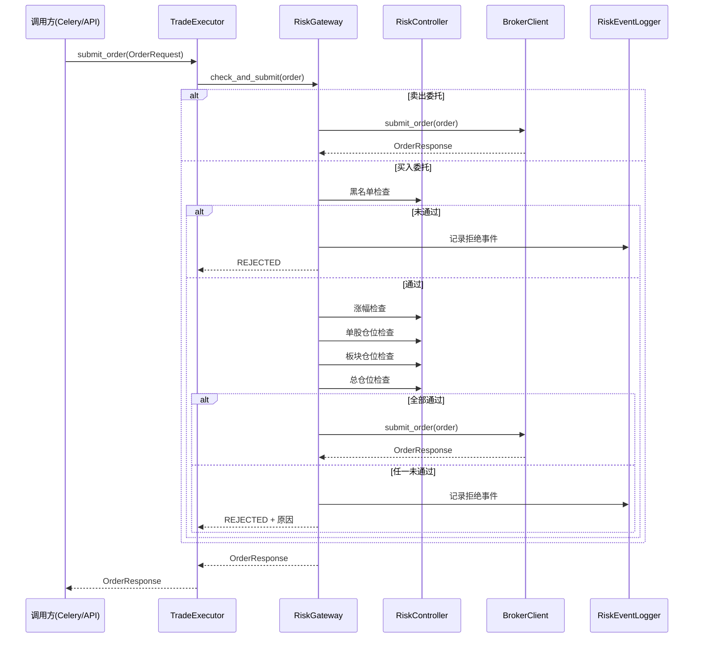
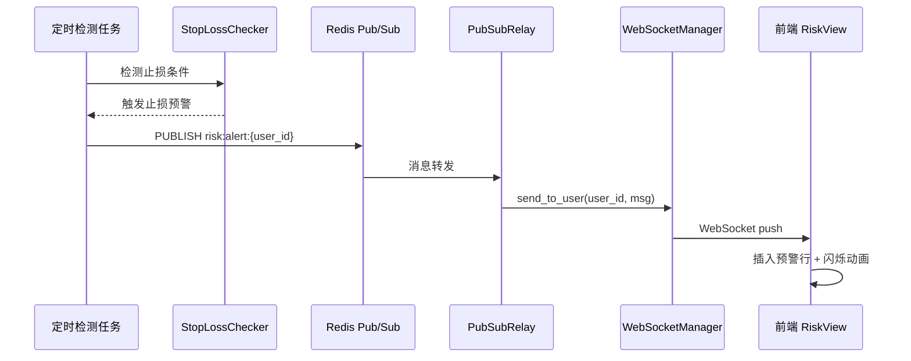

# 设计文档：风控系统增强

## 概述

本设计文档描述对 A 股量化交易平台风控系统的全面增强方案，覆盖 12 项需求（P0–P3）。核心改动包括：

1. **交易执行链路强制风控**（P0）：在 TradeExecutor 中嵌入 RiskGateway 拦截层，确保所有委托（含 Celery 异步任务）在提交前经过完整风控校验链
2. **止损预警实时推送**（P0）：通过 Redis Pub/Sub → WebSocket 管道实现止损事件的亚秒级推送
3. **黑白名单持久化**（P1）：BlackWhiteListManager 采用「内存缓存 + PostgreSQL 持久化」双写模式，启动时从 DB 加载
4. **ATR 自适应止损**（P1）：StopLossChecker 新增基于 14 日 ATR 的动态止损阈值计算
5. **总仓位控制**（P1）：PositionRiskChecker 新增总仓位比例计算，并与大盘风险等级联动调整上限
6. **真实行业分类**（P2）：板块仓位从交易所板块（主板/创业板）切换为申万一级行业分类
7. **破位检测优化**（P2）：放宽急跌破位条件（三满足二），新增连续阴跌检测模式
8. **策略实盘健康监控**（P2）：基于实盘交易记录计算胜率和最大回撤，与回测指标并列展示
9. **扩展大盘监控指数**（P3）：从 2 个指数扩展到 4 个（上证、创业板、沪深 300、中证 500）
10. **风控事件日志**（P3）：新增 RiskEventLog 模型，持久化所有风控触发事件，支持分页查询
11. **大盘 K 线迷你图**（P3）：前端新增 ECharts K 线图，叠加 MA20/MA60 均线
12. **持仓预警表增强**（P3）：预警条目新增成本价、盈亏比例、建议操作字段

设计原则：
- 所有新增风控逻辑提供 `_pure` 后缀的纯函数版本，便于 Hypothesis 属性测试
- 后端遵循 `api/ → services/ → models/` 分层架构
- 前端遵循 Vue 3 Composition API + Pinia 状态管理
- 中文注释和 UI 标签

## 架构

### 整体架构



### 风控校验链路



### 止损预警推送链路



## 组件与接口

### 1. RiskGateway（新增）

位置：`app/services/risk_controller.py`

```python
class RiskGateway:
    """交易执行链路风控网关，在委托提交前执行完整风控校验链"""

    def check_and_submit(
        self,
        order: OrderRequest,
        broker: BrokerClient,
        positions: list[Position],
        market_data: dict,
        blacklist: set[str],
        total_position_limit: float,
    ) -> OrderResponse:
        """执行风控校验链并提交委托"""

    @staticmethod
    def check_order_risk_pure(
        order: OrderRequest,
        positions: list[dict],
        blacklist: set[str],
        daily_change_pct: float,
        industry_map: dict[str, str],
        total_market_value: float,
        available_cash: float,
        total_position_limit: float,
        stock_position_limit: float = 15.0,
        sector_position_limit: float = 30.0,
    ) -> RiskCheckResult:
        """纯函数版本的风控校验（无 DB 依赖），便于属性测试"""
```

### 2. StopLossChecker 扩展

位置：`app/services/risk_controller.py`

```python
class StopLossChecker:
    # 现有方法保持不变...

    @staticmethod
    def compute_atr_fixed_stop_price(
        cost_price: float, atr: float, multiplier: float = 2.0
    ) -> float:
        """ATR 自适应固定止损价 = 成本价 - ATR × 倍数"""

    @staticmethod
    def compute_atr_trailing_retrace_pct(
        atr: float, peak_price: float, multiplier: float = 1.5
    ) -> float:
        """ATR 自适应移动止损回撤比例 = ATR × 倍数 / 最高价"""

    @staticmethod
    def compute_atr_stop_loss_pure(
        cost_price: float, current_price: float, peak_price: float,
        atr: float, fixed_multiplier: float, trailing_multiplier: float,
    ) -> dict:
        """纯函数版本：同时计算固定止损和移动止损触发状态"""
```

### 3. PositionRiskChecker 扩展

位置：`app/services/risk_controller.py`

```python
class PositionRiskChecker:
    # 现有方法保持不变...

    @staticmethod
    def compute_total_position_pct(
        total_market_value: float, available_cash: float
    ) -> float:
        """计算总仓位比例 = 持仓总市值 / (持仓总市值 + 可用现金) × 100"""

    @staticmethod
    def check_total_position_limit(
        total_market_value: float, available_cash: float, limit_pct: float
    ) -> RiskCheckResult:
        """检查总仓位是否超过上限"""

    @staticmethod
    def get_total_position_limit_by_risk_level(
        risk_level: MarketRiskLevel,
    ) -> float:
        """根据大盘风险等级返回总仓位上限：NORMAL=80%, CAUTION=60%, DANGER=30%"""

    @staticmethod
    def compute_industry_positions_pure(
        positions: list[dict],
        industry_map: dict[str, str],
    ) -> dict[str, float]:
        """纯函数版本：计算各行业仓位占比"""

    @staticmethod
    def check_consecutive_decline_pure(
        closes: list[float], n_days: int = 3, threshold_pct: float = 8.0
    ) -> bool:
        """纯函数版本：连续阴跌检测"""

    @staticmethod
    def check_position_breakdown_relaxed(
        current_price: float, ma20: float,
        daily_change_pct: float, volume_ratio: float,
    ) -> bool:
        """放宽版破位检测：三个条件满足其中两个即触发"""
```

### 4. StrategyHealthMonitor（新增）

位置：`app/services/risk_controller.py`

```python
class StrategyHealthMonitor:
    """策略实盘健康监控器"""

    @staticmethod
    def compute_live_health_pure(
        trade_records: list[dict], n: int = 20
    ) -> dict:
        """
        纯函数版本：基于实盘交易记录计算健康指标
        返回: {win_rate, max_drawdown, is_healthy, data_sufficient, trade_count}
        """
```

### 5. RiskEventLogger（新增）

位置：`app/services/risk_controller.py`

```python
class RiskEventLogger:
    """风控事件日志记录器"""

    @staticmethod
    def build_event_record(
        event_type: str, symbol: str, rule_name: str,
        trigger_value: float, threshold: float,
        result: str, triggered_at: datetime,
    ) -> dict:
        """构建风控事件记录字典"""
```

### 6. BlackWhiteListManager 扩展

```python
class BlackWhiteListManager:
    # 现有内存操作保持不变...

    @staticmethod
    def is_blacklisted_pure(symbol: str, blacklist: set[str]) -> bool:
        """纯函数版本的黑名单查询"""

    @staticmethod
    def is_whitelisted_pure(symbol: str, whitelist: set[str]) -> bool:
        """纯函数版本的白名单查询"""
```

### 7. MarketRiskChecker 扩展

```python
class MarketRiskChecker:
    # 现有方法保持不变...

    def check_multi_index_risk(
        self, index_data: dict[str, list[float]]
    ) -> tuple[MarketRiskLevel, dict[str, dict]]:
        """
        多指数综合风控：取所有指数中最严重的风险等级
        返回: (综合风险等级, {指数代码: {risk_level, above_ma20, above_ma60}})
        """
```

### 8. Risk API 新增端点

| 端点 | 方法 | 描述 |
|------|------|------|
| `/risk/total-position` | GET | 总仓位状态 |
| `/risk/event-log` | GET | 风控事件日志（分页+筛选） |
| `/risk/index-kline` | GET | 指数 K 线数据（60 日 OHLC） |

### 9. 前端组件变更

| 组件 | 变更 |
|------|------|
| `RiskView.vue` | 新增总仓位区域、风控日志区域、K 线迷你图、预警表增强列 |
| `stores/risk.ts`（新增） | 风控 WebSocket 连接管理、预警状态 |

## 数据模型

### 新增 ORM 模型

#### RiskEventLog（PostgreSQL）

```python
class RiskEventLog(PGBase):
    """风控事件日志"""
    __tablename__ = "risk_event_log"

    id: Mapped[UUID]                    # 主键
    user_id: Mapped[UUID]               # 用户 ID
    event_type: Mapped[str]             # ORDER_REJECTED / STOP_LOSS / POSITION_LIMIT / BREAKDOWN
    symbol: Mapped[str | None]          # 股票代码
    rule_name: Mapped[str]              # 触发规则名称
    trigger_value: Mapped[float]        # 触发值
    threshold: Mapped[float]            # 阈值
    result: Mapped[str]                 # REJECTED / WARNING
    triggered_at: Mapped[datetime]      # 触发时间
    created_at: Mapped[datetime]        # 记录创建时间
```

#### StockInfo 扩展

```python
class StockInfo(PGBase):
    # 现有字段保持不变...
    industry_code: Mapped[str | None]   # 申万一级行业代码（新增）
    industry_name: Mapped[str | None]   # 申万一级行业名称（新增）
```

### 新增 Schema 数据类

```python
@dataclass
class StopLossMode(str, Enum):
    """止损模式"""
    FIXED = "fixed"                     # 固定比例
    ATR_ADAPTIVE = "atr_adaptive"       # ATR 自适应

@dataclass
class StopConfig:
    """止损配置（Redis 持久化）"""
    mode: StopLossMode = StopLossMode.FIXED
    fixed_stop_loss: float = 8.0        # 固定止损比例 %
    trailing_stop: float = 5.0          # 移动止损回撤比例 %
    trend_stop_ma: int = 20             # 趋势止损均线周期
    atr_fixed_multiplier: float = 2.0   # ATR 固定止损倍数
    atr_trailing_multiplier: float = 1.5 # ATR 移动止损倍数

@dataclass
class RiskEvent:
    """风控事件（业务层数据类）"""
    event_type: str
    symbol: str | None
    rule_name: str
    trigger_value: float
    threshold: float
    result: str                         # REJECTED / WARNING
    triggered_at: datetime
```

### Redis 键设计

| 键模式 | 用途 | TTL |
|--------|------|-----|
| `risk:stop_config:{user_id}` | 止损配置（扩展支持 ATR 模式） | 30 天 |
| `risk:alert:{user_id}` | Pub/Sub 频道：风控预警推送 | — |

### Pub/Sub 频道扩展

在 `pubsub_relay.py` 的 `USER_CHANNEL_PREFIXES` 中新增 `"risk:alert:"` 前缀，使风控预警消息能通过现有 PubSubRelay 转发到 WebSocket。


## 正确性属性（Correctness Properties）

*属性是在系统所有有效执行中都应成立的特征或行为——本质上是对系统应做什么的形式化陈述。属性是人类可读规格说明与机器可验证正确性保证之间的桥梁。*

### Property 1: 风控网关校验正确性

*For any* 买入委托请求和任意持仓状态，当委托对应的股票在黑名单中、或当日涨幅超过 9%、或单股仓位超过上限、或板块仓位超过上限、或总仓位超过上限时，RiskGateway 的纯函数校验 SHALL 返回 passed=False；当且仅当所有检查均通过时返回 passed=True。

**Validates: Requirements 1.1, 1.2**

### Property 2: 卖出委托跳过买入风控

*For any* 卖出方向（SELL）的委托请求，无论股票是否在黑名单中、无论仓位是否超限，RiskGateway 的纯函数校验 SHALL 始终返回 passed=True。

**Validates: Requirements 1.3**

### Property 3: ATR 自适应止损计算正确性与范围不变量

*For any* 有效的 ATR 值（ATR > 0）、成本价（cost_price > 0）、最高价（peak_price > 0）和正倍数（multiplier > 0），当 ATR × 固定止损倍数 < 成本价时：
- 固定止损价 SHALL 等于 cost_price - ATR × fixed_multiplier
- 固定止损价 SHALL 大于 0 且小于 cost_price
- 移动止损回撤比例 SHALL 等于 ATR × trailing_multiplier / peak_price

**Validates: Requirements 4.2, 4.3, 4.8**

### Property 4: 总仓位比例范围不变量

*For any* 有效的持仓总市值（≥ 0）和可用现金（≥ 0），当两者不同时为零时，总仓位比例计算结果 SHALL 在 [0, 100] 范围内。当持仓市值为 0 时结果 SHALL 为 0；当可用现金为 0 时结果 SHALL 为 100。

**Validates: Requirements 5.1, 5.9**

### Property 5: 大盘风险等级与总仓位上限映射

*For any* MarketRiskLevel 枚举值，get_total_position_limit_by_risk_level SHALL 返回：NORMAL → 80.0, CAUTION → 60.0, DANGER → 30.0。且 NORMAL 的上限 > CAUTION 的上限 > DANGER 的上限（单调递减）。

**Validates: Requirements 5.3, 5.4, 5.5**

### Property 6: 行业仓位加和不变量

*For any* 持仓列表和行业分类映射，各行业仓位占比之和 SHALL 等于所有持仓的总仓位占比（允许浮点精度误差 ≤ 0.01%）。

**Validates: Requirements 6.6**

### Property 7: 放宽版破位检测（三满足二）

*For any* 三个布尔条件组合（跌破 MA20、跌幅超 5%、放量），放宽版破位检测 SHALL 在恰好两个或三个条件为真时返回 True，在零个或一个条件为真时返回 False。

**Validates: Requirements 7.3**

### Property 8: 连续阴跌检测局部性不变量

*For any* 收盘价序列和参数 N，在序列前面追加任意长度的任意价格数据后，连续阴跌检测结果 SHALL 保持不变（仅依赖最近 N+1 个数据点）。

**Validates: Requirements 7.6**

### Property 9: 策略实盘健康计算正确性

*For any* 实盘交易记录列表（每条记录包含盈亏金额），compute_live_health_pure SHALL 正确计算：
- 胜率 = 盈利交易数 / 总交易数
- 当胜率 < 0.4 或最大回撤 > 0.2 时，is_healthy SHALL 为 False
- 当交易记录数 < N 时，data_sufficient SHALL 为 False

**Validates: Requirements 8.1, 8.2**

### Property 10: 多指数风控最严重等级聚合

*For any* 多个指数的收盘价数据集合，综合大盘风险等级 SHALL 等于所有单个指数风险等级中最严重的那个（DANGER > CAUTION > NORMAL）。当某个指数数据为空时 SHALL 跳过该指数。

**Validates: Requirements 9.1, 9.3**

### Property 11: 预警建议操作映射正确性

*For any* 预警类型，建议操作字段 SHALL 按以下映射生成：固定止损触发 → 「建议止损卖出」、移动止损触发 → 「建议减仓」、破位预警 → 「建议关注，考虑减仓」、仓位超限 → 「建议不再加仓」。

**Validates: Requirements 12.1, 12.2**

### Property 12: 黑白名单操作序列一致性

*For any* 黑白名单操作序列（添加、删除的任意组合），执行所有操作后，is_blacklisted_pure 的查询结果 SHALL 与对应集合的成员关系一致：添加过且未被删除的股票返回 True，其余返回 False。

**Validates: Requirements 3.7**

### Property 13: 止损预警消息完整性

*For any* 止损触发事件数据（股票代码、预警类型、当前价格、触发阈值、预警级别），构建的预警消息 SHALL 包含所有必需字段且字段值与输入一致。

**Validates: Requirements 2.2**

### Property 14: 非交易时段预警抑制

*For any* 时间点，当时间不在 9:25–15:00 范围内时，止损预警推送 SHALL 被抑制（返回空列表或不发布消息）；当时间在该范围内时 SHALL 正常推送。

**Validates: Requirements 2.7**

### Property 15: 风控事件记录完整性

*For any* 有效的事件输入（事件类型、股票代码、规则名称、触发值、阈值、处理结果、触发时间），build_event_record SHALL 返回包含所有必需字段的字典，且字段值与输入一致。

**Validates: Requirements 10.2**

## 错误处理

| 场景 | 处理方式 |
|------|----------|
| 风控校验过程中抛出异常 | RiskGateway 捕获异常，返回 REJECTED 状态，记录异常日志到 RiskEventLog |
| 数据库写入黑白名单失败 | 回滚内存缓存变更，返回 HTTP 500 错误信息 |
| WebSocket 连接断开 | 前端自动重连（最多 5 次，间隔递增 1s/2s/4s/8s/16s），显示连接状态提示 |
| 指数 K 线数据不可用 | 跳过该指数，使用其余指数计算综合风险等级，日志记录 |
| ATR 数据不可用 | 回退到固定比例止损模式，前端提示「ATR 数据不可用，使用固定比例」 |
| 实盘交易记录不足 N 笔 | 返回结果中标注 data_sufficient=False，前端显示「实盘数据不足，仅供参考」 |
| 行业分类数据缺失 | 将股票归入「未分类」行业，预警信息中标注 |
| Redis 止损配置读取失败 | 使用默认配置值（fixed_stop_loss=8%, trailing_stop=5%, trend_stop_ma=20） |
| 风控事件日志写入失败 | 仅记录 logger.error，不阻塞风控校验主流程 |
| 总仓位计算时持仓市值和现金均为 0 | 返回总仓位 0%，不触发超限 |

## 测试策略

### 属性测试（Property-Based Testing）

- **框架**：后端使用 Hypothesis（Python），前端使用 fast-check（TypeScript）
- **配置**：每个属性测试最少 100 次迭代
- **标签格式**：`Feature: risk-control-enhancement, Property {number}: {property_text}`
- **纯函数约定**：所有新增风控逻辑提供 `_pure` 后缀的静态方法，接受数据参数而非依赖数据库

属性测试覆盖的核心逻辑：
1. RiskGateway 校验链正确性（Property 1, 2）
2. ATR 止损计算公式与范围不变量（Property 3）
3. 总仓位计算范围不变量（Property 4）
4. 风险等级与仓位上限映射（Property 5）
5. 行业仓位加和不变量（Property 6）
6. 破位检测布尔逻辑（Property 7）
7. 连续阴跌局部性不变量（Property 8）
8. 策略实盘健康计算（Property 9）
9. 多指数风控聚合（Property 10）
10. 预警建议操作映射（Property 11）
11. 黑白名单操作一致性（Property 12）
12. 消息/记录完整性（Property 13, 14, 15）

### 单元测试

- 各 Checker 类的边界条件和特殊值测试
- RiskGateway 异常处理路径
- StopConfig 序列化/反序列化
- 前端组件渲染测试（Vue Test Utils）

### 集成测试

- 黑白名单双写一致性（内存 + PostgreSQL）
- Redis Pub/Sub → WebSocket 推送端到端
- Risk API 端点响应格式验证
- Celery 任务调用 RiskGateway 路径验证
- 风控事件日志持久化与查询
- 90 天数据清理任务

### 前端测试

- WebSocket 连接/断开/重连逻辑（fast-check 属性测试）
- K 线迷你图 ECharts 配置正确性
- 预警表格新增列渲染
- 止损模式切换 UI 交互
- 总仓位进度条显示
