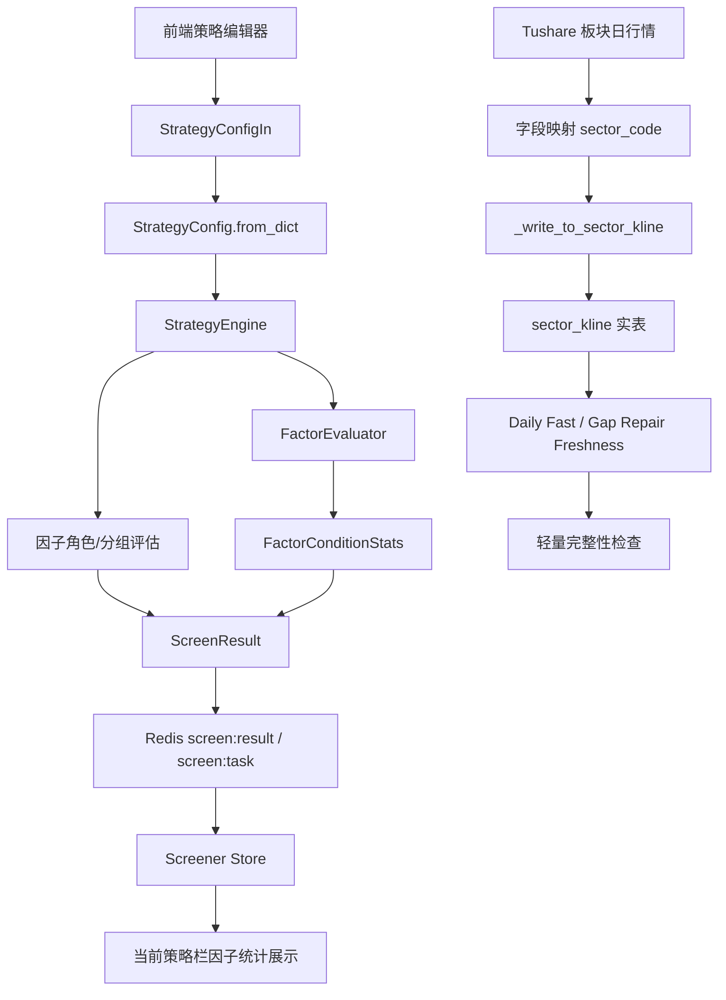

# 右侧趋势突破策略分组与板块覆盖校验修复设计

## 概述

本设计覆盖三个方向：

1. 已完成的板块行情落库修复沉淀：确保 `dc_daily / ths_daily / tdx_daily / sw_daily / ci_daily` 最终写入 `sector_kline`，并以实表覆盖作为一键导入计划和轻量完整性检查依据。
2. 策略因子角色与分组能力：在保持旧版 `factors + logic` 兼容的基础上，引入可配置的主条件、确认因子、仅加分因子，不在引擎里硬编码哪些因子属于哪类。
3. 因子筛选统计可视化：智能选股完成后，后端返回每个条件因子的通过数、缺失数、失败数，前端在当前策略与“一键执行选股”按钮之间展示。

## 设计原则

- 向后兼容优先：旧策略模板、旧 API 入参、旧测试中的 `factors + logic` 语义保持不变。
- 角色由配置决定：策略引擎只解释配置，不内置固定的主条件/确认因子列表。
- 实表优先：板块行情覆盖判断以 `sector_kline` 为准，导入日志只能作为接口执行参考。
- 轻量收尾：每日快速和缺口补导只做目标交易日关键依赖检查，避免对 `kline` 等大表做无边界全量扫描。
- 可复盘：选股结果不仅告诉交易员“有没有选出股票”，还要告诉交易员“每个条件单独筛出了多少只、缺失多少只”。

## 架构图



## 已完成板块行情修复设计

### 写入链路

文件：`app/tasks/tushare_import.py`

- `_write_to_sector_kline()` 使用 `row.get("sector_code") or row.get("ts_code")` 解析板块代码。
- `_normalize_tushare_timeseries_time()` 继续产出 UTC aware `datetime`，供 `kline` 等 `TIMESTAMPTZ` 表使用。
- 新增 `_to_sector_kline_db_time()` 将 UTC aware `datetime` 转为 UTC naive `datetime`，适配当前 `sector_kline.time timestamp without time zone`。
- `kline` 写入保持 aware UTC，不与 `sector_kline` 的当前表结构混用。

### 计划与完整性检查

文件：`app/services/data_engine/tushare_smart_import_workflow.py`

- `SECTOR_DAILY_SOURCE_BY_API` 固定映射：
  - `dc_daily -> DC`
  - `ths_daily -> THS`
  - `tdx_daily -> TDX`
  - `sw_daily -> TI`
  - `ci_daily -> CI`
- `_check_daily_fast_freshness()` 对板块日行情读取 `sector_kline`，不读取 `tushare_import_log`。
- `_daily_fast_lightweight_readiness()` 用目标交易日覆盖检查收尾，避免 daily-fast/gap-repair 扫描大表。
- `_gap_repair_stages()` 在存在 `repair_plan` 且 `missing_steps=[]` 时返回空步骤，工作流直接进入轻量完整性检查。

### 当前验证结果

- `sector_kline` 已补导到 `2026-04-30`。
- 目标日覆盖：`DC=1013`、`THS=1504`、`TDX=615`、`TI=439`、`CI=437`。
- 零缺口验证工作流完成，`missing_key_groups=[]`。

### 待补强：导入后实表反查与诊断

需求 5.1-5.4 和需求 6 还需要在后续任务中补强。当前修复已经让计划阶段和补导后的实表覆盖正确，但单个板块导入任务完成时仍应增加“API 返回行数 vs `sector_kline` 实表覆盖”的反查。

设计入口：

- `app/tasks/tushare_import.py`
  - 在 `_process_import()` 或 `_write_to_timescaledb()` 返回路径中，对 `target_table == "sector_kline"` 且 `record_count > 0` 的任务执行覆盖反查。
  - 反查输入来自本次请求参数：`start_date`、`end_date`、运行时目标 API 和 `data_source`。
  - 反查输出写入 `batch_stats` 或 `extra_info`：实际覆盖日期、目标日覆盖数、缺失日期、诊断原因。
- `app/services/data_engine/tushare_smart_import_workflow.py`
  - 工作流读取子任务 `extra_info` 后，在完整性摘要中呈现诊断原因。
  - 若 API 返回非空但实表覆盖为 0，子任务应标记为 `failed` 或 `data_incomplete`，避免前端误判完成。

诊断原因枚举建议：

- `import_log_mismatch`：导入日志成功但实表缺失。
- `api_empty`：API 返回空。
- `invalid_mapped_fields`：映射后无有效 `sector_code/ts_code` 或无有效时间。
- `timescale_write_failed`：TS 写入失败。
- `non_trade_date`：目标日非交易日。
- `partial_coverage`：仅部分日期写入。

## 策略配置数据结构

### 后端 dataclass

文件：`app/core/schemas.py`

新增可选结构，不替换旧字段：

```python
FactorRole = Literal["primary", "confirmation", "score_only", "disabled"]
GroupLogic = Literal["AND", "OR", "AT_LEAST_N", "SCORE_ONLY"]

@dataclass
class FactorGroupConfig:
    group_id: str
    label: str
    role: FactorRole
    logic: GroupLogic = "AND"
    factor_names: list[str] = field(default_factory=list)
    min_pass_count: int | None = None
    blocking: bool = True

@dataclass
class FactorCondition:
    factor_name: str
    operator: str
    threshold: float | None = None
    params: dict = field(default_factory=dict)
    role: FactorRole | None = None
    group_id: str | None = None

@dataclass
class StrategyConfig:
    factors: list[FactorCondition]
    logic: Literal["AND", "OR"] = "AND"
    factor_groups: list[FactorGroupConfig] = field(default_factory=list)
    confirmation_mode: Literal["blocking", "score_only"] = "blocking"
```

序列化规则：

- `to_dict()` 输出 `factor_groups`、`role`、`group_id`。
- `from_dict()` 接收新结构，也接收旧结构。
- 旧配置无 `factor_groups` 时：
  - 不改变原有筛选逻辑。
  - 可在运行时创建一个兼容组：`legacy_all`，`role=primary`，`logic=config.logic`。
  - 保存旧策略时，若用户未显式编辑角色，不强制写入新结构。

### API 输入模型

文件：`app/api/v1/screen.py`

新增 Pydantic 模型：

```python
class FactorGroupConfigIn(BaseModel):
    group_id: str
    label: str
    role: Literal["primary", "confirmation", "score_only", "disabled"]
    logic: Literal["AND", "OR", "AT_LEAST_N", "SCORE_ONLY"] = "AND"
    factor_names: list[str] = Field(default_factory=list)
    min_pass_count: int | None = None
    blocking: bool = True
```

`FactorConditionIn` 增加：

- `role: Literal["primary", "confirmation", "score_only", "disabled"] | None`
- `group_id: str | None`

`StrategyConfigIn` 增加：

- `factor_groups: list[FactorGroupConfigIn] = []`
- `confirmation_mode: Literal["blocking", "score_only"] = "blocking"`

## 策略评估设计

文件：`app/services/screener/strategy_engine.py`

### 兼容路径

当 `config.factor_groups` 为空：

- 使用现有 `StrategyEngine.evaluate()` 行为。
- `config.logic == "AND"` 时所有因子通过才通过。
- `config.logic == "OR"` 时任一因子通过即通过。
- 旧测试与旧模板不受影响。

### 分组路径

当 `config.factor_groups` 非空：

1. 对每个 `FactorCondition` 调用 `FactorEvaluator.evaluate()`，得到原子因子结果。
2. 按 `group_id` 聚合到 `FactorGroupEvaluation`：
   - `AND`：组内全部通过。
   - `OR`：组内任一通过。
   - `AT_LEAST_N`：组内通过数大于等于 `min_pass_count`。
   - `SCORE_ONLY`：不拦截，仅参与信号和评分。
3. 聚合策略结果：
   - `primary` 且 `blocking=True` 的组必须通过。
   - `confirmation` 且 `blocking=True` 的组按配置通过后才放行。
   - `confirmation` 且 `blocking=False` 或 `score_only` 只影响得分和信号。
   - `disabled` 因子不参与评估、评分和统计。
4. 评分：
   - 保留现有 `weights` 计算方式。
   - 仅通过或配置为 `score_only` 的因子进入加权分。
   - `FactorResult` 增加 `role`、`group_id`，用于结果复盘。

### 右侧趋势突破综合策略默认推荐配置

文件：`app/api/v1/screen.py`

内置策略 `00000000-0000-0000-0000-000000000006` 推荐配置：

- `primary_core`：
  - `role=primary`
  - `logic=AND`
  - `factor_names=["ma_trend", "breakout", "sector_rank", "sector_trend"]`
- `confirmation`：
  - `role=confirmation`
  - `logic=OR`
  - `blocking=True`
  - `factor_names=["macd", "rsi", "money_flow"]`
- `turnover` 可作为 `primary` 或 `score_only`，按模板默认选择写入配置；交易员可在前端修改。

注意：上述只是内置模板推荐值，不是引擎固定规则。

## 因子筛选统计设计

### 数据结构

文件：`app/core/schemas.py`

```python
@dataclass
class FactorConditionStats:
    factor_name: str
    label: str | None = None
    role: str | None = None
    group_id: str | None = None
    evaluated_count: int = 0
    passed_count: int = 0
    failed_count: int = 0
    missing_count: int = 0
    remaining_after_count: int | None = None
```

`ScreenResult` 增加：

```python
factor_stats: list[FactorConditionStats] = field(default_factory=list)
group_stats: list[dict] = field(default_factory=list)
```

### 统计生成

现有函数：`app/services/screener/strategy_engine.py::summarize_factor_failures`

为避免破坏现有测试和“0 入选时打印因子统计”的日志路径，新增结构化函数并保留旧函数兼容包装：

- 新增 `summarize_factor_condition_stats(config, stocks_data) -> list[FactorConditionStats]`。
- 保留 `summarize_factor_failures(config, stocks_data) -> dict[str, dict[str, int]]`，内部可调用新函数并转换为旧格式。

新函数行为：

- 返回列表结构，避免前端排序不稳定。
- 对每个启用条件因子统计：
  - `evaluated_count = passed + failed`
  - `missing_count`
  - `passed_count`
  - `failed_count`
- 当启用分组配置时附加 `role`、`group_id`。
- 可选计算 `remaining_after_count`：
  - 对旧 `AND` 配置按 factors 顺序模拟累计过滤。
  - 对分组配置按主条件组、确认组顺序统计组级剩余数。

`ScreenExecutor._execute()` 在返回 `ScreenResult` 前设置：

```python
factor_stats = summarize_factor_condition_stats(self._config, stocks_data)
```

当启用分组配置时，`StrategyEngine.evaluate()` 还应输出组级结果，供日志和结果复盘使用：

- 主条件组通过数。
- 确认因子组通过数。
- 最终入选数。
- 每组 `passed/failed/missing` 摘要。

### 任务状态与结果 API

文件：

- `app/tasks/screening.py`
- `app/api/v1/screen.py`
- `frontend/src/stores/screener.ts`

设计：

- Celery 手动选股任务完成后，将 `ScreenResult.to_dict()` 或等价 dict 写入 `screen:result:{strategy_id}`。
- `screen:task:{task_id}` 状态中附加 `factor_stats` 摘要，方便前端轮询完成时立即展示。
- `/screen/run/status/{task_id}` 返回：

```json
{
  "status": "completed",
  "passed": 12,
  "total_screened": 5335,
  "factor_stats": [
    {
      "factor_name": "ma_trend",
      "label": "MA趋势打分",
      "role": "primary",
      "group_id": "primary_core",
      "evaluated_count": 5335,
      "passed_count": 265,
      "failed_count": 5070,
      "missing_count": 0
    }
  ]
}
```

- `/screen/results` 同步返回最近结果的 `factor_stats`，用于刷新页面后恢复展示。

## 前端设计

文件：`frontend/src/views/ScreenerView.vue`

### 因子角色配置

在因子编辑器每行条件中增加两个紧凑控件：

- 角色选择：
  - 主条件
  - 确认因子
  - 仅加分
  - 禁用
- 分组选择：
  - 默认主条件组
  - 默认确认组
  - 自定义组

组级配置放在因子编辑器顶部或底部的“分组规则”区域：

- 主条件组逻辑：`AND / OR / 至少 N 个`
- 确认组逻辑：`OR / 至少 N 个 / 仅加分`
- 是否拦截：确认因子未通过时是否剔除。

### 一键执行选股左侧统计展示

目标位置：当前策略名称与“一键执行选股”按钮之间。

当前结构：

```vue
<div class="run-row">
  <div class="run-info">当前策略...</div>
  <button class="btn btn-run">一键执行选股</button>
</div>
```

新增：

```vue
<FactorStatsStrip
  class="run-factor-stats"
  :stats="screenerStore.lastFactorStats"
  :stale="isFactorStatsStale"
/>
```

展示样式：

- 单行紧凑标签，横向滚动。
- 每个标签格式：
  - 无缺失：`ma_trend 通过 265 只`
  - 有缺失：`money_flow 通过 1334 只，缺失 1 只`
- 按角色分色：
  - 主条件：稳重蓝色边框。
  - 确认因子：绿色边框。
  - 仅加分：灰色边框。
- 不展示说明性长文案，避免占用操作区。
- 鼠标悬浮 tooltip 显示完整统计：参与、通过、失败、缺失、角色、分组。

### Store 状态

文件：`frontend/src/stores/screener.ts`

新增：

```ts
export interface FactorConditionStats {
  factor_name: string
  label?: string | null
  role?: 'primary' | 'confirmation' | 'score_only' | 'disabled' | null
  group_id?: string | null
  evaluated_count: number
  passed_count: number
  failed_count: number
  missing_count: number
  remaining_after_count?: number | null
}

const lastFactorStats = ref<FactorConditionStats[]>([])
const lastFactorStatsStrategyKey = ref<string | null>(null)
```

行为：

- `runScreen()` 轮询到 completed 时，从 status 响应保存 `factor_stats`。
- `fetchResults()` 若响应包含 `factor_stats`，同步保存。
- 切换策略、修改条件、重置配置时清空或标记 stale。

## 数据迁移与兼容

本期不需要数据库结构迁移，因为策略配置存储在 JSON 字段中。

兼容策略：

- 读取旧模板：`factor_groups` 缺失时走旧逻辑。
- 保存新模板：写入 `factor_groups`、`role`、`group_id`。
- 内置模板更新：
  - 对未被用户修改过的内置模板可应用推荐分组。
  - 对用户已复制或编辑的策略不强行覆盖。
- API 客户端未传新字段时不报错。

## 测试设计

### 后端单元测试

文件：

- `tests/core/test_schemas_param_optimization.py` 或新增 `tests/core/test_strategy_config_groups.py`
- `tests/services/test_factor_evaluator_enhanced.py`
- `tests/services/test_screening_factor_summary.py`
- `tests/services/data_engine/test_tushare_smart_import_workflow.py`
- `tests/tasks/test_tushare_import_timezone.py`

覆盖：

- `StrategyConfig.from_dict/to_dict` 保留 `factor_groups`、`role`、`group_id`。
- 旧配置无 `factor_groups` 时行为不变。
- 主条件 AND + 确认因子 OR 场景通过。
- 主条件通过但确认因子未通过且 `blocking=True` 时失败。
- 确认因子 `blocking=False` 时不拦截但参与评分。
- 每因子统计 passed/missing/failed 正确。
- `sector_kline` 接受 `sector_code` 并写入 UTC naive 时间。
- `gap_repair missing_steps=[]` 不回退 daily-fast。

### API 测试

文件：

- `tests/api/test_screen_factors.py`
- 新增或扩展 `tests/api/test_screen_run_factor_stats.py`

覆盖：

- `/screen/run/status/{task_id}` 返回 `factor_stats`。
- `/screen/results` 返回 `factor_stats`。
- 旧请求体不带 `factor_groups` 仍可执行。
- 新请求体带 `factor_groups` 可正确反序列化。

### 前端测试

文件：

- `frontend/src/views/__tests__/ScreenerView.test.ts`
- `frontend/src/views/__tests__/strategy-edit.integration.test.ts`
- `frontend/src/views/__tests__/ScreenerView.property.test.ts`

覆盖：

- 因子行可选择角色和分组。
- `buildStrategyConfig()` 输出 `factor_groups`、`role`、`group_id`。
- 选股完成后在按钮左侧展示因子统计。
- 有缺失时显示“缺失 N 只”。
- 策略切换或配置变更后统计标记 stale 或清空。

## 风险与处理

- 风险：分组逻辑引入后与旧 `logic` 产生双重解释。
  - 处理：只有 `factor_groups` 非空时启用分组路径；否则完全走旧路径。
- 风险：前端区域空间有限，统计标签过多。
  - 处理：横向滚动 + tooltip，必要时显示前 N 个并提供展开。
- 风险：内置模板被启动同步覆盖用户修改。
  - 处理：只更新 builtin 默认源或未编辑记录；用户复制模板不自动覆盖。
- 风险：`sector_kline.time` 未来迁移为 `TIMESTAMPTZ` 后当前 naive 适配需调整。
  - 处理：设计保留 `_to_sector_kline_db_time()` 单点适配；后续迁移时只改该函数或模型列类型。
