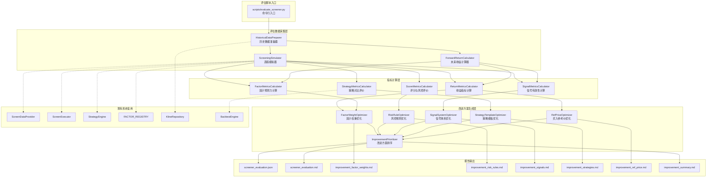

# 设计文档：智能选股功能评价指标与业务逻辑评估

## 概述

本设计文档描述智能选股评估系统的技术实现方案。系统分为三层：评估数据采集层、指标计算层、改进方案生成层。整体设计遵循以下原则：

1. **复用优先**：最大程度复用现有选股引擎（ScreenExecutor、ScreenDataProvider、StrategyEngine）和回测引擎（BacktestEngine）的代码
2. **离线评估**：评估脚本独立于在线服务运行，直接连接数据库读取历史数据，不影响生产环境
3. **增量友好**：支持按日期范围评估，便于定期运行和对比
4. **可执行输出**：改进方案精确到文件路径、代码行号和具体参数值

## 架构图



## 详细技术实现方案

### 1. 文件结构

```
app/services/screener/
├── evaluation/                          # 新增：评估子模块
│   ├── __init__.py
│   ├── historical_data_preparer.py      # 历史数据准备器
│   ├── screening_simulator.py           # 选股模拟器
│   ├── forward_return_calculator.py     # 未来收益计算器
│   ├── return_metrics.py                # 收益指标计算
│   ├── signal_metrics.py                # 信号有效性计算
│   ├── factor_metrics.py                # 因子预测力计算
│   ├── score_metrics.py                 # 评分与风控评价
│   ├── strategy_metrics.py              # 策略对比评价
│   ├── factor_weight_optimizer.py       # 因子权重优化方案
│   ├── risk_rule_optimizer.py           # 风控规则优化方案
│   ├── signal_optimizer.py              # 信号体系优化方案
│   ├── strategy_optimizer.py            # 策略模板优化方案
│   ├── ref_price_optimizer.py           # 买入参考价优化方案
│   ├── improvement_prioritizer.py       # 改进方案汇总排序
│   └── report_generator.py             # 报告生成器
scripts/
├── evaluate_screener.py                 # 评估脚本入口
reports/                                 # 新增：报告输出目录
├── .gitkeep
tests/services/screener/
├── test_evaluation_*.py                 # 评估模块单元测试
```

### 2. 核心类设计

#### 2.1 HistoricalDataPreparer — 历史数据准备器

**文件：** `app/services/screener/evaluation/historical_data_preparer.py`

**职责：** 为评估期内的每个交易日准备选股所需的全市场数据快照。

```python
class HistoricalDataPreparer:
    """历史数据准备器，为每个评估日加载市场数据快照"""

    def __init__(self, pg_session: AsyncSession, ts_session: AsyncSession):
        self.kline_repo = KlineRepository(ts_session)
        self.pg_session = pg_session

    async def get_trading_dates(
        self, start_date: date, end_date: date
    ) -> list[date]:
        """从 K 线表查询评估期内的交易日列表"""

    async def load_daily_snapshot(
        self, trade_date: date, lookback_days: int = 120
    ) -> dict[str, dict]:
        """加载指定交易日的全市场因子快照
        返回: {symbol: factor_dict}
        复用 ScreenDataProvider._build_factor_dict 的逻辑
        """

    async def load_index_data(
        self, index_code: str, start_date: date, end_date: date
    ) -> dict[date, dict]:
        """加载指数日线数据（沪深300等），用于计算超额收益和市场环境分类
        返回: {date: {close, open, ma20, ma60, change_pct_20d}}
        """

    async def load_stock_info(self) -> dict[str, dict]:
        """加载股票基本信息（行业、市值分组等），用于分组分析"""
```

**设计要点：**
- 复用 `ScreenDataProvider` 的因子计算逻辑，但以指定日期为"当天"进行计算
- 使用 `KlineRepository.query()` 按日期范围查询 K 线，lookback_days=120 确保均线等指标有足够历史数据
- 数据按交易日缓存，避免重复查询

#### 2.2 ScreeningSimulator — 选股模拟器

**文件：** `app/services/screener/evaluation/screening_simulator.py`

**职责：** 在历史数据上模拟运行选股引擎，生成每个交易日的选股结果。

```python
@dataclass
class DailyScreenResult:
    """单日选股模拟结果"""
    trade_date: date
    strategy_id: str
    strategy_name: str
    items: list[ScreenItem]
    market_risk_level: MarketRiskLevel
    execution_time_ms: float

class ScreeningSimulator:
    """选股模拟器，在历史数据上回放选股逻辑"""

    def __init__(self):
        self.screen_executor = ScreenExecutor()
        self.strategy_engine = StrategyEngine()

    def simulate_single_day(
        self,
        strategy_config: StrategyConfig,
        factor_data: dict[str, dict],
        market_risk_level: MarketRiskLevel,
        enabled_modules: list[str] | None = None,
    ) -> list[ScreenItem]:
        """模拟单日选股
        直接调用 ScreenExecutor 的纯函数方法（_execute, _apply_risk_filters_pure）
        """

    async def simulate_period(
        self,
        strategy_config: StrategyConfig,
        data_preparer: HistoricalDataPreparer,
        trading_dates: list[date],
        enabled_modules: list[str] | None = None,
    ) -> list[DailyScreenResult]:
        """模拟评估期内每个交易日的选股"""
```

**设计要点：**
- 调用 `ScreenExecutor` 的静态/纯函数方法（`_compute_weighted_score`、`_apply_risk_filters_pure`），避免依赖 Redis/数据库会话
- `StrategyEngine.screen_stocks()` 本身是纯函数，直接传入 factor_data 即可

#### 2.3 ForwardReturnCalculator — 未来收益计算器

**文件：** `app/services/screener/evaluation/forward_return_calculator.py`

**职责：** 计算选股结果中每只股票在未来 N 个交易日的实际收益。

```python
@dataclass
class ForwardReturn:
    """单只股票的未来收益数据"""
    symbol: str
    screen_date: date
    ref_buy_price: Decimal
    next_day_open: Decimal | None       # T+1 开盘价（实际买入价）
    can_buy: bool                        # T+1 是否可买入（非停牌/非涨停）
    ref_price_deviation: float           # 参考价偏离度
    returns: dict[int, float]            # {持有天数: 收益率}，如 {1: 0.02, 3: 0.05, ...}
    index_returns: dict[int, float]      # 同期指数收益率
    excess_returns: dict[int, float]     # 超额收益率

class ForwardReturnCalculator:
    """未来收益计算器"""

    HOLDING_PERIODS = [1, 3, 5, 10, 20]

    def __init__(self, kline_repo: KlineRepository):
        self.kline_repo = kline_repo

    async def calculate(
        self,
        screen_items: list[ScreenItem],
        screen_date: date,
        index_data: dict[date, dict],
        trading_dates: list[date],
    ) -> list[ForwardReturn]:
        """计算选股结果的未来收益
        买入价 = T+1 开盘价（前复权）
        卖出价 = T+N 收盘价（前复权）
        """

    def _check_can_buy(
        self, symbol: str, next_day_kline: KlineBar | None
    ) -> bool:
        """检查 T+1 是否可买入（非停牌、非一字涨停）"""
```

**设计要点：**
- 使用前复权价格计算收益，与选股引擎一致
- T+1 买入模拟真实交易场景（A 股 T+1 规则）
- 停牌/一字涨停判定：开盘价 == 涨停价 且 成交量极低 → 无法买入

#### 2.4 指标计算器（5 个）

**ReturnMetricsCalculator** (`return_metrics.py`)：
```python
@dataclass
class ReturnMetrics:
    """收益评价指标（需求 1）"""
    holding_period: int
    hit_rate: float                  # 命中率 (%)
    avg_return: float                # 平均收益率 (%)
    median_return: float             # 中位数收益率 (%)
    max_return: float                # 最大单股收益 (%)
    min_return: float                # 最小单股收益 (%)
    excess_return: float             # 超额收益 (%)
    unbuyable_rate: float            # 无法买入比例 (%)
    avg_ref_price_deviation: float   # 平均参考价偏离度 (%)
    ref_price_deviation_std: float   # 偏离度标准差 (%)
    sample_count: int                # 样本数量

class ReturnMetricsCalculator:
    @staticmethod
    def calculate(forward_returns: list[ForwardReturn]) -> dict[int, ReturnMetrics]:
        """按持有期计算收益指标，返回 {holding_period: ReturnMetrics}"""
```

**SignalMetricsCalculator** (`signal_metrics.py`)：
```python
@dataclass
class SignalMetric:
    """单信号有效性指标（需求 2）"""
    category: SignalCategory
    hit_rate: float
    avg_return: float
    trigger_count: int
    exclusive_return: float          # 单独触发时的收益

@dataclass
class SignalCombinationMetric:
    """信号组合指标"""
    categories: tuple[SignalCategory, ...]
    avg_return: float
    sample_count: int

class SignalMetricsCalculator:
    def calculate(
        self,
        daily_results: list[DailyScreenResult],
        forward_returns_map: dict[tuple[date, str], ForwardReturn],
    ) -> dict:
        """计算信号有效性指标
        返回: {
            'per_signal': {SignalCategory: SignalMetric},
            'by_strength': {SignalStrength: {SignalCategory: SignalMetric}},
            'by_freshness': {SignalFreshness: {SignalCategory: SignalMetric}},
            'combinations': list[SignalCombinationMetric],
            'combination_matrix': dict  # 两两组合矩阵
        }
        """
```

**FactorMetricsCalculator** (`factor_metrics.py`)：
```python
@dataclass
class FactorMetric:
    """单因子预测力指标（需求 3）"""
    factor_name: str
    ic_mean: float                   # IC 均值
    ir: float                        # IC 均值 / IC 标准差
    ic_positive_rate: float          # IC > 0 的比例 (%)
    ic_std: float                    # IC 标准差
    factor_turnover: float           # 因子值排名在相邻交易日的变化幅度
    classification: str              # "有效" / "无效" / "中性"

class FactorMetricsCalculator:
    def calculate(
        self,
        daily_factor_data: dict[date, dict[str, dict]],
        forward_returns_map: dict[tuple[date, str], ForwardReturn],
        holding_period: int = 5,
    ) -> dict:
        """计算因子预测力指标
        返回: {
            'per_factor': {factor_name: FactorMetric},
            'correlation_matrix': dict,  # 因子间相关性矩阵
            'redundant_pairs': list,     # 相关系数 > 0.7 的因子对
            'effective_factors': list,   # |IC| > 0.05 的因子
            'ineffective_factors': list  # |IC| < 0.02 的因子
        }
        """

    @staticmethod
    def _compute_cross_sectional_ic(
        factor_values: dict[str, float],
        forward_returns: dict[str, float],
    ) -> float:
        """计算单日横截面 Spearman 秩相关系数"""
```

**ScoreMetricsCalculator** (`score_metrics.py`)：
```python
@dataclass
class ScoreBandMetric:
    """评分区间指标（需求 4）"""
    band: str                        # "0-20", "20-40", ...
    avg_return: float
    hit_rate: float
    sample_count: int

@dataclass
class RiskFilterMetric:
    """风控规则指标"""
    rule_name: str
    filtered_count: int
    filtered_avg_return: float       # 被过滤股票的未来收益
    retained_avg_return: float       # 保留股票的未来收益
    is_over_filtering: bool          # 是否过度过滤

class ScoreMetricsCalculator:
    def calculate(
        self,
        daily_results: list[DailyScreenResult],
        forward_returns_map: dict[tuple[date, str], ForwardReturn],
        daily_factor_data: dict[date, dict[str, dict]],
    ) -> dict:
        """返回: {
            'score_bands': list[ScoreBandMetric],
            'score_monotonicity': float,  # Spearman 相关系数
            'risk_filters': list[RiskFilterMetric],
            'module_correlations': dict,  # 各模块评分与收益的相关性
            'optimal_weights': dict       # 基于 IC 的最优模块权重
        }"""
```

**StrategyMetricsCalculator** (`strategy_metrics.py`)：
```python
@dataclass
class StrategyMetric:
    """单策略评价指标（需求 5）"""
    strategy_name: str
    hit_rate: float
    avg_return: float
    sharpe_ratio: float
    max_drawdown: float
    avg_stock_count: float
    turnover: float
    composite_score: float           # 综合得分

@dataclass
class MarketEnvMetric:
    """按市场环境分组的策略指标"""
    env_type: str                    # "上涨市" / "震荡市" / "下跌市"
    strategy_metrics: list[StrategyMetric]

class StrategyMetricsCalculator:
    def calculate(
        self,
        all_strategy_results: dict[str, list[DailyScreenResult]],
        forward_returns_map: dict[tuple[date, str], ForwardReturn],
        index_data: dict[date, dict],
    ) -> dict:
        """返回: {
            'overall': list[StrategyMetric],  # 按综合得分排序
            'by_market_env': list[MarketEnvMetric],
            'bottom_20pct': list[str],  # 表现最差的策略名称
        }"""

    @staticmethod
    def _classify_market_env(index_data: dict[date, dict], trade_date: date) -> str:
        """基于沪深300判断市场环境（按需求 5 定义的规则，非复用 MarketEnvironmentClassifier）
        上涨市: MA20 > MA60 且近 20 日涨幅 > 5%
        震荡市: 近 20 日涨跌幅在 -3% 到 3% 之间
        下跌市: MA20 < MA60 且近 20 日跌幅 > 5%
        注: backtest_engine.py 中的 MarketEnvironmentClassifier 使用不同规则（price vs MA60），
        此处按需求文档定义的规则独立实现
        """

    @staticmethod
    def _compute_composite_score(metric: StrategyMetric) -> float:
        """综合得分 = hit_rate × 0.4 + avg_return × 0.3 + sharpe × 0.3"""
```

#### 2.5 改进方案生成器（6 个）

**FactorWeightOptimizer** (`factor_weight_optimizer.py`)：
```python
@dataclass
class FactorWeightRecommendation:
    """因子权重调整建议"""
    item_id: str                     # IMP-001 格式
    factor_name: str
    current_status: str              # "有效" / "无效" / "冗余"
    action: str                      # "提升权重" / "降权至0" / "移除" / "合并"
    detail: str                      # 具体说明
    file_path: str                   # 涉及的文件
    code_location: str               # 代码位置描述
    expected_effect: str             # 预期效果

@dataclass
class ModuleWeightRecommendation:
    """模块权重调整建议"""
    current_weights: dict[str, float]
    recommended_weights: dict[str, float]
    expected_hit_rate_change: float
    file_path: str                   # app/core/schemas.py
    code_location: str               # DEFAULT_MODULE_WEIGHTS

class FactorWeightOptimizer:
    def generate(
        self, factor_metrics: dict, score_metrics: dict
    ) -> dict:
        """生成因子权重优化方案（需求 13）
        返回: {
            'ineffective_factors': list[FactorWeightRecommendation],
            'effective_factors': list[FactorWeightRecommendation],
            'redundant_pairs': list[FactorWeightRecommendation],
            'module_weights': ModuleWeightRecommendation,
        }"""
```

**RiskRuleOptimizer** (`risk_rule_optimizer.py`)：
```python
@dataclass
class RiskRuleRecommendation:
    """风控规则调整建议"""
    item_id: str
    rule_name: str
    current_threshold: str
    recommended_threshold: str
    expected_additional_stocks: int   # 放宽后增加的选股数
    expected_hit_rate_change: float
    worst_case_loss: float           # 最坏情况潜在损失
    priority: int                    # 调整优先级
    file_path: str                   # app/services/screener/screen_executor.py
    code_snippet: str                # 具体修改代码片段

class RiskRuleOptimizer:
    def generate(self, score_metrics: dict) -> list[RiskRuleRecommendation]:
        """生成风控规则优化方案（需求 14）"""
```

**SignalSystemOptimizer** (`signal_optimizer.py`)：
```python
@dataclass
class SignalParamRecommendation:
    """信号参数调整建议"""
    item_id: str
    signal_category: SignalCategory
    current_params: dict
    recommended_params: dict
    expected_hit_rate_change: float
    file_path: str
    code_location: str

@dataclass
class SignalCombinationRecommendation:
    """高效信号组合推荐"""
    categories: list[SignalCategory]
    avg_return: float
    hit_rate: float
    sample_count: int
    suggested_strategy_name: str

class SignalSystemOptimizer:
    def generate(self, signal_metrics: dict) -> dict:
        """生成信号体系优化方案（需求 15）
        返回: {
            'effective_signals': list[SignalParamRecommendation],
            'ineffective_signals': list[SignalParamRecommendation],
            'param_adjustments': list[SignalParamRecommendation],
            'top_dual_combinations': list[SignalCombinationRecommendation],
            'top_triple_combinations': list[SignalCombinationRecommendation],
        }"""
```

**StrategyTemplateOptimizer** (`strategy_optimizer.py`)：
```python
@dataclass
class StrategyRecommendation:
    """策略模板调整建议"""
    item_id: str
    strategy_name: str
    action: str                      # "淘汰" / "优化参数" / "新增"
    current_score: float | None
    recommended_changes: dict | None  # 参数调整详情
    new_config: dict | None          # 新增策略的完整配置
    backtest_before: dict | None     # 优化前回测指标
    backtest_after: dict | None      # 优化后预期指标
    file_path: str                   # app/services/screener/strategy_examples.py

@dataclass
class MarketEnvRecommendation:
    """按市场环境的策略推荐"""
    env_type: str
    top_strategies: list[str]
    explanation: str

class StrategyTemplateOptimizer:
    def generate(
        self, strategy_metrics: dict, signal_metrics: dict, factor_metrics: dict
    ) -> dict:
        """生成策略模板优化方案（需求 16）
        返回: {
            'retire': list[StrategyRecommendation],
            'optimize': list[StrategyRecommendation],
            'new_strategies': list[StrategyRecommendation],
            'market_env_recommendations': list[MarketEnvRecommendation],
        }"""
```

**RefPriceOptimizer** (`ref_price_optimizer.py`)：
```python
@dataclass
class RefPriceRecommendation:
    """买入参考价调整建议"""
    item_id: str
    current_method: str              # "收盘价"
    recommended_method: str
    avg_deviation: float
    deviation_std: float
    by_market_cap: dict              # 按市值分组的偏离度
    by_signal_strength: dict         # 按信号强度分组的偏离度
    file_path: str                   # app/services/screener/screen_executor.py
    code_snippet: str

class RefPriceOptimizer:
    def generate(self, return_metrics: dict) -> RefPriceRecommendation:
        """生成买入参考价优化方案（需求 17）"""
```

**ImprovementPrioritizer** (`improvement_prioritizer.py`)：
```python
@dataclass
class ImprovementItem:
    """单条改进建议"""
    item_id: str                     # IMP-001
    category: str                    # 因子权重/风控规则/信号参数/策略模板/买入参考价
    description: str
    expected_effect: str             # 量化预期效果
    difficulty: str                  # 低/中/高
    files: list[str]                 # 涉及文件
    priority_score: float            # 优先级得分
    phase: int                       # 实施阶段 1/2/3

class ImprovementPrioritizer:
    def prioritize(
        self,
        factor_recommendations: dict,
        risk_recommendations: list,
        signal_recommendations: dict,
        strategy_recommendations: dict,
        ref_price_recommendation: dict,
    ) -> dict:
        """汇总排序所有改进建议（需求 18）
        返回: {
            'items': list[ImprovementItem],  # 按优先级排序
            'phase_1': list[ImprovementItem],  # 快速见效
            'phase_2': list[ImprovementItem],  # 核心优化
            'phase_3': list[ImprovementItem],  # 深度重构
            'phase_effects': {1: {...}, 2: {...}, 3: {...}},  # 各阶段预期效果
        }"""

    @staticmethod
    def _compute_priority_score(
        expected_effect_score: float, difficulty_score: float
    ) -> float:
        """优先级 = 预期效果 × 0.6 + (1 - 难度) × 0.4"""
```

### 3. 评估脚本入口设计

**文件：** `scripts/evaluate_screener.py`

```python
#!/usr/bin/env python3
"""智能选股功能评估脚本

用法:
    python scripts/evaluate_screener.py
    python scripts/evaluate_screener.py --start-date 2025-01-01 --end-date 2025-03-31
    python scripts/evaluate_screener.py --strategies strategy1_id,strategy2_id
    python scripts/evaluate_screener.py --format markdown --output reports/eval.md

评估内容:
    1. 选股结果收益评价（命中率、超额收益、参考价偏离度）
    2. 信号有效性评价（10 种信号的独立和共振效果）
    3. 因子预测力评价（IC/IR、有效/无效因子识别）
    4. 趋势评分与风控有效性评价
    5. 22 个策略模板横向对比
    6. 可执行改进方案生成（因子权重/风控/信号/策略/参考价）
"""

import argparse
import asyncio
from datetime import date, timedelta

async def main():
    parser = argparse.ArgumentParser(description="智能选股功能评估")
    parser.add_argument("--start-date", type=str, default=None)
    parser.add_argument("--end-date", type=str, default=None)
    parser.add_argument("--strategies", type=str, default=None)
    parser.add_argument("--output", type=str, default="reports/screener_evaluation.json")
    parser.add_argument("--format", choices=["json", "markdown", "both"], default="both")
    args = parser.parse_args()

    # 执行流程:
    # 1. 初始化数据库连接
    # 2. HistoricalDataPreparer 加载评估期数据
    # 3. ScreeningSimulator 模拟每日选股
    # 4. ForwardReturnCalculator 计算未来收益
    # 5. 5 个指标计算器并行计算
    # 6. 5 个优化器生成改进方案
    # 7. ImprovementPrioritizer 汇总排序
    # 8. ReportGenerator 输出报告
    #
    # 性能约束: 总执行时间不超过 30 分钟（基于 60 个交易日、约 5000 只股票）
    # 进度显示: 每完成一个阶段输出进度百分比和耗时
    # 最终摘要: print(f"评估完成：命中率 {hit_rate}%，平均超额收益 {excess}%，有效因子 {n}/52，改进建议 {m} 条")

if __name__ == "__main__":
    asyncio.run(main())
```

### 4. 报告生成器设计

**文件：** `app/services/screener/evaluation/report_generator.py`

```python
class ReportGenerator:
    """评估报告生成器"""

    def generate_json(self, evaluation_data: dict, output_path: str):
        """生成 JSON 格式报告"""

    def generate_markdown(self, evaluation_data: dict, output_path: str):
        """生成 Markdown 格式报告，包含:
        - 总体评价摘要
        - 收益指标表格
        - 信号有效性排名表
        - 因子 IC 排名表
        - 评分区分度表
        - 策略对比排名表
        - 改进建议优先级清单
        """

    def generate_improvement_reports(self, improvements: dict, output_dir: str):
        """生成 6 份独立的改进方案报告:
        - improvement_factor_weights.md
        - improvement_risk_rules.md
        - improvement_signals.md
        - improvement_strategies.md
        - improvement_ref_price.md
        - improvement_summary.md
        """
```

### 5. 数据流设计

评估脚本的完整数据流：

```
1. 数据准备阶段（约 5-10 分钟）
   ├── 查询评估期交易日列表
   ├── 逐日加载全市场因子快照（复用 ScreenDataProvider 逻辑）
   ├── 加载沪深300指数数据
   └── 加载股票基本信息（行业、市值）

2. 选股模拟阶段（约 10-15 分钟）
   ├── 对每个策略模板 × 每个交易日运行选股
   ├── 记录选股结果（ScreenItem 列表）
   └── 记录执行时间

3. 收益计算阶段（约 3-5 分钟）
   ├── 对每个选股结果计算 T+1/3/5/10/20 未来收益
   ├── 计算参考价偏离度
   └── 标记无法买入的股票

4. 指标计算阶段（约 2-3 分钟，5 个计算器并行）
   ├── ReturnMetricsCalculator
   ├── SignalMetricsCalculator
   ├── FactorMetricsCalculator
   ├── ScoreMetricsCalculator
   └── StrategyMetricsCalculator

5. 改进方案生成阶段（约 1-2 分钟）
   ├── FactorWeightOptimizer
   ├── RiskRuleOptimizer
   ├── SignalSystemOptimizer
   ├── StrategyTemplateOptimizer
   ├── RefPriceOptimizer
   └── ImprovementPrioritizer

6. 报告输出阶段（< 1 分钟）
   ├── JSON 报告
   ├── Markdown 报告
   └── 6 份改进方案报告
```

### 6. 业务逻辑测试设计

测试文件位于 `tests/services/screener/` 目录下，使用 pytest + pytest-asyncio。

**test_evaluation_data_integrity.py**（需求 7）：
- `test_factor_dict_has_all_registered_keys`：验证 factor_dict 包含 52 个因子键
- `test_factor_coverage_rate`：验证各因子非 None 覆盖率 >= 50%
- `test_percentile_values_in_range`：验证百分位值在 [0, 100]
- `test_industry_relative_values_positive`：验证行业相对值为正数
- `test_data_freshness`：验证数据时效性

**test_evaluation_factor_correctness.py**（需求 8）：
- `test_ma_calculation_accuracy`：使用已知数据验证 MA 计算精度
- `test_macd_calculation_accuracy`：验证 MACD DIF/DEA/柱
- `test_ma_trend_score_boundaries`：验证多头/空头排列的评分边界
- `test_breakout_detection_logic`：验证三种突破检测
- `test_false_breakout_marking`：验证假突破标记
- `test_signal_strength_ordering`：验证 STRONG > MEDIUM > WEAK

**test_evaluation_strategy_engine.py**（需求 9）：
- `test_and_logic_all_must_pass`：AND 模式全部满足才通过
- `test_or_logic_any_can_pass`：OR 模式任一满足即通过
- `test_weighted_score_calculation`：验证加权评分公式
- `test_disabled_module_excluded`：未启用模块不计入
- `test_threshold_types_evaluation`：6 种阈值类型判断
- `test_strategy_config_roundtrip`：序列化往返一致性

**test_evaluation_risk_filters.py**（需求 10）：
- `test_normal_no_filtering`：NORMAL 不过滤
- `test_caution_threshold_90`：CAUTION 保留 >= 90
- `test_danger_threshold_95`：DANGER 保留 >= 95
- `test_daily_gain_filter_boundary`：9% 边界值测试
- `test_cumulative_gain_filter`：3 日累计 20% 过滤
- `test_blacklist_filter`：黑名单过滤
- `test_filter_order_idempotent`：过滤顺序幂等性

**test_evaluation_consistency.py**（需求 11）：
- `test_deterministic_results`：相同输入产生相同输出
- `test_screening_backtest_signal_consistency`：选股与回测信号一致
- `test_change_detection_new`：NEW 变化检测
- `test_change_detection_updated`：UPDATED 变化检测
- `test_change_detection_removed`：REMOVED 变化检测
- `test_redis_db_result_consistency`：Redis 缓存与数据库持久化结果一致

### 7. 向后兼容性说明

- 评估模块作为独立子包 `app/services/screener/evaluation/` 新增，不修改任何现有选股引擎代码
- 评估脚本通过只读方式访问数据库，不写入任何业务数据
- 报告输出到独立的 `reports/` 目录，不影响现有项目结构
- 测试文件遵循现有 `tests/services/screener/` 的组织方式
- 改进方案仅作为建议输出，不自动修改代码
