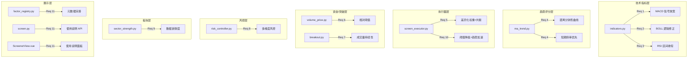
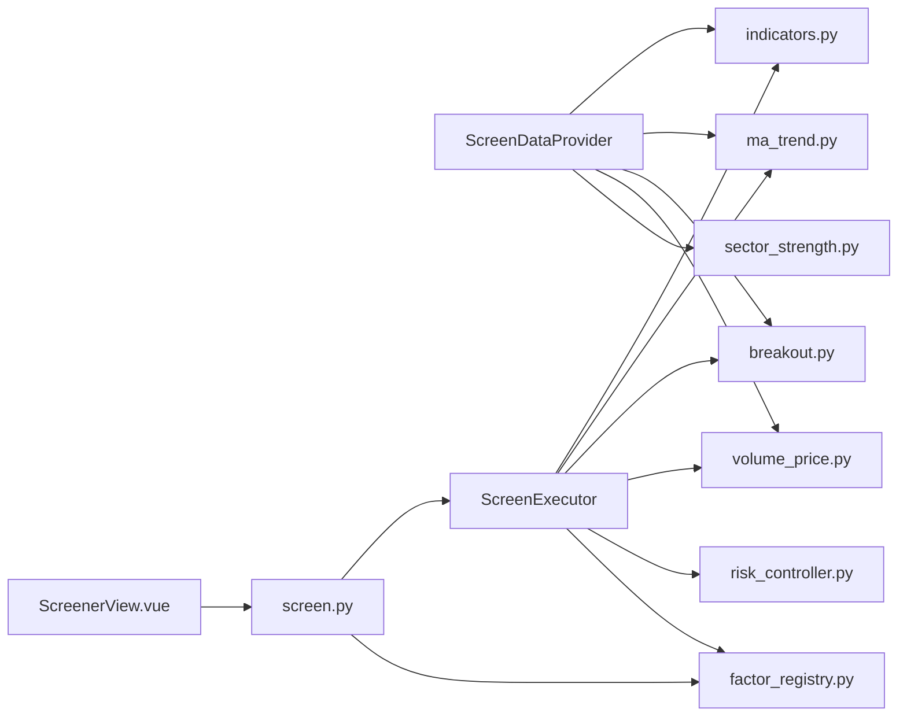

# Design Document: Screening Parameter Optimization

## Overview

本设计文档覆盖智能选股管线（Screening Pipeline）的 11 项参数优化与新功能需求。变更范围涉及 6 个后端模块（indicators、ma_trend、screen_executor、volume_price、breakout、risk_controller）、1 个板块筛选模块（sector_strength）、1 个因子注册表（factor_registry）、1 个 API 层（screen.py）和 1 个前端视图（ScreenerView.vue）。

### 变更范围总览



### 设计原则

1. **纯函数优先**：所有核心计算逻辑实现为静态纯函数（`_pure` 后缀或 `@staticmethod`），便于属性测试
2. **向后兼容**：新增参数均提供默认值，现有 API 签名不做破坏性变更
3. **结构化返回值**：信号检测函数返回 dataclass 而非裸 bool，携带强度、类型等元数据
4. **配置驱动**：所有新增阈值均可通过 `StrategyConfig` / 子配置类参数化

---

## Architecture

### 模块依赖关系（变更后）



### 数据流（变更后）

1. `ScreenDataProvider` 加载 K 线数据，调用各检测函数生成派生因子
2. 检测函数返回**结构化结果**（含 signal、strength、附加标记），而非裸 bool
3. `ScreenExecutor` 使用**差异化权重**和**共振加分**计算模块评分
4. `MarketRiskChecker` 使用**多维度**（均线 + 广度 + 量变）判定风险等级
5. DANGER 模式下**允许强势股通过**（trend_score ≥ 95）
6. 前端通过新 API 获取因子使用说明并展示

---

## Components and Interfaces

### Requirement 1: MACD 信号条件放宽

**文件**: `app/services/screener/indicators.py`

**变更**: 重构 `detect_macd_signal` 函数，支持零轴下方二次金叉，DEA 趋势作为强度修饰符。

**新增数据类**:
```python
@dataclass
class MACDSignalResult:
    """MACD 信号检测结构化结果"""
    dif: list[float]
    dea: list[float]
    macd: list[float]
    signal: bool                          # 是否生成信号
    strength: SignalStrength              # 信号强度
    signal_type: str                      # "above_zero" | "below_zero_second" | "none"
```

**算法变更**:
- **零轴上方金叉**（现有逻辑简化）：DIF > 0, DEA > 0, DIF 上穿 DEA, MACD 红柱放大 → signal=True, strength=STRONG
- **零轴下方二次金叉**（新增）：在最近 60 个交易日内检测到一次零轴下方金叉后死叉，当前再次金叉 → signal=True, strength=WEAK
- **DEA 趋势修饰符**（从硬性条件改为修饰符）：DEA[last] > DEA[prev] 时，strength 提升一级（WEAK→MEDIUM, MEDIUM→STRONG, STRONG 不变）
- **零轴下方首次金叉**：不生成信号（signal=False）

**新增辅助函数**:
```python
def _count_below_zero_golden_crosses(
    dif: list[float], dea: list[float], lookback: int = 60
) -> int:
    """统计最近 lookback 天内零轴下方金叉次数（纯函数）"""
```

**接口变更**: `detect_macd_signal` 返回类型从 `MACDResult` 改为 `MACDSignalResult`。`ScreenDataProvider._build_factor_dict` 中调用处需适配新返回类型，将 `signal` 和 `strength` 写入 `stock_data`。

---

### Requirement 2: BOLL 信号逻辑修正

**文件**: `app/services/screener/indicators.py`

**变更**: 重构 `detect_boll_signal` 函数，以"中轨突破 + 2 日站稳"为主信号，"接近上轨"改为风险提示。

**新增数据类**:
```python
@dataclass
class BOLLSignalResult:
    """BOLL 信号检测结构化结果"""
    upper: list[float]
    middle: list[float]
    lower: list[float]
    signal: bool                # 中轨突破 + 站稳信号
    near_upper_band: bool       # 接近上轨风险提示
    hold_days: int              # 连续站稳中轨天数
```

**算法变更**:
- **主信号条件**：当日收盘价 > 中轨 AND 前一日收盘价 > 前一日中轨（连续 2 日站稳）→ signal=True
- **风险提示**：当日收盘价 >= 上轨 × 0.98 → near_upper_band=True（独立于 signal）
- **hold_days 计算**：从最新一天向前扫描，统计连续收盘价 > 中轨的天数
- **移除**：原有的"触碰上轨"作为买入条件的逻辑

---

### Requirement 3: RSI 区间收窄与趋势方向检查

**文件**: `app/services/screener/indicators.py`

**变更**: 修改 `detect_rsi_signal` 函数，默认区间改为 [55, 75]，新增连续上升检查。

**新增数据类**:
```python
@dataclass
class RSISignalResult:
    """RSI 信号检测结构化结果"""
    values: list[float]
    signal: bool
    current_rsi: float          # 当前 RSI 值
    consecutive_rising: int     # 连续上升天数
```

**算法变更**:
- 默认强势区间从 `[50, 80]` 改为 `[55, 75]`
- 新增参数 `rising_days: int = 3`（连续上升天数要求）
- 信号条件：RSI 在 [lower, upper] 区间内 AND 最近 `rising_days` 天 RSI 严格递增
- 保留超买背离检测逻辑
- 数据不足时（可用天数 < rising_days + period）返回 signal=False

**函数签名变更**:
```python
def detect_rsi_signal(
    closes: list[float],
    period: int = DEFAULT_RSI_PERIOD,
    lower_bound: float = 55.0,    # 原 50.0
    upper_bound: float = 75.0,    # 原 80.0
    rising_days: int = 3,         # 新增
    rsi_result: RSIResult | None = None,
) -> RSISignalResult:
```

---

### Requirement 4: MA 趋势评分权重优化

**文件**: `app/services/screener/ma_trend.py`

**变更**: 修改 `score_ma_trend` 中的距离分计算和斜率权重分配。

**距离分钟形曲线算法**:
```python
def _bell_curve_distance_score(pct_above: float) -> float:
    """
    钟形曲线距离评分（纯函数）。
    
    pct_above: 价格在均线上方的百分比距离
    返回: 0-100 分
    
    规则:
    - [0%, 3%]: 满分 100
    - (3%, 5%]: 线性递减 100 → 60
    - (5%, 10%]: 线性递减 60 → 20
    - > 10%: 固定 20 分
    - < 0%（价格在均线下方）: 线性递减，-5% 时为 0 分
    """
```

**斜率权重分配**:
- 短期均线（5 日、10 日）斜率权重系数 = 2.0
- 中期均线（20 日）斜率权重系数 = 1.0
- 长期均线（60 日、120 日）斜率权重系数 = 1.0
- 加权平均斜率 = Σ(slope_i × weight_i) / Σ(weight_i)

**不变量**: score_ma_trend 返回值始终在 [0, 100] 闭区间内，且对同一输入多次调用返回相同结果。

---

### Requirement 5: 模块评分权重差异化与共振加分

**文件**: `app/services/screener/screen_executor.py`

**变更**: 修改 `_execute` 方法中 `indicator_params` 模块评分逻辑。

**新评分公式**:
```python
# 差异化权重
_INDICATOR_WEIGHTS = {
    "macd": 35.0,
    "rsi": 25.0,
    "boll": 20.0,
    "dma": 20.0,
}

# 共振加分
def _compute_indicator_score(triggered: dict[str, bool]) -> float:
    """
    计算 indicator_params 模块评分（纯函数）。
    
    base_score = sum(weight for ind, weight in _INDICATOR_WEIGHTS if triggered[ind])
    triggered_count = sum(1 for v in triggered.values() if v)
    resonance_bonus = 0 if count < 2 else (10 if count == 2 else 20)
    return min(base_score + resonance_bonus, 100.0)
    """
```

**新增静态方法**: `ScreenExecutor._compute_indicator_score(triggered: dict[str, bool]) -> float`

---

### Requirement 6: 资金流信号阈值相对化

**文件**: `app/services/screener/volume_price.py`

**变更**: 新增相对阈值模式的资金流信号检测函数。

**新增函数**:
```python
def check_money_flow_signal_relative(
    daily_inflows: list[float],
    daily_amounts: list[float],
    relative_threshold_pct: float = 5.0,
    consecutive: int = 2,
    amount_period: int = 20,
) -> MoneyFlowSignal:
    """
    相对阈值模式的资金流信号检测（纯函数）。
    
    信号条件: net_inflow / avg_daily_amount >= relative_threshold_pct%
    连续 consecutive 天满足条件时触发信号。
    
    当 avg_daily_amount <= 0 时回退到 None（由调用方决定 fallback）。
    """
```

**向后兼容**: 保留原 `check_money_flow_signal` 函数不变。`ScreenDataProvider` 中根据配置参数选择调用哪个函数。

**新增配置字段** (`VolumePriceConfig`):
```python
money_flow_mode: str = "relative"           # "relative" | "absolute"
relative_threshold_pct: float = 5.0         # 相对阈值百分比
```

---

### Requirement 7: 突破信号成交量持续性验证

**文件**: `app/services/screener/breakout.py`

**变更**: 新增突破后成交量持续性验证和横盘整理加分。

**新增函数**:
```python
def check_volume_sustainability(
    breakout_volume: int,
    post_breakout_volumes: list[int],
    sustain_threshold_pct: float = 0.70,
    fail_threshold_pct: float = 0.50,
) -> bool | None:
    """
    验证突破后成交量持续性（纯函数）。
    
    返回:
    - True: 连续 2 日成交量 >= breakout_volume × sustain_threshold_pct
    - False: 任一日成交量 < breakout_volume × fail_threshold_pct
    - None: 数据不足（post_breakout_volumes 长度 < 2）
    """

def check_consolidation_bonus(
    box_period_days: int,
    min_consolidation_days: int = 30,
) -> bool:
    """判断箱体突破前横盘整理期是否足够长（纯函数）。"""
```

**BreakoutSignal 扩展字段**:
```python
volume_sustained: bool | None = None    # 成交量持续性
consolidation_bonus: bool = False       # 横盘整理加分
```

---

### Requirement 8: 市场风控多维度增强

**文件**: `app/services/risk_controller.py`

**变更**: 扩展 `MarketRiskChecker.check_market_risk` 方法，增加市场广度和成交量变化率维度。

**新增方法签名**:
```python
def check_market_risk(
    self,
    index_closes: list[float],
    market_breadth: float | None = None,      # 涨跌比（上涨数/下跌数）
    volume_change_rate: float | None = None,  # 成交量变化率
    breadth_threshold: float = 0.5,           # 广度阈值
) -> MarketRiskLevel:
```

**算法变更**:
1. 先用现有均线逻辑计算基础风险等级
2. 若 market_breadth 可用且 < breadth_threshold，风险等级提升一级
3. DANGER 模式下不再完全暂停买入，改为仅允许 trend_score ≥ 95 的强势股通过

**Screen_Executor 变更**: `_apply_risk_filters_pure` 中 DANGER 分支从返回空列表改为过滤 trend_score < 95 的股票。新增配置参数 `danger_strong_threshold: float = 95.0`。

---

### Requirement 9: 板块数据新鲜度检测

**文件**: `app/services/screener/sector_strength.py`

**变更**: 在 `compute_sector_ranks` 方法中增加数据新鲜度检查。

**新增纯函数**:
```python
@staticmethod
def check_data_freshness(
    latest_data_date: date,
    current_date: date,
    warning_threshold_days: int = 2,
    degrade_threshold_days: int = 5,
) -> tuple[bool, bool, int]:
    """
    检查板块数据新鲜度（纯函数）。
    
    返回: (should_warn, should_degrade, stale_days)
    - should_warn: 是否应记录 WARNING（stale_days > warning_threshold）
    - should_degrade: 是否应降级（stale_days > degrade_threshold）
    - stale_days: 数据延迟交易日数
    """
```

**交易日计算**: 使用简化的工作日计算（排除周末），不考虑节假日。

---

### Requirement 10: 趋势评分阈值降低与趋势加速信号

**文件**: `app/services/screener/screen_executor.py`

**变更**:
1. `MaTrendConfig.trend_score_threshold` 默认值从 80 改为 68
2. 新增趋势加速信号检测逻辑

**新增静态方法**:
```python
@staticmethod
def _detect_trend_acceleration(
    current_score: float,
    previous_score: float | None,
    acceleration_high: float = 70.0,
    acceleration_low: float = 60.0,
) -> bool:
    """
    检测趋势加速信号（纯函数）。
    
    条件: current_score >= acceleration_high AND previous_score < acceleration_low
    previous_score 为 None 时返回 False。
    """
```

**信号生成**: 当趋势加速触发时，生成 `SignalDetail(category=MA_TREND, label="ma_trend_acceleration", strength=STRONG)`。

---

### Requirement 11: 因子指标使用说明展示

**后端变更**:

**文件**: `app/services/screener/factor_registry.py`
- 确保所有 19 个因子的 `description` 字段非空
- 补充缺失的 `examples` 列表

**文件**: `app/api/v1/screen.py`
- 新增 API 端点:
  - `GET /api/v1/screen/factors` — 返回所有因子元数据（按 category 分组）
  - `GET /api/v1/screen/factors/{factor_name}/usage` — 返回单个因子的使用说明

**前端变更**:

**文件**: `frontend/src/views/ScreenerView.vue`
- 在因子条件编辑器中，当用户选择因子时展示使用说明面板
- 面板内容：description、examples、推荐阈值范围
- 通过 `GET /api/v1/screen/factors/{factor_name}/usage` 获取数据

---

## Data Models

### 新增/修改的数据类

#### `app/core/schemas.py` 变更

```python
# MaTrendConfig 默认值变更
@dataclass
class MaTrendConfig:
    trend_score_threshold: int = 68     # 原 80，需求 10

# VolumePriceConfig 新增字段
@dataclass
class VolumePriceConfig:
    # ... 现有字段 ...
    money_flow_mode: str = "relative"           # 新增：需求 6
    relative_threshold_pct: float = 5.0         # 新增：需求 6

# IndicatorParamsConfig 新增字段
@dataclass
class IndicatorParamsConfig:
    rsi_lower: int = 55     # 原 50，需求 3
    rsi_upper: int = 75     # 原 80，需求 3
```

#### `app/services/screener/indicators.py` 新增数据类

- `MACDSignalResult` — MACD 结构化结果（signal, strength, signal_type）
- `BOLLSignalResult` — BOLL 结构化结果（signal, near_upper_band, hold_days）
- `RSISignalResult` — RSI 结构化结果（signal, current_rsi, consecutive_rising）

#### `app/services/screener/breakout.py` 扩展

- `BreakoutSignal` 新增字段：`volume_sustained: bool | None`, `consolidation_bonus: bool`

### 配置序列化兼容性

所有新增字段在 `to_dict()` / `from_dict()` 中提供默认值，确保旧配置 JSON 反序列化不报错。

---

## API Changes

### 新增端点

#### `GET /api/v1/screen/factors`

返回所有因子元数据列表，按 category 分组。

**响应示例**:
```json
{
  "technical": [
    {
      "factor_name": "ma_trend",
      "label": "MA趋势打分",
      "category": "technical",
      "threshold_type": "absolute",
      "default_threshold": 80,
      "value_min": 0,
      "value_max": 100,
      "unit": "分",
      "description": "基于均线排列程度、斜率和价格距离的综合打分...",
      "examples": [{"operator": ">=", "threshold": 80, "说明": "..."}],
      "default_range": null
    }
  ],
  "money_flow": [...],
  "fundamental": [...],
  "sector": [...]
}
```

#### `GET /api/v1/screen/factors/{factor_name}/usage`

返回单个因子的使用说明。

**响应示例**:
```json
{
  "factor_name": "rsi",
  "label": "RSI强势信号",
  "description": "RSI 处于强势区间且无超买背离...",
  "examples": [...],
  "default_range": [55, 75],
  "unit": "",
  "threshold_type": "range"
}
```

**错误响应** (404):
```json
{"detail": "因子 'unknown_factor' 不存在"}
```

### 现有端点变更

`POST /screen/run` 响应中的信号详情新增字段：
- `signal_type`: MACD 信号类型（"above_zero" / "below_zero_second"）
- `near_upper_band`: BOLL 接近上轨风险提示
- `volume_sustained`: 突破成交量持续性
- `consolidation_bonus`: 横盘整理加分

---


## Correctness Properties

*A property is a characteristic or behavior that should hold true across all valid executions of a system — essentially, a formal statement about what the system should do. Properties serve as the bridge between human-readable specifications and machine-verifiable correctness guarantees.*

### Property 1: MACD 信号类型与强度分类

*For any* valid close price sequence of sufficient length, the MACD detector SHALL classify signals as follows: when DIF > 0, DEA > 0, golden cross occurs, and MACD bars expand, signal=True with strength=STRONG and signal_type="above_zero"; when a second below-zero golden cross occurs within 60 days, signal=True with strength=WEAK and signal_type="below_zero_second"; and the result SHALL always contain valid signal (bool), strength (SignalStrength), and signal_type (str) fields.

**Validates: Requirements 1.1, 1.2, 1.4**

### Property 2: DEA 趋势向上提升信号强度

*For any* MACD signal result where signal=True, if DEA is trending up (DEA[last] > DEA[prev]), the strength SHALL be one level higher than the base strength (WEAK→MEDIUM, MEDIUM→STRONG), and STRONG SHALL remain STRONG.

**Validates: Requirements 1.3**

### Property 3: BOLL 信号需要连续 2 日站稳中轨

*For any* close price sequence, the BOLL detector SHALL return signal=True if and only if the last 2 consecutive closes are both above their respective middle band values. The result SHALL always contain signal (bool), near_upper_band (bool), and hold_days (int >= 0).

**Validates: Requirements 2.1, 2.3, 2.4**

### Property 4: BOLL 接近上轨风险标记

*For any* close price sequence with valid BOLL bands, near_upper_band SHALL be True if and only if the last close >= upper_band × 0.98, independent of the signal field value.

**Validates: Requirements 2.2**

### Property 5: RSI 信号需要区间内且连续上升

*For any* close price sequence of sufficient length, the RSI detector SHALL return signal=True if and only if the current RSI value is within [lower_bound, upper_bound] AND the RSI values have been strictly increasing for the last `rising_days` consecutive trading days AND no overbought divergence is detected.

**Validates: Requirements 3.2, 3.3, 3.5**

### Property 6: MA 趋势距离分钟形曲线形状

*For any* price and moving average value pair where MA > 0, the bell curve distance score SHALL satisfy: score(pct=2%) >= score(pct=6%), score(pct=0%) >= score(pct=4%), and score(pct) is monotonically non-increasing for pct > 3%. The score SHALL always be in [0, 100].

**Validates: Requirements 4.1, 4.4**

### Property 7: MA 趋势短期均线斜率优先

*For any* close price sequence, the slope component of the MA trend score SHALL weight short-term MAs (5-day, 10-day) at 2× the weight of long-term MAs (60-day, 120-day). Specifically, given two sequences where only the short-term slope is positive vs only the long-term slope is positive (with equal magnitude), the short-term-only case SHALL produce a higher slope score.

**Validates: Requirements 4.2**

### Property 8: MA 趋势评分范围不变量与幂等性

*For any* valid close price sequence and MA period configuration, `score_ma_trend` SHALL return a score in [0, 100], and calling it multiple times with the same input SHALL return identical results.

**Validates: Requirements 4.3, 4.5**

### Property 9: 技术指标差异化权重与共振加分

*For any* combination of triggered technical indicators (MACD, RSI, BOLL, DMA as booleans), the indicator_params module score SHALL equal min(base_score + resonance_bonus, 100), where base_score = sum of triggered indicator weights (MACD=35, RSI=25, BOLL=20, DMA=20), resonance_bonus = 0 when count < 2, 10 when count == 2, and 20 when count >= 3.

**Validates: Requirements 5.1, 5.2, 5.3, 5.4, 5.5**

### Property 10: 相对资金流信号

*For any* sequence of daily net inflows and daily amounts, the relative money flow signal SHALL be True if and only if net_inflow[day] / avg_daily_amount >= relative_threshold_pct for at least `consecutive` consecutive days ending at the most recent day, where avg_daily_amount is the mean of the last `amount_period` daily amounts. When avg_daily_amount <= 0, the signal result SHALL indicate fallback is needed.

**Validates: Requirements 6.1, 6.3**

### Property 11: 突破成交量持续性分类

*For any* breakout signal with post-breakout volume data, volume_sustained SHALL be True when all post-breakout volumes (2 days) >= breakout_volume × 70%, False when any post-breakout volume < breakout_volume × 50%, and None when fewer than 2 post-breakout days are available.

**Validates: Requirements 7.1, 7.2, 7.5**

### Property 12: 突破横盘整理加分

*For any* box breakout signal, consolidation_bonus SHALL be True if and only if the box period (consolidation duration) >= 30 trading days.

**Validates: Requirements 7.3**

### Property 13: 多维度市场风险评估

*For any* combination of index closes and market breadth data, the market risk level SHALL be determined by: (1) base level from MA position (existing logic), then (2) if market_breadth < breadth_threshold, the level SHALL be escalated by one step (NORMAL→CAUTION, CAUTION→DANGER). When market_breadth is None, only MA-based assessment SHALL be used.

**Validates: Requirements 8.1, 8.2, 8.5**

### Property 14: DANGER 模式允许强势股通过

*For any* list of ScreenItems under DANGER market risk level, the filtered result SHALL contain exactly those items with trend_score >= danger_strong_threshold (default 95), rather than being empty.

**Validates: Requirements 8.3**

### Property 15: 板块数据新鲜度降级

*For any* pair of (latest_data_date, current_date), the sector data freshness check SHALL return should_degrade=True when the gap exceeds degrade_threshold trading days (default 5), should_warn=True when the gap exceeds warning_threshold trading days (default 2), and should_degrade=False when the gap <= degrade_threshold.

**Validates: Requirements 9.2, 9.5**

### Property 16: 趋势加速信号

*For any* pair of (current_score, previous_score), the trend acceleration detector SHALL return True if and only if current_score >= 70 AND previous_score is not None AND previous_score < 60. When triggered, the associated signal SHALL have strength=STRONG.

**Validates: Requirements 10.2, 10.4, 10.5**

### Property 17: 因子注册表完整性

*For any* factor in the FACTOR_REGISTRY, the factor SHALL have a non-empty description field (len(description) > 0).

**Validates: Requirements 11.1, 11.6**

---

## Error Handling

### 技术指标层（Req 1-3）

| 场景 | 处理方式 |
|------|----------|
| 收盘价序列长度不足以计算 MACD/BOLL/RSI | 返回 signal=False，strength=WEAK，不抛异常 |
| MACD 零轴下方金叉历史数据不足 60 天 | 仅检测可用范围内的金叉，不足则 signal=False |
| RSI 连续上升天数数据不足 | signal=False，consecutive_rising=0 |
| BOLL 带宽为 0（所有收盘价相同） | signal=False，near_upper_band=False |

### 评分层（Req 4-5）

| 场景 | 处理方式 |
|------|----------|
| 均线值为 0 或 NaN | 跳过该均线的距离分计算，不计入平均 |
| 所有均线数据不足 | 返回 score=0.0 |
| 共振加分后超过 100 | 取 min(score, 100.0) |

### 资金流层（Req 6）

| 场景 | 处理方式 |
|------|----------|
| 日均成交额为 0 | 返回 signal 结果中标记 fallback_needed=True |
| 日均成交额数据不足 20 天 | 使用可用天数计算平均值 |
| daily_inflows 和 daily_amounts 长度不一致 | 取较短长度，记录 WARNING 日志 |

### 突破层（Req 7）

| 场景 | 处理方式 |
|------|----------|
| 突破后交易日不足 2 天 | volume_sustained=None（待确认） |
| 突破日成交量为 0 | volume_sustained=None，避免除零 |

### 风控层（Req 8）

| 场景 | 处理方式 |
|------|----------|
| market_breadth 为 None | 降级为仅使用均线判定（现有逻辑） |
| index_closes 为空 | 返回 NORMAL（保守策略） |

### 板块层（Req 9）

| 场景 | 处理方式 |
|------|----------|
| 数据库查询失败 | 记录 WARNING，返回空排名列表，板块因子降级 |
| 最新交易日查询返回 None | 视为数据不可用，降级处理 |

### API 层（Req 11）

| 场景 | 处理方式 |
|------|----------|
| 请求不存在的因子名称 | HTTP 404 + 描述性错误信息 |
| Factor_Registry 为空 | 返回空字典（不应发生，注册表为常量） |

---

## Testing Strategy

### 测试框架

- **后端属性测试**: Hypothesis（`tests/properties/`），每个属性测试最少 100 次迭代
- **后端单元测试**: pytest（`tests/services/`）
- **前端属性测试**: fast-check（`*.property.test.ts`）
- **前端单元测试**: Vitest + @vue/test-utils
- **集成测试**: pytest（`tests/integration/`）

### 属性测试计划（Property-Based Tests）

每个正确性属性对应一个属性测试，使用 Hypothesis 生成随机输入：

| 属性 | 测试文件 | 生成器策略 |
|------|----------|-----------|
| P1: MACD 信号分类 | `tests/properties/test_macd_signal_props.py` | `st.lists(st.floats(1, 500), min_size=80)` 生成收盘价序列 |
| P2: DEA 强度提升 | `tests/properties/test_macd_signal_props.py` | 复用 P1 生成器 |
| P3: BOLL 2 日站稳 | `tests/properties/test_boll_signal_props.py` | `st.lists(st.floats(1, 500), min_size=25)` |
| P4: BOLL 上轨标记 | `tests/properties/test_boll_signal_props.py` | 复用 P3 生成器 |
| P5: RSI 区间+上升 | `tests/properties/test_rsi_signal_props.py` | `st.lists(st.floats(1, 500), min_size=20)` |
| P6: MA 钟形曲线 | `tests/properties/test_ma_trend_props.py` | `st.floats(0.01, 1000)` 生成 (price, ma) 对 |
| P7: MA 斜率优先 | `tests/properties/test_ma_trend_props.py` | `st.lists(st.floats(1, 500), min_size=130)` |
| P8: MA 评分范围 | `tests/properties/test_ma_trend_props.py` | `st.lists(st.floats(0.01, 10000), min_size=5)` |
| P9: 指标权重+共振 | `tests/properties/test_indicator_score_props.py` | `st.fixed_dictionaries({"macd": st.booleans(), ...})` |
| P10: 相对资金流 | `tests/properties/test_money_flow_props.py` | `st.lists(st.floats(-1e6, 1e6))` + `st.lists(st.floats(0, 1e8))` |
| P11: 突破量持续性 | `tests/properties/test_breakout_props.py` | `st.integers(1, 1e7)` + `st.lists(st.integers(0, 1e7))` |
| P12: 横盘整理加分 | `tests/properties/test_breakout_props.py` | `st.integers(1, 100)` |
| P13: 多维度风控 | `tests/properties/test_risk_props.py` | `st.lists(st.floats(1000, 5000), min_size=65)` + `st.floats(0, 5)` |
| P14: DANGER 强势股 | `tests/properties/test_risk_props.py` | `st.lists(st.floats(0, 100))` 生成 trend_scores |
| P15: 板块新鲜度 | `tests/properties/test_sector_freshness_props.py` | `st.dates()` 对 |
| P16: 趋势加速 | `tests/properties/test_trend_acceleration_props.py` | `st.floats(0, 100)` 对 |
| P17: 注册表完整性 | `tests/properties/test_factor_registry_props.py` | 遍历 FACTOR_REGISTRY |

**标签格式**: 每个属性测试用注释标注对应的设计属性：
```python
# Feature: screening-parameter-optimization, Property 9: 技术指标差异化权重与共振加分
```

### 单元测试计划

| 模块 | 测试文件 | 覆盖内容 |
|------|----------|----------|
| MACD 信号 | `tests/services/test_indicators_macd.py` | 零轴上方金叉、零轴下方二次金叉、首次金叉不触发、DEA 修饰符 |
| BOLL 信号 | `tests/services/test_indicators_boll.py` | 2 日站稳、1 日不触发、上轨风险标记 |
| RSI 信号 | `tests/services/test_indicators_rsi.py` | [55,75] 区间、连续上升、数据不足 |
| MA 趋势 | `tests/services/test_ma_trend.py` | 钟形曲线各区间、短期斜率权重 |
| 模块评分 | `tests/services/test_screen_executor.py` | 差异化权重、共振加分、上限 100 |
| 资金流 | `tests/services/test_volume_price.py` | 相对阈值、回退逻辑、向后兼容 |
| 突破 | `tests/services/test_breakout.py` | 成交量持续性、横盘加分、数据不足 |
| 风控 | `tests/services/test_risk_controller.py` | 多维度风控、DANGER 强势股、广度降级 |
| 板块 | `tests/services/test_sector_strength.py` | 数据新鲜度、WARNING/降级阈值 |
| 趋势加速 | `tests/services/test_screen_executor.py` | 加速信号、阈值 68、无历史数据 |
| 因子 API | `tests/api/test_screen_factors.py` | 因子列表、使用说明、404 |

### 前端测试计划

| 组件 | 测试文件 | 覆盖内容 |
|------|----------|----------|
| 因子使用说明面板 | `frontend/src/views/__tests__/FactorUsagePanel.test.ts` | 面板展示、API 调用、空状态 |
| 因子选择联动 | `frontend/src/views/__tests__/ScreenerView.test.ts` | 选择因子时触发面板更新 |

### 集成测试

| 场景 | 测试文件 |
|------|----------|
| 端到端选股流程（含新参数） | `tests/integration/test_screen_pipeline.py` |
| 因子 API 端到端 | `tests/integration/test_factor_api.py` |