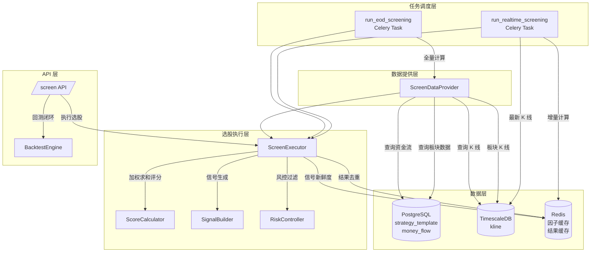
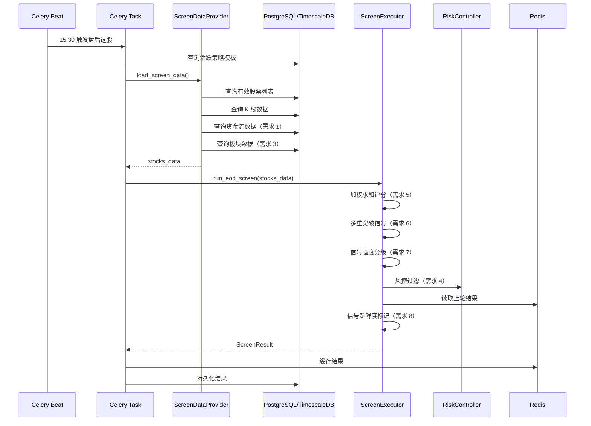

# 设计文档：智能选股系统增强

## 概述

本设计文档描述对现有智能选股系统（`app/services/screener/`）的全面增强方案。增强分三个阶段：

1. **阶段一（修复断裂链路）**：接入资金流真实数据、Celery 任务管线、板块因子管线、风控集成
2. **阶段二（重构评分与信号）**：加权求和评分、多重突破并发、信号强度分级、信号新鲜度标记
3. **阶段三（性能与架构）**：增量实时计算、结果去重与变化检测、选股到回测闭环

### 设计决策与理由

| 决策 | 理由 |
|------|------|
| 资金流查询放在 `ScreenDataProvider._build_factor_dict()` 中 | 保持因子计算集中在数据提供层，与其他因子（ma_trend、macd 等）一致 |
| 加权求和替代 `max()` 竞争 | `max()` 导致单模块高分即可获得高综合分，无法反映多因子共振 |
| 突破信号改为列表格式 | 支持同时报告多种突破类型，向后兼容单字典旧格式 |
| 信号新鲜度基于 Redis 缓存比对 | 利用现有 Redis 基础设施，无需额外存储层 |
| 增量计算使用 Redis 因子缓存 | 避免盘中每 10 秒全量重算，满足 8 秒内完成的性能要求 |
| 风控集成在 ScreenExecutor 层 | 风控是选股结果的后处理，不应侵入因子计算层 |

## 架构

### 系统架构图



### 数据流



## 组件与接口

### 1. ScreenDataProvider 增强

**文件**: `app/services/screener/screen_data_provider.py`

#### 1.1 资金流因子接入（需求 1）

在 `_build_factor_dict()` 中新增资金流数据查询逻辑：

```python
# 新增方法签名
async def _load_money_flow_data(
    self,
    symbol: str,
    trade_date: date,
    days: int = 5,
) -> tuple[list[float], float | None]:
    """
    从 money_flow 表查询资金流数据。

    Returns:
        (daily_inflows: 最近 N 日主力净流入列表, large_order_ratio: 当日大单占比)
    """
```

由于 `_build_factor_dict()` 当前是静态方法且不接受数据库会话，需要将资金流数据查询提升到 `load_screen_data()` 的主循环中，在构建 factor_dict 后补充资金流因子。

#### 1.2 板块因子修正（需求 3）

当前 `filter_by_sector_strength()` 将 `sector_rank` 和 `sector_trend` 写入 `stocks_data[symbol]` 顶层，但 ScreenExecutor 期望这些字段在 factor_dict 内部。需确保写入路径正确，并添加类型验证。

#### 1.3 突破信号并发检测（需求 6）

修改 `_build_factor_dict()` 中的突破检测逻辑，从"检测到第一个即停止"改为"逐一检测所有启用类型"：

```python
# 新的 breakout 字段格式
breakout_signals: list[dict] = []  # 替代原来的单个 dict

# 向后兼容：同时保留 breakout 字段（取第一个信号或 None）
stock_data["breakout"] = breakout_signals[0] if breakout_signals else None
stock_data["breakout_list"] = breakout_signals
```

### 2. ScreenExecutor 增强

**文件**: `app/services/screener/screen_executor.py`

#### 2.1 加权求和评分（需求 5）

```python
# 模块默认权重
DEFAULT_MODULE_WEIGHTS: dict[str, float] = {
    "factor_editor": 0.30,
    "ma_trend": 0.25,
    "indicator_params": 0.20,
    "breakout": 0.15,
    "volume_price": 0.10,
}

def _compute_weighted_score(
    self,
    module_scores: dict[str, float],
) -> float:
    """
    加权求和计算 Trend_Score。

    公式: Trend_Score = Σ(module_score × weight) / Σ(weight)
    未启用或评分为 0 的模块不计入分母。
    """
```

#### 2.2 风控集成（需求 4）

```python
def _apply_risk_filters(
    self,
    items: list[ScreenItem],
    stocks_data: dict[str, dict],
    index_closes: list[float] | None = None,
) -> tuple[list[ScreenItem], MarketRiskLevel]:
    """
    对候选股票列表应用风控过滤。

    1. 检查大盘风险等级
    2. DANGER → 返回空列表
    3. CAUTION → 提升阈值至 90
    4. 剔除单日涨幅 > 9% 的股票
    5. 剔除黑名单股票
    """
```

#### 2.3 信号强度分级（需求 7）

新增 `SignalStrength` 枚举和计算逻辑：

```python
class SignalStrength(str, Enum):
    STRONG = "STRONG"
    MEDIUM = "MEDIUM"
    WEAK = "WEAK"
```

在 `SignalDetail` 数据类中新增 `strength: SignalStrength` 字段。

#### 2.4 信号新鲜度标记（需求 8）

```python
class SignalFreshness(str, Enum):
    NEW = "NEW"
    CONTINUING = "CONTINUING"
```

在 `SignalDetail` 中新增 `freshness: SignalFreshness` 字段，在 `ScreenItem` 中新增 `has_new_signal: bool` 字段。

#### 2.5 结果去重与变化检测（需求 10）

```python
class ChangeType(str, Enum):
    NEW = "NEW"
    UPDATED = "UPDATED"
    REMOVED = "REMOVED"

@dataclass
class ScreenChange:
    symbol: str
    change_type: ChangeType
    item: ScreenItem | None  # REMOVED 时为 None
```

在 `ScreenResult` 中新增 `changes: list[ScreenChange]` 字段。

### 3. Celery 任务增强

**文件**: `app/tasks/screening.py`

#### 3.1 盘后选股数据管线（需求 2）

```python
async def _load_market_data_async(
    strategy_config: dict | None = None,
) -> dict[str, dict]:
    """
    通过 ScreenDataProvider 异步加载全市场数据。
    替代当前返回空字典的占位实现。
    """

async def _load_active_strategy_async() -> tuple[StrategyConfig, str, list[str]]:
    """
    从 strategy_template 表查询活跃策略。
    返回 (config, strategy_id, enabled_modules)。
    """
```

#### 3.2 增量实时计算（需求 9）

```python
FACTOR_CACHE_PREFIX = "screen:factor_cache:"
FACTOR_CACHE_TTL = 6 * 3600  # 6 小时（覆盖交易时段）

async def _warmup_factor_cache() -> None:
    """
    交易日首次执行时全量预热因子缓存。
    将全市场历史因子数据写入 Redis。
    """

async def _incremental_update(
    latest_bars: dict[str, dict],
) -> dict[str, dict]:
    """
    增量更新因子：
    - 从 Redis 读取缓存的历史因子
    - 仅重新计算受实时数据影响的因子（均线、技术指标）
    - 基本面因子和板块因子使用缓存值
    """
```

### 4. API 层增强

**文件**: `app/api/v1/screen.py`

#### 4.1 选股到回测闭环（需求 11）

```python
class ScreenToBacktestRequest(BaseModel):
    screen_result_id: str
    start_date: date | None = None
    end_date: date | None = None
    initial_capital: float = 1000000.0

@router.post("/screen/backtest")
async def screen_to_backtest(body: ScreenToBacktestRequest) -> dict:
    """
    将选股结果一键发送到回测引擎。
    从选股结果中提取策略配置和股票列表，构造 BacktestConfig。
    """
```

## 数据模型

### 新增/修改的数据类

#### SignalStrength 枚举（需求 7）

```python
# app/core/schemas.py
class SignalStrength(str, Enum):
    """信号强度等级"""
    STRONG = "STRONG"
    MEDIUM = "MEDIUM"
    WEAK = "WEAK"
```

#### SignalFreshness 枚举（需求 8）

```python
class SignalFreshness(str, Enum):
    """信号新鲜度"""
    NEW = "NEW"
    CONTINUING = "CONTINUING"
```

#### ChangeType 枚举（需求 10）

```python
class ChangeType(str, Enum):
    """选股结果变化类型"""
    NEW = "NEW"
    UPDATED = "UPDATED"
    REMOVED = "REMOVED"
```

#### SignalDetail 扩展

```python
@dataclass
class SignalDetail:
    category: SignalCategory
    label: str
    is_fake_breakout: bool = False
    strength: SignalStrength = SignalStrength.MEDIUM      # 新增
    freshness: SignalFreshness = SignalFreshness.NEW      # 新增
    breakout_type: str | None = None                     # 新增：突破类型标识
```

#### ScreenItem 扩展

```python
@dataclass
class ScreenItem:
    symbol: str
    ref_buy_price: Decimal
    trend_score: float
    risk_level: RiskLevel
    signals: list[SignalDetail] = field(default_factory=list)
    has_fake_breakout: bool = False
    has_new_signal: bool = False                          # 新增（需求 8）
    market_risk_level: MarketRiskLevel | None = None      # 新增（需求 4）
    risk_filter_info: dict | None = None                  # 新增（需求 4）
```

#### ScreenChange 数据类（需求 10）

```python
@dataclass
class ScreenChange:
    symbol: str
    change_type: ChangeType
    item: ScreenItem | None = None
```

#### ScreenResult 扩展

```python
@dataclass
class ScreenResult:
    strategy_id: UUID
    screen_time: datetime
    screen_type: ScreenType
    items: list[ScreenItem] = field(default_factory=list)
    is_complete: bool = True
    market_risk_level: MarketRiskLevel | None = None      # 新增（需求 4）
    changes: list[ScreenChange] = field(default_factory=list)  # 新增（需求 10）
```

### Redis 缓存键设计

| 键模式 | 用途 | TTL |
|--------|------|-----|
| `screen:results:{strategy_id}` | 选股结果缓存 | 24h |
| `screen:eod:last_run` | 盘后选股执行记录 | 24h |
| `screen:factor_cache:{symbol}` | 个股因子缓存（增量计算） | 6h |
| `screen:factor_cache:warmed` | 因子预热标记 | 6h |
| `screen:prev_result:{strategy_id}` | 上轮选股结果（新鲜度比对） | 24h |

### 数据库表（无新增）

本次增强不需要新建数据库表。资金流数据使用已有的 `money_flow` 表（字段包括 `main_net_inflow`、`large_order_ratio` 等），选股结果使用已有的 `screen_result` 表。

## 正确性属性

*属性（Property）是在系统所有有效执行中都应成立的特征或行为——本质上是对系统应做什么的形式化陈述。属性是人类可读规格说明与机器可验证正确性保证之间的桥梁。*

### Property 1: 板块因子类型不变量

*For any* stocks_data 字典和 sector_ranks 列表，在 `filter_by_sector_strength()` 执行完毕后，每只股票的 factor_dict 中 `sector_rank` 应为 `int` 或 `None` 类型，`sector_trend` 应为 `bool` 类型。

**Validates: Requirements 3.1, 3.2**

### Property 2: DANGER 市场风险清空结果

*For any* stocks_data 和策略配置，当大盘风险等级为 `DANGER` 时，ScreenExecutor 返回的 `ScreenResult.items` 应为空列表。

**Validates: Requirements 4.2**

### Property 3: CAUTION 市场风险提升阈值

*For any* stocks_data 和策略配置，当大盘风险等级为 `CAUTION` 时，ScreenExecutor 返回的所有 ScreenItem 的 `trend_score` 应 >= 90。

**Validates: Requirements 4.3**

### Property 4: 风控过滤排除规则

*For any* stocks_data、黑名单集合和每日涨幅数据，ScreenExecutor 返回的结果中不应包含任何单日涨幅 > 9% 的股票，也不应包含任何黑名单中的股票。

**Validates: Requirements 4.4, 4.5**

### Property 5: 加权求和评分公式与范围

*For any* 模块评分字典 `module_scores: dict[str, float]` 和权重字典 `weights: dict[str, float]`（所有评分在 [0, 100]，所有权重 > 0），加权求和函数应满足：
1. 结果等于 `Σ(score × weight) / Σ(weight)`（仅计入 score > 0 的模块）
2. 结果在 [0, 100] 闭区间内
3. score 为 0 的模块不计入分母

**Validates: Requirements 5.1, 5.3, 5.4**

### Property 6: 多重突破信号完整检测

*For any* 价格数据和启用的突破类型列表，当多种突破条件同时满足时，`breakout_list` 的长度应等于实际触发的突破类型数量，且每种触发的突破类型都应在列表中有对应条目。

**Validates: Requirements 6.1, 6.2**

### Property 7: 突破信号到 SignalDetail 的映射

*For any* 包含 N 个有效突破信号的 `breakout_list`，ScreenExecutor 生成的 ScreenItem 中应包含恰好 N 个 `category=BREAKOUT` 的 SignalDetail。

**Validates: Requirements 6.3**

### Property 8: 信号强度分级映射

*For any* 选股结果中的 SignalDetail：
- 若 category 为 MA_TREND：ma_trend >= 90 → STRONG，>= 70 → MEDIUM，其余 → WEAK
- 若 category 为 BREAKOUT：volume_ratio >= 2.0 → STRONG，>= 1.5 → MEDIUM，其余 → WEAK
- 若 category 为技术指标（MACD/BOLL/RSI/DMA）：同时触发 >= 3 个 → STRONG，2 个 → MEDIUM，1 个 → WEAK

**Validates: Requirements 7.2, 7.3, 7.4**

### Property 9: 信号新鲜度正确标记

*For any* 当前信号列表和上一轮信号列表（按 symbol 分组），信号新鲜度标记应满足：
- 当前信号中存在于上一轮同一股票信号列表中的信号 → `CONTINUING`
- 当前信号中不存在于上一轮的信号 → `NEW`
- 上一轮结果为空时，所有信号均为 `NEW`

**Validates: Requirements 8.2, 8.3**

### Property 10: has_new_signal 派生一致性

*For any* ScreenItem，`has_new_signal` 应等于 `any(s.freshness == SignalFreshness.NEW for s in signals)`。

**Validates: Requirements 8.4**

### Property 11: 选股结果变化检测完备性

*For any* 当前选股结果集合 `current` 和上一轮结果集合 `previous`（按 symbol 索引），变化检测应满足：
- `current` 中有但 `previous` 中无的 symbol → `change_type=NEW`
- `current` 和 `previous` 中都有但信号列表不同的 symbol → `change_type=UPDATED`
- `previous` 中有但 `current` 中无的 symbol → `change_type=REMOVED`
- `current` 和 `previous` 中都有且信号列表相同的 symbol → 不出现在 `changes` 中
- `changes` 列表中的 symbol 集合 = (NEW ∪ UPDATED ∪ REMOVED)，无遗漏无多余

**Validates: Requirements 10.1, 10.2, 10.3, 10.4, 10.5**

## 错误处理

### 数据层错误

| 场景 | 处理策略 |
|------|----------|
| money_flow 表查询失败 | money_flow=False, large_order=False, 记录 WARNING 日志，选股继续 |
| 板块数据加载失败 | sector_rank=None, sector_trend=False, 记录 WARNING 日志，选股继续 |
| K 线数据不足 | 跳过该股票，记录 DEBUG 日志 |
| 前复权因子缺失 | 使用原始 K 线数据，记录 WARNING 日志 |
| Redis 连接失败（因子缓存） | 回退到全量计算模式，记录 ERROR 日志 |
| Redis 连接失败（结果缓存） | 信号新鲜度全部标记为 NEW，记录 WARNING 日志 |

### 任务层错误

| 场景 | 处理策略 |
|------|----------|
| 数据库连接不可用 | Celery 自动重试，最多 3 次，指数退避 |
| ScreenDataProvider 超时 | 返回不完整结果（is_complete=False），记录 ERROR 日志 |
| 实时选股单轮超过 8 秒 | 记录 WARNING 日志，继续执行 |
| 策略模板不存在 | 使用默认空策略，记录 WARNING 日志 |

### API 层错误

| 场景 | 处理策略 |
|------|----------|
| 选股结果 ID 不存在 | 返回 404 + 描述性错误信息 |
| 回测任务提交失败 | 返回 503 + 重试建议 |
| 策略配置格式错误 | 返回 422 + 字段级错误详情 |

## 测试策略

### 双轨测试方法

本特性采用单元测试 + 属性测试的双轨方法：

- **单元测试**：验证具体示例、边界条件、错误处理
- **属性测试**：验证跨所有输入的通用属性（使用 Hypothesis 库）

### 属性测试配置

- **库**: Hypothesis（Python，已在项目中使用）
- **最小迭代次数**: 每个属性测试 100 次
- **标签格式**: `Feature: screening-system-enhancement, Property {number}: {property_text}`

### 属性测试清单

| Property | 测试文件 | 纯函数目标 |
|----------|----------|------------|
| Property 1 | `tests/properties/test_sector_factor_type_properties.py` | `SectorStrengthFilter.filter_by_sector_strength()` |
| Property 2 | `tests/properties/test_risk_filter_properties.py` | `ScreenExecutor._apply_risk_filters()` |
| Property 3 | `tests/properties/test_risk_filter_properties.py` | `ScreenExecutor._apply_risk_filters()` |
| Property 4 | `tests/properties/test_risk_filter_properties.py` | `ScreenExecutor._apply_risk_filters()` |
| Property 5 | `tests/properties/test_weighted_score_properties.py` | `ScreenExecutor._compute_weighted_score()` |
| Property 6 | `tests/properties/test_breakout_multi_properties.py` | `ScreenDataProvider._detect_all_breakouts()` |
| Property 7 | `tests/properties/test_breakout_multi_properties.py` | `ScreenExecutor._build_breakout_signals()` |
| Property 8 | `tests/properties/test_signal_strength_properties.py` | `ScreenExecutor._compute_signal_strength()` |
| Property 9 | `tests/properties/test_signal_freshness_properties.py` | `ScreenExecutor._mark_signal_freshness()` |
| Property 10 | `tests/properties/test_signal_freshness_properties.py` | `ScreenExecutor._mark_signal_freshness()` |
| Property 11 | `tests/properties/test_result_diff_properties.py` | `ScreenExecutor._compute_result_diff()` |

### 单元测试清单

| 测试范围 | 测试文件 | 覆盖需求 |
|----------|----------|----------|
| 资金流因子加载 | `tests/services/test_screen_data_provider_money_flow.py` | 1.1-1.4 |
| Celery 任务管线 | `tests/tasks/test_screening_pipeline.py` | 2.1-2.4 |
| 板块因子降级 | `tests/services/test_screen_data_provider_sector.py` | 3.3 |
| 风控集成 | `tests/services/test_screen_executor_risk.py` | 4.1, 4.6 |
| 突破向后兼容 | `tests/services/test_screen_executor_breakout_compat.py` | 6.4 |
| 增量计算 | `tests/tasks/test_realtime_incremental.py` | 9.1-9.4 |
| 回测闭环 API | `tests/api/test_screen_backtest.py` | 11.1-11.4 |

### 集成测试清单

| 测试范围 | 测试文件 | 覆盖需求 |
|----------|----------|----------|
| 端到端盘后选股 | `tests/integration/test_eod_screening_e2e.py` | 1, 2, 3, 4, 5 |
| 端到端实时选股 | `tests/integration/test_realtime_screening_e2e.py` | 9, 10 |
| 选股到回测闭环 | `tests/integration/test_screen_to_backtest.py` | 11 |

