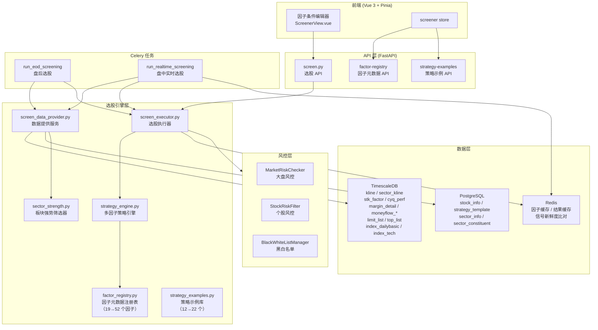
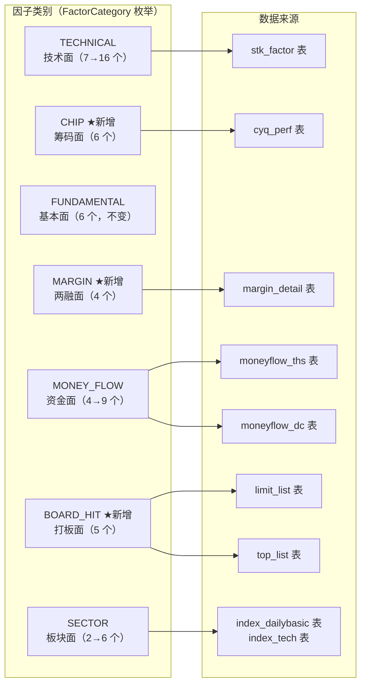
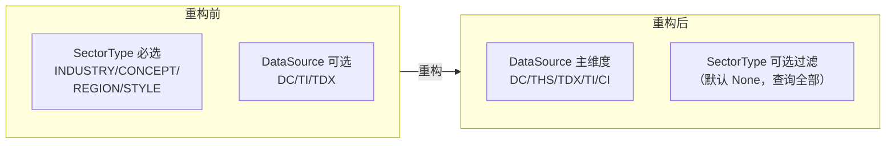

# 技术设计文档：智能选股系统增强

## 概述

本设计文档描述对现有智能选股系统（`app/services/screener/`）的全面增强方案，涵盖 22 项需求，分为两大部分：

**第一部分（需求 1-11）**：修复现有系统断裂链路，包括资金流因子数据接入、Celery 任务数据管线、板块因子集成、风控集成、评分重构、多重突破信号、信号强度分级、信号新鲜度标记、实时增量计算、结果去重与变化检测、选股到回测闭环。

**第二部分（需求 12-22）**：基于 tushare 数据源扩展因子体系，新增 6 大类共 33 个因子（总计从 19 扩展到 52 个），增强因子条件编辑器，提供 10 个优化选股组合方案及配置说明书，重构板块面因子分类以适配数据来源体系，更新现有策略示例以适配板块分类重构。

**设计原则**：
- 所有新增因子遵循现有 `FactorMeta` / `FACTOR_REGISTRY` 模式注册
- 新增数据加载遵循 `_enrich_*_factors()` 异步方法 + 降级容错模式
- `FactorEvaluator.evaluate()` 通过 `ThresholdType` 自动处理所有新因子，无需特殊代码
- `StrategyConfig` 序列化/反序列化保持向后兼容
- 所有注释和文档字符串使用中文

## 架构

### 系统架构总览



### 因子扩展架构

新增因子按类别组织，每个类别对应一个 `_enrich_*_factors()` 异步方法：



### 板块面因子分类重构（需求 22）



## 组件与接口

### 1. 因子注册表扩展（`factor_registry.py`）

**变更**：
- `FactorCategory` 枚举新增 `CHIP`、`MARGIN`、`BOARD_HIT` 三个值
- `FACTOR_REGISTRY` 字典从 19 个因子扩展到 52 个因子（新增 33 个）
- `FACTOR_CATEGORIES` 映射字典（`strategy_engine.py`）同步更新

**新增因子清单**：

| 类别 | 因子名 | 标签 | 阈值类型 | 默认值 | 数据来源 |
|------|--------|------|----------|--------|----------|
| TECHNICAL | `kdj_k` | KDJ-K值 | RANGE | [20, 80] | stk_factor |
| TECHNICAL | `kdj_d` | KDJ-D值 | RANGE | [20, 80] | stk_factor |
| TECHNICAL | `kdj_j` | KDJ-J值 | RANGE | [0, 100] | stk_factor |
| TECHNICAL | `cci` | CCI顺势指标 | ABSOLUTE | 100 | stk_factor |
| TECHNICAL | `wr` | 威廉指标 | RANGE | [0, 20] | stk_factor |
| TECHNICAL | `trix` | TRIX三重指数平滑 | BOOLEAN | — | stk_factor |
| TECHNICAL | `bias` | 乖离率 | RANGE | [-5, 5] | stk_factor |
| TECHNICAL | `psy` | 心理线指标 | RANGE | [40, 75] | stk_factor |
| TECHNICAL | `obv_signal` | OBV能量潮信号 | BOOLEAN | — | stk_factor |
| CHIP | `chip_winner_rate` | 获利比例 | PERCENTILE | 50 | cyq_perf |
| CHIP | `chip_cost_5pct` | 5%成本集中度 | ABSOLUTE | 10 | cyq_perf |
| CHIP | `chip_cost_15pct` | 15%成本集中度 | ABSOLUTE | 20 | cyq_perf |
| CHIP | `chip_cost_50pct` | 50%成本集中度 | ABSOLUTE | 30 | cyq_perf |
| CHIP | `chip_weight_avg` | 筹码加权平均成本 | INDUSTRY_RELATIVE | 1.0 | cyq_perf |
| CHIP | `chip_concentration` | 筹码集中度综合评分 | PERCENTILE | 70 | 计算值 |
| MARGIN | `rzye_change` | 融资余额变化率 | PERCENTILE | 70 | margin_detail |
| MARGIN | `rqye_ratio` | 融券余额占比 | ABSOLUTE | 5 | margin_detail |
| MARGIN | `rzrq_balance_trend` | 两融余额趋势 | BOOLEAN | — | margin_detail |
| MARGIN | `margin_net_buy` | 融资净买入额 | PERCENTILE | 75 | margin_detail |
| MONEY_FLOW | `super_large_net_inflow` | 超大单净流入 | PERCENTILE | 80 | moneyflow_ths/dc |
| MONEY_FLOW | `large_net_inflow` | 大单净流入 | PERCENTILE | 75 | moneyflow_ths/dc |
| MONEY_FLOW | `small_net_outflow` | 小单净流出 | BOOLEAN | — | moneyflow_ths/dc |
| MONEY_FLOW | `money_flow_strength` | 资金流强度综合评分 | ABSOLUTE | 70 | 计算值 |
| MONEY_FLOW | `net_inflow_rate` | 净流入占比 | ABSOLUTE | 5 | moneyflow_ths/dc |
| BOARD_HIT | `limit_up_count` | 近期涨停次数 | ABSOLUTE | 1 | limit_list |
| BOARD_HIT | `limit_up_streak` | 连板天数 | ABSOLUTE | 2 | limit_step |
| BOARD_HIT | `limit_up_open_pct` | 涨停封板率 | ABSOLUTE | 80 | limit_list |
| BOARD_HIT | `dragon_tiger_net_buy` | 龙虎榜净买入 | BOOLEAN | — | top_list |
| BOARD_HIT | `first_limit_up` | 首板涨停标记 | BOOLEAN | — | limit_list |
| SECTOR | `index_pe` | 指数市盈率 | RANGE | [10, 25] | index_dailybasic |
| SECTOR | `index_turnover` | 指数换手率 | RANGE | [0.5, 3.0] | index_dailybasic |
| SECTOR | `index_ma_trend` | 指数均线趋势 | BOOLEAN | — | idx_factor_pro |
| SECTOR | `index_vol_ratio` | 指数量比 | ABSOLUTE | 1.0 | index_dailybasic |

### 2. 数据提供服务扩展（`screen_data_provider.py`）

**新增异步方法**（批量处理模式，与现有 `_enrich_money_flow_factors()` 架构一致）：

```python
async def _enrich_stk_factor_factors(self, stocks_data: dict[str, dict], screen_date: date) -> None:
    """需求 12：批量从 stk_factor 表加载技术面专业因子，写入各股票的 factor_dict"""

async def _enrich_chip_factors(self, stocks_data: dict[str, dict], screen_date: date) -> None:
    """需求 13：批量从 cyq_perf 表加载筹码分析因子"""

async def _enrich_margin_factors(self, stocks_data: dict[str, dict], screen_date: date) -> None:
    """需求 14：批量从 margin_detail 表加载两融因子"""

async def _enrich_enhanced_money_flow_factors(self, stocks_data: dict[str, dict], screen_date: date) -> None:
    """需求 15：批量从 moneyflow_ths/moneyflow_dc 表加载增强资金流因子"""

async def _enrich_board_hit_factors(self, stocks_data: dict[str, dict], screen_date: date) -> None:
    """需求 16：批量从 limit_list/limit_step/top_list 表加载打板专题因子"""

async def _enrich_index_factors(self, stocks_data: dict[str, dict], screen_date: date) -> None:
    """需求 17：批量从 index_dailybasic/index_tech 表加载指数专题因子"""
```

**批量查询策略**（避免 N+1 查询问题）：
- 每个 `_enrich_*_factors()` 方法使用 `WHERE trade_date = :screen_date` 一次性查询全市场数据
- 查询结果按 `symbol` 构建字典，然后遍历 `stocks_data` 写入各股票的 `factor_dict`
- 对于需要多日数据的因子（如两融余额趋势需要 5 日数据），使用 `WHERE trade_date >= :start_date` 批量查询后按 symbol 分组

每个方法遵循统一的降级容错模式：
1. 查询数据库表
2. 数据存在 → 计算因子值写入 `factor_dict`
3. 数据缺失 → 设默认值（数值型 `None`，布尔型 `False`，打板数值型 `0`），记录 WARNING 日志
4. 异常 → 同上降级处理，选股流程不中断

**百分位排名扩展**：`_compute_percentile_ranks()` 的 `percentile_factors` 列表新增：
- `chip_winner_rate`、`chip_concentration`（筹码面）
- `rzye_change`、`margin_net_buy`（两融面）
- `super_large_net_inflow`、`large_net_inflow`（增强资金流）

**`load_screen_data()` 调用链扩展**：在现有步骤 3（K 线因子计算）和步骤 4（百分位排名）之间，插入 6 个新的 `_enrich_*_factors()` 调用。

### 3. 板块面因子分类重构（需求 22）

**`SectorScreenConfig` 变更**：

```python
@dataclass
class SectorScreenConfig:
    sector_data_source: str = "DC"       # 主维度：DC/THS/TDX/TI/CI
    sector_type: str | None = None       # 可选过滤（默认 None，查询全部）
    sector_period: int = 5
    sector_top_n: int = 30

    def to_dict(self) -> dict:
        # 不再输出 sector_type 字段
        return {
            "sector_data_source": self.sector_data_source,
            "sector_period": self.sector_period,
            "sector_top_n": self.sector_top_n,
        }

    @classmethod
    def from_dict(cls, data: dict) -> "SectorScreenConfig":
        # 向后兼容：忽略旧配置中的 sector_type
        return cls(
            sector_data_source=data.get("sector_data_source", "DC"),
            sector_type=None,  # 不再从配置中读取
            sector_period=data.get("sector_period", 5),
            sector_top_n=data.get("sector_top_n", 30),
        )
```

**`SectorStrengthFilter` 变更**：
- `compute_sector_ranks()` 的 `sector_type` 参数改为可选（默认 `None`）
- `sector_type=None` 时查询该 `data_source` 下所有板块
- `map_stocks_to_sectors()` 同理
- `DataSource` 枚举确保包含 `CI`（中信行业）

**`_load_sector_info()` 变更**：
```python
@staticmethod
async def _load_sector_info(
    pg_session: AsyncSession,
    data_source: str,
    sector_type: str | None = None,  # 改为可选
) -> dict[str, SectorInfo]:
    stmt = select(SectorInfo).where(SectorInfo.data_source == data_source)
    if sector_type is not None:
        stmt = stmt.where(SectorInfo.sector_type == sector_type)
    result = await pg_session.execute(stmt)
    return {info.sector_code: info for info in result.scalars().all()}
```

### 4. 策略示例库扩展（`strategy_examples.py`）

**`StrategyExample` 数据类扩展**：
```python
@dataclass
class StrategyExample:
    name: str
    description: str
    factors: list[dict]
    logic: str
    weights: dict[str, float]
    enabled_modules: list[str]
    sector_config: dict | None = None
    config_doc: str = ""  # 新增：配置说明书（需求 20）
```

新增 10 个优化选股组合方案（需求 19），每个包含完整的 `factors`、`logic`、`weights`、`enabled_modules`、`sector_config`（如适用）和 `config_doc` 字段。

**现有策略示例更新**（需求 22.9）：
现有 12 个策略示例中，示例 3（概念板块热点龙头）、4（行业板块轮动策略）、8（板块强势+布林突破）、10（概念板块+形态突破联动）、11（多数据源板块交叉验证）、12（RSI超卖反弹+板块支撑）的 `sector_config` 需移除 `sector_type` 字段，仅保留 `sector_data_source`、`sector_period`、`sector_top_n`。

### 5. 前端因子编辑器增强

**`ScreenerView.vue` 变更**：
- `factorTypes` 数组新增 `chip`（筹码面）、`margin`（两融面）、`board_hit`（打板面）三个选项
- 板块面因子的"板块类型"下拉替换为"数据来源"下拉，选项为 DC/THS/TDX/TI/CI
- 移除 `sectorConfig.sector_type` 下拉
- `factorNameOptions` 按新类别分组

**`screener.ts` store 变更**：
- `FactorMeta` 接口不变（已支持所有字段）
- `SectorScreenConfig` 接口移除 `sector_type`，保留 `sector_data_source`

### 6. 选股执行器增强（`screen_executor.py`）

已在之前的迭代中实现的功能（需求 4-8, 10）保持不变。本次增强主要是确保新增因子能通过现有 `FactorEvaluator.evaluate()` 正确评估。

### 7. API 层变更（`screen.py`）

- `get_strategy_examples()` 端点返回 `config_doc` 字段
- `SectorScreenConfigIn` 模型移除 `sector_type` 字段
- 因子注册表 API 支持新增类别查询

## 数据模型

### 新增 FactorCategory 枚举值

```python
class FactorCategory(str, Enum):
    TECHNICAL = "technical"
    MONEY_FLOW = "money_flow"
    FUNDAMENTAL = "fundamental"
    SECTOR = "sector"
    CHIP = "chip"           # 新增：筹码面
    MARGIN = "margin"       # 新增：两融面
    BOARD_HIT = "board_hit" # 新增：打板面
```

### DataSource 枚举（确认完整）

```python
class DataSource(str, Enum):
    DC = "DC"    # 东方财富
    TI = "TI"    # 同花顺/申万行业
    TDX = "TDX"  # 通达信
    CI = "CI"    # 中信行业
    THS = "THS"  # 同花顺概念/行业
```

### 筹码集中度综合评分计算公式

```
chip_concentration = 100 - (cost_5pct × 0.5 + cost_15pct × 0.3 + cost_50pct × 0.2)
# 结果 clamp 到 [0, 100]
```

### 资金流强度综合评分计算公式

```
money_flow_strength = super_large_weight × 0.4 + large_weight × 0.3 + mid_weight × 0.2 + small_outflow_weight × 0.1
# 各分项根据净流入额的正负和大小映射到 [0, 100]
```

### 两融余额趋势判定

```
rzrq_balance_trend = True  当且仅当最近 5 个交易日融资余额严格递增（每日 > 前一日）
```

### SectorScreenConfig 序列化变更

**`to_dict()` 输出**（需求 22.7）：
```json
{
    "sector_data_source": "DC",
    "sector_period": 5,
    "sector_top_n": 30
}
```
不再包含 `sector_type` 字段。

**`from_dict()` 输入兼容**（需求 22.6）：
- 旧配置含 `sector_type` → 忽略，不报错
- 旧配置含 `sector_data_source` → 正常读取
- 无 `sector_data_source` → 默认 `"DC"`

### FACTOR_CATEGORIES 映射扩展（`strategy_engine.py`）

```python
FACTOR_CATEGORIES: dict[str, str] = {
    # 技术面（原有 7 个 + 新增 9 个 = 16 个）
    "ma_trend": "technical", "ma_support": "technical",
    "macd": "technical", "boll": "technical",
    "rsi": "technical", "dma": "technical", "breakout": "technical",
    "kdj_k": "technical", "kdj_d": "technical", "kdj_j": "technical",
    "cci": "technical", "wr": "technical", "trix": "technical",
    "bias": "technical", "psy": "technical", "obv_signal": "technical",
    # 资金面（原有 4 个 + 新增 5 个 = 9 个）
    "money_flow": "money_flow", "large_order": "money_flow",
    "volume_price": "money_flow", "turnover": "money_flow",
    "super_large_net_inflow": "money_flow", "large_net_inflow": "money_flow",
    "small_net_outflow": "money_flow", "money_flow_strength": "money_flow",
    "net_inflow_rate": "money_flow",
    # 基本面（6 个，不变）
    "pe": "fundamental", "pb": "fundamental", "roe": "fundamental",
    "profit_growth": "fundamental", "market_cap": "fundamental",
    "revenue_growth": "fundamental",
    # 板块面（原有 2 个 + 新增 4 个 = 6 个）
    "sector_rank": "sector", "sector_trend": "sector",
    "index_pe": "sector", "index_turnover": "sector",
    "index_ma_trend": "sector", "index_vol_ratio": "sector",
    # 筹码面（新增 6 个）
    "chip_winner_rate": "chip", "chip_cost_5pct": "chip",
    "chip_cost_15pct": "chip", "chip_cost_50pct": "chip",
    "chip_weight_avg": "chip", "chip_concentration": "chip",
    # 两融面（新增 4 个）
    "rzye_change": "margin", "rqye_ratio": "margin",
    "rzrq_balance_trend": "margin", "margin_net_buy": "margin",
    # 打板面（新增 5 个）
    "limit_up_count": "board_hit", "limit_up_streak": "board_hit",
    "limit_up_open_pct": "board_hit", "dragon_tiger_net_buy": "board_hit",
    "first_limit_up": "board_hit",
}
# 合计：16 + 9 + 6 + 6 + 6 + 4 + 5 = 52 个因子
```


## 正确性属性（Correctness Properties）

*属性（Property）是一种在系统所有有效执行中都应成立的特征或行为——本质上是对系统应做什么的形式化陈述。属性是人类可读规格说明与机器可验证正确性保证之间的桥梁。*

### Property 1: 加权求和评分正确性与有界性

*For any* 非空的模块评分字典 `module_scores`（值在 [0, 100]）和正权重字典 `weights`，`_compute_weighted_score(module_scores, weights)` 的结果应满足：
1. 结果在 [0, 100] 闭区间内
2. 评分为 0 的模块不计入分母
3. 结果等于 `Σ(score × weight) / Σ(weight)`（仅对 score > 0 且 weight > 0 的模块求和）

**Validates: Requirements 5.1, 5.3, 5.4**

### Property 2: 风控过滤规则一致性

*For any* 候选股票列表、股票数据字典和指数收盘价序列，`_apply_risk_filters_pure()` 的输出应满足：
1. DANGER 状态下，所有输出股票的 `trend_score >= danger_strong_threshold`
2. CAUTION 状态下，所有输出股票的 `trend_score >= 90`
3. 所有输出股票的 `daily_change_pct <= 9%`
4. 所有输出股票不在黑名单中
5. 输出列表是输入列表的子集

**Validates: Requirements 4.1, 4.2, 4.3, 4.4, 4.5**

### Property 3: 多重突破信号列表有效性

*For any* 有效的 OHLCV 价格序列和突破配置，`_detect_all_breakouts()` 的输出应满足：
1. 返回值始终为列表类型
2. 列表长度 <= 启用的突破类型数量（最多 3）
3. 列表中每个元素包含 `type`、`is_valid`、`volume_ratio` 字段
4. `_build_breakout_signals()` 为每个 `is_valid=True` 的突破生成恰好一个 `SignalDetail`

**Validates: Requirements 6.1, 6.2, 6.3**

### Property 4: 信号强度分级阈值一致性

*For any* `SignalDetail` 和 `stock_data` 字典，`_compute_signal_strength()` 的输出应满足：
1. 返回值始终为 `SignalStrength` 枚举值（STRONG/MEDIUM/WEAK）
2. MA_TREND 类别：`ma_trend >= 90` → STRONG，`>= 70` → MEDIUM，其余 → WEAK
3. BREAKOUT 类别：`volume_ratio >= 2.0` → STRONG，`>= 1.5` → MEDIUM，其余 → WEAK
4. 技术指标类别（MACD/BOLL/RSI/DMA）：触发数 `>= 3` → STRONG，`== 2` → MEDIUM，`== 1` → WEAK

**Validates: Requirements 7.1, 7.2, 7.3, 7.4**

### Property 5: 信号新鲜度标记一致性

*For any* 当前信号列表和上一轮信号列表，`_mark_signal_freshness()` 的输出应满足：
1. 上一轮为 None 或空列表时，所有信号标记为 NEW
2. 存在于上一轮的信号（按 `(category, label)` 匹配）标记为 CONTINUING
3. 不存在于上一轮的信号标记为 NEW
4. `has_new_signal` 为 True 当且仅当至少一个信号的 freshness 为 NEW

**Validates: Requirements 8.1, 8.3, 8.4**

### Property 6: 选股结果变化检测完备性

*For any* 当前选股结果列表和上一轮选股结果列表，`_compute_result_diff()` 的输出应满足：
1. 本轮有、上轮无的股票标记为 NEW
2. 两轮都有但信号集合不同的股票标记为 UPDATED
3. 上轮有、本轮无的股票标记为 REMOVED
4. 两轮都有且信号集合相同的股票不出现在 changes 中
5. changes 中每个 symbol 唯一（无重复）

**Validates: Requirements 10.1, 10.2, 10.3, 10.4**

### Property 7: FactorEvaluator 阈值类型全覆盖

*For any* 有效的 `FactorCondition`（包含 ABSOLUTE、PERCENTILE、INDUSTRY_RELATIVE、BOOLEAN、RANGE 类型）和 `stock_data` 字典，`FactorEvaluator.evaluate()` 应满足：
1. 返回值始终为 `FactorEvalResult` 实例
2. RANGE 类型：`passed = (low <= value <= high)`
3. BOOLEAN 类型：`passed = bool(value)`
4. ABSOLUTE/PERCENTILE/INDUSTRY_RELATIVE 类型：`passed = operator_fn(value, threshold)`
5. 值缺失（None）时 `passed = False`

**Validates: Requirements 12.4, 18.4, 21.3**

### Property 8: StrategyConfig 序列化往返一致性

*For any* 有效的 `StrategyConfig` 实例（包含新增因子类别的条件），`StrategyConfig.from_dict(config.to_dict())` 应产生与原始配置等价的实例（`to_dict()` 输出相同）。此外，包含旧 `sector_type` 字段的配置字典反序列化时不应报错。

**Validates: Requirements 18.5, 21.6, 22.6**

### Property 9: SectorScreenConfig 序列化不含 sector_type

*For any* `SectorScreenConfig` 实例，`to_dict()` 的输出字典不应包含 `sector_type` 键，且 `from_dict()` 对包含 `sector_type` 的旧配置字典不报错、忽略该字段。

**Validates: Requirements 22.1, 22.6, 22.7**

### Property 10: 筹码集中度综合评分公式正确性与有界性

*For any* 有效的 `cost_5pct`、`cost_15pct`、`cost_50pct` 值（均在 [0, 100] 区间），筹码集中度综合评分 `chip_concentration = clamp(100 - (cost_5pct × 0.5 + cost_15pct × 0.3 + cost_50pct × 0.2), 0, 100)` 应满足：
1. 结果在 [0, 100] 闭区间内
2. `cost_5pct` 越小（筹码越集中），评分越高

**Validates: Requirements 13.4**

### Property 11: 两融余额趋势判定正确性

*For any* 长度为 5 的融资余额序列，`rzrq_balance_trend` 为 True 当且仅当序列严格递增（`balance[i] > balance[i-1]` 对所有 `i in [1,4]` 成立）。

**Validates: Requirements 14.4**

### Property 12: 资金流强度综合评分有界性

*For any* 有效的超大单、大单、中单、小单净流入值，`money_flow_strength` 综合评分应在 [0, 100] 闭区间内。

**Validates: Requirements 15.3**

### Property 13: 因子注册表与类别映射一致性

*For any* `FACTOR_REGISTRY` 中的因子，其 `category` 值应为有效的 `FactorCategory` 枚举值，且 `get_factors_by_category(category)` 应返回包含该因子的列表。同时，`FACTOR_CATEGORIES` 映射字典应包含该因子名称且映射到正确的类别字符串。

**Validates: Requirements 18.1, 21.1, 21.4**

### Property 14: 因子元数据完整性

*For any* `FACTOR_REGISTRY` 中的因子，其 `FactorMeta` 实例应包含非空的 `factor_name`、`label`、`category`、`threshold_type`，且 `examples` 列表至少包含一个配置示例。

**Validates: Requirements 18.2, 21.1**

### Property 15: 策略示例因子名称一致性

*For any* `STRATEGY_EXAMPLES` 中的策略示例，其 `factors` 列表中每个因子条件的 `factor_name` 应存在于 `FACTOR_REGISTRY` 中。且每个示例应包含非空的 `factors`、`logic`、`weights`、`enabled_modules` 字段。

**Validates: Requirements 19.2, 19.3**

### Property 16: 板块强势筛选器类型不变量

*For any* 股票数据字典，经过 `filter_by_sector_strength()` 处理后，每只股票的 `sector_rank` 应为 `int` 或 `None`，`sector_trend` 应为 `bool` 类型。

**Validates: Requirements 3.1, 3.2**

## 错误处理

### 数据加载降级策略

所有 `_enrich_*_factors()` 方法遵循统一的降级容错模式：

| 场景 | 处理方式 | 日志级别 |
|------|----------|----------|
| 数据库表中无该股票数据 | 因子设为默认值（None/False/0） | WARNING |
| 数据库连接异常 | 同上降级处理 | WARNING |
| 数据格式异常（类型转换失败） | 同上降级处理 | WARNING |
| 选股流程 | 继续执行，不中断 | — |

**各类别默认值**：
- 技术面专业因子（stk_factor_pro）：`None`
- 筹码面因子（cyq_perf）：`None`
- 两融面因子（margin_detail）：`None`
- 增强资金流因子（moneyflow_ths/dc）：`None`
- 打板面因子（limit_list 等）：数值型 `0`，布尔型 `False`
- 指数专题因子（index_dailybasic 等）：`None`
- 板块面因子（sector_strength）：`sector_rank=None`，`sector_trend=False`

### Celery 任务重试策略

- 数据库连接失败（`OperationalError`、`ConnectionError`）：自动重试，最多 3 次，指数退避
- 其他 SQLAlchemy 异常：同上
- Redis 连接失败：记录 WARNING，选股结果不缓存但不影响返回

### API 错误响应

| 场景 | HTTP 状态码 | 错误信息 |
|------|------------|----------|
| 选股结果 ID 不存在 | 404 | "选股结果不存在或已过期" |
| 策略模板不存在 | 404 | "策略不存在" |
| 因子名称不存在 | 404 | "因子 '{name}' 不存在" |
| 策略数量超限 | 400 | "已达策略上限（20 套）" |

### 前端降级

- 因子注册表加载失败：显示错误提示，保留已缓存的因子列表
- 板块数据源覆盖率低（< 50%）：显示警告提示，建议切换数据源

## 测试策略

### 双轨测试方法

本特性采用单元测试 + 属性测试的双轨测试方法：

**单元测试**（pytest）：
- 验证具体示例和边界条件
- 测试数据库交互（使用 mock）
- 测试 API 端点响应格式
- 测试降级容错行为

**属性测试**（Hypothesis，`tests/properties/`）：
- 验证 16 个正确性属性的普遍性
- 每个属性测试最少 100 次迭代
- 利用现有纯函数（`_pure` / `compute_*` 静态方法）进行无数据库依赖的测试

### 属性测试配置

- 测试框架：Hypothesis（Python）
- 最少迭代次数：100（`@settings(max_examples=100)`）
- 每个属性测试标注对应的设计文档属性编号
- 标签格式：`# Feature: screening-system-enhancement, Property {N}: {title}`

### 测试覆盖范围

| 测试类型 | 覆盖范围 | 文件位置 |
|----------|----------|----------|
| 属性测试 | 16 个正确性属性 | `tests/properties/test_screening_enhancement_props.py` |
| 单元测试 - 因子注册表 | 52 个因子元数据验证 | `tests/services/test_factor_registry.py` |
| 单元测试 - 数据加载 | 6 个 `_enrich_*` 方法降级测试 | `tests/services/test_screen_data_provider.py` |
| 单元测试 - 策略示例 | 22 个策略示例完整性 | `tests/services/test_strategy_examples.py` |
| 单元测试 - 板块重构 | SectorScreenConfig 序列化兼容性 | `tests/core/test_schemas.py` |
| 单元测试 - API | 因子注册表/策略示例端点 | `tests/api/test_screen_api.py` |
| 前端测试 | 因子编辑器新类别渲染 | `frontend/src/views/__tests__/ScreenerView.test.ts` |

### 关键测试场景

1. **因子注册表完整性**：验证所有 52 个因子的元数据字段完整、类别正确、示例非空
2. **FactorEvaluator 全类型覆盖**：对每种 ThresholdType 生成随机条件和数据，验证评估逻辑
3. **StrategyConfig 往返序列化**：生成包含新因子的随机配置，验证 `to_dict()` → `from_dict()` 往返一致
4. **SectorScreenConfig 向后兼容**：用包含 `sector_type` 的旧配置测试 `from_dict()`
5. **降级容错**：模拟各数据表为空或连接异常，验证因子默认值和日志输出
6. **策略示例一致性**：验证所有策略示例中的因子名称均在 FACTOR_REGISTRY 中注册
7. **筹码集中度评分**：用边界值（0, 100）和随机值测试公式正确性
8. **两融余额趋势**：用严格递增、非递增、等值序列测试判定逻辑
