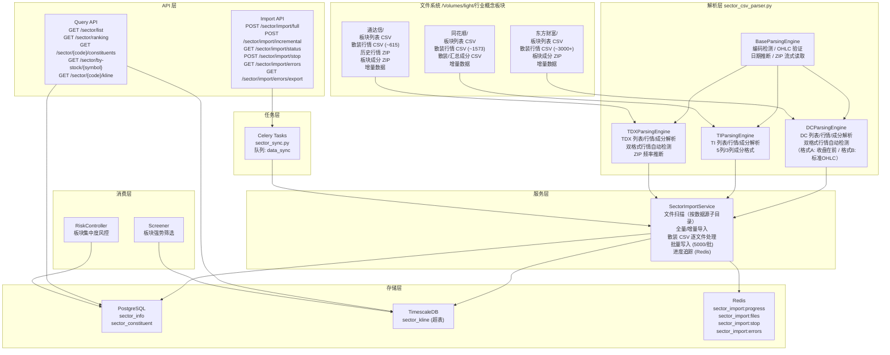
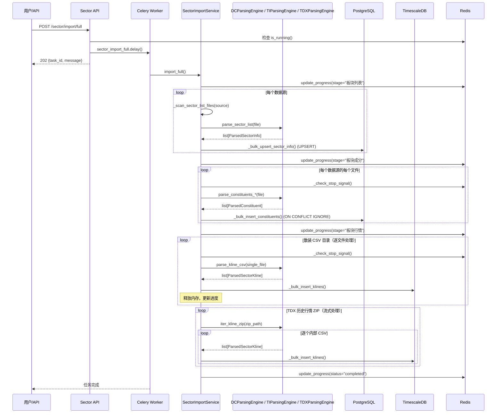

# 技术设计文档：行业概念板块数据导入（重构版 v2）

## Overview

本功能为量化选股系统从三个数据源（东方财富 DC、同花顺 TI、通达信 TDX）导入行业/概念板块数据，包括板块元数据、成分股快照和板块指数行情K线。

**本次重构的核心变更：**

1. **目录结构完全重组**：数据文件从按功能组织改为按数据源组织（`东方财富/`、`同花顺/`、`通达信/` 三个独立子目录）
2. **三个独立解析引擎**：DCParsingEngine、TIParsingEngine、TDXParsingEngine 替代原有的单一 SectorCSVParser
3. **散装 CSV 处理**：行情数据从 ZIP 文件改为散装 CSV（每个板块一个独立 CSV 文件），DC 约 3000+ 文件、TI 约 1573 文件、TDX 约 615 文件
4. **文件扫描逻辑完全重写**：匹配重组后的实际目录路径
5. **TDX 保留历史行情 ZIP**：通达信历史行情仍以 ZIP 格式存储，保留流式处理（iter_zip_entries）

**保持不变的部分：**

- 数据模型：SectorInfo(PGBase)、SectorConstituent(PGBase)、SectorKline(TSBase) — 无变更
- 数据库表和迁移 — 无变更
- API 端点结构 — 无变更
- Celery 任务 — 无变更
- Redis 进度追踪 — 无变更
- 批量写入策略（ON CONFLICT，5000/批）— 无变更

**核心设计决策：**

- **独立模型文件**：所有板块 ORM 模型定义在 `app/models/sector.py`，不修改现有模型文件
- **三引擎架构**：每个数据源一个独立解析引擎类，共享基类 `BaseParsingEngine` 提供通用能力
- **独立服务模块**：`app/services/data_engine/sector_import.py`（导入编排）+ `app/services/data_engine/sector_csv_parser.py`（解析引擎）
- **独立 API 路由**：`app/api/v1/sector.py`，不修改现有路由文件
- **独立 Celery 任务**：`app/tasks/sector_sync.py`，使用独立 Redis 键前缀 `sector_import:`
- **双数据库存储**：板块元数据和成分股存 PostgreSQL（PGBase），板块行情存 TimescaleDB（TSBase）

## Architecture



## Components and Interfaces

### 1. BaseParsingEngine（解析引擎基类）

**文件**：`app/services/data_engine/sector_csv_parser.py`

提供三个解析引擎共享的通用能力。

```python
class BaseParsingEngine:
    """解析引擎基类，提供通用工具方法"""

    def _read_csv(self, file_path: Path) -> str:
        """读取 CSV 文件，自动检测编码（UTF-8 → GBK → GB2312），去除 BOM"""
        ...

    def iter_zip_entries(self, zip_path: Path) -> Iterator[tuple[str, str]]:
        """逐个读取 ZIP 内文件，yield (文件名, CSV文本)，不一次性加载全部到内存"""
        ...

    def _validate_ohlc(self, kline: ParsedSectorKline) -> bool:
        """验证 OHLC 保序性：low ≤ open, low ≤ close, high ≥ open, high ≥ close"""
        ...

    def _infer_date_from_filename(self, filename: str) -> date | None:
        """从文件名推断日期（支持 YYYYMMDD 和 YYYY-MM-DD 两种格式）"""
        ...

    def _parse_date(self, raw_date: str) -> date | None:
        """解析日期字符串（支持 YYYY-MM-DD 和 YYYYMMDD）"""
        ...

    def _safe_decimal(self, raw: str) -> Decimal | None:
        """安全解析 Decimal，失败返回 None"""
        ...

    def _safe_int(self, raw: str) -> int | None:
        """安全解析整数（支持 Decimal 中间转换），失败返回 None"""
        ...
```

### 2. DCParsingEngine（东方财富解析引擎）

**文件**：`app/services/data_engine/sector_csv_parser.py`

专门处理东方财富数据源的 CSV/ZIP 格式。

```python
class DCParsingEngine(BaseParsingEngine):
    """东方财富数据源解析引擎"""

    # --- 板块列表 ---
    def parse_sector_list(self, file_path: Path) -> list[ParsedSectorInfo]:
        """解析 DC 板块列表 CSV
        列头: 板块代码,交易日期,板块名称,...,idx_type,level
        通过 idx_type 字段映射板块类型（包含匹配），按 sector_code 去重
        """
        ...

    # --- 板块行情 ---
    def parse_kline_csv(self, file_path: Path) -> list[ParsedSectorKline]:
        """解析 DC 散装/增量行情 CSV，自动检测两种列头格式：
        格式 A（地区板块 + 增量）: 板块代码,交易日期,收盘点位,开盘点位,...（收盘在开盘前）
        格式 B（行业板块）: 日期,行业代码,开盘,收盘,最高,最低,...（标准 OHLC 顺序）
        检测方式：列头第一字段为"日期"→格式 B，否则→格式 A
        """
        ...

    # --- 板块成分 ---
    def parse_constituents_zip(self, zip_path: Path) -> list[ParsedConstituent]:
        """解析 DC 板块成分 ZIP
        ZIP 内 CSV 列头: 交易日期,板块代码,成分股票代码,成分股票名称
        日期优先从 ZIP 文件名推断，否则从 CSV 行内容读取
        """
        ...

    def iter_constituents_zip(self, zip_path: Path) -> Iterator[list[ParsedConstituent]]:
        """流式解析 DC 板块成分 ZIP，逐个内部 CSV yield 解析结果"""
        ...

    # --- 内部方法 ---
    def _map_sector_type(self, idx_type: str) -> SectorType:
        """idx_type 字段映射到 SectorType（包含匹配：行业/地区/地域/风格/概念）"""
        ...
```

### 3. TIParsingEngine（同花顺解析引擎）

```python
class TIParsingEngine(BaseParsingEngine):
    """同花顺数据源解析引擎"""

    # --- 板块列表 ---
    def parse_sector_list(self, file_path: Path) -> list[ParsedSectorInfo]:
        """解析 TI 板块列表 CSV
        列头: 代码,名称,成分个数,交易所,上市日期,指数类型
        """
        ...

    # --- 板块行情 ---
    def parse_kline_csv(self, file_path: Path) -> list[ParsedSectorKline]:
        """解析 TI 散装/增量行情 CSV
        列头: 指数代码,交易日期,开盘点位,最高点位,最低点位,收盘点位,昨日收盘点,平均价,涨跌点位,涨跌幅,成交量,换手率
        """
        ...

    # --- 板块成分 ---
    def parse_constituents_summary(self, file_path: Path, trade_date: date | None = None) -> list[ParsedConstituent]:
        """解析 TI 成分汇总 CSV（5列格式）
        列头: 指数代码,指数名称,指数类型,股票代码,股票名称
        """
        ...

    def parse_constituents_per_sector(self, file_path: Path, trade_date: date | None = None) -> list[ParsedConstituent]:
        """解析 TI 散装成分 CSV（3列格式）
        列头: 指数代码,股票代码,股票名称
        """
        ...

    # --- 内部方法 ---
    def _map_sector_type(self, index_type: str) -> SectorType:
        """指数类型映射到 SectorType（概念指数/行业指数/地区指数/风格指数）"""
        ...
```

### 4. TDXParsingEngine（通达信解析引擎）

```python
class TDXParsingEngine(BaseParsingEngine):
    """通达信数据源解析引擎"""

    # --- 板块列表 ---
    def parse_sector_list(self, file_path: Path) -> list[ParsedSectorInfo]:
        """解析 TDX 板块列表 CSV 或散装板块信息 CSV
        列头: 板块代码,交易日期,板块名称,板块类型,成分个数,...
        按 sector_code 去重
        """
        ...

    # --- 板块行情（散装 CSV）---
    def parse_kline_csv(self, file_path: Path) -> list[ParsedSectorKline]:
        """解析 TDX 散装/增量行情 CSV（格式 B）
        列头: 板块代码,交易日期,收盘点位,开盘点位,最高点位,最低点位,...（38列）
        """
        ...

    # --- 板块行情（历史 ZIP）---
    def parse_kline_zip(self, zip_path: Path) -> list[ParsedSectorKline]:
        """解析 TDX 历史行情 ZIP（格式 A）
        ZIP 内 CSV 列头: 日期,代码,名称,开盘,收盘,最高,最低,成交量,成交额,...
        """
        ...

    def iter_kline_zip(self, zip_path: Path) -> Iterator[list[ParsedSectorKline]]:
        """流式解析 TDX 历史行情 ZIP，逐个内部 CSV yield 解析结果"""
        ...

    def _infer_freq_from_filename(self, filename: str) -> str:
        """从 ZIP 文件名推断频率：日k→1d、周k→1w、月k→1M"""
        ...

    # --- 板块成分 ---
    def parse_constituents_zip(self, zip_path: Path) -> list[ParsedConstituent]:
        """解析 TDX 板块成分 ZIP
        ZIP 文件名: 板块成分_TDX_YYYYMMDD.zip
        """
        ...

    # --- 内部方法 ---
    def _map_sector_type(self, raw_type: str) -> SectorType:
        """板块类型映射（概念板块/行业板块/地区板块/风格板块）"""
        ...
```

### 5. SectorImportService（板块导入服务）

**文件**：`app/services/data_engine/sector_import.py`

负责文件扫描、调用解析引擎、批量写入数据库、管理导入进度。**文件扫描逻辑完全重写**以匹配按数据源组织的新目录结构。

```python
class SectorImportService:
    """板块数据导入服务"""

    BATCH_SIZE: int = 5000
    REDIS_PROGRESS_KEY: str = "sector_import:progress"
    REDIS_INCREMENTAL_KEY: str = "sector_import:files"
    REDIS_STOP_KEY: str = "sector_import:stop"
    REDIS_ERRORS_KEY: str = "sector_import:errors"

    def __init__(self, base_dir: str = "/Volumes/light/行业概念板块") -> None:
        self.base_dir = Path(base_dir)
        self.dc_engine = DCParsingEngine()
        self.ti_engine = TIParsingEngine()
        self.tdx_engine = TDXParsingEngine()

    # --- 全量/增量导入 ---
    async def import_full(self, data_sources: list[DataSource] | None = None) -> dict: ...
    async def import_incremental(self, data_sources: list[DataSource] | None = None) -> dict: ...

    # --- 文件扫描（完全重写）---
    def _scan_sector_list_files(self, source: DataSource) -> list[Path]:
        """扫描板块列表文件
        DC: 东方财富_板块列表/东方财富_板块列表1.csv + 东方财富_板块列表2.csv + 东方财富_概念板块列表/*.csv + 增量
        TI: 同花顺_板块列表/同花顺_板块列表.csv
        TDX: 通达信_板块列表/通达信_板块列表.csv + 通达信_板块列表汇总/*.csv + 增量
        """
        ...

    def _scan_kline_files(self, source: DataSource) -> list[Path]:
        """扫描板块行情文件
        DC: 东方财富_板块行情/东方财富_地区板块行情/*.csv + 东方财富_行业板块行情/*.csv + 增量
        TI: 同花顺_板块行情/*.csv + 增量
        TDX: 通达信_板块行情/通达信_板块行情汇总/*.csv + 历史行情 ZIP + 增量
        """
        ...

    def _scan_constituent_files(self, source: DataSource) -> list[Path]:
        """扫描板块成分文件
        DC: 东方财富_板块成分/YYYY-MM/*.zip
        TI: 同花顺_板块成分/概念+行业汇总 + 增量概念/行业成分
        TDX: 通达信_板块成分/YYYY-MM/*.zip
        """
        ...

    # --- 散装 CSV 目录处理 ---
    async def _import_klines_from_dir(
        self, engine: BaseParsingEngine, csv_dir: Path, source: DataSource
    ) -> int:
        """逐文件处理散装 CSV 目录：读取→解析→写入→释放内存→更新进度"""
        ...

    # --- 批量写入（保持不变）---
    async def _bulk_upsert_sector_info(self, items: list[ParsedSectorInfo]) -> int: ...
    async def _bulk_insert_constituents(self, items: list[ParsedConstituent]) -> int: ...
    async def _bulk_insert_klines(self, items: list[ParsedSectorKline]) -> int: ...

    # --- 进度管理（保持不变）---
    async def update_progress(self, **kwargs) -> None: ...
    async def is_running(self) -> bool: ...
    async def request_stop(self) -> None: ...

    # --- 错误统计 ---
    async def _record_error(
        self, file: str, line: int | None, error_type: str, message: str, raw_data: str = ""
    ) -> None:
        """记录一条错误详情到 Redis 列表 sector_import:errors，并递增进度中的 error_count。
        error_type: parse_error / ohlc_invalid / db_error
        raw_data: 截断至 200 字符
        """
        ...

    async def _clear_errors(self) -> None:
        """清空 sector_import:errors 列表（每次新导入开始时调用）"""
        ...

    async def get_errors(self, offset: int = 0, limit: int = 100) -> list[dict]: ...
    async def get_error_count(self) -> int: ...
    async def update_progress(self, **kwargs) -> None: ...
    async def is_running(self) -> bool: ...
    async def request_stop(self) -> None: ...
```

### 6. SectorRepository（板块数据仓储层 — 保持不变）

**文件**：`app/services/data_engine/sector_repository.py`

```python
class SectorRepository:
    async def get_sector_list(self, sector_type=None, data_source=None) -> list[SectorInfo]: ...
    async def get_constituents(self, sector_code, data_source, trade_date=None) -> list[SectorConstituent]: ...
    async def get_sectors_by_stock(self, symbol, trade_date=None) -> list[SectorConstituent]: ...
    async def get_sector_kline(self, sector_code, data_source, freq="1d", start=None, end=None) -> list[SectorKline]: ...
    async def get_latest_trade_date(self, data_source) -> date | None: ...
    async def get_sector_ranking(self, ...) -> list[SectorRankingItem]: ...
```

### 7. API 端点（保持不变）

**文件**：`app/api/v1/sector.py`

```
POST /api/v1/sector/import/full          # 触发全量导入
POST /api/v1/sector/import/incremental   # 触发增量导入
GET  /api/v1/sector/import/status        # 查询导入进度
POST /api/v1/sector/import/stop          # 停止导入任务
GET  /api/v1/sector/import/errors        # 查询错误详情（分页）
GET  /api/v1/sector/import/errors/export # 导出错误报告（CSV 下载）
GET  /api/v1/sector/list                 # 板块列表
GET  /api/v1/sector/ranking              # 板块涨跌幅排行
GET  /api/v1/sector/{code}/constituents  # 板块成分股
GET  /api/v1/sector/by-stock/{symbol}    # 股票所属板块
GET  /api/v1/sector/{code}/kline         # 板块行情K线
```

### 8. Celery 任务（保持不变）

**文件**：`app/tasks/sector_sync.py`

```python
@celery_app.task(name="app.tasks.sector_sync.sector_import_full", queue="data_sync")
def sector_import_full(data_sources=None, base_dir=None) -> dict: ...

@celery_app.task(name="app.tasks.sector_sync.sector_import_incremental", queue="data_sync")
def sector_import_incremental(data_sources=None) -> dict: ...
```

### 组件交互时序图




## Data Models

### 数据模型（保持不变）

三个 ORM 模型定义在 `app/models/sector.py`，本次重构不做任何修改。

#### SectorInfo（板块信息 — PostgreSQL）

```python
class SectorInfo(PGBase):
    __tablename__ = "sector_info"

    id: Mapped[int] = mapped_column(primary_key=True, autoincrement=True)
    sector_code: Mapped[str] = mapped_column(String(20), nullable=False)
    name: Mapped[str] = mapped_column(String(100), nullable=False)
    sector_type: Mapped[str] = mapped_column(String(20), nullable=False)  # CONCEPT/INDUSTRY/REGION/STYLE
    data_source: Mapped[str] = mapped_column(String(10), nullable=False)  # DC/TI/TDX
    list_date: Mapped[date | None] = mapped_column(Date, nullable=True)
    constituent_count: Mapped[int | None] = mapped_column(nullable=True)
    updated_at: Mapped[datetime] = mapped_column(TIMESTAMPTZ, server_default=sa_text("NOW()"))

    __table_args__ = (
        UniqueConstraint("sector_code", "data_source", name="uq_sector_info_code_source"),
        Index("ix_sector_info_type_source", "sector_type", "data_source"),
    )
```

#### SectorConstituent（板块成分股 — PostgreSQL）

```python
class SectorConstituent(PGBase):
    __tablename__ = "sector_constituent"

    id: Mapped[int] = mapped_column(primary_key=True, autoincrement=True)
    trade_date: Mapped[date] = mapped_column(Date, nullable=False)
    sector_code: Mapped[str] = mapped_column(String(20), nullable=False)
    data_source: Mapped[str] = mapped_column(String(10), nullable=False)
    symbol: Mapped[str] = mapped_column(String(10), nullable=False)
    stock_name: Mapped[str | None] = mapped_column(String(50), nullable=True)

    __table_args__ = (
        UniqueConstraint("trade_date", "sector_code", "data_source", "symbol",
                         name="uq_sector_constituent_date_code_source_symbol"),
        Index("ix_sector_constituent_symbol_date", "symbol", "trade_date"),
        Index("ix_sector_constituent_code_source_date", "sector_code", "data_source", "trade_date"),
    )
```

#### SectorKline（板块行情 — TimescaleDB）

```python
class SectorKline(TSBase):
    __tablename__ = "sector_kline"

    time: Mapped[datetime] = mapped_column(primary_key=True)
    sector_code: Mapped[str] = mapped_column(String(20), primary_key=True)
    data_source: Mapped[str] = mapped_column(String(10), primary_key=True)
    freq: Mapped[str] = mapped_column(String(5), primary_key=True)

    open: Mapped[Decimal | None]
    high: Mapped[Decimal | None]
    low: Mapped[Decimal | None]
    close: Mapped[Decimal | None]
    volume: Mapped[int | None] = mapped_column(BigInteger)
    amount: Mapped[Decimal | None]
    turnover: Mapped[Decimal | None]
    change_pct: Mapped[Decimal | None]

    __table_args__ = (
        Index("uq_sector_kline_time_code_source_freq", "time", "sector_code", "data_source", "freq", unique=True),
        Index("ix_sector_kline_code_source_freq_time", "sector_code", "data_source", "freq", "time"),
    )
```

### 解析层中间数据结构（保持不变）

```python
@dataclass
class ParsedSectorInfo:
    sector_code: str
    name: str
    sector_type: SectorType
    data_source: DataSource
    list_date: date | None = None
    constituent_count: int | None = None

@dataclass
class ParsedConstituent:
    trade_date: date
    sector_code: str
    data_source: DataSource
    symbol: str
    stock_name: str | None = None

@dataclass
class ParsedSectorKline:
    time: date
    sector_code: str
    data_source: DataSource
    freq: str
    open: Decimal
    high: Decimal
    low: Decimal
    close: Decimal
    volume: int | None = None
    amount: Decimal | None = None
    turnover: Decimal | None = None
    change_pct: Decimal | None = None
```

### 枚举类型（保持不变）

```python
class DataSource(str, Enum):
    DC = "DC"    # 东方财富
    TI = "TI"    # 同花顺
    TDX = "TDX"  # 通达信

class SectorType(str, Enum):
    CONCEPT = "CONCEPT"    # 概念板块
    INDUSTRY = "INDUSTRY"  # 行业板块
    REGION = "REGION"      # 地区板块
    STYLE = "STYLE"        # 风格板块
```

### 实际目录结构（重组后）

```
/Volumes/light/行业概念板块/
├── 东方财富/
│   ├── 东方财富_板块列表/
│   │   ├── 东方财富_板块列表1.csv                     # 简版板块列表（列头: 名称,代码）
│   │   ├── 东方财富_板块列表2.csv                     # 简版板块列表（列头: 名称,代码）
│   │   └── 东方财富_概念板块列表/                     # 散装 CSV (~1531 文件)
│   │       └── BK*.DC.csv                             # 列头: 板块代码,交易日期,板块名称,...,idx_type,level (13列)
│   ├── 东方财富_板块行情/
│   │   ├── 东方财富_地区板块行情/BK*.DC.csv ...       # 散装行情 CSV (~1029 文件, 收盘在前)
│   │   └── 东方财富_行业板块行情/BK*_daily.csv ...    # 散装行情 CSV (~497 文件, 标准OHLC)
│   ├── 东方财富_板块成分/YYYY-MM/板块成分_DC_YYYYMMDD.zip
│   └── 东方财富_增量数据/
│       ├── 东方财富_板块列表/YYYY-MM/BK*.DC.csv       # 增量板块列表
│       └── 东方财富_板块行情/YYYY-MM/YYYY-MM-DD.csv   # 增量行情
│
├── 同花顺/
│   ├── 同花顺_板块列表/同花顺_板块列表.csv            # 全量板块列表
│   ├── 同花顺_板块行情/700001.TI.csv ...              # 散装行情 CSV (~1573 文件)
│   ├── 同花顺_板块成分/
│   │   ├── 同花顺_概念板块成分汇总.csv                # 5列汇总
│   │   └── 同花顺_行业板块成分汇总.csv                # 5列汇总
│   └── 同花顺_增量数据/
│       ├── 同花顺_板块行情/YYYY-MM/YYYY-MM-DD.csv     # 增量行情
│       ├── 同花顺_概念板块成分/YYYY-MM/*.csv           # 增量概念成分
│       └── 同花顺_行业板块成分/YYYY-MM/*.csv           # 增量行业成分
│
├── 通达信/
│   ├── 通达信_板块列表/
│   │   ├── 通达信_板块列表.csv                        # 全量板块列表
│   │   └── 通达信_板块列表汇总/880*.TDX.csv ...       # 散装板块列表 (~615 文件)
│   ├── 通达信_板块行情/
│   │   ├── 通达信_板块行情汇总/880*.TDX.csv ...       # 散装行情 (~615 文件, 38列)
│   │   ├── 通达信_概念板块历史行情/概念板块_日k_K线.zip # 历史行情 ZIP
│   │   ├── 通达信_行业板块历史行情/...
│   │   ├── 通达信_地区板块历史行情/...
│   │   └── 通达信_风格板块历史行情/...
│   ├── 通达信_板块成分/YYYY-MM/板块成分_TDX_YYYYMMDD.zip
│   └── 通达信_增量数据/
│       ├── 通达信_板块列表/YYYY-MM/*.csv
│       └── 通达信_板块行情/YYYY-MM/*.csv
```

### CSV 格式对照表

| 数据源 | 数据类型 | 列头格式 | 关键特征 |
|--------|---------|---------|---------|
| DC | 板块列表 | `板块代码,交易日期,板块名称,...,idx_type,level` (13列) | idx_type 含"板块"后缀 |
| DC | 散装/增量行情 格式A | `板块代码,交易日期,收盘点位,开盘点位,最高点位,最低点位,...` | **收盘在开盘之前**（地区板块+增量） |
| DC | 行业板块行情 格式B | `日期,行业代码,开盘,收盘,最高,最低,成交量,成交额,振幅,涨跌幅,涨跌额,换手率` | 标准 OHLC 顺序，列头首字段为"日期" |
| DC | 成分 ZIP 内 | `交易日期,板块代码,成分股票代码,成分股票名称` | 日期从文件名或行内容 |
| TI | 板块列表 | `代码,名称,成分个数,交易所,上市日期,指数类型` (6列) | 指数类型映射 |
| TI | 散装/增量行情 | `指数代码,交易日期,开盘点位,最高点位,最低点位,收盘点位,...` (12列) | 标准 OHLC 顺序 |
| TI | 成分汇总 | `指数代码,指数名称,指数类型,股票代码,股票名称` (5列) | 含指数类型 |
| TI | 散装成分 | `指数代码,股票代码,股票名称` (3列) | 无日期列 |
| TDX | 板块列表 | `板块代码,交易日期,板块名称,板块类型,成分个数,...` (9列) | 板块类型直接映射 |
| TDX | 散装/增量行情 | `板块代码,交易日期,收盘点位,开盘点位,...` (38列) | 格式 B，收盘在开盘前 |
| TDX | 历史 ZIP 内 | `日期,代码,名称,开盘,收盘,最高,最低,成交量,成交额,...` | 格式 A，标准顺序 |
| TDX | 成分 ZIP 内 | `板块代码,交易日期,成分股票代码,成分股票名称` | 日期从 ZIP 文件名 |


## Correctness Properties

*A property is a characteristic or behavior that should hold true across all valid executions of a system — essentially, a formal statement about what the system should do. Properties serve as the bridge between human-readable specifications and machine-verifiable correctness guarantees.*

### Property 1: Enum validation rejects invalid values

*For any* string that is not in the set {CONCEPT, INDUSTRY, REGION, STYLE}, the SectorType enum SHALL reject it; *for any* string not in {DC, TI, TDX}, the DataSource enum SHALL reject it. Conversely, all valid enum values SHALL be accepted without error.

**Validates: Requirements 1.4, 1.5**

### Property 2: Sector list CSV parsing round-trip

*For any* valid sector info data (sector_code, name, sector_type, data_source), generating a CSV row in the corresponding data source format and parsing it back with the appropriate engine SHALL recover the original sector_code, name, and sector_type. This applies to all three formats: DC（13列，含 idx_type）、TI（6列，含指数类型/成分个数/上市日期）、TDX（9列，含板块类型/成分个数）.

**Validates: Requirements 5.2, 5.3, 6.2, 7.2**

### Property 3: Constituent data parsing round-trip

*For any* valid constituent data (trade_date, sector_code, symbol, stock_name), generating CSV content in the corresponding data source format and parsing it back SHALL recover the original field values. For DC and TDX ZIP formats, the CSV is wrapped in an in-memory ZIP. For TI, both 5-column summary format and 3-column per-sector format SHALL round-trip correctly.

**Validates: Requirements 5.6, 6.4, 6.5, 7.9**

### Property 4: Kline CSV parsing round-trip

*For any* valid sector kline data (time, sector_code, open, high, low, close, volume, amount, turnover, change_pct) where the OHLC invariant holds, generating a CSV row in the corresponding data source format and parsing it back SHALL recover the original OHLCV values. This covers: DC format A（地区板块/增量行情，收盘在开盘之前）、DC format B（行业板块行情，标准 OHLC 顺序）、TI format（标准 OHLC 顺序）、TDX format A（历史 ZIP 内）、TDX format B（散装/增量 38列）. The parser SHALL correctly auto-detect DC's two column formats based on the header row.

**Validates: Requirements 5.5, 6.3, 7.4, 7.5, 7.6**

### Property 5: Encoding detection preserves content

*For any* valid CSV text containing Chinese characters, encoding it as UTF-8, GBK, or GB2312 and then reading it with the engine's `_read_csv` auto-detection logic SHALL produce identical parsed content regardless of the source encoding.

**Validates: Requirements 8.1**

### Property 6: OHLC validation invariant

*For any* four positive decimal values (open, high, low, close), the `_validate_ohlc` method SHALL return True if and only if `low <= open AND low <= close AND high >= open AND high >= close`. Equivalently, *for any* kline record that passes validation, the invariant `low <= min(open, close) AND high >= max(open, close)` SHALL hold.

**Validates: Requirements 8.2**

### Property 7: Date inference round-trip from filename

*For any* valid date, formatting it as `YYYYMMDD` or `YYYY-MM-DD` within a filename string and calling `_infer_date_from_filename` SHALL recover the original date. This also validates TI incremental constituent date inference (requirement 6.6).

**Validates: Requirements 8.3, 6.6**

### Property 8: Frequency inference from ZIP filename

*For any* TDX historical kline ZIP filename containing a frequency indicator (日k, 周k, 月k), the `_infer_freq_from_filename` method SHALL return the correct frequency string (1d, 1w, 1M respectively).

**Validates: Requirements 7.7**

### Property 9: Streaming ZIP produces identical results

*For any* valid kline ZIP file, the streaming method (`iter_kline_zip` / `iter_zip_entries`) SHALL produce the same set of parsed records as the non-streaming batch method. The total count and field values of all yielded records SHALL be identical.

**Validates: Requirements 7.8, 8.4, 11.2**

### Property 10: Malformed CSV rows are skipped without affecting valid rows

*For any* CSV content containing a mix of valid and malformed rows (insufficient fields, non-numeric values, invalid dates), the parser SHALL skip all malformed rows and correctly parse all valid rows. The count of parsed results SHALL equal the count of valid rows in the input.

**Validates: Requirements 8.6**

### Property 11: SectorInfo UPSERT idempotence

*For any* valid SectorInfo record, inserting it via the UPSERT operation and then inserting it again with modified mutable fields (name, constituent_count) SHALL result in exactly one record in the database with the updated field values. The (sector_code, data_source) combination SHALL remain unique.

**Validates: Requirements 1.2, 9.2**

### Property 12: Insert idempotence for constituents and klines

*For any* valid SectorConstituent or SectorKline record, inserting it via the bulk insert operation (ON CONFLICT DO NOTHING) twice SHALL result in exactly one record in the database. The total record count SHALL not increase on the second insert.

**Validates: Requirements 2.2, 3.2, 9.3**

### Property 13: Incremental detection correctness

*For any* file path, after calling `mark_imported(path)`, calling `check_incremental(path)` SHALL return True (file should be skipped). For any file path that has NOT been marked, `check_incremental(path)` SHALL return False (file should be processed).

**Validates: Requirements 10.1, 10.2**

### Property 14: Sector concentration warning threshold

*For any* portfolio of positions and *for any* sector with constituent data, if the sector's holding ratio exceeds the configured threshold (default 30%), the risk controller SHALL generate a concentration warning. If the ratio is below the threshold, no warning SHALL be generated for that sector.

**Validates: Requirements 14.2, 14.3**

### Property 15: Sector strength ranking consistency

*For any* set of sector kline data over a given period, the sector strength ranking SHALL be consistent with the calculated change percentages — a sector with a higher change percentage SHALL rank higher (or equal) than one with a lower change percentage.

**Validates: Requirements 15.1**

### Property 16: Sector strength filtering correctness

*For any* candidate stock list and *for any* sector strength ranking with a top-N threshold, the filtered result SHALL contain only stocks that belong to at least one sector in the top-N. No stock from a non-top-N sector SHALL appear in the filtered result (unless it also belongs to a top-N sector).

**Validates: Requirements 15.2**

## Error Handling

### 文件解析错误

| 错误场景 | 处理策略 | 日志级别 | 错误类型 |
|---------|---------|---------|---------|
| CSV 文件不存在或不可读 | 记录错误，跳过该文件，写入 `sector_import:errors` | ERROR | parse_error |
| ZIP 文件损坏（BadZipFile） | 记录错误，跳过该文件，写入 `sector_import:errors` | ERROR | parse_error |
| CSV 编码无法识别（UTF-8/GBK/GB2312 均失败） | 跳过该文件，写入 `sector_import:errors` | WARNING | parse_error |
| CSV 行字段不足 | 跳过该行，继续解析后续行，写入 `sector_import:errors` | WARNING | parse_error |
| 数值解析失败（InvalidOperation） | 跳过该行，写入 `sector_import:errors` | WARNING | parse_error |
| OHLC 保序性验证失败 | 跳过该行，写入 `sector_import:errors` | WARNING | ohlc_invalid |
| 日期格式无法解析 | 跳过该行，写入 `sector_import:errors` | WARNING | parse_error |
| 数据源子目录不存在 | 记录警告，跳过该数据源 | WARNING | — |
| 功能子目录不存在 | 返回空文件列表，不报错 | DEBUG | — |

### 数据库写入错误

| 错误场景 | 处理策略 | 日志级别 | 错误类型 |
|---------|---------|---------|---------|
| 唯一约束冲突（UPSERT） | 更新已有记录（SectorInfo） | DEBUG | — |
| 唯一约束冲突（INSERT） | 忽略冲突（ON CONFLICT DO NOTHING） | DEBUG | — |
| 数据库连接失败 | 记录错误，跳过当前批次，写入 `sector_import:errors` | ERROR | db_error |
| 单批次写入超时 | 记录错误，继续下一批次，写入 `sector_import:errors` | ERROR | db_error |

### 错误详情 Redis 数据结构

错误详情存储在 Redis 列表 `sector_import:errors`，每条记录为 JSON：
```json
{
  "file": "BK0420_daily.csv",
  "line": 15,
  "error_type": "parse_error",
  "message": "数值解析失败: Decimal('军工')",
  "raw_data": "BK0420,2024-01-15,军工,博云新材,002297.SZ,..."
}
```

进度 JSON 中新增字段：
```json
{
  "error_count": 42,
  "failed_files": [
    {"file": "BK0420_daily.csv", "error": "解析失败 15 行"},
    {"file": "板块成分_DC_20241215.zip", "error": "ZIP 文件损坏"}
  ]
}
```

### 任务管理错误

| 错误场景 | 处理策略 | 日志级别 |
|---------|---------|---------|
| 重复触发导入任务 | API 返回 409 Conflict | WARNING |
| 任务心跳超时（>120s） | 自动标记为 failed，允许新任务启动 | WARNING |
| Redis 连接失败 | 进度更新降级为仅日志输出，导入继续执行 | ERROR |
| 停止信号处理 | 完成当前文件后安全终止，状态标记为 stopped | INFO |
| Celery 软超时（2h） | 标记为 failed，清理 Redis 状态 | ERROR |

### 业务层降级

| 错误场景 | 处理策略 | 日志级别 |
|---------|---------|---------|
| 风控查询板块数据失败 | 跳过板块集中度检查，不阻塞其他风控流程 | WARNING |
| 选股查询板块行情失败 | 跳过板块强势筛选条件，使用其他条件继续选股 | WARNING |
| 查询 API 无数据 | 返回空列表，HTTP 200 | INFO |

## Testing Strategy

### 测试框架

- **单元测试**：pytest + pytest-asyncio
- **属性测试**：Hypothesis（Python），最少 100 次迭代
- **集成测试**：pytest + 临时数据库 fixture

### 属性测试（Property-Based Tests）

使用 Hypothesis 库实现，每个属性测试对应设计文档中的一个 Correctness Property。

**配置要求**：
- 每个属性测试最少 100 次迭代（`@settings(max_examples=100)`）
- 每个测试用注释标注对应的设计属性
- 标注格式：`# Feature: sector-data-import, Property {N}: {title}`

**属性测试文件**：`tests/properties/test_sector_import_properties.py`

| Property | 测试内容 | 生成器策略 |
|----------|---------|-----------|
| P1: Enum validation | 生成随机字符串，验证枚举接受/拒绝行为 | `st.text()` + 有效枚举值混合 |
| P2: Sector list parsing round-trip | 生成随机板块元数据，构造三种格式 CSV，解析验证 | 自定义 `sector_info_strategy()` 覆盖 DC/TI/TDX |
| P3: Constituent parsing round-trip | 生成随机成分数据，构造 CSV/ZIP，解析验证 | 自定义 `constituent_strategy()` 覆盖所有格式 |
| P4: Kline parsing round-trip | 生成随机行情数据（含 OHLC 约束），构造四种格式 CSV，解析验证 | 自定义 `sector_kline_strategy()` 确保 OHLC 有效 |
| P5: Encoding detection | 生成含中文的 CSV，多编码编码/解码 | `st.text(alphabet=中文字符集)` |
| P6: OHLC validation | 生成随机正数四元组，验证不等式 | `st.decimals(min_value=0.01)` |
| P7: Date inference | 生成随机日期，格式化为文件名，推断验证 | `st.dates()` |
| P8: Frequency inference | 生成含频率指示符的文件名，验证推断 | `st.sampled_from(["日k", "周k", "月k"])` |
| P9: Streaming ZIP equivalence | 生成随机 kline 数据，构造 ZIP，流式 vs 批量对比 | 自定义 strategy + 内存 ZIP |
| P10: Malformed row skipping | 生成混合有效/无效行的 CSV，验证解析结果 | 自定义 `mixed_csv_strategy()` |
| P11: UPSERT idempotence | 生成随机 SectorInfo，双次写入验证 | 自定义 strategy + 测试数据库 |
| P12: Insert idempotence | 生成随机 Constituent/Kline，双次写入验证 | 自定义 strategy + 测试数据库 |
| P13: Incremental detection | 生成随机文件路径，mark/check 验证 | `st.text()` + mock Redis |
| P14: Concentration warning | 生成随机持仓和板块数据，验证预警 | 自定义 `portfolio_strategy()` |
| P15: Ranking consistency | 生成随机行情数据，验证排序一致性 | 自定义 `kline_series_strategy()` |
| P16: Filtering correctness | 生成随机候选列表和排名，验证过滤 | 自定义 `candidates_strategy()` |

### 单元测试

**测试文件**：`tests/services/test_sector_csv_parser.py`、`tests/services/test_sector_import.py`

| 测试范围 | 测试内容 |
|---------|---------|
| DC 解析引擎 | DC 板块列表解析（含 idx_type 映射、少于 13 列默认 CONCEPT）|
| DC 解析引擎 | DC 散装行情解析（验证收盘在开盘之前的列顺序处理）|
| DC 解析引擎 | DC 成分 ZIP 解析（文件名日期 vs 行内容日期）|
| TI 解析引擎 | TI 板块列表解析（含成分个数、上市日期、指数类型映射）|
| TI 解析引擎 | TI 散装行情解析 |
| TI 解析引擎 | TI 成分汇总（5列）和散装成分（3列）解析 |
| TDX 解析引擎 | TDX 板块列表解析（含板块类型映射）|
| TDX 解析引擎 | TDX 散装行情解析（格式 B，38列）|
| TDX 解析引擎 | TDX 历史行情 ZIP 解析（格式 A）+ 频率推断 |
| TDX 解析引擎 | TDX 双格式自动检测 |
| TDX 解析引擎 | TDX 成分 ZIP 解析 |
| DC 解析引擎 | DC 行业板块行情格式 B 后缀修复（sector_code 追加 .DC）|
| 编码处理 | GBK/GB2312 编码文件的自动检测和解析 |
| ZIP 处理 | 损坏 ZIP 文件的错误处理 |
| 文件扫描 | 按数据源子目录扫描的正确性（mock 目录结构）|
| 文件扫描 | 缺失数据源目录的优雅降级 |
| 文件扫描 | 缺失功能子目录返回空列表 |
| 批量写入 | 批次大小分割逻辑（5000/批）|
| 进度追踪 | Redis 进度更新和读取 |
| 停止信号 | 停止信号的发送和检测 |
| 心跳超时 | 僵尸任务检测逻辑 |

### 集成测试

**测试文件**：`tests/integration/test_sector_import_integration.py`

| 测试范围 | 测试内容 |
|---------|---------|
| 全量导入流程 | 使用样本数据文件执行完整导入流程（板块列表→成分→行情）|
| 散装 CSV 导入 | 模拟散装 CSV 目录（多个文件），验证逐文件处理 |
| 增量导入流程 | 全量导入后执行增量导入，验证无重复 |
| TDX 历史 ZIP 流式处理 | 使用样本 ZIP 文件验证流式导入 |
| API 端点 | 导入触发、进度查询、停止、数据查询 |
| 并发控制 | 重复触发导入时的拒绝行为 |

### API 测试

**测试文件**：`tests/api/test_sector_api.py`

| 测试范围 | 测试内容 |
|---------|---------|
| 板块列表查询 | 按类型和数据源筛选 |
| 板块涨跌幅排行 | 排行查询 |
| 成分股查询 | 按板块代码和日期查询 |
| 股票所属板块 | 按股票代码和日期查询 |
| 板块行情查询 | 按板块代码、频率和日期范围查询 |
| 默认日期 | 未指定日期时使用最新交易日 |


## 数据修复设计（需求 18-20）

### TDXParsingEngine 修复（需求 18）

**文件**：`app/services/data_engine/sector_csv_parser.py`

修改 `_parse_kline_text_format_a` 方法，在解析 sector_code 后检查并追加 `.TDX` 后缀：

```python
def _parse_kline_text_format_a(self, text: str, freq: str) -> list[ParsedSectorKline]:
    # ... 现有解析逻辑 ...
    for row in reader:
        # ...
        sector_code = row[1].strip()
        # 修复：确保 sector_code 带 .TDX 后缀
        if not sector_code.endswith(".TDX"):
            sector_code = sector_code + ".TDX"
        # ... 后续逻辑不变 ...
```

此修改同时影响 `parse_kline_zip` 和 `iter_kline_zip`（它们都调用 `_parse_kline_text_format_a`）。

### DCParsingEngine 行情后缀修复（需求 20）

**文件**：`app/services/data_engine/sector_csv_parser.py`

修改 `_parse_kline_text` 方法中格式 B 的解析分支，在解析 sector_code 后检查并追加 `.DC` 后缀。同时对格式 A 分支也增加同样的后缀检查，确保所有 DC 行情解析路径输出的 sector_code 统一包含 `.DC` 后缀：

```python
def _parse_kline_text(self, text: str) -> list[ParsedSectorKline]:
    # ... 现有解析逻辑 ...
    for row in reader:
        # ...
        if is_format_b:
            # 格式 B: 日期,行业代码,开盘,收盘,...
            sector_code = row[1].strip()
            # 修复：确保 sector_code 带 .DC 后缀
            if not sector_code.endswith(".DC"):
                sector_code += ".DC"
            # ... 后续逻辑不变 ...
        else:
            # 格式 A: 板块代码,交易日期,收盘点位,开盘点位,...
            sector_code = row[0].strip()
            # 同样确保 .DC 后缀（格式 A 通常已带后缀，此为防御性检查）
            if not sector_code.endswith(".DC"):
                sector_code += ".DC"
            # ... 后续逻辑不变 ...
```

此修改与需求 18（TDX 历史行情 ZIP 缺少 `.TDX` 后缀）的修复模式完全一致。格式 B（行业板块行情）是主要修复目标，格式 A（地区板块/增量行情）为防御性增强。

### 数据清理脚本更新（需求 20）

**文件**：`scripts/cleanup_sector_data.py`

新增 `cleanup_dc_kline_without_suffix()` 函数：

```python
def cleanup_dc_kline_without_suffix() -> int:
    """删除 sector_kline 表中 data_source='DC' 且 sector_code 不以 '.DC' 结尾的记录

    这些记录来自 DC 行业板块行情 CSV（格式 B）解析时未补充 .DC 后缀的旧数据。

    Returns:
        删除的记录数量
    """
    engine = _get_ts_engine()
    with engine.begin() as conn:
        result = conn.execute(
            text(
                "DELETE FROM sector_kline "
                "WHERE data_source = 'DC' "
                "AND sector_code NOT LIKE '%.DC'"
            )
        )
        deleted = result.rowcount
    engine.dispose()
    print(f"[DC Kline 清理] 删除 sector_kline 中不带 .DC 后缀的 DC 记录: {deleted} 条")
    return deleted
```

更新 `main()` 函数，将清理步骤从 2 步增加到 3 步，在 TDX kline 清理之后、DC info 清理之前执行 DC kline 清理。

### DCParsingEngine 修复（需求 19）

**文件**：`app/services/data_engine/sector_csv_parser.py`

修改 `parse_sector_list` 方法，增加简版格式检测：

```python
def parse_sector_list(self, file_path: Path) -> list[ParsedSectorInfo]:
    text = self._read_csv(file_path)
    reader = csv.reader(io.StringIO(text))

    # 读取列头，检测格式
    header = None
    for row in reader:
        header = [c.strip() for c in row]
        break
    if header is None:
        return []

    # 简版格式检测：列数 <= 2 或列头为 "名称,代码"
    is_simple_format = (
        len(header) <= 2
        or (len(header) >= 2 and header[0] == "名称" and header[1] == "代码")
    )

    seen: set[str] = set()
    if is_simple_format:
        return self._parse_sector_list_simple(reader, seen)
    else:
        return self._parse_sector_list_standard(reader, seen)


def _parse_sector_list_simple(self, reader, seen: set[str]) -> list[ParsedSectorInfo]:
    """解析简版板块列表（2列：名称,代码）。"""
    results = []
    for row in reader:
        if len(row) < 2:
            continue
        name = row[0].strip()
        sector_code = row[1].strip()
        # BK 前缀校验
        if not sector_code.startswith("BK"):
            logger.warning("DC 简版板块列表 sector_code 不以 BK 开头，跳过: %s", sector_code)
            continue
        # 追加 .DC 后缀
        if not sector_code.endswith(".DC"):
            sector_code = sector_code + ".DC"
        if sector_code in seen:
            continue
        seen.add(sector_code)
        results.append(ParsedSectorInfo(
            sector_code=sector_code, name=name,
            sector_type=SectorType.CONCEPT, data_source=DataSource.DC,
        ))
    return results
```

### 数据清理脚本

**文件**：`scripts/cleanup_sector_data.py`

```python
"""板块数据清理脚本

功能：
1. 删除 sector_kline 表中 data_source='TDX' 且 sector_code 不以 '.TDX' 结尾的记录
2. 删除 sector_kline 表中 data_source='DC' 且 sector_code 不以 '.DC' 结尾的记录
3. 删除 sector_info 表中 data_source='DC' 且 sector_code 不以 'BK' 开头的垃圾记录
4. 输出清理报告

使用方式：python scripts/cleanup_sector_data.py
"""
```

### 正确性属性（新增）

#### Property 14: TDX sector_code 后缀不变量

*For any* CSV row parsed by `TDXParsingEngine._parse_kline_text_format_a`, the resulting `ParsedSectorKline.sector_code` SHALL end with `.TDX`. This holds regardless of whether the input sector_code already contains the `.TDX` suffix or not (idempotent suffix addition).

**Validates: Requirements 18.1, 18.2, 18.6**

#### Property 15: DC 简版格式 BK 校验

*For any* 2-column CSV input (名称,代码 format) parsed by `DCParsingEngine.parse_sector_list`, all returned `ParsedSectorInfo` records SHALL have `sector_code` starting with `BK` and ending with `.DC`. Rows where the raw sector_code does not start with `BK` SHALL be excluded from the result.

**Validates: Requirements 19.1, 19.2, 19.5**

#### Property 16: DC sector_code 行情后缀不变量

*For any* CSV row parsed by `DCParsingEngine._parse_kline_text`（无论格式 A 还是格式 B），the resulting `ParsedSectorKline.sector_code` SHALL end with `.DC`. This holds regardless of whether the input sector_code already contains the `.DC` suffix or not (idempotent suffix addition). This property mirrors Property 14 (TDX suffix invariant) for the DC data source.

**Validates: Requirements 20.1, 20.2, 20.6**
