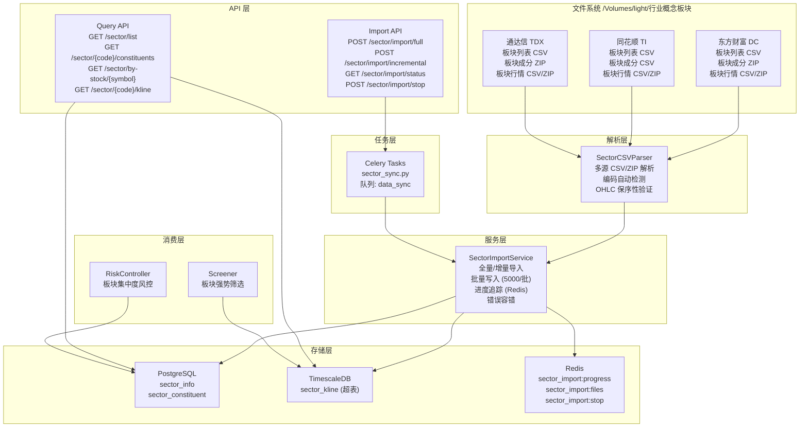
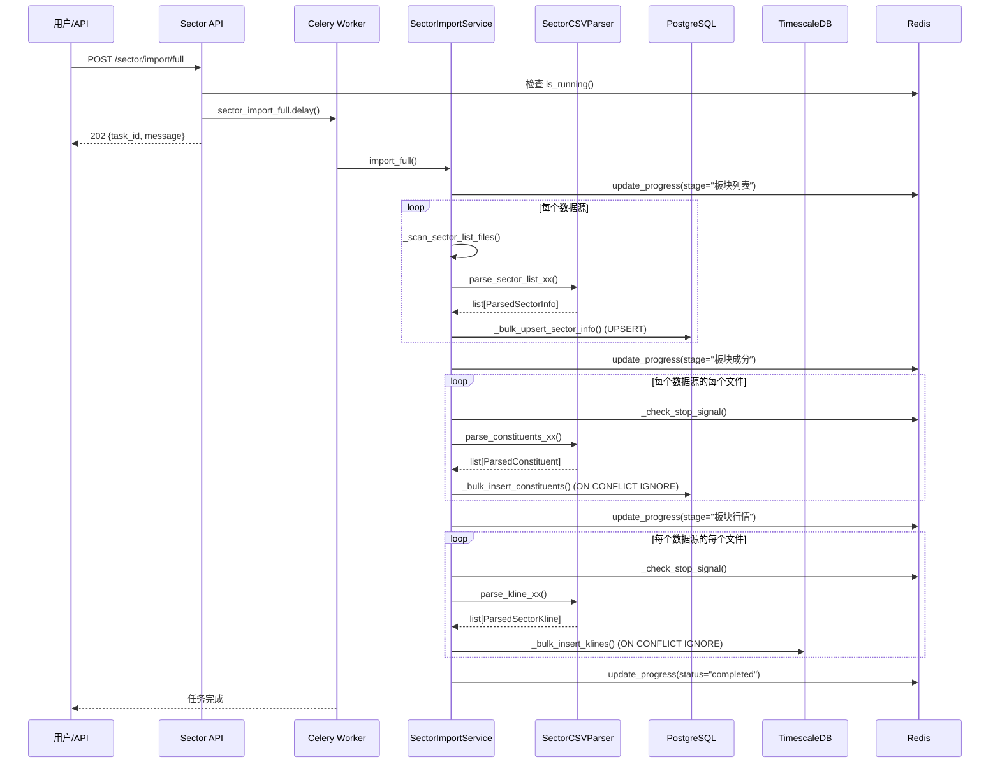

# 技术设计文档：行业概念板块数据导入

## Overview

本功能为量化选股系统新增行业/概念板块数据维度，从三个数据源（东方财富 DC、同花顺 TI、通达信 TDX）导入板块元数据、成分股快照和板块指数行情。设计遵循现有系统架构模式（FastAPI + SQLAlchemy 2.0 async + Celery），与现有 K 线导入模块完全解耦。

核心设计决策：
- **独立模型文件**：所有板块 ORM 模型定义在 `app/models/sector.py`，不修改现有模型文件
- **独立服务模块**：`app/services/data_engine/sector_import.py` 和 `app/services/data_engine/sector_csv_parser.py`，与 `local_kline_import.py` 完全解耦
- **独立 API 路由**：`app/api/v1/sector.py`，不修改现有路由文件
- **独立 Celery 任务**：在 `app/tasks/sector_sync.py` 中注册，使用独立 Redis 键前缀 `sector_import:`
- **双数据库存储**：板块元数据和成分股存 PostgreSQL（PGBase），板块行情存 TimescaleDB（TSBase）

## Architecture



## Components and Interfaces

### 1. SectorCSVParser（板块 CSV 解析器）

**文件**：`app/services/data_engine/sector_csv_parser.py`

负责将三个数据源各自不同格式的 CSV/ZIP 文件解析为统一的内部数据结构。

```python
from dataclasses import dataclass
from datetime import date
from decimal import Decimal
from enum import Enum
from pathlib import Path


class DataSource(str, Enum):
    DC = "DC"    # 东方财富
    TI = "TI"    # 同花顺
    TDX = "TDX"  # 通达信


class SectorType(str, Enum):
    CONCEPT = "CONCEPT"
    INDUSTRY = "INDUSTRY"
    REGION = "REGION"
    STYLE = "STYLE"


@dataclass
class ParsedSectorInfo:
    """解析后的板块元数据"""
    sector_code: str
    name: str
    sector_type: SectorType
    data_source: DataSource
    list_date: date | None = None
    constituent_count: int | None = None


@dataclass
class ParsedConstituent:
    """解析后的板块成分股"""
    trade_date: date
    sector_code: str
    data_source: DataSource
    symbol: str
    stock_name: str | None = None


@dataclass
class ParsedSectorKline:
    """解析后的板块行情"""
    time: date
    sector_code: str
    data_source: DataSource
    freq: str
    open: Decimal
    high: Decimal
    low: Decimal
    close: Decimal
    volume: int | None = None
    amount: Decimal | None = None
    turnover: Decimal | None = None
    change_pct: Decimal | None = None


class SectorCSVParser:
    """多源板块 CSV/ZIP 解析器"""

    # --- 板块列表解析 ---
    def parse_sector_list_dc(self, file_path: Path) -> list[ParsedSectorInfo]: ...
    def parse_sector_list_ti(self, file_path: Path) -> list[ParsedSectorInfo]: ...
    def parse_sector_list_tdx(self, file_path: Path) -> list[ParsedSectorInfo]: ...

    # --- 板块成分解析 ---
    def parse_constituents_dc_zip(self, zip_path: Path) -> list[ParsedConstituent]: ...
    def parse_constituents_ti_csv(self, file_path: Path, trade_date: date) -> list[ParsedConstituent]: ...
    def parse_constituents_tdx_zip(self, zip_path: Path) -> list[ParsedConstituent]: ...

    # --- 板块行情解析 ---
    def parse_kline_dc_csv(self, file_path: Path) -> list[ParsedSectorKline]: ...
    def parse_kline_ti_csv(self, file_path: Path) -> list[ParsedSectorKline]: ...
    def parse_kline_tdx_csv(self, file_path: Path) -> list[ParsedSectorKline]: ...

    # --- 通用工具 ---
    def _read_csv(self, file_path: Path) -> str:
        """读取 CSV 文件，自动检测编码（UTF-8 → GBK → GB2312）"""
        ...

    def _extract_zip(self, zip_path: Path) -> list[tuple[str, str]]:
        """内存解压 ZIP，返回 [(文件名, CSV文本内容), ...]"""
        ...

    def _validate_ohlc(self, kline: ParsedSectorKline) -> bool:
        """验证 OHLC 保序性：low ≤ open, low ≤ close, high ≥ open, high ≥ close"""
        ...

    def _map_dc_sector_type(self, idx_type: str) -> SectorType:
        """东方财富 idx_type 字段映射到 SectorType"""
        ...

    def _map_ti_sector_type(self, index_type: str) -> SectorType:
        """同花顺指数类型字段映射到 SectorType"""
        ...

    def _infer_date_from_filename(self, filename: str) -> date | None:
        """从文件名中推断日期（YYYYMMDD 格式）"""
        ...
```

### 2. SectorImportService（板块导入服务）

**文件**：`app/services/data_engine/sector_import.py`

负责扫描文件、调用解析器、批量写入数据库、管理导入进度。

```python
class SectorImportService:
    """板块数据导入服务"""

    BATCH_SIZE: int = 5000
    REDIS_PROGRESS_KEY: str = "sector_import:progress"
    REDIS_INCREMENTAL_KEY: str = "sector_import:files"
    REDIS_STOP_KEY: str = "sector_import:stop"
    PROGRESS_TTL: int = 86400
    HEARTBEAT_TIMEOUT: int = 120

    def __init__(self, base_dir: str = "/Volumes/light/行业概念板块") -> None: ...

    # --- 全量导入 ---
    async def import_full(
        self,
        data_sources: list[DataSource] | None = None,
    ) -> dict:
        """全量导入：板块列表 → 成分 → 行情"""
        ...

    # --- 增量导入 ---
    async def import_incremental(
        self,
        data_sources: list[DataSource] | None = None,
    ) -> dict:
        """增量导入：仅处理尚未导入的新数据文件"""
        ...

    # --- 各阶段导入 ---
    async def _import_sector_list(self, data_sources: list[DataSource]) -> int: ...
    async def _import_constituents(self, data_sources: list[DataSource]) -> int: ...
    async def _import_klines(self, data_sources: list[DataSource]) -> int: ...

    # --- 批量写入 ---
    async def _bulk_upsert_sector_info(self, items: list[ParsedSectorInfo]) -> int: ...
    async def _bulk_insert_constituents(self, items: list[ParsedConstituent]) -> int: ...
    async def _bulk_insert_klines(self, items: list[ParsedSectorKline]) -> int: ...

    # --- 增量检测 ---
    async def check_incremental(self, file_path: Path) -> bool: ...
    async def mark_imported(self, file_path: Path) -> None: ...

    # --- 进度管理 ---
    async def update_progress(self, **kwargs) -> None: ...
    async def is_running(self) -> bool: ...
    async def request_stop(self) -> None: ...
    async def _check_stop_signal(self) -> bool: ...

    # --- 文件扫描 ---
    def _scan_sector_list_files(self, source: DataSource) -> list[Path]: ...
    def _scan_constituent_files(self, source: DataSource) -> list[Path]: ...
    def _scan_kline_files(self, source: DataSource) -> list[Path]: ...
```

### 3. SectorRepository（板块数据仓储层）

**文件**：`app/services/data_engine/sector_repository.py`

提供板块数据的查询接口，供 API 层和业务层（风控、选股）使用。

```python
class SectorRepository:
    """板块数据查询仓储"""

    async def get_sector_list(
        self,
        sector_type: SectorType | None = None,
        data_source: DataSource | None = None,
    ) -> list[SectorInfo]: ...

    async def get_constituents(
        self,
        sector_code: str,
        data_source: DataSource,
        trade_date: date | None = None,
    ) -> list[SectorConstituent]: ...

    async def get_sectors_by_stock(
        self,
        symbol: str,
        trade_date: date | None = None,
    ) -> list[SectorConstituent]: ...

    async def get_sector_kline(
        self,
        sector_code: str,
        data_source: DataSource,
        freq: str = "1d",
        start: date | None = None,
        end: date | None = None,
    ) -> list[SectorKline]: ...

    async def get_latest_trade_date(
        self,
        data_source: DataSource,
    ) -> date | None: ...
```

### 4. API 端点

**文件**：`app/api/v1/sector.py`

```python
# 导入管理
POST /api/v1/sector/import/full          # 触发全量导入
POST /api/v1/sector/import/incremental   # 触发增量导入
GET  /api/v1/sector/import/status        # 查询导入进度
POST /api/v1/sector/import/stop          # 停止导入任务

# 数据查询
GET  /api/v1/sector/list                 # 板块列表（支持 type/source 筛选）
GET  /api/v1/sector/{code}/constituents  # 板块成分股
GET  /api/v1/sector/by-stock/{symbol}    # 股票所属板块
GET  /api/v1/sector/{code}/kline         # 板块行情K线
```

### 5. Celery 任务

**文件**：`app/tasks/sector_sync.py`

```python
@celery_app.task(name="app.tasks.sector_sync.sector_import_full", queue="data_sync")
def sector_import_full(data_sources: list[str] | None = None, base_dir: str | None = None) -> dict: ...

@celery_app.task(name="app.tasks.sector_sync.sector_import_incremental", queue="data_sync")
def sector_import_incremental(data_sources: list[str] | None = None) -> dict: ...
```

### 组件交互时序图



## Data Models

### SectorInfo（板块信息 — PostgreSQL）

```python
# app/models/sector.py

class SectorInfo(PGBase):
    """板块信息 ORM 模型"""
    __tablename__ = "sector_info"

    id: Mapped[int] = mapped_column(primary_key=True, autoincrement=True)
    sector_code: Mapped[str] = mapped_column(String(20), nullable=False)
    name: Mapped[str] = mapped_column(String(100), nullable=False)
    sector_type: Mapped[str] = mapped_column(String(20), nullable=False)  # CONCEPT/INDUSTRY/REGION/STYLE
    data_source: Mapped[str] = mapped_column(String(10), nullable=False)  # DC/TI/TDX
    list_date: Mapped[date | None] = mapped_column(Date, nullable=True)
    constituent_count: Mapped[int | None] = mapped_column(nullable=True)
    updated_at: Mapped[datetime] = mapped_column(
        TIMESTAMPTZ, server_default=sa_text("NOW()"), nullable=False
    )

    __table_args__ = (
        UniqueConstraint("sector_code", "data_source", name="uq_sector_info_code_source"),
        Index("ix_sector_info_type_source", "sector_type", "data_source"),
    )
```

### SectorConstituent（板块成分股 — PostgreSQL）

```python
class SectorConstituent(PGBase):
    """板块成分股快照 ORM 模型"""
    __tablename__ = "sector_constituent"

    id: Mapped[int] = mapped_column(primary_key=True, autoincrement=True)
    trade_date: Mapped[date] = mapped_column(Date, nullable=False)
    sector_code: Mapped[str] = mapped_column(String(20), nullable=False)
    data_source: Mapped[str] = mapped_column(String(10), nullable=False)
    symbol: Mapped[str] = mapped_column(String(10), nullable=False)
    stock_name: Mapped[str | None] = mapped_column(String(50), nullable=True)

    __table_args__ = (
        UniqueConstraint(
            "trade_date", "sector_code", "data_source", "symbol",
            name="uq_sector_constituent_date_code_source_symbol",
        ),
        Index("ix_sector_constituent_symbol_date", "symbol", "trade_date"),
        Index("ix_sector_constituent_code_source_date", "sector_code", "data_source", "trade_date"),
    )
```

### SectorKline（板块行情 — TimescaleDB）

```python
class SectorKline(TSBase):
    """板块指数行情 ORM 模型，对应 TimescaleDB 超表"""
    __tablename__ = "sector_kline"

    time: Mapped[datetime] = mapped_column(primary_key=True, nullable=False)
    sector_code: Mapped[str] = mapped_column(String(20), primary_key=True, nullable=False)
    data_source: Mapped[str] = mapped_column(String(10), primary_key=True, nullable=False)
    freq: Mapped[str] = mapped_column(String(5), primary_key=True, nullable=False)

    open: Mapped[Decimal | None] = mapped_column(nullable=True)
    high: Mapped[Decimal | None] = mapped_column(nullable=True)
    low: Mapped[Decimal | None] = mapped_column(nullable=True)
    close: Mapped[Decimal | None] = mapped_column(nullable=True)
    volume: Mapped[int | None] = mapped_column(BigInteger, nullable=True)
    amount: Mapped[Decimal | None] = mapped_column(nullable=True)
    turnover: Mapped[Decimal | None] = mapped_column(nullable=True)
    change_pct: Mapped[Decimal | None] = mapped_column(nullable=True)

    __table_args__ = (
        Index(
            "uq_sector_kline_time_code_source_freq",
            "time", "sector_code", "data_source", "freq",
            unique=True,
        ),
        Index("ix_sector_kline_code_source_freq_time", "sector_code", "data_source", "freq", "time"),
    )
```

### 数据类（纯 dataclass，定义在 parser 模块中）

解析层使用的 `ParsedSectorInfo`、`ParsedConstituent`、`ParsedSectorKline` 三个 dataclass 已在 Components 部分定义，作为解析器输出和导入服务输入的中间数据结构。

### 枚举类型

`DataSource` 和 `SectorType` 枚举定义在 `sector_csv_parser.py` 中，同时在 `app/models/sector.py` 中重新导出，供 API 层和业务层使用。

### 文件系统目录结构

实际文件系统布局（数据文件按功能组织在根目录，不按数据源分子目录）：

```
/Volumes/light/行业概念板块/
│
│  ── 板块列表 ──
├── 概念板块列表_东财.csv                              # DC 概念板块列表（根目录）
├── 行业概念板块_同花顺.csv                            # TI 板块列表（根目录）
├── 通达信板块列表.csv                                 # TDX 板块列表（根目录）
├── 板块信息_通达信.zip                                # TDX 板块信息 ZIP（含历史板块数据）
├── 东方财富_概念板块_历史行情数据/
│   └── 东方财富概念板块列表.csv                        # DC 概念板块列表（历史行情目录内）
├── 东方财富_行业板块_历史行情数据/
│   └── 东方财富行业板块列表.csv                        # DC 行业板块列表（历史行情目录内）
│
│  ── 板块成分 ──
├── 概念板块_东财.zip                                  # DC 概念板块成分 ZIP（根目录）
├── 概念板块成分汇总_同花顺.csv                        # TI 概念板块成分汇总（根目录）
├── 行业板块成分汇总_同花顺.csv                        # TI 行业板块成分汇总（根目录）
├── 概念板块成分_同花顺.zip                            # TI 概念板块成分 ZIP（根目录）
├── 板块成分_东财/                                     # DC 每日成分快照（按月份组织）
│   └── YYYY-MM/
│       └── 板块成分_DC_YYYYMMDD.zip
├── 板块成分_同花顺/                                   # TI 成分增量（按类型和月份组织）
│   ├── 概念板块成分汇总_同花顺/
│   │   └── YYYY-MM/
│   │       └── 概念板块成分汇总_同花顺_YYYYMMDD.csv
│   └── 行业板块成分汇总_同花顺/
│       └── YYYY-MM/
│           └── 行业板块成分汇总_同花顺_YYYYMMDD.csv
├── 板块成分_通达信/                                   # TDX 每日成分快照（按月份组织）
│   └── YYYY-MM/
│       └── 板块成分_TDX_YYYYMMDD.zip
│
│  ── 板块行情 ──
├── 板块行情_东财.zip                                  # DC 历史行情 ZIP（全量）
├── 板块指数行情_同花顺.zip                            # TI 历史行情 ZIP（全量）
├── 板块行情_通达信.zip                                # TDX 历史行情 ZIP（全量）
├── 东方财富_概念板块_历史行情数据/
│   └── 概念板块_日k.zip                               # DC 概念板块历史日K ZIP
├── 东方财富_行业板块_历史行情数据/
│   └── 行业板块_日k.zip                               # DC 行业板块历史日K ZIP
├── 通达信_概念板块_历史行情数据/                       # TDX 概念板块历史行情
│   ├── 概念板块_日k_K线.zip
│   ├── 概念板块_周k_K线.zip
│   └── 概念板块_月k_K线.zip
├── 通达信_行业板块_历史行情数据/                       # TDX 行业板块历史行情
│   ├── 行业板块_日k_K线.zip
│   ├── 行业板块_周k_K线.zip
│   └── 行业板块_月k_K线.zip
├── 通达信_地区板块_历史行情数据/                       # TDX 地区板块历史行情（同上模式）
├── 通达信_风格板块_历史行情数据/                       # TDX 风格板块历史行情（同上模式）
│
│  ── 增量数据 ──
└── 增量数据/                                          # 增量数据（按数据类型分子目录）
    ├── 概念板块_东财/                                 # DC 增量板块列表
    │   └── YYYY-MM/
    │       └── YYYY-MM-DD.csv
    ├── 板块行情_东财/                                 # DC 增量行情
    │   └── YYYY-MM/
    │       └── YYYY-MM-DD.csv
    ├── 板块指数行情_同花顺/                           # TI 增量行情
    │   └── YYYY-MM/
    │       └── YYYY-MM-DD.csv
    ├── 板块行情_通达信/                               # TDX 增量行情
    │   └── YYYY-MM/
    │       └── YYYY-MM-DD.csv
    └── 板块信息_通达信/                               # TDX 增量板块信息
        └── YYYY-MM/
            └── YYYY-MM-DD.csv
```

**关键设计要点：**
- 数据文件按功能（板块列表/成分/行情/增量）组织在根目录，不按数据源分 `东方财富/`、`同花顺/`、`通达信/` 子目录
- 增量数据统一在根目录的 `增量数据/` 下，按数据类型（而非数据源）分子目录
- 增量 CSV 文件名使用 `YYYY-MM-DD.csv` 格式（非 `板块行情_DC_YYYYMMDD.csv`）
- 历史行情以 ZIP 格式存储（内含按板块代码命名的 CSV），非单个大 CSV
- 成分数据在独立的 `板块成分_*` 目录下，按月份组织
- DC 行情 CSV 列顺序为 `收盘,开盘`（非 `开盘,收盘`）
- TDX 行情有两种 CSV 格式（历史 ZIP 内 vs 增量/根目录）


## Correctness Properties

### Property 14: File scanning discovers actual files

*For any* data source (DC, TI, TDX), the `_scan_sector_list_files`, `_scan_constituent_files`, and `_scan_kline_files` methods SHALL return non-empty lists when the corresponding files exist in the actual file system layout. The scan methods SHALL correctly handle root-level files, ZIP files, and nested `增量数据/` subdirectories with `YYYY-MM-DD.csv` naming.

**Validates: Requirements 12.1, 12.2, 12.3, 12.4, 12.14**

### Property 15: ZIP kline parsing produces valid records

*For any* valid kline ZIP file (DC, TI, TDX), calling the corresponding `parse_kline_*_csv` method with a `.zip` file path SHALL extract all internal CSVs and return a combined list of `ParsedSectorKline` records with correct OHLCV values and valid dates.

**Validates: Requirements 12.5, 12.6, 12.7**

*A property is a characteristic or behavior that should hold true across all valid executions of a system — essentially, a formal statement about what the system should do. Properties serve as the bridge between human-readable specifications and machine-verifiable correctness guarantees.*

### Property 1: Enum validation rejects invalid values

*For any* string that is not in the set {CONCEPT, INDUSTRY, REGION, STYLE}, the SectorType enum SHALL reject it; *for any* string not in {DC, TI, TDX}, the DataSource enum SHALL reject it; *for any* string not in {1d, 1w, 1M}, the SectorKline freq validation SHALL reject it. Conversely, all valid enum values SHALL be accepted.

**Validates: Requirements 1.4, 1.5, 3.5**

### Property 2: Sector list CSV parsing round-trip

*For any* valid sector info data (sector_code, name, sector_type, data_source, list_date, constituent_count), generating a CSV row in the corresponding data source format (DC/TI/TDX) and parsing it back with the appropriate parser SHALL recover the original field values.

**Validates: Requirements 4.1, 4.2, 4.3**

### Property 3: Constituent data parsing round-trip

*For any* valid constituent data (trade_date, sector_code, data_source, symbol, stock_name), generating CSV content in the corresponding data source format and parsing it back SHALL recover the original field values. For ZIP-based formats (DC, TDX), the CSV content is wrapped in an in-memory ZIP before parsing.

**Validates: Requirements 4.4, 4.5, 4.6**

### Property 4: Kline CSV parsing round-trip

*For any* valid sector kline data (time, sector_code, open, high, low, close, volume, amount, turnover, change_pct) where the OHLC invariant holds, generating a CSV row in the corresponding data source format (DC/TI/TDX) and parsing it back SHALL recover the original OHLCV values.

**Validates: Requirements 4.7, 4.8, 4.9**

### Property 5: Encoding detection preserves content

*For any* valid CSV text containing Chinese characters, encoding it as UTF-8, GBK, or GB2312 and then reading it with the parser's auto-detection logic SHALL produce identical parsed content regardless of the source encoding.

**Validates: Requirements 4.10**

### Property 6: OHLC validation invariant

*For any* four positive decimal values (open, high, low, close), the OHLC validator SHALL return True if and only if low ≤ open AND low ≤ close AND high ≥ open AND high ≥ close. Equivalently, *for any* parsed kline record that passes validation, the invariant low ≤ min(open, close) AND high ≥ max(open, close) SHALL hold.

**Validates: Requirements 4.11**

### Property 7: SectorInfo UPSERT idempotence

*For any* valid SectorInfo record, inserting it via the UPSERT operation and then inserting it again with modified mutable fields (name, constituent_count, updated_at) SHALL result in exactly one record in the database with the updated field values. The (sector_code, data_source) combination SHALL remain unique.

**Validates: Requirements 1.2, 5.3, 6.6**

### Property 8: SectorConstituent conflict-ignore idempotence

*For any* valid SectorConstituent record, inserting it via the bulk insert operation (ON CONFLICT DO NOTHING) twice SHALL result in exactly one record in the database. The total record count SHALL not increase on the second insert.

**Validates: Requirements 2.2, 5.4, 6.5**

### Property 9: SectorKline conflict-ignore idempotence

*For any* valid SectorKline record, inserting it via the bulk insert operation (ON CONFLICT DO NOTHING) twice SHALL result in exactly one record in the database. The total record count SHALL not increase on the second insert.

**Validates: Requirements 3.2, 5.5, 6.4**

### Property 10: Incremental detection correctness

*For any* file path, after calling `mark_imported(path)`, calling `check_incremental(path)` SHALL return True (file should be skipped). For any file path that has NOT been marked, `check_incremental(path)` SHALL return False (file should be processed).

**Validates: Requirements 6.3**

### Property 11: Sector concentration warning threshold

*For any* portfolio of positions and *for any* sector with constituent data, if the sector's holding count ratio (持仓股票数 / 成分股总数) OR holding market value ratio (板块持仓市值 / 总持仓市值) exceeds the configured threshold, the risk controller SHALL generate a concentration warning. If both ratios are below the threshold, no warning SHALL be generated for that sector.

**Validates: Requirements 9.2, 9.3**

### Property 12: Sector strength ranking consistency

*For any* set of sector kline data over a given period, the sector strength ranking produced by the screener SHALL be consistent with the calculated change percentages — i.e., a sector with a higher change percentage over the period SHALL rank higher (or equal) than one with a lower change percentage.

**Validates: Requirements 10.2**

### Property 13: Sector strength filtering correctness

*For any* candidate stock list and *for any* sector strength ranking with a top-N threshold, the filtered result SHALL contain only stocks that belong to at least one sector in the top-N. No stock from a non-top-N sector SHALL appear in the filtered result (unless it also belongs to a top-N sector).

**Validates: Requirements 10.3**

## Error Handling

### 文件解析错误

| 错误场景 | 处理策略 | 日志级别 |
|---------|---------|---------|
| CSV 文件不存在或不可读 | 记录错误，跳过该文件，继续处理后续文件 | ERROR |
| ZIP 文件损坏（BadZipFile） | 记录错误，跳过该文件 | ERROR |
| CSV 编码无法识别 | 尝试 UTF-8 → GBK → GB2312，全部失败则跳过 | WARNING |
| CSV 行字段不足 | 跳过该行，计入 skipped 计数 | WARNING |
| 数值解析失败（InvalidOperation） | 跳过该行，计入 skipped 计数 | WARNING |
| OHLC 保序性验证失败 | 跳过该行，计入 skipped 计数 | WARNING |
| 日期格式无法解析 | 跳过该行，计入 skipped 计数 | WARNING |

### 数据库写入错误

| 错误场景 | 处理策略 | 日志级别 |
|---------|---------|---------|
| 唯一约束冲突（UPSERT） | 更新已有记录（SectorInfo） | DEBUG |
| 唯一约束冲突（INSERT） | 忽略冲突（ON CONFLICT DO NOTHING） | DEBUG |
| 数据库连接失败 | 重试 3 次，间隔 5 秒，全部失败则终止当前阶段 | ERROR |
| 单批次写入超时 | 记录错误，继续下一批次 | ERROR |

### 任务管理错误

| 错误场景 | 处理策略 | 日志级别 |
|---------|---------|---------|
| 重复触发导入任务 | API 返回 409 Conflict，提示已有任务运行中 | WARNING |
| 任务心跳超时（>120s） | 自动标记为 failed，允许新任务启动 | WARNING |
| Redis 连接失败 | 进度更新降级为仅日志输出，导入继续执行 | ERROR |
| 停止信号处理 | 完成当前批次后安全终止，状态标记为 stopped | INFO |

### 业务层降级

| 错误场景 | 处理策略 | 日志级别 |
|---------|---------|---------|
| 风控查询板块数据失败 | 跳过板块集中度检查，不阻塞其他风控流程 | WARNING |
| 选股查询板块行情失败 | 跳过板块强势筛选条件，使用其他条件继续选股 | WARNING |
| 查询 API 无数据 | 返回空列表，HTTP 200 | INFO |

## Testing Strategy

### 测试框架

- **单元测试**：pytest + pytest-asyncio
- **属性测试**：Hypothesis（Python），最少 100 次迭代
- **集成测试**：pytest + 临时数据库 fixture

### 属性测试（Property-Based Tests）

使用 Hypothesis 库实现，每个属性测试对应设计文档中的一个 Correctness Property。

**配置要求**：
- 每个属性测试最少 100 次迭代（`@settings(max_examples=100)`）
- 每个测试用注释标注对应的设计属性
- 标注格式：`# Feature: sector-data-import, Property {N}: {title}`

**属性测试文件**：`tests/properties/test_sector_import_properties.py`

| Property | 测试内容 | 生成器策略 |
|----------|---------|-----------|
| P1: Enum validation | 生成随机字符串，验证枚举接受/拒绝行为 | `st.text()` + 有效枚举值混合 |
| P2: Sector list parsing | 生成随机板块元数据，构造 CSV，解析验证 | 自定义 `sector_info_strategy()` |
| P3: Constituent parsing | 生成随机成分数据，构造 CSV/ZIP，解析验证 | 自定义 `constituent_strategy()` |
| P4: Kline parsing | 生成随机行情数据，构造 CSV，解析验证 | 自定义 `sector_kline_strategy()` |
| P5: Encoding detection | 生成含中文的 CSV，多编码编码/解码 | `st.text(alphabet=中文字符集)` |
| P6: OHLC validation | 生成随机正数四元组，验证不等式 | `st.decimals(min_value=0.01)` |
| P7: UPSERT idempotence | 生成随机 SectorInfo，双次写入验证 | 自定义 strategy + 测试数据库 |
| P8: Constituent idempotence | 生成随机 Constituent，双次写入验证 | 自定义 strategy + 测试数据库 |
| P9: Kline idempotence | 生成随机 SectorKline，双次写入验证 | 自定义 strategy + 测试数据库 |
| P10: Incremental detection | 生成随机文件路径，mark/check 验证 | `st.text()` + mock Redis |
| P11: Concentration warning | 生成随机持仓和板块数据，验证预警 | 自定义 `portfolio_strategy()` |
| P12: Ranking consistency | 生成随机行情数据，验证排序一致性 | 自定义 `kline_series_strategy()` |
| P13: Filtering correctness | 生成随机候选列表和排名，验证过滤 | 自定义 `candidates_strategy()` |

### 单元测试

**测试文件**：`tests/services/test_sector_csv_parser.py`、`tests/services/test_sector_import.py`

| 测试范围 | 测试内容 |
|---------|---------|
| CSV 解析 | 每种数据源格式的具体解析示例（含边界值） |
| 编码处理 | GBK 编码文件的解析 |
| ZIP 处理 | 损坏 ZIP 文件的错误处理 |
| 文件扫描 | 目录结构扫描的正确性 |
| 批量写入 | 批次大小分割逻辑 |
| 进度追踪 | Redis 进度更新和读取 |
| 停止信号 | 停止信号的发送和检测 |
| 心跳超时 | 僵尸任务检测逻辑 |

### 集成测试

**测试文件**：`tests/integration/test_sector_import_integration.py`

| 测试范围 | 测试内容 |
|---------|---------|
| 全量导入流程 | 使用样本数据文件执行完整导入流程 |
| 增量导入流程 | 全量导入后执行增量导入，验证无重复 |
| API 端点 | 导入触发、进度查询、停止、数据查询 |
| 并发控制 | 重复触发导入时的拒绝行为 |

### API 测试

**测试文件**：`tests/api/test_sector_api.py`

| 测试范围 | 测试内容 |
|---------|---------|
| 板块列表查询 | 按类型和数据源筛选 |
| 成分股查询 | 按板块代码和日期查询 |
| 股票所属板块 | 按股票代码和日期查询 |
| 板块行情查询 | 按板块代码、频率和日期范围查询 |
| 默认日期 | 未指定日期时使用最新交易日 |
