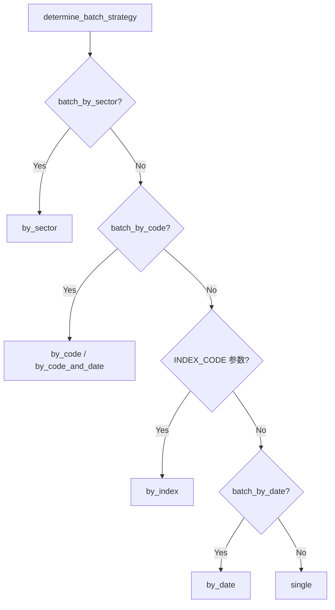
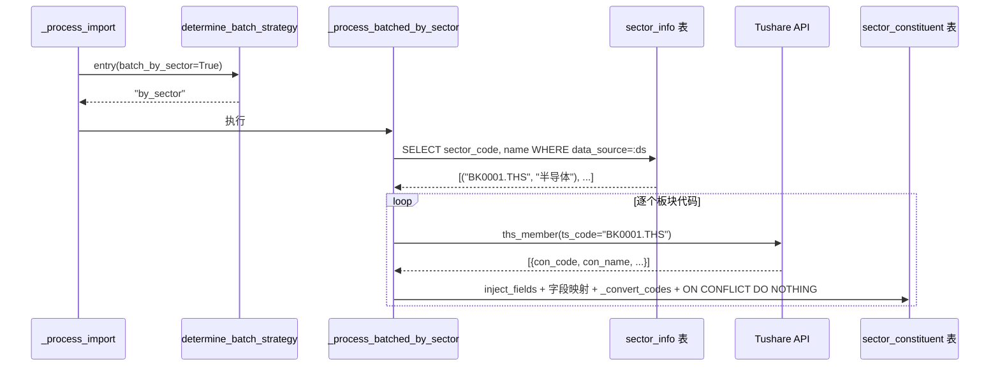

# 技术设计文档：板块成分数据全量导入（按板块代码遍历）

## 概述

在现有导入框架（`app/tasks/tushare_import.py`）中新增 `batch_by_sector` 分批模式，使 `ths_member`、`dc_member`、`tdx_member`、`index_member_all` 四个接口能够自动遍历 `sector_info` 表中所有板块代码逐个调用 Tushare API，获取完整的板块成分数据。

### 设计决策

1. **复用现有框架**：`batch_by_sector` 作为 `ApiEntry` 的新字段，与 `batch_by_code`/`batch_by_date` 平级，通过 `determine_batch_strategy` 路由分发，最大程度复用现有的进度更新、停止信号、错误处理机制。

2. **板块代码来源**：从 `sector_info` 表按 `data_source` 过滤获取（`data_source` 从 `inject_fields` 中提取），而非硬编码，确保新增板块自动纳入遍历范围。

3. **容错优先**：单个板块失败不中断整体导入，空数据跳过不计失败，与现有 `_process_batched_index` 的错误处理模式一致。

4. **`batch_by_sector` 优先级最高**：在 `determine_batch_strategy` 中排在所有现有策略之前，避免被 `batch_by_code` 或 `batch_by_date` 误路由。

5. **symbol 格式统一**：将所有板块成分接口的 `code_format` 改为 `STOCK_SYMBOL`，确保 `symbol` 字段为 6 位纯数字，与 `stock_info.symbol` 格式一致，支持板块因子计算时的 JOIN 操作。

6. **trade_date 字段语义统一为"纳入日期"**：
   - `trade_date` 字段统一表示"股票加入板块的日期"（纳入日期）
   - TI/CI：保留 API 返回的 `in_date`（纳入日期）
   - TDX/DC：保留 API 返回的 `trade_date`（调入日期）
   - THS：API 不返回日期字段，使用导入当天日期作为纳入日期
   - 不引入"快照日期"概念，减少数据冗余

## 架构

### 分批策略路由扩展

在 `determine_batch_strategy` 中新增 `batch_by_sector` 检查，优先级高于所有现有策略：



### 数据流



## 组件与接口

### 1. ApiEntry 扩展

在 `app/services/data_engine/tushare_registry.py` 的 `ApiEntry` 数据类中新增字段：

```python
@dataclass
class ApiEntry:
    # ... 现有字段 ...
    batch_by_sector: bool = False  # 是否按板块代码遍历导入
```

### 2. determine_batch_strategy 扩展

在现有优先级路由最前面插入 `batch_by_sector` 检查：

```python
def determine_batch_strategy(entry: ApiEntry, params: dict) -> str:
    # 优先级 0（新增）：batch_by_sector
    if entry.batch_by_sector:
        return "by_sector"
    # 优先级 1：batch_by_code（原有逻辑不变）
    # ...
```

此为纯函数，不依赖外部状态，便于属性测试。

### 3. _process_batched_by_sector 新增函数

新增异步函数，模式与现有 `_process_batched_index` 类似：

```python
async def _process_batched_by_sector(
    entry: ApiEntry,
    adapter: TushareAdapter,
    params: dict,
    task_id: str,
    log_id: int,
    rate_delay: float,
) -> dict:
    """按板块代码遍历模式。

    流程：
    1. 从 inject_fields 获取 data_source
    2. 查询 sector_info WHERE data_source=:ds，获取 (sector_code, name) 列表
    3. 遍历每个板块代码：
       a. 检查停止信号
       b. 调用 Tushare API（ts_code=sector_code）
       c. inject_fields + 字段映射 + _convert_codes + 写入 DB
       d. 更新进度（含板块名称）
       e. 频率限制延迟
    4. 汇总结果（成功/失败/空数据计数）

    对应需求：1.2, 1.3, 1.4, 1.5, 1.6, 1.7, 6.1-6.5
    """
```

**获取板块代码列表**：

```python
# 从 inject_fields 获取 data_source
inject_fields = entry.extra_config.get("inject_fields", {})
ds = inject_fields.get("data_source")
if not ds:
    # inject_fields 中无 data_source，无法确定遍历范围
    await _finalize_log(log_id, "failed", 0, "batch_by_sector 模式缺少 inject_fields.data_source")
    return {"status": "failed", "error": "缺少 data_source"}

async with get_pg_session() as session:
    stmt = (
        select(SectorInfo.sector_code, SectorInfo.name)
        .where(SectorInfo.data_source == ds)
        .order_by(SectorInfo.sector_code)
    )
    rows = (await session.execute(stmt)).all()
    sector_codes = [(r.sector_code, r.name) for r in rows]

# 空列表检查（前置依赖提示）
if not sector_codes:
    logger.warning(
        "batch_by_sector 模式下 sector_info 表中无 data_source=%s 的板块，"
        "请先导入板块信息（如 ths_index/dc_index/tdx_index）",
        ds,
    )
    return {"status": "completed", "record_count": 0}
```

**进度更新**（复用现有 `_update_progress`）：

```python
await _update_progress(
    task_id,
    status="running",
    total=len(sector_codes),
    completed=idx + 1,
    failed=failed_count,
    current_item=f"{sector_code} ({sector_name})",
    batch_mode="by_sector",
)
```

**截断检测**（需求 7.4）：

```python
max_rows = entry.extra_config.get("max_rows", _TUSHARE_MAX_ROWS)
if len(rows) >= max_rows:
    logger.warning(
        "板块 %s 返回 %d 行（可能被截断），api=%s, max_rows=%d",
        sector_code, len(rows), entry.api_name, max_rows,
    )
```

**错误处理**（与 `_process_batched_index` 一致）：
- `TushareAPIError(code=-2001)` → Token 无效，终止整个任务（`raise`）
- 其他 `TushareAPIError` → WARNING 日志，`failed_count` +1，继续
- API 返回空数据 → 跳过，`empty_count` +1，不计为失败
- DB 写入异常 → ERROR 日志，`failed_count` +1，继续

**trade_date 动态注入逻辑**（仅针对 THS）：

对于 `ths_member` API 不返回 `trade_date` 字段的情况，在 `inject_fields` 处理后检查目标字段是否缺失 `trade_date`，若缺失则注入当前日期作为纳入日期：

```python
from datetime import date

# 在 inject_fields 处理后，检查是否需要动态注入 trade_date
if inject_fields:
    for row in rows:
        row.update(inject_fields)

# 检查是否需要动态注入 trade_date（仅针对 ths_member）
# 条件：字段映射中没有 trade_date，且 inject_fields 中也没有
has_trade_date_in_mapping = any(
    fm.target == "trade_date" for fm in entry.field_mappings
)
if not has_trade_date_in_mapping and "trade_date" not in inject_fields:
    current_date = date.today().strftime("%Y%m%d")
    for row in rows:
        row["trade_date"] = current_date
```

**其他数据源保留 API 返回的日期**：
- TI/CI：`field_mappings` 包含 `FieldMapping(source="in_date", target="trade_date")`
- TDX/DC：`field_mappings` 包含 `FieldMapping(source="trade_date", target="trade_date")`

**返回值**：

```python
return {
    "status": "completed" | "stopped",
    "record_count": total_records,
    "batch_stats": {
        "total_sectors": len(sector_codes),
        "success_sectors": success_count,
        "failed_sectors": failed_count,
        "empty_sectors": empty_count,
    },
}
```

### 4. _process_import 路由集成

在 `_process_import` 的策略分发中新增 `by_sector` 分支（紧接 `by_index` 之后）：

```python
elif strategy == "by_sector":
    result = await _process_batched_by_sector(
        entry, adapter, params, task_id, log_id, rate_delay,
    )
```

### 5. 注册表配置变更

**`ths_member`**（需求 2、7）：

```python
register(ApiEntry(
    api_name="ths_member",
    label="同花顺行业概念成分",
    category="stock_data",
    subcategory="打板专题数据",
    token_tier=TokenTier.ADVANCED,
    target_table="sector_constituent",
    storage_engine=StorageEngine.PG,
    code_format=CodeFormat.STOCK_SYMBOL,  # 确保 symbol 为 6 位数字
    conflict_columns=["trade_date", "sector_code", "data_source", "symbol"],
    conflict_action="do_nothing",
    optional_params=[ParamType.SECTOR_CODE],
    rate_limit_group=RateLimitGroup.TIER_60,
    batch_by_sector=True,  # 新增
    extra_config={
        "inject_fields": {"data_source": "THS"},  # 不注入 trade_date，由导入逻辑动态注入当前日期
    },
    field_mappings=[
        FieldMapping(source="ts_code", target="sector_code"),
        FieldMapping(source="con_code", target="symbol"),  # 会被 _convert_codes 处理为 6 位
        FieldMapping(source="con_name", target="stock_name"),
        # 注意：ths_member API 不返回 trade_date，由 _process_batched_by_sector 动态注入当前日期
    ],
))
```

**`dc_member`**（需求 3、8）：

```python
register(ApiEntry(
    api_name="dc_member",
    label="东方财富概念成分",
    category="stock_data",
    subcategory="打板专题数据",
    token_tier=TokenTier.ADVANCED,
    target_table="sector_constituent",
    storage_engine=StorageEngine.PG,
    code_format=CodeFormat.STOCK_SYMBOL,  # 确保 symbol 为 6 位数字
    conflict_columns=["trade_date", "sector_code", "data_source", "symbol"],
    conflict_action="do_nothing",
    optional_params=[ParamType.SECTOR_CODE],
    rate_limit_group=RateLimitGroup.LIMIT_UP,
    batch_by_sector=True,  # 新增
    extra_config={
        "inject_fields": {"data_source": "DC"},  # 不注入 trade_date
    },
    field_mappings=[
        FieldMapping(source="ts_code", target="sector_code"),
        FieldMapping(source="con_code", target="symbol"),
        FieldMapping(source="name", target="stock_name"),
        FieldMapping(source="trade_date", target="trade_date"),  # 保留 API 返回的调入日期
    ],
))
```

**`tdx_member`**（需求 4、8）：

```python
register(ApiEntry(
    api_name="tdx_member",
    label="通达信板块成分",
    category="stock_data",
    subcategory="打板专题数据",
    token_tier=TokenTier.ADVANCED,
    target_table="sector_constituent",
    storage_engine=StorageEngine.PG,
    code_format=CodeFormat.STOCK_SYMBOL,  # 确保 symbol 为 6 位数字
    conflict_columns=["trade_date", "sector_code", "data_source", "symbol"],
    conflict_action="do_nothing",
    optional_params=[ParamType.SECTOR_CODE],
    rate_limit_group=RateLimitGroup.LIMIT_UP,
    batch_by_sector=True,  # 新增
    extra_config={
        "inject_fields": {"data_source": "TDX"},  # 不注入 trade_date
    },
    field_mappings=[
        FieldMapping(source="ts_code", target="sector_code"),
        FieldMapping(source="con_code", target="symbol"),
        FieldMapping(source="con_name", target="stock_name"),
        FieldMapping(source="trade_date", target="trade_date"),  # 保留 API 返回的调入日期
    ],
))
```

**`index_member_all`（TI）**（需求 5）：

```python
register(ApiEntry(
    api_name="index_member_all",
    label="申万行业成分（分级）",
    category="index_data",
    subcategory="申万行业数据（分类/成分/日线行情/实时行情）",
    token_tier=TokenTier.ADVANCED,
    target_table="sector_constituent",
    storage_engine=StorageEngine.PG,
    code_format=CodeFormat.NONE,
    conflict_columns=["trade_date", "sector_code", "data_source", "symbol"],
    conflict_action="do_nothing",
    optional_params=[ParamType.SECTOR_CODE, ParamType.STOCK_CODE],
    rate_limit_group=RateLimitGroup.FUNDAMENTALS,
    batch_by_sector=True,  # 新增
    extra_config={"inject_fields": {"data_source": "TI"}, "max_rows": 5000},
    field_mappings=[
        FieldMapping(source="ts_code", target="symbol"),
        FieldMapping(source="name", target="stock_name"),
        FieldMapping(source="l1_code", target="sector_code"),
        FieldMapping(source="in_date", target="trade_date"),  # 保留 API 返回的纳入日期
    ],
))
```

**`ci_index_member`（CI）**（需求 6）：

```python
register(ApiEntry(
    api_name="ci_index_member",
    label="中信行业成分",
    category="index_data",
    subcategory="中信行业数据（成分/日线行情）",
    token_tier=TokenTier.ADVANCED,
    target_table="sector_constituent",
    storage_engine=StorageEngine.PG,
    code_format=CodeFormat.NONE,
    conflict_columns=["trade_date", "sector_code", "data_source", "symbol"],
    conflict_action="do_nothing",
    optional_params=[ParamType.SECTOR_CODE, ParamType.STOCK_CODE],
    rate_limit_group=RateLimitGroup.FUNDAMENTALS,
    extra_config={"inject_fields": {"data_source": "CI"}, "max_rows": 5000},
    field_mappings=[
        FieldMapping(source="ts_code", target="symbol"),
        FieldMapping(source="name", target="stock_name"),
        FieldMapping(source="l1_code", target="sector_code"),
        FieldMapping(source="in_date", target="trade_date"),  # 保留 API 返回的纳入日期
    ],
))
```

### 6. 前端进度展示适配

前端从 Redis 进度数据中读取以下字段用于展示：

| 字段 | 说明 | 示例值 |
|------|------|--------|
| `batch_mode` | 分批模式标识 | `"by_sector"` |
| `total` | 总板块数 | `1724` |
| `completed` | 已完成板块数 | `500` |
| `failed` | 失败板块数 | `3` |
| `current_item` | 当前处理项 | `"BK0001.THS (半导体)"` |

**展示格式**（需求 6.5）：

```
正在导入板块 {completed}/{total}: {current_item}
```

示例：`正在导入板块 500/1724: BK0001.THS (半导体)`

## 数据模型

无数据库表结构变更。涉及的现有表：

| 表名 | 用途 | 关键约束 |
|------|------|----------|
| `sector_info` | 读取板块代码列表 | `UNIQUE(sector_code, data_source)` |
| `sector_constituent` | 写入成分股数据 | `UNIQUE(trade_date, sector_code, data_source, symbol)` + `ON CONFLICT DO NOTHING` |

`sector_constituent` 的唯一约束保证重复导入不会产生重复记录（需求 7.1）。

### 前置依赖

`batch_by_sector` 模式依赖 `sector_info` 表中已有对应 `data_source` 的板块数据。导入顺序：

1. 先导入板块信息：`ths_index`（THS）、`dc_index`（DC）、`tdx_index`（TDX）
2. 再导入板块成分：`ths_member`、`dc_member`、`tdx_member`

## 正确性属性

### Property 1: batch_by_sector 路由正确性

*For any* `ApiEntry`，当 `batch_by_sector=True` 时，`determine_batch_strategy(entry, params)` 应返回 `"by_sector"`，无论 `params` 中是否包含 `start_date`、`end_date`、`ts_code` 等参数。

**Validates: Requirements 1.1**

### Property 2: 板块代码来源一致性

*For any* `batch_by_sector` 模式的导入任务，遍历的板块代码列表应完全来自 `sector_info` 表中对应 `data_source` 的记录，不应包含该 `data_source` 之外的板块代码。

**Validates: Requirements 1.2, 7.2**

### Property 3: 错误容错——单板块失败不中断

*For any* 板块代码列表和任意失败模式（部分板块 API 返回错误、部分返回空数据），导入任务处理的板块总数应等于列表长度，且空数据板块不计入失败计数，API 错误板块计入失败计数。

**Validates: Requirements 1.4, 6.2, 6.3**

### Property 4: 进度单调递增且最终完整

*For any* `batch_by_sector` 模式的导入任务，进度中的 `completed` 值应单调递增（由 `_update_progress` 的 `max(current_completed, completed)` 保证），且任务正常完成时最终 `completed` 等于板块代码列表长度。

**Validates: Requirements 1.6, 6.1**

### Property 5: 成分股去重幂等性

*For any* 一组成分股记录，重复写入 `sector_constituent` 表后，表中不应产生重复的 `(trade_date, sector_code, data_source, symbol)` 组合（`ON CONFLICT DO NOTHING` 保证）。

**Validates: Requirements 7.1**

### Property 6: symbol 格式正确性

*For any* 经过 `_convert_codes` 处理的成分股记录（`code_format=STOCK_SYMBOL`），`symbol` 字段应为 6 位数字字符串（匹配 `^\d{6}$`）。

**Validates: Requirements 7.3**

### Property 7: 停止信号优雅退出

*For any* `batch_by_sector` 模式的导入任务，当在第 N 个板块处理后收到停止信号时，任务应在处理完第 N 个板块后退出，返回 `status="stopped"`，且 `completed` 等于 N。

**Validates: Requirements 1.7**

## 错误处理

| 场景 | 处理方式 | 日志级别 |
|------|----------|----------|
| `inject_fields` 中无 `data_source` | 返回 `failed` + 错误信息，终止任务 | ERROR |
| 板块代码列表为空 | 返回 `completed` + `record_count=0`，提示需先导入板块信息 | WARNING |
| 单个板块 API 返回空数据 | 跳过，`empty_count` +1，不计为失败 | DEBUG |
| 单个板块 API 返回错误（非 Token 无效） | `failed_count` +1，继续下一个 | WARNING |
| Token 无效（`code=-2001`） | 终止整个任务，向上抛出异常 | ERROR |
| 单个板块 DB 写入失败 | `failed_count` +1，继续下一个 | ERROR |
| 收到停止信号 | 当前板块完成后退出，返回 `stopped` | INFO |
| 单个板块返回行数 ≥ `max_rows` | 记录截断警告，继续 | WARNING |

## 测试策略

### 测试框架

- 属性测试：Hypothesis（Python），每个属性测试最少 100 次迭代
- 单元测试：pytest + pytest-asyncio
- 每个属性测试用注释标注对应属性，格式：`# Feature: sector-member-batch-import, Property {N}: {title}`
- 测试文件位置：`tests/properties/test_sector_member_batch_props.py`

### 属性测试

| 属性 | 测试方法 | 生成策略 |
|------|----------|----------|
| Property 1 | 生成随机 `ApiEntry`（`batch_by_sector=True/False`）和随机 `params`，验证路由结果 | `st.booleans()` + `st.dictionaries()` |
| Property 2 | 生成随机 `sector_info` 记录集和 `data_source`，验证查询结果只包含对应 `data_source` 的板块 | `st.lists(st.tuples(st.text(), st.sampled_from(["THS","DC","TDX"])))` |
| Property 3 | 生成随机板块列表和随机失败模式（success/empty/error），验证处理总数和失败计数 | `st.lists(st.sampled_from(["success", "empty", "error"]))` |
| Property 4 | 生成随机长度的板块列表，mock 处理过程，验证进度序列单调递增 | `st.integers(min_value=0, max_value=200)` |
| Property 5 | 生成随机成分股记录（含重复），验证写入后无重复 | `st.lists()` with duplicates |
| Property 6 | 生成随机股票代码（含后缀如 `.SH`、`.SZ`），验证 `_convert_codes` 转换后为 6 位数字 | `st.from_regex(r"\d{6}\.(SH|SZ|BJ)")` |
| Property 7 | 生成随机板块列表和随机停止位置 N，验证退出时 `completed` 等于 N | `st.integers(min_value=1, max_value=50)` |

### 单元测试

| 测试 | 覆盖范围 |
|------|----------|
| `determine_batch_strategy` 返回 `"by_sector"` | `batch_by_sector=True` 时路由正确，优先于其他策略 |
| 注册表配置验证 | `ths_member`/`dc_member`/`tdx_member`/`index_member_all` 的 `batch_by_sector=True` |
| 注册表配置验证 | 所有接口的 `code_format=STOCK_SYMBOL`（TI/CI 除外） |
| 注册表配置验证 | `ths_member` 的 `field_mappings` 不包含 `trade_date` 映射 |
| 注册表配置验证 | `dc_member`/`tdx_member` 的 `field_mappings` 包含 `trade_date` 映射 |
| 注册表配置验证 | `index_member_all`/`ci_index_member` 的 `field_mappings` 包含 `in_date` → `trade_date` 映射 |
| 注册表配置验证 | 所有接口的 `inject_fields` 包含正确的 `data_source` |
| `_process_batched_by_sector` mock 测试 | 遍历逻辑、进度更新、错误处理 |
| 空板块列表处理 | 返回 `completed` + `record_count=0`，日志级别为 WARNING |
| 截断检测 | 返回行数 ≥ `max_rows` 时记录 WARNING |
| `inject_fields` 缺少 `data_source` | 返回 `failed` 状态 |
| trade_date 处理验证 | THS 动态注入当前日期，其他数据源保留 API 返回日期 |
