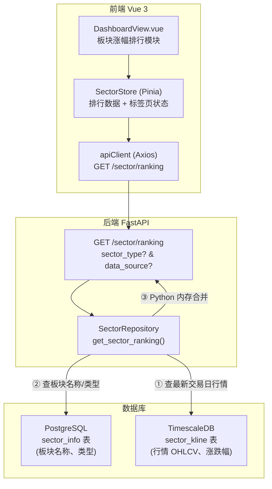
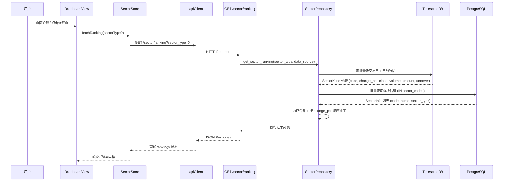

# 技术设计文档：板块涨幅排行展示

## Overview

本功能将 Dashboard 首页的"板块涨幅排行"模块从外部 AkShare API 数据源切换为本地数据库（sector-data-import 已导入的板块数据），并增加板块类型标签页切换、涨跌幅降序排列等功能。

核心设计决策：
- **双查询合并策略**：SectorInfo 存储在 PostgreSQL，SectorKline 存储在 TimescaleDB，两者使用不同的数据库引擎，无法直接 SQL JOIN。设计采用"先查 TS 获取行情 → 再查 PG 获取板块名称 → Python 内存合并"的两步查询方案
- **新增仓储方法**：在现有 `SectorRepository` 中新增 `get_sector_ranking` 方法，封装双查询逻辑
- **新增 API 端点**：在现有 `app/api/v1/sector.py` 中新增 `GET /sector/ranking` 端点
- **新增 Pinia Store**：创建 `frontend/src/stores/sector.ts`，管理板块排行数据和标签页状态
- **改造 DashboardView**：替换现有 AkShare 数据源调用，增加板块类型标签页

## Architecture



### 数据流时序图



## Components and Interfaces

### 1. SectorRepository.get_sector_ranking（仓储层新增方法）

**文件**：`app/services/data_engine/sector_repository.py`

```python
from dataclasses import dataclass

@dataclass
class SectorRankingItem:
    """板块排行单条记录"""
    sector_code: str
    name: str
    sector_type: str
    change_pct: float | None
    close: float | None
    volume: int | None
    amount: float | None
    turnover: float | None

class SectorRepository:
    # ... 现有方法 ...

    async def get_sector_ranking(
        self,
        sector_type: SectorType | None = None,
        data_source: DataSource = DataSource.DC,
        trade_date: date | None = None,
    ) -> list[SectorRankingItem]:
        """查询板块涨跌幅排行。

        实现策略（双查询合并）：
        1. 从 TimescaleDB 查询指定数据源最新交易日的日线行情
        2. 从 PostgreSQL 批量查询对应板块的名称和类型
        3. 在 Python 中合并两个结果集，按 change_pct 降序排序

        Args:
            sector_type: 板块类型筛选（可选）
            data_source: 数据来源，默认 DC
            trade_date: 交易日期（可选，默认最新）

        Returns:
            按涨跌幅降序排列的 SectorRankingItem 列表
        """
        ...

    async def _get_latest_kline_trade_date(
        self,
        data_source: DataSource,
    ) -> date | None:
        """查询 SectorKline 表中指定数据源的最新交易日。"""
        ...
```

**双查询合并算法**：

```python
# 步骤 1：从 TimescaleDB 查询最新交易日行情
async with AsyncSessionTS() as session:
    # 如果未指定 trade_date，先查最新日期
    if trade_date is None:
        trade_date = await self._get_latest_kline_trade_date(data_source)
        if trade_date is None:
            return []

    # 查询该日所有板块的日线行情
    stmt = (
        select(SectorKline)
        .where(
            SectorKline.data_source == data_source.value,
            SectorKline.freq == "1d",
            SectorKline.time >= datetime(trade_date.year, trade_date.month, trade_date.day),
            SectorKline.time <= datetime(trade_date.year, trade_date.month, trade_date.day, 23, 59, 59),
        )
    )
    klines = list((await session.execute(stmt)).scalars().all())

# 步骤 2：从 PostgreSQL 批量查询板块信息
sector_codes = [k.sector_code for k in klines]
async with AsyncSessionPG() as session:
    stmt = select(SectorInfo).where(
        SectorInfo.data_source == data_source.value,
        SectorInfo.sector_code.in_(sector_codes),
    )
    if sector_type is not None:
        stmt = stmt.where(SectorInfo.sector_type == sector_type.value)
    infos = list((await session.execute(stmt)).scalars().all())

# 步骤 3：内存合并 + 排序
info_map = {si.sector_code: si for si in infos}
results = []
for k in klines:
    si = info_map.get(k.sector_code)
    if si is None:
        continue  # 无板块信息则跳过（或被 sector_type 过滤）
    results.append(SectorRankingItem(
        sector_code=k.sector_code,
        name=si.name,
        sector_type=si.sector_type,
        change_pct=float(k.change_pct) if k.change_pct is not None else None,
        close=float(k.close) if k.close is not None else None,
        volume=k.volume,
        amount=float(k.amount) if k.amount is not None else None,
        turnover=float(k.turnover) if k.turnover is not None else None,
    ))

# 按 change_pct 降序排序，None 值排最后
results.sort(key=lambda x: (x.change_pct is not None, x.change_pct or 0), reverse=True)
return results
```

### 2. API 端点（新增排行查询）

**文件**：`app/api/v1/sector.py`（在现有文件中新增）

```python
class SectorRankingResponse(BaseModel):
    """板块排行响应模型"""
    sector_code: str
    name: str
    sector_type: str
    change_pct: float | None = None
    close: float | None = None
    volume: int | None = None
    amount: float | None = None
    turnover: float | None = None


@router.get("/ranking", response_model=list[SectorRankingResponse])
async def get_sector_ranking(
    sector_type: str | None = Query(None, description="板块类型: CONCEPT/INDUSTRY/REGION/STYLE"),
    data_source: str | None = Query(None, description="数据来源: DC/TI/TDX，默认 DC"),
):
    """查询板块涨跌幅排行，按涨跌幅降序排列。"""
    # 参数校验
    st = None
    if sector_type is not None:
        try:
            st = SectorType(sector_type)
        except ValueError:
            raise HTTPException(status_code=422, detail=f"无效的板块类型: {sector_type}")

    ds = DataSource.DC  # 默认 DC
    if data_source is not None:
        try:
            ds = DataSource(data_source)
        except ValueError:
            raise HTTPException(status_code=422, detail=f"无效的数据来源: {data_source}")

    repo = SectorRepository()
    items = await repo.get_sector_ranking(sector_type=st, data_source=ds)
    return [
        SectorRankingResponse(
            sector_code=item.sector_code,
            name=item.name,
            sector_type=item.sector_type,
            change_pct=item.change_pct,
            close=item.close,
            volume=item.volume,
            amount=item.amount,
            turnover=item.turnover,
        )
        for item in items
    ]
```

### 3. SectorStore（前端 Pinia Store）

**文件**：`frontend/src/stores/sector.ts`

```typescript
import { defineStore } from 'pinia'
import { ref } from 'vue'
import { apiClient } from '@/api'

export interface SectorRankingItem {
  sector_code: string
  name: string
  sector_type: string
  change_pct: number | null
  close: number | null
  volume: number | null
  amount: number | null
  turnover: number | null
}

export type SectorTypeFilter = '' | 'CONCEPT' | 'INDUSTRY' | 'REGION' | 'STYLE'
export type DataSourceFilter = '' | 'DC' | 'TI' | 'TDX'

export const useSectorStore = defineStore('sector', () => {
  const rankings = ref<SectorRankingItem[]>([])
  const currentType = ref<SectorTypeFilter>('')
  const currentDataSource = ref<DataSourceFilter>('')
  const loading = ref(false)
  const error = ref('')

  async function fetchRanking(sectorType?: SectorTypeFilter, dataSource?: DataSourceFilter) {
    loading.value = true
    error.value = ''
    try {
      const params: Record<string, string> = {}
      const st = sectorType ?? currentType.value
      const ds = dataSource ?? currentDataSource.value
      if (st) params.sector_type = st
      if (ds) params.data_source = ds
      const res = await apiClient.get<SectorRankingItem[]>('/sector/ranking', { params })
      rankings.value = res.data
    } catch (err) {
      error.value = '获取板块排行数据失败'
    } finally {
      loading.value = false
    }
  }

  function setSectorType(type: SectorTypeFilter) {
    currentType.value = type
    fetchRanking(type || undefined, currentDataSource.value || undefined)
  }

  function setDataSource(source: DataSourceFilter) {
    currentDataSource.value = source
    fetchRanking(currentType.value || undefined, source || undefined)
  }

  return { rankings, currentType, currentDataSource, loading, error, fetchRanking, setSectorType, setDataSource }
})
```

### 4. DashboardView 板块排行模块改造

**文件**：`frontend/src/views/DashboardView.vue`（修改现有文件）

主要变更：
- 移除 `SectorData` 接口、`sectors` ref、`loadSectors` 函数
- 引入 `useSectorStore`
- 在板块区域增加标签页导航（全部/行业/概念/地区/风格）
- 表格列更新为：排名序号、板块名称、涨跌幅、收盘价、成交额、换手率

```vue
<!-- 板块类型标签页 -->
<div class="sector-tabs" role="tablist" aria-label="板块类型切换">
  <button
    v-for="tab in sectorTabs"
    :key="tab.key"
    role="tab"
    :aria-selected="sectorStore.currentType === tab.key"
    :class="['tab-btn', { active: sectorStore.currentType === tab.key }]"
    @click="sectorStore.setSectorType(tab.key)"
  >
    {{ tab.label }}
  </button>
</div>

<!-- 板块排行表格 -->
<table class="data-table" aria-label="板块涨幅排行表">
  <thead>
    <tr>
      <th scope="col">排名</th>
      <th scope="col">板块名称</th>
      <th scope="col">涨跌幅</th>
      <th scope="col">收盘价</th>
      <th scope="col">成交额(亿)</th>
      <th scope="col">换手率</th>
    </tr>
  </thead>
  <tbody>
    <tr v-if="sectorStore.loading">
      <td colspan="6" class="loading-text">加载板块数据中...</td>
    </tr>
    <tr v-else-if="sectorStore.error">
      <td colspan="6" class="error-banner-inline">
        {{ sectorStore.error }}
        <button class="btn retry-btn" @click="sectorStore.fetchRanking()">重试</button>
      </td>
    </tr>
    <template v-else>
      <tr v-for="(s, idx) in sectorStore.rankings" :key="s.sector_code">
        <td>{{ idx + 1 }}</td>
        <td>{{ s.name }}</td>
        <td :class="(s.change_pct ?? 0) >= 0 ? 'up' : 'down'">
          {{ s.change_pct != null ? ((s.change_pct >= 0 ? '+' : '') + s.change_pct.toFixed(2) + '%') : '--' }}
        </td>
        <td>{{ s.close != null ? s.close.toFixed(2) : '--' }}</td>
        <td>{{ s.amount != null ? (s.amount / 1e8).toFixed(2) : '--' }}</td>
        <td>{{ s.turnover != null ? s.turnover.toFixed(2) + '%' : '--' }}</td>
      </tr>
      <tr v-if="sectorStore.rankings.length === 0">
        <td colspan="6" class="empty">暂无数据</td>
      </tr>
    </template>
  </tbody>
</table>
```

### 组件交互关系

| 组件 | 职责 | 依赖 |
|------|------|------|
| `SectorRepository.get_sector_ranking` | 双查询合并，返回排行数据 | AsyncSessionTS, AsyncSessionPG |
| `GET /sector/ranking` | 参数校验，调用仓储层，序列化响应 | SectorRepository |
| `GET /sector/{code}/kline` | 查询板块K线数据（已有端点） | SectorRepository |
| `SectorStore` | 管理排行数据、标签页状态、数据源状态、展开K线状态 | apiClient |
| `DashboardView` 板块模块 | 渲染标签页、数据源选择器、排行表格、展开K线图 | SectorStore, ECharts |

### 5. 板块K线图展开功能

**交互流程**：
1. 用户点击排行表格中某行的板块名称
2. SectorStore 设置 `expandedSectorCode` 为该板块代码
3. 如果该板块已展开，则收起（设为 `null`）
4. 如果展开新板块，调用 `GET /sector/{code}/kline` 获取近一年日K线数据
5. 在该行下方插入一个 `<tr>` 包含 `colspan=6` 的K线图容器
6. 使用 ECharts 渲染蜡烛图 + 成交量柱状图，复用现有股票K线图的样式配置

**SectorStore 新增状态和方法**：

```typescript
// 展开K线相关状态
const expandedSectorCode = ref<string | null>(null)
const expandedKlineData = ref<SectorKlineBar[]>([])
const expandedKlineLoading = ref(false)
const expandedKlineError = ref('')

interface SectorKlineBar {
  time: string
  open: number | null
  high: number | null
  low: number | null
  close: number | null
  volume: number | null
}

async function toggleSectorKline(sectorCode: string, dataSource?: string) {
  // 点击同一板块 → 收起
  if (expandedSectorCode.value === sectorCode) {
    expandedSectorCode.value = null
    expandedKlineData.value = []
    return
  }
  // 展开新板块
  expandedSectorCode.value = sectorCode
  expandedKlineLoading.value = true
  expandedKlineError.value = ''
  expandedKlineData.value = []
  try {
    const today = new Date()
    const oneYearAgo = new Date(today)
    oneYearAgo.setFullYear(today.getFullYear() - 1)
    const params: Record<string, string> = {
      data_source: dataSource || 'DC',
      freq: '1d',
      start: oneYearAgo.toISOString().slice(0, 10),
      end: today.toISOString().slice(0, 10),
    }
    const res = await apiClient.get<SectorKlineBar[]>(
      `/sector/${sectorCode}/kline`, { params }
    )
    expandedKlineData.value = res.data
  } catch {
    expandedKlineError.value = '获取板块K线数据失败'
  } finally {
    expandedKlineLoading.value = false
  }
}
```

**DashboardView 模板变更**：

```vue
<template v-else>
  <template v-for="(s, idx) in sectorStore.rankings" :key="s.sector_code">
    <tr>
      <td>{{ idx + 1 }}</td>
      <td class="sector-name-cell" @click="sectorStore.toggleSectorKline(s.sector_code, resolvedDataSource(s))">
        {{ s.name }}
      </td>
      <!-- ... 其他列 ... -->
    </tr>
    <!-- 展开的K线图行 -->
    <tr v-if="sectorStore.expandedSectorCode === s.sector_code" class="kline-expand-row">
      <td colspan="6">
        <div v-if="sectorStore.expandedKlineLoading" class="kline-loading">加载K线数据中...</div>
        <div v-else-if="sectorStore.expandedKlineError" class="kline-error">
          {{ sectorStore.expandedKlineError }}
          <button class="btn retry-btn" @click="sectorStore.toggleSectorKline(s.sector_code, resolvedDataSource(s))">重试</button>
        </div>
        <div v-else :ref="el => setSectorKlineRef(s.sector_code, el)" class="sector-kline-chart"></div>
      </td>
    </tr>
  </template>
</template>
```

**ECharts 渲染**：复用现有 `renderKline` 的配置模式（蜡烛图 + 成交量双轴），红涨绿跌配色。图表高度 300px，在 `expandedKlineData` 变化时通过 `watch` 或 `nextTick` 初始化。

## Data Models

### 新增数据类：SectorRankingItem

定义在 `app/services/data_engine/sector_repository.py` 中，作为仓储层返回的数据传输对象：

```python
@dataclass
class SectorRankingItem:
    """板块排行单条记录（仓储层输出）"""
    sector_code: str       # 板块代码
    name: str              # 板块名称（来自 SectorInfo）
    sector_type: str       # 板块类型（来自 SectorInfo）
    change_pct: float | None   # 涨跌幅 %（来自 SectorKline）
    close: float | None        # 收盘价（来自 SectorKline）
    volume: int | None         # 成交量（来自 SectorKline）
    amount: float | None       # 成交额（来自 SectorKline）
    turnover: float | None     # 换手率（来自 SectorKline）
```

### 新增 Pydantic 模型：SectorRankingResponse

定义在 `app/api/v1/sector.py` 中，作为 API 响应模型：

```python
class SectorRankingResponse(BaseModel):
    sector_code: str
    name: str
    sector_type: str
    change_pct: float | None = None
    close: float | None = None
    volume: int | None = None
    amount: float | None = None
    turnover: float | None = None
```

### 前端 TypeScript 接口

定义在 `frontend/src/stores/sector.ts` 中：

```typescript
interface SectorRankingItem {
  sector_code: string
  name: string
  sector_type: string
  change_pct: number | null
  close: number | null
  volume: number | null
  amount: number | null
  turnover: number | null
}

type SectorTypeFilter = '' | 'CONCEPT' | 'INDUSTRY' | 'REGION' | 'STYLE'
```

### 现有模型（不修改）

- `SectorInfo`（PGBase, PostgreSQL）：板块元数据，提供 name 和 sector_type
- `SectorKline`（TSBase, TimescaleDB）：板块行情，提供 change_pct、close、volume、amount、turnover
- `DataSource` / `SectorType` 枚举：复用现有定义


## Correctness Properties

*A property is a characteristic or behavior that should hold true across all valid executions of a system — essentially, a formal statement about what the system should do. Properties serve as the bridge between human-readable specifications and machine-verifiable correctness guarantees.*

### Property 1: Dual-query merge correctness

*For any* set of SectorKline records (in TimescaleDB) and SectorInfo records (in PostgreSQL) sharing the same data_source, calling `get_sector_ranking` SHALL return items where each item's `name` and `sector_type` match the corresponding SectorInfo record, and each item's `change_pct`, `close`, `volume`, `amount`, `turnover` match the corresponding SectorKline record. Only sector_codes present in both tables SHALL appear in the result.

**Validates: Requirements 1.2, 1.3, 2.3**

### Property 2: Ranking sort order invariant

*For any* list of SectorRankingItem results returned by `get_sector_ranking`, the items SHALL be sorted by `change_pct` in descending order. Items with non-null `change_pct` SHALL appear before items with null `change_pct`. Among non-null items, for any adjacent pair (item[i], item[i+1]), `item[i].change_pct >= item[i+1].change_pct` SHALL hold.

**Validates: Requirements 1.4, 2.4**

### Property 3: Sector type filtering correctness

*For any* set of sector data with mixed sector_types, when `get_sector_ranking` is called with a specific `sector_type` filter, all returned items SHALL have `sector_type` equal to the filter value. When called without a `sector_type` filter, the result SHALL contain items from all sector_types present in the data.

**Validates: Requirements 1.5, 1.6**

### Property 4: Invalid parameter rejection

*For any* string that is not a valid SectorType value (not in {CONCEPT, INDUSTRY, REGION, STYLE}), the `GET /sector/ranking` endpoint SHALL return HTTP 422. *For any* string that is not a valid DataSource value (not in {DC, TI, TDX}), the endpoint SHALL also return HTTP 422. All valid enum values SHALL be accepted without error.

**Validates: Requirements 1.9**

### Property 5: Ranking item display formatting

*For any* SectorRankingItem with a non-null `change_pct`, the formatted display SHALL include a "+" prefix when `change_pct >= 0`, no prefix when negative, two decimal places, and a "%" suffix. The CSS class SHALL be "up" when `change_pct >= 0` and "down" when negative. *For any* item with null `close`, `amount`, or `turnover`, the display SHALL show "--". *For any* non-null `amount`, the display SHALL show `(amount / 1e8).toFixed(2)`. *For any* non-null `turnover`, the display SHALL show `turnover.toFixed(2) + '%'`.

**Validates: Requirements 4.2, 4.3, 4.4, 4.5, 4.6**

### Property 6: Sector kline expansion toggle correctness

*For any* sector_code in the ranking list, clicking the sector name once SHALL set `expandedSectorCode` to that code and trigger a kline data fetch. Clicking the same sector name again SHALL set `expandedSectorCode` to null (collapse). Clicking a different sector name SHALL set `expandedSectorCode` to the new code (switch). At any point, at most one sector SHALL be expanded.

**Validates: Requirements 8.1, 8.5, 8.6**

## Error Handling

### 后端错误处理

| 错误场景 | 处理策略 | HTTP 状态码 |
|---------|---------|------------|
| 无效的 `sector_type` 参数 | 返回描述性错误信息 | 422 |
| 无效的 `data_source` 参数 | 返回描述性错误信息 | 422 |
| SectorKline 表无数据（最新交易日为空） | 返回空列表 | 200 |
| SectorInfo 表中无匹配的板块信息 | 跳过该板块，不包含在结果中 | 200 |
| TimescaleDB 连接失败 | 抛出 500 Internal Server Error | 500 |
| PostgreSQL 连接失败 | 抛出 500 Internal Server Error | 500 |

### 前端错误处理

| 错误场景 | 处理策略 |
|---------|---------|
| API 请求失败（网络错误/超时） | 设置 error 状态，保留上一次成功数据，展示错误提示和"重试"按钮 |
| API 返回空列表 | 正常渲染，表格显示"暂无数据" |
| API 返回 422（参数错误） | 由 Axios 拦截器统一处理，展示错误信息 |
| 数据字段为 null | 显示"--"占位符 |
| 板块K线数据加载失败 | 在展开面板中显示错误提示和"重试"按钮 |
| 板块K线数据为空 | 展开面板显示空图表 |

### 降级策略

- 板块排行模块的加载失败不影响 Dashboard 其他模块（大盘指数、K线图等）的正常展示
- 标签页切换失败时保留当前已展示的数据，不清空表格

## Testing Strategy

### 测试框架

- **后端单元测试**：pytest + pytest-asyncio
- **后端属性测试**：Hypothesis（Python），最少 100 次迭代
- **前端单元测试**：Vitest + @vue/test-utils
- **前端属性测试**：fast-check，最少 100 次迭代

### 属性测试（Property-Based Tests）

#### 后端属性测试

**测试文件**：`tests/properties/test_sector_ranking_properties.py`

使用 Hypothesis 库实现，每个属性测试对应设计文档中的一个 Correctness Property。

**配置要求**：
- 每个属性测试最少 100 次迭代（`@settings(max_examples=100)`）
- 每个测试用注释标注对应的设计属性
- 标注格式：`# Feature: sector-ranking-display, Property {N}: {title}`

| Property | 测试内容 | 生成器策略 |
|----------|---------|-----------|
| P1: Dual-query merge correctness | 生成随机 SectorKline 和 SectorInfo 数据，验证合并结果字段匹配 | 自定义 `sector_kline_strategy()` + `sector_info_strategy()`，mock 数据库 session |
| P2: Ranking sort order invariant | 生成随机 change_pct 值列表（含 None），验证排序正确性 | `st.lists(st.one_of(st.none(), st.floats(allow_nan=False)))` |
| P3: Sector type filtering correctness | 生成混合类型的板块数据，验证过滤结果 | 自定义 strategy 生成多类型板块 |
| P4: Invalid parameter rejection | 生成随机非枚举字符串，验证 422 响应 | `st.text().filter(lambda s: s not in valid_values)` |

#### 前端属性测试

**测试文件**：`frontend/src/stores/__tests__/sector.property.test.ts`

使用 fast-check 库实现。

| Property | 测试内容 | 生成器策略 |
|----------|---------|-----------|
| P5: Ranking item display formatting | 生成随机 SectorRankingItem，验证格式化输出 | `fc.record({ change_pct: fc.oneof(fc.constant(null), fc.float()), ... })` |

### 单元测试

#### 后端单元测试

**测试文件**：`tests/services/test_sector_ranking.py`

| 测试范围 | 测试内容 |
|---------|---------|
| get_sector_ranking 基本功能 | 正常数据的查询和合并 |
| 空数据处理 | SectorKline 无数据时返回空列表 |
| 默认数据源 | 未指定 data_source 时使用 DC |
| 最新交易日 | 未指定 trade_date 时自动使用最新日期 |
| 部分匹配 | SectorKline 有记录但 SectorInfo 无对应记录时跳过 |

**测试文件**：`tests/api/test_sector_ranking_api.py`

| 测试范围 | 测试内容 |
|---------|---------|
| GET /sector/ranking 正常响应 | 验证响应格式和字段 |
| sector_type 筛选 | 验证按类型筛选 |
| data_source 默认值 | 验证默认使用 DC |
| 无效参数 422 | 验证无效枚举值返回 422 |
| 空数据 200 | 验证无数据时返回空列表 |

#### 前端单元测试

**测试文件**：`frontend/src/stores/__tests__/sector.test.ts`

| 测试范围 | 测试内容 |
|---------|---------|
| SectorStore 初始状态 | 验证初始值（空列表、空类型、非加载、无错误） |
| fetchRanking 成功 | 验证数据更新 |
| fetchRanking 失败 | 验证错误状态设置和数据保留 |
| setSectorType | 验证类型更新和 fetchRanking 触发 |

**测试文件**：`frontend/src/views/__tests__/DashboardSectorRanking.test.ts`

| 测试范围 | 测试内容 |
|---------|---------|
| 标签页渲染 | 验证 5 个标签页按钮存在 |
| 默认选中 | 验证"全部"标签页默认选中 |
| 标签页切换 | 验证点击标签页触发 setSectorType |
| 表格列 | 验证 6 列表头 |
| 加载状态 | 验证加载提示文字 |
| 错误状态 | 验证错误提示和重试按钮 |
| 空数据 | 验证"暂无数据"提示 |
| ARIA 属性 | 验证 role="tab"、aria-selected、aria-label |
| 旧代码移除 | 验证 loadSectors 和 SectorData 不再存在 |
