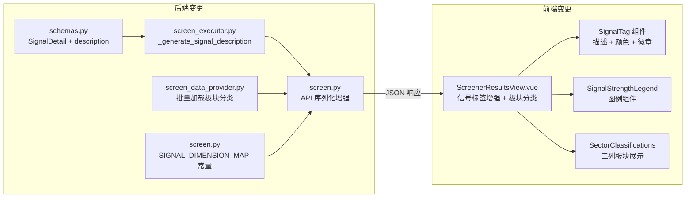
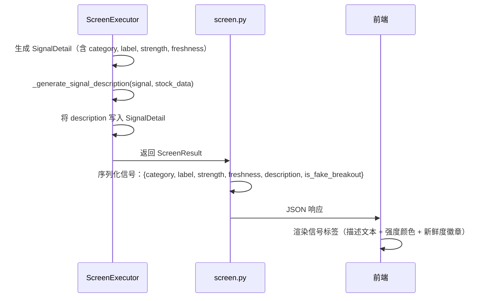
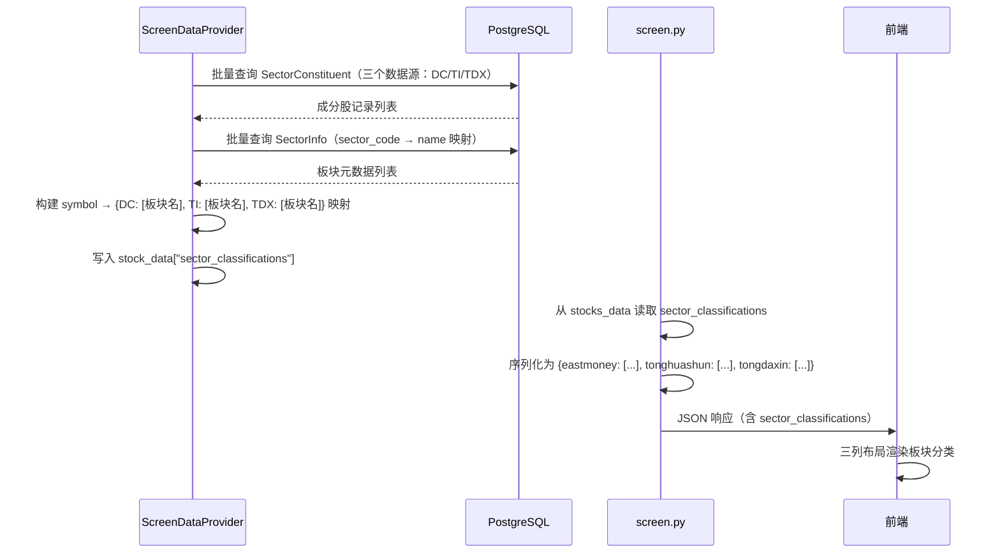

# 设计文档：信号详情增强（Signal Detail Enhancement）

## 概述

本设计文档描述对选股信号详情的全面增强方案，涵盖后端数据模型扩展、API 响应增强、因子条件描述文本生成、前端信号标签的视觉增强，以及选股结果的板块分类展示。

### 目标

1. **后端**：为 `SignalDetail` 添加 `description` 字段，在选股执行时为每种信号类别生成人类可读的因子条件描述文本；将 `strength`、`freshness`、`description` 三个字段序列化到 API 响应中
2. **前端**：增强信号标签展示（描述文本、强度颜色编码、新鲜度徽章、强度图例），提升用户对信号来源和强度的直观理解
3. **板块分类**：在选股结果中展示每只股票在东方财富、同花顺、通达信三个数据源的所属板块，支持跨数据源对比（需求 9）

### 设计决策与理由

| 决策 | 理由 |
|------|------|
| `description` 字段类型为 `str`，默认空字符串 | 保持向后兼容，旧数据不会因缺少字段而报错 |
| 描述文本在 `ScreenExecutor` 中生成，使用纯函数 `_generate_signal_description` | 与现有 `_compute_signal_strength` 模式一致，便于属性测试 |
| 描述文本生成依赖 `stock_data` 因子字典 | 因子字典已包含所有量化数值（ma_trend 评分、RSI 值、量比等），无需额外查询 |
| API 序列化直接在 `screen.py` 的响应构建处添加字段 | 最小改动原则，不引入新的序列化层 |
| 前端信号标签优先显示 `description`，缺失时回退到 `label` | 向后兼容旧缓存数据 |
| 强度颜色使用 CSS 类而非内联样式 | 与现有 `SIGNAL_CATEGORY_CLASS` 模式一致，便于主题定制 |
| 板块分类数据在 `ScreenDataProvider` 中批量加载 | 复用现有 `SectorConstituent` + `SectorInfo` 模型，一次查询三个数据源，避免 N+1 查询 |
| 板块分类使用 `sector_classifications` 字段挂载在 API 响应的 item 级别 | 板块归属是股票级别属性，不属于 `SignalDetail`；放在 item 级别语义更清晰 |
| 前端板块分类使用三列布局 | 三个数据源并排对比是核心需求，三列布局最直观 |
| 板块数据加载失败时降级为空对象 | 板块分类是辅助信息，不应阻断选股主流程 |
| 板块分类区域嵌套在 `detail-signals` 内部而非作为独立 flex 子项 | 展开详情面板使用水平 flex 布局（信号区 + K线图表区），板块分类若作为独立 flex 子项会挤占K线图表水平空间导致图表无法正常显示；嵌套在信号区内部可垂直堆叠，不影响图表布局（需求 9.8） |
| `SIGNAL_DIMENSION_MAP` 使用后端静态常量映射 `SignalCategory → dimension` 字符串 | 映射关系固定且不频繁变化，静态常量比数据库配置更简单可靠；前端通过 API 响应中的 `dimension` 字段获取，无需前端维护映射副本（需求 10） |
| `dimension` 字段在 API 序列化时从映射常量派生，不存储在 `SignalDetail` dataclass 中 | `dimension` 是 `category` 的派生属性，存储会引入数据冗余；在序列化时实时查表即可，性能开销可忽略（需求 10） |
| SECTOR_STRONG 描述文本包含具体板块名称 | 用户需要明确知道因哪个板块被选中，板块名称已在 `stock_data["sector_name"]` 中可用（需求 10.7） |
| 前端按维度分组顺序为 技术面 → 板块面 → 资金面 → 基本面 | 用户指定的优先级顺序，技术面信号最常见排首位，板块面次之（需求 10.4） |

## 架构

### 变更范围



### 数据流



### 板块分类数据流（需求 9）



## 组件与接口

### 1. 后端：SignalDetail 数据模型扩展（schemas.py）

在 `SignalDetail` dataclass 中添加 `description` 字段：

```python
@dataclass
class SignalDetail:
    """单条信号详情（需求 21.15）"""
    category: SignalCategory
    label: str
    is_fake_breakout: bool = False
    breakout_type: str | None = None
    strength: SignalStrength = SignalStrength.MEDIUM
    freshness: SignalFreshness = SignalFreshness.NEW
    description: str = ""  # 人类可读的因子条件描述文本
```

### 2. 后端：描述文本生成（screen_executor.py）

新增静态纯函数 `_generate_signal_description`，根据信号类别和 `stock_data` 因子字典生成描述文本：

```python
@staticmethod
def _generate_signal_description(
    signal: SignalDetail,
    stock_data: dict[str, Any],
) -> str:
    """
    根据信号类别和上下文数据生成人类可读的因子条件描述文本（纯函数，用于属性测试）。

    Args:
        signal: 信号详情
        stock_data: 股票因子字典

    Returns:
        描述文本字符串
    """
```

各信号类别的描述模板：

| SignalCategory | 描述模板 | 数据来源 |
|---|---|---|
| `MA_TREND` | `"均线多头排列, 趋势评分 {score}"` | `stock_data["ma_trend"]` |
| `MACD` | `"MACD 金叉, DIF 上穿 DEA"` | 固定文本（信号已确认触发） |
| `BOLL` | `"价格突破布林带中轨, 接近上轨"` | 固定文本 |
| `RSI` | `"RSI(14) = {value}, 处于强势区间"` | `stock_data` 中 RSI 相关数据 |
| `DMA` | `"DMA 上穿 AMA, DMA={value}"` | `stock_data["dma"]["dma"]` |
| `BREAKOUT` | `"{type}突破, 量比 {ratio} 倍"` | `stock_data["breakout_list"]` 或 `stock_data["breakout"]` |
| `CAPITAL_INFLOW` | `"主力资金净流入"` | 固定文本 |
| `LARGE_ORDER` | `"大单成交活跃"` | 固定文本 |
| `MA_SUPPORT` | `"回调至均线获支撑"` | 固定文本 |
| `SECTOR_STRONG` | `"所属板块涨幅排名前列"` | `stock_data["sector_name"]` |

### 3. 后端：API 序列化增强（screen.py）

修改 `run_screen` 和缓存读取逻辑中的信号序列化，添加 `strength`、`freshness`、`description` 字段：

```python
# 当前序列化（screen.py run_screen 函数中）
"signals": [
    {"category": s.category.value, "label": s.label, "is_fake_breakout": s.is_fake_breakout}
    for s in item.signals
]

# 增强后
"signals": [
    {
        "category": s.category.value,
        "label": s.label,
        "is_fake_breakout": s.is_fake_breakout,
        "strength": s.strength.value,
        "freshness": s.freshness.value,
        "description": s.description,
    }
    for s in item.signals
]
```

### 4. 前端：SignalDetail 类型扩展

更新 `SignalDetail` TypeScript 接口：

```typescript
interface SignalDetail {
  category: SignalCategory
  label: string
  is_fake_breakout: boolean
  strength?: 'STRONG' | 'MEDIUM' | 'WEAK'
  freshness?: 'NEW' | 'CONTINUING'
  description?: string
}
```

所有新字段使用可选类型（`?`），确保向后兼容旧缓存数据。

### 5. 前端：信号标签增强

信号标签组件增强内容：

- **描述文本**：优先显示 `description`，缺失时回退到 `label`
- **强度颜色编码**：根据 `strength` 值应用不同 CSS 类（`sig-strong`、`sig-medium`、`sig-weak`）
- **强度文字标注**：在标签内显示"强"/"中"/"弱"
- **新鲜度徽章**：`freshness === 'NEW'` 时显示"新"徽章

### 6. 前端：信号强度图例组件

新增 `SignalStrengthLegend` 组件，在信号详情区域上方展示：

```
🔴 强：多个因子共振确认  🟡 中：部分因子确认  ⚪ 弱：单一因子触发
```

### 7. 前端：信号摘要增强

修改 `signalSummary` 函数，在信号数量旁展示强信号数量：

```typescript
function signalSummary(signals: SignalDetail[]): string {
  if (!signals.length) return '无信号'
  const strongCount = signals.filter(s => s.strength === 'STRONG').length
  const base = `${signals.length} 个信号`
  return strongCount > 0 ? `${base}（${strongCount} 强）` : base
}
```

### 8. 后端：板块分类数据加载（screen_data_provider.py）— 需求 9

在 `ScreenDataProvider.load_screen_data()` 中新增板块分类数据加载步骤，在现有板块强势数据加载之后执行。

新增方法 `_load_sector_classifications`：

```python
async def _load_sector_classifications(
    self,
    pg_session: AsyncSession,
    symbols: list[str],
    trade_date: date | None = None,
) -> dict[str, dict[str, list[str]]]:
    """
    批量加载所有股票在三个数据源（DC/TI/TDX）的板块分类信息。

    Args:
        pg_session: PostgreSQL 异步会话
        symbols: 股票代码列表
        trade_date: 交易日期（可选，默认最新）

    Returns:
        {symbol: {"DC": [板块名, ...], "TI": [...], "TDX": [...]}} 映射
    """
```

**实现要点**：

1. **批量查询**：一次查询 `SectorConstituent` 表获取所有目标股票在三个数据源（DC、TI、TDX）的成分股记录，避免 N+1 查询
2. **板块名称解析**：批量查询 `SectorInfo` 表，构建 `(sector_code, data_source) → name` 映射，将 `sector_code` 转换为人类可读的板块名称
3. **交易日期**：如果未指定 `trade_date`，查询 `SectorConstituent` 表中最新的交易日
4. **结果结构**：返回 `{symbol: {"DC": [name1, name2], "TI": [name3], "TDX": []}}` 格式

**查询策略**：

```python
# 1. 查询三个数据源的成分股记录
stmt = (
    select(SectorConstituent)
    .where(
        SectorConstituent.symbol.in_(symbols),
        SectorConstituent.trade_date == trade_date,
        SectorConstituent.data_source.in_(["DC", "TI", "TDX"]),
    )
)

# 2. 查询板块名称映射
sector_codes = {(r.sector_code, r.data_source) for r in constituents}
info_stmt = (
    select(SectorInfo.sector_code, SectorInfo.data_source, SectorInfo.name)
    .where(
        tuple_(SectorInfo.sector_code, SectorInfo.data_source).in_(sector_codes)
    )
)
```

**集成位置**：在 `load_screen_data()` 方法的步骤 6（板块强势数据加载）之后，新增步骤 7：

```python
# 7. 加载板块分类数据（需求 9）
try:
    sector_classifications = await self._load_sector_classifications(
        pg_session=self._pg_session,
        symbols=list(result.keys()),
    )
    for sym, fd in result.items():
        fd["sector_classifications"] = sector_classifications.get(
            sym, {"DC": [], "TI": [], "TDX": []}
        )
except Exception:
    logger.warning("加载板块分类数据失败，降级为空分类", exc_info=True)
    for fd in result.values():
        fd.setdefault("sector_classifications", {"DC": [], "TI": [], "TDX": []})
```

### 9. 后端：API 序列化板块分类（screen.py）— 需求 9

在 `run_screen` 函数的响应构建中，为每个 item 添加 `sector_classifications` 字段：

```python
# 数据源代码 → API 字段名映射
_SOURCE_TO_API_KEY = {"DC": "eastmoney", "TI": "tonghuashun", "TDX": "tongdaxin"}

# 在 item 序列化中添加
{
    "symbol": item.symbol,
    "name": stocks_data.get(item.symbol, {}).get("name", item.symbol),
    # ... 现有字段 ...
    "sector_classifications": {
        _SOURCE_TO_API_KEY[src]: names
        for src, names in stocks_data.get(item.symbol, {})
            .get("sector_classifications", {"DC": [], "TI": [], "TDX": []})
            .items()
        if src in _SOURCE_TO_API_KEY
    },
}
```

**API 响应 JSON 结构（单条选股结果中的 sector_classifications）**：

```json
{
  "sector_classifications": {
    "eastmoney": ["半导体", "芯片概念", "华为概念"],
    "tonghuashun": ["半导体及元件", "芯片"],
    "tongdaxin": ["半导体"]
  }
}
```

### 10. 前端：板块分类类型定义与数据接口 — 需求 9

在 `ScreenerResultsView.vue` 中扩展类型定义：

```typescript
interface SectorClassifications {
  eastmoney: string[]
  tonghuashun: string[]
  tongdaxin: string[]
}

interface ScreenResultRow {
  // ... 现有字段 ...
  sector_classifications?: SectorClassifications
}
```

### 11. 前端：板块分类三列布局展示 — 需求 9

在展开详情行（`detail-row`）的 `detail-panel` 中，板块分类区域**嵌套在信号详情区域（`detail-signals`）内部**，位于信号标签列表下方。这样板块分类与信号标签垂直堆叠，不会作为独立 flex 子项挤占K线图表的水平空间（需求 9.8）：

```html
<div class="detail-signals">
  <!-- 信号标签区域 -->
  <div class="detail-header">触发信号详情</div>
  <div class="signal-tags">...</div>

  <!-- 板块分类展示（需求 9）—— 嵌套在 detail-signals 内部 -->
  <div class="sector-classifications" v-if="row.sector_classifications">
    <div class="detail-header">板块分类</div>
    <div class="sector-columns">
      <div class="sector-column" v-for="source in sectorSources" :key="source.key">
        <div class="sector-source-title">{{ source.label }}</div>
        <div v-if="(row.sector_classifications[source.key] ?? []).length > 0" class="sector-tags">
          <span
            v-for="name in row.sector_classifications[source.key]"
            :key="name"
            class="sector-tag"
          >{{ name }}</span>
        </div>
        <div v-else class="sector-empty">暂无数据</div>
      </div>
    </div>
  </div>
</div>
<!-- K线图表区域紧随其后，不受板块分类影响 -->
<div class="detail-charts-container">...</div>
```

**数据源常量**：

```typescript
const sectorSources = [
  { key: 'eastmoney' as const, label: '东方财富' },
  { key: 'tonghuashun' as const, label: '同花顺' },
  { key: 'tongdaxin' as const, label: '通达信' },
]
```

**CSS 样式**：

```css
/* ─── 板块分类 ──────────────────────────────────────────────────────────────── */
.sector-classifications {
  margin-top: 14px;
  padding-top: 14px;
  border-top: 1px solid #21262d;
}

.sector-columns {
  display: flex;
  gap: 16px;
}

.sector-column {
  flex: 1;
  min-width: 0;
}

.sector-source-title {
  font-size: 12px;
  font-weight: 600;
  color: #8b949e;
  margin-bottom: 8px;
}

.sector-tags {
  display: flex;
  flex-wrap: wrap;
  gap: 6px;
}

.sector-tag {
  display: inline-block;
  padding: 2px 8px;
  border-radius: 4px;
  font-size: 12px;
  background: #1c2128;
  color: #e6edf3;
  border: 1px solid #30363d;
}

.sector-empty {
  font-size: 12px;
  color: #484f58;
}
```

### 12. 后端：信号维度映射常量（screen.py）— 需求 10

在 `app/api/v1/screen.py` 模块顶部定义 `_SIGNAL_DIMENSION_MAP` 常量：

```python
# 信号维度分类映射：SignalCategory.value → 维度中文名（需求 10）
_SIGNAL_DIMENSION_MAP: dict[str, str] = {
    "MA_TREND": "技术面",
    "MACD": "技术面",
    "BOLL": "技术面",
    "RSI": "技术面",
    "DMA": "技术面",
    "BREAKOUT": "技术面",
    "MA_SUPPORT": "技术面",
    "CAPITAL_INFLOW": "资金面",
    "LARGE_ORDER": "资金面",
    "SECTOR_STRONG": "板块面",
}
```

### 13. 后端：API 序列化添加 dimension 字段（screen.py）— 需求 10

修改 `run_screen` 函数中的信号序列化逻辑，在每条信号的序列化字典中添加 `dimension` 字段：

```python
"signals": [
    {
        "category": s.category.value,
        "label": s.label,
        "is_fake_breakout": s.is_fake_breakout,
        "strength": s.strength.value,
        "freshness": s.freshness.value,
        "description": s.description,
        "dimension": _SIGNAL_DIMENSION_MAP.get(s.category.value, "其他"),
    }
    for s in item.signals
]
```

`dimension` 字段通过 `_SIGNAL_DIMENSION_MAP.get()` 实时派生，未知分类默认为 `"其他"`。

### 14. 后端：更新 SECTOR_STRONG 描述文本包含板块名称 — 需求 10.7

修改 `ScreenExecutor._generate_signal_description()` 中 `SECTOR_STRONG` 分支，从 `stock_data["sector_name"]` 读取板块名称并嵌入描述文本：

```python
# 板块强势信号（需求 10.7：包含具体板块名称）
if category == SignalCategory.SECTOR_STRONG:
    sector_name = stock_data.get("sector_name")
    if sector_name:
        return f"所属板块【{sector_name}】涨幅排名前列"
    return "所属板块涨幅排名前列"
```

### 15. 前端：信号维度分组展示 — 需求 10

修改 `ScreenerResultsView.vue` 中信号标签区域，将信号按 `dimension` 字段分组展示：

#### 类型扩展

```typescript
interface SignalDetail {
  category: SignalCategory
  label: string
  is_fake_breakout: boolean
  strength?: 'STRONG' | 'MEDIUM' | 'WEAK'
  freshness?: 'NEW' | 'CONTINUING'
  description?: string
  dimension?: string  // 新增：信号维度（"技术面"/"资金面"/"基本面"/"板块面"）
}
```

#### 维度分组常量与逻辑

```typescript
// 维度展示顺序（需求 10.4）
const DIMENSION_ORDER = ['技术面', '板块面', '资金面', '基本面'] as const

// 按维度分组信号
function groupSignalsByDimension(signals: SignalDetail[]): { dimension: string; signals: SignalDetail[] }[] {
  const groups = new Map<string, SignalDetail[]>()
  for (const sig of signals) {
    const dim = sig.dimension ?? '其他'
    if (!groups.has(dim)) groups.set(dim, [])
    groups.get(dim)!.push(sig)
  }
  // 按固定顺序排列，跳过无信号的维度
  const ordered: { dimension: string; signals: SignalDetail[] }[] = []
  for (const dim of DIMENSION_ORDER) {
    const sigs = groups.get(dim)
    if (sigs && sigs.length > 0) {
      ordered.push({ dimension: dim, signals: sigs })
      groups.delete(dim)
    }
  }
  // 追加不在预定义顺序中的维度（如"其他"）
  for (const [dim, sigs] of groups) {
    if (sigs.length > 0) ordered.push({ dimension: dim, signals: sigs })
  }
  return ordered
}
```

#### 模板结构

```html
<div class="signal-tags">
  <template v-for="group in groupSignalsByDimension(row.signals)" :key="group.dimension">
    <div class="dimension-header">{{ group.dimension }}</div>
    <span
      v-for="(sig, idx) in group.signals"
      :key="idx"
      :class="['signal-tag', SIGNAL_CATEGORY_CLASS[sig.category], signalStrengthClass(sig.strength)]"
    >
      {{ SIGNAL_CATEGORY_LABEL[sig.category] }}：{{ sig.description || sig.label }}
      <span class="strength-label">{{ signalStrengthText(sig.strength) }}</span>
      <span v-if="sig.freshness === 'NEW'" class="freshness-badge">新</span>
      <span v-if="sig.is_fake_breakout" class="fake-tag">假突破</span>
    </span>
  </template>
</div>
```

#### CSS 样式

```css
/* ─── 维度分组标题（需求 10）──────────────────────────────────────────────── */
.dimension-header {
  width: 100%;
  font-size: 12px;
  font-weight: 600;
  color: #8b949e;
  margin-top: 8px;
  margin-bottom: 4px;
  padding-bottom: 2px;
  border-bottom: 1px solid #21262d;
}

.dimension-header:first-child {
  margin-top: 0;
}
```

## 数据模型

### SignalDetail 字段完整定义

| 字段 | 类型 | 默认值 | 说明 |
|------|------|--------|------|
| `category` | `SignalCategory` | （必填） | 信号分类枚举 |
| `label` | `str` | （必填） | 信号标签（因子名称） |
| `is_fake_breakout` | `bool` | `False` | 是否为假突破 |
| `breakout_type` | `str \| None` | `None` | 突破类型标识 |
| `strength` | `SignalStrength` | `MEDIUM` | 信号强度等级 |
| `freshness` | `SignalFreshness` | `NEW` | 信号新鲜度 |
| `description` | `str` | `""` | 人类可读的因子条件描述文本 |

### Signal_Dimension 维度映射（需求 10）

`dimension` 字段不存储在 `SignalDetail` dataclass 中，而是在 API 序列化时从 `SIGNAL_DIMENSION_MAP` 常量实时派生。

#### SIGNAL_DIMENSION_MAP 常量定义

```python
# 信号维度分类映射（需求 10）
_SIGNAL_DIMENSION_MAP: dict[str, str] = {
    "MA_TREND": "技术面",
    "MACD": "技术面",
    "BOLL": "技术面",
    "RSI": "技术面",
    "DMA": "技术面",
    "BREAKOUT": "技术面",
    "MA_SUPPORT": "技术面",
    "CAPITAL_INFLOW": "资金面",
    "LARGE_ORDER": "资金面",
    "SECTOR_STRONG": "板块面",
}
```

#### 维度枚举值

| 维度中文名 | 包含的 SignalCategory | 说明 |
|---|---|---|
| 技术面 | MA_TREND, MACD, BOLL, RSI, DMA, BREAKOUT, MA_SUPPORT | 技术指标类信号 |
| 资金面 | CAPITAL_INFLOW, LARGE_ORDER | 资金流向类信号 |
| 基本面 | （暂无，预留扩展） | 基本面分析类信号 |
| 板块面 | SECTOR_STRONG | 板块强势类信号 |

#### 前端维度分组顺序

```typescript
const DIMENSION_ORDER = ['技术面', '板块面', '资金面', '基本面'] as const
```

### API 响应 JSON 结构（单条信号，含 dimension）

```json
{
  "category": "MA_TREND",
  "label": "ma_trend",
  "is_fake_breakout": false,
  "strength": "STRONG",
  "freshness": "NEW",
  "description": "均线多头排列, 趋势评分 92",
  "dimension": "技术面"
}
```

### 突破类型中文映射

| `breakout_type` | 中文名 |
|---|---|
| `BOX` | 箱体突破 |
| `PREVIOUS_HIGH` | 前高突破 |
| `TRENDLINE` | 趋势线突破 |

### 信号强度颜色方案

| 强度 | CSS 类 | 边框色 | 背景色 | 文字标注 |
|------|--------|--------|--------|----------|
| STRONG | `sig-strong` | `#f85149` (红) | `#3a1a1a` | 强 |
| MEDIUM | `sig-medium` | `#d29922` (橙) | `#3a2a1a` | 中 |
| WEAK | `sig-weak` | `#484f58` (灰) | `#21262d` | 弱 |

### sector_classifications 数据结构（需求 9）

板块分类数据在数据流中经历三种表示形式：

#### 1. 内部表示（stock_data 因子字典中）

使用数据源代码（`DC`/`TI`/`TDX`）作为键，与 `DataSource` 枚举一致：

```python
stock_data["sector_classifications"] = {
    "DC": ["半导体", "芯片概念", "华为概念"],
    "TI": ["半导体及元件", "芯片"],
    "TDX": ["半导体"],
}
```

#### 2. API 响应（JSON）

使用中文友好的英文键名，便于前端直接使用：

```json
{
  "sector_classifications": {
    "eastmoney": ["半导体", "芯片概念", "华为概念"],
    "tonghuashun": ["半导体及元件", "芯片"],
    "tongdaxin": ["半导体"]
  }
}
```

#### 3. 数据源代码 → API 键名映射

| `DataSource` 枚举值 | 内部键 | API 键名 | 中文名 |
|---|---|---|---|
| `DC` | `"DC"` | `"eastmoney"` | 东方财富 |
| `TI` | `"TI"` | `"tonghuashun"` | 同花顺 |
| `TDX` | `"TDX"` | `"tongdaxin"` | 通达信 |

#### 4. 数据来源

板块分类数据来自两张 PostgreSQL 表的关联查询：

| 表 | 用途 | 关键字段 |
|---|---|---|
| `sector_constituent` | 成分股快照，记录股票属于哪些板块 | `symbol`, `sector_code`, `data_source`, `trade_date` |
| `sector_info` | 板块元数据，提供板块名称 | `sector_code`, `data_source`, `name` |

关联逻辑：`sector_constituent.sector_code + data_source` → `sector_info.name`


## 正确性属性（Correctness Properties）

*属性（Property）是在系统所有有效执行中都应成立的特征或行为——本质上是对系统应做什么的形式化陈述。属性是人类可读规格说明与机器可验证正确性保证之间的桥梁。*

### Property 1: SignalDetail JSON 序列化往返一致性

*For any* valid `SignalDetail` object (with any combination of `category`, `label`, `is_fake_breakout`, `breakout_type`, `strength`, `freshness`, `description`), serializing to a JSON-compatible dict (via `dataclasses.asdict`) and reconstructing a `SignalDetail` from that dict SHALL produce an object with identical field values.

**Validates: Requirements 1.4, 8.3**

### Property 2: API 序列化字段完整性

*For any* valid `SignalDetail` object, the API serialization dict SHALL contain all six fields (`category`, `label`, `is_fake_breakout`, `strength`, `freshness`, `description`), where `strength` is one of `"STRONG"`, `"MEDIUM"`, `"WEAK"`, `freshness` is one of `"NEW"`, `"CONTINUING"`, and `description` is a string.

**Validates: Requirements 1.1, 1.2, 1.3**

### Property 3: 描述文本生成非空且包含类别相关信息

*For any* valid `SignalDetail` with a known `SignalCategory` and any valid `stock_data` dict containing the category-relevant factor values (e.g., `ma_trend` score for `MA_TREND`, RSI values for `RSI`, breakout type/volume ratio for `BREAKOUT`), calling `_generate_signal_description(signal, stock_data)` SHALL return a non-empty string.

**Validates: Requirements 2.1, 2.4, 2.5, 2.6, 2.10, 2.11**

### Property 4: 信号摘要正确反映强信号数量

*For any* list of `SignalDetail` objects with varying `strength` values, the signal summary string SHALL include the count of `STRONG` signals if and only if at least one signal has `strength == STRONG`. When no signals are `STRONG`, the summary SHALL contain only the total signal count without a strong count annotation.

**Validates: Requirements 7.1, 7.2**

### Property 5: sector_classifications API 序列化结构完整性

*For any* stock item with sector classification data (where each data source maps to zero or more sector name strings), the API serialization SHALL produce a `sector_classifications` object containing exactly three keys (`eastmoney`, `tonghuashun`, `tongdaxin`), each being a list of strings. Serializing this object to JSON and deserializing it back SHALL produce an identical object.

**Validates: Requirements 9.1, 9.2, 9.3, 9.7**

### Property 6: 信号维度映射完整性与一致性

*For any* valid `SignalDetail` object with a known `SignalCategory`, the `_SIGNAL_DIMENSION_MAP` SHALL map its `category.value` to one of the four defined dimension strings (`"技术面"`, `"资金面"`, `"基本面"`, `"板块面"`). The API serialization SHALL include a `dimension` field whose value matches the mapping. For unknown categories, the `dimension` SHALL default to `"其他"`.

**Validates: Requirements 10.1, 10.2, 10.5**

## 错误处理

### 后端错误处理

| 场景 | 处理方式 |
|------|----------|
| `_generate_signal_description` 中 `stock_data` 缺少预期字段 | 返回通用描述文本（如"均线趋势信号"），不抛异常 |
| `stock_data` 中数值字段为 `None` | 描述文本中省略具体数值，使用定性描述 |
| 未知的 `SignalCategory` 值 | 返回空字符串，由前端回退到 `label` 显示 |
| `breakout_type` 不在已知映射中 | 使用原始 `breakout_type` 值作为描述中的类型名 |
| API 序列化时 `strength`/`freshness` 为 `None` | 使用默认值 `"MEDIUM"` / `"NEW"` |
| `_load_sector_classifications` 数据库查询失败 | 降级为空分类 `{"DC": [], "TI": [], "TDX": []}`，不阻断选股流程（需求 9） |
| `SectorConstituent` 表中无指定交易日数据 | 返回空分类，不抛异常（需求 9） |
| `SectorInfo` 表中缺少某 `sector_code` 的名称 | 使用 `sector_code` 原始值作为板块名称（需求 9） |
| `sector_classifications` 字段在 `stocks_data` 中缺失 | API 序列化时使用默认空对象 `{"eastmoney": [], "tonghuashun": [], "tongdaxin": []}`（需求 9） |
| `_SIGNAL_DIMENSION_MAP` 中未找到 `SignalCategory` 值 | `dimension` 字段默认为 `"其他"`（需求 10.5） |
| SECTOR_STRONG 信号的 `stock_data["sector_name"]` 缺失 | 描述文本回退为不含板块名的通用文本 `"所属板块涨幅排名前列"`（需求 10.7） |

### 前端错误处理

| 场景 | 处理方式 |
|------|----------|
| `description` 字段缺失或为空 | 回退显示 `label` 字段（需求 3.3） |
| `strength` 字段缺失 | 默认使用 `MEDIUM` 样式（需求 4.5） |
| `freshness` 字段缺失 | 不显示新鲜度徽章（需求 6.3） |
| 旧缓存数据不含新字段 | 所有新字段使用可选类型，缺失时走默认逻辑 |
| `sector_classifications` 字段缺失 | 不渲染板块分类区域（需求 9） |
| `sector_classifications` 中某数据源为空数组 | 对应列显示"暂无数据"占位文本（需求 9.6） |
| `dimension` 字段缺失 | 将信号归入"其他"分组（需求 10.5） |

## 测试策略

### 双重测试方法

本特性同时使用单元测试和属性测试，确保全面覆盖：

- **属性测试（Property-Based Testing）**：验证跨所有输入的通用属性，使用 Hypothesis（后端）和 fast-check（前端）
- **单元测试（Example-Based Testing）**：验证具体示例、边界条件和错误场景

### 后端测试（Python / Hypothesis）

#### 属性测试

属性测试库：**Hypothesis**

每个属性测试最少运行 **100 次迭代**。

| 属性 | 测试文件 | 标签 |
|------|----------|------|
| Property 1: JSON 往返一致性 | `tests/properties/test_signal_detail_props.py` | `Feature: signal-detail-enhancement, Property 1: SignalDetail JSON round-trip` |
| Property 2: API 序列化完整性 | `tests/properties/test_signal_detail_props.py` | `Feature: signal-detail-enhancement, Property 2: API serialization completeness` |
| Property 3: 描述文本非空 | `tests/properties/test_signal_detail_props.py` | `Feature: signal-detail-enhancement, Property 3: Description generation non-empty` |
| Property 5: 板块分类序列化完整性 | `tests/properties/test_signal_detail_props.py` | `Feature: signal-detail-enhancement, Property 5: sector_classifications serialization completeness` |
| Property 6: 信号维度映射完整性 | `tests/properties/test_signal_detail_props.py` | `Feature: signal-detail-enhancement, Property 6: dimension mapping completeness` |

#### 单元测试

| 测试场景 | 测试文件 |
|----------|----------|
| 各信号类别的描述文本内容验证（MACD、BOLL、CAPITAL_INFLOW 等固定文本） | `tests/services/test_signal_description.py` |
| `stock_data` 缺少字段时的降级描述 | `tests/services/test_signal_description.py` |
| SignalDetail 默认值验证（description 默认空字符串） | `tests/services/test_signal_description.py` |
| API 响应结构验证（新增字段存在且类型正确） | `tests/api/test_screen_api.py` |

#### 板块分类单元测试（需求 9）

| 测试场景 | 测试文件 |
|----------|----------|
| `_load_sector_classifications` 正常加载三个数据源板块数据 | `tests/services/test_sector_classifications.py` |
| `_load_sector_classifications` 某数据源无数据时返回空列表 | `tests/services/test_sector_classifications.py` |
| `_load_sector_classifications` 数据库查询失败时降级为空分类 | `tests/services/test_sector_classifications.py` |
| API 序列化 `sector_classifications` 字段结构正确（三个键、字符串数组值） | `tests/api/test_screen_api.py` |
| 数据源代码到 API 键名映射正确（DC→eastmoney, TI→tonghuashun, TDX→tongdaxin） | `tests/services/test_sector_classifications.py` |

#### 信号维度分类单元测试（需求 10）

| 测试场景 | 测试文件 |
|----------|----------|
| `_SIGNAL_DIMENSION_MAP` 覆盖所有已知 `SignalCategory` 值 | `tests/api/test_screen_api.py` |
| API 序列化中 `dimension` 字段值与映射一致 | `tests/api/test_screen_api.py` |
| SECTOR_STRONG 描述文本包含具体板块名称 | `tests/services/test_signal_description.py` |
| SECTOR_STRONG 描述文本在 `sector_name` 缺失时回退 | `tests/services/test_signal_description.py` |

### 前端测试（TypeScript / fast-check）

#### 属性测试

属性测试库：**fast-check**

| 属性 | 测试文件 | 标签 |
|------|----------|------|
| Property 4: 信号摘要强信号计数 | `frontend/src/views/__tests__/signalSummary.property.test.ts` | `Feature: signal-detail-enhancement, Property 4: Signal summary strong count` |

#### 单元测试

| 测试场景 | 测试文件 |
|----------|----------|
| 信号标签描述文本显示与回退逻辑 | `frontend/src/views/__tests__/ScreenerResultsView.test.ts` |
| 强度颜色编码 CSS 类映射 | `frontend/src/views/__tests__/ScreenerResultsView.test.ts` |
| 新鲜度徽章显示/隐藏逻辑 | `frontend/src/views/__tests__/ScreenerResultsView.test.ts` |
| 图例组件条件渲染（空结果时隐藏） | `frontend/src/views/__tests__/ScreenerResultsView.test.ts` |

#### 板块分类前端单元测试（需求 9）

| 测试场景 | 测试文件 |
|----------|----------|
| 板块分类三列布局渲染（三个数据源均有数据） | `frontend/src/views/__tests__/ScreenerResultsView.test.ts` |
| 数据源中文标题正确显示（"东方财富"、"同花顺"、"通达信"） | `frontend/src/views/__tests__/ScreenerResultsView.test.ts` |
| 某数据源板块列表为空时显示"暂无数据"占位文本 | `frontend/src/views/__tests__/ScreenerResultsView.test.ts` |
| `sector_classifications` 字段缺失时不渲染板块分类区域 | `frontend/src/views/__tests__/ScreenerResultsView.test.ts` |

#### 信号维度分组前端单元测试（需求 10）

| 测试场景 | 测试文件 |
|----------|----------|
| 信号按维度分组展示，每组有维度标题 | `frontend/src/views/__tests__/ScreenerResultsView.test.ts` |
| 维度分组按固定顺序：技术面 → 板块面 → 资金面 → 基本面 | `frontend/src/views/__tests__/ScreenerResultsView.test.ts` |
| 无信号的维度分组被跳过 | `frontend/src/views/__tests__/ScreenerResultsView.test.ts` |
| `dimension` 缺失时信号归入"其他"分组 | `frontend/src/views/__tests__/ScreenerResultsView.test.ts` |
