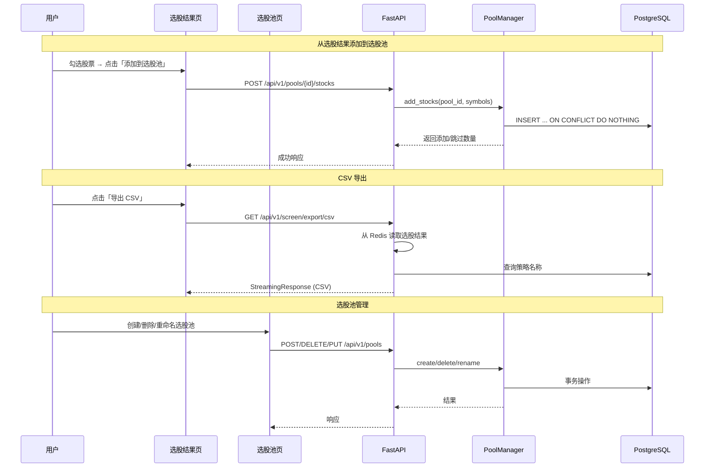
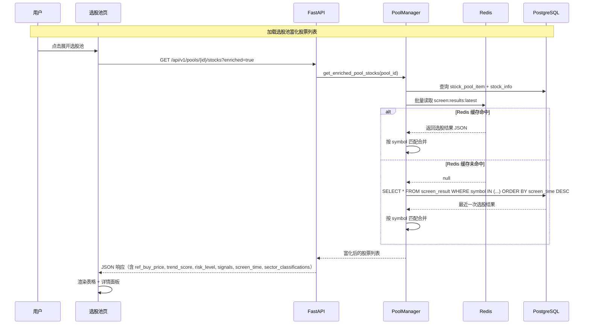

# 设计文档：选股池管理

## 概述

本设计文档描述「选股池管理」功能的技术实现方案，涵盖后端 API、ORM 模型、服务层、前端页面和状态管理。功能分为三个核心部分：

1. **选股结果 CSV 导出**：将现有 Excel 导出替换为 CSV 格式，文件名包含策略名称和时间戳
2. **选股池 CRUD 与股票管理**：独立的选股池管理页面，支持创建/删除/重命名选股池，以及从选股结果或手动添加股票
3. **选股池股票富化展示**：选股池中的股票展示与选股结果页面完全一致，包括相同的表格列和可展开的详情面板（触发信号详情、板块分类、日 K 线图、分钟 K 线图），数据来源优先从 Redis 缓存读取，回退到 PostgreSQL 数据库查询

### 设计决策与理由

| 决策 | 理由 |
|------|------|
| 选股池使用 PGBase（PostgreSQL） | 选股池是业务数据，非时序数据，与 strategy_template 等模型一致 |
| CSV 导出在后端生成 | 需要 UTF-8 BOM 编码、策略名称查询、信号摘要格式化，前端无法可靠完成 |
| 选股池 API 独立为 `app/api/v1/pool.py` | 与 screen.py 职责分离，遵循单一职责原则 |
| 选股池服务层放在 `app/services/pool_manager.py` | 遵循 api/ → services/ → models/ 分层架构，不放在 screener/ 子包中因为选股池是独立功能 |
| 前端选股池页面为独立 View | 需求明确要求独立菜单项和独立路由，不嵌入选股结果页 |
| stock_pool_item 使用联合主键 (pool_id, symbol) | 天然防止同一选股池内重复股票，无需额外唯一约束 |
| 批量添加使用 INSERT ... ON CONFLICT DO NOTHING | 单条 SQL 完成去重插入，性能优于逐条检查 |
| 富化数据在 `GET /pools/{pool_id}/stocks` 端点内联返回 | 避免前端多次请求，一次 API 调用返回完整展示数据 |
| Redis 缓存优先、PostgreSQL 回退的两级数据源 | Redis 缓存命中率高（选股结果 24h TTL），回退到 DB 保证数据可用性 |
| 富化逻辑封装为 `PoolManager.get_enriched_pool_stocks()` 纯服务方法 | 与现有 `get_pool_stocks` 分离，保持向后兼容，便于独立测试 |
| 前端复用 ScreenerResultsView 的详情面板模板代码 | 需求 7.7 明确要求复用，避免重复实现信号详情、板块分类、K 线图组件 |
| 前端排序在客户端完成（与选股结果页一致） | 选股池最多 200 只股票，客户端排序性能足够，无需后端排序参数 |

## 架构

### 系统架构图

```mermaid
graph TB
    subgraph "数据层"
        PG[(PostgreSQL<br/>stock_pool<br/>stock_pool_item<br/>screen_result)]
        REDIS[(Redis<br/>选股结果缓存)]
    end

    subgraph "服务层"
        PM[PoolManager<br/>选股池 CRUD<br/>股票增删<br/>富化查询]
        CE[CsvExporter<br/>CSV 生成]
        PM -->|读写| PG
        PM -->|读取缓存| REDIS
        CE -->|读取结果| REDIS
        CE -->|查询策略名| PG
    end

    subgraph "API 层"
        POOL_API[/pool API/<br/>POST/GET/PUT/DELETE]
        SCREEN_API[/screen API/<br/>GET /export]
        POOL_API --> PM
        SCREEN_API --> CE
    end

    subgraph "前端"
        SPV[StockPoolView<br/>选股池管理页面<br/>富化展示+详情面板]
        SRV[ScreenerResultsView<br/>选股结果页面]
        SPS[stockPoolStore<br/>Pinia]
        SPV --> SPS
        SRV --> SPS
        SPS -->|HTTP| POOL_API
        SRV -->|HTTP| SCREEN_API
    end
```

### 数据流



### 富化数据流（需求 7）



## 组件与接口

### 后端组件

#### 1. ORM 模型 (`app/models/pool.py`)

新增两个 ORM 模型，继承 `PGBase`：

- **StockPool**：选股池元数据
- **StockPoolItem**：选股池内的股票记录

#### 2. 服务层 (`app/services/pool_manager.py`)

`PoolManager` 类提供以下纯业务逻辑方法：

| 方法 | 说明 |
|------|------|
| `create_pool(session, user_id, name)` | 创建选股池，校验名称非空/唯一/长度/数量上限 |
| `delete_pool(session, user_id, pool_id)` | 删除选股池及其所有股票记录 |
| `rename_pool(session, user_id, pool_id, new_name)` | 重命名选股池，校验同上 |
| `list_pools(session, user_id)` | 列出用户所有选股池及股票数量 |
| `get_pool_stocks(session, user_id, pool_id)` | 获取选股池内所有股票 |
| `add_stocks(session, user_id, pool_id, symbols)` | 批量添加股票，返回添加/跳过数量 |
| `remove_stocks(session, user_id, pool_id, symbols)` | 批量移除股票 |
| `add_stock_manual(session, user_id, pool_id, symbol)` | 手动添加单只股票，校验代码格式 |
| `get_enriched_pool_stocks(session, redis, user_id, pool_id)` | 获取选股池内股票并附带完整选股结果数据（Redis → PostgreSQL 回退） |

校验逻辑作为纯函数提取，便于属性测试：

| 纯函数 | 说明 |
|--------|------|
| `validate_pool_name(name) -> str` | 校验并返回 strip 后的名称，无效时抛 ValueError |
| `validate_stock_symbol(symbol) -> str` | 校验 A 股代码格式（6 位数字），无效时抛 ValueError |
| `sanitize_filename(name) -> str` | 将策略名称中的特殊字符替换为下划线 |
| `build_csv_content(items, strategy_name, export_time) -> str` | 构建 CSV 内容字符串 |
| `merge_pool_stocks_with_screen_results(pool_stocks, screen_results_map) -> list[dict]` | 纯函数：将选股池股票列表与选股结果字典合并，返回富化后的列表 |

#### 3. CSV 导出 (`app/services/csv_exporter.py`)

独立模块负责 CSV 生成：

- 从 Redis 读取选股结果缓存
- 查询策略名称用于文件命名
- 生成 UTF-8 BOM 编码的 CSV 内容
- 列：股票代码、股票名称、买入参考价、趋势评分、风险等级、触发信号摘要、选股时间
- 文件名格式：`{Strategy_Name}_{YYYYMMDD_HHmmss}.csv`

#### 3.1 选股池股票富化服务（需求 7，`app/services/pool_manager.py` 扩展）

`PoolManager.get_enriched_pool_stocks()` 方法负责将选股池股票与选股结果数据合并：

**数据源优先级**：
1. **Redis 缓存**（`screen:results:latest`）：读取最新选股结果 JSON，按 symbol 建立索引
2. **PostgreSQL 回退**（`screen_result` 表）：对 Redis 中未命中的 symbol，查询 `screen_result` 表中每只股票最近一次的记录

**纯函数 `merge_pool_stocks_with_screen_results`**：

```python
def merge_pool_stocks_with_screen_results(
    pool_stocks: list[dict],          # get_pool_stocks 返回的基础列表
    screen_results_map: dict[str, dict],  # symbol → 选股结果字典
) -> list[dict]:
    """将选股池股票与选股结果合并，返回富化列表。

    对于 screen_results_map 中存在的 symbol，合并以下字段：
    ref_buy_price, trend_score, risk_level, signals, screen_time,
    has_fake_breakout, sector_classifications。

    对于不存在的 symbol，这些字段设为 None。
    """
```

**`get_enriched_pool_stocks` 方法流程**：

```python
@staticmethod
async def get_enriched_pool_stocks(
    session: AsyncSession,
    redis: Redis,
    user_id: UUID,
    pool_id: UUID,
) -> list[dict]:
    # 1. 获取基础股票列表
    pool_stocks = await PoolManager.get_pool_stocks(session, user_id, pool_id)
    symbols = [s["symbol"] for s in pool_stocks]

    # 2. 从 Redis 读取最新选股结果
    screen_results_map = {}
    raw = await redis.get("screen:results:latest")
    if raw:
        data = json.loads(raw)
        for item in data.get("items", []):
            if item.get("symbol") in symbols:
                screen_results_map[item["symbol"]] = item

    # 3. 对 Redis 未命中的 symbol，从 PostgreSQL 回退查询
    missing_symbols = [s for s in symbols if s not in screen_results_map]
    if missing_symbols:
        # 查询每只股票最近一次的 screen_result
        stmt = (
            select(ScreenResult)
            .where(ScreenResult.symbol.in_(missing_symbols))
            .order_by(ScreenResult.symbol, ScreenResult.screen_time.desc())
            .distinct(ScreenResult.symbol)
        )
        result = await session.execute(stmt)
        for row in result.scalars().all():
            screen_results_map[row.symbol] = {
                "ref_buy_price": float(row.ref_buy_price) if row.ref_buy_price else None,
                "trend_score": float(row.trend_score) if row.trend_score else None,
                "risk_level": row.risk_level,
                "signals": row.signals or [],
                "screen_time": row.screen_time.isoformat() if row.screen_time else None,
                "has_fake_breakout": False,
                "sector_classifications": None,
            }

    # 4. 合并
    return merge_pool_stocks_with_screen_results(pool_stocks, screen_results_map)
```

**API 响应格式**（`GET /pools/{pool_id}/stocks?enriched=true`）：

```json
[
  {
    "symbol": "600000",
    "stock_name": "浦发银行",
    "added_at": "2025-01-15T10:30:00+08:00",
    "ref_buy_price": 12.50,
    "trend_score": 85,
    "risk_level": "LOW",
    "signals": [
      {
        "category": "MA_TREND",
        "label": "均线多头排列",
        "strength": "STRONG",
        "freshness": "NEW",
        "description": "5/10/20/60 日均线多头排列",
        "dimension": "技术面",
        "is_fake_breakout": false
      }
    ],
    "screen_time": "2025-01-15T15:30:00+08:00",
    "has_fake_breakout": false,
    "sector_classifications": {
      "eastmoney": ["银行", "沪股通"],
      "tonghuashun": ["银行"],
      "tongdaxin": ["银行"]
    }
  },
  {
    "symbol": "000001",
    "stock_name": "平安银行",
    "added_at": "2025-01-15T10:31:00+08:00",
    "ref_buy_price": null,
    "trend_score": null,
    "risk_level": null,
    "signals": null,
    "screen_time": null,
    "has_fake_breakout": false,
    "sector_classifications": null
  }
]
```

#### 4. API 端点 (`app/api/v1/pool.py`)

| 方法 | 路径 | 说明 |
|------|------|------|
| POST | `/pools` | 创建选股池 |
| GET | `/pools` | 列出用户所有选股池 |
| PUT | `/pools/{pool_id}` | 重命名选股池 |
| DELETE | `/pools/{pool_id}` | 删除选股池 |
| GET | `/pools/{pool_id}/stocks` | 获取选股池内股票列表（支持 `?enriched=true` 返回富化数据） |
| POST | `/pools/{pool_id}/stocks` | 批量添加股票到选股池 |
| DELETE | `/pools/{pool_id}/stocks` | 批量移除股票 |
| POST | `/pools/{pool_id}/stocks/manual` | 手动添加单只股票 |

#### 5. CSV 导出端点（修改 `app/api/v1/screen.py`）

| 方法 | 路径 | 说明 |
|------|------|------|
| GET | `/screen/export/csv` | 导出选股结果为 CSV（替换原有 stub） |

### 前端组件

#### 1. 选股池页面 (`frontend/src/views/StockPoolView.vue`)

独立页面组件，包含：
- 选股池列表（左侧或顶部）：显示名称、股票数量、操作按钮
- 选股池详情（右侧或下方）：展示池内股票富化表格
- 新建选股池对话框
- 重命名对话框
- 删除确认对话框
- 手动添加股票输入框
- 空状态提示

**富化股票表格（需求 7）**：
- 表格列与选股结果页一致：股票代码、股票名称、买入参考价、趋势评分（含进度条）、风险等级（含徽章）、触发信号摘要、选股时间
- 无选股结果数据的股票：其余列显示占位符「—」
- 排序支持：趋势评分、风险等级、信号数量（客户端排序，与选股结果页逻辑一致）
- 点击行展开详情面板（复用 ScreenerResultsView 的模板代码）：
  - 触发信号详情（含强度指示器和维度分组）
  - 板块分类（东方财富/同花顺/通达信三个数据源）
  - 日 K 线图（含原始/前复权切换）
  - 分钟 K 线图（含 1m/5m/15m/30m/60m 时间周期选择器和原始/前复权切换，复用 `MinuteKlineChart` 组件）
- 无选股结果数据的股票行点击不展开详情面板

#### 2. 选股池 Store (`frontend/src/stores/stockPool.ts`)

Pinia store 管理选股池状态：

```typescript
interface StockPool {
  id: string
  name: string
  stock_count: number
  created_at: string
  updated_at: string
}

interface StockPoolItem {
  symbol: string
  stock_name: string | null
  added_at: string
}

/** 富化后的选股池股票（需求 7） */
interface EnrichedPoolStock extends StockPoolItem {
  ref_buy_price: number | null
  trend_score: number | null
  risk_level: 'LOW' | 'MEDIUM' | 'HIGH' | null
  signals: SignalDetail[] | null
  screen_time: string | null
  has_fake_breakout: boolean
  sector_classifications: SectorClassifications | null
}
```

#### 3. 选股结果页面修改 (`ScreenerResultsView.vue`)

- 表格左侧增加复选框列
- 选中后显示操作栏（已选数量 + 「添加到选股池」按钮）
- 选股池选择下拉菜单
- 导出按钮标签改为「📥 导出 CSV」
- 空结果时禁用导出按钮

#### 4. 导航菜单修改 (`MainLayout.vue`)

在「选股」分组中添加「选股池」菜单项：

```typescript
'选股': [
  { path: '/screener', label: '智能选股', icon: '🔍' },
  { path: '/screener/results', label: '选股结果', icon: '📋' },
  { path: '/stock-pool', label: '选股池', icon: '📦' },
],
```

#### 5. 路由配置 (`frontend/src/router/index.ts`)

新增路由：

```typescript
{
  path: 'stock-pool',
  name: 'StockPool',
  component: () => import('@/views/StockPoolView.vue'),
  meta: { title: '选股池' },
}
```

## 数据模型

### 数据库表

#### stock_pool（选股池）

| 列名 | 类型 | 约束 | 说明 |
|------|------|------|------|
| id | UUID | PK, DEFAULT gen_random_uuid() | 选股池 ID |
| user_id | UUID | NOT NULL | 所属用户 |
| name | VARCHAR(50) | NOT NULL | 选股池名称 |
| created_at | TIMESTAMPTZ | NOT NULL, DEFAULT NOW() | 创建时间 |
| updated_at | TIMESTAMPTZ | NOT NULL, DEFAULT NOW() | 更新时间 |

唯一约束：`UNIQUE(user_id, name)` — 同一用户下选股池名称唯一

#### stock_pool_item（选股池条目）

| 列名 | 类型 | 约束 | 说明 |
|------|------|------|------|
| pool_id | UUID | PK, FK → stock_pool.id ON DELETE CASCADE | 所属选股池 |
| symbol | VARCHAR(10) | PK | 股票代码 |
| added_at | TIMESTAMPTZ | NOT NULL, DEFAULT NOW() | 加入时间 |

联合主键 `(pool_id, symbol)` 天然防止重复。`ON DELETE CASCADE` 确保删除选股池时自动清理条目。

### ORM 模型

```python
# app/models/pool.py

class StockPool(PGBase):
    """选股池"""
    __tablename__ = "stock_pool"

    id: Mapped[UUID] = mapped_column(PG_UUID(as_uuid=True), primary_key=True, server_default=sa_text("gen_random_uuid()"))
    user_id: Mapped[UUID] = mapped_column(PG_UUID(as_uuid=True), nullable=False)
    name: Mapped[str] = mapped_column(String(50), nullable=False)
    created_at: Mapped[datetime] = mapped_column(TIMESTAMPTZ, server_default=sa_text("NOW()"), nullable=False)
    updated_at: Mapped[datetime] = mapped_column(TIMESTAMPTZ, server_default=sa_text("NOW()"), nullable=False)

    __table_args__ = (
        UniqueConstraint("user_id", "name", name="uq_stock_pool_user_name"),
    )


class StockPoolItem(PGBase):
    """选股池条目"""
    __tablename__ = "stock_pool_item"

    pool_id: Mapped[UUID] = mapped_column(PG_UUID(as_uuid=True), ForeignKey("stock_pool.id", ondelete="CASCADE"), primary_key=True)
    symbol: Mapped[str] = mapped_column(String(10), primary_key=True)
    added_at: Mapped[datetime] = mapped_column(TIMESTAMPTZ, server_default=sa_text("NOW()"), nullable=False)
```

### 业务约束常量

```python
MAX_POOLS_PER_USER = 20       # 单用户最多 20 个选股池
MAX_STOCKS_PER_POOL = 200     # 单选股池最多 200 只股票
MAX_POOL_NAME_LENGTH = 50     # 选股池名称最大长度
STOCK_SYMBOL_PATTERN = r'^\d{6}$'  # A 股代码格式
```

## 正确性属性 (Correctness Properties)

*属性（Property）是系统在所有合法执行路径上都应保持为真的特征或行为——本质上是对系统行为的形式化陈述。属性是连接人类可读规格说明与机器可验证正确性保证之间的桥梁。*

### Property 1: CSV 生成保留所有选股结果且包含必需列

*For any* 非空的选股结果列表，调用 `build_csv_content` 生成的 CSV 内容应满足：(a) 解析后的数据行数等于输入列表长度；(b) 首行包含所有必需列（股票代码、股票名称、买入参考价、趋势评分、风险等级、触发信号摘要、选股时间）；(c) 输出字节以 UTF-8 BOM (EF BB BF) 开头。

**Validates: Requirements 1.1, 1.2, 1.5**

### Property 2: 文件名生成与特殊字符清理

*For any* 策略名称字符串和合法的 datetime 值，`sanitize_filename` 处理后的文件名应满足：(a) 不包含文件系统禁止字符（`/\:*?"<>|`）；(b) 所有禁止字符均被替换为下划线；(c) 最终文件名匹配 `{sanitized_name}_{YYYYMMDD_HHmmss}.csv` 格式。

**Validates: Requirements 1.3, 1.4**

### Property 3: 选股池名称校验拒绝无效输入

*For any* 仅由空白字符组成的字符串，或长度超过 50 个字符的字符串，`validate_pool_name` 应抛出 ValueError。反之，*for any* 非空且 strip 后长度在 1-50 之间的字符串，`validate_pool_name` 应返回 strip 后的名称。

**Validates: Requirements 3.3, 3.9**

### Property 4: 选股池创建持久化往返

*For any* 合法的选股池名称，创建选股池后再调用 `list_pools` 查询，返回的列表中应包含一个名称与输入完全匹配的选股池。

**Validates: Requirements 3.2, 3.7**

### Property 5: 股票添加幂等性

*For any* 选股池和任意合法股票代码集合，将该集合添加到选股池后：(a) 池内应包含所有添加的股票；(b) 再次添加相同集合时，返回的 `added` 数量应为 0，`skipped` 数量应等于集合大小，且池内股票总数不变。

**Validates: Requirements 4.4, 4.5**

### Property 6: 股票移除后剩余集合正确

*For any* 包含 N 只股票的选股池，移除其中 M 只（M ≤ N）后，池内应恰好剩余 N - M 只股票，且剩余股票集合等于原集合减去移除集合。

**Validates: Requirements 5.1**

### Property 7: 非法股票代码拒绝

*For any* 不匹配 `^\d{6}$` 正则的字符串，`validate_stock_symbol` 应抛出 ValueError。反之，*for any* 恰好 6 位数字的字符串，`validate_stock_symbol` 应返回该字符串。

**Validates: Requirements 5.3**

### Property 8: 选股池股票富化合并完整性

*For any* 选股池股票列表和选股结果字典，调用 `merge_pool_stocks_with_screen_results` 后：(a) 返回列表长度等于输入股票列表长度；(b) 对于在选股结果字典中存在匹配的股票，富化字段（ref_buy_price, trend_score, risk_level, signals, screen_time）均不为 None；(c) 对于在选股结果字典中不存在匹配的股票，富化字段均为 None；(d) 所有记录的 symbol 和 stock_name 保持不变。

**Validates: Requirements 7.1, 7.3, 7.6**

## 错误处理

### 后端错误处理

| 场景 | HTTP 状态码 | 错误消息 |
|------|------------|----------|
| 选股池名称为空/纯空白 | 400 | 选股池名称不能为空 |
| 选股池名称超过 50 字符 | 400 | 选股池名称长度不能超过 50 个字符 |
| 选股池名称重复 | 409 | 选股池名称已存在，请使用其他名称 |
| 选股池数量达上限 | 400 | 选股池数量已达上限（20 个） |
| 选股池不存在 | 404 | 选股池不存在 |
| 选股池不属于当前用户 | 404 | 选股池不存在（不泄露他人数据） |
| 股票代码格式无效 | 400 | 请输入有效的 A 股代码（6 位数字） |
| 股票已在选股池中（手动添加） | 409 | 该股票已在选股池中 |
| 选股池股票数量达上限 | 400 | 选股池股票数量已达上限（200 只） |
| 导出时无选股结果 | 404 | 暂无选股结果可导出 |
| Redis 缓存读取失败（富化查询） | — | 静默降级，继续从 PostgreSQL 回退查询 |
| PostgreSQL 选股结果查询失败（富化查询） | — | 静默降级，对应股票返回 null 富化字段 |
| 数据库事务失败 | 500 | 操作失败，请稍后重试 |

### 前端错误处理

- API 调用失败时显示 toast 提示，不阻塞页面
- 网络错误时显示重试按钮
- 表单校验错误在输入框下方即时显示
- 删除操作需二次确认对话框
- 富化数据加载失败时，表格仍显示基础信息（股票代码、名称），富化列显示「—」

## 测试策略

### 属性测试（Property-Based Testing）

使用 **Hypothesis**（后端）和 **fast-check**（前端）进行属性测试，每个属性至少运行 100 次迭代。

**后端属性测试** (`tests/properties/test_pool_properties.py`)：

| 属性 | 测试内容 | 标签 |
|------|----------|------|
| Property 1 | CSV 生成往返 | Feature: stock-pool-management, Property 1: CSV generation preserves all results with required columns |
| Property 2 | 文件名生成与清理 | Feature: stock-pool-management, Property 2: Filename generation with sanitization |
| Property 3 | 选股池名称校验 | Feature: stock-pool-management, Property 3: Pool name validation rejects invalid input |
| Property 5 | 股票添加幂等性 | Feature: stock-pool-management, Property 5: Stock addition idempotence |
| Property 6 | 股票移除后剩余集合 | Feature: stock-pool-management, Property 6: Stock removal preserves remainder |
| Property 7 | 股票代码校验 | Feature: stock-pool-management, Property 7: Invalid stock symbol rejection |
| Property 8 | 选股池股票富化合并完整性 | Feature: stock-pool-management, Property 8: Pool stock enrichment merge completeness |

**前端属性测试** (`frontend/src/views/__tests__/stockPool.property.test.ts`)：

| 属性 | 测试内容 | 标签 |
|------|----------|------|
| Property 3 | 选股池名称前端校验 | Feature: stock-pool-management, Property 3: Pool name validation |
| Property 7 | 股票代码前端校验 | Feature: stock-pool-management, Property 7: Stock symbol validation |

**注意**：Property 4（选股池创建持久化往返）需要数据库，放在集成测试中用 2-3 个具体示例验证，不做属性测试。

### 单元测试

**后端** (`tests/services/test_pool_manager.py`)：
- 创建选股池成功
- 创建选股池名称重复失败
- 创建选股池超过 20 个上限
- 删除选股池级联删除股票
- 重命名选股池成功
- 批量添加股票跳过重复
- 批量添加股票超过 200 上限部分添加
- 手动添加股票代码格式校验
- CSV 导出空结果处理

**后端** (`tests/services/test_pool_manager.py` — 富化查询)：
- 富化查询：Redis 缓存命中时返回完整数据
- 富化查询：Redis 未命中时从 PostgreSQL 回退
- 富化查询：Redis 和 PostgreSQL 均无数据时返回 null 字段
- 富化查询：混合场景（部分命中 Redis、部分回退 DB、部分无数据）

**前端** (`frontend/src/views/__tests__/StockPoolView.test.ts`)：
- 空状态渲染
- 选股池列表渲染
- 创建对话框交互
- 删除确认对话框
- 选股结果页复选框和操作栏

**前端** (`frontend/src/views/__tests__/StockPoolView.test.ts` — 富化展示)：
- 富化表格渲染：显示买入参考价、趋势评分进度条、风险等级徽章、信号摘要、选股时间
- 无选股结果数据的股票行显示占位符「—」
- 点击有选股结果的股票行展开详情面板
- 点击无选股结果的股票行不展开详情面板
- 排序功能：按趋势评分、风险等级、信号数量排序

### 集成测试

**后端** (`tests/integration/test_pool_api.py`)：
- 完整 CRUD 流程：创建 → 添加股票 → 查询 → 移除股票 → 删除
- CSV 导出端到端（含 Redis 缓存）
- 事务原子性验证

**后端** (`tests/integration/test_pool_api.py` — 富化查询)：
- 富化端到端：创建选股池 → 添加股票 → 执行选股（写入 Redis 缓存）→ 查询富化列表 → 验证数据完整
- 富化回退：清除 Redis 缓存 → 插入 screen_result 记录 → 查询富化列表 → 验证从 DB 回退读取
