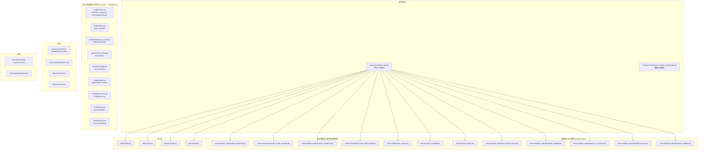
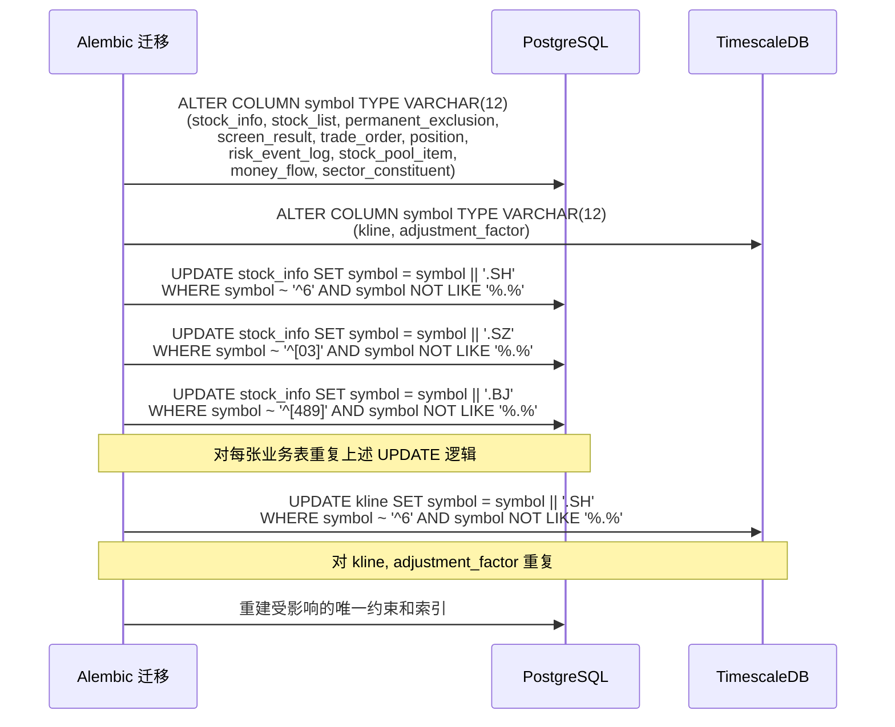

# 技术设计文档：股票与指数代码标准化

## 概述

本功能将全系统股票和指数代码从当前的混合格式（业务表纯数字、Tushare 表带后缀、板块表格式不一致）统一为行业标准的 `{code}.{exchange}` 格式（如 `600000.SH`、`000001.SZ`、`399300.SZ`、`830799.BJ`）。

### 关键设计决策

1. **统一格式而非统一字段名**：业务表保留 `symbol` 字段名，Tushare 原始数据表保留 `ts_code` 字段名，但两者存储格式统一为标准代码。这样避免了对 86 张 Tushare 表的字段重命名，降低迁移风险
2. **工具模块集中转换**：新建 `app/core/symbol_utils.py` 作为唯一的代码格式转换入口，消除 9+ 处重复逻辑
3. **API 层向后兼容**：API 同时接受裸代码和标准代码输入，内部统一转为标准代码，避免前端一次性全量改造
4. **数据迁移分批执行**：Alembic 迁移脚本先扩列宽度（`String(10)` → `String(12)`），再批量 UPDATE 添加后缀，最后更新约束
5. **指数常量集中管理**：将散落在多个文件中的指数代码硬编码收敛到 `symbol_utils.py` 的常量区

### 设计原则

- **幂等性**：`to_standard("600000.SH")` 返回 `"600000.SH"`，已标准化的代码不会被二次处理
- **向后兼容**：迁移脚本支持 downgrade，API 兼容旧格式输入
- **最小侵入**：Tushare 86 张表的 `ts_code` 字段已是标准格式，无需改动

## 架构

### 变更影响范围



### 数据迁移流程



## 详细技术方案

### 1. 代码工具模块 `app/core/symbol_utils.py`

```python
"""证券代码标准化工具模块"""

import re

# 交易所推断规则
_EXCHANGE_RULES: dict[str, str] = {
    "6": "SH",   # 上海：6 开头
    "0": "SZ",   # 深圳：0 开头
    "3": "SZ",   # 深圳：3 开头（创业板）
    "4": "BJ",   # 北京：4 开头
    "8": "BJ",   # 北京：8 开头
    "9": "BJ",   # 北京：9 开头
}

_VALID_EXCHANGES = {"SH", "SZ", "BJ"}
_STANDARD_RE = re.compile(r"^\d{6}\.(SH|SZ|BJ)$")
_BARE_RE = re.compile(r"^\d{6}$")

# --- 常用指数代码常量 ---
INDEX_SH = "000001.SH"       # 上证指数
INDEX_SZ = "399001.SZ"       # 深证成指
INDEX_CYB = "399006.SZ"      # 创业板指
INDEX_KCB = "000688.SH"      # 科创50
INDEX_HS300 = "000300.SH"    # 沪深300（也可写作 399300.SZ）
INDEX_ZZ500 = "000905.SH"    # 中证500

# 指数代码前缀集合（用于 is_index 判断）
_INDEX_PREFIXES = {"000", "399", "880", "899"}


def infer_exchange(bare_code: str) -> str:
    """根据裸代码首位数字推断交易所"""
    ...

def to_standard(code: str, exchange: str | None = None) -> str:
    """将任意格式代码转为标准代码（幂等）"""
    ...

def to_bare(code: str) -> str:
    """从标准代码或裸代码提取裸代码部分"""
    ...

def get_exchange(code: str) -> str:
    """从标准代码提取交易所后缀"""
    ...

def is_standard(code: str) -> bool:
    """校验是否为合法标准代码"""
    ...

def is_index(code: str) -> bool:
    """判断是否为指数代码"""
    ...
```

### 2. ORM 模型变更

所有包含 `symbol` 字段的模型统一将列宽从 `String(10)` 扩展为 `String(12)`：

| 模型 | 文件 | 变更 |
|------|------|------|
| `StockInfo` | `app/models/stock.py:28` | `String(10)` → `String(12)` |
| `PermanentExclusion` | `app/models/stock.py:53` | `String(10)` → `String(12)` |
| `StockList` | `app/models/stock.py:68` | `String(10)` → `String(12)` |
| `Kline` | `app/models/kline.py:25` | `String(10)` → `String(12)`，更新注释 |
| `AdjustmentFactor` | `app/models/adjustment_factor.py:21` | `String(10)` → `String(12)` |
| `MoneyFlow` | `app/models/money_flow.py:26` | `String(10)` → `String(12)` |
| `ScreenResult` | `app/models/strategy.py:76` | `String(10)` → `String(12)` |
| `TradeOrder` | `app/models/trade.py:33` | `String(10)` → `String(12)` |
| `Position` | `app/models/trade.py:64` | `String(10)` → `String(12)` |
| `RiskEventLog` | `app/models/risk_event.py:36` | `String(10)` → `String(12)` |
| `StockPoolItem` | `app/models/pool.py:61` | `String(10)` → `String(12)` |
| `SectorConstituent` | `app/models/sector.py:91` | `String(10)` → `String(12)` |

### 3. Alembic 数据迁移脚本

迁移脚本 `alembic/versions/xxxx_standardize_symbol_codes.py` 分三步执行：

**upgrade():**
1. 扩列宽度：所有 `symbol` 列从 `VARCHAR(10)` 改为 `VARCHAR(12)`
2. 批量更新数据：对每张表执行三条 UPDATE（SH/SZ/BJ），仅处理不含 `.` 的裸代码
3. 重建受影响的唯一约束（如 `uq_position_user_symbol_mode`、`uq_sector_constituent_date_code_source_symbol`）

**downgrade():**
1. 批量更新数据：`UPDATE ... SET symbol = split_part(symbol, '.', 1)` 去除后缀
2. 缩列宽度：`VARCHAR(12)` 改回 `VARCHAR(10)`
3. 恢复原始约束

**涉及的表清单（按数据库分组）：**

PostgreSQL（PGBase）：
- `stock_info`、`permanent_exclusion`、`stock_list`
- `money_flow`
- `screen_result`
- `trade_order`、`position`
- `risk_event_log`
- `stock_pool_item`
- `sector_constituent`

TimescaleDB（TSBase）：
- `kline`
- `adjustment_factor`

### 4. 数据导入层改造

#### 4.1 Tushare 导入 (`tasks/tushare_import.py`)

当前 `_convert_codes` 函数（第1335行）在 `CodeFormat.STOCK_SYMBOL`（枚举定义在 `tushare_registry.py:33-38`）模式下通过 `split(".")[0]` 去后缀存入 `symbol`。改造后：
- 直接使用 `ts_code` 值（已是标准格式）赋给 `symbol` 字段
- 移除 `_strip_suffix` 相关逻辑
- `_write_to_kline`（第2155行）和 `_write_to_adjustment_factor`（第2237行）中直接使用标准代码

#### 4.2 Tushare 适配器 (`services/data_engine/tushare_adapter.py`)

- `fetch_kline`/`fetch_fundamentals`/`fetch_money_flow` 中的内联加后缀逻辑替换为 `symbol_utils.to_standard()`
- 移除三处重复的 `if "." not in symbol` 判断

#### 4.3 本地 K 线导入 (`services/data_engine/local_kline_import.py`)

- `infer_symbol_from_csv_name` 返回值从裸代码改为标准代码
- 使用 `symbol_utils.to_standard(bare_code, exchange)` 转换

#### 4.4 AkShare 适配器 (`services/data_engine/akshare_adapter.py`)

- `fetch_kline` 中的 `clean_symbol = symbol.split(".")[0]` 替换为 `symbol_utils.to_bare()` 用于 API 调用
- 返回的 KlineBar 使用标准代码

#### 4.5 板块 CSV 解析器 (`services/data_engine/sector_csv_parser.py`)

- 移除 `_normalize_symbol` 函数
- 使用 `symbol_utils.to_standard()` 替代

#### 4.6 回填服务 (`services/data_engine/backfill_service.py`)

- 移除 `clean_symbol` 中间变量，统一使用标准代码

### 5. 查询/服务层改造

#### 5.1 K 线仓储 (`services/data_engine/kline_repository.py`)

- 移除第 138 行的 `symbol.split(".")[0]` 内联去后缀
- 查询条件直接使用标准代码匹配

#### 5.2 选股数据提供 (`services/screener/screen_data_provider.py`)

- 移除 `_strip_market_suffix` 函数（第 69-71 行）
- 移除生成三种后缀变体的逻辑（第 1654-1659 行）
- `_TARGET_INDICES` 常量替换为引用 `symbol_utils` 中的指数常量
- 板块成分匹配直接使用标准代码

#### 5.3 板块仓储 (`services/data_engine/sector_repository.py`)

- 移除第 171 行的 `symbol_variants` 三变体生成逻辑
- 直接使用标准代码查询 `SectorConstituent`

#### 5.4 回测因子加载 (`services/backtest_factor_data_loader.py`)

- 移除 `_strip_suffix` 函数（第 29-30 行）
- 因子数据关联直接使用标准代码

#### 5.5 回测引擎 (`services/backtest_engine.py`)

- 第 1272 行的指数代码替换为引用 `symbol_utils` 常量

#### 5.6 风控 (`api/v1/risk.py`)

- `_SH_SYMBOL`、`_CYB_SYMBOL`、`_HS300_SYMBOL`、`_ZZ500_SYMBOL` 替换为引用 `symbol_utils` 常量

### 6. API 层改造

#### 6.1 通用输入标准化

在 API 层添加输入标准化逻辑：所有接受 `symbol` 参数的端点，在处理前调用 `symbol_utils.to_standard()` 转换。

#### 6.2 `api/v1/data.py`

- 移除第 230 行的内联去后缀和第 233-234 行的内联加后缀
- 第 408-410 行的指数映射字典保持不变（已是标准格式）
- 使用 `symbol_utils.to_standard()` 处理输入

#### 6.3 响应格式

所有 API 响应中的 `symbol` 字段自然返回标准代码（因为数据库中已是标准格式）。

### 7. 前端改造

#### 7.1 校验函数更新 (`stores/stockPool.ts`)

```typescript
export function validateStockSymbol(symbol: string): ValidationResult {
  // 同时接受 "600000" 和 "600000.SH" 格式
  if (!/^\d{6}(\.(SH|SZ|BJ))?$/.test(symbol)) {
    return { valid: false, error: '请输入有效的A股代码（如 600000 或 600000.SH）' }
  }
  return { valid: true }
}
```

#### 7.2 显示格式

前端所有显示股票代码的位置直接展示 API 返回的标准代码，无需额外转换。

#### 7.3 输入补全

前端在提交裸代码时，由后端 API 层自动补全后缀，前端无需实现推断逻辑。

### 8. 文档更新

#### 8.1 `data-consistency.md` §3.2 更新

```markdown
### 3.2 股票代码 (symbol)

| 规则 | 说明 |
|------|------|
| 格式 | 标准代码：`{6位数字}.{交易所}`，如 `600000.SH` |
| 存储 | `VARCHAR(12)` |
| 交易所 | SH (上海), SZ (深圳), BJ (北京) |
| 转换工具 | `app/core/symbol_utils.py` |

**规则：**
- 所有表的 symbol 字段统一使用标准代码格式
- 禁止在业务代码中自行实现代码格式转换，必须使用 symbol_utils
- API 层兼容裸代码输入，内部统一转为标准代码
```

## 向后兼容性

| 场景 | 兼容策略 |
|------|---------|
| 已有数据库数据 | Alembic 迁移脚本批量转换，支持 downgrade 回滚 |
| API 客户端传入裸代码 | API 层自动补全后缀，不影响现有调用方 |
| 前端输入裸代码 | 后端自动转换，前端校验放宽为同时接受两种格式 |
| Tushare 86 张表 | `ts_code` 字段已是标准格式，无需改动 |
| 外部数据源返回裸代码 | 导入层统一使用 `symbol_utils.to_standard()` 转换 |

## 风险与缓解

| 风险 | 影响 | 缓解措施 |
|------|------|---------|
| 迁移脚本执行时间长（大表 UPDATE） | kline 表数据量大，UPDATE 可能耗时较长 | 分批 UPDATE（每次 10 万行），在低峰期执行 |
| 迁移后遗漏某处查询仍用裸代码 | 查询结果为空 | 全量 grep 排查所有 symbol 相关查询，编写集成测试验证 |
| 唯一约束冲突（如同一裸代码在不同交易所） | A 股实际不存在此情况 | 迁移前校验数据，确认无冲突 |
