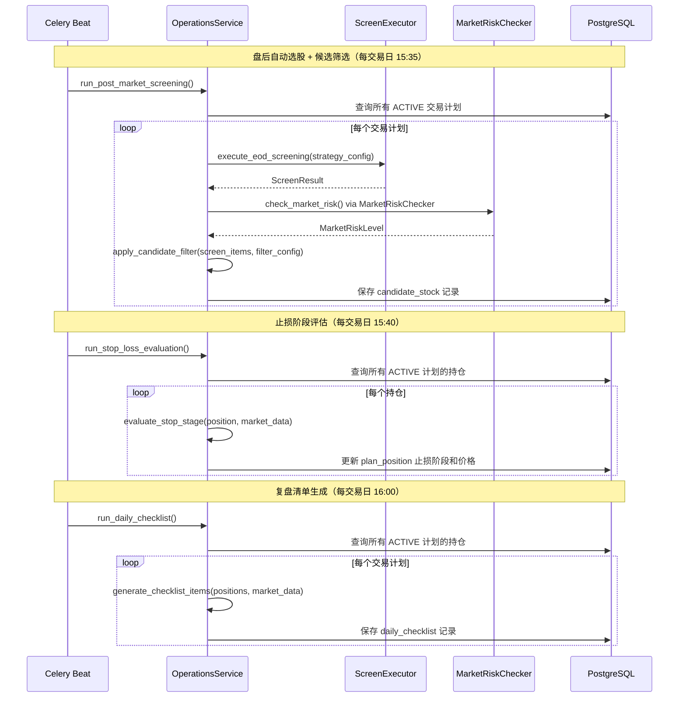

# 设计文档：实操模块（Trading Operations）

## 概述

本设计文档描述「实操模块」的技术实现方案。该模块作为现有数据、选股、风控、分析四大模块的上层编排层，以「交易计划（TradingPlan）」为核心实体，将分散的功能串联为从盘后选股到市场环境适配的完整交易工作流。

核心设计原则：
1. **编排而非重写**：最大化复用现有 ScreenExecutor、MarketRiskChecker/StockRiskFilter/RiskGateway、TradeExecutor、ReviewAnalyzer 等服务
2. **交易计划驱动**：所有操作围绕 TradingPlan 实体展开，每个计划绑定一套策略模板和操作参数
3. **分阶段止损状态机**：持仓止损策略随盈亏状态自动升级，五阶段状态机管理

### 设计决策与理由

| 决策 | 理由 |
|------|------|
| 新增 `plan_position` 表而非扩展现有 `position` 表 | 实操模块的持仓需要额外字段（止损阶段、关联计划、持仓天数等），扩展现有表会影响交易模块 |
| 候选股使用独立表 `candidate_stock` | 候选股有独立的生命周期（筛选→确认→买入/放弃），不同于选股结果 |
| 分阶段止损配置存储为 JSONB | 五阶段配置结构灵活，用户可自定义每个阶段的参数，JSONB 支持向后兼容 |
| 市场环境配置存储为 JSONB | 三种环境各有独立参数集，JSONB 避免多列冗余 |
| 新增 `operations` 队列用于 Celery 任务 | 与现有 screening/review 队列隔离，避免实操模块的定时任务影响其他模块 |
| 前端使用 Tab 页而非多个独立路由 | 交易计划详情的各维度（候选股/持仓/买入记录/复盘/设置）紧密关联，Tab 切换更高效 |
| 复盘清单使用结构化 JSONB 存储 | 检查项数量和维度可能随策略演进变化，JSONB 比固定列更灵活 |
| OperationsService 作为单一编排服务 | 避免多个小服务间的循环依赖，统一协调选股→筛选→买入→止损→复盘流程 |
| 风控复用 MarketRiskChecker + StockRiskFilter + RiskGateway | 现有代码无统一 RiskController 类，风控由三个独立 checker 组成，直接复用 |

## 架构

### 系统架构图

```mermaid
graph TB
    subgraph "数据层"
        PG[(PostgreSQL<br/>trading_plan<br/>candidate_stock<br/>buy_record<br/>plan_position<br/>daily_checklist<br/>market_profile_log)]
        REDIS[(Redis<br/>选股结果缓存<br/>市场风险等级)]
    end

    subgraph "现有服务层（复用）"
        SE[ScreenExecutor<br/>选股执行]
        RC[MarketRiskChecker +<br/>StockRiskFilter +<br/>RiskGateway<br/>风控校验]
        TE[TradeExecutor<br/>交易执行]
        RA[ReviewAnalyzer<br/>复盘分析]
        PM[PositionManager<br/>持仓管理]
    end

    subgraph "新增服务层"
        OS[OperationsService<br/>实操编排服务]
        OS -->|调用| SE
        OS -->|调用| RC
        OS -->|调用| TE
        OS -->|调用| RA
        OS -->|调用| PM
        OS -->|读写| PG
        OS -->|读写| REDIS
    end

    subgraph "Celery 定时任务"
        T1[盘后选股+候选筛选<br/>每交易日 15:35]
        T2[止损阶段评估<br/>每交易日 15:40]
        T3[复盘清单生成<br/>每交易日 16:00]
        T1 --> OS
        T2 --> OS
        T3 --> OS
    end

    subgraph "API 层"
        OPS_API[/operations API/<br/>交易计划 CRUD<br/>候选股/买入/持仓/复盘/市场环境]
        OPS_API --> OS
    end

    subgraph "前端"
        OV[OperationsView<br/>交易计划概览]
        ODV[OperationDetailView<br/>计划详情 Tab 页]
        OPS_STORE[operationsStore<br/>Pinia]
        OV --> OPS_STORE
        ODV --> OPS_STORE
        OPS_STORE -->|HTTP| OPS_API
    end
```

### 核心数据流



## 详细技术方案

### 1. 数据模型（ORM）

所有新增模型使用 `PGBase`（PostgreSQL），定义在 `app/models/operations.py`。

#### 1.1 TradingPlan（交易计划）

```python
class TradingPlan(PGBase):
    __tablename__ = "trading_plan"

    id: Mapped[UUID]                    # PK, gen_random_uuid()
    user_id: Mapped[UUID]               # 用户ID
    name: Mapped[str]                   # 计划名称, VARCHAR(100)
    strategy_id: Mapped[UUID]           # FK → strategy_template.id
    status: Mapped[str]                 # VARCHAR(10): ACTIVE/PAUSED/ARCHIVED
    candidate_filter: Mapped[dict]      # JSONB: CandidateFilterConfig
    stage_stop_config: Mapped[dict]     # JSONB: StageStopConfig
    market_profile: Mapped[dict]        # JSONB: MarketProfileConfig
    position_control: Mapped[dict]      # JSONB: PositionControlConfig
    created_at: Mapped[datetime]        # TIMESTAMPTZ
    updated_at: Mapped[datetime]        # TIMESTAMPTZ
```

#### 1.2 CandidateStock（候选股）

```python
class CandidateStock(PGBase):
    __tablename__ = "candidate_stock"

    id: Mapped[UUID]                    # PK
    plan_id: Mapped[UUID]               # FK → trading_plan.id
    screen_date: Mapped[date]           # 选股日期
    symbol: Mapped[str]                 # VARCHAR(12), 标准代码
    trend_score: Mapped[Decimal]        # NUMERIC(5,2)
    ref_buy_price: Mapped[Decimal]      # NUMERIC(12,4)
    signal_strength: Mapped[str]        # VARCHAR(10): STRONG/MEDIUM/WEAK
    signal_freshness: Mapped[str]       # VARCHAR(15): NEW/CONTINUING
    sector_rank: Mapped[int | None]     # 板块排名
    risk_status: Mapped[str]            # VARCHAR(20): NORMAL/BLACKLISTED/HIGH_RISK/ST
    signals_summary: Mapped[dict]       # JSONB: 信号摘要
    status: Mapped[str]                 # VARCHAR(10): PENDING/BOUGHT/SKIPPED
    created_at: Mapped[datetime]        # TIMESTAMPTZ
    # 联合唯一约束: (plan_id, screen_date, symbol)
```

#### 1.3 BuyRecord（买入记录）

```python
class BuyRecord(PGBase):
    __tablename__ = "buy_record"

    id: Mapped[UUID]                    # PK
    plan_id: Mapped[UUID]               # FK → trading_plan.id
    candidate_id: Mapped[UUID | None]   # FK → candidate_stock.id (可为空，补录模式)
    order_id: Mapped[UUID | None]       # FK → trade_order.id (可为空，补录模式)
    symbol: Mapped[str]                 # VARCHAR(12)
    buy_price: Mapped[Decimal]          # NUMERIC(12,4), 实际买入价
    buy_quantity: Mapped[int]           # 买入数量
    buy_time: Mapped[datetime]          # TIMESTAMPTZ
    trend_score_at_buy: Mapped[Decimal] # NUMERIC(5,2), 买入时趋势评分
    sector_rank_at_buy: Mapped[int | None]  # 买入时板块排名
    signals_at_buy: Mapped[dict]        # JSONB: 买入时信号快照
    initial_stop_price: Mapped[Decimal] # NUMERIC(12,4), 初始止损价
    target_profit_price: Mapped[Decimal | None]  # NUMERIC(12,4), 目标止盈价
    is_manual: Mapped[bool]             # 是否手动补录
    created_at: Mapped[datetime]        # TIMESTAMPTZ
```

#### 1.4 PlanPosition（交易计划持仓）

```python
class PlanPosition(PGBase):
    __tablename__ = "plan_position"

    id: Mapped[UUID]                    # PK
    plan_id: Mapped[UUID]               # FK → trading_plan.id
    buy_record_id: Mapped[UUID]         # FK → buy_record.id
    symbol: Mapped[str]                 # VARCHAR(12)
    quantity: Mapped[int]               # 持仓数量
    cost_price: Mapped[Decimal]         # NUMERIC(12,4), 成本价
    current_price: Mapped[Decimal | None]  # NUMERIC(12,4), 最新价
    stop_stage: Mapped[int]             # 止损阶段 1-5
    stop_price: Mapped[Decimal]         # NUMERIC(12,4), 当前止损价
    peak_price: Mapped[Decimal | None]  # NUMERIC(12,4), 持仓期间最高价（移动止盈用）
    holding_days: Mapped[int]           # 持仓天数
    latest_trend_score: Mapped[Decimal | None]  # NUMERIC(5,2)
    latest_sector_rank: Mapped[int | None]      # 最新板块排名
    status: Mapped[str]                 # VARCHAR(15): HOLDING/PENDING_SELL/CLOSED
    sell_signals: Mapped[dict | None]   # JSONB: 触发的卖出信号列表
    opened_at: Mapped[datetime]         # TIMESTAMPTZ, 建仓时间
    closed_at: Mapped[datetime | None]  # TIMESTAMPTZ, 平仓时间
    sell_price: Mapped[Decimal | None]  # NUMERIC(12,4), 卖出价
    sell_quantity: Mapped[int | None]   # 卖出数量
    pnl: Mapped[Decimal | None]         # NUMERIC(18,2), 盈亏金额
    pnl_pct: Mapped[float | None]       # 盈亏比例
    updated_at: Mapped[datetime]        # TIMESTAMPTZ
    # 联合唯一约束: (plan_id, symbol, status='HOLDING')
```

#### 1.5 DailyChecklist（每日复盘清单）

```python
class DailyChecklist(PGBase):
    __tablename__ = "daily_checklist"

    id: Mapped[UUID]                    # PK
    plan_id: Mapped[UUID]               # FK → trading_plan.id
    check_date: Mapped[date]            # 复盘日期
    items: Mapped[list]                 # JSONB: ChecklistItem 列表
    summary_level: Mapped[str]          # VARCHAR(10): OK/WARNING/DANGER
    strategy_health: Mapped[dict | None]  # JSONB: 周度策略健康度（仅周末生成）
    created_at: Mapped[datetime]        # TIMESTAMPTZ
    # 联合唯一约束: (plan_id, check_date)
```

ChecklistItem JSONB 结构：
```json
{
  "dimension": "ma_trend",
  "symbol": "600000.SH",
  "result": "WARNING",
  "value": 62.5,
  "threshold": 65,
  "message": "趋势评分 62.5 低于阈值 65",
  "action": "关注是否需要减仓"
}
```

#### 1.6 MarketProfileLog（市场环境切换日志）

```python
class MarketProfileLog(PGBase):
    __tablename__ = "market_profile_log"

    id: Mapped[UUID]                    # PK
    plan_id: Mapped[UUID]               # FK → trading_plan.id
    changed_at: Mapped[datetime]        # TIMESTAMPTZ
    prev_level: Mapped[str]             # VARCHAR(10): NORMAL/CAUTION/DANGER
    new_level: Mapped[str]              # VARCHAR(10)
    trigger_reason: Mapped[str]         # VARCHAR(200)
    params_snapshot: Mapped[dict]       # JSONB: 切换后的参数快照
```

### 2. 业务层数据类（schemas.py 新增）

在 `app/core/schemas.py` 中新增以下 dataclass：

```python
class PlanStatus(str, Enum):
    ACTIVE = "ACTIVE"
    PAUSED = "PAUSED"
    ARCHIVED = "ARCHIVED"

class CandidateStatus(str, Enum):
    PENDING = "PENDING"
    BOUGHT = "BOUGHT"
    SKIPPED = "SKIPPED"

class PositionStatus(str, Enum):
    HOLDING = "HOLDING"
    PENDING_SELL = "PENDING_SELL"
    CLOSED = "CLOSED"

class ChecklistLevel(str, Enum):
    OK = "OK"
    WARNING = "WARNING"
    DANGER = "DANGER"

@dataclass
class CandidateFilterConfig:
    min_trend_score: float = 80.0
    require_new_signal: bool = True
    require_strong_signal: bool = True
    exclude_fake_breakout: bool = True
    sector_overheat_days: int = 5
    sector_overheat_pct: float = 15.0

@dataclass
class StageStopConfig:
    fixed_stop_pct: float = 8.0          # 阶段1: 固定止损 %
    trailing_trigger_pct: float = 5.0    # 阶段2: 盈利触发移动止盈 %
    trailing_stop_pct: float = 5.0       # 阶段2: 移动止盈回撤 %
    tight_trigger_pct: float = 10.0      # 阶段3: 盈利触发收紧 %
    tight_stop_pct: float = 3.0          # 阶段3: 收紧回撤 %
    long_hold_days: int = 15             # 阶段4: 持仓天数阈值
    long_hold_trend_threshold: float = 60.0  # 阶段4: ma_trend 减仓阈值
    trend_stop_ma: int = 20              # 阶段5: 趋势止损均线

@dataclass
class PositionControlConfig:
    max_stock_weight: float = 15.0       # 单票仓位上限 %
    max_sector_weight: float = 30.0      # 同板块仓位上限 %
    max_positions: int = 10              # 最大持仓数
    max_total_weight: float = 80.0       # 总仓位上限 %

@dataclass
class MarketProfileConfig:
    normal: dict = field(default_factory=lambda: {
        "ma_trend": 75, "money_flow": 75, "rsi_low": 55, "rsi_high": 80,
        "turnover_low": 3.0, "turnover_high": 15.0, "sector_rank": 25,
        "max_total_weight": 80.0
    })
    caution: dict = field(default_factory=lambda: {
        "ma_trend": 85, "money_flow": 80, "rsi_low": 60, "rsi_high": 75,
        "turnover_low": 3.0, "turnover_high": 12.0, "sector_rank": 15,
        "max_total_weight": 50.0
    })
    danger: dict = field(default_factory=lambda: {
        "suspend_new_positions": True, "max_total_weight": 0.0
    })
```

### 3. 服务层（OperationsService）

新增 `app/services/operations_service.py`，作为实操模块的核心编排服务。

```python
class OperationsService:
    """实操模块编排服务"""

    # --- 交易计划 CRUD ---
    async def create_plan(session, user_id, name, strategy_id, config) -> TradingPlan
        # 校验: COUNT(*) WHERE user_id = ? AND status != 'ARCHIVED' 不超过 10
    async def update_plan(session, plan_id, updates) -> TradingPlan
    async def archive_plan(session, plan_id) -> None
    async def delete_plan(session, plan_id) -> None
    async def list_plans(session, user_id) -> list[dict]  # 含概览统计

    # --- 盘后选股与候选筛选 ---
    async def run_post_market_screening(session, redis) -> dict
    async def filter_candidates(screen_items, filter_config, market_risk) -> list[CandidateStock]
    async def get_candidates(session, plan_id, screen_date) -> list[dict]
    async def skip_candidate(session, candidate_id) -> None

    # --- 买入操作 ---
    async def execute_buy(session, plan_id, candidate_id, quantity, price) -> BuyRecord
    async def manual_buy(session, plan_id, symbol, price, quantity, buy_time) -> BuyRecord
    async def validate_position_control(session, plan_id, symbol, amount) -> RiskCheckResult

    # --- 持仓管理与止损 ---
    async def get_plan_positions(session, plan_id) -> list[dict]
    async def run_stop_loss_evaluation(session, redis) -> dict
    @staticmethod
    def evaluate_stop_stage(position, market_data, config) -> tuple[int, Decimal, list[str]]
    async def confirm_sell(session, position_id, sell_price, sell_quantity) -> PlanPosition
    async def adjust_stop(session, position_id, new_stage, new_stop_price) -> PlanPosition

    # --- 每日复盘 ---
    async def run_daily_checklist(session, redis) -> dict
    async def get_checklist(session, plan_id, check_date) -> DailyChecklist
    async def get_checklist_history(session, plan_id, start, end) -> list[DailyChecklist]
    async def run_weekly_health_check(session, plan_id) -> dict
        # 计算公式：
        # - 周胜率 = 本周盈利平仓数 / 本周总平仓数
        # - 盈亏比 = 平均盈利金额 / 平均亏损金额
        # - 最大回撤 = max(peak_equity - trough_equity) / peak_equity
        # - 信号频率 = 本周候选股总数
        # 健康标准：周胜率 >= 50%, 盈亏比 >= 1.5, 最大回撤 <= 15%, 信号频率 3-8

    # --- 市场环境适配 ---
    async def get_market_profile(session, plan_id) -> MarketProfileConfig
    async def update_market_profile(session, plan_id, config) -> None
    async def check_and_switch_market_level(session, redis, plan_id) -> MarketProfileLog | None
```

#### 3.1 分阶段止损状态机

`evaluate_stop_stage` 为纯函数，便于单元测试：

```python
@staticmethod
def evaluate_stop_stage(
    cost_price: Decimal,
    current_price: Decimal,
    peak_price: Decimal,
    holding_days: int,
    ma_trend_score: float,
    ma20: float,
    config: StageStopConfig,
) -> tuple[int, Decimal, list[str]]:
    """
    返回 (新阶段, 新止损价, 卖出信号列表)

    阶段转换规则（只升不降）：
    1 → 2: pnl_pct >= trailing_trigger_pct
    2 → 3: pnl_pct >= tight_trigger_pct
    任意 → 4: holding_days >= long_hold_days
    任意 → 5: current_price < ma20 (趋势破位)
    """
```

#### 3.2 候选股筛选逻辑

`filter_candidates` 复用现有风控 checker 组合：

```python
async def filter_candidates(
    screen_items: list[ScreenItem],
    filter_config: CandidateFilterConfig,
    market_risk: MarketRiskLevel,
    market_risk_checker: MarketRiskChecker,
    stock_risk_filter: StockRiskFilter,
    blacklist_manager: BlackWhiteListManager,
) -> list[CandidateStock]:
    # 1. 大盘 DANGER → 返回空列表
    # 2. trend_score >= min_trend_score
    # 3. 信号新鲜度 = NEW (如果 require_new_signal)
    # 4. 信号强度 = STRONG (如果 require_strong_signal)
    # 5. has_fake_breakout = False (如果 exclude_fake_breakout)
    # 6. 板块过热排除
    # 7. 风控过滤（黑名单、HIGH 风险、ST/退市）
```

### 4. API 层

新增 `app/api/v1/operations.py`，路由前缀 `/operations`。

| 方法 | 路径 | 说明 |
|------|------|------|
| GET | `/operations/plans` | 查询用户所有交易计划（含概览统计） |
| POST | `/operations/plans` | 创建交易计划 |
| GET | `/operations/plans/{id}` | 查询单个计划详情 |
| PUT | `/operations/plans/{id}` | 更新计划配置 |
| DELETE | `/operations/plans/{id}` | 删除计划 |
| PATCH | `/operations/plans/{id}/status` | 更新计划状态（ACTIVE/PAUSED/ARCHIVED） |
| GET | `/operations/plans/{id}/candidates` | 查询候选股列表（支持 date 参数） |
| DELETE | `/operations/plans/{id}/candidates/{cid}` | 跳过候选股 |
| POST | `/operations/plans/{id}/buy` | 执行买入 |
| POST | `/operations/plans/{id}/buy/manual` | 手动补录买入 |
| GET | `/operations/plans/{id}/positions` | 查询计划持仓 |
| POST | `/operations/plans/{id}/positions/{pid}/sell` | 确认卖出 |
| PATCH | `/operations/plans/{id}/positions/{pid}/stop` | 手动调整止损 |
| GET | `/operations/plans/{id}/buy-records` | 查询买入记录 |
| GET | `/operations/plans/{id}/checklist` | 查询复盘清单（支持 date 参数） |
| GET | `/operations/plans/{id}/market-profile` | 查询市场环境配置 |
| PUT | `/operations/plans/{id}/market-profile` | 更新市场环境配置 |

### 5. Celery 定时任务

新增 `app/tasks/operations.py`，使用新的 `OperationsTask` 基类。

```python
class OperationsTask(BaseTask):
    task_module = "operations"
    soft_time_limit = 300
    time_limit = 600
```

在 `celery_app.py` 中注册：

```python
# 新增队列
"app.tasks.operations.*": {"queue": "operations"},

# Beat 调度
"operations-post-market-screening": {
    "task": "app.tasks.operations.post_market_screening",
    "schedule": crontab(minute=35, hour=15, day_of_week="1-5"),
},
"operations-stop-loss-evaluation": {
    "task": "app.tasks.operations.stop_loss_evaluation",
    "schedule": crontab(minute=40, hour=15, day_of_week="1-5"),
},
"operations-daily-checklist": {
    "task": "app.tasks.operations.daily_checklist",
    "schedule": crontab(minute=0, hour=16, day_of_week="1-5"),
},
"operations-weekly-health": {
    "task": "app.tasks.operations.weekly_health_check",
    "schedule": crontab(minute=0, hour=17, day_of_week=5),  # 周五 17:00
},
```

### 6. 前端实现

#### 6.1 路由

在 `router/index.ts` 中新增：

```typescript
// 实操模块
{
  path: 'operations',
  name: 'Operations',
  component: () => import('@/views/OperationsView.vue'),
  meta: { title: '实操', roles: ['TRADER', 'ADMIN'] },
},
{
  path: 'operations/:planId',
  name: 'OperationDetail',
  component: () => import('@/views/OperationDetailView.vue'),
  meta: { title: '交易计划详情', roles: ['TRADER', 'ADMIN'] },
},
```

#### 6.2 导航菜单

在 `MainLayout.vue` 的 `menuGroups` 中新增「实操」分组（位于「交易」之后、「分析」之前）：

```typescript
'实操': [
  { path: '/operations', label: '交易计划', icon: '🎯', roles: ['TRADER', 'ADMIN'] },
],
```

#### 6.3 Pinia Store

新增 `frontend/src/stores/operations.ts`：

```typescript
export interface TradingPlanSummary {
  id: string
  name: string
  strategy_name: string
  status: 'ACTIVE' | 'PAUSED' | 'ARCHIVED'
  position_count: number
  max_positions: number
  today_pnl: number
  candidate_count: number
  warning_count: number
}

export interface CandidateStock {
  id: string
  symbol: string
  name: string
  trend_score: number
  ref_buy_price: number
  signal_strength: string
  signal_freshness: string
  sector_rank: number | null
  risk_status: string
  status: string
}

export interface PlanPosition {
  id: string
  symbol: string
  name: string
  cost_price: number
  current_price: number
  pnl_pct: number
  holding_days: number
  stop_stage: number
  stop_price: number
  latest_trend_score: number
  latest_sector_rank: number | null
  status: string
  sell_signals: string[]
}

export interface ChecklistItem {
  dimension: string
  symbol: string
  result: 'OK' | 'WARNING' | 'DANGER'
  value: number
  threshold: number
  message: string
  action: string
}

export const useOperationsStore = defineStore('operations', () => {
  // state
  const plans = ref<TradingPlanSummary[]>([])
  const currentPlan = ref<TradingPlanDetail | null>(null)
  const candidates = ref<CandidateStock[]>([])
  const positions = ref<PlanPosition[]>([])
  const checklist = ref<ChecklistItem[]>([])
  const buyRecords = ref<BuyRecord[]>([])

  // actions
  async function fetchPlans() { ... }
  async function createPlan(data) { ... }
  async function updatePlanStatus(planId, status) { ... }
  async function fetchCandidates(planId, date?) { ... }
  async function executeBuy(planId, candidateId, quantity, price) { ... }
  async function confirmSell(planId, positionId, price, quantity) { ... }
  async function fetchPositions(planId) { ... }
  async function fetchChecklist(planId, date?) { ... }
  async function fetchBuyRecords(planId) { ... }
  async function updateMarketProfile(planId, config) { ... }
})
```

#### 6.4 视图组件

| 组件 | 文件 | 职责 |
|------|------|------|
| OperationsView | `views/OperationsView.vue` | 交易计划概览卡片列表 + 新建计划对话框 |
| OperationDetailView | `views/OperationDetailView.vue` | 计划详情页，包含 5 个 Tab |
| CandidatesTab | 内嵌组件 | 候选股列表 + 一键买入 |
| PositionsTab | 内嵌组件 | 持仓列表 + 止损阶段可视化 + 一键卖出 |
| BuyRecordsTab | 内嵌组件 | 买入记录历史表格 |
| ChecklistTab | 内嵌组件 | 复盘清单 + 日历视图（月度网格，每日格子显示 OK/WARNING/DANGER 色点，点击展开当日清单详情列表） |
| PlanSettingsTab | 内嵌组件 | 计划参数配置表单 |

#### 6.5 止损阶段可视化

持仓列表中每行使用颜色编码表示止损阶段：

| 阶段 | 颜色 | 含义 |
|------|------|------|
| 1 (固定止损) | 灰色 | 初始状态 |
| 2 (移动止盈) | 绿色 | 盈利保护中 |
| 3 (收紧止盈) | 蓝色 | 高盈利保护 |
| 4 (长期持仓) | 黄色 | 需关注趋势 |
| 5 (趋势破位) | 红色 | 待卖出 |

### 7. 数据库迁移

新增 Alembic 迁移脚本，创建以下表：

1. `trading_plan` — 含 `strategy_template` 外键
2. `candidate_stock` — 含 `trading_plan` 外键 + 联合唯一约束
3. `buy_record` — 含 `trading_plan`、`candidate_stock`、`trade_order` 外键
4. `plan_position` — 含 `trading_plan`、`buy_record` 外键
5. `daily_checklist` — 含 `trading_plan` 外键 + 联合唯一约束
6. `market_profile_log` — 含 `trading_plan` 外键

索引策略：
- `trading_plan`: `idx_trading_plan_user_status` (user_id, status)
- `candidate_stock`: `idx_candidate_plan_date` (plan_id, screen_date)
- `plan_position`: `idx_plan_position_plan_status` (plan_id, status)
- `daily_checklist`: `idx_checklist_plan_date` (plan_id, check_date)
- `buy_record`: `idx_buy_record_plan_time` (plan_id, buy_time DESC)

### 8. 向后兼容性

- 现有 `trade_order` 和 `position` 表不做修改，实操模块通过 `buy_record.order_id` 关联
- 现有 `/trade` 和 `/positions` API 保持不变，实操模块使用独立的 `/operations` 前缀
- 现有 Celery 任务不受影响，新增 `operations` 队列独立运行
- 前端现有页面（TradeView、PositionsView）保持不变，实操模块为独立入口
