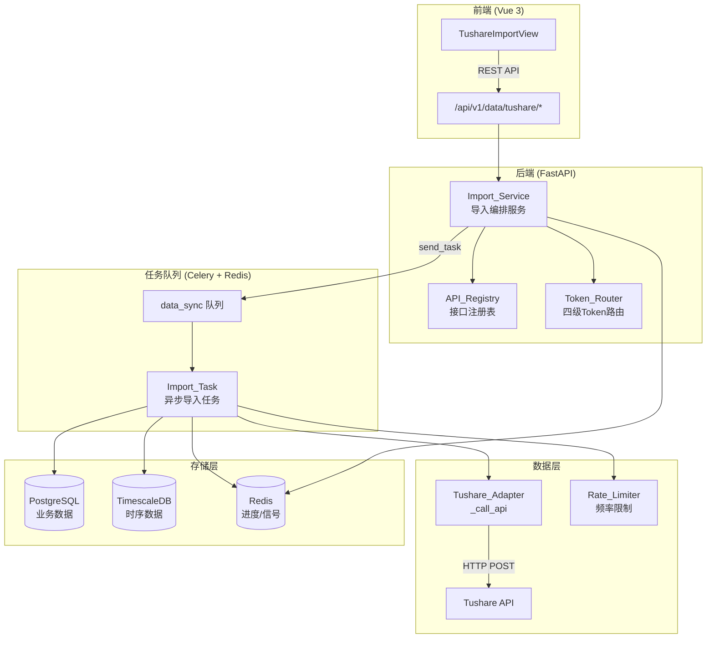
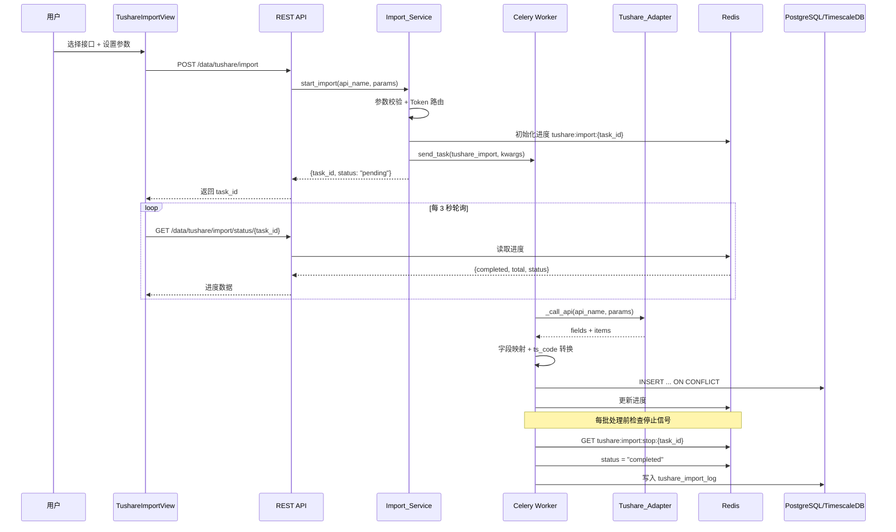
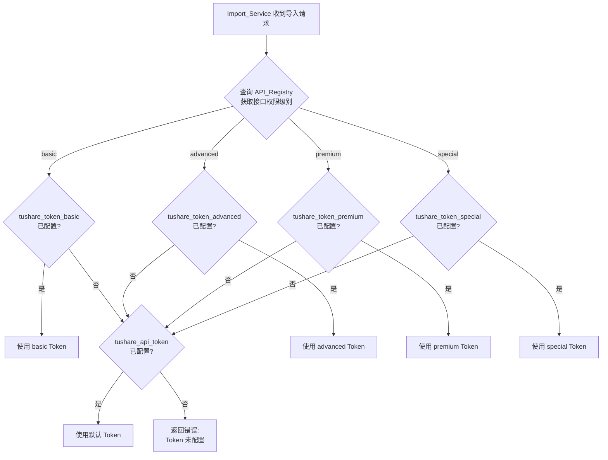

# 设计文档：Tushare 数据在线导入

## Overview

本设计文档描述 Tushare 数据在线导入功能的技术架构和实现方案。该功能在现有 A 股量化交易系统的"数据管理 > 在线数据"菜单下新增"tushare"子菜单，提供 Tushare 平台 120+ 个 API 接口的数据导入能力，覆盖股票基础数据、行情数据（低频/中频）、财务数据、参考数据、特色数据、两融及转融通、资金流向、打板专题以及指数专题等全部数据分类。

### 设计目标

1. **全接口覆盖**：支持 Tushare 平台全部可用数据接口的在线导入，按"股票数据"和"指数专题"两大分类组织
2. **异步任务架构**：通过 Celery + Redis 实现异步导入，支持进度追踪和任务停止控制
3. **四级 Token 路由**：根据接口权限级别（basic/advanced/premium/special）自动选择对应 Token
4. **复用优先**：最大化复用现有表结构（kline、stock_info、sector_info、sector_constituent、sector_kline、adjustment_factor），仅为无法复用的数据新建表
5. **统一数据管道**：通过 API_Registry 注册表驱动导入流程，新增接口只需注册元数据，无需修改核心逻辑

### 核心设计决策

| 决策 | 选择 | 理由 |
|------|------|------|
| 导入编排模式 | 注册表驱动（API_Registry） | 120+ 接口逐个写 handler 不可维护，注册表模式统一字段映射和存储目标 |
| 任务队列 | 复用现有 Celery `data_sync` 队列 | 与现有回填任务共享基础设施，避免新增队列配置 |
| 进度存储 | Redis（与现有 backfill 模式一致） | 轻量、高频更新、自动过期，前端 3 秒轮询 |
| 财务报表存储 | JSONB 单表 + report_type 区分 | 财报字段 50+，逐字段建列不现实，JSONB 灵活且支持 GIN 索引 |
| 板块数据 | 复用 sector_info/sector_constituent/sector_kline | 通过 data_source 枚举区分来源（THS/DC/CI/TDX），减少表数量 |
| Token 选择 | 配置层四级 Token + API_Registry 标注权限 | 运行时自动路由，缺失 Token 回退到默认 |

## Architecture

### 系统架构总览



### 数据流



### 四级 Token 路由流程



## Components and Interfaces

### 1. API_Registry（接口注册表）

**位置**：`app/services/data_engine/tushare_registry.py`

API_Registry 是整个导入系统的核心配置，以声明式方式定义每个 Tushare 接口的元数据。Import_Task 根据注册表信息自动完成字段映射、存储路由和去重策略。

```python
from dataclasses import dataclass, field
from enum import Enum

class TokenTier(str, Enum):
    """Token 权限级别（四级）"""
    BASIC = "basic"         # 2000 积分及以下
    ADVANCED = "advanced"   # 2000-6000 积分（包含6000积分）
    PREMIUM = "premium"     # 6000 积分以上
    SPECIAL = "special"     # 需单独开通权限

class CodeFormat(str, Enum):
    """代码格式要求"""
    STOCK_SYMBOL = "stock_symbol"   # ts_code → 纯6位
    INDEX_CODE = "index_code"       # 保留完整 ts_code
    NONE = "none"                   # 无代码字段

class StorageEngine(str, Enum):
    """存储引擎"""
    PG = "pg"       # PostgreSQL
    TS = "ts"       # TimescaleDB

class ParamType(str, Enum):
    """参数类型"""
    DATE_RANGE = "date_range"
    STOCK_CODE = "stock_code"
    INDEX_CODE = "index_code"
    MARKET = "market"
    REPORT_PERIOD = "report_period"
    FREQ = "freq"
    HS_TYPE = "hs_type"
    SECTOR_CODE = "sector_code"
    MONTH_RANGE = "month_range"
    CONCEPT_CODE = "concept_code"

class RateLimitGroup(str, Enum):
    """频率限制分组"""
    KLINE = "kline"                 # 0.18s
    FUNDAMENTALS = "fundamentals"   # 0.40s
    MONEY_FLOW = "money_flow"       # 0.30s

@dataclass
class FieldMapping:
    """字段映射：Tushare 字段名 → 目标表字段名"""
    source: str          # Tushare 返回字段名
    target: str          # 目标表字段名
    transform: str | None = None  # 可选转换函数名

@dataclass
class ApiEntry:
    """单个 Tushare API 接口注册信息"""
    api_name: str                          # Tushare 接口名
    label: str                             # 中文说明
    category: str                          # 所属大类（stock_data / index_data）
    subcategory: str                       # 所属子分类
    token_tier: TokenTier                  # 权限级别
    target_table: str                      # 目标存储表名
    storage_engine: StorageEngine          # 存储引擎
    code_format: CodeFormat                # 代码格式
    conflict_columns: list[str]            # ON CONFLICT 列
    conflict_action: str = "do_nothing"    # do_nothing / do_update
    update_columns: list[str] = field(default_factory=list)  # do_update 时更新的列
    field_mappings: list[FieldMapping] = field(default_factory=list)
    required_params: list[ParamType] = field(default_factory=list)
    optional_params: list[ParamType] = field(default_factory=list)
    rate_limit_group: RateLimitGroup = RateLimitGroup.KLINE
    batch_by_code: bool = False            # 是否需要按代码分批
    extra_config: dict = field(default_factory=dict)  # 额外配置（如 freq 映射）
    vip_variant: str | None = None         # VIP 批量接口变体名（如 "income_vip"）

# 全局注册表
TUSHARE_API_REGISTRY: dict[str, ApiEntry] = {}

def register(entry: ApiEntry) -> None:
    """注册一个 API 接口"""
    TUSHARE_API_REGISTRY[entry.api_name] = entry

def get_entry(api_name: str) -> ApiEntry | None:
    """获取接口注册信息"""
    return TUSHARE_API_REGISTRY.get(api_name)

def get_all_entries() -> dict[str, ApiEntry]:
    """获取全部注册接口"""
    return TUSHARE_API_REGISTRY

def get_entries_by_category(category: str) -> list[ApiEntry]:
    """按大类获取接口列表"""
    return [e for e in TUSHARE_API_REGISTRY.values() if e.category == category]

def get_entries_by_subcategory(subcategory: str) -> list[ApiEntry]:
    """按子分类获取接口列表"""
    return [e for e in TUSHARE_API_REGISTRY.values() if e.subcategory == subcategory]
```

#### 完整接口注册表

以下列出全部注册接口，按大类和子分类组织。

##### 股票数据 — 基础数据（文档1，13个接口）

| api_name | label | token_tier | target_table | storage | conflict_columns |
|----------|-------|-----------|-------------|---------|-----------------|
| stock_basic | 股票基础列表 | basic | stock_info | PG | [symbol] (do_update) |
| stk_premarket | 每日股本盘前 | special | stk_premarket | PG | [ts_code, trade_date] |
| trade_cal | 交易日历 | basic | trade_calendar | PG | [exchange, cal_date] |
| stock_st | ST股票列表 | advanced | stock_st | PG | — |
| st | ST风险警示板 | advanced | st_warning | PG | [ts_code, trade_date] |
| stock_hsgt | 沪深港通股票列表 | advanced | stock_hsgt | PG | — |
| namechange | 股票曾用名 | basic | stock_namechange | PG | — |
| stock_company | 上市公司基本信息 | basic | stock_company | PG | [ts_code] (do_update) |
| stk_managers | 上市公司管理层 | basic | stk_managers | PG | — |
| stk_rewards | 管理层薪酬 | basic | stk_rewards | PG | — |
| bse_mapping | 北交所新旧代码对照 | basic | bse_mapping | PG | — |
| new_share | IPO新股上市 | basic | new_share | PG | [ts_code] |
| bak_basic | 备用基础信息 | advanced | stock_info | PG | [symbol] (do_update) |

##### 股票数据 — 行情数据低频（文档8，13个接口）

| api_name | label | token_tier | target_table | storage | conflict_columns |
|----------|-------|-----------|-------------|---------|-----------------|
| daily | 日线行情 | basic | kline | TS | [time, symbol, freq, adj_type] |
| weekly | 周线行情 | basic | kline | TS | [time, symbol, freq, adj_type] |
| monthly | 月线行情 | basic | kline | TS | [time, symbol, freq, adj_type] |
| stk_weekly_monthly | 周/月行情每日更新 | basic | kline | TS | [time, symbol, freq, adj_type] |
| adj_factor | 复权因子 | basic | adjustment_factor | TS | — |
| daily_basic | 每日指标 | basic | stock_info | PG | [symbol] (do_update) |
| stk_limit | 每日涨跌停价格 | basic | stk_limit | PG | [ts_code, trade_date] |
| suspend_d | 每日停复牌信息 | basic | suspend_info | PG | — |
| hsgt_top10 | 沪深股通十大成交股 | basic | hsgt_top10 | PG | [trade_date, ts_code, market_type] |
| ggt_top10 | 港股通十大成交股 | basic | ggt_top10 | PG | [trade_date, ts_code, market_type] |
| ggt_daily | 港股通每日成交统计 | basic | ggt_daily | PG | [trade_date] |
| ggt_monthly | 港股通每月成交统计 | advanced | ggt_monthly | PG | [month] |
| bak_daily | 备用行情 | advanced | kline / bak_daily | TS/PG | — |

##### 股票数据 — 行情数据中频（文档8，4个接口）

| api_name | label | token_tier | target_table | storage | conflict_columns |
|----------|-------|-----------|-------------|---------|-----------------|
| stk_mins | 历史分钟行情 | special | kline | TS | [time, symbol, freq, adj_type] |
| rt_k | 实时日线 | special | kline | TS | [time, symbol, freq, adj_type] |
| rt_min | 实时分钟 | special | kline | TS | [time, symbol, freq, adj_type] |
| rt_min_daily | 实时分钟日累计 | special | kline | TS | [time, symbol, freq, adj_type] |

##### 股票数据 — 财务数据（文档7，9个接口 + VIP变体）

| api_name | label | token_tier | target_table | storage | conflict_columns | vip_variant |
|----------|-------|-----------|-------------|---------|-----------------|-------------|
| income | 利润表 | basic | financial_statement | PG | [ts_code, end_date, report_type] | income_vip |
| balancesheet | 资产负债表 | basic | financial_statement | PG | [ts_code, end_date, report_type] | balancesheet_vip |
| cashflow | 现金流量表 | basic | financial_statement | PG | [ts_code, end_date, report_type] | cashflow_vip |
| fina_indicator | 财务指标 | basic | stock_info | PG | [symbol] (do_update) | fina_indicator_vip |
| dividend | 分红送股 | basic | dividend | PG | — | — |
| forecast | 业绩预告 | basic | forecast | PG | [ts_code, end_date] | forecast_vip |
| express | 业绩快报 | basic | express | PG | [ts_code, end_date] | express_vip |
| fina_mainbz | 主营业务构成 | basic | fina_mainbz | PG | [ts_code, end_date, bz_item] | fina_mainbz_vip |
| disclosure_date | 财报披露日期表 | basic | disclosure_date | PG | [ts_code, end_date] | — |

> VIP 批量接口（如 income_vip）使用 advanced 权限级别 Token，支持批量查询，在 API_Registry 中通过 `vip_variant` 字段关联。

##### 股票数据 — 参考数据（文档6，12个接口）

| api_name | label | token_tier | target_table | storage | conflict_columns |
|----------|-------|-----------|-------------|---------|-----------------|
| stk_shock | 个股异常波动 | advanced | stk_shock | PG | [ts_code, trade_date, shock_type] |
| stk_high_shock | 个股严重异常波动 | advanced | stk_high_shock | PG | [ts_code, trade_date, shock_type] |
| stk_alert | 交易所重点提示证券 | advanced | stk_alert | PG | — |
| top10_holders | 前十大股东 | basic | top_holders | PG | [ts_code, end_date, holder_name, holder_type] |
| top10_floatholders | 前十大流通股东 | basic | top_holders | PG | [ts_code, end_date, holder_name, holder_type] |
| pledge_stat | 股权质押统计 | basic | pledge_stat | PG | [ts_code, end_date] |
| pledge_detail | 股权质押明细 | basic | pledge_detail | PG | — |
| repurchase | 股票回购 | basic | repurchase | PG | — |
| share_float | 限售股解禁 | basic | share_float | PG | — |
| block_trade | 大宗交易 | basic | block_trade | PG | [ts_code, trade_date, buyer, seller] |
| stk_holdernumber | 股东人数 | basic | stk_holdernumber | PG | — |
| stk_holdertrade | 股东增减持 | basic | stk_holdertrade | PG | — |

##### 股票数据 — 特色数据（文档5，13个接口）

| api_name | label | token_tier | target_table | storage | conflict_columns |
|----------|-------|-----------|-------------|---------|-----------------|
| report_rc | 券商盈利预测 | premium | report_rc | PG | — |
| cyq_perf | 每日筹码及胜率 | advanced | cyq_perf | PG | [ts_code, trade_date] |
| cyq_chips | 每日筹码分布 | advanced | cyq_chips | PG | — |
| stk_factor_pro | 股票技术面因子专业版 | advanced | stk_factor | PG | [ts_code, trade_date] (do_update) |
| ccass_hold | 中央结算系统持股统计 | advanced | ccass_hold | PG | — |
| ccass_hold_detail | 中央结算系统持股明细 | premium | ccass_hold_detail | PG | — |
| hk_hold | 沪深股通持股明细 | basic | hk_hold | PG | [ts_code, trade_date, exchange] |
| stk_auction_o | 股票开盘集合竞价 | special | stk_auction_o | PG | [ts_code, trade_date] |
| stk_auction_c | 股票收盘集合竞价 | special | stk_auction_c | PG | [ts_code, trade_date] |
| stk_nineturn | 神奇九转指标 | advanced | stk_nineturn | PG | [ts_code, trade_date, turn_type] |
| stk_ah_comparison | AH股比价 | advanced | stk_ah_comparison | PG | [ts_code, trade_date] |
| stk_surv | 机构调研数据 | advanced | stk_surv | PG | — |
| broker_recommend | 券商每月金股 | advanced | broker_recommend | PG | — |

##### 股票数据 — 两融及转融通（文档4，4个接口）

| api_name | label | token_tier | target_table | storage | conflict_columns |
|----------|-------|-----------|-------------|---------|-----------------|
| margin | 融资融券汇总 | basic | margin_data | PG | [trade_date, exchange_id] |
| margin_detail | 融资融券交易明细 | basic | margin_detail | PG | [ts_code, trade_date] |
| margin_secs | 融资融券标的盘前 | basic | margin_secs | PG | — |
| slb_len | 转融资交易汇总 | basic | slb_len | PG | — |

##### 股票数据 — 资金流向数据（文档3，8个接口）

| api_name | label | token_tier | target_table | storage | conflict_columns |
|----------|-------|-----------|-------------|---------|-----------------|
| moneyflow | 个股资金流向 | basic | money_flow | PG | [ts_code, trade_date] |
| moneyflow_ths | 个股资金流向THS | advanced | moneyflow_ths | PG | [ts_code, trade_date] |
| moneyflow_dc | 个股资金流向DC | advanced | moneyflow_dc | PG | [ts_code, trade_date] |
| moneyflow_cnt_ths | 板块资金流向THS | advanced | moneyflow_cnt_ths | PG | — |
| moneyflow_ind_ths | 行业资金流向THS | advanced | moneyflow_ind | PG | — |
| moneyflow_ind_dc | 板块资金流向DC | advanced | moneyflow_ind | PG | — |
| moneyflow_mkt_dc | 大盘资金流向DC | advanced | moneyflow_mkt_dc | PG | [trade_date] |
| moneyflow_hsgt | 沪港通资金流向 | basic | moneyflow_hsgt | PG | [trade_date] |

##### 股票数据 — 打板专题数据（文档2，24个接口）

| api_name | label | token_tier | target_table | storage | conflict_columns |
|----------|-------|-----------|-------------|---------|-----------------|
| top_list | 龙虎榜每日统计单 | basic | top_list | PG | [trade_date, ts_code, reason] |
| top_inst | 龙虎榜机构交易单 | advanced | top_inst | PG | [trade_date, ts_code, exalter] |
| limit_list_ths | 同花顺涨跌停榜单 | premium | limit_list_ths | PG | [ts_code, trade_date, limit] |
| limit_list_d | 涨跌停和炸板数据 | advanced | limit_list | PG | [ts_code, trade_date, limit] |
| limit_step | 涨停股票连板天梯 | premium | limit_step | PG | [ts_code, trade_date] |
| limit_cpt_list | 涨停最强板块统计 | premium | limit_cpt_list | PG | — |
| ths_index | 同花顺行业概念板块 | advanced | sector_info | PG | [sector_code, data_source] (do_update) |
| ths_daily | 同花顺行业概念指数行情 | advanced | sector_kline | TS | — |
| ths_member | 同花顺行业概念成分 | advanced | sector_constituent | PG | — |
| dc_index | 东方财富概念板块 | advanced | sector_info | PG | [sector_code, data_source] (do_update) |
| dc_member | 东方财富概念成分 | advanced | sector_constituent | PG | — |
| dc_daily | 东方财富概念板块行情 | advanced | sector_kline | TS | — |
| stk_auction | 开盘竞价成交当日 | special | stk_auction | PG | [ts_code, trade_date] |
| hm_list | 市场游资名录 | advanced | hm_list | PG | — |
| hm_detail | 游资交易每日明细 | premium | hm_detail | PG | — |
| ths_hot | 同花顺热榜 | advanced | ths_hot | PG | — |
| dc_hot | 东方财富热榜 | premium | dc_hot | PG | — |
| tdx_index | 通达信板块信息 | advanced | sector_info | PG | [sector_code, data_source] (do_update) |
| tdx_member | 通达信板块成分 | advanced | sector_constituent | PG | — |
| tdx_daily | 通达信板块行情 | advanced | sector_kline | TS | — |
| kpl_list | 开盘啦榜单数据 | advanced | kpl_list | PG | — |
| kpl_concept_cons | 开盘啦题材成分 | advanced | kpl_concept_cons | PG | — |
| dc_concept | 东方财富题材库 | advanced | dc_concept | PG | — |
| dc_concept_cons | 东方财富题材成分 | advanced | dc_concept_cons | PG | — |

##### 指数专题 — 指数基本信息（1个接口）

| api_name | label | token_tier | target_table | storage | conflict_columns |
|----------|-------|-----------|-------------|---------|-----------------|
| index_basic | 指数基本信息 | basic | index_info | PG | [ts_code] (do_update) |

##### 指数专题 — 指数行情低频（3个接口）

| api_name | label | token_tier | target_table | storage | conflict_columns |
|----------|-------|-----------|-------------|---------|-----------------|
| index_daily | 指数日线行情 | advanced | kline | TS | [time, symbol, freq, adj_type] |
| index_weekly | 指数周线行情 | basic | kline | TS | [time, symbol, freq, adj_type] |
| index_monthly | 指数月线行情 | basic | kline | TS | [time, symbol, freq, adj_type] |

##### 指数专题 — 指数行情中频（4个接口）

| api_name | label | token_tier | target_table | storage | conflict_columns |
|----------|-------|-----------|-------------|---------|-----------------|
| rt_idx_k | 指数实时日线 | special | kline | TS | [time, symbol, freq, adj_type] |
| rt_idx_min | 指数实时分钟 | special | kline | TS | [time, symbol, freq, adj_type] |
| rt_idx_min_daily | 指数实时分钟日累计 | special | kline | TS | [time, symbol, freq, adj_type] |
| idx_mins | 指数历史分钟行情 | special | kline | TS | [time, symbol, freq, adj_type] |

##### 指数专题 — 指数成分和权重（1个接口）

| api_name | label | token_tier | target_table | storage | conflict_columns |
|----------|-------|-----------|-------------|---------|-----------------|
| index_weight | 指数成分权重 | advanced | index_weight | PG | [index_code, con_code, trade_date] |

##### 指数专题 — 申万行业数据（4个接口）

| api_name | label | token_tier | target_table | storage | conflict_columns |
|----------|-------|-----------|-------------|---------|-----------------|
| index_classify | 申万行业分类 | advanced | sector_info | PG | [sector_code, data_source] (do_update) |
| index_member_all | 申万行业成分（分级） | advanced | sector_constituent | PG | — |
| sw_daily | 申万行业指数日行情 | advanced | sector_kline | TS | — |
| rt_sw_k | 申万实时行情 | special | sector_kline | TS | — |

##### 指数专题 — 中信行业数据（2个接口）

| api_name | label | token_tier | target_table | storage | conflict_columns |
|----------|-------|-----------|-------------|---------|-----------------|
| ci_index_member | 中信行业成分 | advanced | sector_constituent | PG | — |
| ci_daily | 中信行业行情 | advanced | sector_kline | TS | — |

##### 指数专题 — 大盘指数每日指标（1个接口）

| api_name | label | token_tier | target_table | storage | conflict_columns |
|----------|-------|-----------|-------------|---------|-----------------|
| index_dailybasic | 大盘指数每日指标 | basic | index_dailybasic | PG | [ts_code, trade_date] |

##### 指数专题 — 指数技术面因子（1个接口）

| api_name | label | token_tier | target_table | storage | conflict_columns |
|----------|-------|-----------|-------------|---------|-----------------|
| idx_factor_pro | 指数技术面因子（专业版） | advanced | index_tech | PG | [ts_code, trade_date] |

##### 指数专题 — 沪深市场每日交易统计（2个接口）

| api_name | label | token_tier | target_table | storage | conflict_columns |
|----------|-------|-----------|-------------|---------|-----------------|
| daily_info | 沪深市场每日交易统计 | basic | market_daily_info | PG | [trade_date, exchange, ts_code] |
| sz_daily_info | 深圳市场每日交易情况 | advanced | sz_daily_info | PG | [trade_date, ts_code] |

##### 指数专题 — 国际主要指数（1个接口）

| api_name | label | token_tier | target_table | storage | conflict_columns |
|----------|-------|-----------|-------------|---------|-----------------|
| index_global | 国际主要指数 | advanced | index_global | PG | [ts_code, trade_date] |

### 2. Import_Service（导入编排服务）

**位置**：`app/services/data_engine/tushare_import_service.py`

Import_Service 是导入功能的编排层，负责参数校验、Token 路由、任务分发和进度管理。设计模式参考现有 `BackfillService`。

```python
class TushareImportService:
    """Tushare 数据导入编排服务"""

    async def start_import(
        self,
        api_name: str,
        params: dict,
    ) -> dict:
        """
        启动导入任务。

        1. 从 API_Registry 获取接口元数据
        2. 校验必填参数
        3. 根据 token_tier 选择 Token（四级路由）
        4. 在 tushare_import_log 中创建记录（status="running"）
        5. 初始化 Redis 进度
        6. 分发 Celery 任务

        Returns:
            {"task_id": str, "log_id": int, "status": "pending"}
        """

    async def stop_import(self, task_id: str) -> dict:
        """
        停止导入任务。

        1. 在 Redis 设置停止信号 tushare:import:stop:{task_id}
        2. 更新 Redis 进度状态为 "stopped"
        3. 撤销 Celery 任务

        Returns:
            {"message": str}
        """

    async def get_import_status(self, task_id: str) -> dict:
        """
        获取导入任务进度。

        从 Redis 读取 tushare:import:{task_id} 键。

        Returns:
            {total, completed, failed, status, current_item}
        """

    async def get_import_history(self, limit: int = 20) -> list[dict]:
        """
        获取最近导入历史记录。

        从 tushare_import_log 表查询最近 N 条记录。
        """

    async def check_health(self) -> dict:
        """
        检查 Tushare 连通性和 Token 配置状态。

        Returns:
            {
                "connected": bool,
                "tokens": {
                    "basic": {"configured": bool},
                    "advanced": {"configured": bool},
                    "premium": {"configured": bool},
                    "special": {"configured": bool},
                }
            }
        """

    def _resolve_token(self, tier: TokenTier) -> str:
        """
        根据权限级别选择 Token（四级路由）。

        优先使用对应级别 Token，未配置则回退到 tushare_api_token。
        路由顺序：basic → tushare_token_basic → fallback
                  advanced → tushare_token_advanced → fallback
                  premium → tushare_token_premium → fallback
                  special → tushare_token_special → fallback
        """

    def _validate_params(self, entry: ApiEntry, params: dict) -> dict:
        """
        校验并规范化导入参数。

        检查必填参数、日期格式、代码格式等。
        """
```

### 3. Import_Task（异步导入任务）

**位置**：`app/tasks/tushare_import.py`

Import_Task 是 Celery 异步任务，执行实际的 API 调用、数据转换和数据库写入。继承现有 `DataSyncTask` 基类。

```python
@celery_app.task(base=DataSyncTask, name="app.tasks.tushare_import.run_import")
def run_import(
    api_name: str,
    params: dict,
    token: str,
    log_id: int,
    task_id: str,
) -> dict:
    """
    执行 Tushare 数据导入。

    流程：
    1. 从 API_Registry 获取接口元数据
    2. 创建 TushareAdapter（使用指定 Token）
    3. 如果 batch_by_code=True，按 BATCH_SIZE=50 分批处理
    4. 每批：
       a. 检查停止信号
       b. 调用 _call_api 获取数据
       c. 按 field_mappings 转换字段
       d. 按 code_format 转换代码格式
       e. 写入目标表（ON CONFLICT 去重）
       f. 更新 Redis 进度
       g. 按 rate_limit_group 等待
    5. 完成后更新 tushare_import_log
    """
```

核心处理逻辑：

```python
async def _process_import(
    entry: ApiEntry,
    adapter: TushareAdapter,
    params: dict,
    task_id: str,
    log_id: int,
) -> dict:
    """导入核心处理逻辑"""

    # 获取数据
    data = await adapter._call_api(entry.api_name, **params)
    rows = TushareAdapter._rows_from_data(data)

    if not rows:
        return {"record_count": 0}

    # 字段映射 + 代码转换
    mapped_rows = _apply_field_mappings(rows, entry)
    converted_rows = _convert_codes(mapped_rows, entry)

    # 写入数据库
    if entry.storage_engine == StorageEngine.TS:
        await _write_to_timescaledb(converted_rows, entry)
    else:
        await _write_to_postgresql(converted_rows, entry)

    return {"record_count": len(converted_rows)}


def _apply_field_mappings(rows: list[dict], entry: ApiEntry) -> list[dict]:
    """应用字段映射，将 Tushare 字段名转换为目标表字段名"""

def _convert_codes(rows: list[dict], entry: ApiEntry) -> list[dict]:
    """根据 code_format 转换代码格式"""
    # STOCK_SYMBOL: 600000.SH → 600000
    # INDEX_CODE: 保留原样
    # NONE: 不处理

async def _write_to_postgresql(rows: list[dict], entry: ApiEntry) -> None:
    """写入 PostgreSQL，使用 ON CONFLICT 策略"""

async def _write_to_timescaledb(rows: list[dict], entry: ApiEntry) -> None:
    """写入 TimescaleDB kline 超表，使用 ON CONFLICT 策略"""
```

### 4. REST API 端点

**位置**：`app/api/v1/tushare.py`（新建独立路由模块）

在 `app/api/v1/__init__.py` 中注册新路由，前缀 `/data/tushare`。

```python
from fastapi import APIRouter

router = APIRouter(prefix="/data/tushare", tags=["tushare"])

# --- 健康检查 ---
@router.get("/health")
async def check_tushare_health() -> TushareHealthResponse:
    """检查 Tushare 连通性和 Token 配置状态"""

# --- 接口注册表 ---
@router.get("/registry")
async def get_api_registry() -> list[ApiRegistryItem]:
    """获取全部可导入接口列表（前端渲染菜单用）"""

# --- 导入控制 ---
@router.post("/import")
async def start_import(body: TushareImportRequest) -> TushareImportResponse:
    """启动导入任务"""

@router.get("/import/status/{task_id}")
async def get_import_status(task_id: str) -> TushareImportStatusResponse:
    """获取导入任务进度"""

@router.post("/import/stop/{task_id}")
async def stop_import(task_id: str) -> TushareImportStopResponse:
    """停止导入任务"""

# --- 导入历史 ---
@router.get("/import/history")
async def get_import_history(limit: int = 20) -> list[TushareImportLogItem]:
    """获取最近导入记录"""
```

**请求/响应模型**：

```python
from pydantic import BaseModel

class TushareImportRequest(BaseModel):
    api_name: str                    # Tushare 接口名
    params: dict = {}                # 导入参数（日期范围、代码等）

class TushareImportResponse(BaseModel):
    task_id: str
    log_id: int
    status: str                      # "pending"

class TushareImportStatusResponse(BaseModel):
    total: int
    completed: int
    failed: int
    status: str                      # pending/running/completed/failed/stopped
    current_item: str

class TushareHealthResponse(BaseModel):
    connected: bool
    tokens: dict                     # {basic: {configured: bool}, advanced: ..., premium: ..., special: ...}

class ApiRegistryItem(BaseModel):
    api_name: str
    label: str
    category: str
    subcategory: str
    token_tier: str
    required_params: list[str]
    optional_params: list[str]
    token_available: bool            # 对应 Token 是否已配置
    vip_variant: str | None = None   # VIP 批量接口变体名
```

### 5. TushareImportView（前端组件）

**位置**：`frontend/src/views/TushareImportView.vue`

```
┌─────────────────────────────────────────────────────────────────┐
│  Tushare 数据导入                                                │
│  ┌──────────────────────────────────────────────────────────┐   │
│  │ 连接状态: ✅ 已连接                                       │   │
│  │ Token: 基础✅  高级✅  专业✅  特殊❌      [重新检测]     │   │
│  └──────────────────────────────────────────────────────────┘   │
│                                                                  │
│  ┌─ 股票数据 ──────────────────────────────────────────────┐   │
│  │ ▸ 基础数据（13个接口）                                    │   │
│  │   ├ stock_basic  股票基础列表     [基础] [开始导入]       │   │
│  │   ├ stk_premarket 每日股本盘前   [特殊] [日期] [开始导入]│   │
│  │   ├ trade_cal    交易日历         [基础] [开始导入]       │   │
│  │   └ ...                                                   │   │
│  │ ▸ 行情数据（低频：日K/周K/月K）（13个接口）               │   │
│  │   ├ daily        日线行情         [基础] [日期] [开始导入]│   │
│  │   ├ hsgt_top10   沪深股通十大成交 [基础] [日期] [开始导入]│   │
│  │   └ ...                                                   │   │
│  │ ▸ 行情数据（中频：分钟级/实时）（4个接口）                │   │
│  │   ├ stk_mins     历史分钟行情     [高级] [日期] [开始导入]│   │
│  │   ├ rt_k         实时日线         [特殊] [日期] [开始导入]│   │
│  │   └ ⚠️ 分钟级数据量较大，建议按单只股票或短日期范围分批导入│   │
│  │ ▸ 财务数据（9个接口 + VIP变体）                           │   │
│  │ ▸ 参考数据（12个接口）                                    │   │
│  │ ▸ 特色数据（13个接口）                                    │   │
│  │ ▸ 两融及转融通（4个接口）                                 │   │
│  │ ▸ 资金流向数据（8个接口）                                 │   │
│  │ ▸ 打板专题数据（24个接口）                                │   │
│  └──────────────────────────────────────────────────────────┘   │
│                                                                  │
│  ┌─ 指数专题 ──────────────────────────────────────────────┐   │
│  │ ▸ 指数基本信息（1个接口）                                 │   │
│  │ ▸ 指数行情数据（低频：日线/周线/月线）（3个接口）         │   │
│  │ ▸ 指数行情数据（中频：实时日线/实时分钟/历史分钟）（4个接口）│  │
│  │ ▸ 指数成分和权重（1个接口）                               │   │
│  │ ▸ 申万行业数据（分类/成分/日线/实时）（4个接口）          │   │
│  │ ▸ 中信行业数据（成分/日线）（2个接口）                    │   │
│  │ ▸ 大盘指数每日指标（1个接口）                             │   │
│  │ ▸ 指数技术面因子（专业版）（1个接口）                     │   │
│  │ ▸ 沪深市场每日交易统计（2个接口）                         │   │
│  │ ▸ 深圳市场每日交易情况                                    │   │
│  │ ▸ 国际主要指数（1个接口）                                 │   │
│  └──────────────────────────────────────────────────────────┘   │
│                                                                  │
│  ┌─ 活跃任务 ──────────────────────────────────────────────┐   │
│  │ daily 日线行情  ████████░░ 80%  已完成 40/50  [停止导入] │   │
│  └──────────────────────────────────────────────────────────┘   │
│                                                                  │
│  ┌─ 导入历史 ──────────────────────────────────────────────┐   │
│  │ 接口名称    导入时间           数据量   状态   耗时       │   │
│  │ stock_basic 2024-01-15 10:30  5200条  ✅成功  3.2s      │   │
│  │ daily       2024-01-15 10:25  12000条 ✅成功  45.6s     │   │
│  │ moneyflow   2024-01-15 10:20  0条     ❌失败  1.2s      │   │
│  └──────────────────────────────────────────────────────────┘   │
└─────────────────────────────────────────────────────────────────┘
```

**组件结构**：

```typescript
// TushareImportView.vue 核心状态
interface ApiItem {
  api_name: string
  label: string
  category: string
  subcategory: string
  token_tier: string       // "basic" | "advanced" | "premium" | "special"
  required_params: string[]
  optional_params: string[]
  token_available: boolean
  vip_variant: string | null
}

interface ImportTask {
  task_id: string
  api_name: string
  status: 'pending' | 'running' | 'completed' | 'failed' | 'stopped'
  total: number
  completed: number
  failed: number
  current_item: string
}

interface ImportLog {
  id: number
  api_name: string
  status: string
  record_count: number
  error_message: string | null
  started_at: string
  finished_at: string | null
}

// 页面加载时：
// 1. GET /data/tushare/health → 连接状态 + Token 配置（四级）
// 2. GET /data/tushare/registry → 接口列表（按 category/subcategory 分组渲染）
// 3. GET /data/tushare/import/history → 导入历史

// 用户点击"开始导入"：
// 1. POST /data/tushare/import → 获取 task_id
// 2. 每 3 秒 GET /data/tushare/import/status/{task_id} → 更新进度

// 用户点击"停止导入"：
// 1. POST /data/tushare/import/stop/{task_id}
```

### 6. 配置扩展

**位置**：`app/core/config.py`

```python
# 四级 Token 配置
tushare_token_basic: str = ""       # 2000 积分及以下
tushare_token_advanced: str = ""    # 2000-6000 积分（包含6000积分）
tushare_token_premium: str = ""     # 6000 积分以上
tushare_token_special: str = ""     # 需单独开通权限
# 原有 tushare_api_token 保留作为默认 fallback
```

对应 `.env` 配置项：

```
TUSHARE_TOKEN_BASIC=
TUSHARE_TOKEN_ADVANCED=
TUSHARE_TOKEN_PREMIUM=
TUSHARE_TOKEN_SPECIAL=
```

### 7. 路由注册

**位置**：`frontend/src/router/index.ts`

```typescript
// 在 MainLayout children 中新增
{
  path: 'data/online/tushare',
  name: 'DataOnlineTushare',
  component: () => import('@/views/TushareImportView.vue'),
  meta: { title: 'Tushare 数据导入' },
}
```

**位置**：`frontend/src/layouts/MainLayout.vue`

将"在线数据"菜单项改为可展开的父菜单：

```typescript
{
  path: '/data/online', label: '在线数据', icon: '🌐',
  children: [
    { path: '/data/online', label: '数据总览', icon: '📊' },
    { path: '/data/online/tushare', label: 'tushare', icon: '📡' },
  ],
},
```


## Data Models

### 现有表复用（无需新建）

| 表名 | 引擎 | 复用场景 |
|------|------|---------|
| `kline` | TimescaleDB | 股票日K/周K/月K/分钟K + 指数日线/周线/月线/分钟 + 实时行情（含 rt_idx_k/rt_idx_min/rt_idx_min_daily/idx_mins） |
| `adjustment_factor` | TimescaleDB | 复权因子 |
| `stock_info` | PostgreSQL | stock_basic/fina_indicator/daily_basic/bak_basic 更新 |
| `sector_info` | PostgreSQL | index_classify/ths_index/dc_index/tdx_index（data_source 区分） |
| `sector_constituent` | PostgreSQL | ths_member/dc_member/tdx_member/index_member_all/ci_index_member（data_source 区分） |
| `sector_kline` | TimescaleDB | sw_daily/rt_sw_k/ci_daily/ths_daily/dc_daily/tdx_daily（data_source 区分） |

### 枚举扩展

```python
# app/models/sector.py - DataSource 枚举新增值
class DataSource(str, Enum):
    DC = "DC"      # 东方财富
    TI = "TI"      # 申万行业（原有，保留）
    TDX = "TDX"    # 通达信
    CI = "CI"       # 中信行业（新增）
    THS = "THS"     # 同花顺概念/行业板块（新增）
```

### 新建表（PostgreSQL / PGBase）

以下所有新表均使用 SQLAlchemy 2.0 `Mapped[]` + `mapped_column()` 声明式风格，继承 `PGBase`。

#### 1. tushare_import_log（导入日志）

```python
class TushareImportLog(PGBase):
    __tablename__ = "tushare_import_log"

    id: Mapped[int] = mapped_column(primary_key=True, autoincrement=True)
    api_name: Mapped[str] = mapped_column(String(50), nullable=False)
    params_json: Mapped[dict | None] = mapped_column(JSONB, nullable=True)
    status: Mapped[str] = mapped_column(String(20), nullable=False)  # running/completed/failed/stopped
    record_count: Mapped[int] = mapped_column(default=0)
    error_message: Mapped[str | None] = mapped_column(String(500), nullable=True)
    celery_task_id: Mapped[str | None] = mapped_column(String(50), nullable=True)
    started_at: Mapped[datetime] = mapped_column(TIMESTAMPTZ, server_default=sa_text("NOW()"))
    finished_at: Mapped[datetime | None] = mapped_column(TIMESTAMPTZ, nullable=True)
```

#### 2. trade_calendar（交易日历）

```python
class TradeCalendar(PGBase):
    __tablename__ = "trade_calendar"

    exchange: Mapped[str] = mapped_column(String(10), primary_key=True)
    cal_date: Mapped[date] = mapped_column(Date, primary_key=True)
    is_open: Mapped[bool] = mapped_column(Boolean, nullable=False)
```

#### 3. financial_statement（财务报表 — JSONB 存储）

```python
class FinancialStatement(PGBase):
    __tablename__ = "financial_statement"

    id: Mapped[int] = mapped_column(primary_key=True, autoincrement=True)
    ts_code: Mapped[str] = mapped_column(String(10), nullable=False)
    ann_date: Mapped[str | None] = mapped_column(String(8), nullable=True)
    end_date: Mapped[str] = mapped_column(String(8), nullable=False)
    report_type: Mapped[str] = mapped_column(String(20), nullable=False)  # income/balance/cashflow
    data_json: Mapped[dict] = mapped_column(JSONB, nullable=False)

    __table_args__ = (
        UniqueConstraint("ts_code", "end_date", "report_type", name="uq_financial_statement"),
    )
```

#### 4. dividend（分红送股）

```python
class Dividend(PGBase):
    __tablename__ = "dividend"

    id: Mapped[int] = mapped_column(primary_key=True, autoincrement=True)
    ts_code: Mapped[str] = mapped_column(String(10), nullable=False)
    ann_date: Mapped[str | None] = mapped_column(String(8), nullable=True)
    end_date: Mapped[str | None] = mapped_column(String(8), nullable=True)
    div_proc: Mapped[str | None] = mapped_column(String(20), nullable=True)
    stk_div: Mapped[Decimal | None] = mapped_column(Numeric(10, 4), nullable=True)
    cash_div: Mapped[Decimal | None] = mapped_column(Numeric(10, 4), nullable=True)
```

#### 5. forecast（业绩预告）

```python
class Forecast(PGBase):
    __tablename__ = "forecast"

    id: Mapped[int] = mapped_column(primary_key=True, autoincrement=True)
    ts_code: Mapped[str] = mapped_column(String(10), nullable=False)
    ann_date: Mapped[str | None] = mapped_column(String(8), nullable=True)
    end_date: Mapped[str] = mapped_column(String(8), nullable=False)
    type: Mapped[str | None] = mapped_column(String(20), nullable=True)
    p_change_min: Mapped[Decimal | None] = mapped_column(Numeric(10, 2), nullable=True)
    p_change_max: Mapped[Decimal | None] = mapped_column(Numeric(10, 2), nullable=True)
    net_profit_min: Mapped[Decimal | None] = mapped_column(Numeric(20, 2), nullable=True)
    net_profit_max: Mapped[Decimal | None] = mapped_column(Numeric(20, 2), nullable=True)
    summary: Mapped[str | None] = mapped_column(String(1000), nullable=True)

    __table_args__ = (
        UniqueConstraint("ts_code", "end_date", name="uq_forecast"),
    )
```

#### 6. express（业绩快报）

```python
class Express(PGBase):
    __tablename__ = "express"

    id: Mapped[int] = mapped_column(primary_key=True, autoincrement=True)
    ts_code: Mapped[str] = mapped_column(String(10), nullable=False)
    ann_date: Mapped[str | None] = mapped_column(String(8), nullable=True)
    end_date: Mapped[str] = mapped_column(String(8), nullable=False)
    revenue: Mapped[Decimal | None] = mapped_column(Numeric(20, 2), nullable=True)
    operate_profit: Mapped[Decimal | None] = mapped_column(Numeric(20, 2), nullable=True)
    total_profit: Mapped[Decimal | None] = mapped_column(Numeric(20, 2), nullable=True)
    n_income: Mapped[Decimal | None] = mapped_column(Numeric(20, 2), nullable=True)
    total_assets: Mapped[Decimal | None] = mapped_column(Numeric(20, 2), nullable=True)
    total_hldr_eqy_exc_min_int: Mapped[Decimal | None] = mapped_column(Numeric(20, 2), nullable=True)
    diluted_eps: Mapped[Decimal | None] = mapped_column(Numeric(10, 4), nullable=True)
    yoy_net_profit: Mapped[Decimal | None] = mapped_column(Numeric(10, 4), nullable=True)
    bps: Mapped[Decimal | None] = mapped_column(Numeric(10, 4), nullable=True)
    perf_summary: Mapped[str | None] = mapped_column(String(1000), nullable=True)

    __table_args__ = (
        UniqueConstraint("ts_code", "end_date", name="uq_express"),
    )
```

#### 7. fina_mainbz（主营业务构成）

```python
class FinaMainbz(PGBase):
    __tablename__ = "fina_mainbz"

    id: Mapped[int] = mapped_column(primary_key=True, autoincrement=True)
    ts_code: Mapped[str] = mapped_column(String(10), nullable=False)
    end_date: Mapped[str] = mapped_column(String(8), nullable=False)
    bz_item: Mapped[str] = mapped_column(String(100), nullable=False)
    bz_sales: Mapped[Decimal | None] = mapped_column(Numeric(20, 2), nullable=True)
    bz_profit: Mapped[Decimal | None] = mapped_column(Numeric(20, 2), nullable=True)
    bz_cost: Mapped[Decimal | None] = mapped_column(Numeric(20, 2), nullable=True)
    curr_type: Mapped[str | None] = mapped_column(String(10), nullable=True)

    __table_args__ = (
        UniqueConstraint("ts_code", "end_date", "bz_item", name="uq_fina_mainbz"),
    )
```

#### 8. disclosure_date（财报披露日期表）

```python
class DisclosureDate(PGBase):
    __tablename__ = "disclosure_date"

    id: Mapped[int] = mapped_column(primary_key=True, autoincrement=True)
    ts_code: Mapped[str] = mapped_column(String(10), nullable=False)
    ann_date: Mapped[str | None] = mapped_column(String(8), nullable=True)
    end_date: Mapped[str] = mapped_column(String(8), nullable=False)
    pre_date: Mapped[str | None] = mapped_column(String(8), nullable=True)
    actual_date: Mapped[str | None] = mapped_column(String(8), nullable=True)

    __table_args__ = (
        UniqueConstraint("ts_code", "end_date", name="uq_disclosure_date"),
    )
```

#### 9. index_info（指数基本信息）

```python
class IndexInfo(PGBase):
    __tablename__ = "index_info"

    ts_code: Mapped[str] = mapped_column(String(20), primary_key=True)
    name: Mapped[str | None] = mapped_column(String(100), nullable=True)
    market: Mapped[str | None] = mapped_column(String(20), nullable=True)
    publisher: Mapped[str | None] = mapped_column(String(50), nullable=True)
    category: Mapped[str | None] = mapped_column(String(50), nullable=True)
    base_date: Mapped[str | None] = mapped_column(String(8), nullable=True)
    base_point: Mapped[Decimal | None] = mapped_column(Numeric(10, 2), nullable=True)
    list_date: Mapped[str | None] = mapped_column(String(8), nullable=True)
```

#### 10. index_weight（指数成分权重）

```python
class IndexWeight(PGBase):
    __tablename__ = "index_weight"

    id: Mapped[int] = mapped_column(primary_key=True, autoincrement=True)
    index_code: Mapped[str] = mapped_column(String(20), nullable=False)
    con_code: Mapped[str] = mapped_column(String(20), nullable=False)
    trade_date: Mapped[str] = mapped_column(String(8), nullable=False)
    weight: Mapped[Decimal | None] = mapped_column(Numeric(10, 6), nullable=True)

    __table_args__ = (
        UniqueConstraint("index_code", "con_code", "trade_date", name="uq_index_weight"),
    )
```

#### 11. index_dailybasic（大盘指数每日指标）

```python
class IndexDailybasic(PGBase):
    __tablename__ = "index_dailybasic"

    id: Mapped[int] = mapped_column(primary_key=True, autoincrement=True)
    ts_code: Mapped[str] = mapped_column(String(20), nullable=False)
    trade_date: Mapped[str] = mapped_column(String(8), nullable=False)
    pe: Mapped[Decimal | None] = mapped_column(Numeric(10, 4), nullable=True)
    pb: Mapped[Decimal | None] = mapped_column(Numeric(10, 4), nullable=True)
    turnover_rate: Mapped[Decimal | None] = mapped_column(Numeric(10, 4), nullable=True)
    total_mv: Mapped[Decimal | None] = mapped_column(Numeric(20, 2), nullable=True)
    float_mv: Mapped[Decimal | None] = mapped_column(Numeric(20, 2), nullable=True)

    __table_args__ = (
        UniqueConstraint("ts_code", "trade_date", name="uq_index_dailybasic"),
    )
```

#### 12. money_flow（个股资金流向）

```python
class MoneyFlow(PGBase):
    __tablename__ = "money_flow"

    id: Mapped[int] = mapped_column(primary_key=True, autoincrement=True)
    ts_code: Mapped[str] = mapped_column(String(10), nullable=False)
    trade_date: Mapped[str] = mapped_column(String(8), nullable=False)
    buy_sm_amount: Mapped[Decimal | None] = mapped_column(Numeric(20, 2), nullable=True)
    sell_sm_amount: Mapped[Decimal | None] = mapped_column(Numeric(20, 2), nullable=True)
    buy_md_amount: Mapped[Decimal | None] = mapped_column(Numeric(20, 2), nullable=True)
    sell_md_amount: Mapped[Decimal | None] = mapped_column(Numeric(20, 2), nullable=True)
    buy_lg_amount: Mapped[Decimal | None] = mapped_column(Numeric(20, 2), nullable=True)
    sell_lg_amount: Mapped[Decimal | None] = mapped_column(Numeric(20, 2), nullable=True)
    buy_elg_amount: Mapped[Decimal | None] = mapped_column(Numeric(20, 2), nullable=True)
    sell_elg_amount: Mapped[Decimal | None] = mapped_column(Numeric(20, 2), nullable=True)
    net_mf_amount: Mapped[Decimal | None] = mapped_column(Numeric(20, 2), nullable=True)

    __table_args__ = (
        UniqueConstraint("ts_code", "trade_date", name="uq_money_flow"),
    )
```

#### 13-85. 其余新建表汇总

以下表结构遵循相同模式（PGBase、Mapped[]、UniqueConstraint），按需求文档逐一创建：

**基础数据相关表**

| # | 表名 | 主要字段 | 唯一约束 |
|---|------|---------|---------|
| 13 | `stk_premarket` | ts_code, trade_date, total_share, float_share, free_share, total_mv, float_mv, up_limit, down_limit | (ts_code, trade_date) |
| 14 | `stock_st` | ts_code, name, is_st, st_date, st_type | — |
| 15 | `st_warning` | ts_code, trade_date, name, close, pct_chg, vol, amount | (ts_code, trade_date) |
| 16 | `stock_hsgt` | ts_code, hs_type, in_date, out_date, is_new | — |
| 17 | `stock_namechange` | ts_code, name, start_date, end_date, change_reason | — |
| 18 | `stock_company` | ts_code(PK), chairman, manager, secretary, reg_capital, setup_date, province, city, website | ts_code |
| 19 | `stk_managers` | ts_code, ann_date, name, gender, lev, title, edu, national, birthday, begin_date, end_date | — |
| 20 | `stk_rewards` | ts_code, ann_date, name, title, reward, hold_vol | — |
| 21 | `bse_mapping` | old_code, new_code, name, list_date | — |
| 22 | `new_share` | ts_code(PK), sub_code, name, ipo_date, issue_date, amount, market_amount, price, pe, limit_amount, funds, ballot | ts_code |

**行情数据相关表**

| # | 表名 | 主要字段 | 唯一约束 |
|---|------|---------|---------|
| 23 | `stk_limit` | ts_code, trade_date, up_limit, down_limit | (ts_code, trade_date) |
| 24 | `suspend_info` | ts_code, suspend_date, resume_date, suspend_type | — |
| 25 | `hsgt_top10` | trade_date, ts_code, name, close, change, rank, market_type, amount, net_amount, buy, sell | (trade_date, ts_code, market_type) |
| 26 | `ggt_top10` | trade_date, ts_code, name, close, p_change, rank, market_type, amount, net_amount, buy, sell | (trade_date, ts_code, market_type) |
| 27 | `ggt_daily` | trade_date, buy_amount, buy_volume, sell_amount, sell_volume | (trade_date) |
| 28 | `ggt_monthly` | month, buy_amount, buy_volume, sell_amount, sell_volume | (month) |

**参考数据相关表**

| # | 表名 | 主要字段 | 唯一约束 |
|---|------|---------|---------|
| 29 | `stk_shock` | ts_code, trade_date, shock_type, pct_chg, vol, amount | (ts_code, trade_date, shock_type) |
| 30 | `stk_high_shock` | ts_code, trade_date, shock_type, pct_chg, vol, amount | (ts_code, trade_date, shock_type) |
| 31 | `stk_alert` | ts_code, trade_date, alert_type, alert_desc | — |
| 32 | `top_holders` | ts_code, ann_date, end_date, holder_name, hold_amount, hold_ratio, holder_type | (ts_code, end_date, holder_name, holder_type) |
| 33 | `pledge_stat` | ts_code, end_date, pledge_count, unrest_pledge, rest_pledge, total_share, pledge_ratio | (ts_code, end_date) |
| 34 | `pledge_detail` | ts_code, ann_date, holder_name, pledge_amount, start_date, end_date, is_release | — |
| 35 | `repurchase` | ts_code, ann_date, end_date, proc, exp_date, vol, amount, high_limit, low_limit | — |
| 36 | `share_float` | ts_code, ann_date, float_date, float_share, float_ratio, holder_name, share_type | — |
| 37 | `block_trade` | ts_code, trade_date, price, vol, amount, buyer, seller | (ts_code, trade_date, buyer, seller) |
| 38 | `stk_holdernumber` | ts_code, ann_date, end_date, holder_num, holder_num_change | — |
| 39 | `stk_holdertrade` | ts_code, ann_date, holder_name, change_vol, change_ratio, after_vol, after_ratio, in_de | — |

**特色数据相关表**

| # | 表名 | 主要字段 | 唯一约束 |
|---|------|---------|---------|
| 40 | `report_rc` | ts_code, report_date, broker_name, analyst_name, target_price, rating, eps_est | — |
| 41 | `cyq_perf` | ts_code, trade_date, his_low, his_high, cost_5pct, cost_15pct, cost_50pct, cost_85pct, cost_95pct, weight_avg, winner_rate | (ts_code, trade_date) |
| 42 | `cyq_chips` | ts_code, trade_date, price, percent | — |
| 43 | `stk_factor` | ts_code, trade_date, close, macd_dif, macd_dea, macd, kdj_k, kdj_d, kdj_j, rsi_6, rsi_12, rsi_24, boll_upper, boll_mid, boll_lower, cci, wr, dmi, trix, bias | (ts_code, trade_date) |
| 44 | `ccass_hold` | ts_code, trade_date, participant_id, participant_name, hold_amount, hold_ratio | — |
| 45 | `ccass_hold_detail` | ts_code, trade_date, participant_id, participant_name, hold_amount, hold_ratio | — |
| 46 | `hk_hold` | ts_code, trade_date, code, vol, ratio, exchange | (ts_code, trade_date, exchange) |
| 47 | `stk_auction_o` | ts_code, trade_date, open, vol, amount | (ts_code, trade_date) |
| 48 | `stk_auction_c` | ts_code, trade_date, close, vol, amount | (ts_code, trade_date) |
| 49 | `stk_nineturn` | ts_code, trade_date, turn_type, turn_number | (ts_code, trade_date, turn_type) |
| 50 | `stk_ah_comparison` | ts_code, trade_date, a_close, h_close, ah_ratio | (ts_code, trade_date) |
| 51 | `stk_surv` | ts_code, surv_date, fund_name, surv_type, participants | — |
| 52 | `broker_recommend` | month, broker, ts_code, name, rating | — |

**两融及转融通相关表**

| # | 表名 | 主要字段 | 唯一约束 |
|---|------|---------|---------|
| 53 | `margin_data` | trade_date, exchange_id, rzye, rzmre, rzche, rqye, rqmcl, rzrqye | (trade_date, exchange_id) |
| 54 | `margin_detail` | ts_code, trade_date, rzye, rzmre, rzche, rqye, rqmcl, rqyl | (ts_code, trade_date) |
| 55 | `margin_secs` | ts_code, trade_date, mg_type, is_new | — |
| 56 | `slb_len` | ts_code, trade_date, len_rate, len_amt | — |

**资金流向相关表**

| # | 表名 | 主要字段 | 唯一约束 |
|---|------|---------|---------|
| 57 | `moneyflow_ths` | ts_code, trade_date, buy_sm_amount, sell_sm_amount, buy_md_amount, sell_md_amount, buy_lg_amount, sell_lg_amount, buy_elg_amount, sell_elg_amount, net_mf_amount | (ts_code, trade_date) |
| 58 | `moneyflow_dc` | ts_code, trade_date, buy_sm_amount, sell_sm_amount, buy_md_amount, sell_md_amount, buy_lg_amount, sell_lg_amount, buy_elg_amount, sell_elg_amount, net_mf_amount | (ts_code, trade_date) |
| 59 | `moneyflow_cnt_ths` | trade_date, ts_code, name, buy_amount, sell_amount, net_amount | — |
| 60 | `moneyflow_ind` | trade_date, industry_name, data_source, buy_amount, sell_amount, net_amount | — |
| 61 | `moneyflow_hsgt` | trade_date, ggt_ss, ggt_sz, hgt, sgt, north_money, south_money | (trade_date) |
| 62 | `moneyflow_mkt_dc` | trade_date, close, change, pct_change, net_mf_amount, net_mf_amount_rate, buy_elg_amount, sell_elg_amount, buy_lg_amount, sell_lg_amount, buy_md_amount, sell_md_amount, buy_sm_amount, sell_sm_amount | (trade_date) |

**打板专题相关表**

| # | 表名 | 主要字段 | 唯一约束 |
|---|------|---------|---------|
| 63 | `top_list` | trade_date, ts_code, name, close, pct_change, turnover_rate, amount, l_sell, l_buy, l_amount, net_amount, net_rate, amount_rate, float_values, reason | (trade_date, ts_code, reason) |
| 64 | `top_inst` | trade_date, ts_code, exalter, buy, buy_rate, sell, sell_rate, net_buy | (trade_date, ts_code, exalter) |
| 65 | `limit_list_ths` | trade_date, ts_code, name, close, pct_chg, fd_amount, first_time, last_time, open_times, limit | (ts_code, trade_date, limit) |
| 66 | `limit_list` | ts_code, trade_date, industry, close, pct_chg, amount, limit_amount, float_mv, total_mv, turnover_ratio, fd_amount, first_time, last_time, open_times, up_stat, limit_times, limit | (ts_code, trade_date, limit) |
| 67 | `limit_step` | ts_code, trade_date, name, close, pct_chg, step, limit_order, amount, turnover_ratio, fd_amount, first_time, last_time, open_times | (ts_code, trade_date) |
| 68 | `limit_cpt_list` | trade_date, concept_name, limit_count, up_count, down_count, amount | — |
| 69 | `stk_auction` | ts_code, trade_date, open, vol, amount, bid_price, bid_vol | (ts_code, trade_date) |
| 70 | `hm_list` | hm_name, hm_code, market, desc | — |
| 71 | `hm_detail` | trade_date, ts_code, hm_name, buy_amount, sell_amount, net_amount | — |
| 72 | `ths_hot` | trade_date, ts_code, name, rank, pct_chg, hot_value | — |
| 73 | `dc_hot` | trade_date, ts_code, name, rank, pct_chg, hot_value | — |
| 74 | `kpl_list` | trade_date, ts_code, name, close, pct_chg, tag | — |
| 75 | `kpl_concept_cons` | concept_code, ts_code, name | — |
| 76 | `dc_concept` | concept_code, concept_name, src | — |
| 77 | `dc_concept_cons` | concept_code, ts_code, name | — |

**指数专题相关表**

| # | 表名 | 主要字段 | 唯一约束 |
|---|------|---------|---------|
| 78 | `index_tech` | ts_code, trade_date, close, macd_dif, macd_dea, macd, kdj_k, kdj_d, kdj_j, rsi_6, rsi_12, boll_upper, boll_mid, boll_lower | (ts_code, trade_date) |  <!-- 数据来源接口：idx_factor_pro -->
| 79 | `index_global` | ts_code, trade_date, open, close, high, low, pre_close, change, pct_chg, vol, amount | (ts_code, trade_date) |
| 80 | `market_daily_info` | trade_date, exchange, ts_code, ts_name, com_count, total_share, float_share, total_mv, float_mv, amount, vol, trans_count | (trade_date, exchange, ts_code) |
| 81 | `sz_daily_info` | trade_date, ts_code, count, amount, vol, total_share, total_mv, float_share, float_mv | (trade_date, ts_code) |

### 数据库迁移

所有新表通过 Alembic 迁移脚本创建：

```bash
alembic revision --autogenerate -m "add tushare import tables v2"
alembic upgrade head
```

DataSource 枚举扩展（CI、THS）通过 Alembic 迁移中的 `ALTER TYPE` 语句完成。


## Correctness Properties

*A property is a characteristic or behavior that should hold true across all valid executions of a system — essentially, a formal statement about what the system should do. Properties serve as the bridge between human-readable specifications and machine-verifiable correctness guarantees.*

### Property 1: ts_code 到 symbol 的转换正确性

*For any* valid Tushare ts_code 字符串（格式为 "XXXXXX.XX"，如 "600000.SH"、"000001.SZ"、"430047.BJ"），将其转换为纯 6 位 symbol 时，结果应等于 ts_code 中点号之前的部分，且长度为 6。

**Validates: Requirements 3.2, 26.1**

### Property 2: 纯数字代码到 ts_code 的补全正确性（Round-Trip）

*For any* 6 位纯数字股票代码，补全为 ts_code 格式时：以 "6" 开头的代码应补全为 ".SH" 后缀，以 "0" 或 "3" 开头的代码应补全为 ".SZ" 后缀。补全后的 ts_code 再转换回 symbol 应得到原始代码（round-trip）。

**Validates: Requirements 26.3**

### Property 3: 指数代码保持不变

*For any* 指数 ts_code（如 "000001.SH"），当 code_format 为 INDEX_CODE 时，代码转换函数应返回原始值不变。

**Validates: Requirements 26.2**

### Property 4: 四级 Token 路由与回退

*For any* TokenTier（basic/advanced/premium/special）和任意 Token 配置组合，`_resolve_token` 应：(a) 当对应级别 Token 已配置时返回该 Token；(b) 当对应级别 Token 为空但默认 Token 已配置时返回默认 Token；(c) 当两者均为空时抛出错误。

**Validates: Requirements 22a.3, 22a.4**

### Property 5: API_Registry 条目完整性

*For any* ApiEntry 在 TUSHARE_API_REGISTRY 中，其 `token_tier` 应为 {BASIC, ADVANCED, PREMIUM, SPECIAL} 之一，`code_format` 应为 {STOCK_SYMBOL, INDEX_CODE, NONE} 之一，`storage_engine` 应为 {PG, TS} 之一，且 `target_table` 不为空。

**Validates: Requirements 22a.2, 26.4**

### Property 6: 批处理分批数量

*For any* 长度为 N 的股票代码列表（N ≥ 0），按 BATCH_SIZE=50 分批后，批次数量应等于 ceil(N / 50)，且所有批次合并后应包含原始列表的全部元素。

**Validates: Requirements 4.15**

### Property 7: 导入进度单调递增

*For any* 导入任务执行过程中的进度更新序列，`completed` 字段应单调非递减，且 `completed + failed ≤ total` 始终成立。

**Validates: Requirements 20.2**

### Property 8: 导入任务终态

*For any* 导入任务，当执行结束时，最终状态应为 {"completed", "failed", "stopped"} 之一。若 API 调用失败且无法恢复，状态应为 "failed"。若收到停止信号，状态应为 "stopped"。

**Validates: Requirements 3.16, 20.4, 21.3**

### Property 9: 动态表单参数渲染

*For any* ApiEntry，TushareImportView 渲染的参数表单应包含该 entry 的 `required_params` 和 `optional_params` 中声明的所有参数类型对应的 UI 控件（DATE_RANGE → 日期选择器，STOCK_CODE → 代码输入框，MARKET → 市场下拉框，FREQ → 频率选择器，REPORT_PERIOD → 报告期选择器，MONTH_RANGE → 月份选择器，CONCEPT_CODE → 题材代码输入框）。

**Validates: Requirements 23.1, 23.2, 23.3**

### Property 10: 必填参数校验

*For any* ApiEntry 的 `required_params` 列表，若用户未填写其中任一必填参数，则"开始导入"按钮应处于禁用状态。

**Validates: Requirements 23.4**

### Property 11: Token 不可用时禁用导入

*For any* ApiEntry，若其 `token_tier` 对应的 Token 未配置且默认 Token 也未配置，则该接口的导入按钮应处于禁用状态。

**Validates: Requirements 22a.6**

### Property 12: 注册表驱动的接口列表渲染

*For any* subcategory 字符串，TushareImportView 展开该子分类后显示的 API 列表应与 `API_Registry.get_entries_by_subcategory(subcategory)` 返回的条目集合一致，且每个条目应同时显示 `api_name` 和 `label`。

**Validates: Requirements 2.5, 2.6**

### Property 13: 导入历史记录字段完整性

*For any* TushareImportLog 记录，渲染的历史行应包含 api_name（接口名称）、started_at（导入时间）、record_count（数据量）、status（状态）和 duration（耗时，由 finished_at - started_at 计算）。

**Validates: Requirements 24.2**


## Error Handling

### API 调用错误

| 错误类型 | 处理策略 | 用户反馈 |
|---------|---------|---------|
| HTTP 状态码错误（4xx/5xx） | 记录错误日志，任务标记为 failed | 显示"API 调用失败"+ 错误码 |
| 网络超时 | Celery 自动重试（最多 3 次，指数退避） | 显示"网络超时，正在重试" |
| Token 无效（code=-2001） | 不重试，直接标记 failed | 显示"Token 无效或积分不足" |
| 频率限制（code=-2002） | 等待 60 秒后重试 | 显示"触发频率限制，等待重试" |
| 无数据返回 | 记录警告，任务标记为 completed（record_count=0） | 显示"导入完成，无新数据" |
| 数据库写入失败 | 回滚当前批次，记录错误，继续下一批 | 进度中 failed 计数增加 |

### 停止信号处理

```python
async def _process_batch(task_id: str, batch: list, entry: ApiEntry):
    # 每批处理前检查停止信号
    stop_key = f"tushare:import:stop:{task_id}"
    signal = await cache_get(stop_key)
    if signal is not None:
        # 更新状态为 stopped
        await _update_progress(task_id, status="stopped")
        await _update_import_log(log_id, status="stopped")
        return {"stopped": True}

    # 正常处理...
```

### 并发保护

- 同一 `api_name` 同时只允许一个导入任务运行
- Import_Service 在启动前检查 Redis 中是否存在该接口的活跃任务
- 若已有任务运行，返回 409 Conflict

### 数据一致性

- 所有写入使用 `INSERT ... ON CONFLICT` 策略，保证幂等性
- 批量写入使用数据库事务，单批失败不影响其他批次
- TimescaleDB 写入使用 `ON CONFLICT (time, symbol, freq, adj_type) DO NOTHING`
- PostgreSQL 写入根据 API_Registry 中的 `conflict_columns` 和 `conflict_action` 配置

## Testing Strategy

### 测试框架

- **后端单元测试**：pytest + pytest-asyncio（asyncio_mode="auto"）
- **后端属性测试**：Hypothesis（tests/properties/）
- **前端单元测试**：Vitest + @vue/test-utils
- **前端属性测试**：fast-check（*.property.test.ts）

### 属性测试（Property-Based Testing）

每个属性测试最少运行 100 次迭代，使用 Hypothesis（后端）和 fast-check（前端）生成随机输入。

**后端属性测试**（`tests/properties/test_tushare_import_properties.py`）：

| 属性 | 测试内容 | 生成器 |
|------|---------|--------|
| Property 1 | ts_code → symbol 转换 | 随机生成合法 ts_code（6位数字 + .SH/.SZ/.BJ） |
| Property 2 | symbol → ts_code 补全 round-trip | 随机生成 6 位数字代码 |
| Property 3 | 指数代码不变性 | 随机生成指数 ts_code |
| Property 4 | 四级 Token 路由与回退 | 随机 TokenTier（含 PREMIUM）+ 随机 Token 配置组合 |
| Property 5 | Registry 条目完整性 | 遍历全部注册条目（120+） |
| Property 6 | 批处理分批数量 | 随机长度的代码列表（0-500） |
| Property 7 | 进度单调递增 | 随机生成进度更新序列 |
| Property 8 | 任务终态 | 随机生成任务执行场景（成功/失败/停止） |

每个属性测试标注格式：
```python
# Feature: tushare-data-import, Property 1: ts_code 到 symbol 的转换正确性
```

**前端属性测试**（`frontend/src/views/__tests__/TushareImportView.property.test.ts`）：

| 属性 | 测试内容 | 生成器 |
|------|---------|--------|
| Property 9 | 动态表单参数渲染 | 随机生成 ApiEntry 的 required_params/optional_params |
| Property 10 | 必填参数校验 | 随机生成 required_params + 随机填写/留空 |
| Property 11 | Token 不可用禁用 | 随机 token_tier（含 premium）+ 随机 token 配置 |
| Property 12 | 注册表驱动接口列表 | 随机生成 subcategory 和对应 ApiEntry 列表 |
| Property 13 | 导入历史字段完整性 | 随机生成 ImportLog 记录 |

每个属性测试标注格式：
```typescript
// Feature: tushare-data-import, Property 9: 动态表单参数渲染
```

### 单元测试

| 测试文件 | 覆盖范围 |
|---------|---------|
| `tests/services/test_tushare_import_service.py` | Import_Service 参数校验、四级 Token 路由、任务分发 |
| `tests/services/test_tushare_registry.py` | API_Registry 注册、查询、分类（120+ 接口） |
| `tests/tasks/test_tushare_import_task.py` | Import_Task 字段映射、代码转换、批处理 |
| `tests/api/test_tushare_api.py` | REST API 端点请求/响应 |
| `frontend/src/views/__tests__/TushareImportView.test.ts` | 组件渲染、交互、状态管理 |

### 集成测试

| 测试文件 | 覆盖范围 |
|---------|---------|
| `tests/integration/test_tushare_import_flow.py` | 完整导入流程（Mock Tushare API → Celery → DB 写入） |
| `tests/integration/test_tushare_import_stop.py` | 停止信号传播和任务终止 |

### 测试数据

- 使用 Mock 替代真实 Tushare API 调用
- 提供 fixture 数据模拟 Tushare 返回格式（fields + items）
- 使用 SQLite 内存数据库或 testcontainers 进行数据库测试
