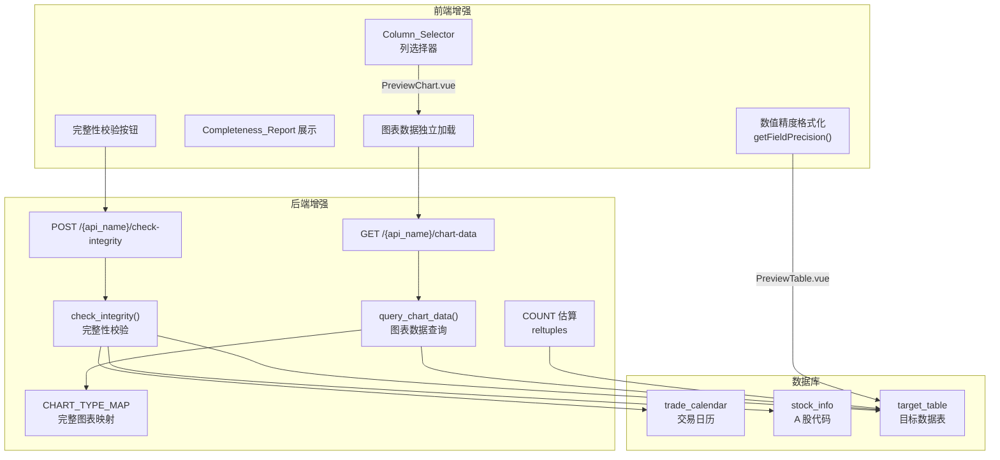
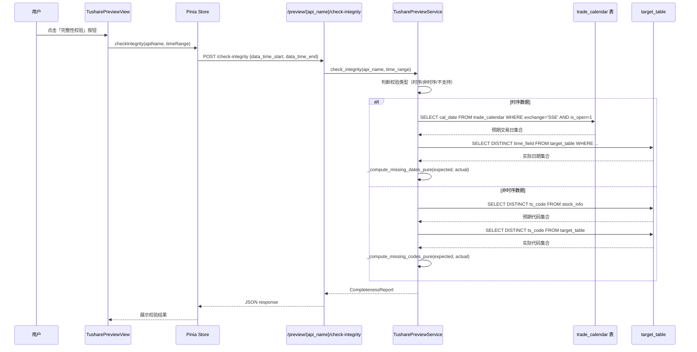
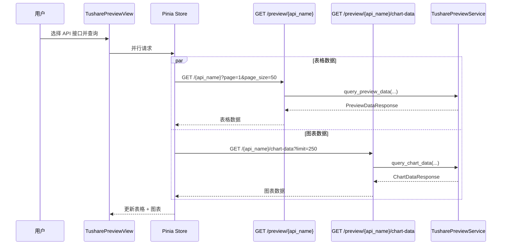

# Design Document: Tushare 数据预览增强

## Overview

本功能在现有 `tushare-data-preview` 基础上进行六项增强，提升数据验证效率和图表可视化实用性：

1. **数据完整性校验**：新增 `check_integrity` 方法和 API 端点，基于交易日历（时序数据）或 A 股代码集合（非时序数据）检测缺失数据
2. **分页优化**：确认现有后端分页机制，新增大表（>100 万行）COUNT 估算，使用 PostgreSQL `reltuples` 替代精确 `COUNT(*)`
3. **数值精度控制**：定义 `PRECISION_RULES` 字段名模式映射表，前端纯函数 `getFieldPrecision` 按金融数据惯例格式化数值
4. **图表类型扩展**：将 `_infer_chart_type_pure` 从 3 条规则扩展为完整的 `CHART_TYPE_MAP`，覆盖全部 20 个 subcategory
5. **图表数据独立加载**：新增 `GET /{api_name}/chart-data` 端点，默认返回最近 250 条时序数据，独立于表格分页
6. **图表列选择器**：折线图/柱状图默认展示前 3 个代表性数值列，用户可通过 `Column_Selector` 自定义展示列

### 核心设计决策

1. **扩展而非新建**：所有后端逻辑作为 `TusharePreviewService` 的新方法实现，复用现有数据库路由、作用域过滤、时间字段映射等基础设施
2. **纯函数优先**：`getFieldPrecision`、扩展后的 `_infer_chart_type_pure`、`_compute_missing_dates_pure`、`_compute_missing_codes_pure` 均为无副作用的静态/纯函数，便于属性测试
3. **COUNT 估算策略**：仅在 `reltuples > 1_000_000` 时使用估算值，小表仍用精确 COUNT，通过 `_estimate_count_pure` 决策函数控制
4. **图表数据独立性**：chart-data 端点与表格分页端点完全独立，前端在选择 API 后并行请求两者，图表不受分页参数影响
5. **列选择器仅限折线/柱状图**：K 线图固定使用 OHLC 四列，不显示列选择器；折线/柱状图默认选中前 3 个数值列

## Architecture

### 增强功能架构图



### 请求流程：完整性校验



### 请求流程：图表数据独立加载



## Components and Interfaces

### 后端新增/修改组件

#### 1. 完整性校验：`TusharePreviewService.check_integrity`

```python
class CompletenessReport(BaseModel):
    """完整性校验结果"""
    check_type: str          # "time_series" | "code_based" | "unsupported"
    expected_count: int      # 预期数量
    actual_count: int        # 实际数量
    missing_count: int       # 缺失数量
    completeness_rate: float # 完整率（0.0 ~ 1.0）
    missing_items: list[str] # 缺失项列表（日期或代码）
    time_range: dict | None  # 校验时间范围 {"start": ..., "end": ...}
    message: str | None      # 附加提示信息

class IntegrityRequest(BaseModel):
    """完整性校验请求"""
    data_time_start: str | None = None
    data_time_end: str | None = None
```

**纯函数（用于属性测试）：**

```python
@staticmethod
def _compute_missing_dates_pure(
    expected_dates: set[str], actual_dates: set[str]
) -> list[str]:
    """计算缺失交易日列表（纯函数）。"""
    return sorted(expected_dates - actual_dates)

@staticmethod
def _compute_missing_codes_pure(
    expected_codes: set[str], actual_codes: set[str]
) -> list[str]:
    """计算缺失代码列表（纯函数）。"""
    return sorted(expected_codes - actual_codes)

@staticmethod
def _determine_check_type_pure(
    time_field: str | None, has_ts_code: bool
) -> str:
    """判断校验类型（纯函数）。"""
    if time_field is not None:
        return "time_series"
    if has_ts_code:
        return "code_based"
    return "unsupported"

@staticmethod
def _build_completeness_report_pure(
    check_type: str,
    expected: set[str],
    actual: set[str],
    missing: list[str],
    time_range: dict | None = None,
    message: str | None = None,
) -> dict:
    """构建完整性报告数据（纯函数）。"""
    expected_count = len(expected)
    actual_count = len(actual)
    missing_count = len(missing)
    rate = actual_count / expected_count if expected_count > 0 else 1.0
    return {
        "check_type": check_type,
        "expected_count": expected_count,
        "actual_count": actual_count,
        "missing_count": missing_count,
        "completeness_rate": round(rate, 4),
        "missing_items": missing,
        "time_range": time_range,
        "message": message,
    }
```

#### 2. 图表数据端点：`TusharePreviewService.query_chart_data`

```python
class ChartDataResponse(BaseModel):
    """图表数据响应"""
    rows: list[dict]                # 数据行（按时间升序）
    time_field: str | None          # 时间字段名
    chart_type: str | None          # 推荐图表类型
    columns: list[ColumnInfo]       # 列信息
    total_available: int            # 可用数据总量
```

```python
async def query_chart_data(
    self, api_name: str, *,
    limit: int = 250,
    data_time_start: str | None = None,
    data_time_end: str | None = None,
) -> ChartDataResponse:
    """查询图表数据（独立于表格分页）。

    返回按时间字段升序排列的最近 N 条数据。
    limit 范围 [1, 500]，默认 250。
    """
    ...
```

#### 3. 图表类型扩展：`CHART_TYPE_MAP`

替换现有 `_infer_chart_type_pure` 中的 3 条规则，使用完整映射表：

```python
# ── 完整图表类型映射 ──
# 优先按 target_table 判断 K 线图，其次按 subcategory 判断折线/柱状图
CHART_TYPE_MAP: dict[str, str] = {
    # subcategory → chart_type
    "资金流向数据": "line",
    "两融及转融通": "line",
    "特色数据": "line",
    "大盘指数每日指标": "line",
    "指数技术面因子（专业版）": "line",
    "打板专题数据": "bar",
    "沪深市场每日交易统计": "bar",
    "深圳市场每日交易情况": "bar",
}

# K 线表集合（优先级最高）
KLINE_TABLES = {"kline", "sector_kline"}

@staticmethod
def _infer_chart_type_pure(
    target_table: str, subcategory: str, time_field: str | None
) -> str | None:
    """基于 target_table、subcategory 和 time_field 推断图表类型。

    规则优先级：
    1. target_table 在 KLINE_TABLES 中 → candlestick
    2. subcategory 在 CHART_TYPE_MAP 中 → 对应类型
    3. 有时间字段且有数值列 → line（默认折线图）
    4. 无时间字段 → None
    """
    if target_table in KLINE_TABLES:
        return "candlestick"
    if subcategory in CHART_TYPE_MAP:
        return CHART_TYPE_MAP[subcategory]
    if time_field is not None:
        return "line"
    return None
```

**注意**：扩展后的 `_infer_chart_type_pure` 新增 `time_field` 参数。对于指数行情数据中 target_table 不是 kline/sector_kline 的接口（如 `index_dailybasic`），通过 subcategory 不在 CHART_TYPE_MAP 中但有 time_field 的兜底规则，自动使用折线图。

#### 4. COUNT 估算：`_estimate_count_pure`

```python
@staticmethod
def _estimate_count_pure(reltuples: float, threshold: int = 1_000_000) -> tuple[bool, int]:
    """判断是否使用 COUNT 估算。

    Args:
        reltuples: PostgreSQL pg_class.reltuples 值
        threshold: 使用估算的阈值

    Returns:
        (use_estimate, count) — 是否使用估算及估算值
    """
    if reltuples > threshold:
        return True, int(reltuples)
    return False, 0  # 0 表示需要精确 COUNT
```

#### 5. API 路由层新增端点

| 方法 | 路径 | 描述 |
|------|------|------|
| POST | `/{api_name}/check-integrity` | 完整性校验 |
| GET | `/{api_name}/chart-data` | 图表数据独立加载 |

### 前端新增/修改组件

#### 1. `PreviewTable.vue` — 数值精度增强

新增纯函数 `getFieldPrecision`，定义精度规则常量：

```typescript
/**
 * 数值精度规则映射
 * key: 字段名匹配模式（正则），value: 小数位数
 */
export const PRECISION_RULES: Array<{ pattern: RegExp; decimals: number }> = [
  // 成交量类（0 位小数）— 优先匹配
  { pattern: /^(vol|volume)$/i, decimals: 0 },
  // 价格类（2 位小数）
  { pattern: /(open|high|low|close|price|avg_price|amount)/i, decimals: 2 },
  // 涨跌幅类（2 位小数）
  { pattern: /(pct_chg|change)/i, decimals: 2 },
  // 换手率类（2 位小数）
  { pattern: /turnover_rate/i, decimals: 2 },
  // 市值类（2 位小数）
  { pattern: /(total_mv|circ_mv|market_cap)/i, decimals: 2 },
  // 市盈率/市净率类（2 位小数）
  { pattern: /^(pe|pb|pe_ttm|ps|ps_ttm)(_|$)/i, decimals: 2 },
]

/** 默认精度 */
export const DEFAULT_PRECISION = 4

/**
 * 根据字段名获取显示精度（纯函数）
 */
export function getFieldPrecision(fieldName: string): number {
  for (const rule of PRECISION_RULES) {
    if (rule.pattern.test(fieldName)) {
      return rule.decimals
    }
  }
  return DEFAULT_PRECISION
}
```

修改 `formatCell` 函数使用 `getFieldPrecision`：

```typescript
function formatCell(value: unknown, type: string, fieldName: string): string {
  if (value === null || value === undefined) return '—'
  if (type === 'number' && typeof value === 'number') {
    if (Number.isInteger(value)) return value.toLocaleString()
    const precision = getFieldPrecision(fieldName)
    const formatted = value.toFixed(precision)
    // 大数值添加千分位
    if (Math.abs(value) >= 10000) {
      const [intPart, decPart] = formatted.split('.')
      const withCommas = Number(intPart).toLocaleString()
      return decPart ? `${withCommas}.${decPart}` : withCommas
    }
    return formatted
  }
  return String(value)
}
```

#### 2. `PreviewChart.vue` — 列选择器与独立数据

新增 props：
```typescript
const props = defineProps<{
  chartType: 'candlestick' | 'line' | 'bar' | null
  rows: Record<string, unknown>[]
  timeField: string | null
  columns: ColumnInfo[]
  // 新增
  selectedColumns?: string[]  // 用户选中的列名列表
}>()

const emit = defineEmits<{
  'update:selectedColumns': [value: string[]]
}>()
```

列选择器逻辑：
- `chartType === 'candlestick'` 时不显示列选择器
- `chartType === 'line' | 'bar'` 时显示列选择器，默认选中前 3 个数值列
- 用户勾选/取消勾选时通过 `emit('update:selectedColumns', ...)` 通知父组件

#### 3. `tusharePreview.ts` — Store 扩展

新增状态和方法：

```typescript
// 新增状态
const integrityReport = ref<CompletenessReport | null>(null)
const integrityLoading = ref(false)
const chartData = ref<ChartDataResponse | null>(null)
const chartDataLoading = ref(false)
const selectedChartColumns = ref<string[]>([])

// 新增方法
async function checkIntegrity(apiName: string, timeRange?: { start?: string; end?: string })
async function fetchChartData(apiName: string, limit?: number)
function setSelectedChartColumns(columns: string[])
```

扩展 `inferChartType` 纯函数以匹配后端新规则：

```typescript
export function inferChartType(
  targetTable: string,
  subcategory: string,
  timeField: string | null,
): 'candlestick' | 'line' | 'bar' | null {
  if (KLINE_TABLES.has(targetTable)) return 'candlestick'
  const mapped = CHART_TYPE_MAP.get(subcategory)
  if (mapped) return mapped
  if (timeField != null) return 'line'
  return null
}
```

#### 4. `TusharePreviewView.vue` — 页面增强

新增 UI 元素：
- 查询条件栏右侧新增「完整性校验」按钮
- 查询条件栏下方新增可折叠的 `Completeness_Report` 卡片
- 图表区域使用 `chartData` 而非 `previewData.rows`
- 图表上方显示列选择器（仅 line/bar 时）

## Data Models

### 新增 Pydantic 响应模型

```python
class CompletenessReport(BaseModel):
    """完整性校验结果"""
    check_type: str          # "time_series" | "code_based" | "unsupported"
    expected_count: int
    actual_count: int
    missing_count: int
    completeness_rate: float
    missing_items: list[str]
    time_range: dict | None
    message: str | None

class IntegrityRequest(BaseModel):
    """完整性校验请求体"""
    data_time_start: str | None = None
    data_time_end: str | None = None

class ChartDataResponse(BaseModel):
    """图表数据响应"""
    rows: list[dict]
    time_field: str | None
    chart_type: str | None
    columns: list[ColumnInfo]
    total_available: int
```

### 新增 TypeScript 类型

```typescript
export interface CompletenessReport {
  check_type: 'time_series' | 'code_based' | 'unsupported'
  expected_count: number
  actual_count: number
  missing_count: number
  completeness_rate: number
  missing_items: string[]
  time_range: { start: string; end: string } | null
  message: string | null
}

export interface ChartDataResponse {
  rows: Record<string, unknown>[]
  time_field: string | null
  chart_type: 'candlestick' | 'line' | 'bar' | null
  columns: ColumnInfo[]
  total_available: number
}
```

### 现有模型修改

无新增 ORM 模型。完整性校验复用现有 `trade_calendar` 和 `stock_info` 表。图表数据端点复用现有 `target_table` 动态查询机制。

`PreviewDataResponse` 不修改 — 表格分页端点保持原有响应格式。

## Correctness Properties

*A property is a characteristic or behavior that should hold true across all valid executions of a system — essentially, a formal statement about what the system should do. Properties serve as the bridge between human-readable specifications and machine-verifiable correctness guarantees.*

### Property 1: Set difference computation for missing items

*For any* two sets of strings (expected and actual), the `_compute_missing_dates_pure` and `_compute_missing_codes_pure` functions SHALL return a sorted list equal to `sorted(expected - actual)`. The result length SHALL equal `len(expected) - len(expected ∩ actual)`, every item in the result SHALL be in expected but not in actual, and the result SHALL be in ascending sorted order.

**Validates: Requirements 2.5, 3.3**

### Property 2: Completeness report field consistency

*For any* pair of sets (expected, actual) and their computed missing list, the `_build_completeness_report_pure` function SHALL produce a report where: `expected_count == len(expected)`, `actual_count == len(actual)`, `missing_count == len(missing)`, `completeness_rate == actual_count / expected_count` (or 1.0 when expected is empty), and `missing_items` equals the provided missing list. The `completeness_rate` SHALL always be in the range [0.0, 1.0].

**Validates: Requirements 2.6, 3.4**

### Property 3: Check type determination

*For any* combination of `time_field` (string or None) and `has_ts_code` (boolean), the `_determine_check_type_pure` function SHALL return: `"time_series"` when `time_field` is not None, `"code_based"` when `time_field` is None and `has_ts_code` is True, and `"unsupported"` when both `time_field` is None and `has_ts_code` is False. The result is fully determined by these two inputs.

**Validates: Requirements 2.2, 3.1, 3.6**

### Property 4: COUNT estimation threshold

*For any* non-negative float `reltuples` value, the `_estimate_count_pure` function SHALL return `(True, int(reltuples))` when `reltuples > 1_000_000`, and `(False, 0)` otherwise. The threshold boundary is strict: exactly 1,000,000 returns `(False, 0)`, while 1,000,001 returns `(True, 1000001)`.

**Validates: Requirements 5.6**

### Property 5: Field precision rule matching

*For any* field name string, the `getFieldPrecision` function SHALL return the `decimals` value of the first matching rule in `PRECISION_RULES` (ordered by priority), or `DEFAULT_PRECISION` (4) if no rule matches. Specifically: volume fields → 0, price/change/turnover/market-cap/PE-PB fields → 2, unmatched fields → 4. The function is deterministic and pure.

**Validates: Requirements 6.1, 6.2, 6.3, 6.4, 6.5, 6.6, 6.7**

### Property 6: Large number formatting includes thousand separators

*For any* numeric value with `|value| >= 10000` and any field precision, the formatted cell string SHALL contain at least one comma (thousand separator) in the integer part. *For any* numeric value with `|value| < 10000`, the formatted string SHALL NOT contain comma separators.

**Validates: Requirements 7.3**

### Property 7: Expanded chart type inference follows priority rules

*For any* combination of `(target_table, subcategory, time_field)`, the expanded `_infer_chart_type_pure` function SHALL return: (1) `"candlestick"` if `target_table` is in `KLINE_TABLES`, regardless of subcategory or time_field; (2) the mapped chart type if `subcategory` is in `CHART_TYPE_MAP`, regardless of time_field; (3) `"line"` if `time_field` is not None (default fallback for time-series data); (4) `None` if `time_field` is None. Priority is strictly 1 > 2 > 3 > 4.

**Validates: Requirements 9.1, 9.3, 9.4**

### Property 8: Chart data limit clamping

*For any* integer `limit` input, the chart data limit clamping logic SHALL clamp the value to the range `[1, 500]` and default to `250` when not provided. *For any* `limit <= 0`, the result SHALL be `1`. *For any* `limit > 500`, the result SHALL be `500`.

**Validates: Requirements 10.2**

### Property 9: Default chart column selection

*For any* list of numeric column names with length N, the default column selection SHALL be the first `min(3, N)` columns from the list. When N >= 3, exactly 3 columns are selected. When N < 3, all N columns are selected. The selection preserves the original order.

**Validates: Requirements 11.2**

## Error Handling

### 后端错误处理

| 场景 | HTTP 状态码 | 错误信息 | 处理方式 |
|------|------------|---------|---------|
| `api_name` 不在 Registry 中（校验/图表端点） | 404 | `"接口 {api_name} 未注册"` | 复用现有校验逻辑 |
| 完整性校验：数据表不支持校验 | 200 | `check_type="unsupported"` | 正常返回，前端显示提示 |
| 完整性校验：trade_calendar 无数据 | 200 | `expected_count=0, message="交易日历无数据"` | 正常返回空结果 |
| 完整性校验：数据库查询失败 | 500 | `"完整性校验查询失败"` | 捕获 SQLAlchemy 异常，记录日志 |
| chart-data：无时间字段 | 200 | `rows=[], chart_type=None` | 正常返回空数据 |
| chart-data：limit 超出范围 | 自动修正 | 无错误 | 静默 clamp 到 [1, 500] |
| COUNT 估算：reltuples 不可用 | 回退精确 COUNT | 无错误 | 捕获异常后回退 |

### 前端错误处理

| 场景 | 处理方式 |
|------|---------|
| 完整性校验请求失败 | 显示错误提示，隐藏报告区域 |
| 图表数据请求失败 | 隐藏图表，仅显示表格 |
| 列选择器无可用数值列 | 隐藏列选择器 |

## Testing Strategy

### 属性测试（Property-Based Testing）

本增强功能的纯逻辑部分适合属性测试。使用 **Hypothesis**（后端）和 **fast-check**（前端）。

**后端属性测试**（`tests/properties/test_tushare_preview_enhancement_properties.py`）：

| Property | 测试内容 | 最小迭代次数 |
|----------|---------|------------|
| Property 1 | 集合差集计算（缺失日期/代码） | 100 |
| Property 2 | 完整性报告字段一致性 | 100 |
| Property 3 | 校验类型判断 | 100 |
| Property 4 | COUNT 估算阈值 | 100 |
| Property 7 | 扩展图表类型推断 | 100 |
| Property 8 | 图表数据 limit clamp | 100 |

**前端属性测试**（`frontend/src/components/__tests__/previewEnhancement.property.test.ts`）：

| Property | 测试内容 | 最小迭代次数 |
|----------|---------|------------|
| Property 5 | 字段精度规则匹配 | 100 |
| Property 6 | 大数值千分位格式化 | 100 |
| Property 7 | 扩展图表类型推断（前端侧） | 100 |
| Property 9 | 默认列选择 | 100 |

每个属性测试必须标注对应的设计属性：
```
# Feature: tushare-data-preview-enhancement, Property 1: Set difference computation for missing items
```

### 单元测试

**后端单元测试**（`tests/services/test_tushare_preview_enhancement.py`）：

- `test_check_integrity_time_series_complete`：时序数据完整时返回 missing_count=0
- `test_check_integrity_time_series_with_gaps`：时序数据有缺失时返回正确的缺失日期
- `test_check_integrity_code_based`：非时序数据校验返回缺失代码
- `test_check_integrity_unsupported`：不支持校验的表返回 unsupported
- `test_check_integrity_uses_sse_calendar`：验证使用 SSE 交易日历
- `test_check_integrity_applies_scope_filter`：验证校验时应用作用域过滤
- `test_query_chart_data_returns_ascending_order`：图表数据按时间升序
- `test_query_chart_data_default_limit_250`：默认返回 250 条
- `test_query_chart_data_no_time_field_returns_empty`：无时间字段返回空
- `test_estimate_count_uses_reltuples_for_large_tables`：大表使用估算
- `test_estimate_count_uses_exact_for_small_tables`：小表使用精确 COUNT
- `test_infer_chart_type_expanded_mapping`：验证各 subcategory 的图表类型映射

**前端单元测试**（`frontend/src/components/__tests__/PreviewTable.test.ts`）：

- `test_format_cell_price_precision`：价格字段 2 位小数
- `test_format_cell_volume_integer`：成交量字段整数显示
- `test_format_cell_large_number_with_commas`：大数值千分位
- `test_format_cell_integer_no_decimals`：整数值不添加小数位
- `test_format_cell_default_precision`：未知字段 4 位小数

**前端单元测试**（`frontend/src/components/__tests__/PreviewChart.test.ts`）：

- `test_column_selector_shown_for_line_chart`：折线图显示列选择器
- `test_column_selector_hidden_for_candlestick`：K 线图不显示列选择器
- `test_default_selected_columns_max_3`：默认选中前 3 列
- `test_column_toggle_updates_chart`：切换列更新图表

### 集成测试

**后端集成测试**（`tests/api/test_tushare_preview_enhancement_api.py`）：

- `test_check_integrity_endpoint_time_series`：完整性校验端点（时序）
- `test_check_integrity_endpoint_code_based`：完整性校验端点（非时序）
- `test_check_integrity_endpoint_unknown_api`：未知接口返回 404
- `test_chart_data_endpoint_returns_data`：图表数据端点返回数据
- `test_chart_data_endpoint_with_filters`：图表数据端点带筛选参数
- `test_chart_data_endpoint_limit_clamping`：limit 参数 clamp

### 测试工具配置

- 后端：`pytest` + `hypothesis`（`@settings(max_examples=100)`）
- 前端：`vitest` + `fast-check`（`fc.assert(property, { numRuns: 100 })`）
- Service 层提供 `_pure` 静态方法用于属性测试，隔离数据库依赖
- 前端纯函数（`getFieldPrecision`、`inferChartType`、`getDefaultSelectedColumns`）独立导出供属性测试使用

