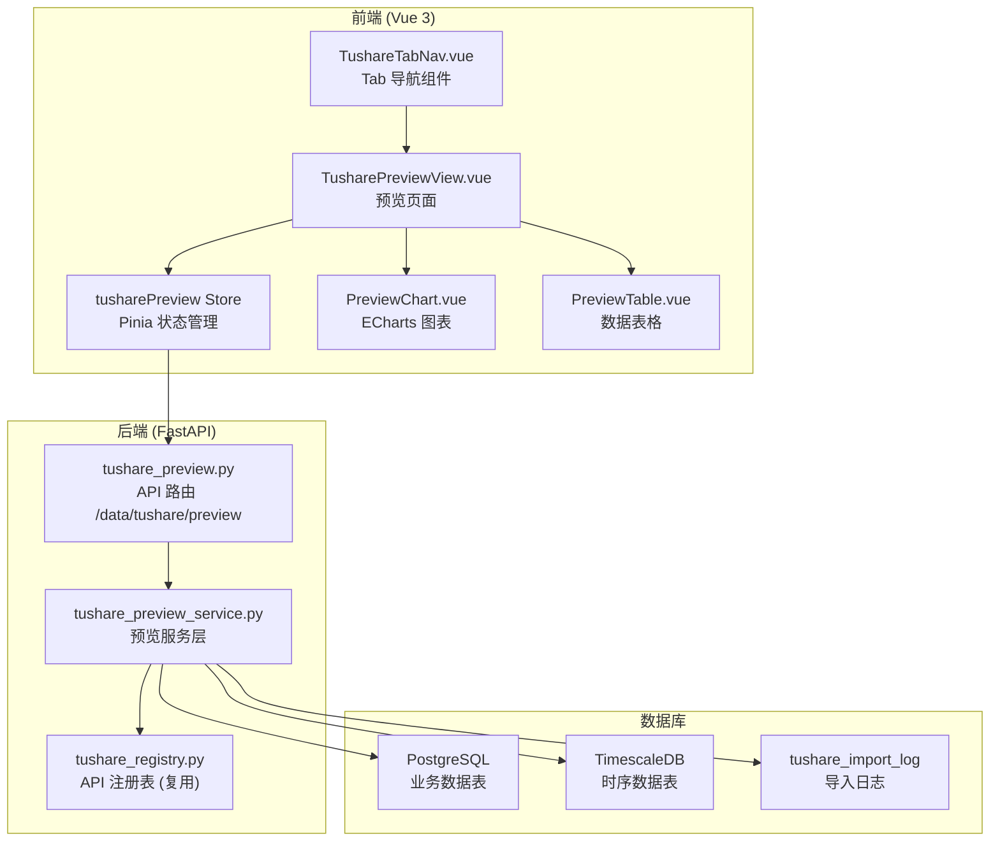
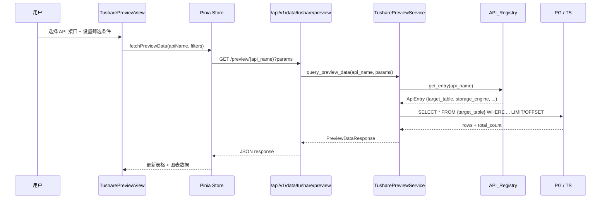

# Design Document: Tushare 数据预览 Tab

## Overview

本功能在现有 Tushare 数据导入页面旁新增一个平级的「Tushare 数据预览」Tab 页，用于查看已导入到数据库中的 Tushare 数据。系统复用现有 `tushare_registry.py` 中的 `ApiEntry` 元数据（`target_table`、`storage_engine`、`field_mappings`、`category`/`subcategory`）来动态路由查询到正确的数据库（PostgreSQL 或 TimescaleDB），并根据数据特征自动选择图表类型（K 线图、折线图/柱状图）。

### 核心设计决策

1. **动态表查询**：通过 `ApiEntry.target_table` + SQLAlchemy `text()` 构建只读 SELECT 查询，避免为 85+ 张表逐一编写查询逻辑
2. **双数据库路由**：根据 `ApiEntry.storage_engine`（PG/TS）选择 `AsyncSessionPG` 或 `AsyncSessionTS`
3. **时间字段自动识别**：维护一个完整的 `TIME_FIELD_MAP` 字典覆盖所有 target_table，并提供基于列名优先级的自动推断兜底机制（优先级：`trade_date` > `time` > `ann_date` > `cal_date` > `st_date` > `suspend_date` > `surv_date` > `report_date` > `month` > `end_date`）
4. **图表类型推断**：基于 `target_table` 判断图表类型 — `kline` 或 `sector_kline` 表展示 K 线图，`subcategory == "资金流向数据"` 展示折线/柱状图，其余仅展示表格
5. **Tab 导航方案**：创建一个共享的 `TushareTabNav.vue` 组件，在导入页和预览页顶部渲染 Tab 标签。在 `TushareImportView.vue` 的 template 中仅添加 `<TushareTabNav />` 一行引用，不修改其业务逻辑
6. **共享表作用域过滤**：多个 API 接口可能指向同一张表（如 `daily`/`weekly`/`monthly` 都指向 `kline`），通过 `_build_scope_filter(entry)` 方法从 `ApiEntry.extra_config` 和 `conflict_columns` 推断作用域过滤条件（如 `freq='1d'`、`report_type='income'`、`data_source='THS'`），确保预览数据与所选接口精确匹配

## Architecture

### 系统架构图



### 请求流程



## Components and Interfaces

### 后端组件

#### 1. API 路由层：`app/api/v1/tushare_preview.py`

```python
router = APIRouter(prefix="/data/tushare/preview", tags=["tushare-preview"])
```

**端点定义：**

| 方法 | 路径 | 描述 | 参数 |
|------|------|------|------|
| GET | `/{api_name}` | 查询预览数据 | `page`, `page_size`, `import_time_start`, `import_time_end`, `data_time_start`, `data_time_end`, `incremental`, `import_log_id` |
| GET | `/{api_name}/stats` | 获取数据统计信息 | 无 |
| GET | `/{api_name}/import-logs` | 获取该接口的导入记录列表 | `limit` |

**响应模型：**

```python
class PreviewDataResponse(BaseModel):
    """预览数据响应"""
    columns: list[ColumnInfo]       # 列定义（name, label, type）
    rows: list[dict]                # 数据行
    total: int                      # 总记录数
    page: int                       # 当前页码
    page_size: int                  # 每页条数
    time_field: str | None          # 该表的时间字段名（用于前端图表 X 轴）
    chart_type: str | None          # 推荐图表类型：candlestick / line / bar / None
    scope_info: str | None          # 共享表作用域提示（如"freq=1d"、"report_type=income"）
    incremental_info: IncrementalInfo | None  # 增量查询时的关联导入信息

class IncrementalInfo(BaseModel):
    """增量查询关联的导入记录信息"""
    import_log_id: int
    import_time: str                # 导入时间（started_at ISO 格式）
    record_count: int               # 该次导入的记录数
    status: str                     # 导入状态
    params_summary: str             # 导入参数摘要（如"2024-01-01 ~ 2024-12-31"）

class ColumnInfo(BaseModel):
    """列信息"""
    name: str                       # 数据库列名
    label: str                      # 显示名称（来自 field_mappings 或列名本身）
    type: str                       # 数据类型提示：string / number / date / datetime

class PreviewStatsResponse(BaseModel):
    """统计信息响应"""
    total_count: int                # 总记录数
    earliest_time: str | None       # 最早数据时间
    latest_time: str | None         # 最晚数据时间
    last_import_at: str | None      # 最近导入时间
    last_import_count: int          # 最近导入记录数

class ImportLogItem(BaseModel):
    """导入记录条目"""
    id: int
    api_name: str
    params_json: dict | None
    status: str
    record_count: int
    error_message: str | None
    started_at: str | None
    finished_at: str | None
```

#### 2. 服务层：`app/services/data_engine/tushare_preview_service.py`

```python
class TusharePreviewService:
    """Tushare 数据预览服务（只读查询）"""

    async def query_preview_data(
        self, api_name: str, *,
        page: int = 1, page_size: int = 50,
        import_time_start: datetime | None = None,
        import_time_end: datetime | None = None,
        data_time_start: str | None = None,
        data_time_end: str | None = None,
        incremental: bool = False,
        import_log_id: int | None = None,
    ) -> PreviewDataResponse: ...

    async def query_stats(self, api_name: str) -> PreviewStatsResponse: ...

    async def query_import_logs(
        self, api_name: str, *, limit: int = 20
    ) -> list[ImportLogItem]: ...
```

**核心内部方法：**

- `_get_session(storage_engine: StorageEngine)` → 根据引擎类型返回 PG 或 TS session
- `_get_time_field(target_table: str)` → 从 `TIME_FIELD_MAP` 查找时间字段，未命中时按 `_TIME_FIELD_PRIORITY` 自动推断
- `_get_column_info(target_table: str, field_mappings: list[FieldMapping])` → 构建列定义
- `_infer_chart_type(api_name: str, entry: ApiEntry)` → 基于 `target_table` 推断图表类型
- `_build_scope_filter(entry: ApiEntry)` → 从 `extra_config` 推断共享表的作用域过滤条件（见下文）
- `_build_query(target_table: str, ...)` → 构建带筛选条件的 SQL 查询
- `_build_incremental_filter(import_log: TushareImportLog, entry: ApiEntry)` → 从导入记录的 `params_json` 提取参数重建查询条件

**共享表作用域过滤 `_build_scope_filter`：**

多个 API 接口可能指向同一张表，需要根据 `ApiEntry` 元数据自动添加过滤条件：

```python
def _build_scope_filter(self, entry: ApiEntry) -> list[str]:
    """根据 ApiEntry 推断共享表的作用域 WHERE 条件。

    返回 SQL WHERE 子句片段列表（使用参数绑定）。
    """
    conditions = []

    # 1. kline 表：按 freq 过滤（来自 extra_config）
    if entry.target_table == "kline" and "freq" in entry.extra_config:
        conditions.append(("freq = :scope_freq", {"scope_freq": entry.extra_config["freq"]}))

    # 2. financial_statement 表：按 report_type 过滤
    inject = entry.extra_config.get("inject_fields", {})
    if entry.target_table == "financial_statement" and "report_type" in inject:
        conditions.append(("report_type = :scope_report_type",
                          {"scope_report_type": inject["report_type"]}))

    # 3. sector_info / sector_constituent / sector_kline：按 data_source 过滤
    if entry.target_table in ("sector_info", "sector_constituent", "sector_kline"):
        ds = entry.extra_config.get("data_source")
        if ds:
            conditions.append(("data_source = :scope_ds", {"scope_ds": ds}))

    # 4. top_holders 表：按 holder_type 过滤
    if entry.target_table == "top_holders" and "holder_type" in entry.extra_config:
        conditions.append(("holder_type = :scope_ht",
                          {"scope_ht": entry.extra_config["holder_type"]}))

    return conditions
```

**增量查询机制 `_build_incremental_filter`：**

增量查询通过导入记录的 `params_json` 重建查询条件，而非依赖写入时间窗口（因为数据表没有 `created_at` 字段）：

```python
async def _build_incremental_filter(
    self, import_log: TushareImportLog, entry: ApiEntry
) -> dict:
    """从导入记录的 params_json 提取参数，重建数据查询条件。"""
    params = import_log.params_json or {}
    filters = {}

    time_field = self._get_time_field(entry.target_table)
    if time_field:
        # 优先使用 start_date/end_date 参数
        if params.get("start_date"):
            filters["data_time_start"] = params["start_date"]
        if params.get("end_date"):
            filters["data_time_end"] = params["end_date"]
        # 单日期参数（trade_date）
        if params.get("trade_date"):
            filters["data_time_start"] = params["trade_date"]
            filters["data_time_end"] = params["trade_date"]

    # 代码过滤（如果导入时指定了特定代码）
    if params.get("ts_code"):
        filters["ts_code"] = params["ts_code"]

    return filters
```

**时间字段映射表 `TIME_FIELD_MAP`：**

```python
# 完整映射：覆盖所有 target_table
TIME_FIELD_MAP: dict[str, str] = {
    # ── 时序数据（TimescaleDB）──
    "kline": "time",
    "sector_kline": "time",
    "adjustment_factor": "trade_date",
    # ── 基础数据 ──
    "trade_calendar": "cal_date",
    "stock_st": "st_date",
    "st_warning": "trade_date",
    "stk_premarket": "trade_date",
    "stock_hsgt": "in_date",
    "stock_namechange": "start_date",
    "stk_managers": "ann_date",
    "stk_rewards": "ann_date",
    "new_share": "ipo_date",
    "suspend_info": "suspend_date",
    # stock_info: 无主要时间字段（upsert 模式）
    # stock_company: 无主要时间字段
    # bse_mapping: 无主要时间字段
    # ── 行情数据 ──
    "stk_limit": "trade_date",
    "hsgt_top10": "trade_date",
    "ggt_top10": "trade_date",
    "ggt_daily": "trade_date",
    "ggt_monthly": "month",
    # ── 财务数据 ──
    "financial_statement": "ann_date",
    "dividend": "ann_date",
    "forecast": "ann_date",
    "express": "ann_date",
    "fina_mainbz": "end_date",
    "disclosure_date": "end_date",
    # ── 参考数据 ──
    "stk_shock": "trade_date",
    "stk_high_shock": "trade_date",
    "stk_alert": "trade_date",
    "top_holders": "end_date",
    "pledge_stat": "end_date",
    "pledge_detail": "ann_date",
    "repurchase": "ann_date",
    "share_float": "ann_date",
    "block_trade": "trade_date",
    "stk_holdernumber": "ann_date",
    "stk_holdertrade": "ann_date",
    # ── 特色数据 ──
    "report_rc": "report_date",
    "cyq_perf": "trade_date",
    "cyq_chips": "trade_date",
    "stk_factor": "trade_date",
    "ccass_hold": "trade_date",
    "ccass_hold_detail": "trade_date",
    "hk_hold": "trade_date",
    "stk_auction_o": "trade_date",
    "stk_auction_c": "trade_date",
    "stk_nineturn": "trade_date",
    "stk_ah_comparison": "trade_date",
    "stk_surv": "surv_date",
    "broker_recommend": "month",
    # ── 两融及转融通 ──
    "margin_data": "trade_date",
    "margin_detail": "trade_date",
    "margin_secs": "trade_date",
    "slb_len": "trade_date",
    # ── 资金流向 ──
    "tushare_moneyflow": "trade_date",
    "moneyflow_ths": "trade_date",
    "moneyflow_dc": "trade_date",
    "moneyflow_hsgt": "trade_date",
    "moneyflow_mkt_dc": "trade_date",
    "moneyflow_ind": "trade_date",
    "moneyflow_cnt_ths": "trade_date",
    # ── 打板专题 ──
    "top_list": "trade_date",
    "top_inst": "trade_date",
    "limit_list_ths": "trade_date",
    "limit_list": "trade_date",
    "limit_step": "trade_date",
    "limit_cpt_list": "trade_date",
    "stk_auction": "trade_date",
    "hm_detail": "trade_date",
    "ths_hot": "trade_date",
    "dc_hot": "trade_date",
    "kpl_list": "trade_date",
    # hm_list: 无时间字段（游资名录）
    # kpl_concept_cons: 无时间字段（题材成分）
    # dc_concept: 无时间字段（题材库）
    # dc_concept_cons: 无时间字段（题材成分）
    # ── 指数专题 ──
    "index_weight": "trade_date",
    "index_dailybasic": "trade_date",
    "index_tech": "trade_date",
    "index_global": "trade_date",
    "market_daily_info": "trade_date",
    "sz_daily_info": "trade_date",
    # index_info: 无主要时间字段（指数基本信息）
    # ── 板块复用表 ──
    "sector_info": "updated_at",
    "sector_constituent": "trade_date",
}

# 自动推断兜底：当 target_table 不在 TIME_FIELD_MAP 中时，
# 按优先级尝试匹配列名
_TIME_FIELD_PRIORITY = [
    "trade_date", "time", "ann_date", "cal_date", "st_date",
    "suspend_date", "surv_date", "report_date", "month", "end_date",
]
```

**图表类型推断规则 `_infer_chart_type`：**

```python
# 基于 target_table 判断，而非枚举 api_name，更健壮
KLINE_TABLES = {"kline", "sector_kline"}
MONEYFLOW_SUBCATEGORY = "资金流向数据"

def _infer_chart_type(self, api_name: str, entry: ApiEntry) -> str | None:
    if entry.target_table in KLINE_TABLES:
        return "candlestick"
    if entry.subcategory == MONEYFLOW_SUBCATEGORY:
        return "line"
    # 有时间字段但不属于上述类型，默认不推荐图表
    return None
```

### 前端组件

#### 1. `TushareTabNav.vue` — Tab 导航组件

共享组件，在导入页和预览页顶部渲染两个 Tab 标签。通过 `vue-router` 的 `useRoute()` 判断当前激活的 Tab。

```typescript
// Props
interface Props {
  // 无需 props，通过 route.name 判断当前 Tab
}
```

#### 2. `TusharePreviewView.vue` — 预览主页面

页面布局：
- 顶部：`TushareTabNav` 组件
- 左侧面板：分类选择器（Category_Selector）
- 右侧主区域：
  - 查询条件栏（时间筛选 + 增量查询按钮）
  - 导入记录列表（可折叠）
  - 图表区域（条件展示）
  - 数据表格区域

#### 3. `PreviewChart.vue` — 图表组件

根据 `chart_type` 渲染不同类型的 ECharts 图表：
- `candlestick`：K 线图（需要 open/high/low/close 四列 + time 列）
- `line`：折线图（数值列 vs 时间列）
- `bar`：柱状图
- `null`：不渲染

#### 4. `PreviewTable.vue` — 数据表格组件

根据 `columns` 动态生成表头，支持分页。

#### 5. Pinia Store：`tusharePreview.ts`

```typescript
interface TusharePreviewState {
  // 分类数据（复用 registry 接口）
  registry: ApiRegistryItem[]
  registryLoading: boolean

  // 当前选中
  selectedApiName: string | null
  selectedCategory: string | null

  // 预览数据
  previewData: PreviewDataResponse | null
  previewLoading: boolean

  // 统计信息
  stats: PreviewStatsResponse | null

  // 导入记录
  importLogs: ImportLogItem[]
  importLogsLoading: boolean

  // 筛选条件
  filters: PreviewFilters

  // 展示模式
  displayMode: 'table' | 'chart' | 'both'
}
```

### 路由配置

在 `frontend/src/router/index.ts` 中新增路由：

```typescript
{
  path: 'data/online/tushare-preview',
  name: 'DataOnlineTusharePreview',
  component: () => import('@/views/TusharePreviewView.vue'),
  meta: { title: 'Tushare 数据预览' },
}
```

### 侧边栏菜单集成

在 `frontend/src/layouts/MainLayout.vue` 的菜单定义中，「在线数据」的 children 里新增：

```typescript
{
  path: '/data/online', label: '在线数据', icon: '🌐',
  children: [
    { path: '/data/online', label: '数据总览', icon: '📊' },
    { path: '/data/online/tushare', label: 'tushare', icon: '📡' },
    { path: '/data/online/tushare-preview', label: 'tushare预览', icon: '🔍' },  // 新增
  ],
}
```

### 后端路由注册

在 `app/api/v1/__init__.py` 中新增：

```python
from app.api.v1.tushare_preview import router as tushare_preview_router
router.include_router(tushare_preview_router)
```

## Data Models

### 后端数据流

本功能不新增 ORM 模型，完全复用现有模型和表结构。数据流如下：

1. **输入**：前端传入 `api_name` + 筛选参数
2. **元数据查询**：从 `TUSHARE_API_REGISTRY` 获取 `ApiEntry`，得到 `target_table`、`storage_engine`、`field_mappings`
3. **数据查询**：使用 `sqlalchemy.text()` 构建动态 SQL，查询 `target_table`
4. **导入日志查询**：查询 `TushareImportLog` 表（已有 ORM 模型）

### Pydantic 响应模型

```python
class ColumnInfo(BaseModel):
    """列信息"""
    name: str           # 数据库列名
    label: str          # 显示名称
    type: str           # string / number / date / datetime

class PreviewDataResponse(BaseModel):
    """预览数据响应"""
    columns: list[ColumnInfo]
    rows: list[dict]
    total: int
    page: int
    page_size: int
    time_field: str | None
    chart_type: str | None
    scope_info: str | None
    incremental_info: IncrementalInfo | None

class IncrementalInfo(BaseModel):
    """增量查询关联的导入记录信息"""
    import_log_id: int
    import_time: str
    record_count: int
    status: str
    params_summary: str

class PreviewStatsResponse(BaseModel):
    """统计信息响应"""
    total_count: int
    earliest_time: str | None
    latest_time: str | None
    last_import_at: str | None
    last_import_count: int

class ImportLogItem(BaseModel):
    """导入记录条目"""
    id: int
    api_name: str
    params_json: dict | None
    status: str
    record_count: int
    error_message: str | None
    started_at: str | None
    finished_at: str | None
```

### 前端 TypeScript 类型

```typescript
interface ColumnInfo {
  name: string
  label: string
  type: 'string' | 'number' | 'date' | 'datetime'
}

interface PreviewDataResponse {
  columns: ColumnInfo[]
  rows: Record<string, unknown>[]
  total: number
  page: number
  page_size: number
  time_field: string | null
  chart_type: 'candlestick' | 'line' | 'bar' | null
  scope_info: string | null
  incremental_info: IncrementalInfo | null
}

interface IncrementalInfo {
  import_log_id: number
  import_time: string
  record_count: number
  status: string
  params_summary: string
}

interface PreviewStatsResponse {
  total_count: number
  earliest_time: string | null
  latest_time: string | null
  last_import_at: string | null
  last_import_count: number
}

interface ImportLogItem {
  id: number
  api_name: string
  params_json: Record<string, unknown> | null
  status: string
  record_count: number
  error_message: string | null
  started_at: string | null
  finished_at: string | null
}

interface PreviewFilters {
  importTimeStart: string | null
  importTimeEnd: string | null
  dataTimeStart: string | null
  dataTimeEnd: string | null
  incremental: boolean
  importLogId: number | null
  page: number
  pageSize: number
}
```


## Correctness Properties

*A property is a characteristic or behavior that should hold true across all valid executions of a system — essentially, a formal statement about what the system should do. Properties serve as the bridge between human-readable specifications and machine-verifiable correctness guarantees.*

### Property 1: Registry grouping preserves all entries with correct counts

*For any* set of API registry entries with arbitrary `category` and `subcategory` values, grouping them into a two-level structure (category → subcategory → api list) SHALL produce groups where: (a) every input entry appears exactly once in the output, (b) each entry is placed under its correct category and subcategory, and (c) the count displayed for each subcategory equals the number of entries in that group.

**Validates: Requirements 2.1, 2.5**

### Property 2: Column info generation from field mappings

*For any* list of `FieldMapping` objects and a target table's column set, the column info generation function SHALL produce a `ColumnInfo` list where each database column has a corresponding entry, and columns with a `FieldMapping` use the mapping's `target` as the label while unmapped columns use the column name itself as the label.

**Validates: Requirements 3.2**

### Property 3: Chart type inference follows deterministic rules

*For any* `ApiEntry`, the chart type inference function SHALL return `"candlestick"` if `target_table` is in the K-line table set (`kline`, `sector_kline`), `"line"` if `subcategory` equals `"资金流向数据"`, and `None` otherwise (when the entry does not match any charting rule). The result is fully determined by the entry's `target_table` and `subcategory`.

**Validates: Requirements 4.1, 4.2, 4.3, 4.4**

### Property 4: Time field resolution and query building

*For any* `target_table` string, the time field lookup function SHALL return the mapped time field name if the table exists in `TIME_FIELD_MAP`, or `None` otherwise. Furthermore, *for any* query with a non-null time field and a given time range `[start, end]`, the built SQL WHERE clause SHALL include a condition on that time field bounded by the provided range.

**Validates: Requirements 6.2, 6.3**

### Property 5: Database session routing by storage engine

*For any* `ApiEntry` with `storage_engine` set to `StorageEngine.PG`, the service SHALL select the PostgreSQL session factory (`AsyncSessionPG`). *For any* `ApiEntry` with `storage_engine` set to `StorageEngine.TS`, the service SHALL select the TimescaleDB session factory (`AsyncSessionTS`). No other session factory is ever returned.

**Validates: Requirements 8.3**

### Property 6: Pagination parameter clamping

*For any* `page_size` integer input, the pagination logic SHALL clamp the value to the range `[1, 100]` and default to `50` when not provided. *For any* `page` integer input, the value SHALL be clamped to a minimum of `1`. The resulting OFFSET is always `(page - 1) * page_size` and LIMIT is always the clamped `page_size`.

**Validates: Requirements 8.4**

### Property 7: Read-only SQL generation

*For any* combination of valid query parameters (api_name, time filters, pagination, incremental flag, import_log_id), the SQL statement generated by `TusharePreviewService` SHALL be a SELECT statement. It SHALL NOT contain any data-modifying keywords (`INSERT`, `UPDATE`, `DELETE`, `DROP`, `ALTER`, `TRUNCATE`).

**Validates: Requirements 9.4**

### Property 8: Import status color mapping

*For any* import status string in the set `{"completed", "failed", "running", "pending", "stopped"}`, the status-to-color mapping function SHALL return a deterministic CSS class: `"completed"` → green class, `"failed"` → red class, `"running"` → blue class, `"pending"` → blue class, `"stopped"` → gray class. For any status string not in the known set, the function SHALL return a default/neutral color class.

**Validates: Requirements 10.4**

### Property 9: Scope filter correctly isolates shared-table data

*For any* `ApiEntry` whose `target_table` is shared by multiple API interfaces (e.g., `kline`, `financial_statement`, `sector_info`), the `_build_scope_filter` function SHALL produce WHERE conditions that match only the data belonging to that specific API. Specifically: (a) for entries with `extra_config.freq`, the filter includes `freq = <value>`; (b) for entries with `extra_config.inject_fields.report_type`, the filter includes `report_type = <value>`; (c) for entries with `extra_config.data_source`, the filter includes `data_source = <value>`; (d) for entries with `extra_config.holder_type`, the filter includes `holder_type = <value>`; (e) for entries without any of these, the filter is empty.

**Validates: Requirements 2.4, 8.3**

## Error Handling

### 后端错误处理

| 场景 | HTTP 状态码 | 错误信息 | 处理方式 |
|------|------------|---------|---------|
| `api_name` 不在 Registry 中 | 404 | `"接口 {api_name} 未注册"` | 在 service 层校验，API 层抛出 HTTPException |
| `target_table` 查询失败（表不存在） | 500 | `"数据表 {table} 查询失败"` | 捕获 SQLAlchemy 异常，记录日志，返回友好错误 |
| 数据库连接失败 | 503 | `"数据库连接不可用"` | 捕获连接异常，返回 503 |
| `page_size` 超出范围 | 自动修正 | 无错误 | 静默 clamp 到 [1, 100] |
| `page` < 1 | 自动修正 | 无错误 | 静默 clamp 到 1 |
| 导入时间范围无效（start > end） | 400 | `"开始时间不能晚于结束时间"` | 在 API 层校验 |
| 增量查询无成功导入记录 | 200 | 正常响应，rows 为空 | 返回空数据 + stats 中 last_import_at 为 null |

### 前端错误处理

| 场景 | 处理方式 |
|------|---------|
| API 请求失败（网络错误） | 显示错误提示，保留当前数据 |
| API 返回 404 | 显示「接口未注册」提示 |
| API 返回 500/503 | 显示「服务暂不可用」提示 |
| 查询结果为空 | 显示「暂无数据」占位符 |
| 图表数据不足（< 2 个数据点） | 隐藏图表，仅显示表格 |

### SQL 注入防护

- `target_table` 来自 `TUSHARE_API_REGISTRY`（代码中硬编码的注册表），不接受用户输入
- 时间范围参数通过 SQLAlchemy `bindparam` 绑定，不拼接到 SQL 字符串中
- `page` / `page_size` 为整数类型，由 FastAPI/Pydantic 自动校验

## Testing Strategy

### 属性测试（Property-Based Testing）

本功能的纯逻辑部分适合属性测试。使用 **Hypothesis**（后端）和 **fast-check**（前端）。

**后端属性测试**（`tests/properties/test_tushare_preview_properties.py`）：

| Property | 测试内容 | 最小迭代次数 |
|----------|---------|------------|
| Property 1 | Registry 分组逻辑 | 100 |
| Property 2 | 列信息生成 | 100 |
| Property 3 | 图表类型推断（基于 target_table） | 100 |
| Property 4 | 时间字段解析 + 查询构建 | 100 |
| Property 5 | 数据库路由 | 100 |
| Property 6 | 分页参数 clamp | 100 |
| Property 7 | 只读 SQL 生成 | 100 |
| Property 9 | 共享表作用域过滤 | 100 |

**前端属性测试**（`frontend/src/views/__tests__/tusharePreview.property.test.ts`）：

| Property | 测试内容 | 最小迭代次数 |
|----------|---------|------------|
| Property 1 | Registry 分组逻辑（前端侧） | 100 |
| Property 3 | 图表类型判断（前端侧） | 100 |
| Property 8 | 状态颜色映射 | 100 |

每个属性测试必须标注对应的设计属性：
```
# Feature: tushare-data-preview, Property 1: Registry grouping preserves all entries with correct counts
```

### 单元测试

**后端单元测试**（`tests/services/test_tushare_preview_service.py`）：

- `test_query_preview_data_returns_correct_columns`：验证列信息生成
- `test_query_stats_returns_correct_stats`：验证统计信息
- `test_query_import_logs_sorted_desc`：验证导入记录按时间降序
- `test_incremental_query_finds_latest_completed`：验证增量查询查找 status='completed' 的记录
- `test_incremental_query_rebuilds_params_from_log`：验证增量查询从 params_json 重建条件
- `test_unknown_api_name_raises_404`：验证未知接口返回 404
- `test_empty_result_returns_empty_rows`：验证空结果处理
- `test_scope_filter_kline_by_freq`：验证 kline 表按 freq 过滤
- `test_scope_filter_financial_by_report_type`：验证 financial_statement 表按 report_type 过滤
- `test_scope_filter_sector_by_data_source`：验证板块表按 data_source 过滤
- `test_time_field_fallback_priority`：验证时间字段自动推断兜底

**前端单元测试**（`frontend/src/views/__tests__/TusharePreviewView.test.ts`）：

- Tab 导航渲染和切换
- 分类选择器展开/折叠
- 表格分页切换
- 图表/表格展示模式切换
- 空数据状态展示
- 增量查询按钮交互
- 导入记录列表渲染和点击

### 集成测试

**后端集成测试**（`tests/api/test_tushare_preview_api.py`）：

- `test_preview_endpoint_returns_paginated_data`：端到端分页查询
- `test_stats_endpoint_returns_statistics`：统计信息端点
- `test_import_logs_endpoint`：导入记录端点
- `test_import_time_filter`：导入时间筛选
- `test_data_time_filter`：数据时间筛选
- `test_incremental_query`：增量查询端到端（验证从 params_json 重建条件）
- `test_pg_and_ts_routing`：PG/TS 双数据库路由
- `test_shared_table_scope_filter`：共享表作用域过滤（kline freq / financial report_type）

### 测试工具配置

- 后端：`pytest` + `hypothesis`（`@settings(max_examples=100)`）
- 前端：`vitest` + `fast-check`（`fc.assert(property, { numRuns: 100 })`）
- Service 层提供 `_pure` 静态方法用于属性测试，隔离数据库依赖
