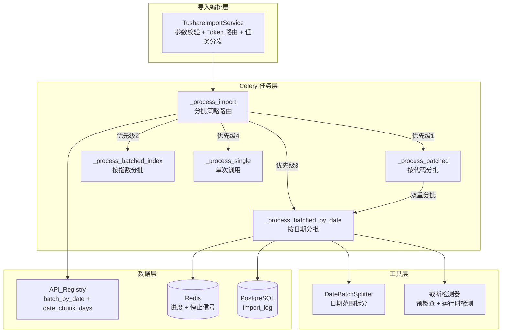
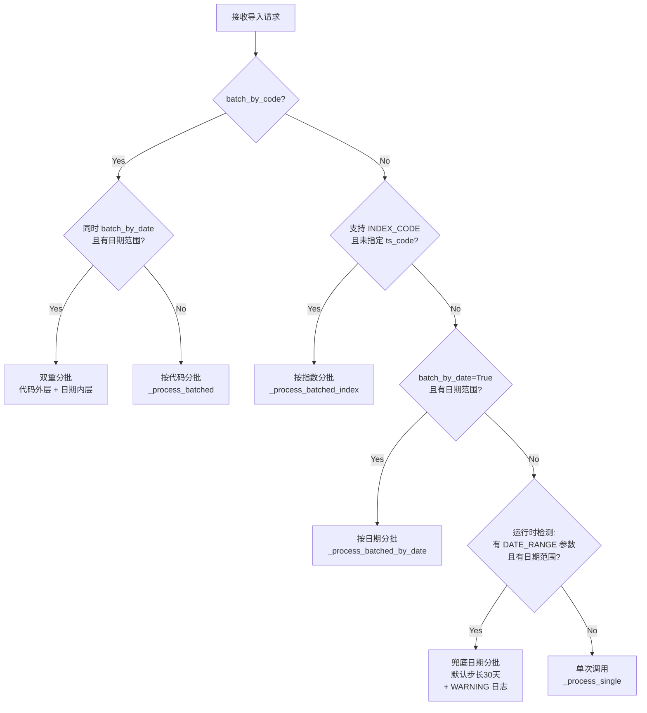

# 技术设计文档：Tushare 日期分批导入优化

## 概述

本设计为现有 Tushare 数据导入系统新增系统化的日期分批机制。当前系统已有按股票代码分批（`batch_by_code`）和按指数代码分批的逻辑，以及一个临时的 `_process_batched_by_date` 实现。本设计将：

1. **扩展注册表元数据**：在 `ApiEntry` 数据类中新增 `batch_by_date` 和 `date_chunk_days` 字段，为 60+ 个接口声明式配置日期分批参数
2. **提取独立的日期拆分器**：将现有 `_generate_date_chunks` 提升为独立的、可测试的 `DateBatchSplitter` 工具类
3. **重构导入引擎路由**：建立明确的分批策略优先级路由（代码分批 > 指数分批 > 日期分批 > 单次调用），支持双重分批
4. **增强截断检测**：预检查步长合理性 + 运行时截断警告 + 连续截断告警
5. **增强进度报告和日志持久化**：在 Redis 进度和数据库日志中记录分批模式、截断警告等详细信息

### 设计原则

- **声明式配置**：新增接口只需在注册表中标注 `batch_by_date=True` 和 `date_chunk_days`，无需修改导入引擎代码
- **向后兼容**：`batch_by_date` 默认 `False`，`date_chunk_days` 默认 `30`，不影响现有接口行为
- **渐进增强**：保留运行时兜底检测（未声明 `batch_by_date` 但有 DATE_RANGE 参数时自动分批），确保不遗漏
- **纯函数可测试**：日期拆分逻辑为纯函数，适合属性测试验证正确性

## 架构

### 系统架构图



### 分批策略路由流程



## 组件与接口

### 1. ApiEntry 扩展

在现有 `ApiEntry` 数据类中新增两个字段：

```python
@dataclass
class ApiEntry:
    # ... 现有字段 ...
    batch_by_date: bool = False       # 是否需要按日期自动分批
    date_chunk_days: int = 30         # 日期分批步长（天数）
```

**位置**：`app/services/data_engine/tushare_registry.py`

**影响范围**：仅新增字段，默认值确保向后兼容。需要为 60+ 个接口的 `register()` 调用添加这两个参数。

### 2. DateBatchSplitter

从现有 `_generate_date_chunks` 提取为独立的纯函数工具类，增强边界处理和验证。

```python
class DateBatchSplitter:
    """日期范围拆分器：将大日期范围按步长拆分为连续无重叠的子区间。"""

    @staticmethod
    def split(
        start_date: str,
        end_date: str,
        chunk_days: int,
    ) -> list[tuple[str, str]]:
        """将日期范围拆分为子区间。

        Args:
            start_date: 起始日期 YYYYMMDD
            end_date: 结束日期 YYYYMMDD
            chunk_days: 每个子区间的天数（正整数）

        Returns:
            [(chunk_start, chunk_end), ...] 列表，YYYYMMDD 格式

        Raises:
            ValueError: start_date > end_date 或 chunk_days <= 0
        """
```

**位置**：`app/services/data_engine/date_batch_splitter.py`（新文件）

**设计决策**：提取为独立模块而非保留在 `tushare_import.py` 中，原因：
- 纯函数，无副作用，便于单元测试和属性测试
- 可被 `_process_batched_by_date` 和双重分批场景复用
- 职责单一，符合现有项目的模块划分风格

### 3. 截断检测器

新增截断检测逻辑，包含预检查和运行时检测两部分。

```python
def check_chunk_config(
    date_chunk_days: int,
    max_rows: int,
    estimated_daily_rows: int | None,
    api_name: str,
) -> bool:
    """预检查步长配置合理性。

    Returns:
        True 表示配置合理，False 表示步长可能过大
    """

def check_truncation(
    row_count: int,
    max_rows: int,
    api_name: str,
    chunk_start: str,
    chunk_end: str,
) -> bool:
    """检测单个子区间是否被截断。

    Returns:
        True 表示检测到截断
    """
```

**位置**：集成在 `app/tasks/tushare_import.py` 中作为模块级辅助函数，不单独建文件（逻辑简单，与导入任务紧耦合）。

### 4. 导入引擎重构（_process_import）

重构 `_process_import` 中的分批策略路由逻辑：

**当前实现**：运行时动态推断（检查 `ParamType.DATE_RANGE` 是否在参数列表中 + 用户是否传了日期参数）

**新实现**：
1. 优先使用注册表声明的 `batch_by_date` 字段
2. 保留运行时推断作为兜底机制，但增加 WARNING 日志
3. 支持 `batch_by_code + batch_by_date` 双重分批

### 5. _process_batched_by_date 增强

在现有实现基础上增强：

- 使用 `DateBatchSplitter.split()` 替代内联的 `_generate_date_chunks`
- 使用注册表的 `date_chunk_days` 替代硬编码的 `_DATE_BATCH_DAYS = 30`
- 使用注册表的 `max_rows`（从 `extra_config` 读取）替代硬编码的 `_TUSHARE_MAX_ROWS = 3000`
- 新增预检查逻辑
- 新增连续截断检测（连续 3 个子区间截断时记录 ERROR）
- 新增 `truncation_warnings` 列表到 Redis 进度
- 新增 `batch_mode` 字段到 Redis 进度

### 6. _process_batched 增强（双重分批）

在现有按代码分批的循环内部，对于同时标记 `batch_by_date=True` 的接口（如 `stk_mins`），在每个 `ts_code` 的调用中额外按日期分批：

```python
for ts_code in batch:
    if entry.batch_by_date and has_date_params:
        # 双重分批：对当前 ts_code 按日期子区间逐批调用
        for chunk_start, chunk_end in date_chunks:
            call_params = {**params, "ts_code": ts_code,
                          "start_date": chunk_start, "end_date": chunk_end}
            # ... API 调用 + 写入 ...
    else:
        # 原有逻辑：单次调用
        call_params = {**params, "ts_code": ts_code}
        # ... API 调用 + 写入 ...
```

### 7. 进度报告增强

扩展 `_update_progress` 函数签名，新增字段：

```python
async def _update_progress(
    task_id: str,
    status: str = "running",
    total: int | None = None,
    completed: int | None = None,
    failed: int | None = None,
    current_item: str = "",
    error_message: str = "",
    batch_mode: str = "",                          # 新增
    truncation_warnings: list[dict] | None = None, # 新增
    needs_smaller_chunk: bool = False,              # 新增
) -> None:
```

### 8. 导入日志持久化增强

扩展 `_finalize_log` 函数，新增分批统计参数：

```python
async def _finalize_log(
    log_id: int,
    status: str,
    record_count: int,
    error_message: str | None = None,
    batch_stats: dict | None = None,  # 新增：{total_chunks, success_chunks, truncation_count}
) -> None:
```

**数据库变更**：`tushare_import_log` 表无需新增列。分批统计信息序列化为 JSON 存入现有的 `error_message` 字段（当无错误时）或新增一个 `extra_info` 字段。

**设计决策**：新增 `extra_info` TEXT 列存储 JSON 格式的分批统计，避免污染 `error_message` 的语义。需要一个 Alembic 迁移。

## 数据模型

### ApiEntry 扩展字段

| 字段名 | 类型 | 默认值 | 说明 |
|--------|------|--------|------|
| `batch_by_date` | `bool` | `False` | 是否需要按日期自动分批 |
| `date_chunk_days` | `int` | `30` | 日期分批步长（天数） |

### DateBatchSplitter 输入/输出

**输入**：

| 参数 | 类型 | 约束 |
|------|------|------|
| `start_date` | `str` | YYYYMMDD 格式，合法日期 |
| `end_date` | `str` | YYYYMMDD 格式，合法日期，>= start_date |
| `chunk_days` | `int` | 正整数 (> 0) |

**输出**：`list[tuple[str, str]]`

每个元组 `(chunk_start, chunk_end)` 满足：
- `chunk_start` 和 `chunk_end` 均为 YYYYMMDD 格式
- 第一个元组的 `chunk_start == start_date`
- 最后一个元组的 `chunk_end == end_date`
- 相邻元组：前一个 `chunk_end` + 1天 == 后一个 `chunk_start`
- 每个子区间跨度 <= `chunk_days` 天

### Redis 进度数据结构（增强后）

```json
{
  "status": "running",
  "total": 12,
  "completed": 5,
  "failed": 0,
  "current_item": "20230101-20230130",
  "error_message": "",
  "batch_mode": "by_date",
  "truncation_warnings": [
    {
      "chunk_start": "20230101",
      "chunk_end": "20230130",
      "row_count": 3000,
      "max_rows": 3000
    }
  ],
  "needs_smaller_chunk": false
}
```

`batch_mode` 取值：`"by_date"` | `"by_code"` | `"by_index"` | `"by_code_and_date"` | `"single"`

### tushare_import_log 表扩展

新增列：

| 列名 | 类型 | 说明 |
|------|------|------|
| `extra_info` | `TEXT` (nullable) | JSON 格式的分批统计信息 |

`extra_info` JSON 结构：

```json
{
  "batch_mode": "by_date",
  "total_chunks": 12,
  "success_chunks": 11,
  "truncation_count": 1,
  "truncation_details": [
    {"chunk": "20230101-20230130", "rows": 3000, "max_rows": 3000}
  ]
}
```

### 频率限制配置

从 `app/core/config.py` 的 `Settings` 读取，已有字段：

| 环境变量 | Settings 字段 | 默认值 | 对应 RateLimitGroup |
|----------|--------------|--------|-------------------|
| `RATE_LIMIT_KLINE` | `rate_limit_kline` | 0.18 | KLINE |
| `RATE_LIMIT_FUNDAMENTALS` | `rate_limit_fundamentals` | 0.40 | FUNDAMENTALS |
| `RATE_LIMIT_MONEY_FLOW` | `rate_limit_money_flow` | 0.30 | MONEY_FLOW |

当前 `_RATE_LIMIT_MAP` 在 `tushare_import.py` 中硬编码。需改为从 `settings` 读取。


## 正确性属性

*属性（Property）是指在系统所有合法执行中都应成立的特征或行为——本质上是对系统应做之事的形式化陈述。属性是人类可读规格说明与机器可验证正确性保证之间的桥梁。*

本特性中，`DateBatchSplitter` 是核心纯函数组件，输入空间大（任意合法日期对 × 任意正整数步长），非常适合属性测试。分批策略路由逻辑也可通过属性测试验证其对所有配置组合的正确性。

### Property 1: 子区间跨度上界

*For any* 合法的 start_date、end_date（start_date <= end_date）和正整数 chunk_days，`DateBatchSplitter.split()` 返回的每个子区间 `(chunk_start, chunk_end)` 的跨度（chunk_end - chunk_start + 1 天）SHALL 不超过 chunk_days。

**Validates: Requirements 2.2**

### Property 2: 子区间连续无重叠且边界对齐

*For any* 合法的 start_date、end_date 和正整数 chunk_days，`DateBatchSplitter.split()` 返回的子区间列表 SHALL 满足：
- 第一个子区间的 `chunk_start` 等于 `start_date`
- 最后一个子区间的 `chunk_end` 等于 `end_date`
- 对于任意相邻的两个子区间，前一个的 `chunk_end` 加 1 天恰好等于后一个的 `chunk_start`

**Validates: Requirements 2.3, 2.7**

### Property 3: 日期覆盖 Round-Trip

*For any* 合法的 start_date、end_date 和正整数 chunk_days，将 `DateBatchSplitter.split()` 返回的所有子区间展开为各自包含的日期集合，其并集 SHALL 恰好等于从 start_date 到 end_date 的完整日期集合（无遗漏、无多余）。

**Validates: Requirements 2.6**

### Property 4: 分批策略路由优先级

*For any* `ApiEntry` 配置（`batch_by_code`、`batch_by_date`、`required_params`、`optional_params` 的任意合法组合）和用户参数（是否包含 `ts_code`、`start_date`、`end_date`），`_process_import` 选择的分批策略 SHALL 严格遵循以下优先级：
1. `batch_by_code=True` → 按代码分批（若同时 `batch_by_date=True` 且有日期范围，则双重分批）
2. 支持 INDEX_CODE 且未指定 ts_code → 按指数分批
3. `batch_by_date=True` 且有日期范围 → 按日期分批
4. 以上均不满足 → 单次调用

**Validates: Requirements 4.1**

## 错误处理

### API 调用错误

| 错误类型 | 错误码 | 处理策略 |
|----------|--------|----------|
| Token 无效 | -2001 | 立即终止整个导入任务，抛出异常 |
| 频率限制 | -2002 | 等待 60 秒后重试，最多 3 次 |
| 网络超时 | - | 指数退避重试，最多 3 次 |
| HTTP 错误 | HTTP status | 记录日志，抛出异常 |
| 其他 API 错误 | 其他 | 记录错误日志，跳过当前子区间，继续下一个 |

### 数据库写入错误

- 单个子区间的 DB 写入失败：记录错误日志，跳过该子区间，继续处理
- 不影响其他子区间的数据完整性（每个子区间独立事务）

### 截断处理

- **单次截断**：WARNING 日志 + Redis 进度中记录截断警告
- **连续 3 次截断**：ERROR 日志 + Redis 进度中标记 `needs_smaller_chunk=true`，建议用户减小步长
- 截断不终止导入，数据可能不完整但已导入的部分是正确的

### 停止信号

- 每个子区间处理前检查 Redis 停止信号
- 收到停止信号时立即终止，返回已导入的记录数
- 已写入数据库的数据不回滚（幂等设计，ON CONFLICT 保证重复导入安全）

### 参数验证

- `DateBatchSplitter.split()` 对无效输入（start_date > end_date、chunk_days <= 0）抛出 `ValueError`
- `_process_batched_by_date` 在缺少日期参数时自动退回 `_process_single`

## 测试策略

### 属性测试（Property-Based Testing）

使用 **Hypothesis** 库（项目已有依赖），每个属性测试最少运行 **100 次迭代**。

**测试文件**：`tests/properties/test_date_batch_splitter_properties.py`

| 属性 | 测试标签 | 生成器策略 |
|------|---------|-----------|
| Property 1: 子区间跨度上界 | `Feature: tushare-date-batch-import, Property 1: chunk span bound` | `st.dates()` 生成 start/end，`st.integers(min_value=1, max_value=365)` 生成 chunk_days |
| Property 2: 连续无重叠边界对齐 | `Feature: tushare-date-batch-import, Property 2: contiguous non-overlapping boundary-aligned` | 同上 |
| Property 3: 日期覆盖 Round-Trip | `Feature: tushare-date-batch-import, Property 3: date coverage round-trip` | 同上 |
| Property 4: 策略路由优先级 | `Feature: tushare-date-batch-import, Property 4: strategy routing priority` | 自定义 `st.builds(ApiEntry, ...)` 生成随机配置 + `st.fixed_dictionaries()` 生成用户参数 |

**生成器设计要点**：
- 日期范围：使用 `st.dates(min_value=date(2000,1,1), max_value=date(2030,12,31))` 生成，通过 `assume(start <= end)` 过滤
- chunk_days：`st.integers(min_value=1, max_value=3650)` 覆盖从 1 天到 10 年
- ApiEntry 配置：组合 `batch_by_code`、`batch_by_date`、`required_params`、`optional_params` 的布尔/列表组合
- 边界情况由生成器自然覆盖：start == end、范围 < chunk_days、chunk_days = 1

### 单元测试

**测试文件**：`tests/services/test_date_batch_splitter.py`

| 测试场景 | 验证内容 |
|----------|---------|
| 基本拆分 | 30 天范围 / 10 天步长 → 3 个子区间 |
| 单日范围 | start == end → 1 个子区间 |
| 范围小于步长 | 5 天范围 / 30 天步长 → 1 个子区间 |
| 步长为 1 | 逐日拆分 |
| 跨月/跨年 | 日期格式正确 |
| 无效输入 | start > end → ValueError |
| chunk_days <= 0 | → ValueError |

**测试文件**：`tests/tasks/test_tushare_import_date_batch.py`

| 测试场景 | 验证内容 |
|----------|---------|
| 日期分批路由 | batch_by_date=True + 日期参数 → 调用 _process_batched_by_date |
| 兜底路由 | 未声明 batch_by_date 但有 DATE_RANGE → 兜底分批 + WARNING |
| 双重分批 | batch_by_code + batch_by_date → 代码外层 + 日期内层 |
| 截断检测 | 返回 max_rows 行 → WARNING 日志 |
| 连续截断 | 3 个子区间截断 → ERROR 日志 + needs_smaller_chunk |
| 停止信号 | 中途停止 → 返回已导入记录数 |
| Token 无效 | -2001 → 立即终止 |
| 进度更新 | 每个子区间后 Redis 进度正确更新 |
| use_trade_date_loop | 参数转换为 trade_date |
| 频率限制从配置读取 | _RATE_LIMIT_MAP 使用 settings 值 |

### 集成测试

**测试文件**：`tests/integration/test_date_batch_import.py`

- 使用 mock TushareAdapter 模拟多个子区间的 API 调用
- 验证端到端流程：参数校验 → 任务分发 → 日期拆分 → 逐批调用 → 数据写入 → 进度更新 → 日志持久化
- 验证 Alembic 迁移后 `extra_info` 列可正常读写
