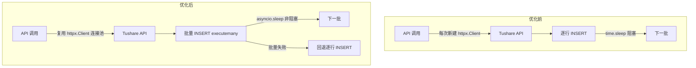
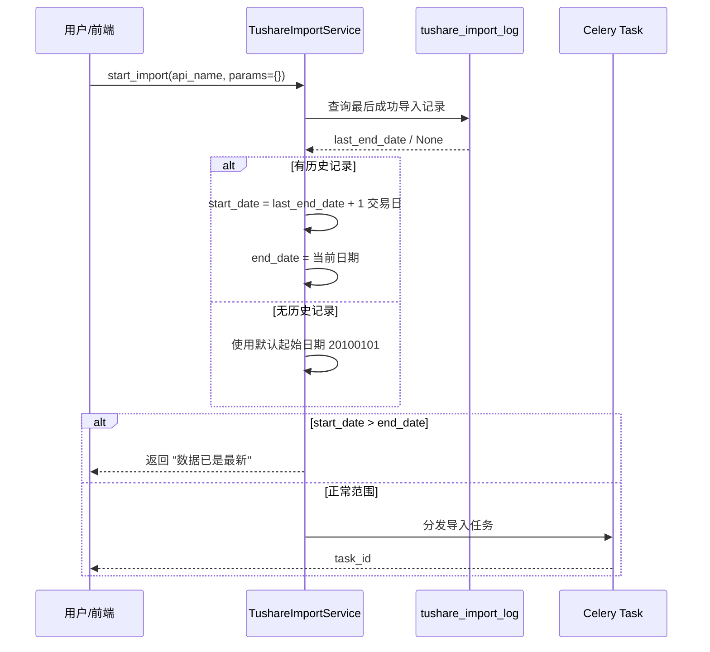

# 设计文档：Tushare 数据导入性能优化

## 概述

本次优化针对 Tushare 数据导入管道的 8 个问题进行系统性改进，核心目标是提升写入性能（批量 INSERT）、减少网络开销（HTTP 连接池复用）、消除 asyncio 阻塞、增加增量导入能力和数据完整性校验。所有改动限定在后端数据导入相关模块，不涉及前端变更和数据库 schema 变更。

## 设计原则

1. **向后兼容**：不改变现有 API 接口、注册表结构、Redis 键格式
2. **最小侵入**：优先修改函数内部实现，不改变函数签名
3. **渐进降级**：批量操作失败时自动回退到逐行模式，保证数据不丢失
4. **可观测性**：新增的失败项记录通过现有 batch_stats / extra_info 机制暴露

## 架构

### 优化前后对比



## 主要工作流

### 增量导入调度流程



## 组件与接口

### 组件 1: 批量写入优化

**修改文件：** `app/tasks/tushare_import.py`

**涉及函数：**

```python
# _write_to_postgresql: 批量 INSERT + 回退机制
async def _write_to_postgresql(rows: list[dict], entry: ApiEntry) -> None:
    # 变更：将逐行 session.execute(stmt, row) 改为
    # session.execute(stmt, filtered_rows)  # executemany 语义
    # 失败时回退到逐行模式
    ...

# _write_to_kline: 批量 INSERT
async def _write_to_kline(rows: list[dict], entry: ApiEntry, freq: str) -> None:
    # 变更：构建参数列表，一次 executemany 写入
    ...

# _write_to_adjustment_factor: 批量 INSERT
async def _write_to_adjustment_factor(rows: list[dict], entry: ApiEntry) -> None:
    # 变更：同上
    ...

# _write_to_sector_kline: 批量 INSERT
async def _write_to_sector_kline(rows: list[dict], entry: ApiEntry, freq: str, data_source: str) -> None:
    # 变更：同上
    ...
```

**实现策略：**

PostgreSQL 写入（`_write_to_postgresql`）：
- 将现有的 `for row in filtered_rows: await session.execute(stmt, row)` 循环改为 `await session.execute(stmt, filtered_rows)`，SQLAlchemy 的 `text()` + 参数列表自动使用 executemany 语义
- 分批处理：每批最多 1000 行，避免单次事务过大
- 回退机制：当 executemany 抛出异常时（如某行数据类型不匹配），捕获异常后回退到逐行 INSERT，逐行模式下单行失败仅跳过该行并记录 WARNING

TimescaleDB 写入（`_write_to_kline` 等）：
- 将逐行 execute 改为先构建参数字典列表，再一次性 executemany
- 数据预处理（trade_date 解析、symbol 提取）在构建参数列表阶段完成，无效行直接跳过
- 同样支持分批（每批 1000 行）和回退

### 组件 2: HTTP 连接池复用

**修改文件：** `app/services/data_engine/tushare_adapter.py`

**涉及类：** `TushareAdapter`

```python
class TushareAdapter(BaseDataSourceAdapter):
    def __init__(self, api_token=None, api_url=None, timeout=30.0):
        ...
        # 新增：延迟初始化的持久 httpx.AsyncClient
        self._client: httpx.AsyncClient | None = None

    async def _get_client(self) -> httpx.AsyncClient:
        """获取或创建持久 HTTP 客户端。"""
        if self._client is None or self._client.is_closed:
            self._client = httpx.AsyncClient(timeout=self._timeout)
        return self._client

    async def close(self) -> None:
        """关闭 HTTP 客户端，释放连接池资源。"""
        if self._client and not self._client.is_closed:
            await self._client.aclose()
            self._client = None

    async def _call_api(self, api_name: str, **params) -> dict:
        # 变更：使用 self._get_client() 替代 async with httpx.AsyncClient()
        client = await self._get_client()
        resp = await client.post(self._api_url, json=payload)
        ...
```

**修改文件：** `app/tasks/tushare_import.py`

在 `_process_import` 的 `finally` 块中调用 `adapter.close()`：

```python
async def _process_import(...):
    adapter = TushareAdapter(api_token=token)
    try:
        ...
    finally:
        await adapter.close()  # 新增：确保连接池释放
        lock_key = f"{_LOCK_KEY_PREFIX}{api_name}"
        await _redis_delete(lock_key)
```

**向后兼容：** `TushareAdapter` 的公开接口（`fetch_kline`、`fetch_fundamentals` 等）中使用 `async with httpx.AsyncClient()` 的短生命周期调用方式不受影响——这些方法仍可独立使用。`_call_api` 改为使用持久 client 后，短生命周期场景（如 `health_check`）也能正常工作，因为 `_get_client` 会按需创建。

### 组件 3: asyncio.sleep 替换

**修改文件：** `app/tasks/tushare_import.py`

**变更点：** 全局搜索 `time.sleep(` 替换为 `await asyncio.sleep(`，涉及以下位置：

1. `_process_chunk_with_retry` 中截断重试后的频率限制（约第 695 行）
2. `_process_batched_by_date` 中每个 chunk 处理后的频率限制（约第 948 行）
3. `_process_batched` 中每个 ts_code 处理后的频率限制（约第 1136、1198 行）
4. `_process_batched_index` 中每个指数处理后的频率限制（约第 1486 行）
5. `_process_batched_by_sector` 中每个板块处理后的频率限制（约第 1659 行）

**不变更：** `_call_api_with_retry` 中的 `time.sleep(_RATE_LIMIT_WAIT)` 和 `time.sleep(2 * (attempt + 1))` 也替换为 `await asyncio.sleep()`。死锁重试中的 `_time.sleep(wait)` 同样替换。

### 组件 4: 增量导入智能调度

**修改文件：** `app/services/data_engine/tushare_import_service.py`

**新增方法：**

```python
async def _resolve_incremental_dates(
    self, api_name: str, entry: ApiEntry, params: dict,
) -> dict:
    """为缺少日期参数的导入请求自动推断 start_date / end_date。

    逻辑：
    1. 如果用户已指定 start_date 和 end_date，原样返回
    2. 查询 tushare_import_log 获取该接口最后成功导入的参数
    3. 从历史参数中提取 end_date，+1 天作为新的 start_date
    4. end_date 默认为当前日期（YYYYMMDD）
    5. 如果无历史记录，start_date 默认为 20100101

    Returns:
        更新后的 params 字典

    Raises:
        ValueError: start_date > end_date（数据已是最新）
    """
```

**修改 `start_import` 方法：** 在参数校验之前调用 `_resolve_incremental_dates`。

**查询逻辑：**

```python
async def _get_last_successful_end_date(self, api_name: str) -> str | None:
    """查询该接口最后一次成功导入的 end_date。

    从 tushare_import_log 中查找 status='completed' 且 api_name 匹配的最新记录，
    从其 params_json 中提取 end_date。

    Returns:
        YYYYMMDD 格式的日期字符串，或 None（无历史记录）
    """
```

### 组件 5: 数据完整性校验

**修改文件：** `app/tasks/tushare_import.py`

**变更点：**

在 `_process_batched` 中新增失败项追踪：

```python
async def _process_batched(...) -> dict:
    ...
    failed_codes: list[str] = []  # 新增
    ...
    except Exception as exc:
        failed_codes.append(ts_code)  # 新增
        logger.error(...)
    ...
    return {
        "status": "completed",
        "record_count": total_records,
        "batch_stats": {  # 新增
            "batch_mode": batch_mode,
            "total_codes": num_codes,
            "failed_codes": failed_codes[:100],
        },
    }
```

在 `_process_batched_index` 中同样新增失败项追踪：

```python
async def _process_batched_index(...) -> dict:
    ...
    failed_codes: list[str] = []  # 新增
    ...
    except Exception as exc:
        failed_codes.append(ts_code)  # 新增
        logger.error(...)
    ...
    return {
        "status": "completed",
        "record_count": total_records,
        "batch_stats": {  # 新增
            "batch_mode": "by_index",
            "total_indices": total,
            "failed_codes": failed_codes[:100],
        },
    }
```

在 `_process_batched_by_date` 中新增失败区间追踪（已有 truncation_warnings，新增 failed_chunks）：

```python
failed_chunks: list[str] = []  # 新增
...
except Exception as exc:
    failed_chunks.append(f"{chunk_start}-{chunk_end}")  # 新增
...
# 在 batch_stats 中包含 failed_chunks
```

在 `_update_progress` 中新增 `failed_items` 字段传递。

### 组件 6: 股票代码后缀优化

**修改文件：** `app/tasks/tushare_import.py`

**修改函数：** `_get_stock_list`

```python
async def _get_stock_list() -> list[str]:
    """从 stock_info 表获取全市场有效股票的 ts_code 列表。"""
    from sqlalchemy import select
    from app.core.database import AsyncSessionPG
    from app.models.stock import StockInfo

    async with AsyncSessionPG() as session:
        stmt = (
            select(StockInfo.symbol, StockInfo.market)  # 新增：查询 market 字段
            .where(StockInfo.is_delisted == False)
            .order_by(StockInfo.symbol)
        )
        result = await session.execute(stmt)
        rows = result.all()

    ts_codes = []
    for row in rows:
        sym = str(row.symbol)
        market = row.market  # SH/SZ/BJ 或 None

        # 优先使用 market 字段
        if market and market in ("SH", "SZ", "BJ"):
            ts_codes.append(f"{sym}.{market}")
            continue

        # 回退到前缀推断
        if sym.startswith("6"):
            ts_codes.append(f"{sym}.SH")
        elif sym.startswith("0") or sym.startswith("3"):
            ts_codes.append(f"{sym}.SZ")
        elif sym.startswith("4") or sym.startswith("8"):
            ts_codes.append(f"{sym}.BJ")
        else:
            logger.warning("无法确定股票 %s 的交易所，默认归类为 SZ", sym)
            ts_codes.append(f"{sym}.SZ")

    return ts_codes
```

### 组件 7: 频率限制配置热更新

**修改文件：** `app/tasks/tushare_import.py`

**变更：** 将模块级 `_RATE_LIMIT_MAP` 的使用改为函数调用：

```python
# 删除模块级缓存：
# _RATE_LIMIT_MAP: dict[RateLimitGroup, float] = _build_rate_limit_map()

# 在 _process_import 中：
rate_delay = _build_rate_limit_map().get(entry.rate_limit_group, 0.18)
# 替代原来的：
# rate_delay = _RATE_LIMIT_MAP.get(entry.rate_limit_group, 0.18)
```

`_build_rate_limit_map()` 每次从 `settings` 读取最新值，开销可忽略（仅在任务启动时调用一次）。

### 组件 8: sector 成分 trade_date 逻辑

**修改文件：** `app/tasks/tushare_import.py`

**分析：** 当前 `_process_batched_by_sector` 中的 trade_date 注入逻辑（第 1605-1609 行）和 sector_constituent 表的冲突键 `(trade_date, sector_code, data_source, symbol)` 已经能正确处理成分变化——每次导入注入当天日期，不同日期的记录不会冲突。

**实际问题：** 如果同一天多次导入同一板块，ON CONFLICT DO NOTHING 会忽略后续导入。这在实际使用中不是问题（同一天成分不会变化）。

**优化点：** 在 `_process_batched_by_sector` 的日志和 batch_stats 中增加 trade_date 信息，便于追溯。无需修改冲突策略。

## 错误处理

### 场景 1: 批量 INSERT 失败回退

- **条件：** `session.execute(stmt, filtered_rows)` 抛出异常（如某行数据类型不匹配）
- **响应：** 捕获异常，记录 WARNING 日志，回退到逐行 INSERT 模式
- **恢复：** 逐行模式下单行失败仅跳过该行，其余行正常写入

### 场景 2: httpx.AsyncClient 连接池异常

- **条件：** 持久 client 因网络中断等原因进入不可用状态
- **响应：** `_get_client` 检测 `is_closed` 状态，自动重建 client
- **恢复：** 下次 API 调用使用新的 client 实例

### 场景 3: 增量导入日期推断失败

- **条件：** tushare_import_log 中的历史 params_json 格式异常
- **响应：** 捕获异常，回退到默认起始日期 20100101
- **恢复：** 记录 WARNING 日志，正常继续导入

## 性能考量

| 优化项 | 优化前 | 优化后 | 预期提升 |
|--------|--------|--------|----------|
| PG 写入 5000 行 | 5000 次 execute | 5 次 executemany (1000行/批) | 10-50x |
| TS 写入 5000 行 | 5000 次 execute | 5 次 executemany | 10-50x |
| HTTP 连接 (5000 次 API 调用) | 5000 次 TCP 建连 | 1 次建连 + 连接复用 | 减少 ~2s/次 × 5000 |
| 频率限制等待 | 阻塞 event loop | 非阻塞 | Redis 操作不再超时 |

## 安全考量

- 批量 INSERT 仍使用参数化查询（`:param` 占位符），无 SQL 注入风险
- HTTP 连接池复用不影响 Token 安全性（Token 在请求体中传递，非 Header）
- 增量日期推断仅读取 tushare_import_log，不暴露敏感信息

## 依赖

- 无新增外部依赖
- 所有改动基于现有的 SQLAlchemy 2.0、httpx、asyncio 能力
- 不需要数据库 schema 变更或 Alembic 迁移
