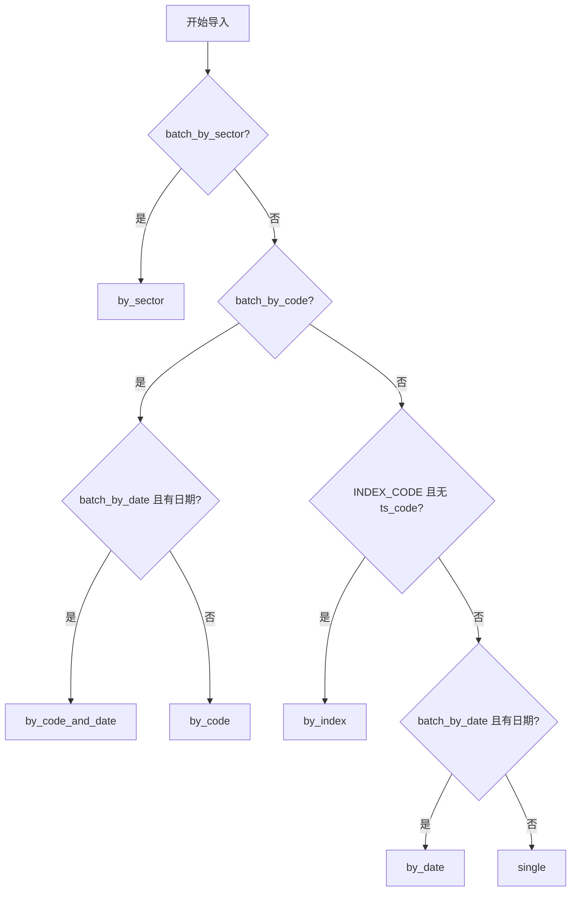

# 设计文档：Tushare 导入超时优化

## 概述

本设计文档描述如何优化 Tushare 导入任务的超时问题。当前多个接口因 `SoftTimeLimitExceeded` 超时失败，根本原因是 `batch_by_date=True` 配置导致 API 调用次数爆炸。

### 问题分析

**当前配置问题：**
- 6 个接口配置了 `batch_by_date=True`，按日期分批
- 这些接口支持 `ParamType.STOCK_CODE`，不传 `ts_code` 时自动遍历全市场 5000+ 只股票
- 日期分批 × 股票代码分批 = 数万次 API 调用
- Celery 任务超时 2 小时不足以完成

**优化方案：**
1. 将 6 个接口从 `batch_by_date=True` 改为 `batch_by_code=True`
2. 增加 Celery 任务超时时间（soft_time_limit: 7200→14400, time_limit: 10800→18000）

### 设计决策

| 决策 | 理由 |
|------|------|
| 改为 `batch_by_code=True` | 按股票代码分批，每只股票一次 API 调用，总调用次数 = 股票数（~5000 次） |
| 移除 `date_chunk_days` | 不再需要日期分批，使用默认值即可 |
| 增加超时时间 | 兜底保护，防止极端情况超时 |

## 架构

### 分批策略路由



### 修改前后对比

**第一批接口（改为 batch_by_code）：**
| 接口 | 修改前策略 | 修改后策略 | API 调用次数估算 |
|------|-----------|-----------|-----------------|
| stk_holdernumber | by_date (10天/批) | by_code | ~5000 (原: 日期批数×5000) |
| block_trade | by_date (30天/批) | by_code | ~5000 |
| share_float | by_date (60天/批) | by_code | ~5000 |
| repurchase | by_date (60天/批) | by_code | ~5000 |
| pledge_detail | by_date (15天/批) | by_code | ~5000 |
| pledge_stat | by_date (4天/批) | by_code | ~5000 |

**第二批接口 - 双重分批问题（改为 batch_by_code）：**
| 接口 | 修改前策略 | 修改后策略 | API 调用次数估算 |
|------|-----------|-----------|-----------------|
| report_rc | by_date (30天/批) | by_code | ~5000 |
| ccass_hold_detail | by_date (15天/批) | by_code | ~5000 |
| stk_nineturn | by_date (60天/批) | by_code | ~5000 |
| stk_ah_comparison | by_date (30天/批) | by_code | ~5000 |
| stk_surv | by_date (60天/批) | by_code | ~5000 |

**第二批接口 - 日期分批过多（增加 date_chunk_days）：**
| 接口 | 修改前 date_chunk_days | 修改后 date_chunk_days | API 调用次数估算 |
|------|----------------------|----------------------|-----------------|
| daily_basic | 1 | 30 | ~365/30≈12 (原: 365) |
| bak_daily | (未设置) | 30 | ~12 |
| stk_factor_pro | 1 | 30 | ~12 |
| hk_hold | 1 | 30 | ~12 |

## 组件和接口

### ApiEntry 配置修改

**修改文件：** `app/services/data_engine/tushare_registry.py`

**第一批接口（改为 batch_by_code）：**

| 接口 | 字段 | 修改前 | 修改后 |
|------|------|--------|--------|
| stk_holdernumber | batch_by_date | True | False |
| stk_holdernumber | batch_by_code | False | True |
| stk_holdernumber | date_chunk_days | 10 | (移除) |
| block_trade | batch_by_date | True | False |
| block_trade | batch_by_code | False | True |
| block_trade | date_chunk_days | 30 | (移除) |
| share_float | batch_by_date | True | False |
| share_float | batch_by_code | False | True |
| share_float | date_chunk_days | 60 | (移除) |
| repurchase | batch_by_date | True | False |
| repurchase | batch_by_code | False | True |
| repurchase | date_chunk_days | 60 | (移除) |
| pledge_detail | batch_by_date | True | False |
| pledge_detail | batch_by_code | False | True |
| pledge_detail | date_chunk_days | 15 | (移除) |
| pledge_stat | batch_by_date | True | False |
| pledge_stat | batch_by_code | False | True |
| pledge_stat | date_chunk_days | 4 | (移除) |

**第二批接口 - 双重分批问题（改为 batch_by_code）：**

| 接口 | 字段 | 修改前 | 修改后 |
|------|------|--------|--------|
| report_rc | batch_by_date | True | False |
| report_rc | batch_by_code | False | True |
| report_rc | date_chunk_days | 30 | (移除) |
| ccass_hold_detail | batch_by_date | True | False |
| ccass_hold_detail | batch_by_code | False | True |
| ccass_hold_detail | date_chunk_days | 15 | (移除) |
| stk_nineturn | batch_by_date | True | False |
| stk_nineturn | batch_by_code | False | True |
| stk_nineturn | date_chunk_days | 60 | (移除) |
| stk_ah_comparison | batch_by_date | True | False |
| stk_ah_comparison | batch_by_code | False | True |
| stk_ah_comparison | date_chunk_days | 30 | (移除) |
| stk_surv | batch_by_date | True | False |
| stk_surv | batch_by_code | False | True |
| stk_surv | date_chunk_days | 60 | (移除) |

**第二批接口 - 日期分批过多（增加 date_chunk_days）：**

| 接口 | 字段 | 修改前 | 修改后 |
|------|------|--------|--------|
| daily_basic | date_chunk_days | 1 | 30 |
| bak_daily | date_chunk_days | (未设置) | 30 |
| stk_factor_pro | date_chunk_days | 1 | 30 |
| hk_hold | date_chunk_days | 1 | 30 |

### Celery 任务超时配置修改

**修改文件：** `app/tasks/tushare_import.py`

**修改内容：**

```python
# 修改前
@celery_app.task(
    ...
    soft_time_limit=7200,   # 2 小时
    time_limit=10800,       # 3 小时
    ...
)

# 修改后
@celery_app.task(
    ...
    soft_time_limit=14400,  # 4 小时
    time_limit=18000,       # 5 小时
    ...
)
```

## 数据模型

本次修改不涉及数据模型变更。

## 正确性属性

*A property is a characteristic or behavior that should hold true across all valid executions of a system-essentially, a formal statement about what the system should do. Properties serve as the bridge between human-readable specifications and machine-verifiable correctness guarantees.*

### Property 1: 接口配置正确性

*For any* 修改后的接口（stk_holdernumber, block_trade, share_float, repurchase, pledge_detail, pledge_stat），其 `batch_by_code` 必须为 `True`，`batch_by_date` 必须为 `False`。

**Validates: Requirements 1.1, 1.2, 1.3, 1.4, 1.5, 1.6**

### Property 2: date_chunk_days 移除验证

*For any* 修改后的接口，`date_chunk_days` 字段应为默认值 30（不再显式设置）。

**Validates: Requirements 1.7**

### Property 3: optional_params 保留验证

*For any* 修改后的接口，`optional_params` 必须包含 `ParamType.STOCK_CODE` 和 `ParamType.DATE_RANGE`。

**Validates: Requirements 1.8**

### Property 4: Celery 超时配置正确性

*For the* `run_import` Celery 任务，`soft_time_limit` 必须为 14400，`time_limit` 必须为 18000。

**Validates: Requirements 2.1, 2.2**

### Property 5: 分批策略路由正确性

*For any* 修改后的接口，当用户不传 `ts_code` 时，`determine_batch_strategy()` 必须返回 `"by_code"`。

**Validates: Requirements 1.1-1.6**

### Property 6: 向后兼容性 - 表名不变

*For any* 修改后的接口，`target_table` 必须与修改前相同。

**Validates: Requirements 5.1**

### Property 7: 向后兼容性 - 冲突列不变

*For any* 修改后的接口，`conflict_columns` 和 `conflict_action` 必须与修改前相同。

**Validates: Requirements 5.1**

### Property 8: 向后兼容性 - 速率限制组不变

*For any* 修改后的接口，`rate_limit_group` 必须与修改前相同。

**Validates: Requirements 5.2**

### Property 9: 进度数据结构完整性

*For any* `batch_by_code` 模式的导入任务，进度数据必须包含 `total`、`completed`、`failed`、`current_item` 字段。

**Validates: Requirements 3.1**

### Property 10: 错误隔离性

*For any* `batch_by_code` 模式的导入任务，单只股票导入失败不应影响其他股票的导入，最终 `completed + failed = total`。

**Validates: Requirements 4.3**

## 错误处理

### 已有错误处理机制

1. **API 调用失败**：单只股票失败记录到 `failed` 计数，继续处理下一只
2. **超时处理**：`SoftTimeLimitExceeded` 异常触发优雅退出
3. **停止信号**：用户可手动停止任务，Redis 信号通知

### 本次修改不影响错误处理

- `batch_by_code` 模式已有完善的错误隔离机制
- 超时时间增加只是延长执行窗口，不改变错误处理逻辑

## 测试策略

### 单元测试

| 测试项 | 文件 | 说明 |
|--------|------|------|
| 接口配置验证 | `tests/services/test_tushare_registry.py` | 验证 6 个接口的配置正确 |
| 分批策略路由 | `tests/tasks/test_tushare_import.py` | 验证 `determine_batch_strategy()` 返回正确策略 |
| 超时配置验证 | `tests/tasks/test_tushare_import_task.py` | 验证 Celery 任务超时配置 |

### 属性测试

使用 Hypothesis 进行属性测试，验证：

1. **接口配置属性**：验证修改后的接口配置符合预期
2. **分批策略路由属性**：验证 `determine_batch_strategy()` 对各种输入的正确路由
3. **向后兼容性属性**：验证修改后的接口保持向后兼容

**测试文件：** `tests/properties/test_tushare_import_timeout_props.py`

**配置：**
- 最小迭代次数：100
- 每个属性测试引用设计文档中的属性编号

### 集成测试

| 测试项 | 说明 |
|--------|------|
| 全量导入测试 | 使用测试 Token 执行全市场导入，验证完成时间 |
| 超时边界测试 | 模拟大量数据导入，验证超时配置生效 |

### 测试标签格式

```
Feature: tushare-import-timeout-optimization, Property {number}: {property_text}
```
