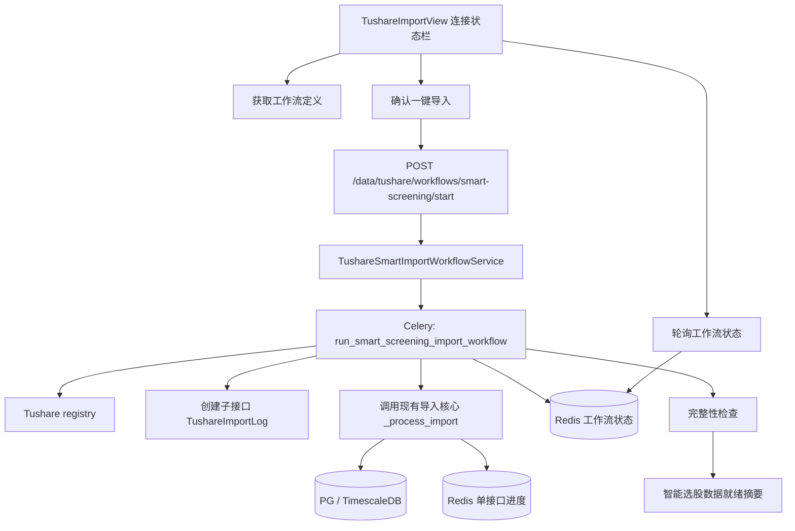

# 智能选股 Tushare 一键数据导入工作流 Design

## 概览

本设计在现有 Tushare 数据导入页增加“智能选股一键导入”工作流，用后端统一编排智能选股策略依赖的行情、指标和专题数据导入顺序。工作流复用现有 Tushare 注册表、Token 路由、分批导入、写入和导入日志能力，在工作流层增加定义、执行状态、停止/恢复和完整性检查。

该功能目标不是替代现有单接口导入，而是为智能选股提供一个可审计、可恢复、默认参数合理的数据准备入口，帮助量化交易员判断“未选出股票”究竟是行情/指标数据缺失，还是策略筛选逻辑过严。

## 设计原则

1. **后端编排优先**：前端只负责展示、确认、启动和轮询，不在浏览器里串行拼接多个 `/data/tushare/import` 请求。
2. **复用现有导入核心**：子接口继续使用 Tushare registry、Token tier、参数校验、分批策略、截断检测、字段映射和写入逻辑。
3. **避免 Celery 嵌套等待死锁**：工作流任务不调用 `TushareImportService.start_import()` 后阻塞等待同队列子任务；而是在工作流 Celery 任务内顺序创建子导入日志并调用现有导入处理核心。
4. **保留单接口日志**：每个子接口仍写入 `tushare_import_log`，方便复用现有历史记录、问题排查和导入统计。
5. **工作流状态轻量化**：工作流级状态存 Redis，24 小时 TTL；后续若需要长期审计，可再落库。
6. **默认链路服务智能选股**：默认阶段优先覆盖当前 28 个内置/示例策略使用的数据，扩展数据源通过选项启用。

## 架构



## 后端设计

### 新增模块

新增 `app/services/data_engine/tushare_smart_import_workflow.py`，负责工作流定义、启动参数生成、状态读写和完整性检查。

核心数据结构：

```python
@dataclass(frozen=True)
class WorkflowStep:
    api_name: str
    label: str
    factor_groups: list[str]
    default_params: dict[str, Any]
    required_token_tier: str
    optional: bool = False
    continue_on_failure: bool = False

@dataclass(frozen=True)
class WorkflowStage:
    key: str
    label: str
    description: str
    steps: list[WorkflowStep]

@dataclass(frozen=True)
class WorkflowDefinition:
    workflow_key: str
    label: str
    mode: str
    stages: list[WorkflowStage]

@dataclass
class WorkflowRunState:
    workflow_task_id: str
    status: str
    mode: str
    current_stage_key: str | None
    current_api_name: str | None
    completed_steps: int
    failed_steps: int
    total_steps: int
    child_tasks: list[dict[str, Any]]
    readiness: dict[str, Any] | None
    error_message: str | None
```

状态枚举使用字符串：`pending`、`running`、`paused`、`completed`、`failed`、`stopped`。

### 工作流定义

`build_smart_screening_workflow_definition(options)` 返回默认工作流定义。默认导入链路：

| 阶段 | 接口 | 说明 |
|------|------|------|
| 基础证券和交易日历 | `stock_basic`、`trade_cal` | 股票池、交易日推断、按代码分批依赖 |
| 股票日线主行情和复权 | `daily`、`adj_factor` | MA、突破、MACD、BOLL、RSI、DMA、成交额 |
| 日指标和 K 线辅助字段 | `daily_basic` | 换手率、市值、PE 等基础面字段，并触发既有 K 线辅助字段回填 |
| 技术专题指标 | `stk_factor_pro` | KDJ 等 Tushare 技术因子 |
| 资金流专题 | `moneyflow_dc` | 默认主力资金/大单/超大单资金流来源 |
| 板块数据 | `dc_index`、`dc_member`、`dc_daily` | 默认 DC 板块信息、成分、行情 |
| 指数专题 | `index_basic`、`index_daily`、`index_weight`、`index_dailybasic`、`idx_factor_pro` | 指数趋势和大盘专题 |
| 扩展专题因子 | `cyq_perf`、`margin_detail`、`limit_list_d`、`limit_step`、`top_list` | 筹码、两融、打板、龙虎榜 |
| 完整性检查 | 无导入接口 | 生成智能选股数据就绪摘要 |

可选扩展：

- `include_moneyflow_ths`: 追加 `moneyflow_ths`。
- `include_ths_sector`: 追加 `ths_index`、`ths_member`、`ths_daily`。
- `include_tdx_sector`: 追加 `tdx_index`、`tdx_member`、`tdx_daily`。
- `include_ti_sector`: 追加 `index_classify`、`index_member_all`、`sw_daily`。
- `include_ci_sector`: 追加 `ci_index_member`、`ci_daily`。

旧接口 `moneyflow` 不进入默认工作流，只在后续兼容选项中保留。

工作流初版使用显式默认依赖清单，同时提供 `derive_strategy_dependency_summary()` 作为校验辅助：从 `factor_registry.py`、`strategy_examples.py` 和内置策略模板扫描当前使用因子，输出“已覆盖/未覆盖/兼容风险”摘要。该摘要用于工作流定义响应、完整性检查和测试断言，避免后续新增策略或因子时静默遗漏。

### 默认参数策略

启动接口支持 `mode`：

- `incremental`：日常增量，默认由前端传入最近一天日期范围，即 `start_date = end_date = 当前日期`（Asia/Shanghai）。这是每天 18:00 后导入当天数据的常规路径。
- `initialize`：首次初始化，前端提供近 1 年快捷范围，满足 MA250、突破和趋势类策略基础使用。

参数生成规则：

- 无日期参数接口传 `{}` 或 registry 要求的默认字段。
- `DATE_RANGE` 接口优先使用工作流请求中的 `date_range.start_date`、`date_range.end_date`，格式 `YYYYMMDD`。
- 若工作流请求未提供日期范围，则服务端按 Asia/Shanghai 当前日期兜底为最近一天；不再默认扩大到最近 10 天。
- `index_weight` 需要 `INDEX_CODE + DATE_RANGE`，默认核心指数集合建议为：`000001.SH`、`399001.SZ`、`399006.SZ`、`000300.SH`、`000905.SH`、`000852.SH`。实际执行时由步骤展开为多个子步骤，或在任务内按指数循环。
- 板块成分类接口沿用 registry 的 `batch_by_sector` 策略，依赖对应板块基础信息先导入。
- 所有参数在执行前仍调用现有 `_validate_params()` 和 `_check_dependency()`。

前端日期范围：

- 在连接状态栏“一键导入”按钮左侧放置起始日期和结束日期控件。
- 默认值为当前日期到当前日期，使用系统时区 Asia/Shanghai。
- 起始日期不得晚于结束日期；不合法时禁用“一键导入”并显示错误。
- 当前时间早于 18:00 且结束日期为当前日期时，确认面板提示“当天数据可能尚未完整”。
- 确认面板展示最终同步到工作流的日期范围。

### 执行服务

新增 `TushareSmartImportWorkflowService`：

- `get_definition(options: dict) -> dict`
- `start_workflow(mode: str, options: dict) -> dict`
- `get_status(workflow_task_id: str) -> dict`
- `stop_workflow(workflow_task_id: str) -> dict`
- `get_running_workflow() -> dict | None`
- `resume_workflow(workflow_task_id: str) -> dict`
- `run_readiness_check() -> dict`

Redis 键：

- `tushare:workflow:{workflow_task_id}`：工作流状态 JSON，TTL 24h。
- `tushare:workflow:pause:{workflow_task_id}`：暂停信号，TTL 24h。
- `tushare:workflow:stop:{workflow_task_id}`：停止信号，TTL 24h。
- `tushare:workflow:running:smart-screening`：当前运行任务 ID，TTL 24h。

并发规则：

- 同一时刻只允许一个 `smart-screening` 工作流运行。
- 子接口执行前检查现有 `tushare:import:lock:{api_name}`。若被单接口导入占用，则工作流标记该步骤为失败并中止，提示用户稍后继续。
- 工作流执行子接口时也设置同样的单接口锁，避免与手动导入冲突。

### Celery 任务

新增 `app/tasks/tushare_workflow.py`：

```python
@celery_app.task(
    bind=True,
    base=DataSyncTask,
    name="app.tasks.tushare_workflow.run_smart_screening_import_workflow",
    queue="data_sync",
    soft_time_limit=28800,
    time_limit=32400,
)
def run_smart_screening_import_workflow(self, workflow_task_id: str, mode: str, options: dict) -> dict:
    ...
```

执行方式：

1. 加载工作流定义。
2. 写入工作流 `running` 状态。
3. 对每个阶段、每个步骤：
   - 检查停止信号；
   - 从 registry 获取 `ApiEntry`；
   - 生成并校验参数；
   - 解析 token；
   - 创建一条 `tushare_import_log`；
   - 初始化 `tushare:import:{child_task_id}` 进度；
   - 直接调用现有导入核心 `_process_import(api_name, params, token, log_id, child_task_id)`；
   - 根据子接口结果更新工作流状态。
4. 全部步骤结束后执行完整性检查。
5. 更新工作流终态并释放 running 键。

需要对 `app/tasks/tushare_import.py` 做小幅重构：将 `run_import()` 当前使用的实际处理逻辑保留为可复用的 async 函数，工作流任务直接调用该函数。这样能复用导入能力，又避免 Celery 任务嵌套排队等待。

工作流任务必须显式设置队列和超时，不能继承 Celery 全局 `task_soft_time_limit=1800` / `task_time_limit=3600`。默认先与现有 `run_import` 对齐为 8/9 小时；若初始化模式在实盘数据量下仍可能超过该窗口，后续实现应优先采用“阶段级恢复/继续执行”拆分，而不是提高到不可控的超长任务。

由于当前 Redis broker `visibility_timeout` 为 4 小时，工作流实现阶段必须同步评估是否调整该配置，或保证单个工作流任务不会超过 broker 可见性窗口，避免长任务被 Redis 重新投递造成重复导入。

失败策略：

- 默认关键步骤失败即中止。
- 可选扩展步骤可设置 `continue_on_failure=True`，失败后记录但继续后续关键阶段。
- 被暂停时，当前子接口通过现有 `tushare:import:stop:{child_task_id}` 协作停止，后续步骤不再启动，工作流进入 `paused`，允许恢复。
- 被停止时，当前子接口通过现有 `tushare:import:stop:{child_task_id}` 协作停止，后续步骤不再启动。

### API 设计

在 `app/api/v1/tushare.py` 增加：

| 方法 | 路径 | 说明 |
|------|------|------|
| GET | `/data/tushare/workflows/smart-screening` | 获取工作流定义、阶段、接口、Token 要求 |
| POST | `/data/tushare/workflows/smart-screening/start` | 启动工作流 |
| GET | `/data/tushare/workflows/status/{workflow_task_id}` | 查询工作流状态 |
| POST | `/data/tushare/workflows/pause/{workflow_task_id}` | 暂停工作流 |
| POST | `/data/tushare/workflows/stop/{workflow_task_id}` | 停止工作流 |
| GET | `/data/tushare/workflows/running` | 获取当前运行中的工作流 |
| POST | `/data/tushare/workflows/resume/{workflow_task_id}` | 从失败或停止步骤继续 |

请求示例：

```json
{
  "mode": "incremental",
  "date_range": {
    "start_date": "20260430",
    "end_date": "20260430"
  },
  "options": {
    "include_moneyflow_ths": false,
    "include_ths_sector": false,
    "include_tdx_sector": false,
    "include_ti_sector": false,
    "include_ci_sector": false
  }
}
```

响应示例：

```json
{
  "workflow_task_id": "uuid",
  "status": "pending",
  "total_steps": 20
}
```

Token 检查：

- 启动前根据工作流定义汇总所需 token tier。
- 默认工作流至少需要 `BASIC`、`ADVANCED`、`PREMIUM`。
- 若用户启用 `SPECIAL` 级扩展阶段，启动前检查 `SPECIAL` Token。
- Token 可用性判断必须与现有 registry/导入服务一致：优先使用分级 Token，缺失时允许回退到 `tushare_api_token`。
- 缺失 Token 时返回 400，包含 `missing_token_tiers`。

### 完整性检查

`run_readiness_check()` 返回智能选股数据就绪摘要，建议包含：

- `kline_daily`：最近日线日期、覆盖股票数、是否达到可交易股票阈值。
- `adj_factor`：最近复权因子日期、覆盖股票数。
- `daily_basic`：最近日指标日期、覆盖股票数、K 线辅助字段回填状态。
- `moneyflow_dc`：最近资金流日期、覆盖股票数，允许最近 10 天内回退。
- `stk_factor`：最近技术因子日期、覆盖股票数。
- `sector_dc`：DC 板块信息数、成分映射数、最近板块行情日期。
- `index_topic`：核心指数日线、日指标、技术因子的最近日期。
- `extended_topics`：筹码、两融、打板、龙虎榜最近日期。
- `compatibility_warnings`：例如旧策略字段 `pe_ttm` 尚未统一到注册表因子。

检查结果只用于提示，不直接改变策略筛选逻辑。

## 前端设计

### 页面入口

修改 `frontend/src/views/TushareImportView.vue`：

- 在连接状态栏“一键导入”按钮左侧增加起始日期和结束日期控件，默认均为当前日期。
- 在连接状态栏“重新检测”旁增加工作流快捷按钮区。
- 工作流快捷按钮区使用 2x2 小按钮布局：一键导入、一键暂停、一键恢复、一键停止。
- 按钮样式使用现有 `.btn` 系列，建议 `btn-danger` 或新增 `btn-workflow`，保持状态栏紧凑。
- 当 `health.connected === false` 或默认工作流 Token 缺失时禁用，并通过 `title` 或确认面板提示原因。
- 日期范围不合法时禁用“一键导入”，并在确认面板或状态栏显示错误。
- “一键暂停”仅在 `pending/running` 可用；“一键恢复”仅在 `paused/failed` 可用；“一键停止”在非终态工作流可用。

### 状态类型

新增 TypeScript 类型：

```ts
interface WorkflowStep {
  api_name: string
  label: string
  factor_groups: string[]
  required_token_tier: string
  optional: boolean
}

interface WorkflowStage {
  key: string
  label: string
  description: string
  steps: WorkflowStep[]
}

interface WorkflowStatus {
  workflow_task_id: string
  status: string
  mode: string
  current_stage_key: string | null
  current_api_name: string | null
  completed_steps: number
  failed_steps: number
  total_steps: number
  child_tasks: Array<Record<string, unknown>>
  readiness: Record<string, unknown> | null
  error_message: string | null
}

interface WorkflowChildTask {
  task_id?: string
  log_id?: number
  api_name: string
  label?: string
  status: string
  record_count?: number
  progress?: {
    total: number
    completed: number
    failed: number
    current_item: string
  }
  error_message?: string
}

interface WorkflowStartRequest {
  mode: 'incremental' | 'initialize'
  date_range: {
    start_date: string
    end_date: string
  }
  options: Record<string, boolean>
}
```

### 交互流程

1. 页面加载时并行请求 health、registry、running workflow。
2. 连接状态栏初始化日期范围：
   - `start_date` 默认为当前日期；
   - `end_date` 默认为当前日期；
   - 日期显示使用 `YYYY-MM-DD`，提交前转换为 `YYYYMMDD`。
3. 用户点击“一键导入”：
   - 拉取工作流定义；
   - 打开确认面板，展示阶段、接口数量、默认模式和 Token 要求；
   - 展示用户选择的数据范围；
   - 默认模式为 `incremental`，允许选择 `initialize`；选择 `initialize` 时可一键把日期范围改为近 1 年。
4. 用户确认后调用启动接口，携带 `date_range`。
5. 页面展示工作流进度区：
   - 总体进度；
   - 当前阶段和接口；
   - 子接口结果列表；
   - 对 `running` 子接口展示实时进度，例如 `completed / total`、失败数和当前处理对象；
   - 对已完成子接口展示最终 `record_count`；
   - 停止/继续按钮；
   - 完整性检查摘要。
6. 刷新页面后通过 `/data/tushare/workflows/running` 恢复轮询。

工作流进度区可放在现有“活跃任务”区域上方或并列展示，避免与单接口任务混淆。

### 后续优化观察项：运行中子任务实时进度

已观察到一个可观测性问题：工作流子任务 `daily` 正在导入时，单接口进度 Redis 已显示 `completed / total` 正常推进，但工作流卡片只读取 `child.record_count`。由于 `record_count` 仅在 `_process_import` 完成后写回，运行中会显示 `0 行`，容易误解为未导入。

后续统一优化方向：

- 后端 `GET /data/tushare/workflows/status/{workflow_task_id}` 在返回 `child_tasks` 前，读取运行中子任务的 `tushare:import:{child_task_id}` 进度并合并到 `child.progress`。
- 前端对子任务展示做状态区分：
  - `running/pending`：显示 `completed / total`、失败数、当前处理对象。
  - `completed/stopped/failed`：显示最终 `record_count` 和错误信息。
- 保持现有 `/data/tushare/import/status/{task_id}` 行为不变，避免影响单接口导入页面。
- 为该行为补充服务层/API/前端测试，避免后续长任务再次出现“运行中 0 行”的误导显示。

## 向后兼容

- 现有 `/data/tushare/import`、批量导入、导入历史、运行任务恢复不变。
- `tushare_import_log` 不增加强制字段；工作流子接口仍按现有格式记录。
- 工作流状态初期仅放 Redis，不要求数据库迁移。
- 旧策略字段 `pe_ttm` 不在本次工作流中强行修复，只在完整性检查和说明中提示兼容风险。
- 默认资金流使用 `moneyflow_dc`，不再把旧 `moneyflow` 作为智能选股推荐来源。

## 测试计划

### 后端测试

新增 `tests/services/data_engine/test_tushare_smart_import_workflow.py`：

- 验证默认定义包含关键接口。
- 验证阶段顺序满足基础数据、行情、指标、资金流、板块、指数、扩展专题。
- 验证 Token tier 汇总和缺失 Token 错误。
- 验证 `incremental` 默认最近一天日期参数。
- 验证工作流请求中的日期范围同步到所有 `DATE_RANGE` 步骤。
- 验证无日期范围步骤不会被注入 `start_date` / `end_date`。
- 验证 `initialize` 或近 1 年快捷范围参数。
- 验证停止信号和状态写入。
- 验证完整性检查输出关键分组。

新增 `tests/tasks/test_tushare_workflow.py`：

- mock `_process_import`，验证工作流按顺序执行子接口。
- 验证关键步骤失败时中止。
- 验证可选步骤失败时可继续。
- 验证子接口日志被创建并关联 child task。

### API 测试

新增 `tests/api/test_tushare_workflow_api.py`：

- 获取工作流定义。
- 启动工作流并携带 `date_range`。
- 查询状态。
- 停止工作流。
- 查询 running workflow。
- Token 缺失返回明确错误。

### 前端测试

新增或扩展 `frontend/src/views/__tests__/TushareImportView.test.ts`：

- 连接状态栏展示起始日期、结束日期和“一键导入”按钮。
- 日期范围默认最近一天。
- 日期范围不合法时禁用“一键导入”。
- Tushare 未连接或 Token 缺失时按钮禁用。
- 点击按钮展示确认面板。
- 确认后调用 `/data/tushare/workflows/smart-screening/start` 并携带 `date_range`。
- 页面刷新时恢复 running workflow 并轮询状态。

## 风险与缓解

| 风险 | 缓解 |
|------|------|
| 工作流长时间运行导致 Redis 状态过期 | 状态 TTL 设为 24h，前端展示历史仍可从子接口日志追踪；后续可升级落库 |
| 初始化模式超过 Celery 默认超时 | 工作流任务显式设置 8/9 小时超时，并通过 resume 支持从失败阶段继续；若实测仍超时，再拆成阶段级任务 |
| 任务超时大于 Redis broker 可见性窗口导致重复投递 | 实现时同步校验/调整 `broker_transport_options.visibility_timeout`，或限制单次工作流任务时长 |
| 子接口导入核心与 Celery task 耦合 | 先把现有 `_process_import` 保持为可复用函数，工作流只复用服务边界内能力 |
| `index_weight` 参数特殊 | 默认核心指数集合展开执行，避免缺少 `INDEX_CODE` 造成整步失败 |
| Tushare 限流或截断 | 继续使用 registry 的分批、限流和截断重试机制 |
| 数据完整性检查误判节假日缺数据 | 最近日期检查允许回退到最近 10 天内可用交易日，并展示实际日期 |
