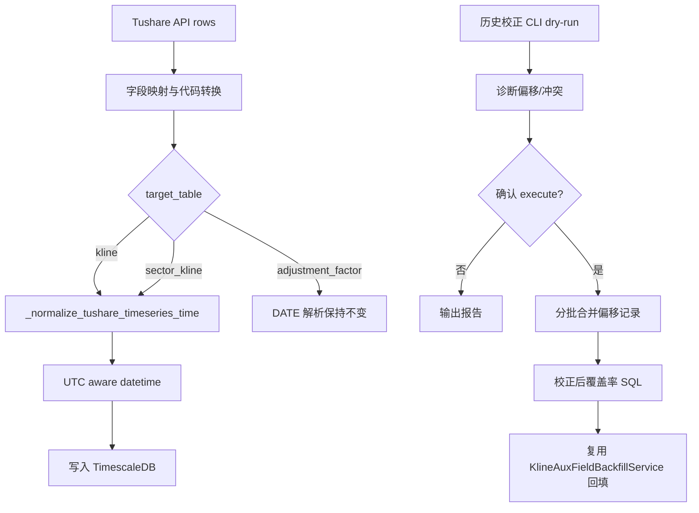

# Tushare 时序数据日期时区修复 Design

## Overview

本设计修复 Tushare 时序行情导入中的交易日时区偏移问题，并提供历史数据校正方案。核心策略分两层：

1. **入口修复**：所有 Tushare 写入 `kline/sector_kline` 的 `trade_date` 解析统一走一个 timezone-aware UTC 规范化函数，阻止新数据继续写成 `16:00:00+00`。
2. **历史修复**：提供 dry-run 优先的数据校正工具，将已经错写到前一日 `16:00:00+00` 的日级记录归并到正确交易日 `00:00:00+00`，并在校正后复用现有 `KlineAuxFieldBackfillService` 回填辅助字段。

`adjustment_factor` 保持 `DATE` 语义，PostgreSQL Tushare 业务表不做时区迁移。

## 2026-04 残留重复日线补充分析

### 来源判断

当前仍能观察到 `2026-04-27 16:00:00+00` 这类记录。该时间戳按 Asia/Shanghai 展示为 `2026-04-28 00:00:00`，其语义实际是 Tushare `trade_date=20260428`。

来源链路为：

1. 旧版 Tushare 写入代码将 `trade_date=20260428` 解析为 naive `datetime(2026, 4, 28, 0, 0, 0)`。
2. 写入 `TIMESTAMPTZ` 时，数据库/session 按 Asia/Shanghai 解释 naive 时间。
3. PostgreSQL 存储/展示为 UTC 后变成 `2026-04-27 16:00:00+00`。
4. 入口修复生效后，同一交易日又按 UTC aware 规范写入 `2026-04-28 00:00:00+00`。
5. 因唯一键包含精确 `time`，两条记录不会冲突，从而形成同一股票同一本地交易日重复。

因此本轮补充修复处理的是**旧数据残留与新规范数据并存**，不是再次修改入口解析逻辑。

### 为什么此前修复后仍有残留

现有 `scripts/repair_tushare_timeseries_timezone.py` 的方向是正确的：将 `16:00 UTC` 候选归并到 `time + interval '8 hours'`。但此前运行记录只覆盖了部分目标日期，例如 `2026-04-29`，没有对 `2026-04-28` 及更宽范围重新执行全量诊断。因此 `2026-04-27 16:00:00+00 -> 2026-04-28 00:00:00+00` 这批仍留在库里。

本轮设计保留现有脚本作为执行入口，补强诊断、冲突差异报告和完成后重复验证，避免另起一套清理脚本。

## Design Principles

- **单一日期解析入口**：禁止在 `_write_to_kline/_write_to_sector_kline` 中继续内联 `datetime.strptime(...)`。
- **日级与分钟级分开处理**：日/周/月 K 线使用交易日 `00:00:00+00`；分钟级保留实际分钟时间，显式转为 UTC。
- **先诊断后修改**：历史校正默认 dry-run，只有明确传入执行参数才写库。
- **批次事务安全**：按日期范围或小批量迁移，每批独立事务，失败回滚当前批。
- **最小业务侵入**：不改 Tushare 注册表接口语义，不改 `daily_basic/stk_limit` 回填逻辑，只修其匹配前提。
- **可重复执行**：修复脚本应幂等，多次运行不会制造重复或破坏唯一索引。

## Architecture



## Impact Analysis

### 受影响写入函数

- `app/tasks/tushare_import.py::_write_to_kline`
  - 覆盖股票、指数、实时/历史日线、周线、月线、分钟相关目标表为 `kline` 的接口。
  - 当前风险：`datetime.strptime(str(trade_date_str), "%Y%m%d")` 生成 naive datetime。

- `app/tasks/tushare_import.py::_write_to_sector_kline`
  - 覆盖同花顺、东方财富、通达信、申万、中信等板块行情接口。
  - 当前风险：同样使用 naive datetime。

### 不纳入同类修复的写入

- `app/tasks/tushare_import.py::_write_to_adjustment_factor`
  - 使用 Python `date` 写入 `DATE` 字段，不会发生 TIMESTAMPTZ 时区偏移。

- PostgreSQL Tushare 业务表
  - 大部分交易日字段为字符串或 `DATE`，`created_at/updated_at` 属系统时间戳，不是 Tushare 交易日解析问题。

## Technical Plan

### 1. 新增统一时间规范化函数

文件：`app/tasks/tushare_import.py`

新增函数：

```python
def _parse_tushare_trade_date_utc(value: object) -> datetime | None:
    """解析 Tushare YYYYMMDD 交易日为 UTC 00:00 aware datetime。"""

def _parse_tushare_datetime_utc(value: object) -> datetime | None:
    """解析 Tushare 分钟/实时字段为 UTC aware datetime。"""

def _normalize_tushare_timeseries_time(row: dict, freq: str) -> datetime | None:
    """根据 freq 和 row 字段生成写入 kline/sector_kline 的规范时间。"""
```

行为：

- 接受 `YYYYMMDD`、`YYYY-MM-DD`、`date`、`datetime`。
- 对纯交易日返回 `datetime(year, month, day, tzinfo=timezone.utc)`。
- 对已经带 tzinfo 的 datetime 转为 UTC。
- 对 naive datetime 按 UTC 处理并补 tzinfo，避免交给 DB/session 猜测时区。
- 无效值返回 `None`，调用方保持跳过行的现有行为。

新增辅助：

```python
def _is_intraday_freq(freq: str) -> bool:
    """判断是否为分钟级/盘中频率。"""
```

初始规则：

- 日级：`1d/1w/1M/d/w/m`。
- 分钟级：`1m/5m/15m/30m/60m/min/分钟` 等。

规范化策略：

- 日级/周级/月级：使用 `trade_date`，统一返回 UTC `00:00:00+00`。
- 分钟级/盘中：优先解析 `trade_time/time/datetime/trade_datetime` 等具体时间字段；如只返回 `trade_date`，则退化为交易日 UTC `00:00:00+00` 并记录 debug 日志，不制造 naive datetime。
- 无效字段返回 `None`，调用方沿用现有跳过行行为。

### 2. 传递运行时频率

文件：`app/tasks/tushare_import.py`

当前 `_write_to_timescaledb` 只使用：

```python
freq = entry.extra_config.get("freq", "1d")
```

这会让 `stk_mins/rt_min/idx_mins` 等依赖用户 `freq` 参数的接口在写入时丢失运行时频率。修复方案：

- 给 `WriteContext` 增加 `runtime_freq: str | None = None`。
- 在单次、按日期、按代码、按代码+日期等写入路径中，把 `params.get("freq")` 或 `call_params.get("freq")` 写入 `WriteContext.runtime_freq`。
- `_write_rows_with_policy -> _write_to_timescaledb` 透传 `runtime_freq`。
- `_write_to_timescaledb` 频率选择优先级：`runtime_freq` > `entry.extra_config["freq"]` > `"1d"`。
- 历史校正仍只处理 `1d/1w/1M`，分钟频率不参与 `16:00` 日级偏移修复。

### 3. 修改 Tushare kline 写入

文件：`app/tasks/tushare_import.py`

修改 `_write_to_kline`：

- 用 `_normalize_tushare_timeseries_time(row, freq)` 替代内联 `datetime.strptime(...)`。
- 参数 `time` 必须是 timezone-aware UTC。
- 保持 `ON CONFLICT ("time", "symbol", "freq", "adj_type") DO UPDATE`。
- 保持无效行跳过、批量写入失败回退逐行的现有行为。

修改 `_write_to_sector_kline`：

- 同样使用 `_normalize_tushare_timeseries_time(row, freq)`。
- 保持 `ON CONFLICT ("time", "sector_code", "data_source", "freq") DO UPDATE`。

### 4. 历史偏移数据诊断与校正工具

新增文件建议：`scripts/repair_tushare_timeseries_timezone.py`

CLI 参数：

```bash
/Users/poper/ContestTrade/yes/bin/python scripts/repair_tushare_timeseries_timezone.py \
  --table kline \
  --start-date 2026-04-01 \
  --end-date 2026-04-30 \
  --freq 1d \
  --dry-run
```

参数设计：

- `--table`: `kline` 或 `sector_kline`。
- `--start-date`, `--end-date`: 交易日闭区间，格式 `YYYY-MM-DD` 或 `YYYYMMDD`。
- `--freq`: 可重复传入；默认 `1d`，可支持 `1w/1M`。
- `--execute`: 执行写库；未传则 dry-run。
- `--batch-days`: 每批交易日数量，默认 5。
- `--repair-kline-aux`: 仅 `kline` 可用，校正后触发辅助字段补跑。

dry-run 输出：

- 偏移候选行数：`extract(hour from time)=16` 且 `freq` 为日级。
- 目标时间：`time + interval '8 hours'`。
- 冲突行数：目标主键已经存在的记录。
- 可直接平移行数：目标主键不存在的记录。
- 样例 10 条。
- 2026-04-29 这类关键日期的目标覆盖率。

补充 dry-run 输出：

- 按目标交易日分布的 `16:00 UTC -> 00:00 UTC` 候选数量。
- 冲突记录中 OHLCV 是否与目标规范记录不同的计数。
- 同一本地交易日重复记录数量，验证维度为 `symbol/freq/adj_type/date(time at time zone 'Asia/Shanghai')`。

### 5. kline 历史校正算法

目标主键：

```text
(target_time, symbol, freq, adj_type)
target_time = time + interval '8 hours'
```

处理逻辑：

1. 选出候选偏移记录：
   - `freq in ('1d','1w','1M')`
   - `extract(hour from time at time zone 'UTC') = 16`
   - `time >= start_date - interval '1 day' + interval '16 hours'`
   - `time < end_date + interval '16 hours'`

2. 对目标主键不存在的候选：
   - 直接 `UPDATE kline SET time = time + interval '8 hours'`。

3. 对目标主键已存在的候选：
   - 合并到目标记录：
     - OHLCV/amount 保留目标规范记录已有非空值，只使用偏移记录的非空值补齐目标空值。
     - `turnover/vol_ratio/limit_up/limit_down` 使用非空值补齐。
   - 删除偏移记录。

4. 每批事务：
   - 先合并冲突记录；
   - 再移动非冲突记录；
   - 最后校验该批无剩余目标范围内偏移候选。

5. 对冲突记录的字段优先级：
   - `open/high/low/close/volume/amount`：保留目标规范记录已有非空值，仅当目标为空时使用偏移记录补齐。
   - `turnover/vol_ratio/limit_up/limit_down`：同样只补空值，避免覆盖后续辅助字段回填结果。
   - 如果源/目标 OHLCV 非空且不一致，dry-run 报告差异数量和样例；execute 不覆盖目标值。

示意 SQL 结构：

```sql
with candidates as (...),
conflicts as (...),
merged as (
  update kline dst
  set open = coalesce(dst.open, src.open),
      ...
  from conflicts c
  join kline src on ...
  where dst.time = c.target_time
    and dst.symbol = c.symbol
    and dst.freq = c.freq
    and dst.adj_type = c.adj_type
  returning src.time, src.symbol, src.freq, src.adj_type
),
deleted as (
  delete from kline k using merged m
  where k.time = m.time ...
),
moved as (
  update kline
  set time = time + interval '8 hours'
  where ...
    and not exists (select 1 from kline dst where dst primary key = target)
  returning 1
)
select counts;
```

### 5.1 残留重复验证 SQL

去重前后使用以下维度验证同一本地交易日重复：

```sql
select
  symbol,
  freq,
  adj_type,
  date(time at time zone 'Asia/Shanghai') as local_trade_date,
  count(*) as rows,
  min(time) as min_time,
  max(time) as max_time
from kline
where freq in ('1d', '1w', '1M')
  and adj_type = 0
  and time >= timestamp :start_date - interval '8 hours'
  and time < timestamp :end_next
group by symbol, freq, adj_type, date(time at time zone 'Asia/Shanghai')
having count(*) > 1
order by local_trade_date desc, symbol
limit 50;
```

完成标准：

- 指定范围内 `16:00 UTC` 偏移候选为 0；
- 指定范围内同一 `symbol/freq/adj_type/local_trade_date` 重复为 0；
- 抽样股票的最近日线序列不再出现相邻两条映射到同一本地交易日。

### 6. sector_kline 历史校正算法

目标主键：

```text
(target_time, sector_code, data_source, freq)
target_time = time + interval '8 hours'
```

处理逻辑与 `kline` 一致，但字段集合为：

- `open/high/low/close/volume/amount/turnover/change_pct`

注意：

- 当前数据库 introspection 显示 `sector_kline.time` 是 `timestamp without time zone`，但模型和业务语义按时序 K 线处理。
- 历史校正仍按小时分布识别 `16:00:00` 偏移；SQL 对 `sector_kline` 使用 `extract(hour from time)`，不使用 `at time zone 'UTC'`。
- 不在本次 scope 内强制做 DDL 类型迁移；如果后续要把 `sector_kline.time` 改为 `TIMESTAMPTZ`，需单独 migration spec。

### 7. 辅助字段补跑

文件：`app/services/data_engine/kline_aux_field_backfill.py`

优先复用现有服务：

- `backfill_daily_basic_rows(rows)` 适合导入 hook 场景；
- `backfill_stk_limit_table(start_date, end_date)` 已存在；
- 需要新增或确认 `daily_basic` 历史来源：
  - 目前 `daily_basic` 主表策略是只保留最新日指标，历史导入主要通过 hook 即时回填。
  - 对于 2026-04-29 这种源 rows 已经在导入任务中出现但未持久化历史表的场景，推荐修复后重跑 `daily_basic` 指定日期范围，让 hook 重新回填。

建议补跑顺序：

1. 修复 `kline` 历史时间。
2. 重跑 `daily_basic` 范围 `20260429~20260429` 或目标缺口范围。
3. 重跑 `stk_limit` 范围 `20260429~20260429`，或调用 `backfill_stk_limit_table`。
4. 运行覆盖率 SQL 验证。

### 8. 诊断 SQL

轻量诊断避免全表重聚合，必须带日期范围和频率：

```sql
select time::date as utc_date,
       extract(hour from time) as hour_utc,
       freq,
       count(*) as rows
from kline
where freq in ('1d','1w','1M')
  and time >= timestamp '2026-04-01'
  and time < timestamp '2026-05-01'
group by time::date, extract(hour from time), freq
order by utc_date desc, hour_utc;
```

`sector_kline` 诊断使用同样日期范围，但小时判断按本地 timestamp：

```sql
select time::date as stored_date,
       extract(hour from time) as stored_hour,
       freq,
       data_source,
       count(*) as rows
from sector_kline
where freq in ('1d','1w','1M')
  and time >= timestamp '2026-04-01'
  and time < timestamp '2026-05-01'
group by time::date, extract(hour from time), freq, data_source
order by stored_date desc, stored_hour, data_source;
```

2026-04-29 个股覆盖验证：

```sql
select time::date as trade_date,
       count(*) as stock_kline_rows,
       count(turnover) as turnover_rows,
       count(vol_ratio) as vol_ratio_rows,
       count(limit_up) as limit_up_rows,
       count(limit_down) as limit_down_rows
from kline
where freq = '1d'
  and adj_type = 0
  and time >= timestamp '2026-04-29'
  and time < timestamp '2026-04-30'
  and (
    symbol like '000%.SZ' or symbol like '001%.SZ' or symbol like '002%.SZ' or
    symbol like '003%.SZ' or symbol like '300%.SZ' or symbol like '301%.SZ' or
    symbol like '600%.SH' or symbol like '601%.SH' or symbol like '603%.SH' or
    symbol like '605%.SH' or symbol like '688%.SH' or
    symbol like '43%.BJ' or symbol like '82%.BJ' or symbol like '83%.BJ' or
    symbol like '87%.BJ' or symbol like '88%.BJ' or symbol like '92%.BJ'
  )
group by time::date;
```

### 9. Tests

新增/更新测试：

- `tests/tasks/test_tushare_import_timefreqfix.py`
  - 或新增 `tests/tasks/test_tushare_import_timezone.py`。
  - 覆盖 `_parse_tushare_trade_date_utc`：
    - `20260429 -> 2026-04-29T00:00:00+00:00`
    - `2026-04-29 -> 2026-04-29T00:00:00+00:00`
    - aware datetime 转 UTC
    - invalid 返回 `None`
  - 覆盖 `_normalize_tushare_timeseries_time`：
    - 日级 `trade_date` 返回 UTC 零点；
    - 分钟级具体时间字段返回 UTC aware datetime；
    - 运行时 `freq` 透传到写入参数。
  - 覆盖 `_write_to_kline` 参数中的 `time.tzinfo is timezone.utc`。
  - 覆盖 `_write_to_sector_kline` 参数中的 `time.tzinfo is timezone.utc`。
  - 覆盖 `_write_to_adjustment_factor` 仍写入 `date`。

- 新增脚本测试：
  - dry-run SQL 构建不执行写库；
  - execute=false 不调用 update/delete；
  - 冲突合并 SQL 包含目标主键判断；
  - 参数缺失或范围非法时退出。

## Backward Compatibility

- 新导入的日级时序数据统一落到 UTC 日期点，会改变此前错误写入的 `16:00:00+00` 表现，但这是修复目标。
- 历史偏移数据不会在代码发布时自动修改；必须显式运行 repair 脚本。
- `adjustment_factor`、PG Tushare 原始表、用户/交易/风控等业务表不受影响。
- `kline` 查询方如果已经按 `date(time)` 查询，将在历史校正后看到正确交易日；如果某些代码依赖错误的前一日 `16:00:00+00`，需要随验证阶段排查。
- 本轮补充去重沿用既有 `repair_tushare_timeseries_timezone.py`，兼容此前已经执行过的日期；重复执行只会处理剩余候选，不会重新移动规范记录。

## Operational Runbook

1. 部署代码修复并重启 Celery worker。
2. dry-run 检查：

```bash
/Users/poper/ContestTrade/yes/bin/python scripts/repair_tushare_timeseries_timezone.py \
  --table kline --start-date 2026-04-01 --end-date 2026-04-30 --freq 1d --dry-run
```

3. 若 dry-run 输出符合预期，执行：

```bash
/Users/poper/ContestTrade/yes/bin/python scripts/repair_tushare_timeseries_timezone.py \
  --table kline --start-date 2026-04-01 --end-date 2026-04-30 --freq 1d --execute
```

4. 如板块 K 线存在同类偏移，再执行 `sector_kline` 修复。
5. 重跑 `daily_basic/stk_limit` 缺口日期或对应回填。
6. 运行覆盖率 SQL 验证 2026-04-29。

## Risks And Mitigations

- **风险：全表聚合拖慢 TimescaleDB。**
  - 缓解：所有诊断和修复 SQL 必须带日期范围和频率；脚本默认小批次。

- **风险：冲突合并误覆盖更准确记录。**
  - 缓解：合并只用非空值补齐，不盲目覆盖目标已有值；如需覆盖策略变更，单独参数控制。

- **风险：OHLCV 冲突代表两条记录来自不同数据源批次。**
  - 缓解：dry-run 输出差异计数和样例；execute 保留目标规范记录，偏移记录只补空字段并删除。

- **风险：分钟数据被误判。**
  - 缓解：默认仅修 `freq in ('1d','1w','1M')`；分钟频率不进入日级偏移修复。

- **风险：`sector_kline.time` 类型与模型不一致。**
  - 缓解：本次只修值，不做 DDL；后续如需统一类型另起 spec。
